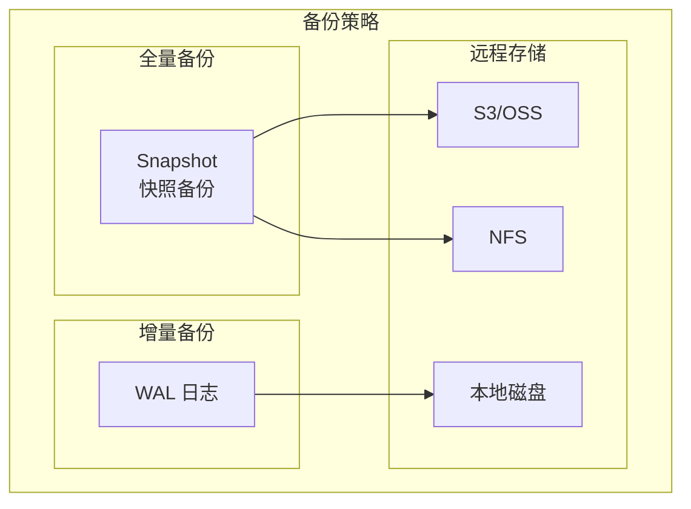
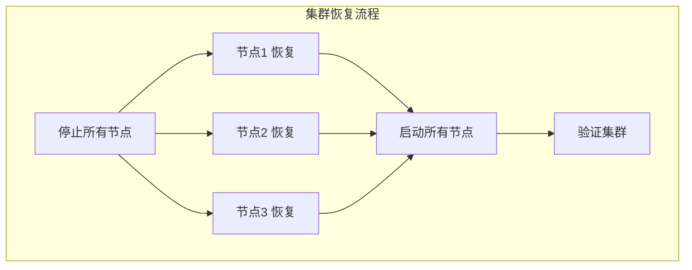

本文详细介绍 etcd 的备份恢复策略，包括快照备份、增量备份、恢复流程和自动化方案。

## 1. 备份概述

### 1.1 备份策略



### 1.2 备份内容

```
etcd 数据目录结构:
/var/lib/etcd/
├── member/
│   ├── snap/
│   │   ├── 0000000000000001-0000000000000001.snap
│   │   └── db  (BoltDB 数据文件)
│   └── wal/
│       ├── 0000000000000001-0000000000000001.wal
│       ├── 0000000000000001-0000000000000002.wal
│       └── ...
└── ...

备份内容:
├── 快照备份 (推荐)
│   └── 包含完整的数据库状态
└── 增量备份 (可选)
    └── WAL 日志用于更细粒度恢复
```

## 2. 快照备份

### 2.1 手动创建快照

```bash
# 创建快照
etcdctl snapshot save /backup/etcd-snapshot.db \
    --endpoints=https://etcd-1:2379 \
    --cacert=/etc/kubernetes/pki/etcd/ca.crt \
    --cert=/etc/kubernetes/pki/etcd/healthcheck-client.crt \
    --key=/etc/kubernetes/pki/etcd/healthcheck-client.key

# 验证快照
etcdctl snapshot status /backup/etcd-snapshot.db --write-out=table

# 输出示例:
# +----------+----------+------------+------------+
# |   HASH   | REVISION | TOTAL KEYS | TOTAL SIZE |
# +----------+----------+------------+------------+
# | f3e9893e |   123456 |       1024 |     2.1 MB |
# +----------+----------+------------+------------+
```

### 2.2 快照 API

```go
// 快照 API
// client/v3/maintenance.go

type Maintenance interface {
    // 创建快照
    Snapshot(ctx context.Context) (io.ReadCloser, error)

    // 状态检查
    Status(ctx context.Context, endpoint string) (*StatusResponse, error)

    // 碎片整理
    Defragment(ctx context.Context, endpoint string) (*DefragmentResponse, error)
}

// 使用示例
func saveSnapshot(client *clientv3.Client, path string) error {
    ctx, cancel := context.WithTimeout(context.Background(), 5*time.Minute)
    defer cancel()

    // 获取快照流
    reader, err := client.Snapshot(ctx)
    if err != nil {
        return err
    }
    defer reader.Close()

    // 写入文件
    f, err := os.Create(path)
    if err != nil {
        return err
    }
    defer f.Close()

    _, err = io.Copy(f, reader)
    return err
}
```

### 2.3 自动快照脚本

```bash
#!/bin/bash
# etcd 自动快照脚本

set -e

# 配置
BACKUP_DIR="/backup/etcd"
RETENTION_DAYS=7
ENDPOINTS="https://etcd-1:2379"
CACERT="/etc/kubernetes/pki/etcd/ca.crt"
CERT="/etc/kubernetes/pki/etcd/healthcheck-client.crt"
KEY="/etc/kubernetes/pki/etcd/healthcheck-client.key"

# 创建备份目录
mkdir -p ${BACKUP_DIR}

# 生成备份文件名
DATE=$(date +%Y%m%d_%H%M%S)
BACKUP_FILE="${BACKUP_DIR}/etcd-snapshot-${DATE}.db"

# 创建快照
echo "Creating snapshot: ${BACKUP_FILE}"
etcdctl snapshot save ${BACKUP_FILE} \
    --endpoints=${ENDPOINTS} \
    --cacert=${CACERT} \
    --cert=${CERT} \
    --key=${KEY}

# 验证快照
echo "Verifying snapshot..."
etcdctl snapshot status ${BACKUP_FILE} --write-out=table

# 压缩备份
echo "Compressing snapshot..."
gzip ${BACKUP_FILE}

# 清理旧备份
echo "Cleaning old backups (older than ${RETENTION_DAYS} days)..."
find ${BACKUP_DIR} -name "etcd-snapshot-*.db.gz" -mtime +${RETENTION_DAYS} -delete

# 上传到远程存储 (可选)
if [ -n "${S3_BUCKET}" ]; then
    echo "Uploading to S3..."
    aws s3 cp ${BACKUP_FILE}.gz s3://${S3_BUCKET}/etcd-backups/
fi

echo "Backup completed: ${BACKUP_FILE}.gz"
```

### 2.4 CronJob 配置

```yaml
# Kubernetes CronJob 定时备份
apiVersion: batch/v1
kind: CronJob
metadata:
  name: etcd-backup
  namespace: kube-system
spec:
  schedule: "0 */6 * * *"  # 每 6 小时
  concurrencyPolicy: Forbid
  successfulJobsHistoryLimit: 3
  failedJobsHistoryLimit: 3
  jobTemplate:
    spec:
      template:
        spec:
          containers:
          - name: etcd-backup
            image: registry.k8s.io/etcd:3.5.9-0
            command:
            - /bin/sh
            - -c
            - |
              etcdctl snapshot save /backup/etcd-$(date +%Y%m%d-%H%M%S).db \
                --endpoints=https://etcd-1:2379 \
                --cacert=/etc/kubernetes/pki/etcd/ca.crt \
                --cert=/etc/kubernetes/pki/etcd/healthcheck-client.crt \
                --key=/etc/kubernetes/pki/etcd/healthcheck-client.key
            volumeMounts:
            - name: etcd-certs
              mountPath: /etc/kubernetes/pki/etcd
              readOnly: true
            - name: backup
              mountPath: /backup
          restartPolicy: OnFailure
          volumes:
          - name: etcd-certs
            hostPath:
              path: /etc/kubernetes/pki/etcd
          - name: backup
            persistentVolumeClaim:
              claimName: etcd-backup-pvc
          nodeSelector:
            node-role.kubernetes.io/control-plane: ""
          tolerations:
          - effect: NoSchedule
            key: node-role.kubernetes.io/control-plane
```

## 3. 恢复流程

### 3.1 单节点恢复

```bash
# 1. 停止 etcd 服务
systemctl stop etcd

# 2. 备份当前数据目录 (可选)
mv /var/lib/etcd /var/lib/etcd.backup

# 3. 从快照恢复
etcdctl snapshot restore /backup/etcd-snapshot.db \
    --name etcd-1 \
    --initial-cluster etcd-1=https://etcd-1:2380 \
    --initial-cluster-token etcd-cluster-1 \
    --initial-advertise-peer-urls https://etcd-1:2380 \
    --data-dir /var/lib/etcd

# 4. 设置正确的权限
chown -R etcd:etcd /var/lib/etcd

# 5. 启动 etcd 服务
systemctl start etcd

# 6. 验证恢复
etcdctl endpoint health
```

### 3.2 集群恢复



```bash
# 在所有节点上执行以下步骤

# 节点 1
etcdctl snapshot restore /backup/etcd-snapshot.db \
    --name etcd-1 \
    --initial-cluster etcd-1=https://etcd-1:2380,etcd-2=https://etcd-2:2380,etcd-3=https://etcd-3:2380 \
    --initial-cluster-token etcd-cluster-1 \
    --initial-advertise-peer-urls https://etcd-1:2380 \
    --data-dir /var/lib/etcd

# 节点 2
etcdctl snapshot restore /backup/etcd-snapshot.db \
    --name etcd-2 \
    --initial-cluster etcd-1=https://etcd-1:2380,etcd-2=https://etcd-2:2380,etcd-3=https://etcd-3:2380 \
    --initial-cluster-token etcd-cluster-1 \
    --initial-advertise-peer-urls https://etcd-2:2380 \
    --data-dir /var/lib/etcd

# 节点 3
etcdctl snapshot restore /backup/etcd-snapshot.db \
    --name etcd-3 \
    --initial-cluster etcd-1=https://etcd-1:2380,etcd-2=https://etcd-2:2380,etcd-3=https://etcd-3:2380 \
    --initial-cluster-token etcd-cluster-1 \
    --initial-advertise-peer-urls https://etcd-3:2380 \
    --data-dir /var/lib/etcd

# 同时启动所有节点
# (在所有节点上)
systemctl start etcd

# 验证集群状态
etcdctl endpoint status --cluster --write-out=table
etcdctl endpoint health --cluster
```

### 3.3 恢复脚本

```bash
#!/bin/bash
# etcd 集群恢复脚本

set -e

# 配置
SNAPSHOT_FILE=$1
if [ -z "$SNAPSHOT_FILE" ]; then
    echo "Usage: $0 <snapshot-file>"
    exit 1
fi

# 集群配置
CLUSTER_TOKEN="etcd-cluster-restored"
INITIAL_CLUSTER="etcd-1=https://etcd-1:2380,etcd-2=https://etcd-2:2380,etcd-3=https://etcd-3:2380"

# 本节点信息 (需要根据实际情况修改)
NODE_NAME=$(hostname)
PEER_URL="https://${NODE_NAME}:2380"
DATA_DIR="/var/lib/etcd"

echo "=== Restoring etcd on ${NODE_NAME} ==="

# 1. 停止 etcd
echo "Stopping etcd..."
systemctl stop etcd || true

# 2. 备份旧数据
if [ -d "${DATA_DIR}" ]; then
    echo "Backing up old data..."
    mv ${DATA_DIR} ${DATA_DIR}.backup.$(date +%Y%m%d_%H%M%S)
fi

# 3. 解压快照 (如果是压缩的)
if [[ "${SNAPSHOT_FILE}" == *.gz ]]; then
    echo "Decompressing snapshot..."
    gunzip -k ${SNAPSHOT_FILE}
    SNAPSHOT_FILE=${SNAPSHOT_FILE%.gz}
fi

# 4. 恢复快照
echo "Restoring snapshot..."
etcdctl snapshot restore ${SNAPSHOT_FILE} \
    --name ${NODE_NAME} \
    --initial-cluster ${INITIAL_CLUSTER} \
    --initial-cluster-token ${CLUSTER_TOKEN} \
    --initial-advertise-peer-urls ${PEER_URL} \
    --data-dir ${DATA_DIR}

# 5. 设置权限
echo "Setting permissions..."
chown -R etcd:etcd ${DATA_DIR}

# 6. 启动 etcd
echo "Starting etcd..."
systemctl start etcd

# 7. 等待就绪
echo "Waiting for etcd to be ready..."
sleep 5

# 8. 验证
echo "Verifying..."
etcdctl endpoint health

echo "=== Restore completed on ${NODE_NAME} ==="
```

## 4. 灾难恢复

### 4.1 全量数据丢失恢复

```bash
# 场景: 所有节点数据丢失，只有快照备份

# 1. 从远程存储下载最新快照
aws s3 cp s3://my-bucket/etcd-backups/latest.db.gz /tmp/
gunzip /tmp/latest.db.gz

# 2. 在每个节点上恢复
# (参考集群恢复流程)

# 3. 验证 Kubernetes 集群状态
kubectl get nodes
kubectl get pods --all-namespaces
```

### 4.2 部分节点故障恢复

```bash
# 场景: 集群仍有多数节点可用

# 1. 检查集群状态
etcdctl member list

# 2. 移除故障成员
etcdctl member remove <member-id>

# 3. 添加新成员
etcdctl member add etcd-new --peer-urls=https://etcd-new:2380

# 4. 在新节点上启动 etcd
etcd --name etcd-new \
    --initial-cluster-state existing \
    --initial-cluster etcd-1=https://etcd-1:2380,etcd-2=https://etcd-2:2380,etcd-new=https://etcd-new:2380 \
    ...
```

### 4.3 数据损坏恢复

```bash
# 场景: 数据损坏但集群仍在运行

# 1. 创建最新快照
etcdctl snapshot save /tmp/current-snapshot.db

# 2. 停止所有节点

# 3. 从快照恢复
# (参考集群恢复流程)

# 4. 如果快照也损坏，尝试从其他节点复制
# 在健康节点上:
rsync -av /var/lib/etcd/ etcd-damaged:/var/lib/etcd/
```

## 5. Velero 集成

### 5.1 Velero 配置

```yaml
# Velero BackupStorageLocation
apiVersion: velero.io/v1
kind: BackupStorageLocation
metadata:
  name: default
  namespace: velero
spec:
  provider: aws
  objectStorage:
    bucket: my-velero-bucket
    prefix: etcd-backups
  config:
    region: us-west-2
```

### 5.2 etcd 备份插件

```yaml
# Velero Schedule 配置
apiVersion: velero.io/v1
kind: Schedule
metadata:
  name: etcd-backup
  namespace: velero
spec:
  schedule: "0 */6 * * *"
  template:
    includedNamespaces:
    - kube-system
    includeClusterResources: true
    storageLocation: default
    hooks:
      resources:
      - name: etcd-backup-hook
        includedNamespaces:
        - kube-system
        labelSelector:
          matchLabels:
            component: etcd
        pre:
        - exec:
            container: etcd
            command:
            - /bin/sh
            - -c
            - etcdctl snapshot save /backup/etcd-snapshot.db
            onError: Fail
            timeout: 5m
```

## 6. 备份验证

### 6.1 定期验证脚本

```bash
#!/bin/bash
# etcd 备份验证脚本

set -e

BACKUP_FILE=$1
TEST_DATA_DIR="/tmp/etcd-verify-$(date +%s)"

echo "=== Verifying etcd backup: ${BACKUP_FILE} ==="

# 1. 检查快照状态
echo "Checking snapshot status..."
etcdctl snapshot status ${BACKUP_FILE} --write-out=table

# 2. 尝试恢复到临时目录
echo "Restoring to temporary directory..."
etcdctl snapshot restore ${BACKUP_FILE} \
    --name test-restore \
    --initial-cluster test-restore=http://localhost:12380 \
    --initial-advertise-peer-urls http://localhost:12380 \
    --data-dir ${TEST_DATA_DIR}

# 3. 启动临时 etcd 实例
echo "Starting temporary etcd instance..."
etcd --name test-restore \
    --data-dir ${TEST_DATA_DIR} \
    --listen-client-urls http://localhost:12379 \
    --advertise-client-urls http://localhost:12379 \
    --listen-peer-urls http://localhost:12380 &

ETCD_PID=$!
sleep 5

# 4. 验证数据
echo "Verifying data..."
KEYS=$(etcdctl --endpoints=http://localhost:12379 get "" --prefix --keys-only | wc -l)
echo "Total keys: ${KEYS}"

# 5. 清理
echo "Cleaning up..."
kill ${ETCD_PID} 2>/dev/null || true
rm -rf ${TEST_DATA_DIR}

echo "=== Verification completed successfully ==="
```

### 6.2 自动化验证

```yaml
# 验证 CronJob
apiVersion: batch/v1
kind: CronJob
metadata:
  name: etcd-backup-verify
  namespace: kube-system
spec:
  schedule: "0 2 * * *"  # 每天凌晨 2 点
  jobTemplate:
    spec:
      template:
        spec:
          containers:
          - name: verify
            image: registry.k8s.io/etcd:3.5.9-0
            command:
            - /bin/sh
            - -c
            - |
              # 获取最新备份
              LATEST=$(ls -t /backup/etcd-*.db | head -1)

              # 验证快照
              etcdctl snapshot status $LATEST --write-out=json | jq .

              # 检查完整性
              if etcdctl snapshot status $LATEST > /dev/null 2>&1; then
                echo "Backup verification: PASSED"
              else
                echo "Backup verification: FAILED"
                exit 1
              fi
            volumeMounts:
            - name: backup
              mountPath: /backup
              readOnly: true
          restartPolicy: OnFailure
          volumes:
          - name: backup
            persistentVolumeClaim:
              claimName: etcd-backup-pvc
```

## 7. 最佳实践

### 7.1 备份检查清单

| 检查项 | 频率 | 说明 |
|-------|------|------|
| 快照创建 | 每 6 小时 | 自动化备份 |
| 快照验证 | 每天 | 验证可恢复性 |
| 恢复演练 | 每月 | 完整恢复测试 |
| 远程同步 | 每次备份后 | 上传到远程存储 |
| 保留策略 | 每天 | 清理过期备份 |

### 7.2 RTO/RPO 规划

```
备份策略与 RPO/RTO:
├── RPO (Recovery Point Objective)
│   ├── 6 小时备份: RPO = 6 小时
│   ├── 1 小时备份: RPO = 1 小时
│   └── 实时复制: RPO ≈ 0
└── RTO (Recovery Time Objective)
    ├── 单节点恢复: 5-10 分钟
    ├── 集群恢复: 15-30 分钟
    └── 跨区域恢复: 30-60 分钟
```

### 7.3 安全建议

```bash
# 1. 加密备份
gpg --symmetric --cipher-algo AES256 etcd-snapshot.db

# 2. 安全传输
scp -i /path/to/key etcd-snapshot.db.gpg backup-server:/backup/

# 3. 访问控制
chmod 600 /backup/etcd-*.db
chown root:root /backup/etcd-*.db

# 4. 审计日志
echo "$(date): Backup created by $(whoami)" >> /var/log/etcd-backup.log
```

## 小结

本文介绍了 etcd 备份与恢复的完整方案：

1. **快照备份**：手动备份、自动备份脚本、CronJob 配置
2. **恢复流程**：单节点恢复、集群恢复、恢复脚本
3. **灾难恢复**：全量丢失、部分故障、数据损坏
4. **Velero 集成**：云原生备份方案
5. **备份验证**：定期验证、自动化测试
6. **最佳实践**：检查清单、RTO/RPO、安全建议

下一篇将介绍 etcd 集群运维操作。
