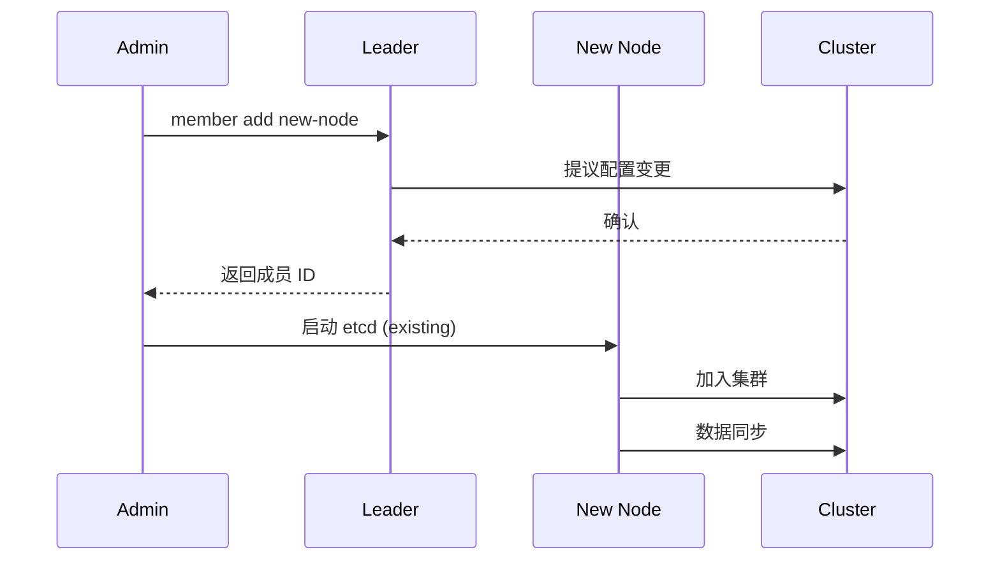
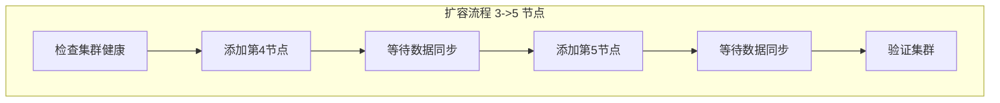
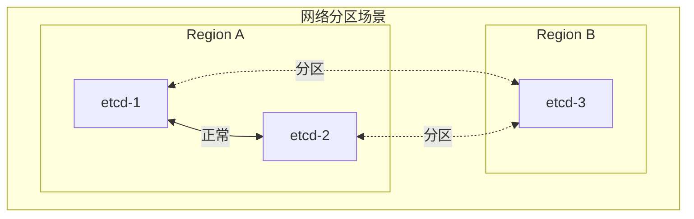
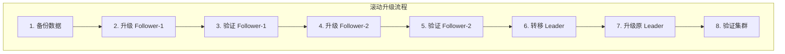
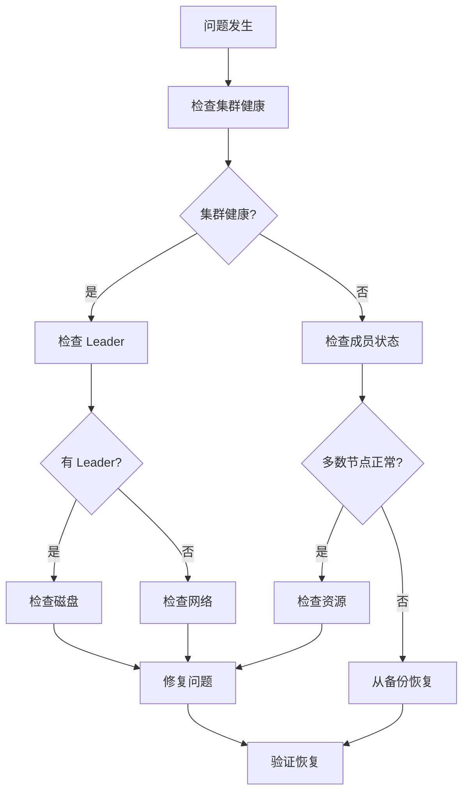

本文详细介绍 etcd 集群的运维操作，包括成员管理、扩缩容、故障处理、升级策略和日常维护。

## 1. 成员管理

### 1.1 集群成员查看

```bash
# 查看成员列表
etcdctl member list --write-out=table

# 输出示例:
# +------------------+---------+--------+------------------------+------------------------+------------+
# |        ID        | STATUS  |  NAME  |       PEER ADDRS       |      CLIENT ADDRS      | IS LEARNER |
# +------------------+---------+--------+------------------------+------------------------+------------+
# | 8e9e05c52164694d | started | etcd-1 | https://10.0.0.1:2380 | https://10.0.0.1:2379 |      false |
# | 91bc3c398fb3c146 | started | etcd-2 | https://10.0.0.2:2380 | https://10.0.0.2:2379 |      false |
# | fd422379fda50e48 | started | etcd-3 | https://10.0.0.3:2380 | https://10.0.0.3:2379 |      false |
# +------------------+---------+--------+------------------------+------------------------+------------+

# 查看端点状态
etcdctl endpoint status --cluster --write-out=table

# 查看端点健康状态
etcdctl endpoint health --cluster
```

### 1.2 添加成员



```bash
# 1. 在现有集群上添加成员
etcdctl member add etcd-4 --peer-urls=https://10.0.0.4:2380

# 输出:
# Member 8e9e05c52164694d added to cluster
# ETCD_NAME="etcd-4"
# ETCD_INITIAL_CLUSTER="etcd-1=https://10.0.0.1:2380,etcd-2=https://10.0.0.2:2380,etcd-3=https://10.0.0.3:2380,etcd-4=https://10.0.0.4:2380"
# ETCD_INITIAL_ADVERTISE_PEER_URLS="https://10.0.0.4:2380"
# ETCD_INITIAL_CLUSTER_STATE="existing"

# 2. 在新节点上启动 etcd
etcd --name etcd-4 \
    --initial-cluster etcd-1=https://10.0.0.1:2380,etcd-2=https://10.0.0.2:2380,etcd-3=https://10.0.0.3:2380,etcd-4=https://10.0.0.4:2380 \
    --initial-cluster-state existing \
    --initial-advertise-peer-urls https://10.0.0.4:2380 \
    --listen-peer-urls https://10.0.0.4:2380 \
    --listen-client-urls https://10.0.0.4:2379,https://127.0.0.1:2379 \
    --advertise-client-urls https://10.0.0.4:2379 \
    --data-dir /var/lib/etcd \
    --cert-file=/etc/kubernetes/pki/etcd/server.crt \
    --key-file=/etc/kubernetes/pki/etcd/server.key \
    --peer-cert-file=/etc/kubernetes/pki/etcd/peer.crt \
    --peer-key-file=/etc/kubernetes/pki/etcd/peer.key \
    --trusted-ca-file=/etc/kubernetes/pki/etcd/ca.crt \
    --peer-trusted-ca-file=/etc/kubernetes/pki/etcd/ca.crt \
    --peer-client-cert-auth \
    --client-cert-auth

# 3. 验证成员加入
etcdctl member list
```

### 1.3 添加 Learner 成员

```bash
# Learner 是只读成员，不参与投票，用于安全扩展集群

# 1. 添加 Learner
etcdctl member add etcd-learner \
    --peer-urls=https://10.0.0.5:2380 \
    --learner

# 2. 启动 Learner 节点
etcd --name etcd-learner \
    --initial-cluster-state existing \
    ...

# 3. 等待数据同步完成
# 检查 Learner 是否同步
etcdctl endpoint status --endpoints=https://10.0.0.5:2379

# 4. 提升为正式成员
etcdctl member promote <learner-member-id>
```

### 1.4 移除成员

```bash
# 1. 获取成员 ID
etcdctl member list

# 2. 移除成员
etcdctl member remove <member-id>

# 3. 停止被移除节点的 etcd 服务
# (在被移除节点上执行)
systemctl stop etcd

# 4. 清理数据目录 (可选)
rm -rf /var/lib/etcd
```

### 1.5 更新成员配置

```bash
# 更新成员的 Peer URL
etcdctl member update <member-id> --peer-urls=https://new-ip:2380

# 注意: 更新后需要重启对应节点的 etcd
```

## 2. 集群扩缩容

### 2.1 扩容流程



```bash
#!/bin/bash
# etcd 扩容脚本

set -e

# 检查集群健康
echo "Checking cluster health..."
etcdctl endpoint health --cluster
if [ $? -ne 0 ]; then
    echo "Cluster is not healthy, aborting scale up"
    exit 1
fi

# 添加新成员
for node in "etcd-4:10.0.0.4" "etcd-5:10.0.0.5"; do
    name=$(echo $node | cut -d: -f1)
    ip=$(echo $node | cut -d: -f2)

    echo "Adding member: $name"
    etcdctl member add $name --peer-urls=https://${ip}:2380 --learner

    echo "Waiting for $name to sync..."
    # 在新节点上启动 etcd (需要远程执行或手动操作)
    # ssh $ip "systemctl start etcd"

    # 等待同步
    sleep 30

    echo "Promoting $name to voter..."
    member_id=$(etcdctl member list | grep $name | cut -d, -f1)
    etcdctl member promote $member_id

    echo "$name added successfully"
done

# 验证
echo "Verifying cluster..."
etcdctl member list --write-out=table
etcdctl endpoint status --cluster --write-out=table
```

### 2.2 缩容流程

```bash
#!/bin/bash
# etcd 缩容脚本

set -e

# 要移除的成员
REMOVE_MEMBERS="etcd-4 etcd-5"

# 检查集群健康
echo "Checking cluster health..."
etcdctl endpoint health --cluster

# 确认缩容后仍有多数节点
current_members=$(etcdctl member list | wc -l)
remove_count=$(echo $REMOVE_MEMBERS | wc -w)
remaining=$((current_members - remove_count))

if [ $remaining -lt 2 ]; then
    echo "Error: Cannot remove $remove_count members, need at least 2 remaining"
    exit 1
fi

# 移除成员
for name in $REMOVE_MEMBERS; do
    echo "Removing member: $name"
    member_id=$(etcdctl member list | grep $name | cut -d, -f1)

    if [ -n "$member_id" ]; then
        etcdctl member remove $member_id
        echo "$name removed"
    else
        echo "$name not found"
    fi
done

# 验证
echo "Verifying cluster..."
etcdctl member list --write-out=table
```

### 2.3 扩缩容注意事项

```
扩缩容注意事项:
├── 一次只操作一个节点
├── 等待数据完全同步后再操作下一个
├── 使用 Learner 减少对集群的影响
├── 保持奇数个投票节点 (3, 5, 7)
├── 避免在业务高峰期操作
└── 始终保持多数节点可用
```

## 3. 故障处理

### 3.1 常见故障场景

| 故障场景 | 影响 | 恢复方法 |
|---------|------|---------|
| 单节点故障 | 可继续服务 | 替换故障节点 |
| 少数节点故障 | 可继续服务 | 修复或替换故障节点 |
| 多数节点故障 | 服务中断 | 从快照恢复 |
| 数据损坏 | 可能服务中断 | 从快照恢复 |
| 网络分区 | 可能脑裂 | 修复网络，处理数据冲突 |

### 3.2 单节点故障恢复

```bash
# 场景: etcd-2 节点故障

# 1. 检查集群状态
etcdctl endpoint health --cluster
etcdctl member list

# 2. 如果节点可恢复
# 2.1 修复节点问题
# 2.2 重启 etcd
systemctl restart etcd

# 3. 如果节点不可恢复，替换节点
# 3.1 移除故障成员
member_id=$(etcdctl member list | grep etcd-2 | cut -d, -f1)
etcdctl member remove $member_id

# 3.2 在新节点上添加成员
etcdctl member add etcd-2-new --peer-urls=https://10.0.0.6:2380

# 3.3 在新节点上启动 etcd
# (参考添加成员流程)
```

### 3.3 多数节点故障恢复

```bash
# 场景: 3 节点集群中 2 个节点故障，集群不可用

# 方案 1: 如果有最新快照
# 1. 获取最新快照
# 2. 在所有节点上恢复
# (参考备份恢复文档)

# 方案 2: 强制从单节点恢复 (数据可能丢失)
# 警告: 仅在无法获取快照时使用

# 1. 停止所有 etcd
systemctl stop etcd

# 2. 在存活节点上强制启动新集群
etcd --name etcd-1 \
    --force-new-cluster \
    --data-dir /var/lib/etcd \
    ...

# 3. 验证数据
etcdctl get "" --prefix --keys-only | wc -l

# 4. 添加其他节点
etcdctl member add etcd-2 --peer-urls=https://10.0.0.2:2380
etcdctl member add etcd-3 --peer-urls=https://10.0.0.3:2380
```

### 3.4 数据损坏处理

```bash
# 检测数据损坏
# 症状: etcd 启动失败，日志显示 "panic: unexpected end of data"

# 1. 尝试修复
etcd --data-dir=/var/lib/etcd --repair

# 2. 如果修复失败，从健康节点复制数据
# 在健康节点上:
systemctl stop etcd
rsync -av /var/lib/etcd/ damaged-node:/var/lib/etcd/

# 3. 如果所有节点数据都损坏，从快照恢复
```

### 3.5 网络分区处理



```bash
# 网络分区处理

# 1. 识别分区
# Region A (2 节点) 可能继续服务 (有多数)
# Region B (1 节点) 变为只读

# 2. 修复网络后
# 检查各节点的 Revision
etcdctl endpoint status --endpoints=https://etcd-1:2379,https://etcd-2:2379,https://etcd-3:2379 --write-out=table

# 3. 如果 Revision 差异过大
# 可能需要从高版本节点重新同步数据

# 4. 验证集群一致性
etcdctl check perf
```

## 4. 升级策略

### 4.1 升级检查清单

```
升级前检查:
├── 备份
│   ├── 创建最新快照
│   └── 验证快照可恢复
├── 兼容性
│   ├── 检查版本兼容性
│   └── 检查 API 变更
├── 资源
│   ├── 确认有足够磁盘空间
│   └── 确认网络稳定
└── 时间窗口
    └── 选择低峰期执行
```

### 4.2 滚动升级流程



```bash
#!/bin/bash
# etcd 滚动升级脚本

set -e

NEW_VERSION="3.5.9"
NODES="etcd-1 etcd-2 etcd-3"

# 1. 备份
echo "Creating backup..."
etcdctl snapshot save /backup/pre-upgrade-$(date +%Y%m%d_%H%M%S).db

# 2. 获取 Leader 信息
LEADER=$(etcdctl endpoint status --cluster --write-out=json | jq -r '.[] | select(.Status.leader == .Status.header.member_id) | .Endpoint' | head -1)
LEADER_NAME=$(echo $LEADER | sed 's/https:\/\/\([^:]*\):.*/\1/')
echo "Current leader: $LEADER_NAME"

# 3. 升级 Follower 节点
for node in $NODES; do
    if [ "$node" == "$LEADER_NAME" ]; then
        echo "Skipping leader $node for now"
        continue
    fi

    echo "Upgrading $node..."

    # SSH 到节点执行升级
    ssh $node << EOF
        systemctl stop etcd
        # 下载新版本
        curl -L https://github.com/etcd-io/etcd/releases/download/v${NEW_VERSION}/etcd-v${NEW_VERSION}-linux-amd64.tar.gz -o /tmp/etcd.tar.gz
        tar xzf /tmp/etcd.tar.gz -C /tmp
        cp /tmp/etcd-v${NEW_VERSION}-linux-amd64/etcd* /usr/local/bin/
        systemctl start etcd
EOF

    # 等待节点恢复
    echo "Waiting for $node to recover..."
    sleep 30

    # 验证
    etcdctl endpoint health --endpoints=https://${node}:2379
done

# 4. 转移 Leader
echo "Transferring leadership..."
etcdctl move-leader $(etcdctl member list | grep -v $LEADER_NAME | head -1 | cut -d, -f1)

# 5. 升级原 Leader
echo "Upgrading original leader: $LEADER_NAME"
ssh $LEADER_NAME << EOF
    systemctl stop etcd
    curl -L https://github.com/etcd-io/etcd/releases/download/v${NEW_VERSION}/etcd-v${NEW_VERSION}-linux-amd64.tar.gz -o /tmp/etcd.tar.gz
    tar xzf /tmp/etcd.tar.gz -C /tmp
    cp /tmp/etcd-v${NEW_VERSION}-linux-amd64/etcd* /usr/local/bin/
    systemctl start etcd
EOF

# 6. 验证
echo "Verifying cluster..."
sleep 30
etcdctl endpoint status --cluster --write-out=table
etcdctl endpoint health --cluster

echo "Upgrade completed!"
```

### 4.3 版本兼容性

```
etcd 版本兼容性:
├── etcd 3.4.x -> 3.5.x
│   ├── 支持滚动升级
│   ├── 向后兼容
│   └── 注意 API 废弃
├── etcd 3.5.x 内部版本
│   └── 无缝升级
└── 回滚
    ├── 3.5.x -> 3.4.x 支持
    └── 注意: 降级可能丢失新功能数据
```

## 5. 日常维护

### 5.1 健康检查

```bash
#!/bin/bash
# etcd 健康检查脚本

ENDPOINTS="https://etcd-1:2379,https://etcd-2:2379,https://etcd-3:2379"

echo "=== etcd Health Check ==="
echo "Time: $(date)"
echo ""

# 1. 端点健康
echo "--- Endpoint Health ---"
etcdctl endpoint health --endpoints=$ENDPOINTS --write-out=table

# 2. 端点状态
echo ""
echo "--- Endpoint Status ---"
etcdctl endpoint status --endpoints=$ENDPOINTS --write-out=table

# 3. 成员列表
echo ""
echo "--- Member List ---"
etcdctl member list --write-out=table

# 4. 报警检查
echo ""
echo "--- Alarms ---"
ALARMS=$(etcdctl alarm list)
if [ -z "$ALARMS" ]; then
    echo "No alarms"
else
    echo "$ALARMS"
fi

# 5. 存储使用
echo ""
echo "--- Storage Usage ---"
for ep in $(echo $ENDPOINTS | tr ',' ' '); do
    size=$(etcdctl endpoint status --endpoints=$ep --write-out=json | jq -r '.[0].Status.dbSize')
    echo "$ep: $(numfmt --to=iec $size)"
done

# 6. Leader 信息
echo ""
echo "--- Leader Info ---"
etcdctl endpoint status --cluster --write-out=json | jq -r '.[] | select(.Status.leader == .Status.header.member_id) | "Leader: \(.Endpoint)"'
```

### 5.2 定期维护任务

```yaml
# 维护计划
maintenance_tasks:
  daily:
    - name: "健康检查"
      schedule: "*/5 * * * *"
      command: "etcdctl endpoint health --cluster"

    - name: "快照备份"
      schedule: "0 */6 * * *"
      command: "etcdctl snapshot save /backup/etcd-$(date +%Y%m%d_%H%M%S).db"

  weekly:
    - name: "碎片整理"
      schedule: "0 3 * * 0"
      command: "etcdctl defrag --cluster"

    - name: "备份验证"
      schedule: "0 4 * * 0"
      command: "/scripts/verify-backup.sh"

  monthly:
    - name: "性能测试"
      schedule: "0 2 1 * *"
      command: "etcd-benchmark put --total=10000"

    - name: "恢复演练"
      schedule: "0 3 1 * *"
      command: "/scripts/restore-drill.sh"
```

### 5.3 监控告警

```yaml
# Prometheus 告警规则
groups:
- name: etcd
  rules:
  # 基础健康
  - alert: EtcdClusterUnavailable
    expr: sum(etcd_server_has_leader) == 0
    for: 1m
    severity: critical

  - alert: EtcdNoLeader
    expr: etcd_server_has_leader == 0
    for: 1m
    severity: critical

  # 性能
  - alert: EtcdSlowFsync
    expr: histogram_quantile(0.99, rate(etcd_disk_wal_fsync_duration_seconds_bucket[5m])) > 0.1
    for: 5m
    severity: warning

  - alert: EtcdHighCommitDuration
    expr: histogram_quantile(0.99, rate(etcd_disk_backend_commit_duration_seconds_bucket[5m])) > 0.25
    for: 5m
    severity: warning

  # 存储
  - alert: EtcdDatabaseSpaceExceeded
    expr: etcd_mvcc_db_total_size_in_bytes / etcd_server_quota_backend_bytes > 0.9
    for: 1m
    severity: critical

  # 网络
  - alert: EtcdHighPeerRTT
    expr: histogram_quantile(0.99, rate(etcd_network_peer_round_trip_time_seconds_bucket[5m])) > 0.1
    for: 5m
    severity: warning

  # 集群
  - alert: EtcdMemberDown
    expr: count(etcd_server_has_leader) < 3
    for: 3m
    severity: warning
```

### 5.4 日志分析

```bash
# 常见日志模式

# Leader 选举
grep "became leader" /var/log/etcd.log

# 连接问题
grep -E "failed to|connection refused|timeout" /var/log/etcd.log

# 磁盘慢
grep "slow fdatasync" /var/log/etcd.log

# 配额报警
grep "quota" /var/log/etcd.log

# 数据压缩
grep "compacted" /var/log/etcd.log

# 日志级别调整
# 启动时: --log-level=debug
# 或通过环境变量: ETCD_LOG_LEVEL=debug
```

## 6. 故障排查流程

### 6.1 排查流程图



### 6.2 排查命令速查

```bash
# 快速诊断命令集

# 1. 基础状态
etcdctl endpoint health --cluster
etcdctl endpoint status --cluster --write-out=table
etcdctl member list --write-out=table

# 2. 性能指标
curl -s http://localhost:2379/metrics | grep -E "etcd_disk|etcd_network"

# 3. Leader 信息
etcdctl endpoint status --cluster --write-out=json | jq '.[] | {endpoint: .Endpoint, isLeader: (.Status.leader == .Status.header.member_id)}'

# 4. 数据一致性
etcdctl endpoint hashkv --cluster --write-out=table

# 5. 存储状态
etcdctl endpoint status --cluster --write-out=json | jq '.[].Status | {dbSize: .dbSize, dbSizeInUse: .dbSizeInUse}'

# 6. 报警状态
etcdctl alarm list

# 7. 连接数
ss -tlnp | grep 2379
ss -tlnp | grep 2380
```

## 小结

本文介绍了 etcd 集群的运维操作：

1. **成员管理**：添加、移除、更新成员，Learner 机制
2. **扩缩容**：安全的扩容和缩容流程
3. **故障处理**：单节点、多节点、数据损坏、网络分区
4. **升级策略**：滚动升级、版本兼容性
5. **日常维护**：健康检查、定期任务、监控告警
6. **故障排查**：系统化的排查流程

掌握这些运维技能可以确保 etcd 集群的稳定运行，为 Kubernetes 提供可靠的数据存储服务。
