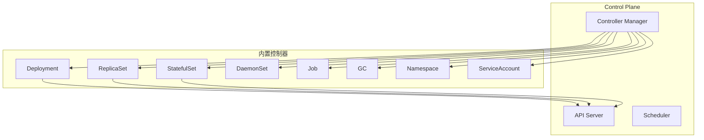
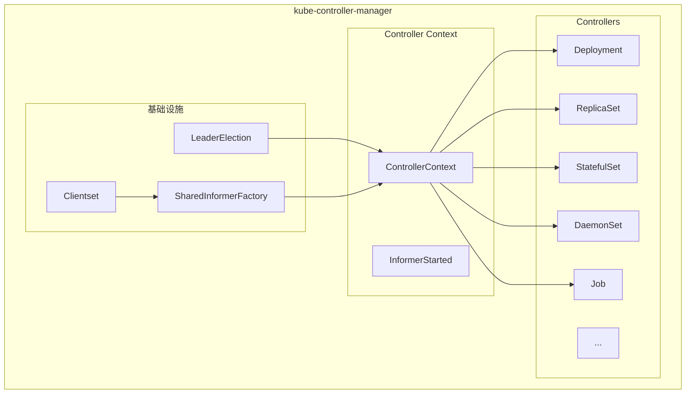
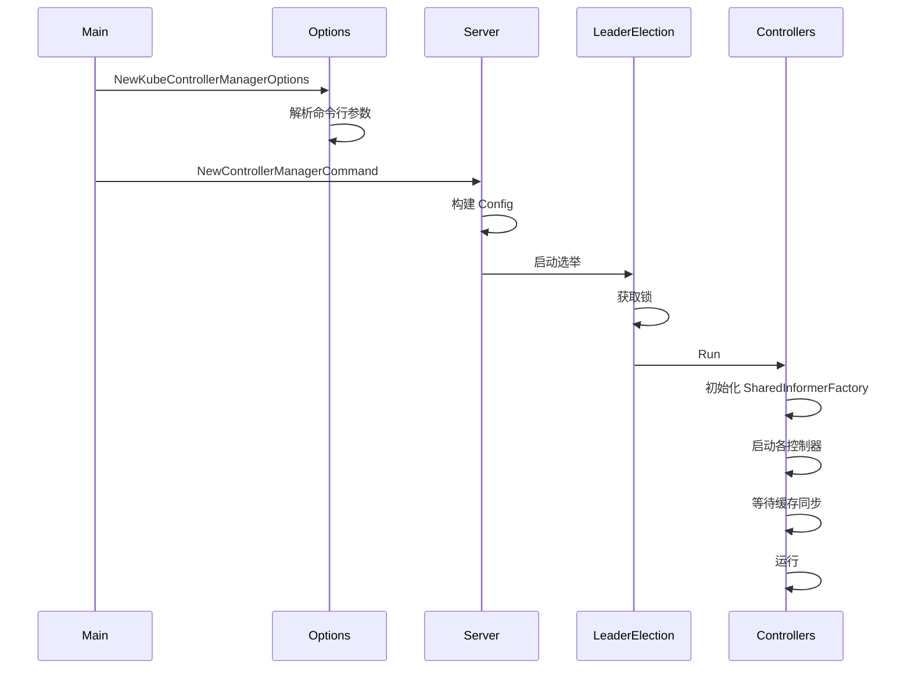
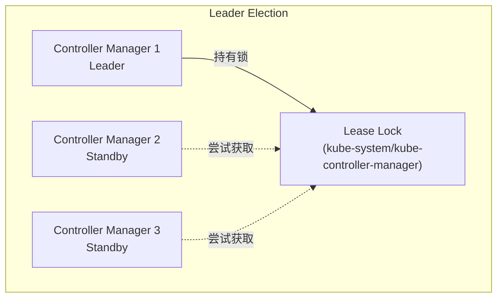

本文详细介绍 Kubernetes Controller Manager 的整体架构，包括组件结构、启动流程和控制器列表。

## 1. Controller Manager 概述

### 1.1 核心职责

Controller Manager 是 Kubernetes 控制平面的核心组件，负责运行所有内置控制器：



### 1.2 设计原则

```
控制器设计原则:
├── 声明式
│   └── 用户声明期望状态，控制器负责达成
├── 幂等性
│   └── 多次执行结果一致
├── 松耦合
│   └── 控制器之间相互独立
├── 最终一致
│   └── 系统最终会收敛到期望状态
└── Level-Triggered
    └── 基于状态而非事件驱动
```

### 1.3 kube-controller-manager vs cloud-controller-manager

| 组件 | 职责 | 控制器 |
|-----|------|-------|
| kube-controller-manager | 核心资源控制 | Deployment, ReplicaSet, Job 等 |
| cloud-controller-manager | 云平台集成 | Node, Route, Service (LB) |

## 2. 整体架构

### 2.1 组件架构



### 2.2 核心数据结构

```go
// ControllerContext 包含控制器运行所需的所有上下文
// cmd/kube-controller-manager/app/controllermanager.go

type ControllerContext struct {
    // 客户端配置
    ClientBuilder    clientbuilder.ControllerClientBuilder

    // Informer 工厂
    InformerFactory  informers.SharedInformerFactory

    // 对象元数据 Informer
    ObjectOrMetadataInformerFactory controller.InformerFactory

    // 组件配置
    ComponentConfig  kubectrlmgrconfig.KubeControllerManagerConfiguration

    // 事件记录器
    EventRecorder    record.EventRecorder

    // 云提供商
    Cloud            cloudprovider.Interface

    // 停止通道
    Stop             <-chan struct{}

    // Informer 启动状态
    InformersStarted chan struct{}

    // 需要的集群角色
    AvailableResources map[schema.GroupVersionResource]bool
}

// 控制器初始化函数类型
type InitFunc func(ctx context.Context, controllerCtx ControllerContext) (controller.Interface, bool, error)
```

## 3. 启动流程

### 3.1 启动流程图



### 3.2 入口函数

```go
// main 入口
// cmd/kube-controller-manager/controller-manager.go

func main() {
    command := app.NewControllerManagerCommand()
    code := cli.Run(command)
    os.Exit(code)
}

// NewControllerManagerCommand 创建命令
// cmd/kube-controller-manager/app/controllermanager.go

func NewControllerManagerCommand() *cobra.Command {
    s, err := options.NewKubeControllerManagerOptions()
    if err != nil {
        klog.Fatalf("unable to initialize command options: %v", err)
    }

    cmd := &cobra.Command{
        Use: "kube-controller-manager",
        RunE: func(cmd *cobra.Command, args []string) error {
            // 完成配置
            c, err := s.Config(KnownControllers(), ControllersDisabledByDefault.List())
            if err != nil {
                return err
            }

            // 运行
            return Run(c.Complete(), wait.NeverStop)
        },
    }

    return cmd
}
```

### 3.3 Run 函数

```go
// Run 启动 Controller Manager
// cmd/kube-controller-manager/app/controllermanager.go

func Run(c *config.CompletedConfig, stopCh <-chan struct{}) error {
    // 1. 创建控制器上下文
    controllerContext, err := CreateControllerContext(c, rootClientBuilder, clientBuilder, stopCh)
    if err != nil {
        return err
    }

    // 2. 设置健康检查
    var checks []healthz.HealthChecker
    var electionChecker *leaderelection.HealthzAdaptor

    // 3. Leader Election
    if c.ComponentConfig.Generic.LeaderElection.LeaderElect {
        electionChecker = leaderelection.NewLeaderHealthzAdaptor(time.Second * 20)
        checks = append(checks, electionChecker)

        go leaderelection.RunOrDie(context.TODO(), leaderelection.LeaderElectionConfig{
            Lock:          lock,
            LeaseDuration: c.ComponentConfig.Generic.LeaderElection.LeaseDuration.Duration,
            RenewDeadline: c.ComponentConfig.Generic.LeaderElection.RenewDeadline.Duration,
            RetryPeriod:   c.ComponentConfig.Generic.LeaderElection.RetryPeriod.Duration,
            Callbacks: leaderelection.LeaderCallbacks{
                OnStartedLeading: func(ctx context.Context) {
                    // 获得 Leader，启动控制器
                    run(ctx, controllerContext)
                },
                OnStoppedLeading: func() {
                    klog.Fatalf("leaderelection lost")
                },
            },
        })
    } else {
        // 不使用选举，直接启动
        run(context.TODO(), controllerContext)
    }

    <-stopCh
    return nil
}
```

### 3.4 启动控制器

```go
// StartControllers 启动所有控制器
// cmd/kube-controller-manager/app/controllermanager.go

func StartControllers(ctx context.Context, controllerCtx ControllerContext,
    controllers map[string]InitFunc, unsecuredMux *mux.PathRecorderMux) error {

    // 启动所有控制器
    for controllerName, initFn := range controllers {
        if !controllerCtx.IsControllerEnabled(controllerName) {
            klog.Warningf("%q is disabled", controllerName)
            continue
        }

        time.Sleep(wait.Jitter(controllerCtx.ComponentConfig.Generic.ControllerStartInterval.Duration, ControllerStartJitter))

        klog.V(1).Infof("Starting %q", controllerName)
        ctrl, started, err := initFn(ctx, controllerCtx)
        if err != nil {
            klog.Errorf("Error starting %q: %v", controllerName, err)
            return err
        }
        if !started {
            klog.Warningf("Skipping %q", controllerName)
            continue
        }

        check := controllerhealthz.NamedPingChecker(controllerName)
        if ctrl != nil {
            if healthCheckable, ok := ctrl.(controller.Healthz); ok {
                check = controllerhealthz.NamedHealthChecker(controllerName, healthCheckable)
            }
        }
        klog.Infof("Started %q", controllerName)
    }

    return nil
}
```

## 4. 控制器初始化

### 4.1 控制器注册

```go
// 控制器注册表
// cmd/kube-controller-manager/app/controllermanager.go

func NewControllerInitializers(loopMode ControllerLoopMode) map[string]InitFunc {
    controllers := map[string]InitFunc{}

    // 工作负载控制器
    controllers["deployment"] = startDeploymentController
    controllers["replicaset"] = startReplicaSetController
    controllers["statefulset"] = startStatefulSetController
    controllers["daemonset"] = startDaemonSetController
    controllers["job"] = startJobController
    controllers["cronjob"] = startCronJobController

    // Pod 相关控制器
    controllers["replicationcontroller"] = startReplicationController
    controllers["podgc"] = startPodGCController

    // 服务相关控制器
    controllers["endpoint"] = startEndpointController
    controllers["endpointslice"] = startEndpointSliceController
    controllers["endpointslicemirroring"] = startEndpointSliceMirroringController

    // 节点相关控制器
    controllers["nodelifecycle"] = startNodeLifecycleController
    controllers["nodeipam"] = startNodeIpamController
    controllers["ttl"] = startTTLController

    // 存储相关控制器
    controllers["persistentvolume-binder"] = startPersistentVolumeBinderController
    controllers["attachdetach"] = startAttachDetachController
    controllers["persistentvolume-expander"] = startVolumeExpandController
    controllers["pvc-protection"] = startPVCProtectionController
    controllers["pv-protection"] = startPVProtectionController

    // 命名空间控制器
    controllers["namespace"] = startNamespaceController

    // ServiceAccount 控制器
    controllers["serviceaccount"] = startServiceAccountController
    controllers["serviceaccount-token"] = startServiceAccountTokenController

    // 资源配额控制器
    controllers["resourcequota"] = startResourceQuotaController

    // 垃圾回收控制器
    controllers["garbagecollector"] = startGarbageCollectorController

    // TTL 控制器
    controllers["ttl-after-finished"] = startTTLAfterFinishedController

    // 证书控制器
    controllers["csrapproving"] = startCSRApprovingController
    controllers["csrcleaner"] = startCSRCleanerController
    controllers["csrsigning"] = startCSRSigningController

    // 其他控制器...

    return controllers
}
```

### 4.2 控制器初始化示例

```go
// Deployment 控制器初始化
// cmd/kube-controller-manager/app/apps.go

func startDeploymentController(ctx context.Context, controllerContext ControllerContext) (controller.Interface, bool, error) {
    dc, err := deployment.NewDeploymentController(
        controllerContext.InformerFactory.Apps().V1().Deployments(),
        controllerContext.InformerFactory.Apps().V1().ReplicaSets(),
        controllerContext.InformerFactory.Core().V1().Pods(),
        controllerContext.ClientBuilder.ClientOrDie("deployment-controller"),
    )
    if err != nil {
        return nil, true, fmt.Errorf("error creating Deployment controller: %v", err)
    }

    go dc.Run(ctx, int(controllerContext.ComponentConfig.DeploymentController.ConcurrentDeploymentSyncs))

    return nil, true, nil
}
```

## 5. SharedInformerFactory

### 5.1 Informer 工厂结构

```go
// SharedInformerFactory 创建
// cmd/kube-controller-manager/app/controllermanager.go

func CreateControllerContext(c *config.CompletedConfig, ...) (ControllerContext, error) {
    // 创建 SharedInformerFactory
    sharedInformers := informers.NewSharedInformerFactory(
        versionedClient,
        ResyncPeriod(c)(),
    )

    // 创建 Metadata Informer (用于 GC)
    metadataInformers := metadatainformers.NewSharedInformerFactory(
        metadataClient,
        ResyncPeriod(c)(),
    )

    return ControllerContext{
        InformerFactory:  sharedInformers,
        ObjectOrMetadataInformerFactory: controller.NewInformerFactory(
            sharedInformers,
            metadataInformers,
        ),
        ...
    }, nil
}
```

### 5.2 Informer 启动

```go
// 启动 Informers
// cmd/kube-controller-manager/app/controllermanager.go

func (ctx ControllerContext) StartInformers(stopCh <-chan struct{}) {
    ctx.InformerFactory.Start(stopCh)
    ctx.ObjectOrMetadataInformerFactory.Start(stopCh)
}

// 等待缓存同步
func (ctx ControllerContext) WaitForInformersSync() {
    ctx.InformerFactory.WaitForCacheSync(ctx.Stop)
}
```

## 6. Leader Election

### 6.1 选举机制



### 6.2 选举配置

```go
// Leader Election 配置
// staging/src/k8s.io/component-base/config/types.go

type LeaderElectionConfiguration struct {
    // 是否启用选举
    LeaderElect bool

    // 锁的持续时间
    LeaseDuration metav1.Duration

    // 续约截止时间
    RenewDeadline metav1.Duration

    // 重试间隔
    RetryPeriod metav1.Duration

    // 资源锁类型
    ResourceLock string

    // 资源名称
    ResourceName string

    // 资源命名空间
    ResourceNamespace string
}

// 默认值
var defaultLeaderElectionConfiguration = LeaderElectionConfiguration{
    LeaderElect:       true,
    LeaseDuration:     metav1.Duration{Duration: 15 * time.Second},
    RenewDeadline:     metav1.Duration{Duration: 10 * time.Second},
    RetryPeriod:       metav1.Duration{Duration: 2 * time.Second},
    ResourceLock:      "leases",
    ResourceName:      "kube-controller-manager",
    ResourceNamespace: "kube-system",
}
```

### 6.3 选举实现

```go
// 运行选举
// staging/src/k8s.io/client-go/tools/leaderelection/leaderelection.go

func RunOrDie(ctx context.Context, lec LeaderElectionConfig) {
    le, err := NewLeaderElector(lec)
    if err != nil {
        panic(err)
    }
    le.Run(ctx)
}

func (le *LeaderElector) Run(ctx context.Context) {
    defer func() {
        le.config.Callbacks.OnStoppedLeading()
    }()

    // 尝试获取锁
    if !le.acquire(ctx) {
        return
    }

    // 获取锁成功，启动回调
    ctx, cancel := context.WithCancel(ctx)
    defer cancel()
    go le.config.Callbacks.OnStartedLeading(ctx)

    // 续约循环
    le.renew(ctx)
}
```

## 7. 控制器列表

### 7.1 工作负载控制器

| 控制器 | 职责 | 关联资源 |
|-------|------|---------|
| deployment | Deployment 管理 | Deployment, ReplicaSet |
| replicaset | ReplicaSet 管理 | ReplicaSet, Pod |
| statefulset | StatefulSet 管理 | StatefulSet, Pod, PVC |
| daemonset | DaemonSet 管理 | DaemonSet, Pod |
| job | Job 管理 | Job, Pod |
| cronjob | CronJob 管理 | CronJob, Job |

### 7.2 服务发现控制器

| 控制器 | 职责 |
|-------|------|
| endpoint | 维护 Endpoints |
| endpointslice | 维护 EndpointSlice |
| endpointslicemirroring | Endpoints 到 EndpointSlice 镜像 |
| service | Service 处理 |

### 7.3 节点控制器

| 控制器 | 职责 |
|-------|------|
| nodelifecycle | 节点生命周期管理 |
| nodeipam | 节点 CIDR 分配 |
| taintmanager | 污点管理 |
| ttl | TTL 管理 |

### 7.4 存储控制器

| 控制器 | 职责 |
|-------|------|
| persistentvolume-binder | PV/PVC 绑定 |
| attachdetach | 卷 Attach/Detach |
| persistentvolume-expander | 卷扩展 |
| pvc-protection | PVC 保护 |
| pv-protection | PV 保护 |
| ephemeral-volume | 临时卷 |

### 7.5 其他控制器

| 控制器 | 职责 |
|-------|------|
| namespace | 命名空间生命周期 |
| serviceaccount | ServiceAccount 管理 |
| garbagecollector | 垃圾回收 |
| resourcequota | 资源配额 |
| horizontalpodautoscaling | HPA |
| disruption | PDB 管理 |

## 8. 配置参数

### 8.1 通用配置

```yaml
# Controller Manager 配置示例
apiVersion: kubecontroller.config.k8s.io/v1alpha1
kind: KubeControllerManagerConfiguration
generic:
  # 并发同步数
  controllers:
    - "*"  # 启用所有控制器

  # 或禁用特定控制器
  # controllers:
  # - "*"
  # - "-bootstrapsigner"

  # Leader Election
  leaderElection:
    leaderElect: true
    leaseDuration: 15s
    renewDeadline: 10s
    retryPeriod: 2s
    resourceLock: leases
    resourceName: kube-controller-manager
    resourceNamespace: kube-system
```

### 8.2 控制器特定配置

```yaml
# 各控制器配置
deploymentController:
  concurrentDeploymentSyncs: 5

replicaSetController:
  concurrentRSSyncs: 5

endpointController:
  concurrentEndpointSyncs: 5

serviceAccountController:
  concurrentSATokenSyncs: 5
  serviceAccountKeyFile: /etc/kubernetes/pki/sa.key

garbageCollectorController:
  concurrentGCSyncs: 20
  enableGarbageCollector: true

nodeLifecycleController:
  podEvictionTimeout: 5m0s
  nodeMonitorGracePeriod: 40s
  nodeStartupGracePeriod: 1m0s
```

## 小结

本文介绍了 Controller Manager 的整体架构：

1. **核心职责**：运行所有内置控制器，实现声明式资源管理
2. **组件架构**：ControllerContext、SharedInformerFactory、控制器
3. **启动流程**：参数解析、配置构建、Leader 选举、控制器启动
4. **控制器注册**：InitFunc 机制、动态启用/禁用
5. **Leader Election**：高可用保证、Lease 锁机制
6. **控制器列表**：工作负载、服务发现、节点、存储等类别

下一篇将详细介绍 Informer 机制。
