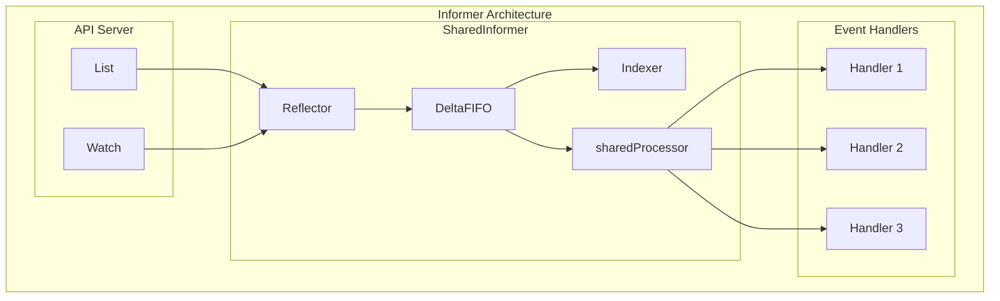
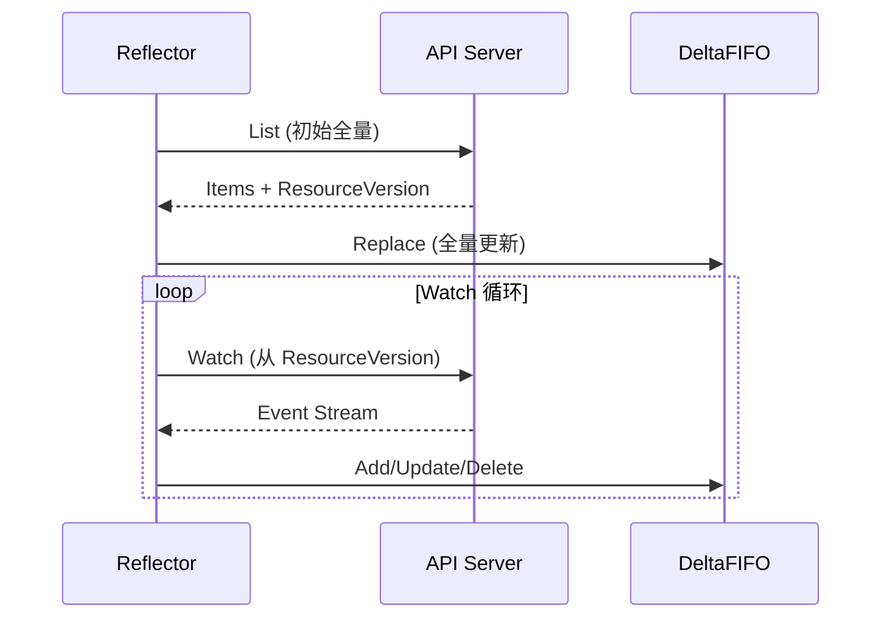
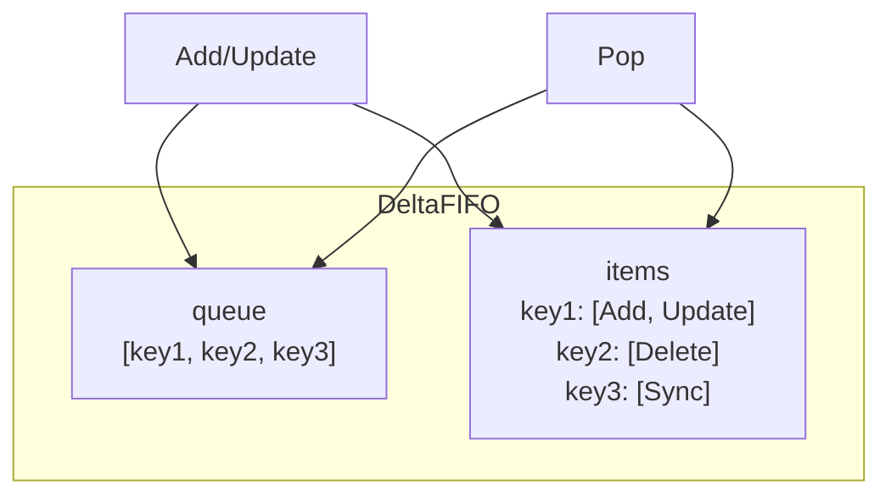

本文详细介绍 Kubernetes Informer 的工作原理，包括 SharedInformer、Reflector、DeltaFIFO 和 Indexer。

## 1. Informer 概述

### 1.1 为什么需要 Informer

直接 Watch API Server 存在以下问题：

```
直接 Watch 的问题:
├── 每个控制器独立 Watch
│   └── 大量重复连接，浪费资源
├── 无本地缓存
│   └── 每次都需要从 API Server 获取
├── 事件处理复杂
│   └── 需要自己处理事件去重、重连等
└── 无索引支持
    └── 无法高效查询
```

### 1.2 Informer 架构



### 1.3 核心组件

| 组件 | 职责 |
|-----|------|
| Reflector | List/Watch API Server，将数据放入 DeltaFIFO |
| DeltaFIFO | 存储变更事件的队列，支持去重 |
| Indexer | 本地缓存，支持索引查询 |
| sharedProcessor | 事件分发给多个 Handler |

## 2. SharedInformer

### 2.1 接口定义

```go
// SharedInformer 接口
// staging/src/k8s.io/client-go/tools/cache/shared_informer.go

type SharedInformer interface {
    // 添加事件处理器
    AddEventHandler(handler ResourceEventHandler) (ResourceEventHandlerRegistration, error)

    // 添加带 ResyncPeriod 的事件处理器
    AddEventHandlerWithResyncPeriod(handler ResourceEventHandler, resyncPeriod time.Duration) (ResourceEventHandlerRegistration, error)

    // 获取 Store (本地缓存)
    GetStore() Store

    // 获取 Controller
    GetController() Controller

    // 运行
    Run(stopCh <-chan struct{})

    // 检查缓存是否已同步
    HasSynced() bool

    // 最后同步的 ResourceVersion
    LastSyncResourceVersion() string
}

// SharedIndexInformer 带索引支持
type SharedIndexInformer interface {
    SharedInformer

    // 添加索引器
    AddIndexers(indexers Indexers) error

    // 获取 Indexer
    GetIndexer() Indexer
}
```

### 2.2 创建 SharedInformer

```go
// 创建 SharedIndexInformer
// staging/src/k8s.io/client-go/tools/cache/shared_informer.go

func NewSharedIndexInformer(
    lw ListerWatcher,
    exampleObject runtime.Object,
    defaultEventHandlerResyncPeriod time.Duration,
    indexers Indexers,
) SharedIndexInformer {
    return &sharedIndexInformer{
        indexer:                         NewIndexer(DeletionHandlingMetaNamespaceKeyFunc, indexers),
        processor:                       &sharedProcessor{},
        listerWatcher:                   lw,
        objectType:                      exampleObject,
        resyncCheckPeriod:               defaultEventHandlerResyncPeriod,
        defaultEventHandlerResyncPeriod: defaultEventHandlerResyncPeriod,
        clock:                           realClock,
    }
}
```

### 2.3 SharedInformer 结构

```go
// sharedIndexInformer 实现
// staging/src/k8s.io/client-go/tools/cache/shared_informer.go

type sharedIndexInformer struct {
    // 本地缓存 (Indexer)
    indexer Indexer

    // 控制器 (包含 Reflector)
    controller Controller

    // 事件处理器
    processor *sharedProcessor

    // ListerWatcher
    listerWatcher ListerWatcher

    // 对象类型
    objectType runtime.Object

    // Resync 周期
    resyncCheckPeriod time.Duration

    // 默认 Handler Resync 周期
    defaultEventHandlerResyncPeriod time.Duration

    // 时钟
    clock clock.Clock

    // 是否已启动
    started bool

    // 启动锁
    startedLock sync.Mutex
}
```

### 2.4 运行流程

```go
// Run 启动 SharedInformer
// staging/src/k8s.io/client-go/tools/cache/shared_informer.go

func (s *sharedIndexInformer) Run(stopCh <-chan struct{}) {
    defer utilruntime.HandleCrash()

    // 创建 DeltaFIFO
    fifo := NewDeltaFIFOWithOptions(DeltaFIFOOptions{
        KnownObjects:          s.indexer,
        EmitDeltaTypeReplaced: true,
    })

    // 创建配置
    cfg := &Config{
        Queue:             fifo,
        ListerWatcher:     s.listerWatcher,
        ObjectType:        s.objectType,
        FullResyncPeriod:  s.resyncCheckPeriod,
        RetryOnError:      false,
        ShouldResync:      s.processor.shouldResync,

        // 处理函数
        Process: s.HandleDeltas,
    }

    // 创建并运行 Controller
    func() {
        s.startedLock.Lock()
        defer s.startedLock.Unlock()

        s.controller = New(cfg)
        s.started = true
    }()

    // 启动事件处理器
    wg.Add(1)
    go func() {
        defer wg.Done()
        s.processor.run(stopCh)
    }()

    // 运行 Controller
    s.controller.Run(stopCh)
}
```

## 3. Reflector

### 3.1 Reflector 结构

```go
// Reflector 结构
// staging/src/k8s.io/client-go/tools/cache/reflector.go

type Reflector struct {
    // 名称
    name string

    // 期望类型
    expectedType reflect.Type

    // 存储目标 (DeltaFIFO)
    store Store

    // List/Watch 接口
    listerWatcher ListerWatcher

    // 退避策略
    backoffManager wait.BackoffManager

    // Resync 周期
    resyncPeriod time.Duration

    // 时钟
    clock clock.Clock

    // 分页大小
    paginatedResult bool

    // 最后同步的 ResourceVersion
    lastSyncResourceVersion string

    // Watch 错误处理
    watchErrorHandler WatchErrorHandler
}
```

### 3.2 ListAndWatch



```go
// ListAndWatch 核心逻辑
// staging/src/k8s.io/client-go/tools/cache/reflector.go

func (r *Reflector) ListAndWatch(stopCh <-chan struct{}) error {
    // 1. 执行 List
    err := r.list(stopCh)
    if err != nil {
        return err
    }

    // 2. 启动 Resync 协程
    go func() {
        resyncCh := r.resyncChan()
        for {
            select {
            case <-resyncCh:
                // 触发 Resync
                if r.ShouldResync == nil || r.ShouldResync() {
                    r.store.Resync()
                }
            case <-stopCh:
                return
            }
        }
    }()

    // 3. Watch 循环
    for {
        select {
        case <-stopCh:
            return nil
        default:
        }

        err := r.watch(stopCh)
        if err != nil {
            // 处理错误，可能需要重新 List
            if errors.Is(err, io.EOF) || errors.Is(err, io.ErrUnexpectedEOF) {
                continue
            }
            return err
        }
    }
}
```

### 3.3 List 实现

```go
// list 获取全量数据
// staging/src/k8s.io/client-go/tools/cache/reflector.go

func (r *Reflector) list(stopCh <-chan struct{}) error {
    var resourceVersion string
    options := metav1.ListOptions{ResourceVersion: r.relistResourceVersion()}

    // 分页 List
    pager := pager.New(pager.SimplePageFunc(func(opts metav1.ListOptions) (runtime.Object, error) {
        return r.listerWatcher.List(opts)
    }))

    list, paginatedResult, err := pager.List(context.Background(), options)
    if err != nil {
        return err
    }

    // 提取 items
    items, err := meta.ExtractList(list)
    if err != nil {
        return err
    }

    // 获取 ResourceVersion
    listMetaInterface, err := meta.ListAccessor(list)
    if err != nil {
        return err
    }
    resourceVersion = listMetaInterface.GetResourceVersion()

    // 同步到 Store
    if err := r.syncWith(items, resourceVersion); err != nil {
        return err
    }

    r.setLastSyncResourceVersion(resourceVersion)
    return nil
}

func (r *Reflector) syncWith(items []runtime.Object, resourceVersion string) error {
    found := make([]interface{}, 0, len(items))
    for _, item := range items {
        found = append(found, item)
    }
    // 替换 Store 中的所有数据
    return r.store.Replace(found, resourceVersion)
}
```

### 3.4 Watch 实现

```go
// watch 监听变更
// staging/src/k8s.io/client-go/tools/cache/reflector.go

func (r *Reflector) watch(stopCh <-chan struct{}) error {
    options := metav1.ListOptions{
        ResourceVersion: r.LastSyncResourceVersion(),
        Watch:           true,
        AllowWatchBookmarks: true,
    }

    // 建立 Watch 连接
    w, err := r.listerWatcher.Watch(options)
    if err != nil {
        return err
    }

    // 处理 Watch 事件
    return r.watchHandler(w, stopCh)
}

func (r *Reflector) watchHandler(w watch.Interface, stopCh <-chan struct{}) error {
    defer w.Stop()

    for {
        select {
        case <-stopCh:
            return nil
        case event, ok := <-w.ResultChan():
            if !ok {
                return nil
            }

            // 处理事件
            meta, err := meta.Accessor(event.Object)
            if err != nil {
                return err
            }
            newResourceVersion := meta.GetResourceVersion()

            switch event.Type {
            case watch.Added:
                err = r.store.Add(event.Object)
            case watch.Modified:
                err = r.store.Update(event.Object)
            case watch.Deleted:
                err = r.store.Delete(event.Object)
            case watch.Bookmark:
                // Bookmark 事件，更新 ResourceVersion
            }

            if err != nil {
                return err
            }
            r.setLastSyncResourceVersion(newResourceVersion)
        }
    }
}
```

## 4. DeltaFIFO

### 4.1 DeltaFIFO 结构

```go
// DeltaFIFO 结构
// staging/src/k8s.io/client-go/tools/cache/delta_fifo.go

type DeltaFIFO struct {
    lock sync.RWMutex
    cond sync.Cond

    // key -> Deltas 映射
    items map[string]Deltas

    // 有序队列 (存储 key)
    queue []string

    // 用于计算 key 的函数
    keyFunc KeyFunc

    // 已知对象 (用于 Resync)
    knownObjects KeyListerGetter

    // 是否已关闭
    closed bool
}

// Delta 表示一个变更
type Delta struct {
    Type   DeltaType
    Object interface{}
}

// Delta 类型
type DeltaType string

const (
    Added   DeltaType = "Added"
    Updated DeltaType = "Updated"
    Deleted DeltaType = "Deleted"
    Replaced DeltaType = "Replaced"
    Sync    DeltaType = "Sync"
)

// Deltas 是 Delta 的切片
type Deltas []Delta
```

### 4.2 DeltaFIFO 操作



```go
// Add 添加对象
// staging/src/k8s.io/client-go/tools/cache/delta_fifo.go

func (f *DeltaFIFO) Add(obj interface{}) error {
    f.lock.Lock()
    defer f.lock.Unlock()
    return f.queueActionLocked(Added, obj)
}

func (f *DeltaFIFO) queueActionLocked(actionType DeltaType, obj interface{}) error {
    id, err := f.KeyOf(obj)
    if err != nil {
        return err
    }

    // 添加到 items
    oldDeltas := f.items[id]
    newDeltas := append(oldDeltas, Delta{actionType, obj})

    // 去重压缩
    newDeltas = dedupDeltas(newDeltas)

    if len(newDeltas) > 0 {
        // 如果是新 key，添加到队列
        if _, exists := f.items[id]; !exists {
            f.queue = append(f.queue, id)
        }
        f.items[id] = newDeltas
        f.cond.Broadcast()
    }

    return nil
}
```

### 4.3 Pop 操作

```go
// Pop 获取并处理一个对象
// staging/src/k8s.io/client-go/tools/cache/delta_fifo.go

func (f *DeltaFIFO) Pop(process PopProcessFunc) (interface{}, error) {
    f.lock.Lock()
    defer f.lock.Unlock()

    for {
        for len(f.queue) == 0 {
            if f.closed {
                return nil, ErrFIFOClosed
            }
            // 等待新数据
            f.cond.Wait()
        }

        // 取出第一个 key
        id := f.queue[0]
        f.queue = f.queue[1:]

        // 获取 Deltas
        item, ok := f.items[id]
        if !ok {
            continue
        }
        delete(f.items, id)

        // 处理
        err := process(item)
        if err != nil {
            // 处理失败，重新入队
            f.addIfNotPresent(id, item)
            return nil, err
        }

        return item, nil
    }
}
```

### 4.4 Replace 和 Resync

```go
// Replace 全量替换
// staging/src/k8s.io/client-go/tools/cache/delta_fifo.go

func (f *DeltaFIFO) Replace(list []interface{}, resourceVersion string) error {
    f.lock.Lock()
    defer f.lock.Unlock()

    keys := make(sets.String)

    // 添加所有新对象
    for _, item := range list {
        key, err := f.KeyOf(item)
        if err != nil {
            return err
        }
        keys.Insert(key)
        f.queueActionLocked(Replaced, item)
    }

    // 删除不存在的对象
    if f.knownObjects != nil {
        knownKeys := f.knownObjects.ListKeys()
        for _, k := range knownKeys {
            if !keys.Has(k) {
                // 对象已被删除
                deletedObj, exists, err := f.knownObjects.GetByKey(k)
                if err == nil && exists {
                    f.queueActionLocked(Deleted, deletedObj)
                }
            }
        }
    }

    return nil
}

// Resync 重新同步
func (f *DeltaFIFO) Resync() error {
    f.lock.Lock()
    defer f.lock.Unlock()

    if f.knownObjects == nil {
        return nil
    }

    // 为所有已知对象生成 Sync 事件
    keys := f.knownObjects.ListKeys()
    for _, k := range keys {
        f.syncKeyLocked(k)
    }

    return nil
}

func (f *DeltaFIFO) syncKeyLocked(key string) error {
    obj, exists, err := f.knownObjects.GetByKey(key)
    if err != nil {
        return err
    }
    if !exists {
        return nil
    }

    // 如果没有待处理的 Delta，添加 Sync 事件
    if _, exists := f.items[key]; !exists {
        f.queueActionLocked(Sync, obj)
    }

    return nil
}
```

## 5. Indexer

### 5.1 Indexer 接口

```go
// Indexer 接口
// staging/src/k8s.io/client-go/tools/cache/index.go

type Indexer interface {
    Store

    // 按索引查询
    Index(indexName string, obj interface{}) ([]interface{}, error)

    // 按索引键查询
    IndexKeys(indexName, indexedValue string) ([]string, error)

    // 列出索引值
    ListIndexFuncValues(indexName string) []string

    // 按索引获取对象
    ByIndex(indexName, indexedValue string) ([]interface{}, error)

    // 获取索引器
    GetIndexers() Indexers

    // 添加索引器
    AddIndexers(newIndexers Indexers) error
}

// IndexFunc 索引函数
type IndexFunc func(obj interface{}) ([]string, error)

// Indexers 索引器集合
type Indexers map[string]IndexFunc

// Indices 索引数据
type Indices map[string]Index

// Index 单个索引
type Index map[string]sets.String
```

### 5.2 内置索引

```go
// 常用索引函数
// staging/src/k8s.io/client-go/tools/cache/index.go

// 按命名空间索引
func MetaNamespaceIndexFunc(obj interface{}) ([]string, error) {
    meta, err := meta.Accessor(obj)
    if err != nil {
        return []string{""}, fmt.Errorf("object has no meta: %v", err)
    }
    return []string{meta.GetNamespace()}, nil
}

// 使用示例
indexers := cache.Indexers{
    cache.NamespaceIndex: cache.MetaNamespaceIndexFunc,
}

// 按命名空间查询所有 Pod
pods, err := podIndexer.ByIndex(cache.NamespaceIndex, "default")
```

### 5.3 Indexer 实现

```go
// cache 实现 Indexer
// staging/src/k8s.io/client-go/tools/cache/store.go

type cache struct {
    cacheStorage ThreadSafeStore
    keyFunc      KeyFunc
}

// ThreadSafeStore 线程安全存储
type threadSafeMap struct {
    lock  sync.RWMutex
    items map[string]interface{}

    // 索引器
    indexers Indexers

    // 索引数据
    indices Indices
}

// Add 添加对象
func (c *threadSafeMap) Add(key string, obj interface{}) {
    c.lock.Lock()
    defer c.lock.Unlock()

    oldObject := c.items[key]
    c.items[key] = obj
    c.updateIndices(oldObject, obj, key)
}

// 更新索引
func (c *threadSafeMap) updateIndices(oldObj interface{}, newObj interface{}, key string) {
    // 删除旧索引
    if oldObj != nil {
        c.deleteFromIndices(oldObj, key)
    }

    // 添加新索引
    for name, indexFunc := range c.indexers {
        indexValues, err := indexFunc(newObj)
        if err != nil {
            continue
        }

        index := c.indices[name]
        if index == nil {
            index = Index{}
            c.indices[name] = index
        }

        for _, indexValue := range indexValues {
            set := index[indexValue]
            if set == nil {
                set = sets.String{}
                index[indexValue] = set
            }
            set.Insert(key)
        }
    }
}

// ByIndex 按索引查询
func (c *threadSafeMap) ByIndex(indexName, indexedValue string) ([]interface{}, error) {
    c.lock.RLock()
    defer c.lock.RUnlock()

    indexFunc := c.indexers[indexName]
    if indexFunc == nil {
        return nil, fmt.Errorf("Index with name %s does not exist", indexName)
    }

    index := c.indices[indexName]
    set := index[indexedValue]

    list := make([]interface{}, 0, set.Len())
    for key := range set {
        list = append(list, c.items[key])
    }

    return list, nil
}
```

## 6. Event Handler

### 6.1 Handler 接口

```go
// ResourceEventHandler 接口
// staging/src/k8s.io/client-go/tools/cache/shared_informer.go

type ResourceEventHandler interface {
    OnAdd(obj interface{}, isInInitialList bool)
    OnUpdate(oldObj, newObj interface{})
    OnDelete(obj interface{})
}

// ResourceEventHandlerFuncs 函数式实现
type ResourceEventHandlerFuncs struct {
    AddFunc    func(obj interface{})
    UpdateFunc func(oldObj, newObj interface{})
    DeleteFunc func(obj interface{})
}

func (r ResourceEventHandlerFuncs) OnAdd(obj interface{}, isInInitialList bool) {
    if r.AddFunc != nil {
        r.AddFunc(obj)
    }
}

func (r ResourceEventHandlerFuncs) OnUpdate(oldObj, newObj interface{}) {
    if r.UpdateFunc != nil {
        r.UpdateFunc(oldObj, newObj)
    }
}

func (r ResourceEventHandlerFuncs) OnDelete(obj interface{}) {
    if r.DeleteFunc != nil {
        r.DeleteFunc(obj)
    }
}
```

### 6.2 事件分发

```go
// sharedProcessor 事件处理器
// staging/src/k8s.io/client-go/tools/cache/shared_informer.go

type sharedProcessor struct {
    listenersStarted bool
    listenersLock    sync.RWMutex
    listeners        []*processorListener
    syncingListeners []*processorListener
}

type processorListener struct {
    handler ResourceEventHandler

    // 缓冲通道
    addCh  chan interface{}
    nextCh chan interface{}

    // 待处理事件
    pendingNotifications buffer.RingGrowing
}

// 分发事件
func (p *sharedProcessor) distribute(obj interface{}, sync bool) {
    p.listenersLock.RLock()
    defer p.listenersLock.RUnlock()

    for _, listener := range p.listeners {
        switch obj.(type) {
        case addNotification:
            listener.add(obj)
        case updateNotification:
            listener.add(obj)
        case deleteNotification:
            listener.add(obj)
        }
    }
}

// 处理器运行
func (p *processorListener) run() {
    stopCh := make(chan struct{})
    wait.Until(func() {
        for next := range p.nextCh {
            switch n := next.(type) {
            case addNotification:
                p.handler.OnAdd(n.newObj, n.isInInitialList)
            case updateNotification:
                p.handler.OnUpdate(n.oldObj, n.newObj)
            case deleteNotification:
                p.handler.OnDelete(n.oldObj)
            }
        }
    }, 1*time.Second, stopCh)
}
```

## 7. SharedInformerFactory

### 7.1 Factory 接口

```go
// SharedInformerFactory 接口
// staging/src/k8s.io/client-go/informers/factory.go

type SharedInformerFactory interface {
    internalinterfaces.SharedInformerFactory
    ForResource(resource schema.GroupVersionResource) (GenericInformer, error)
    WaitForCacheSync(stopCh <-chan struct{}) map[reflect.Type]bool

    // 各 API 组的 Informer
    Apps() apps.Interface
    Core() core.Interface
    Batch() batch.Interface
    Networking() networking.Interface
    // ...
}
```

### 7.2 创建和使用

```go
// 创建 SharedInformerFactory
// staging/src/k8s.io/client-go/informers/factory.go

func NewSharedInformerFactory(client kubernetes.Interface, defaultResync time.Duration) SharedInformerFactory {
    return NewSharedInformerFactoryWithOptions(client, defaultResync)
}

func NewSharedInformerFactoryWithOptions(client kubernetes.Interface, defaultResync time.Duration, options ...SharedInformerOption) SharedInformerFactory {
    factory := &sharedInformerFactory{
        client:           client,
        namespace:        v1.NamespaceAll,
        defaultResync:    defaultResync,
        informers:        make(map[reflect.Type]cache.SharedIndexInformer),
        startedInformers: make(map[reflect.Type]bool),
    }

    for _, opt := range options {
        factory = opt(factory)
    }

    return factory
}

// 使用示例
func main() {
    config, _ := clientcmd.BuildConfigFromFlags("", kubeconfig)
    clientset, _ := kubernetes.NewForConfig(config)

    // 创建 Factory
    factory := informers.NewSharedInformerFactory(clientset, 30*time.Second)

    // 获取 Pod Informer
    podInformer := factory.Core().V1().Pods()

    // 添加事件处理器
    podInformer.Informer().AddEventHandler(cache.ResourceEventHandlerFuncs{
        AddFunc: func(obj interface{}) {
            pod := obj.(*v1.Pod)
            fmt.Printf("Pod Added: %s/%s\n", pod.Namespace, pod.Name)
        },
        UpdateFunc: func(oldObj, newObj interface{}) {
            // ...
        },
        DeleteFunc: func(obj interface{}) {
            // ...
        },
    })

    // 启动
    stopCh := make(chan struct{})
    factory.Start(stopCh)

    // 等待缓存同步
    factory.WaitForCacheSync(stopCh)

    // 使用 Lister 查询
    pods, _ := podInformer.Lister().Pods("default").List(labels.Everything())
}
```

## 小结

本文介绍了 Informer 机制的核心组件：

1. **SharedInformer**：共享 Informer，避免重复 Watch
2. **Reflector**：ListAndWatch 实现，同步 API Server 数据
3. **DeltaFIFO**：变更事件队列，支持去重和批量处理
4. **Indexer**：本地缓存，支持索引查询
5. **Event Handler**：事件处理器，分发给多个 Handler
6. **SharedInformerFactory**：Informer 工厂，统一管理

下一篇将详细介绍 WorkQueue。
