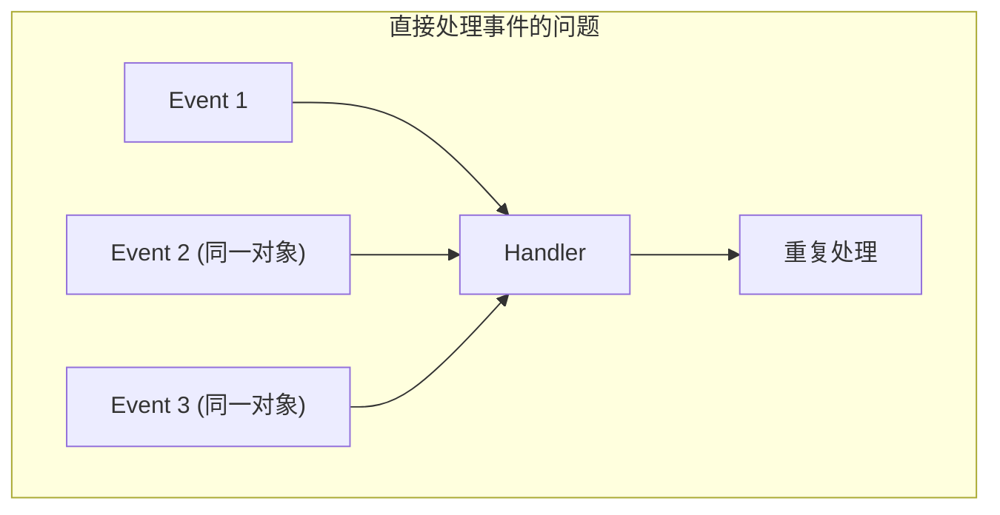
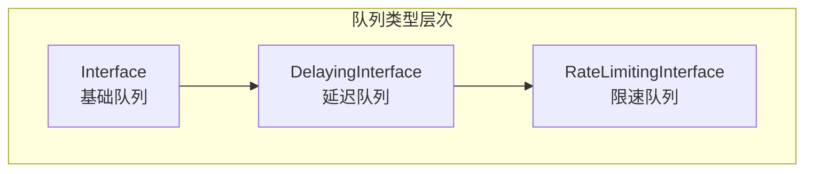
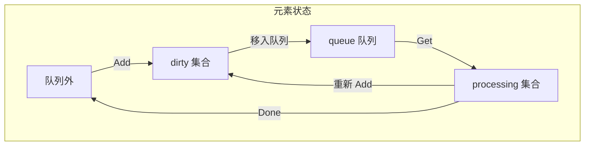

本文详细介绍 Kubernetes WorkQueue 的实现，包括基础队列、延迟队列、限速队列及其使用模式。

## 1. WorkQueue 概述

### 1.1 为什么需要 WorkQueue



WorkQueue 解决的问题：

| 问题 | WorkQueue 解决方案 |
|-----|-------------------|
| 重复处理 | 去重机制 |
| 失败重试 | 延迟重入队 |
| 速率控制 | 限速器 |
| 顺序保证 | FIFO 语义 |
| 并发控制 | 线程安全 |

### 1.2 队列类型



## 2. 基础队列 (Interface)

### 2.1 接口定义

```go
// 基础队列接口
// staging/src/k8s.io/client-go/util/workqueue/queue.go

type Interface interface {
    // 添加元素
    Add(item interface{})

    // 获取队列长度
    Len() int

    // 获取元素 (阻塞)
    Get() (item interface{}, shutdown bool)

    // 标记处理完成
    Done(item interface{})

    // 关闭队列
    ShutDown()

    // 等待关闭并处理完所有元素
    ShutDownWithDrain()

    // 是否正在关闭
    ShuttingDown() bool
}
```

### 2.2 内部结构

```go
// Type 基础队列实现
// staging/src/k8s.io/client-go/util/workqueue/queue.go

type Type struct {
    // 有序队列
    queue []t

    // 脏数据集 (已添加但未处理)
    dirty set

    // 正在处理的数据集
    processing set

    // 条件变量
    cond *sync.Cond

    // 是否关闭
    shuttingDown bool

    // 是否允许 Drain
    drain bool

    // 指标
    metrics queueMetrics
}
```

### 2.3 队列状态转换



### 2.4 Add 操作

```go
// Add 添加元素到队列
// staging/src/k8s.io/client-go/util/workqueue/queue.go

func (q *Type) Add(item interface{}) {
    q.cond.L.Lock()
    defer q.cond.L.Unlock()

    if q.shuttingDown {
        return
    }

    // 如果已在 dirty 集合，跳过 (去重)
    if q.dirty.has(item) {
        return
    }

    // 添加到 dirty 集合
    q.dirty.insert(item)

    // 如果正在处理，不添加到队列
    // (等 Done 时再添加)
    if q.processing.has(item) {
        return
    }

    // 添加到队列
    q.queue = append(q.queue, item)
    q.cond.Signal()
}
```

### 2.5 Get 操作

```go
// Get 获取元素
// staging/src/k8s.io/client-go/util/workqueue/queue.go

func (q *Type) Get() (item interface{}, shutdown bool) {
    q.cond.L.Lock()
    defer q.cond.L.Unlock()

    // 等待有元素
    for len(q.queue) == 0 && !q.shuttingDown {
        q.cond.Wait()
    }

    if len(q.queue) == 0 {
        return nil, true
    }

    // 取出第一个元素
    item = q.queue[0]
    q.queue = q.queue[1:]

    // 从 dirty 移动到 processing
    q.processing.insert(item)
    q.dirty.delete(item)

    return item, false
}
```

### 2.6 Done 操作

```go
// Done 标记处理完成
// staging/src/k8s.io/client-go/util/workqueue/queue.go

func (q *Type) Done(item interface{}) {
    q.cond.L.Lock()
    defer q.cond.L.Unlock()

    // 从 processing 移除
    q.processing.delete(item)

    // 如果处理期间又被添加，需要重新入队
    if q.dirty.has(item) {
        q.queue = append(q.queue, item)
        q.cond.Signal()
    } else if q.processing.len() == 0 {
        // 通知可能在等待 drain 的协程
        q.cond.Signal()
    }
}
```

## 3. 延迟队列 (DelayingInterface)

### 3.1 接口定义

```go
// 延迟队列接口
// staging/src/k8s.io/client-go/util/workqueue/delaying_queue.go

type DelayingInterface interface {
    Interface

    // 延迟添加
    AddAfter(item interface{}, duration time.Duration)
}
```

### 3.2 实现结构

```go
// delayingType 延迟队列实现
// staging/src/k8s.io/client-go/util/workqueue/delaying_queue.go

type delayingType struct {
    Interface

    // 时钟
    clock clock.Clock

    // 停止通道
    stopCh chan struct{}

    // 等待添加的通道
    waitingForAddCh chan *waitFor

    // 指标
    metrics retryMetrics
}

// waitFor 等待添加的元素
type waitFor struct {
    data    t
    readyAt time.Time
    index   int
}

// waitForPriorityQueue 优先队列 (按时间排序)
type waitForPriorityQueue []*waitFor

func (pq waitForPriorityQueue) Len() int { return len(pq) }

func (pq waitForPriorityQueue) Less(i, j int) bool {
    return pq[i].readyAt.Before(pq[j].readyAt)
}
```

### 3.3 AddAfter 实现

```go
// AddAfter 延迟添加
// staging/src/k8s.io/client-go/util/workqueue/delaying_queue.go

func (q *delayingType) AddAfter(item interface{}, duration time.Duration) {
    if q.ShuttingDown() {
        return
    }

    // 立即添加
    if duration <= 0 {
        q.Add(item)
        return
    }

    // 发送到等待通道
    select {
    case <-q.stopCh:
    case q.waitingForAddCh <- &waitFor{data: item, readyAt: q.clock.Now().Add(duration)}:
    }
}
```

### 3.4 等待循环

```go
// waitingLoop 处理延迟添加
// staging/src/k8s.io/client-go/util/workqueue/delaying_queue.go

func (q *delayingType) waitingLoop() {
    defer utilruntime.HandleCrash()

    // 等待队列 (优先队列)
    waitingForQueue := &waitForPriorityQueue{}
    heap.Init(waitingForQueue)

    // 已在等待的元素
    waitingEntryByData := map[t]*waitFor{}

    for {
        if q.Interface.ShuttingDown() {
            return
        }

        now := q.clock.Now()

        // 处理所有到期的元素
        for waitingForQueue.Len() > 0 {
            entry := waitingForQueue.Peek().(*waitFor)
            if entry.readyAt.After(now) {
                break
            }

            // 到期，添加到队列
            entry = heap.Pop(waitingForQueue).(*waitFor)
            q.Add(entry.data)
            delete(waitingEntryByData, entry.data)
        }

        // 计算下次唤醒时间
        nextReadyAt := maxWait
        if waitingForQueue.Len() > 0 {
            entry := waitingForQueue.Peek().(*waitFor)
            nextReadyAt = entry.readyAt.Sub(now)
        }

        select {
        case <-q.stopCh:
            return
        case <-q.clock.After(nextReadyAt):
            // 到期，继续处理
        case waitEntry := <-q.waitingForAddCh:
            // 新的延迟添加请求
            if waitEntry.readyAt.After(q.clock.Now()) {
                // 添加到等待队列
                insert(waitingForQueue, waitingEntryByData, waitEntry)
            } else {
                // 已到期，直接添加
                q.Add(waitEntry.data)
            }
        }
    }
}
```

## 4. 限速队列 (RateLimitingInterface)

### 4.1 接口定义

```go
// 限速队列接口
// staging/src/k8s.io/client-go/util/workqueue/rate_limiting_queue.go

type RateLimitingInterface interface {
    DelayingInterface

    // 添加 (带限速)
    AddRateLimited(item interface{})

    // 忘记重试次数
    Forget(item interface{})

    // 获取重试次数
    NumRequeues(item interface{}) int
}
```

### 4.2 限速器接口

```go
// RateLimiter 限速器接口
// staging/src/k8s.io/client-go/util/workqueue/default_rate_limiters.go

type RateLimiter interface {
    // 计算延迟时间
    When(item interface{}) time.Duration

    // 重置
    Forget(item interface{})

    // 重试次数
    NumRequeues(item interface{}) int
}
```

### 4.3 内置限速器

#### 指数退避限速器

```go
// ItemExponentialFailureRateLimiter 指数退避
// staging/src/k8s.io/client-go/util/workqueue/default_rate_limiters.go

type ItemExponentialFailureRateLimiter struct {
    failuresLock sync.Mutex
    failures     map[interface{}]int

    baseDelay time.Duration // 基础延迟
    maxDelay  time.Duration // 最大延迟
}

func (r *ItemExponentialFailureRateLimiter) When(item interface{}) time.Duration {
    r.failuresLock.Lock()
    defer r.failuresLock.Unlock()

    // 获取失败次数
    exp := r.failures[item]
    r.failures[item] = r.failures[item] + 1

    // 计算延迟: baseDelay * 2^exp
    backoff := float64(r.baseDelay.Nanoseconds()) * math.Pow(2, float64(exp))
    if backoff > math.MaxInt64 {
        return r.maxDelay
    }

    calculated := time.Duration(backoff)
    if calculated > r.maxDelay {
        return r.maxDelay
    }

    return calculated
}

func (r *ItemExponentialFailureRateLimiter) NumRequeues(item interface{}) int {
    r.failuresLock.Lock()
    defer r.failuresLock.Unlock()
    return r.failures[item]
}

func (r *ItemExponentialFailureRateLimiter) Forget(item interface{}) {
    r.failuresLock.Lock()
    defer r.failuresLock.Unlock()
    delete(r.failures, item)
}
```

#### 令牌桶限速器

```go
// BucketRateLimiter 令牌桶限速器
// staging/src/k8s.io/client-go/util/workqueue/default_rate_limiters.go

type BucketRateLimiter struct {
    *rate.Limiter
}

func (r *BucketRateLimiter) When(item interface{}) time.Duration {
    return r.Limiter.Reserve().Delay()
}

func (r *BucketRateLimiter) NumRequeues(item interface{}) int {
    return 0
}

func (r *BucketRateLimiter) Forget(item interface{}) {
}

// 创建令牌桶限速器
// 每秒 10 个，最多积累 100 个
func NewDefaultItemBasedRateLimiter() RateLimiter {
    return &BucketRateLimiter{Limiter: rate.NewLimiter(rate.Limit(10), 100)}
}
```

#### 组合限速器

```go
// MaxOfRateLimiter 取最大延迟
// staging/src/k8s.io/client-go/util/workqueue/default_rate_limiters.go

type MaxOfRateLimiter struct {
    limiters []RateLimiter
}

func (r *MaxOfRateLimiter) When(item interface{}) time.Duration {
    ret := time.Duration(0)
    for _, limiter := range r.limiters {
        curr := limiter.When(item)
        if curr > ret {
            ret = curr
        }
    }
    return ret
}

// 默认限速器: 指数退避 + 令牌桶
func DefaultControllerRateLimiter() RateLimiter {
    return NewMaxOfRateLimiter(
        NewItemExponentialFailureRateLimiter(5*time.Millisecond, 1000*time.Second),
        &BucketRateLimiter{Limiter: rate.NewLimiter(rate.Limit(10), 100)},
    )
}
```

### 4.4 限速队列实现

```go
// rateLimitingType 限速队列实现
// staging/src/k8s.io/client-go/util/workqueue/rate_limiting_queue.go

type rateLimitingType struct {
    DelayingInterface
    rateLimiter RateLimiter
}

func NewRateLimitingQueue(rateLimiter RateLimiter) RateLimitingInterface {
    return &rateLimitingType{
        DelayingInterface: NewDelayingQueue(),
        rateLimiter:       rateLimiter,
    }
}

func (q *rateLimitingType) AddRateLimited(item interface{}) {
    // 根据限速器计算延迟
    q.DelayingInterface.AddAfter(item, q.rateLimiter.When(item))
}

func (q *rateLimitingType) NumRequeues(item interface{}) int {
    return q.rateLimiter.NumRequeues(item)
}

func (q *rateLimitingType) Forget(item interface{}) {
    q.rateLimiter.Forget(item)
}
```

## 5. 使用模式

### 5.1 控制器模式

```go
// 典型的控制器使用模式
type Controller struct {
    queue      workqueue.RateLimitingInterface
    informer   cache.SharedIndexInformer
    lister     v1.PodLister
    syncHandler func(key string) error
}

func NewController(informer cache.SharedIndexInformer) *Controller {
    c := &Controller{
        queue:    workqueue.NewRateLimitingQueue(workqueue.DefaultControllerRateLimiter()),
        informer: informer,
        lister:   v1.NewPodLister(informer.GetIndexer()),
    }

    c.syncHandler = c.syncPod

    // 添加事件处理器
    informer.AddEventHandler(cache.ResourceEventHandlerFuncs{
        AddFunc: func(obj interface{}) {
            key, err := cache.MetaNamespaceKeyFunc(obj)
            if err == nil {
                c.queue.Add(key)
            }
        },
        UpdateFunc: func(oldObj, newObj interface{}) {
            key, err := cache.MetaNamespaceKeyFunc(newObj)
            if err == nil {
                c.queue.Add(key)
            }
        },
        DeleteFunc: func(obj interface{}) {
            key, err := cache.DeletionHandlingMetaNamespaceKeyFunc(obj)
            if err == nil {
                c.queue.Add(key)
            }
        },
    })

    return c
}
```

### 5.2 Worker 循环

```go
// Run 启动控制器
func (c *Controller) Run(workers int, stopCh <-chan struct{}) {
    defer utilruntime.HandleCrash()
    defer c.queue.ShutDown()

    // 等待缓存同步
    if !cache.WaitForCacheSync(stopCh, c.informer.HasSynced) {
        return
    }

    // 启动 worker
    for i := 0; i < workers; i++ {
        go wait.Until(c.runWorker, time.Second, stopCh)
    }

    <-stopCh
}

func (c *Controller) runWorker() {
    for c.processNextWorkItem() {
    }
}

func (c *Controller) processNextWorkItem() bool {
    // 从队列获取
    key, shutdown := c.queue.Get()
    if shutdown {
        return false
    }

    defer c.queue.Done(key)

    // 处理
    err := c.syncHandler(key.(string))
    c.handleErr(err, key)

    return true
}

func (c *Controller) handleErr(err error, key interface{}) {
    if err == nil {
        // 成功，重置重试计数
        c.queue.Forget(key)
        return
    }

    // 检查重试次数
    if c.queue.NumRequeues(key) < 5 {
        // 重试
        klog.Warningf("Error syncing %v: %v, retrying", key, err)
        c.queue.AddRateLimited(key)
        return
    }

    // 放弃
    c.queue.Forget(key)
    klog.Errorf("Dropping %v out of queue: %v", key, err)
}
```

### 5.3 同步处理

```go
// syncPod 处理单个 Pod
func (c *Controller) syncPod(key string) error {
    namespace, name, err := cache.SplitMetaNamespaceKey(key)
    if err != nil {
        return err
    }

    // 从缓存获取对象
    pod, err := c.lister.Pods(namespace).Get(name)
    if errors.IsNotFound(err) {
        // 对象已删除
        klog.Infof("Pod %s has been deleted", key)
        return nil
    }
    if err != nil {
        return err
    }

    // 处理 Pod
    return c.handlePod(pod)
}
```

## 6. 监控指标

### 6.1 队列指标

```go
// 队列指标
// staging/src/k8s.io/client-go/util/workqueue/metrics.go

type queueMetrics struct {
    // 队列深度
    depth GaugeMetric

    // 添加次数
    adds CounterMetric

    // 延迟 (从添加到开始处理)
    latency HistogramMetric

    // 工作时长 (从开始处理到 Done)
    workDuration HistogramMetric

    // 未完成工作数
    unfinishedWorkSeconds SettableGaugeMetric

    // 最长运行 worker 时间
    longestRunningProcessor SettableGaugeMetric
}

// Prometheus 指标示例
// workqueue_depth: 队列中等待处理的元素数
// workqueue_adds_total: 添加到队列的总次数
// workqueue_queue_duration_seconds: 元素在队列中等待的时间
// workqueue_work_duration_seconds: 处理单个元素的时间
// workqueue_retries_total: 重试次数
```

### 6.2 限速器指标

```go
// 限速指标
type retryMetrics struct {
    retries CounterMetric
}

// 重试次数统计
func (r *ItemExponentialFailureRateLimiter) When(item interface{}) time.Duration {
    // ...
    if r.failures[item] > 0 {
        r.metrics.retries.Inc()
    }
    // ...
}
```

## 7. 最佳实践

### 7.1 Key 设计

```go
// 使用 namespace/name 作为 key
func keyFunc(obj interface{}) (string, error) {
    meta, err := meta.Accessor(obj)
    if err != nil {
        return "", err
    }
    if len(meta.GetNamespace()) > 0 {
        return meta.GetNamespace() + "/" + meta.GetName(), nil
    }
    return meta.GetName(), nil
}

// 处理删除事件
func deleteHandler(obj interface{}) {
    // 处理 DeletedFinalStateUnknown
    if d, ok := obj.(cache.DeletedFinalStateUnknown); ok {
        obj = d.Obj
    }
    key, err := keyFunc(obj)
    if err == nil {
        queue.Add(key)
    }
}
```

### 7.2 Worker 数量

```go
// 根据负载调整 Worker 数量
const (
    // 低负载控制器
    LowConcurrency = 1

    // 中等负载控制器
    MediumConcurrency = 5

    // 高负载控制器 (如 Deployment)
    HighConcurrency = 10
)

// 配置化
type ControllerConfiguration struct {
    ConcurrentSyncs int32
}
```

### 7.3 限速策略选择

```go
// 场景1: 外部 API 调用
// 使用令牌桶，限制 QPS
rateLimiter := workqueue.NewItemBasedRateLimiter(rate.Limit(100))

// 场景2: 可能失败的操作
// 使用指数退避
rateLimiter := workqueue.NewItemExponentialFailureRateLimiter(
    1*time.Second,  // 初始延迟
    5*time.Minute,  // 最大延迟
)

// 场景3: 混合场景
// 组合使用
rateLimiter := workqueue.NewMaxOfRateLimiter(
    workqueue.NewItemExponentialFailureRateLimiter(1*time.Second, 5*time.Minute),
    workqueue.NewItemBasedRateLimiter(rate.Limit(100)),
)
```

## 小结

本文介绍了 WorkQueue 的实现和使用：

1. **基础队列**：FIFO 语义、去重、状态管理
2. **延迟队列**：AddAfter、优先队列、定时触发
3. **限速队列**：多种限速策略、组合使用
4. **使用模式**：控制器模式、Worker 循环、错误处理
5. **监控指标**：队列深度、延迟、工作时长
6. **最佳实践**：Key 设计、Worker 数量、限速策略

下一篇将详细介绍 Deployment 控制器。
