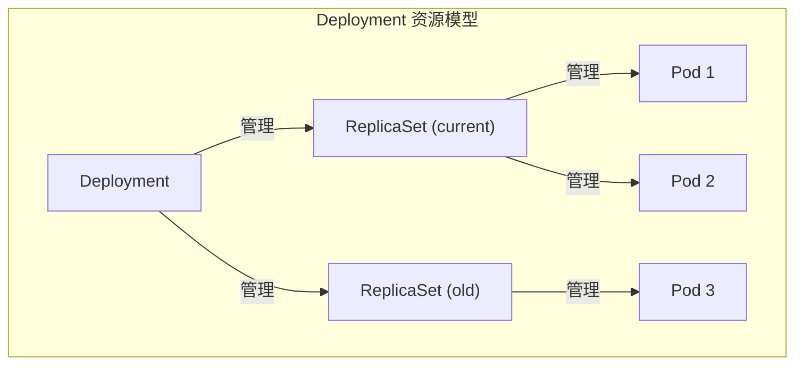
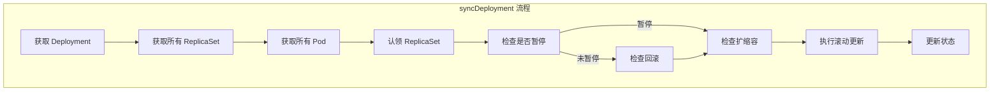
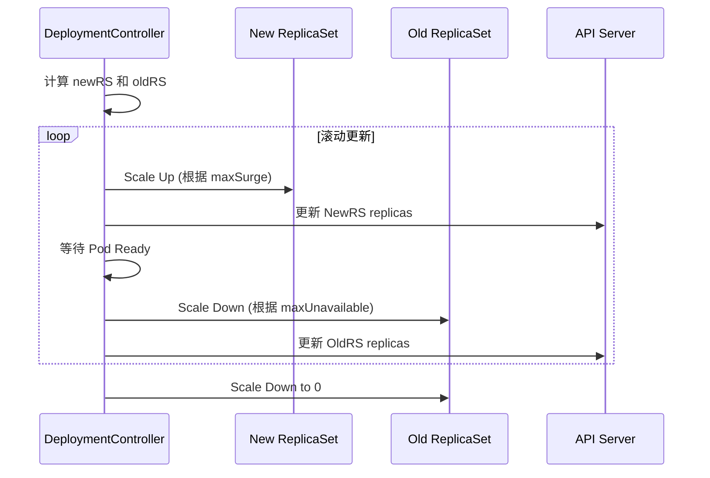
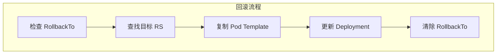

本文详细介绍 Deployment 控制器的实现原理，包括滚动更新、ReplicaSet 管理、回滚机制和暂停恢复。

## 1. Deployment 概述

### 1.1 Deployment 资源模型



### 1.2 核心功能

| 功能 | 说明 |
|-----|------|
| 声明式更新 | 声明期望状态，控制器负责达成 |
| 滚动更新 | 逐步替换旧 Pod，保证服务可用 |
| 版本管理 | 维护多个 ReplicaSet 版本 |
| 回滚 | 支持回滚到历史版本 |
| 暂停/恢复 | 支持暂停更新进行批量修改 |

### 1.3 Deployment Spec

```go
// Deployment Spec 定义
// staging/src/k8s.io/api/apps/v1/types.go

type DeploymentSpec struct {
    // 副本数
    Replicas *int32

    // 标签选择器
    Selector *metav1.LabelSelector

    // Pod 模板
    Template v1.PodTemplateSpec

    // 更新策略
    Strategy DeploymentStrategy

    // 最小就绪时间
    MinReadySeconds int32

    // 历史版本保留数
    RevisionHistoryLimit *int32

    // 是否暂停
    Paused bool

    // 进度截止时间
    ProgressDeadlineSeconds *int32
}

// 更新策略
type DeploymentStrategy struct {
    // 策略类型: Recreate 或 RollingUpdate
    Type DeploymentStrategyType

    // 滚动更新配置
    RollingUpdate *RollingUpdateDeployment
}

type RollingUpdateDeployment struct {
    // 最大不可用数
    MaxUnavailable *intstr.IntOrString

    // 最大超出数
    MaxSurge *intstr.IntOrString
}
```

## 2. 控制器结构

### 2.1 DeploymentController

```go
// DeploymentController 结构
// pkg/controller/deployment/deployment_controller.go

type DeploymentController struct {
    // ReplicaSet 控制
    rsControl controller.RSControlInterface

    // 客户端
    client clientset.Interface

    // 事件记录
    eventRecorder record.EventRecorder

    // 同步处理函数
    syncHandler func(ctx context.Context, dKey string) error

    // 入队函数
    enqueueDeployment func(deployment *apps.Deployment)

    // Informers
    dLister appslisters.DeploymentLister
    rsLister appslisters.ReplicaSetLister
    podLister corelisters.PodLister

    // 缓存同步
    dListerSynced cache.InformerSynced
    rsListerSynced cache.InformerSynced
    podListerSynced cache.InformerSynced

    // 工作队列
    queue workqueue.RateLimitingInterface
}
```

### 2.2 初始化

```go
// NewDeploymentController 创建控制器
// pkg/controller/deployment/deployment_controller.go

func NewDeploymentController(
    dInformer appsinformers.DeploymentInformer,
    rsInformer appsinformers.ReplicaSetInformer,
    podInformer coreinformers.PodInformer,
    client clientset.Interface,
) (*DeploymentController, error) {

    dc := &DeploymentController{
        client:        client,
        eventRecorder: recorder,
        queue:         workqueue.NewNamedRateLimitingQueue(workqueue.DefaultControllerRateLimiter(), "deployment"),
    }

    dc.rsControl = controller.RealRSControl{
        KubeClient: client,
        Recorder:   dc.eventRecorder,
    }

    // Deployment 事件处理
    dInformer.Informer().AddEventHandler(cache.ResourceEventHandlerFuncs{
        AddFunc:    dc.addDeployment,
        UpdateFunc: dc.updateDeployment,
        DeleteFunc: dc.deleteDeployment,
    })

    // ReplicaSet 事件处理
    rsInformer.Informer().AddEventHandler(cache.ResourceEventHandlerFuncs{
        AddFunc:    dc.addReplicaSet,
        UpdateFunc: dc.updateReplicaSet,
        DeleteFunc: dc.deleteReplicaSet,
    })

    // Pod 事件处理
    podInformer.Informer().AddEventHandler(cache.ResourceEventHandlerFuncs{
        DeleteFunc: dc.deletePod,
    })

    dc.syncHandler = dc.syncDeployment
    dc.enqueueDeployment = dc.enqueue

    dc.dLister = dInformer.Lister()
    dc.rsLister = rsInformer.Lister()
    dc.podLister = podInformer.Lister()

    return dc, nil
}
```

### 2.3 事件处理

```go
// Deployment 事件处理
// pkg/controller/deployment/deployment_controller.go

func (dc *DeploymentController) addDeployment(obj interface{}) {
    d := obj.(*apps.Deployment)
    klog.V(4).InfoS("Adding deployment", "deployment", klog.KObj(d))
    dc.enqueueDeployment(d)
}

func (dc *DeploymentController) updateDeployment(old, cur interface{}) {
    oldD := old.(*apps.Deployment)
    curD := cur.(*apps.Deployment)
    klog.V(4).InfoS("Updating deployment", "deployment", klog.KObj(oldD))
    dc.enqueueDeployment(curD)
}

// ReplicaSet 事件处理
func (dc *DeploymentController) addReplicaSet(obj interface{}) {
    rs := obj.(*apps.ReplicaSet)

    // 如果是孤儿 RS，忽略
    if rs.DeletionTimestamp != nil {
        dc.deleteReplicaSet(rs)
        return
    }

    // 查找所属 Deployment
    if controllerRef := metav1.GetControllerOf(rs); controllerRef != nil {
        d := dc.resolveControllerRef(rs.Namespace, controllerRef)
        if d == nil {
            return
        }
        klog.V(4).InfoS("ReplicaSet added", "replicaSet", klog.KObj(rs))
        dc.enqueueDeployment(d)
        return
    }

    // 孤儿 RS，查找可能采用它的 Deployment
    ds := dc.getDeploymentsForReplicaSet(rs)
    for _, d := range ds {
        dc.enqueueDeployment(d)
    }
}
```

## 3. 同步流程

### 3.1 syncDeployment 主流程



```go
// syncDeployment 同步单个 Deployment
// pkg/controller/deployment/deployment_controller.go

func (dc *DeploymentController) syncDeployment(ctx context.Context, key string) error {
    namespace, name, err := cache.SplitMetaNamespaceKey(key)
    if err != nil {
        return err
    }

    // 1. 获取 Deployment
    deployment, err := dc.dLister.Deployments(namespace).Get(name)
    if errors.IsNotFound(err) {
        klog.V(2).InfoS("Deployment has been deleted", "deployment", key)
        return nil
    }
    if err != nil {
        return err
    }

    // 深拷贝，避免修改缓存
    d := deployment.DeepCopy()

    // 2. 获取所有 ReplicaSet
    rsList, err := dc.getReplicaSetsForDeployment(ctx, d)
    if err != nil {
        return err
    }

    // 3. 获取所有 Pod
    podMap, err := dc.getPodMapForDeployment(d, rsList)
    if err != nil {
        return err
    }

    // 4. 如果正在删除，只更新状态
    if d.DeletionTimestamp != nil {
        return dc.syncStatusOnly(ctx, d, rsList)
    }

    // 5. 更新 Deployment 状态
    scalingEvent, err := dc.isScalingEvent(ctx, d, rsList)
    if err != nil {
        return err
    }

    if scalingEvent {
        return dc.sync(ctx, d, rsList)
    }

    switch d.Spec.Strategy.Type {
    case apps.RecreateDeploymentStrategyType:
        return dc.rolloutRecreate(ctx, d, rsList, podMap)
    case apps.RollingUpdateDeploymentStrategyType:
        return dc.rolloutRolling(ctx, d, rsList)
    }

    return fmt.Errorf("unexpected deployment strategy type: %s", d.Spec.Strategy.Type)
}
```

### 3.2 获取 ReplicaSet

```go
// getReplicaSetsForDeployment 获取 Deployment 的所有 RS
// pkg/controller/deployment/deployment_controller.go

func (dc *DeploymentController) getReplicaSetsForDeployment(ctx context.Context, d *apps.Deployment) ([]*apps.ReplicaSet, error) {
    // 列出命名空间下所有 RS
    rsList, err := dc.rsLister.ReplicaSets(d.Namespace).List(labels.Everything())
    if err != nil {
        return nil, err
    }

    // 创建选择器
    deploymentSelector, err := metav1.LabelSelectorAsSelector(d.Spec.Selector)
    if err != nil {
        return nil, fmt.Errorf("deployment %s has invalid label selector: %v", d.Name, err)
    }

    // 认领匹配的 RS
    canAdoptFunc := controller.RecheckDeletionTimestamp(func(ctx context.Context) (metav1.Object, error) {
        fresh, err := dc.client.AppsV1().Deployments(d.Namespace).Get(ctx, d.Name, metav1.GetOptions{})
        if err != nil {
            return nil, err
        }
        if fresh.UID != d.UID {
            return nil, fmt.Errorf("original Deployment %v/%v is gone: got uid %v, wanted %v", d.Namespace, d.Name, fresh.UID, d.UID)
        }
        return fresh, nil
    })

    cm := controller.NewReplicaSetControllerRefManager(dc.rsControl, d, deploymentSelector, controllerKind, canAdoptFunc)
    return cm.ClaimReplicaSets(ctx, rsList)
}
```

## 4. 滚动更新

### 4.1 滚动更新流程



### 4.2 rolloutRolling 实现

```go
// rolloutRolling 执行滚动更新
// pkg/controller/deployment/rolling.go

func (dc *DeploymentController) rolloutRolling(ctx context.Context, d *apps.Deployment, rsList []*apps.ReplicaSet) error {
    // 获取新旧 ReplicaSet
    newRS, oldRSs, err := dc.getAllReplicaSetsAndSyncRevision(ctx, d, rsList, true)
    if err != nil {
        return err
    }
    allRSs := append(oldRSs, newRS)

    // 扩容新 RS
    scaledUp, err := dc.reconcileNewReplicaSet(ctx, allRSs, newRS, d)
    if err != nil {
        return err
    }
    if scaledUp {
        // 扩容后返回，等待下一次同步
        return dc.syncRolloutStatus(ctx, allRSs, newRS, d)
    }

    // 缩容旧 RS
    scaledDown, err := dc.reconcileOldReplicaSets(ctx, allRSs, controller.FilterActiveReplicaSets(oldRSs), newRS, d)
    if err != nil {
        return err
    }
    if scaledDown {
        return dc.syncRolloutStatus(ctx, allRSs, newRS, d)
    }

    // 清理旧 RS
    if deploymentutil.DeploymentComplete(d, &d.Status) {
        if err := dc.cleanupDeployment(ctx, oldRSs, d); err != nil {
            return err
        }
    }

    return dc.syncRolloutStatus(ctx, allRSs, newRS, d)
}
```

### 4.3 扩容新 ReplicaSet

```go
// reconcileNewReplicaSet 扩容新 RS
// pkg/controller/deployment/rolling.go

func (dc *DeploymentController) reconcileNewReplicaSet(ctx context.Context, allRSs []*apps.ReplicaSet, newRS *apps.ReplicaSet, deployment *apps.Deployment) (bool, error) {
    // 如果新 RS 已达到期望副本数，不需要扩容
    if *(newRS.Spec.Replicas) == *(deployment.Spec.Replicas) {
        return false, nil
    }

    // 如果新 RS 副本数大于期望，需要缩容
    if *(newRS.Spec.Replicas) > *(deployment.Spec.Replicas) {
        scaled, _, err := dc.scaleReplicaSetAndRecordEvent(ctx, newRS, *(deployment.Spec.Replicas), deployment)
        return scaled, err
    }

    // 计算可以扩容的数量
    newReplicasCount, err := deploymentutil.NewRSNewReplicas(deployment, allRSs, newRS)
    if err != nil {
        return false, err
    }

    scaled, _, err := dc.scaleReplicaSetAndRecordEvent(ctx, newRS, newReplicasCount, deployment)
    return scaled, err
}

// NewRSNewReplicas 计算新 RS 的目标副本数
// pkg/controller/deployment/util/deployment_util.go

func NewRSNewReplicas(deployment *apps.Deployment, allRSs []*apps.ReplicaSet, newRS *apps.ReplicaSet) (int32, error) {
    switch deployment.Spec.Strategy.Type {
    case apps.RollingUpdateDeploymentStrategyType:
        // 计算 maxSurge
        maxSurge, err := intstrutil.GetScaledValueFromIntOrPercent(
            intstrutil.ValueOrDefault(deployment.Spec.Strategy.RollingUpdate.MaxSurge, intstrutil.FromInt(0)),
            int(*(deployment.Spec.Replicas)), true)
        if err != nil {
            return 0, err
        }

        // 当前总副本数
        currentPodCount := GetReplicaCountForReplicaSets(allRSs)

        // 最大允许副本数
        maxTotalPods := *(deployment.Spec.Replicas) + int32(maxSurge)

        if currentPodCount >= maxTotalPods {
            // 已达到最大，不能再扩容
            return *(newRS.Spec.Replicas), nil
        }

        // 可扩容数量
        scaleUpCount := maxTotalPods - currentPodCount
        scaleUpCount = int32(integer.IntMin(int(scaleUpCount), int(*(deployment.Spec.Replicas)-*(newRS.Spec.Replicas))))

        return *(newRS.Spec.Replicas) + scaleUpCount, nil

    case apps.RecreateDeploymentStrategyType:
        return *(deployment.Spec.Replicas), nil

    default:
        return 0, fmt.Errorf("deployment type %v isn't supported", deployment.Spec.Strategy.Type)
    }
}
```

### 4.4 缩容旧 ReplicaSet

```go
// reconcileOldReplicaSets 缩容旧 RS
// pkg/controller/deployment/rolling.go

func (dc *DeploymentController) reconcileOldReplicaSets(ctx context.Context, allRSs []*apps.ReplicaSet, oldRSs []*apps.ReplicaSet, newRS *apps.ReplicaSet, deployment *apps.Deployment) (bool, error) {
    oldPodsCount := GetReplicaCountForReplicaSets(oldRSs)
    if oldPodsCount == 0 {
        // 旧 RS 已经缩容完成
        return false, nil
    }

    allPodsCount := GetReplicaCountForReplicaSets(allRSs)

    // 计算 maxUnavailable
    maxUnavailable := deploymentutil.MaxUnavailable(*deployment)

    // 最小可用副本数
    minAvailable := *(deployment.Spec.Replicas) - maxUnavailable

    // 新 RS 可用副本数
    newRSUnavailablePodCount := *(newRS.Spec.Replicas) - newRS.Status.AvailableReplicas

    // 最大可缩容数
    maxScaledDown := allPodsCount - minAvailable - newRSUnavailablePodCount
    if maxScaledDown <= 0 {
        return false, nil
    }

    // 按创建时间排序旧 RS (优先缩容旧的)
    oldRSs, cleanupCount, err := dc.cleanupUnhealthyReplicas(ctx, oldRSs, deployment, maxScaledDown)
    if err != nil {
        return false, nil
    }

    // 继续缩容
    allRSs = append(oldRSs, newRS)
    scaledDownCount, err := dc.scaleDownOldReplicaSetsForRollingUpdate(ctx, allRSs, oldRSs, deployment)
    if err != nil {
        return false, nil
    }

    return cleanupCount > 0 || scaledDownCount > 0, nil
}
```

## 5. 版本管理

### 5.1 Revision 机制

```go
// Revision 通过 ReplicaSet 的 annotation 记录
const (
    RevisionAnnotation        = "deployment.kubernetes.io/revision"
    RevisionHistoryAnnotation = "deployment.kubernetes.io/revision-history"
    DesiredReplicasAnnotation = "deployment.kubernetes.io/desired-replicas"
    MaxReplicasAnnotation     = "deployment.kubernetes.io/max-replicas"
)

// 获取 Revision
func Revision(rs *apps.ReplicaSet) (int64, error) {
    v, ok := rs.Annotations[RevisionAnnotation]
    if !ok {
        return 0, nil
    }
    return strconv.ParseInt(v, 10, 64)
}

// 设置 Revision
func SetNewReplicaSetAnnotations(deployment *apps.Deployment, newRS *apps.ReplicaSet, newRevision string, exists bool, revHistoryLimitInChars int) bool {
    // 更新 Revision
    if newRS.Annotations == nil {
        newRS.Annotations = make(map[string]string)
    }
    newRS.Annotations[RevisionAnnotation] = newRevision

    return true
}
```

### 5.2 获取新旧 ReplicaSet

```go
// getAllReplicaSetsAndSyncRevision 获取并同步版本
// pkg/controller/deployment/sync.go

func (dc *DeploymentController) getAllReplicaSetsAndSyncRevision(ctx context.Context, d *apps.Deployment, rsList []*apps.ReplicaSet, createIfNotExisted bool) (*apps.ReplicaSet, []*apps.ReplicaSet, error) {
    // 按 Revision 排序
    sort.Sort(controller.ReplicaSetsByRevision(rsList))

    // 查找新 RS (Pod Template Hash 匹配)
    newRS := FindNewReplicaSet(d, rsList)

    if newRS == nil && createIfNotExisted {
        // 创建新 RS
        newRS, err := dc.createNewReplicaSet(ctx, d, rsList)
        if err != nil {
            return nil, nil, err
        }
        return newRS, rsList, nil
    }

    // 更新新 RS 的 Revision
    if newRS != nil {
        newRevision := strconv.FormatInt(MaxRevision(rsList)+1, 10)
        if newRS.Annotations[RevisionAnnotation] != newRevision {
            nsCopy := newRS.DeepCopy()
            nsCopy.Annotations[RevisionAnnotation] = newRevision
            newRS, err = dc.client.AppsV1().ReplicaSets(nsCopy.Namespace).Update(ctx, nsCopy, metav1.UpdateOptions{})
            if err != nil {
                return nil, nil, err
            }
        }
    }

    // 分离新旧 RS
    oldRSs := make([]*apps.ReplicaSet, 0, len(rsList))
    for _, rs := range rsList {
        if newRS != nil && rs.UID == newRS.UID {
            continue
        }
        oldRSs = append(oldRSs, rs)
    }

    return newRS, oldRSs, nil
}
```

### 5.3 清理历史版本

```go
// cleanupDeployment 清理旧版本
// pkg/controller/deployment/sync.go

func (dc *DeploymentController) cleanupDeployment(ctx context.Context, oldRSs []*apps.ReplicaSet, deployment *apps.Deployment) error {
    if deployment.Spec.RevisionHistoryLimit == nil {
        return nil
    }

    // 保留的历史版本数
    historyLimit := int(*deployment.Spec.RevisionHistoryLimit)

    // 过滤出可清理的 RS (副本数为 0)
    cleanableRSes := controller.FilterActiveReplicaSets(oldRSs)
    diff := len(cleanableRSes) - historyLimit

    if diff <= 0 {
        return nil
    }

    // 按 Revision 排序 (从小到大)
    sort.Sort(controller.ReplicaSetsByRevision(cleanableRSes))

    // 删除最旧的
    for i := 0; i < diff; i++ {
        rs := cleanableRSes[i]
        if rs.Status.Replicas != 0 {
            continue
        }

        klog.V(4).InfoS("Trying to cleanup ReplicaSet", "replicaSet", klog.KObj(rs))
        if err := dc.client.AppsV1().ReplicaSets(rs.Namespace).Delete(ctx, rs.Name, metav1.DeleteOptions{}); err != nil && !errors.IsNotFound(err) {
            return err
        }
    }

    return nil
}
```

## 6. 回滚机制

### 6.1 回滚流程



### 6.2 回滚实现

```go
// rollback 执行回滚
// pkg/controller/deployment/rollback.go

func (dc *DeploymentController) rollback(ctx context.Context, d *apps.Deployment, rsList []*apps.ReplicaSet) error {
    // 查找目标版本
    toRevision := d.Spec.RollbackTo.Revision
    if toRevision == 0 {
        // 回滚到上一个版本
        toRevision = LastRevision(rsList)
    }

    // 查找目标 RS
    for _, rs := range rsList {
        v, err := Revision(rs)
        if err != nil {
            continue
        }
        if v == toRevision {
            // 找到目标版本，执行回滚
            return dc.rollbackToTemplate(ctx, d, rs)
        }
    }

    return fmt.Errorf("unable to find the revision to rollback to")
}

// rollbackToTemplate 回滚到指定模板
func (dc *DeploymentController) rollbackToTemplate(ctx context.Context, d *apps.Deployment, rs *apps.ReplicaSet) error {
    // 复制 Pod Template
    d.Spec.Template = rs.Spec.Template

    // 清除 RollbackTo
    d.Spec.RollbackTo = nil

    // 更新 Deployment
    _, err := dc.client.AppsV1().Deployments(d.Namespace).Update(ctx, d, metav1.UpdateOptions{})
    if err != nil {
        return err
    }

    dc.emitRollbackNormalEvent(d, fmt.Sprintf("Rolled back deployment %q to revision %d", d.Name, Revision(rs)))
    return nil
}
```

## 7. 暂停与恢复

### 7.1 暂停机制

```go
// sync 处理暂停状态
// pkg/controller/deployment/sync.go

func (dc *DeploymentController) sync(ctx context.Context, d *apps.Deployment, rsList []*apps.ReplicaSet) error {
    newRS, oldRSs, err := dc.getAllReplicaSetsAndSyncRevision(ctx, d, rsList, false)
    if err != nil {
        return err
    }

    // 如果暂停，只进行扩缩容
    if d.Spec.Paused {
        return dc.syncPausedDeployment(ctx, d, newRS, oldRSs)
    }

    // 正常同步
    return dc.syncRollingDeployment(ctx, d, newRS, oldRSs)
}

// syncPausedDeployment 处理暂停的 Deployment
func (dc *DeploymentController) syncPausedDeployment(ctx context.Context, d *apps.Deployment, newRS *apps.ReplicaSet, oldRSs []*apps.ReplicaSet) error {
    // 只允许扩缩容
    if newRS != nil {
        _, err := dc.scaleReplicaSet(ctx, newRS, *(d.Spec.Replicas), d)
        return err
    }
    return nil
}
```

### 7.2 暂停使用

```bash
# 暂停 Deployment
kubectl rollout pause deployment/nginx

# 进行多次修改
kubectl set image deployment/nginx nginx=nginx:1.20
kubectl set resources deployment/nginx -c=nginx --limits=cpu=200m,memory=512Mi

# 恢复，一次性应用所有修改
kubectl rollout resume deployment/nginx
```

## 8. 状态更新

### 8.1 Deployment Status

```go
// DeploymentStatus 定义
// staging/src/k8s.io/api/apps/v1/types.go

type DeploymentStatus struct {
    // 观察到的版本
    ObservedGeneration int64

    // 副本数
    Replicas            int32
    UpdatedReplicas     int32
    ReadyReplicas       int32
    AvailableReplicas   int32
    UnavailableReplicas int32

    // 条件
    Conditions []DeploymentCondition

    // 碰撞计数
    CollisionCount *int32
}

// 条件类型
const (
    DeploymentAvailable   DeploymentConditionType = "Available"
    DeploymentProgressing DeploymentConditionType = "Progressing"
    DeploymentReplicaFailure DeploymentConditionType = "ReplicaFailure"
)
```

### 8.2 状态同步

```go
// syncRolloutStatus 同步状态
// pkg/controller/deployment/progress.go

func (dc *DeploymentController) syncRolloutStatus(ctx context.Context, allRSs []*apps.ReplicaSet, newRS *apps.ReplicaSet, d *apps.Deployment) error {
    newStatus := calculateStatus(allRSs, newRS, d)

    // 更新条件
    if deploymentutil.DeploymentProgressing(d, &newStatus) {
        newStatus.Conditions = setDeploymentCondition(newStatus.Conditions, apps.DeploymentCondition{
            Type:    apps.DeploymentProgressing,
            Status:  v1.ConditionTrue,
            Reason:  "NewReplicaSetAvailable",
            Message: fmt.Sprintf("ReplicaSet %q has successfully progressed.", newRS.Name),
        })
    }

    if deploymentutil.DeploymentComplete(d, &newStatus) {
        newStatus.Conditions = setDeploymentCondition(newStatus.Conditions, apps.DeploymentCondition{
            Type:    apps.DeploymentAvailable,
            Status:  v1.ConditionTrue,
            Reason:  "MinimumReplicasAvailable",
            Message: "Deployment has minimum availability.",
        })
    }

    // 更新状态
    _, err := dc.client.AppsV1().Deployments(d.Namespace).UpdateStatus(ctx, d, metav1.UpdateOptions{})
    return err
}
```

## 小结

本文介绍了 Deployment 控制器的实现：

1. **资源模型**：Deployment -> ReplicaSet -> Pod 的层级关系
2. **控制器结构**：Informer、事件处理、工作队列
3. **同步流程**：获取 RS、认领、扩缩容、滚动更新
4. **滚动更新**：MaxSurge、MaxUnavailable、分步扩缩容
5. **版本管理**：Revision 机制、历史版本清理
6. **回滚机制**：回滚到指定版本
7. **暂停恢复**：批量修改支持

下一篇将详细介绍 ReplicaSet 控制器。
