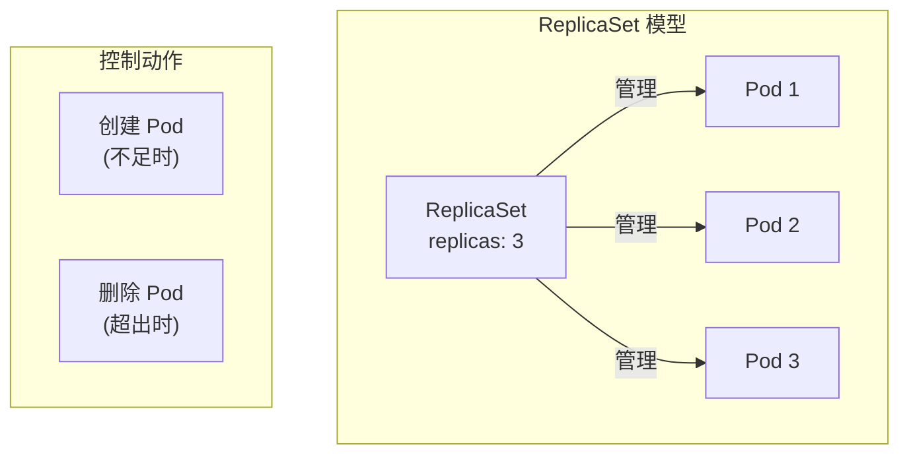
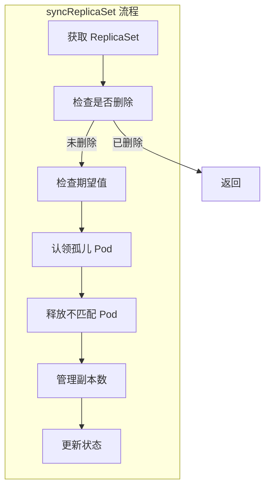
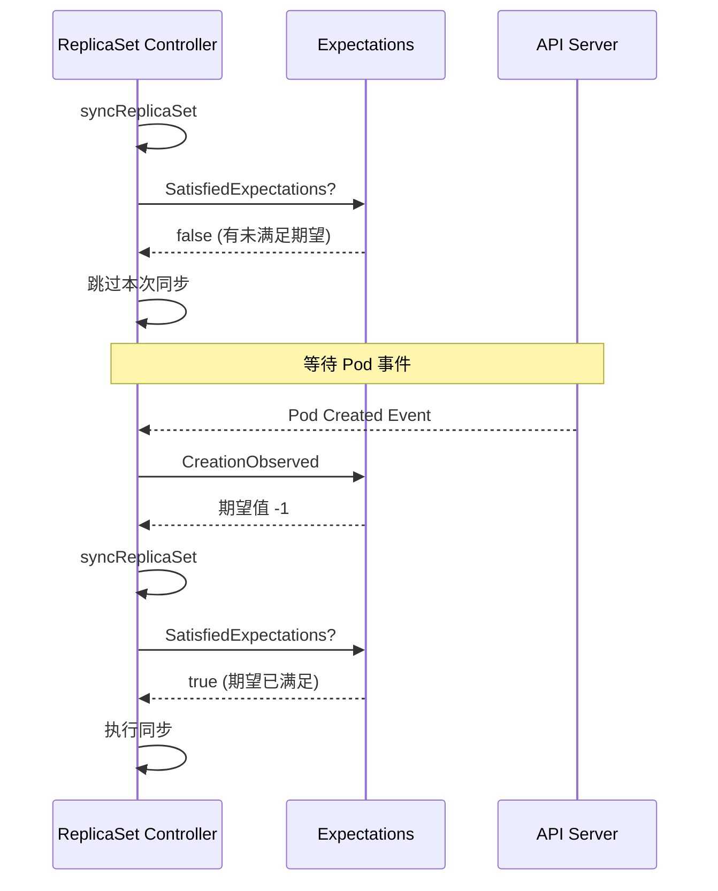
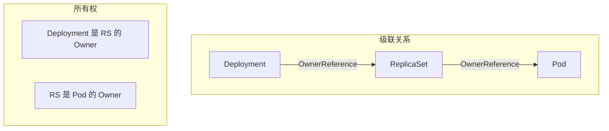

本文详细介绍 ReplicaSet 控制器的实现原理，包括 Pod 副本管理、扩缩容逻辑和状态计算。

## 1. ReplicaSet 概述

### 1.1 核心职责

ReplicaSet 确保指定数量的 Pod 副本始终运行：



### 1.2 ReplicaSet Spec

```go
// ReplicaSet Spec 定义
// staging/src/k8s.io/api/apps/v1/types.go

type ReplicaSetSpec struct {
    // 副本数
    Replicas *int32

    // 最小就绪时间
    MinReadySeconds int32

    // 标签选择器
    Selector *metav1.LabelSelector

    // Pod 模板
    Template v1.PodTemplateSpec
}

type ReplicaSetStatus struct {
    // 副本数统计
    Replicas             int32
    FullyLabeledReplicas int32
    ReadyReplicas        int32
    AvailableReplicas    int32

    // 观察到的版本
    ObservedGeneration int64

    // 条件
    Conditions []ReplicaSetCondition
}
```

## 2. 控制器结构

### 2.1 ReplicaSetController

```go
// ReplicaSetController 结构
// pkg/controller/replicaset/replica_set.go

type ReplicaSetController struct {
    // GroupVersionKind
    GroupVersionKind schema.GroupVersionKind

    // 客户端
    kubeClient clientset.Interface

    // Pod 控制
    podControl controller.PodControlInterface

    // 突发控制
    burstReplicas int

    // 同步处理函数
    syncHandler func(ctx context.Context, rsKey string) error

    // 期望值缓存
    expectations *controller.UIDTrackingControllerExpectations

    // Informers
    rsLister appslisters.ReplicaSetLister
    rsListerSynced cache.InformerSynced
    podLister corelisters.PodLister
    podListerSynced cache.InformerSynced

    // 工作队列
    queue workqueue.RateLimitingInterface
}
```

### 2.2 初始化

```go
// NewReplicaSetController 创建控制器
// pkg/controller/replicaset/replica_set.go

func NewReplicaSetController(
    rsInformer appsinformers.ReplicaSetInformer,
    podInformer coreinformers.PodInformer,
    kubeClient clientset.Interface,
    burstReplicas int,
) *ReplicaSetController {

    rsc := &ReplicaSetController{
        GroupVersionKind: apps.SchemeGroupVersion.WithKind("ReplicaSet"),
        kubeClient:       kubeClient,
        podControl: controller.RealPodControl{
            KubeClient: kubeClient,
            Recorder:   eventBroadcaster.NewRecorder(scheme.Scheme, v1.EventSource{Component: "replicaset-controller"}),
        },
        burstReplicas: burstReplicas,
        expectations:  controller.NewUIDTrackingControllerExpectations(controller.NewControllerExpectations()),
        queue:         workqueue.NewNamedRateLimitingQueue(workqueue.DefaultControllerRateLimiter(), "replicaset"),
    }

    // ReplicaSet 事件处理
    rsInformer.Informer().AddEventHandler(cache.ResourceEventHandlerFuncs{
        AddFunc:    rsc.addRS,
        UpdateFunc: rsc.updateRS,
        DeleteFunc: rsc.deleteRS,
    })

    // Pod 事件处理
    podInformer.Informer().AddEventHandler(cache.ResourceEventHandlerFuncs{
        AddFunc:    rsc.addPod,
        UpdateFunc: rsc.updatePod,
        DeleteFunc: rsc.deletePod,
    })

    rsc.syncHandler = rsc.syncReplicaSet
    rsc.rsLister = rsInformer.Lister()
    rsc.podLister = podInformer.Lister()

    return rsc
}
```

### 2.3 Pod 事件处理

```go
// Pod 事件处理
// pkg/controller/replicaset/replica_set.go

func (rsc *ReplicaSetController) addPod(obj interface{}) {
    pod := obj.(*v1.Pod)

    // 如果是删除中的 Pod，忽略
    if pod.DeletionTimestamp != nil {
        rsc.deletePod(pod)
        return
    }

    // 查找所属 ReplicaSet
    if controllerRef := metav1.GetControllerOf(pod); controllerRef != nil {
        rs := rsc.resolveControllerRef(pod.Namespace, controllerRef)
        if rs == nil {
            return
        }
        rsKey, err := controller.KeyFunc(rs)
        if err != nil {
            return
        }
        // 满足期望
        rsc.expectations.CreationObserved(rsKey)
        rsc.queue.Add(rsKey)
        return
    }

    // 孤儿 Pod，查找可能采用它的 RS
    rss := rsc.getPodReplicaSets(pod)
    for _, rs := range rss {
        rsc.enqueueRS(rs)
    }
}

func (rsc *ReplicaSetController) deletePod(obj interface{}) {
    pod, ok := obj.(*v1.Pod)
    if !ok {
        tombstone, ok := obj.(cache.DeletedFinalStateUnknown)
        if !ok {
            return
        }
        pod, ok = tombstone.Obj.(*v1.Pod)
        if !ok {
            return
        }
    }

    controllerRef := metav1.GetControllerOf(pod)
    if controllerRef == nil {
        return
    }

    rs := rsc.resolveControllerRef(pod.Namespace, controllerRef)
    if rs == nil {
        return
    }

    rsKey, err := controller.KeyFunc(rs)
    if err != nil {
        return
    }
    // 满足删除期望
    rsc.expectations.DeletionObserved(rsKey, controller.PodKey(pod))
    rsc.queue.Add(rsKey)
}
```

## 3. 同步流程

### 3.1 syncReplicaSet 主流程



```go
// syncReplicaSet 同步单个 ReplicaSet
// pkg/controller/replicaset/replica_set.go

func (rsc *ReplicaSetController) syncReplicaSet(ctx context.Context, key string) error {
    namespace, name, err := cache.SplitMetaNamespaceKey(key)
    if err != nil {
        return err
    }

    // 1. 获取 ReplicaSet
    rs, err := rsc.rsLister.ReplicaSets(namespace).Get(name)
    if errors.IsNotFound(err) {
        // RS 已删除，清理期望值
        rsc.expectations.DeleteExpectations(key)
        return nil
    }
    if err != nil {
        return err
    }

    // 2. 检查选择器
    selector, err := metav1.LabelSelectorAsSelector(rs.Spec.Selector)
    if err != nil {
        return err
    }

    // 3. 获取所有 Pod
    allPods, err := rsc.podLister.Pods(rs.Namespace).List(labels.Everything())
    if err != nil {
        return err
    }

    // 4. 过滤活跃 Pod
    filteredPods := controller.FilterActivePods(allPods)

    // 5. 认领和释放 Pod
    filteredPods, err = rsc.claimPods(ctx, rs, selector, filteredPods)
    if err != nil {
        return err
    }

    // 6. 检查期望值是否满足
    rsNeedsSync := rsc.expectations.SatisfiedExpectations(key)

    var manageReplicasErr error
    if rsNeedsSync && rs.DeletionTimestamp == nil {
        // 7. 管理副本数
        manageReplicasErr = rsc.manageReplicas(ctx, filteredPods, rs)
    }

    // 8. 更新状态
    rs = rs.DeepCopy()
    newStatus := calculateStatus(rs, filteredPods, manageReplicasErr)

    updatedRS, err := updateReplicaSetStatus(ctx, rsc.kubeClient.AppsV1().ReplicaSets(rs.Namespace), rs, newStatus)
    if err != nil {
        return err
    }

    // 9. 处理 MinReadySeconds
    if manageReplicasErr == nil && updatedRS.Spec.MinReadySeconds > 0 &&
        updatedRS.Status.ReadyReplicas == *(updatedRS.Spec.Replicas) &&
        updatedRS.Status.AvailableReplicas != *(updatedRS.Spec.Replicas) {
        rsc.queue.AddAfter(key, time.Duration(updatedRS.Spec.MinReadySeconds)*time.Second)
    }

    return manageReplicasErr
}
```

### 3.2 Pod 认领

```go
// claimPods 认领匹配的 Pod
// pkg/controller/replicaset/replica_set.go

func (rsc *ReplicaSetController) claimPods(ctx context.Context, rs *apps.ReplicaSet, selector labels.Selector, filteredPods []*v1.Pod) ([]*v1.Pod, error) {
    canAdoptFunc := controller.RecheckDeletionTimestamp(func(ctx context.Context) (metav1.Object, error) {
        fresh, err := rsc.kubeClient.AppsV1().ReplicaSets(rs.Namespace).Get(ctx, rs.Name, metav1.GetOptions{})
        if err != nil {
            return nil, err
        }
        if fresh.UID != rs.UID {
            return nil, fmt.Errorf("original ReplicaSet %v/%v is gone, got uid %v, wanted %v", rs.Namespace, rs.Name, fresh.UID, rs.UID)
        }
        return fresh, nil
    })

    cm := controller.NewPodControllerRefManager(rsc.podControl, rs, selector, rsc.GroupVersionKind, canAdoptFunc)
    return cm.ClaimPods(ctx, filteredPods)
}
```

## 4. 副本管理

### 4.1 manageReplicas

```go
// manageReplicas 管理 Pod 副本数
// pkg/controller/replicaset/replica_set.go

func (rsc *ReplicaSetController) manageReplicas(ctx context.Context, filteredPods []*v1.Pod, rs *apps.ReplicaSet) error {
    // 计算差值
    diff := len(filteredPods) - int(*(rs.Spec.Replicas))

    rsKey, err := controller.KeyFunc(rs)
    if err != nil {
        return err
    }

    if diff < 0 {
        // 需要创建 Pod
        diff *= -1
        if diff > rsc.burstReplicas {
            diff = rsc.burstReplicas
        }

        // 设置创建期望
        rsc.expectations.ExpectCreations(rsKey, diff)

        // 慢启动批量创建
        successfulCreations, err := slowStartBatch(diff, controller.SlowStartInitialBatchSize, func() error {
            err := rsc.podControl.CreatePods(ctx, rs.Namespace, &rs.Spec.Template, rs, metav1.NewControllerRef(rs, rsc.GroupVersionKind))
            return err
        })

        // 调整期望值
        if skippedPods := diff - successfulCreations; skippedPods > 0 {
            for i := 0; i < skippedPods; i++ {
                rsc.expectations.CreationObserved(rsKey)
            }
        }

        return err

    } else if diff > 0 {
        // 需要删除 Pod
        if diff > rsc.burstReplicas {
            diff = rsc.burstReplicas
        }

        // 选择要删除的 Pod
        podsToDelete := getPodsToDelete(filteredPods, rs, diff)

        // 设置删除期望
        rsc.expectations.ExpectDeletions(rsKey, getPodKeys(podsToDelete))

        // 并行删除
        errCh := make(chan error, diff)
        var wg sync.WaitGroup
        wg.Add(diff)

        for _, pod := range podsToDelete {
            go func(targetPod *v1.Pod) {
                defer wg.Done()
                if err := rsc.podControl.DeletePod(ctx, rs.Namespace, targetPod.Name, rs); err != nil {
                    podKey := controller.PodKey(targetPod)
                    rsc.expectations.DeletionObserved(rsKey, podKey)
                    errCh <- err
                }
            }(pod)
        }

        wg.Wait()

        select {
        case err := <-errCh:
            return err
        default:
        }
    }

    return nil
}
```

### 4.2 慢启动批量创建

```go
// slowStartBatch 慢启动批量创建
// pkg/controller/replicaset/replica_set.go

func slowStartBatch(count int, initialBatchSize int, fn func() error) (int, error) {
    remaining := count
    successes := 0

    // 批次大小从 initialBatchSize 开始，每次翻倍
    for batchSize := integer.IntMin(remaining, initialBatchSize); batchSize > 0; batchSize = integer.IntMin(2*batchSize, remaining) {
        errCh := make(chan error, batchSize)
        var wg sync.WaitGroup
        wg.Add(batchSize)

        for i := 0; i < batchSize; i++ {
            go func() {
                defer wg.Done()
                if err := fn(); err != nil {
                    errCh <- err
                }
            }()
        }

        wg.Wait()
        curSuccesses := batchSize - len(errCh)
        successes += curSuccesses
        remaining -= batchSize

        if len(errCh) > 0 {
            return successes, <-errCh
        }
    }

    return successes, nil
}
```

### 4.3 Pod 删除选择

```go
// getPodsToDelete 选择要删除的 Pod
// pkg/controller/replicaset/replica_set.go

func getPodsToDelete(filteredPods []*v1.Pod, rs *apps.ReplicaSet, diff int) []*v1.Pod {
    // 按优先级排序
    sort.Sort(controller.ActivePods(filteredPods))

    // 返回前 diff 个
    return filteredPods[:diff]
}

// ActivePods 排序规则
// pkg/controller/controller_utils.go

type ActivePods []*v1.Pod

func (s ActivePods) Less(i, j int) bool {
    // 1. 未分配节点的 Pod 优先删除
    if s[i].Spec.NodeName != s[j].Spec.NodeName && (len(s[i].Spec.NodeName) == 0 || len(s[j].Spec.NodeName) == 0) {
        return len(s[i].Spec.NodeName) == 0
    }

    // 2. Pending Pod 优先删除
    if podutil.IsPodReady(s[i]) != podutil.IsPodReady(s[j]) {
        return !podutil.IsPodReady(s[i])
    }

    // 3. 运行时间短的优先删除
    if s[i].Status.StartTime != nil && s[j].Status.StartTime != nil {
        return s[i].Status.StartTime.After(s[j].Status.StartTime.Time)
    }

    // 4. 重启次数多的优先删除
    if c1, c2 := maxContainerRestarts(s[i]), maxContainerRestarts(s[j]); c1 != c2 {
        return c1 > c2
    }

    // 5. 创建时间晚的优先删除
    if s[i].CreationTimestamp != s[j].CreationTimestamp {
        return s[i].CreationTimestamp.After(s[j].CreationTimestamp.Time)
    }

    return false
}
```

## 5. 期望值机制

### 5.1 ControllerExpectations

```go
// ControllerExpectations 期望值缓存
// pkg/controller/controller_utils.go

type ControllerExpectations struct {
    cache.Store
}

type ControlleeExpectations struct {
    add       int64
    del       int64
    key       string
    timestamp time.Time
}

// 设置创建期望
func (e *ControllerExpectations) ExpectCreations(controllerKey string, adds int) error {
    return e.SetExpectations(controllerKey, adds, 0)
}

// 设置删除期望
func (e *ControllerExpectations) ExpectDeletions(controllerKey string, dels int) error {
    return e.SetExpectations(controllerKey, 0, dels)
}

// 观察到创建
func (e *ControllerExpectations) CreationObserved(controllerKey string) {
    e.LowerExpectations(controllerKey, 1, 0)
}

// 观察到删除
func (e *ControllerExpectations) DeletionObserved(controllerKey string, deletedKey string) {
    e.LowerExpectations(controllerKey, 0, 1)
}

// 检查期望是否满足
func (e *ControllerExpectations) SatisfiedExpectations(controllerKey string) bool {
    if exp, exists, err := e.GetExpectations(controllerKey); exists {
        if exp.Fulfilled() {
            return true
        } else if exp.isExpired() {
            return true
        }
        return false
    } else if err != nil {
        return false
    }
    // 没有期望，满足
    return true
}
```

### 5.2 期望值工作流程



## 6. 状态计算

### 6.1 calculateStatus

```go
// calculateStatus 计算 ReplicaSet 状态
// pkg/controller/replicaset/replica_set.go

func calculateStatus(rs *apps.ReplicaSet, filteredPods []*v1.Pod, manageReplicasErr error) apps.ReplicaSetStatus {
    newStatus := rs.Status
    newStatus.ObservedGeneration = rs.Generation

    // 统计各状态 Pod 数量
    fullyLabeledReplicasCount := 0
    readyReplicasCount := 0
    availableReplicasCount := 0

    for _, pod := range filteredPods {
        // 标签完全匹配
        if labels.Set(rs.Spec.Template.Labels).AsSelectorPreValidated().Matches(labels.Set(pod.Labels)) {
            fullyLabeledReplicasCount++
        }

        // Ready 状态
        if podutil.IsPodReady(pod) {
            readyReplicasCount++

            // Available 状态 (考虑 MinReadySeconds)
            if podutil.IsPodAvailable(pod, rs.Spec.MinReadySeconds, metav1.Now()) {
                availableReplicasCount++
            }
        }
    }

    newStatus.Replicas = int32(len(filteredPods))
    newStatus.FullyLabeledReplicas = int32(fullyLabeledReplicasCount)
    newStatus.ReadyReplicas = int32(readyReplicasCount)
    newStatus.AvailableReplicas = int32(availableReplicasCount)

    // 设置条件
    newStatus.Conditions = setReplicaSetConditions(rs.Status.Conditions, manageReplicasErr)

    return newStatus
}
```

### 6.2 Pod 可用性判断

```go
// IsPodAvailable 检查 Pod 是否可用
// pkg/api/v1/pod/util.go

func IsPodAvailable(pod *v1.Pod, minReadySeconds int32, now metav1.Time) bool {
    if !IsPodReady(pod) {
        return false
    }

    c := GetPodReadyCondition(pod.Status)
    if c == nil {
        return false
    }

    // 检查 MinReadySeconds
    minReadySecondsDuration := time.Duration(minReadySeconds) * time.Second
    if minReadySeconds == 0 || (!c.LastTransitionTime.IsZero() && c.LastTransitionTime.Add(minReadySecondsDuration).Before(now.Time)) {
        return true
    }

    return false
}

// IsPodReady 检查 Pod 是否 Ready
func IsPodReady(pod *v1.Pod) bool {
    return IsPodReadyConditionTrue(pod.Status)
}

func IsPodReadyConditionTrue(status v1.PodStatus) bool {
    condition := GetPodReadyCondition(status)
    return condition != nil && condition.Status == v1.ConditionTrue
}
```

## 7. 模板哈希

### 7.1 Pod Template Hash

```go
// Pod Template Hash 用于区分不同版本的 Pod
// pkg/controller/controller_utils.go

const (
    // Label 名称
    DefaultDeploymentUniqueLabelKey = "pod-template-hash"
)

// ComputeHash 计算 Pod 模板哈希
func ComputeHash(template *v1.PodTemplateSpec, collisionCount *int32) string {
    podTemplateSpecHasher := fnv.New32a()
    hashutil.DeepHashObject(podTemplateSpecHasher, *template)

    // 处理碰撞
    if collisionCount != nil {
        collisionCountBytes := make([]byte, 8)
        binary.LittleEndian.PutUint32(collisionCountBytes, uint32(*collisionCount))
        podTemplateSpecHasher.Write(collisionCountBytes)
    }

    return rand.SafeEncodeString(fmt.Sprint(podTemplateSpecHasher.Sum32()))
}

// 在 Deployment 控制器中使用
func (dc *DeploymentController) getNewReplicaSet(ctx context.Context, d *apps.Deployment, rsList []*apps.ReplicaSet) (*apps.ReplicaSet, error) {
    // 计算模板哈希
    hash := ComputeHash(&d.Spec.Template, d.Status.CollisionCount)

    // 添加到 Pod 模板标签
    newRSTemplate := *d.Spec.Template.DeepCopy()
    newRSTemplate.Labels[DefaultDeploymentUniqueLabelKey] = hash

    // 创建 ReplicaSet
    // ...
}
```

## 8. 与 Deployment 的协作

### 8.1 级联关系



### 8.2 OwnerReference

```go
// 创建 Pod 时设置 OwnerReference
// pkg/controller/controller_utils.go

func (r RealPodControl) CreatePods(ctx context.Context, namespace string, template *v1.PodTemplateSpec, controllerObject runtime.Object, controllerRef *metav1.OwnerReference) error {
    pod, err := GetPodFromTemplate(template, controllerObject, controllerRef)
    if err != nil {
        return err
    }

    // 设置 OwnerReference
    if controllerRef != nil {
        pod.OwnerReferences = append(pod.OwnerReferences, *controllerRef)
    }

    return r.createPod(ctx, namespace, pod)
}

// NewControllerRef 创建 OwnerReference
func NewControllerRef(owner metav1.Object, gvk schema.GroupVersionKind) *metav1.OwnerReference {
    return &metav1.OwnerReference{
        APIVersion:         gvk.GroupVersion().String(),
        Kind:               gvk.Kind,
        Name:               owner.GetName(),
        UID:                owner.GetUID(),
        Controller:         boolPtr(true),
        BlockOwnerDeletion: boolPtr(true),
    }
}
```

## 小结

本文介绍了 ReplicaSet 控制器的实现：

1. **核心职责**：维护指定数量的 Pod 副本
2. **控制器结构**：Informer、事件处理、期望值缓存
3. **同步流程**：获取 RS、认领 Pod、管理副本、更新状态
4. **副本管理**：慢启动创建、优先级删除
5. **期望值机制**：避免重复操作、处理事件延迟
6. **状态计算**：Replicas、Ready、Available
7. **与 Deployment 协作**：OwnerReference、级联删除

下一篇将详细介绍 StatefulSet 控制器。
