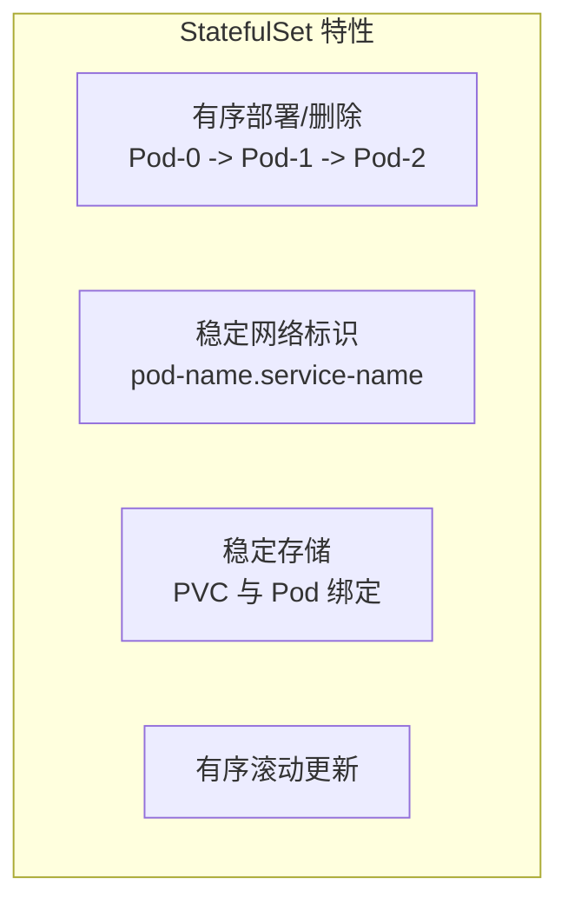
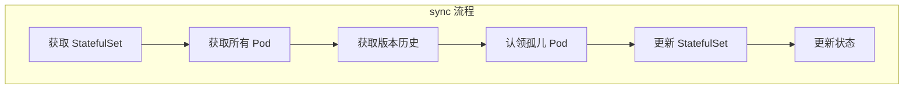
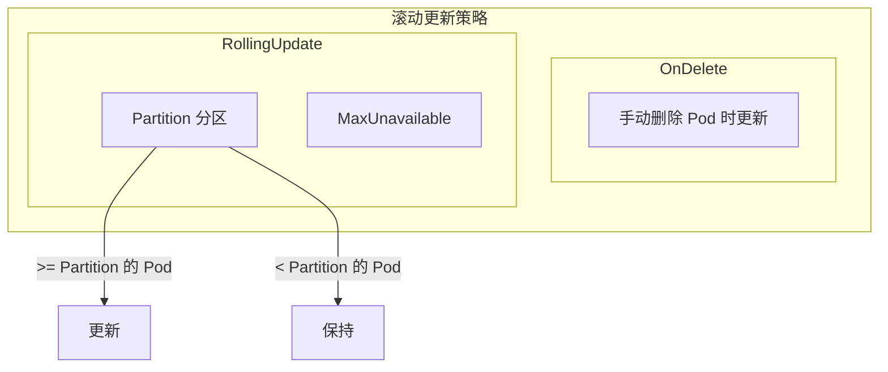

本文详细介绍 StatefulSet 控制器的实现原理，包括有序部署、稳定网络标识、持久存储和滚动更新。

## 1. StatefulSet 概述

### 1.1 核心特性

StatefulSet 为有状态应用提供以下保证：



| 特性 | 说明 |
|-----|------|
| 稳定的 Pod 名称 | `{statefulset-name}-{ordinal}` |
| 稳定的网络标识 | `{pod-name}.{service-name}` |
| 稳定的持久存储 | PVC 与 Pod 绑定，不随 Pod 删除 |
| 有序操作 | 按序号顺序创建、删除、更新 |

### 1.2 StatefulSet Spec

```go
// StatefulSet Spec 定义
// staging/src/k8s.io/api/apps/v1/types.go

type StatefulSetSpec struct {
    // 副本数
    Replicas *int32

    // 标签选择器
    Selector *metav1.LabelSelector

    // Pod 模板
    Template v1.PodTemplateSpec

    // PVC 模板
    VolumeClaimTemplates []v1.PersistentVolumeClaim

    // 关联的 Headless Service
    ServiceName string

    // Pod 管理策略
    PodManagementPolicy PodManagementPolicyType

    // 更新策略
    UpdateStrategy StatefulSetUpdateStrategy

    // 最小就绪时间
    MinReadySeconds int32

    // 历史版本保留数
    RevisionHistoryLimit *int32

    // PVC 保留策略
    PersistentVolumeClaimRetentionPolicy *StatefulSetPersistentVolumeClaimRetentionPolicy

    // 有序部署序号
    Ordinals *StatefulSetOrdinals
}

// Pod 管理策略
type PodManagementPolicyType string

const (
    // 顺序创建删除
    OrderedReadyPodManagement PodManagementPolicyType = "OrderedReady"
    // 并行操作
    ParallelPodManagement PodManagementPolicyType = "Parallel"
)

// 更新策略
type StatefulSetUpdateStrategy struct {
    Type          StatefulSetUpdateStrategyType
    RollingUpdate *RollingUpdateStatefulSetStrategy
}

type RollingUpdateStatefulSetStrategy struct {
    // 分区：只更新序号 >= Partition 的 Pod
    Partition *int32
    // 最大不可用数
    MaxUnavailable *intstr.IntOrString
}
```

## 2. 控制器结构

### 2.1 StatefulSetController

```go
// StatefulSetController 结构
// pkg/controller/statefulset/stateful_set.go

type StatefulSetController struct {
    // 客户端
    kubeClient clientset.Interface

    // Pod 控制
    control StatefulPodControlInterface

    // PVC 控制
    pvcControl StatefulPodControlInterface

    // Informers
    setLister       appslisters.StatefulSetLister
    setListerSynced cache.InformerSynced
    podLister       corelisters.PodLister
    podListerSynced cache.InformerSynced
    pvcLister       corelisters.PersistentVolumeClaimLister
    pvcListerSynced cache.InformerSynced
    revLister       appslisters.ControllerRevisionLister
    revListerSynced cache.InformerSynced

    // 工作队列
    queue workqueue.RateLimitingInterface
}
```

### 2.2 StatefulPodControl

```go
// StatefulPodControlInterface 有状态 Pod 控制接口
// pkg/controller/statefulset/stateful_pod_control.go

type StatefulPodControlInterface interface {
    // 创建 Pod
    CreateStatefulPod(ctx context.Context, set *apps.StatefulSet, pod *v1.Pod) error

    // 更新 Pod
    UpdateStatefulPod(ctx context.Context, set *apps.StatefulSet, pod *v1.Pod) error

    // 删除 Pod
    DeleteStatefulPod(ctx context.Context, set *apps.StatefulSet, pod *v1.Pod) error
}

// 实现
type realStatefulPodControl struct {
    client   clientset.Interface
    recorder record.EventRecorder
}

func (spc *realStatefulPodControl) CreateStatefulPod(ctx context.Context, set *apps.StatefulSet, pod *v1.Pod) error {
    // 创建 PVC
    if err := spc.createPersistentVolumeClaims(set, pod); err != nil {
        return err
    }

    // 创建 Pod
    _, err := spc.client.CoreV1().Pods(set.Namespace).Create(ctx, pod, metav1.CreateOptions{})
    return err
}
```

## 3. 同步流程

### 3.1 sync 主流程



```go
// sync 同步 StatefulSet
// pkg/controller/statefulset/stateful_set.go

func (ssc *StatefulSetController) sync(ctx context.Context, key string) error {
    namespace, name, err := cache.SplitMetaNamespaceKey(key)
    if err != nil {
        return err
    }

    // 1. 获取 StatefulSet
    set, err := ssc.setLister.StatefulSets(namespace).Get(name)
    if errors.IsNotFound(err) {
        return nil
    }
    if err != nil {
        return err
    }

    // 2. 获取选择器
    selector, err := metav1.LabelSelectorAsSelector(set.Spec.Selector)
    if err != nil {
        return err
    }

    // 3. 获取版本历史
    revisions, err := ssc.ListRevisions(set)
    if err != nil {
        return err
    }
    history.SortControllerRevisions(revisions)

    // 4. 获取当前和更新版本
    currentRevision, updateRevision, collisionCount, err := ssc.getStatefulSetRevisions(set, revisions)
    if err != nil {
        return err
    }

    // 5. 获取 Pod
    pods, err := ssc.getPodsForStatefulSet(ctx, set, selector)
    if err != nil {
        return err
    }

    // 6. 执行更新
    status, err := ssc.updateStatefulSet(ctx, set, currentRevision, updateRevision, collisionCount, pods)
    if err != nil {
        return err
    }

    // 7. 更新状态
    err = ssc.updateStatefulSetStatus(ctx, set, status)
    if err != nil {
        return err
    }

    // 8. 清理历史版本
    return ssc.truncateHistory(set, pods, revisions, currentRevision, updateRevision)
}
```

### 3.2 updateStatefulSet

```go
// updateStatefulSet 执行 StatefulSet 更新
// pkg/controller/statefulset/stateful_set_control.go

func (ssc *defaultStatefulSetControl) UpdateStatefulSet(ctx context.Context, set *apps.StatefulSet, pods []*v1.Pod) (*apps.StatefulSetStatus, error) {
    // 1. 获取版本
    currentRevision, updateRevision, collisionCount, err := ssc.getStatefulSetRevisions(set, revisions)
    if err != nil {
        return nil, err
    }

    // 2. 初始化状态
    status := apps.StatefulSetStatus{}
    status.ObservedGeneration = set.Generation
    status.CurrentRevision = currentRevision.Name
    status.UpdateRevision = updateRevision.Name
    status.CollisionCount = new(int32)
    *status.CollisionCount = collisionCount

    // 3. 创建 Pod 副本数组
    replicas := make([]*v1.Pod, replicaCount)
    condemned := make([]*v1.Pod, 0, len(pods))

    // 4. 分配 Pod 到副本槽位
    for i := range pods {
        if ord := getOrdinal(pods[i]); 0 <= ord && ord < replicaCount {
            replicas[ord] = pods[i]
        } else if ord >= replicaCount {
            condemned = append(condemned, pods[i])
        }
    }

    // 5. 处理每个副本
    for i := range replicas {
        if replicas[i] == nil {
            // 创建新 Pod
            replicas[i] = newVersionedStatefulSetPod(currentSet, updateSet, currentRevision.Name, updateRevision.Name, i)
        }

        // 更新 Pod
        if err := ssc.updateStatefulPod(ctx, set, replicas[i], ...); err != nil {
            return &status, err
        }
    }

    // 6. 删除多余的 Pod
    for i := range condemned {
        if err := ssc.control.DeleteStatefulPod(ctx, set, condemned[i]); err != nil {
            return &status, err
        }
    }

    // 7. 执行滚动更新
    return ssc.updateStatefulSetAfterDeletePod(ctx, set, &status, ...)
}
```

## 4. 有序操作

### 4.1 有序创建

```go
// 有序创建 Pod
// pkg/controller/statefulset/stateful_set_control.go

func (ssc *defaultStatefulSetControl) processReplica(ctx context.Context, set *apps.StatefulSet, replicas []*v1.Pod, i int) (bool, error) {
    // OrderedReady 策略：等待前一个 Pod 就绪
    if set.Spec.PodManagementPolicy == apps.OrderedReadyPodManagement {
        // 检查前一个 Pod 是否就绪
        if i > 0 && !isRunningAndReady(replicas[i-1]) {
            // 前一个未就绪，跳过
            return true, nil
        }
    }

    // 创建或更新 Pod
    if replicas[i] == nil {
        // 创建新 Pod
        pod := newVersionedStatefulSetPod(...)
        if err := ssc.control.CreateStatefulPod(ctx, set, pod); err != nil {
            return true, err
        }
        return true, nil
    }

    return false, nil
}
```

### 4.2 有序删除

```go
// 有序删除 Pod
// pkg/controller/statefulset/stateful_set_control.go

func (ssc *defaultStatefulSetControl) processCondemned(ctx context.Context, set *apps.StatefulSet, condemned []*v1.Pod) error {
    // 从后往前删除
    for target := len(condemned) - 1; target >= 0; target-- {
        pod := condemned[target]

        // OrderedReady 策略：确保后面的 Pod 已终止
        if set.Spec.PodManagementPolicy == apps.OrderedReadyPodManagement {
            for i := len(condemned) - 1; i > target; i-- {
                if !isTerminating(condemned[i]) {
                    // 后面的 Pod 还在运行，等待
                    return nil
                }
            }
        }

        // 删除 Pod
        if err := ssc.control.DeleteStatefulPod(ctx, set, pod); err != nil {
            return err
        }

        if set.Spec.PodManagementPolicy == apps.OrderedReadyPodManagement {
            // OrderedReady：一次只删除一个
            return nil
        }
    }

    return nil
}
```

### 4.3 Pod 命名规则

```go
// Pod 名称生成
// pkg/controller/statefulset/stateful_set_utils.go

func getPodName(set *apps.StatefulSet, ordinal int) string {
    return fmt.Sprintf("%s-%d", set.Name, ordinal)
}

// 获取序号
func getOrdinal(pod *v1.Pod) int {
    _, ordinal := getParentNameAndOrdinal(pod)
    return ordinal
}

func getParentNameAndOrdinal(pod *v1.Pod) (string, int) {
    parent := ""
    ordinal := -1

    // 从名称解析: {parent}-{ordinal}
    subMatches := statefulPodRegex.FindStringSubmatch(pod.Name)
    if len(subMatches) < 3 {
        return parent, ordinal
    }

    parent = subMatches[1]
    if i, err := strconv.ParseInt(subMatches[2], 10, 32); err == nil {
        ordinal = int(i)
    }

    return parent, ordinal
}
```

## 5. 稳定存储

### 5.1 PVC 创建

```go
// 创建 PVC
// pkg/controller/statefulset/stateful_pod_control.go

func (spc *realStatefulPodControl) createPersistentVolumeClaims(set *apps.StatefulSet, pod *v1.Pod) error {
    for _, claim := range getPersistentVolumeClaims(set, pod) {
        // 检查 PVC 是否存在
        pvc, err := spc.pvcLister.PersistentVolumeClaims(claim.Namespace).Get(claim.Name)
        switch {
        case apierrors.IsNotFound(err):
            // 创建 PVC
            _, err := spc.client.CoreV1().PersistentVolumeClaims(claim.Namespace).Create(context.TODO(), &claim, metav1.CreateOptions{})
            if err != nil {
                return err
            }

        case err != nil:
            return err

        default:
            // PVC 已存在，检查所有权
            if pvc.DeletionTimestamp != nil {
                return fmt.Errorf("pvc %s is being deleted", pvc.Name)
            }
        }
    }

    return nil
}

// 获取 PVC 列表
func getPersistentVolumeClaims(set *apps.StatefulSet, pod *v1.Pod) []v1.PersistentVolumeClaim {
    ordinal := getOrdinal(pod)
    templates := set.Spec.VolumeClaimTemplates
    claims := make([]v1.PersistentVolumeClaim, 0, len(templates))

    for i := range templates {
        claim := templates[i].DeepCopy()
        // PVC 名称: {template-name}-{statefulset-name}-{ordinal}
        claim.Name = getPersistentVolumeClaimName(set, claim, ordinal)
        claim.Namespace = set.Namespace

        // 设置 OwnerReference
        claim.OwnerReferences = append(claim.OwnerReferences, *metav1.NewControllerRef(set, controllerKind))

        claims = append(claims, *claim)
    }

    return claims
}

// PVC 名称格式
func getPersistentVolumeClaimName(set *apps.StatefulSet, claim *v1.PersistentVolumeClaim, ordinal int) string {
    return fmt.Sprintf("%s-%s-%d", claim.Name, set.Name, ordinal)
}
```

### 5.2 PVC 保留策略

```go
// PVC 保留策略
// staging/src/k8s.io/api/apps/v1/types.go

type StatefulSetPersistentVolumeClaimRetentionPolicy struct {
    // 缩容时的策略
    WhenScaled PersistentVolumeClaimRetentionPolicyType
    // 删除 StatefulSet 时的策略
    WhenDeleted PersistentVolumeClaimRetentionPolicyType
}

type PersistentVolumeClaimRetentionPolicyType string

const (
    // 保留 PVC
    RetainPersistentVolumeClaimRetentionPolicyType PersistentVolumeClaimRetentionPolicyType = "Retain"
    // 删除 PVC
    DeletePersistentVolumeClaimRetentionPolicyType PersistentVolumeClaimRetentionPolicyType = "Delete"
)
```

## 6. 滚动更新

### 6.1 更新策略



### 6.2 RollingUpdate 实现

```go
// 滚动更新
// pkg/controller/statefulset/stateful_set_control.go

func (ssc *defaultStatefulSetControl) updateStatefulSetAfterDeletePod(ctx context.Context, set *apps.StatefulSet, status *apps.StatefulSetStatus, currentRevision, updateRevision *apps.ControllerRevision, replicas []*v1.Pod) (*apps.StatefulSetStatus, error) {
    // 只处理 RollingUpdate 策略
    if set.Spec.UpdateStrategy.Type != apps.RollingUpdateStatefulSetStrategyType {
        return status, nil
    }

    // 获取分区
    partition := int(*set.Spec.UpdateStrategy.RollingUpdate.Partition)

    // 从后往前更新
    for target := len(replicas) - 1; target >= partition; target-- {
        pod := replicas[target]

        // 检查是否需要更新
        if getPodRevision(pod) != updateRevision.Name {
            // 需要更新

            // 检查是否可以继续更新 (MaxUnavailable)
            if !isHealthy(pod) {
                // 当前 Pod 不健康，等待
                return status, nil
            }

            // 删除 Pod (会用新版本重建)
            if err := ssc.control.DeleteStatefulPod(ctx, set, pod); err != nil {
                return status, err
            }

            // 一次只更新一个
            return status, nil
        }
    }

    return status, nil
}
```

### 6.3 Partition 机制

```go
// Partition 用于金丝雀发布
// 示例: partition=2, replicas=5
// Pod-0, Pod-1: 保持当前版本
// Pod-2, Pod-3, Pod-4: 更新到新版本

func shouldUpdatePod(set *apps.StatefulSet, pod *v1.Pod, currentRevision, updateRevision *apps.ControllerRevision) bool {
    ordinal := getOrdinal(pod)
    partition := 0

    if set.Spec.UpdateStrategy.RollingUpdate != nil && set.Spec.UpdateStrategy.RollingUpdate.Partition != nil {
        partition = int(*set.Spec.UpdateStrategy.RollingUpdate.Partition)
    }

    // 序号 >= partition 才更新
    if ordinal >= partition {
        return getPodRevision(pod) != updateRevision.Name
    }

    return false
}
```

## 7. 版本管理

### 7.1 ControllerRevision

```go
// ControllerRevision 存储版本历史
// staging/src/k8s.io/api/apps/v1/types.go

type ControllerRevision struct {
    metav1.TypeMeta
    metav1.ObjectMeta

    // 版本数据
    Data runtime.RawExtension

    // 版本号
    Revision int64
}

// 创建版本
func (ssc *defaultStatefulSetControl) newRevision(set *apps.StatefulSet, revision int64, collisionCount *int32) (*apps.ControllerRevision, error) {
    patch, err := getPatch(set)
    if err != nil {
        return nil, err
    }

    cr := &apps.ControllerRevision{
        ObjectMeta: metav1.ObjectMeta{
            Name:      controllerRevisionName(set.Name, hashRevision(patch)),
            Namespace: set.Namespace,
            OwnerReferences: []metav1.OwnerReference{
                *metav1.NewControllerRef(set, controllerKind),
            },
            Labels: set.Spec.Selector.MatchLabels,
        },
        Data:     runtime.RawExtension{Raw: patch},
        Revision: revision,
    }

    return cr, nil
}
```

### 7.2 版本清理

```go
// truncateHistory 清理历史版本
// pkg/controller/statefulset/stateful_set.go

func (ssc *StatefulSetController) truncateHistory(set *apps.StatefulSet, pods []*v1.Pod, revisions []*apps.ControllerRevision, current, update *apps.ControllerRevision) error {
    // 保留数
    historyLimit := int(*set.Spec.RevisionHistoryLimit)

    // 正在使用的版本
    liveRevisions := map[string]bool{
        current.Name: true,
        update.Name:  true,
    }
    for _, pod := range pods {
        liveRevisions[getPodRevision(pod)] = true
    }

    // 找出可删除的版本
    toDelete := make([]*apps.ControllerRevision, 0)
    for _, rev := range revisions {
        if !liveRevisions[rev.Name] {
            toDelete = append(toDelete, rev)
        }
    }

    // 删除超出限制的版本
    if len(toDelete) > historyLimit {
        sort.Sort(historiesByRevision(toDelete))
        for i := 0; i < len(toDelete)-historyLimit; i++ {
            if err := ssc.client.AppsV1().ControllerRevisions(set.Namespace).Delete(context.TODO(), toDelete[i].Name, metav1.DeleteOptions{}); err != nil {
                return err
            }
        }
    }

    return nil
}
```

## 8. 网络标识

### 8.1 Headless Service

```yaml
# Headless Service 配置
apiVersion: v1
kind: Service
metadata:
  name: nginx
spec:
  clusterIP: None  # Headless
  selector:
    app: nginx
  ports:
  - port: 80
    name: web
```

### 8.2 DNS 记录

```
DNS 记录格式:
├── Service
│   └── nginx.default.svc.cluster.local
├── Pod
│   ├── nginx-0.nginx.default.svc.cluster.local
│   ├── nginx-1.nginx.default.svc.cluster.local
│   └── nginx-2.nginx.default.svc.cluster.local
```

### 8.3 Pod DNS 配置

```go
// 设置 Pod 的 subdomain
// pkg/controller/statefulset/stateful_set_utils.go

func newStatefulSetPod(set *apps.StatefulSet, ordinal int) *v1.Pod {
    pod := &v1.Pod{
        ObjectMeta: metav1.ObjectMeta{
            Name:      getPodName(set, ordinal),
            Namespace: set.Namespace,
        },
        Spec: *set.Spec.Template.Spec.DeepCopy(),
    }

    // 设置 hostname 和 subdomain
    pod.Spec.Hostname = pod.Name
    pod.Spec.Subdomain = set.Spec.ServiceName

    return pod
}
```

## 9. 状态计算

### 9.1 StatefulSet Status

```go
// 计算状态
// pkg/controller/statefulset/stateful_set_control.go

func (ssc *defaultStatefulSetControl) calculateStatus(set *apps.StatefulSet, replicas []*v1.Pod, currentRevision, updateRevision *apps.ControllerRevision) *apps.StatefulSetStatus {
    status := apps.StatefulSetStatus{}
    status.ObservedGeneration = set.Generation
    status.CurrentRevision = currentRevision.Name
    status.UpdateRevision = updateRevision.Name
    status.CollisionCount = new(int32)

    for _, pod := range replicas {
        if isHealthy(pod) {
            status.Replicas++
        }

        if isRunningAndReady(pod) {
            status.ReadyReplicas++
        }

        if isRunningAndAvailable(pod, set.Spec.MinReadySeconds) {
            status.AvailableReplicas++
        }

        if getPodRevision(pod) == currentRevision.Name {
            status.CurrentReplicas++
        }

        if getPodRevision(pod) == updateRevision.Name {
            status.UpdatedReplicas++
        }
    }

    return &status
}
```

## 小结

本文介绍了 StatefulSet 控制器的实现：

1. **核心特性**：有序操作、稳定标识、持久存储
2. **控制器结构**：StatefulPodControl、版本管理
3. **有序操作**：OrderedReady、Parallel 策略
4. **稳定存储**：PVC 创建、保留策略
5. **滚动更新**：Partition、MaxUnavailable
6. **版本管理**：ControllerRevision、历史清理
7. **网络标识**：Headless Service、DNS 记录

下一篇将详细介绍 DaemonSet 控制器。
