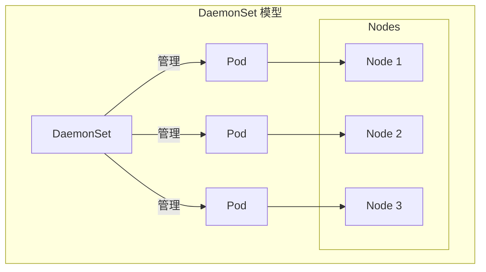
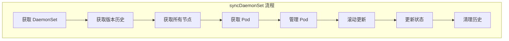

本文详细介绍 DaemonSet 控制器的实现原理，包括节点选择、Pod 调度、更新策略和节点变更处理。

## 1. DaemonSet 概述

### 1.1 核心职责

DaemonSet 确保每个匹配的节点上运行一个 Pod 副本：



### 1.2 使用场景

| 场景 | 示例 |
|-----|------|
| 日志收集 | Fluentd, Filebeat |
| 监控代理 | Prometheus Node Exporter |
| 网络插件 | Calico, Cilium |
| 存储守护 | Ceph, GlusterFS |

### 1.3 DaemonSet Spec

```go
// DaemonSet Spec 定义
// staging/src/k8s.io/api/apps/v1/types.go

type DaemonSetSpec struct {
    // 标签选择器
    Selector *metav1.LabelSelector

    // Pod 模板
    Template v1.PodTemplateSpec

    // 更新策略
    UpdateStrategy DaemonSetUpdateStrategy

    // 最小就绪时间
    MinReadySeconds int32

    // 历史版本保留数
    RevisionHistoryLimit *int32
}

type DaemonSetUpdateStrategy struct {
    // 策略类型
    Type DaemonSetUpdateStrategyType

    // 滚动更新配置
    RollingUpdate *RollingUpdateDaemonSet
}

type DaemonSetUpdateStrategyType string

const (
    RollingUpdateDaemonSetStrategyType DaemonSetUpdateStrategyType = "RollingUpdate"
    OnDeleteDaemonSetStrategyType      DaemonSetUpdateStrategyType = "OnDelete"
)

type RollingUpdateDaemonSet struct {
    // 最大不可用数
    MaxUnavailable *intstr.IntOrString
    // 最大超出数
    MaxSurge *intstr.IntOrString
}
```

## 2. 控制器结构

### 2.1 DaemonSetsController

```go
// DaemonSetsController 结构
// pkg/controller/daemon/daemon_controller.go

type DaemonSetsController struct {
    // 客户端
    kubeClient clientset.Interface

    // Pod 控制
    podControl controller.PodControlInterface

    // 突发控制
    burstReplicas int

    // 同步处理函数
    syncHandler func(ctx context.Context, dsKey string) error

    // 期望值缓存
    expectations controller.ControllerExpectationsInterface

    // Informers
    dsLister        appslisters.DaemonSetLister
    dsListerSynced  cache.InformerSynced
    historyLister   appslisters.ControllerRevisionLister
    historyListerSynced cache.InformerSynced
    podLister       corelisters.PodLister
    podListerSynced cache.InformerSynced
    nodeLister      corelisters.NodeLister
    nodeListerSynced cache.InformerSynced

    // 工作队列
    queue workqueue.RateLimitingInterface

    // 失败的 Pod 退避
    failedPodsBackoff *flowcontrol.Backoff
}
```

### 2.2 初始化

```go
// NewDaemonSetsController 创建控制器
// pkg/controller/daemon/daemon_controller.go

func NewDaemonSetsController(
    daemonSetInformer appsinformers.DaemonSetInformer,
    historyInformer appsinformers.ControllerRevisionInformer,
    podInformer coreinformers.PodInformer,
    nodeInformer coreinformers.NodeInformer,
    kubeClient clientset.Interface,
    failedPodsBackoff *flowcontrol.Backoff,
) (*DaemonSetsController, error) {

    dsc := &DaemonSetsController{
        kubeClient:        kubeClient,
        expectations:      controller.NewControllerExpectations(),
        queue:            workqueue.NewNamedRateLimitingQueue(workqueue.DefaultControllerRateLimiter(), "daemonset"),
        failedPodsBackoff: failedPodsBackoff,
    }

    // DaemonSet 事件处理
    daemonSetInformer.Informer().AddEventHandler(cache.ResourceEventHandlerFuncs{
        AddFunc:    dsc.addDaemonset,
        UpdateFunc: dsc.updateDaemonset,
        DeleteFunc: dsc.deleteDaemonset,
    })

    // Pod 事件处理
    podInformer.Informer().AddEventHandler(cache.ResourceEventHandlerFuncs{
        AddFunc:    dsc.addPod,
        UpdateFunc: dsc.updatePod,
        DeleteFunc: dsc.deletePod,
    })

    // Node 事件处理
    nodeInformer.Informer().AddEventHandler(cache.ResourceEventHandlerFuncs{
        AddFunc:    dsc.addNode,
        UpdateFunc: dsc.updateNode,
    })

    dsc.syncHandler = dsc.syncDaemonSet

    return dsc, nil
}
```

### 2.3 Node 事件处理

```go
// Node 事件处理
// pkg/controller/daemon/daemon_controller.go

func (dsc *DaemonSetsController) addNode(obj interface{}) {
    node := obj.(*v1.Node)
    // 重新同步所有 DaemonSet
    dsList, err := dsc.dsLister.List(labels.Everything())
    if err != nil {
        klog.V(4).Infof("Error listing daemon sets: %v", err)
        return
    }

    for _, ds := range dsList {
        if nodeShouldRunDaemonPod(node, ds) {
            dsc.enqueueDaemonSet(ds)
        }
    }
}

func (dsc *DaemonSetsController) updateNode(old, cur interface{}) {
    oldNode := old.(*v1.Node)
    curNode := cur.(*v1.Node)

    // 检查调度相关字段是否变化
    if shouldIgnoreNodeUpdate(*oldNode, *curNode) {
        return
    }

    // 重新同步所有 DaemonSet
    dsList, err := dsc.dsLister.List(labels.Everything())
    if err != nil {
        return
    }

    for _, ds := range dsList {
        oldShouldRun := nodeShouldRunDaemonPod(oldNode, ds)
        currentShouldRun := nodeShouldRunDaemonPod(curNode, ds)
        if oldShouldRun != currentShouldRun {
            dsc.enqueueDaemonSet(ds)
        }
    }
}

// 检查是否应该忽略 Node 更新
func shouldIgnoreNodeUpdate(oldNode, curNode v1.Node) bool {
    // 只关注这些字段的变化
    if !reflect.DeepEqual(oldNode.Labels, curNode.Labels) {
        return false
    }
    if !reflect.DeepEqual(oldNode.Spec.Taints, curNode.Spec.Taints) {
        return false
    }
    if !reflect.DeepEqual(oldNode.Spec.Unschedulable, curNode.Spec.Unschedulable) {
        return false
    }
    if !nodeutil.IsNodeReady(&oldNode) != !nodeutil.IsNodeReady(&curNode) {
        return false
    }
    return true
}
```

## 3. 同步流程

### 3.1 syncDaemonSet 主流程



```go
// syncDaemonSet 同步单个 DaemonSet
// pkg/controller/daemon/daemon_controller.go

func (dsc *DaemonSetsController) syncDaemonSet(ctx context.Context, key string) error {
    namespace, name, err := cache.SplitMetaNamespaceKey(key)
    if err != nil {
        return err
    }

    // 1. 获取 DaemonSet
    ds, err := dsc.dsLister.DaemonSets(namespace).Get(name)
    if errors.IsNotFound(err) {
        dsc.expectations.DeleteExpectations(key)
        return nil
    }
    if err != nil {
        return err
    }

    // 2. 获取所有节点
    nodeList, err := dsc.nodeLister.List(labels.Everything())
    if err != nil {
        return fmt.Errorf("couldn't get list of nodes: %v", err)
    }

    // 3. 获取所有 Pod
    everything := metav1.LabelSelector{}
    selector, err := metav1.LabelSelectorAsSelector(ds.Spec.Selector)
    if err != nil {
        return err
    }

    dsKey, err := controller.KeyFunc(ds)
    if err != nil {
        return err
    }

    // 4. 认领 Pod
    daemonPods, err := dsc.getDaemonPods(ctx, ds)
    if err != nil {
        return err
    }

    // 5. 获取版本历史
    cur, old, err := dsc.constructHistory(ctx, ds)
    if err != nil {
        return fmt.Errorf("failed to construct revisions: %v", err)
    }
    hash := cur.Labels[apps.DefaultDaemonSetUniqueLabelKey]

    // 6. 管理 DaemonSet Pod
    err = dsc.manage(ctx, ds, nodeList, hash)
    if err != nil {
        return err
    }

    // 7. 执行滚动更新
    if dsc.expectations.SatisfiedExpectations(dsKey) {
        switch ds.Spec.UpdateStrategy.Type {
        case apps.OnDeleteDaemonSetStrategyType:
            // OnDelete: 不主动更新
        case apps.RollingUpdateDaemonSetStrategyType:
            err = dsc.rollingUpdate(ctx, ds, nodeList, hash)
        }
        if err != nil {
            return err
        }
    }

    // 8. 更新状态
    err = dsc.updateDaemonSetStatus(ctx, ds, nodeList, hash, true)
    if err != nil {
        return err
    }

    // 9. 清理历史版本
    return dsc.cleanupHistory(ctx, ds, old)
}
```

## 4. 节点选择

### 4.1 节点匹配判断

```go
// nodeShouldRunDaemonPod 判断节点是否应该运行 DaemonSet Pod
// pkg/controller/daemon/daemon_controller.go

func nodeShouldRunDaemonPod(node *v1.Node, ds *apps.DaemonSet) bool {
    // 使用调度器模拟
    taints := node.Spec.Taints
    fitsNodeName, fitsNodeAffinity, fitsTaints := predicates(ds, node, taints)

    if !fitsNodeName || !fitsNodeAffinity {
        return false
    }

    if !fitsTaints {
        // 检查是否有对应的 Toleration
        return false
    }

    return true
}

// 预选检查
func predicates(ds *apps.DaemonSet, node *v1.Node, taints []v1.Taint) (fitsNodeName, fitsNodeAffinity, fitsTaints bool) {
    pod := NewPod(ds, node.Name)

    // NodeName 检查
    fitsNodeName = len(pod.Spec.NodeName) == 0 || pod.Spec.NodeName == node.Name

    // NodeAffinity 检查
    fitsNodeAffinity, _ = nodeaffinity.GetRequiredNodeAffinity(pod).Match(node)

    // Taint/Toleration 检查
    _, untolerated := v1helper.FindMatchingUntoleratedTaint(taints, pod.Spec.Tolerations, func(t *v1.Taint) bool {
        // 只考虑 NoSchedule 和 NoExecute 污点
        return t.Effect == v1.TaintEffectNoSchedule || t.Effect == v1.TaintEffectNoExecute
    })
    fitsTaints = !untolerated

    return fitsNodeName, fitsNodeAffinity, fitsTaints
}
```

### 4.2 节点分类

```go
// getNodesToDaemonPods 将 Pod 按节点分类
// pkg/controller/daemon/daemon_controller.go

func (dsc *DaemonSetsController) getNodesToDaemonPods(ctx context.Context, ds *apps.DaemonSet) (map[string][]*v1.Pod, error) {
    // 获取 DaemonSet 的所有 Pod
    daemonPods, err := dsc.getDaemonPods(ctx, ds)
    if err != nil {
        return nil, err
    }

    // 按节点分类
    nodeToDaemonPods := make(map[string][]*v1.Pod)
    for _, pod := range daemonPods {
        nodeName := pod.Spec.NodeName
        nodeToDaemonPods[nodeName] = append(nodeToDaemonPods[nodeName], pod)
    }

    return nodeToDaemonPods, nil
}
```

## 5. Pod 管理

### 5.1 manage 函数

```go
// manage 管理 DaemonSet 的 Pod
// pkg/controller/daemon/daemon_controller.go

func (dsc *DaemonSetsController) manage(ctx context.Context, ds *apps.DaemonSet, nodeList []*v1.Node, hash string) error {
    // 按节点获取 Pod
    nodeToDaemonPods, err := dsc.getNodesToDaemonPods(ctx, ds)
    if err != nil {
        return fmt.Errorf("couldn't get node to daemon pod mapping: %v", err)
    }

    var nodesNeedingDaemonPods, podsToDelete []string

    for _, node := range nodeList {
        nodesNeedingDaemonPodsOnNode, podsToDeleteOnNode := dsc.podsShouldBeOnNode(node, nodeToDaemonPods, ds, hash)

        nodesNeedingDaemonPods = append(nodesNeedingDaemonPods, nodesNeedingDaemonPodsOnNode...)
        podsToDelete = append(podsToDelete, podsToDeleteOnNode...)
    }

    // 删除多余的 Pod
    podsToDelete = append(podsToDelete, getUnscheduledPodsWithoutNode(nodeList, nodeToDaemonPods)...)

    // 执行创建和删除
    if err = dsc.syncNodes(ctx, ds, podsToDelete, nodesNeedingDaemonPods, hash); err != nil {
        return err
    }

    return nil
}
```

### 5.2 podsShouldBeOnNode

```go
// podsShouldBeOnNode 判断节点上应该有哪些 Pod
// pkg/controller/daemon/daemon_controller.go

func (dsc *DaemonSetsController) podsShouldBeOnNode(node *v1.Node, nodeToDaemonPods map[string][]*v1.Pod, ds *apps.DaemonSet, hash string) (nodesNeedingDaemonPods, podsToDelete []string) {
    shouldRun := nodeShouldRunDaemonPod(node, ds)
    daemonPods, exists := nodeToDaemonPods[node.Name]

    switch {
    case shouldRun && !exists:
        // 应该运行但没有 Pod -> 需要创建
        nodesNeedingDaemonPods = append(nodesNeedingDaemonPods, node.Name)

    case !shouldRun && exists:
        // 不应该运行但有 Pod -> 需要删除
        for _, pod := range daemonPods {
            if pod.DeletionTimestamp != nil {
                continue
            }
            podsToDelete = append(podsToDelete, pod.Name)
        }

    case shouldRun && exists:
        // 应该运行且有 Pod
        if len(daemonPods) > 1 {
            // 多余的 Pod 需要删除
            for i := 1; i < len(daemonPods); i++ {
                podsToDelete = append(podsToDelete, daemonPods[i].Name)
            }
        }
    }

    return nodesNeedingDaemonPods, podsToDelete
}
```

### 5.3 syncNodes

```go
// syncNodes 同步节点上的 Pod
// pkg/controller/daemon/daemon_controller.go

func (dsc *DaemonSetsController) syncNodes(ctx context.Context, ds *apps.DaemonSet, podsToDelete, nodesNeedingDaemonPods []string, hash string) error {
    dsKey, err := controller.KeyFunc(ds)
    if err != nil {
        return fmt.Errorf("couldn't get key for object %#v: %v", ds, err)
    }

    // 限制并发
    createDiff := len(nodesNeedingDaemonPods)
    deleteDiff := len(podsToDelete)

    if createDiff > dsc.burstReplicas {
        createDiff = dsc.burstReplicas
    }
    if deleteDiff > dsc.burstReplicas {
        deleteDiff = dsc.burstReplicas
    }

    // 设置期望值
    dsc.expectations.SetExpectations(dsKey, createDiff, deleteDiff)

    // 并行创建 Pod
    errCh := make(chan error, createDiff+deleteDiff)
    createWait := sync.WaitGroup{}
    createWait.Add(createDiff)

    for i := 0; i < createDiff; i++ {
        go func(nodeName string) {
            defer createWait.Done()
            err := dsc.podControl.CreatePodsWithGenerateName(ctx, ds.Namespace, &ds.Spec.Template, ds, metav1.NewControllerRef(ds, controllerKind), nodeName)
            if err != nil {
                dsc.expectations.CreationObserved(dsKey)
                errCh <- err
            }
        }(nodesNeedingDaemonPods[i])
    }

    // 并行删除 Pod
    deleteWait := sync.WaitGroup{}
    deleteWait.Add(deleteDiff)

    for i := 0; i < deleteDiff; i++ {
        go func(podName string) {
            defer deleteWait.Done()
            if err := dsc.podControl.DeletePod(ctx, ds.Namespace, podName, ds); err != nil {
                dsc.expectations.DeletionObserved(dsKey)
                errCh <- err
            }
        }(podsToDelete[i])
    }

    createWait.Wait()
    deleteWait.Wait()

    // 收集错误
    errors := []error{}
    close(errCh)
    for err := range errCh {
        errors = append(errors, err)
    }

    return utilerrors.NewAggregate(errors)
}
```

## 6. 滚动更新

### 6.1 RollingUpdate 实现

```go
// rollingUpdate 执行滚动更新
// pkg/controller/daemon/daemon_controller.go

func (dsc *DaemonSetsController) rollingUpdate(ctx context.Context, ds *apps.DaemonSet, nodeList []*v1.Node, hash string) error {
    nodeToDaemonPods, err := dsc.getNodesToDaemonPods(ctx, ds)
    if err != nil {
        return fmt.Errorf("couldn't get node to daemon pod mapping: %v", err)
    }

    _, oldPods := dsc.getAllDaemonSetPods(ds, nodeToDaemonPods, hash)
    maxUnavailable, numUnavailable, err := dsc.getUnavailableNumbers(ds, nodeList, nodeToDaemonPods)
    if err != nil {
        return fmt.Errorf("couldn't get unavailable numbers: %v", err)
    }

    // 按优先级排序旧 Pod
    oldAvailablePods, oldUnavailablePods := splitByAvailablePods(ds.Spec.MinReadySeconds, oldPods)

    // 先处理不可用的旧 Pod
    var oldPodsToDelete []string
    for _, pod := range oldUnavailablePods {
        if numUnavailable >= maxUnavailable {
            break
        }
        oldPodsToDelete = append(oldPodsToDelete, pod.Name)
        numUnavailable++
    }

    // 再处理可用的旧 Pod
    for _, pod := range oldAvailablePods {
        if numUnavailable >= maxUnavailable {
            break
        }
        oldPodsToDelete = append(oldPodsToDelete, pod.Name)
        numUnavailable++
    }

    return dsc.syncNodes(ctx, ds, oldPodsToDelete, []string{}, hash)
}
```

### 6.2 MaxUnavailable 计算

```go
// getUnavailableNumbers 获取不可用数量
// pkg/controller/daemon/daemon_controller.go

func (dsc *DaemonSetsController) getUnavailableNumbers(ds *apps.DaemonSet, nodeList []*v1.Node, nodeToDaemonPods map[string][]*v1.Pod) (maxUnavailable, numUnavailable int, err error) {
    // 计算期望运行的节点数
    var desiredNumberScheduled int
    for _, node := range nodeList {
        if nodeShouldRunDaemonPod(node, ds) {
            desiredNumberScheduled++
        }
    }

    // 计算 MaxUnavailable
    maxUnavailable, err = intstrutil.GetScaledValueFromIntOrPercent(
        intstrutil.ValueOrDefault(ds.Spec.UpdateStrategy.RollingUpdate.MaxUnavailable, intstrutil.FromInt(1)),
        desiredNumberScheduled,
        true,
    )
    if err != nil {
        return 0, 0, err
    }

    // 保证至少有一个可以不可用
    if maxUnavailable == 0 {
        maxUnavailable = 1
    }

    // 计算当前不可用数
    for _, node := range nodeList {
        if !nodeShouldRunDaemonPod(node, ds) {
            continue
        }

        pods := nodeToDaemonPods[node.Name]
        if len(pods) == 0 {
            numUnavailable++
            continue
        }

        available := false
        for _, pod := range pods {
            if podutil.IsPodAvailable(pod, ds.Spec.MinReadySeconds, metav1.Now()) {
                available = true
                break
            }
        }
        if !available {
            numUnavailable++
        }
    }

    return maxUnavailable, numUnavailable, nil
}
```

## 7. 状态更新

### 7.1 DaemonSet Status

```go
// DaemonSetStatus 定义
// staging/src/k8s.io/api/apps/v1/types.go

type DaemonSetStatus struct {
    // 当前调度的节点数
    CurrentNumberScheduled int32
    // 应该调度的节点数
    DesiredNumberScheduled int32
    // Ready 的数量
    NumberReady int32
    // 可用的数量
    NumberAvailable int32
    // 不可用的数量
    NumberUnavailable int32
    // 运行错误模板的数量
    NumberMisscheduled int32
    // 已更新的数量
    UpdatedNumberScheduled int32
    // 观察到的版本
    ObservedGeneration int64
    // 条件
    Conditions []DaemonSetCondition
    // 碰撞计数
    CollisionCount *int32
}
```

### 7.2 状态计算

```go
// updateDaemonSetStatus 更新状态
// pkg/controller/daemon/daemon_controller.go

func (dsc *DaemonSetsController) updateDaemonSetStatus(ctx context.Context, ds *apps.DaemonSet, nodeList []*v1.Node, hash string, updateObservedGen bool) error {
    nodeToDaemonPods, err := dsc.getNodesToDaemonPods(ctx, ds)
    if err != nil {
        return fmt.Errorf("couldn't get node to daemon pod mapping: %v", err)
    }

    var desiredNumberScheduled, currentNumberScheduled, numberMisscheduled, numberReady, numberAvailable, updatedNumberScheduled int

    for _, node := range nodeList {
        shouldRun := nodeShouldRunDaemonPod(node, ds)
        pods := nodeToDaemonPods[node.Name]

        if shouldRun {
            desiredNumberScheduled++

            if len(pods) > 0 {
                currentNumberScheduled++

                pod := pods[0]
                if podutil.IsPodReady(pod) {
                    numberReady++
                }
                if podutil.IsPodAvailable(pod, ds.Spec.MinReadySeconds, metav1.Now()) {
                    numberAvailable++
                }
                if getPodRevision(pod) == hash {
                    updatedNumberScheduled++
                }
            }
        } else if len(pods) > 0 {
            numberMisscheduled++
        }
    }

    numberUnavailable := desiredNumberScheduled - numberAvailable

    // 构建状态
    status := ds.Status.DeepCopy()
    status.CurrentNumberScheduled = int32(currentNumberScheduled)
    status.DesiredNumberScheduled = int32(desiredNumberScheduled)
    status.NumberMisscheduled = int32(numberMisscheduled)
    status.NumberReady = int32(numberReady)
    status.NumberAvailable = int32(numberAvailable)
    status.NumberUnavailable = int32(numberUnavailable)
    status.UpdatedNumberScheduled = int32(updatedNumberScheduled)

    if updateObservedGen {
        status.ObservedGeneration = ds.Generation
    }

    // 更新
    _, err = dsc.kubeClient.AppsV1().DaemonSets(ds.Namespace).UpdateStatus(ctx, ds, metav1.UpdateOptions{})
    return err
}
```

## 8. Toleration 处理

### 8.1 默认 Toleration

```go
// 控制器自动添加的 Toleration
// pkg/controller/daemon/daemon_controller.go

var defaultDaemonSetPodTolerationsFromNodeSelector = []v1.Toleration{
    {
        Key:      v1.TaintNodeNotReady,
        Operator: v1.TolerationOpExists,
        Effect:   v1.TaintEffectNoExecute,
    },
    {
        Key:      v1.TaintNodeUnreachable,
        Operator: v1.TolerationOpExists,
        Effect:   v1.TaintEffectNoExecute,
    },
    {
        Key:      v1.TaintNodeDiskPressure,
        Operator: v1.TolerationOpExists,
        Effect:   v1.TaintEffectNoSchedule,
    },
    {
        Key:      v1.TaintNodeMemoryPressure,
        Operator: v1.TolerationOpExists,
        Effect:   v1.TaintEffectNoSchedule,
    },
    {
        Key:      v1.TaintNodeUnschedulable,
        Operator: v1.TolerationOpExists,
        Effect:   v1.TaintEffectNoSchedule,
    },
}
```

### 8.2 Toleration 合并

```go
// 创建 Pod 时合并 Toleration
// pkg/controller/daemon/util/daemonset_util.go

func AddOrUpdateDaemonPodTolerations(spec *v1.PodSpec) {
    // 添加默认 Toleration
    for _, toleration := range defaultDaemonSetPodTolerationsFromNodeSelector {
        if !TolerationExists(spec.Tolerations, toleration) {
            spec.Tolerations = append(spec.Tolerations, toleration)
        }
    }
}
```

## 小结

本文介绍了 DaemonSet 控制器的实现：

1. **核心职责**：确保每个匹配节点运行一个 Pod
2. **节点选择**：NodeSelector、NodeAffinity、Taint/Toleration
3. **Pod 管理**：创建、删除、同步
4. **滚动更新**：MaxUnavailable、MaxSurge
5. **Node 事件处理**：节点变更时重新同步
6. **状态计算**：Scheduled、Ready、Available

下一篇将详细介绍 Job 和 CronJob 控制器。
