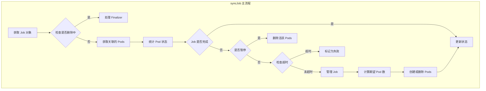
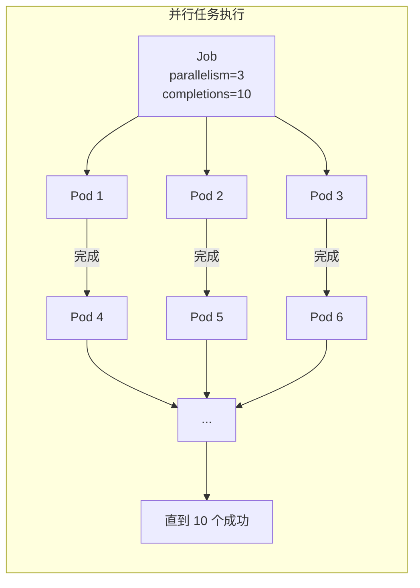
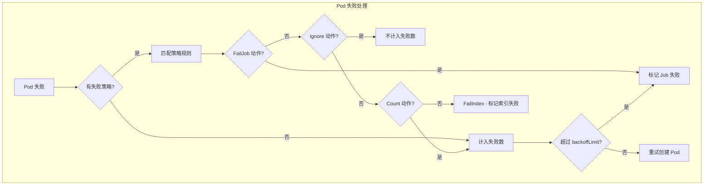
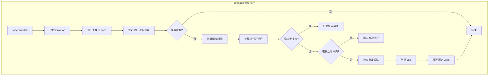
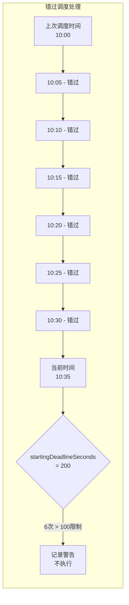

## 概述

Job 和 CronJob 控制器负责管理 Kubernetes 中的批处理任务。Job 控制器管理一次性任务的执行，确保指定数量的 Pod 成功完成；CronJob 控制器则按照 Cron 表达式定期创建 Job，实现定时任务调度。

## Job 控制器

### 控制器结构

Job 控制器的核心结构定义在 `pkg/controller/job/job_controller.go`：

```go
// Controller 是 Job 控制器的主结构
type Controller struct {
    kubeClient clientset.Interface
    podControl controller.PodControlInterface

    // Job 的 Lister 和 Informer
    jobLister batchv1listers.JobLister
    jobStoreSynced cache.InformerSynced

    // Pod 的 Lister 和 Informer
    podLister corelisters.PodLister
    podStoreSynced cache.InformerSynced

    // 工作队列
    queue workqueue.RateLimitingInterface

    // Orphan Pod 清理队列
    orphanQueue workqueue.RateLimitingInterface

    // expectations 追踪 Pod 创建和删除
    expectations controller.ControllerExpectationsInterface

    // 并发控制
    finalizerExpectations *uidTrackingExpectations

    // 记录器
    recorder record.EventRecorder
}
```

### Job 资源模型

Job 的核心字段定义：

```go
// JobSpec 定义 Job 的期望状态
type JobSpec struct {
    // 并行度 - 同时运行的 Pod 数量
    Parallelism *int32

    // 完成数 - 需要成功完成的 Pod 数量
    Completions *int32

    // 完成模式
    CompletionMode *CompletionMode

    // 活跃期限（秒）
    ActiveDeadlineSeconds *int64

    // Pod 失败策略
    PodFailurePolicy *PodFailurePolicy

    // 最大重试次数
    BackoffLimit *int32

    // TTL 自动清理
    TTLSecondsAfterFinished *int32

    // Pod 选择器
    Selector *metav1.LabelSelector

    // 是否手动选择器
    ManualSelector *bool

    // Pod 模板
    Template corev1.PodTemplateSpec

    // 暂停
    Suspend *bool

    // 退避限制策略
    BackoffLimitPerIndex *int32

    // 最大失败索引数
    MaxFailedIndexes *int32

    // Pod 替换策略
    PodReplacementPolicy *PodReplacementPolicy
}

// JobStatus 表示 Job 的当前状态
type JobStatus struct {
    // 条件列表
    Conditions []JobCondition

    // 开始时间
    StartTime *metav1.Time

    // 完成时间
    CompletionTime *metav1.Time

    // 各状态 Pod 计数
    Active int32
    Ready *int32
    Succeeded int32
    Failed int32
    Terminating *int32

    // 完成的索引（Indexed 模式）
    CompletedIndexes string

    // 失败的索引
    FailedIndexes *string

    // 未计数的已终止 Pod
    UncountedTerminatedPods *UncountedTerminatedPods
}
```

### 同步流程



### 完成模式

Job 支持两种完成模式：

| 模式 | 说明 | 使用场景 |
|------|------|----------|
| NonIndexed | 默认模式，任意 Pod 完成即可计入成功数 | 简单并行任务 |
| Indexed | 每个 Pod 有唯一索引，必须按索引完成 | 需要分片处理的任务 |

```go
// 完成模式检查
func (jm *Controller) syncJob(key string) (bool, error) {
    // ... 获取 Job 和 Pods

    // 根据完成模式处理
    if isIndexedJob(job) {
        // Indexed 模式：跟踪每个索引的完成状态
        succeededIndexes, failedIndexes := calculateIndexedJobStatus(
            job, pods, uncounted)

        // 计算还需要创建的 Pod 索引
        podsToCreate := getPodsToCreateForIndexedJob(
            job, succeededIndexes, failedIndexes, activePods)
    } else {
        // NonIndexed 模式：简单计数
        active, succeeded, failed := getStatus(job, pods, uncounted)

        // 计算需要创建/删除的 Pod 数量
        diff := calculateDiff(job, active, succeeded)
    }
}
```

### 并行处理



并行度计算逻辑：

```go
// manageJob 管理 Job 的 Pod 创建和删除
func (jm *Controller) manageJob(job *batch.Job, activePods []*v1.Pod,
    succeeded, failed int32, podsToCreate, podsToDelete []string) (int32, error) {

    // 计算需要的 Pod 数量
    parallelism := int32(1)
    if job.Spec.Parallelism != nil {
        parallelism = *job.Spec.Parallelism
    }

    // 确定要创建的 Pod 数量
    wantActive := parallelism
    if job.Spec.Completions != nil {
        // 不能超过剩余需要完成的数量
        wantActive = min(parallelism, *job.Spec.Completions-succeeded)
    }

    // 计算差值
    active := int32(len(activePods))
    diff := wantActive - active

    if diff > 0 {
        // 需要创建更多 Pods
        return jm.createPods(job, diff, podsToCreate)
    } else if diff < 0 {
        // 需要删除多余 Pods
        return jm.deletePods(job, activePods, -diff, podsToDelete)
    }

    return active, nil
}
```

### 失败处理

Pod 失败策略控制 Job 对失败 Pod 的处理：

```go
// PodFailurePolicy 定义 Pod 失败的处理策略
type PodFailurePolicy struct {
    Rules []PodFailurePolicyRule
}

type PodFailurePolicyRule struct {
    // 动作：FailJob、Ignore、Count、FailIndex
    Action PodFailurePolicyAction

    // 匹配条件
    OnExitCodes *PodFailurePolicyOnExitCodesRequirement
    OnPodConditions []PodFailurePolicyOnPodConditionsPattern
}
```

失败处理流程：



### BackoffLimit 和重试

```go
// 检查 Job 是否因为失败过多而失败
func isJobFailed(job *batch.Job, pods []*v1.Pod,
    uncounted *uncountedTerminatedPods) (bool, string, string) {

    // 计算失败数
    failed := job.Status.Failed + int32(len(uncounted.failed))

    // 检查 BackoffLimit
    if job.Spec.BackoffLimit != nil && failed > *job.Spec.BackoffLimit {
        return true, "BackoffLimitExceeded",
            fmt.Sprintf("Job has reached the specified backoff limit")
    }

    // 检查 ActiveDeadlineSeconds
    if job.Spec.ActiveDeadlineSeconds != nil {
        duration := time.Since(job.Status.StartTime.Time)
        if duration >= time.Duration(*job.Spec.ActiveDeadlineSeconds)*time.Second {
            return true, "DeadlineExceeded",
                fmt.Sprintf("Job was active longer than specified deadline")
        }
    }

    return false, "", ""
}
```

### 退避计算

Job 使用指数退避来延迟失败 Pod 的重新创建：

```go
// getBackoff 计算退避时间
func getBackoff(queue workqueue.RateLimitingInterface, key string) time.Duration {
    exp := queue.NumRequeues(key)
    if exp <= 0 {
        return time.Duration(0)
    }

    // 指数退避，最大 6 分钟
    backoff := float64(DefaultJobBackOff.Nanoseconds()) * math.Pow(2, float64(exp-1))
    if backoff > float64(MaxJobBackOff.Nanoseconds()) {
        backoff = float64(MaxJobBackOff.Nanoseconds())
    }

    return time.Duration(backoff)
}

// Pod 失败后重新入队
func (jm *Controller) requeueJob(job *batch.Job, duration time.Duration) {
    key, _ := controller.KeyFunc(job)
    jm.queue.AddAfter(key, duration)
}
```

## CronJob 控制器

### 控制器结构

CronJob 控制器定义在 `pkg/controller/cronjob/cronjob_controllerv2.go`：

```go
// ControllerV2 是 CronJob 控制器
type ControllerV2 struct {
    kubeClient clientset.Interface
    jobControl jobControlInterface

    // CronJob Informer
    cronJobLister batchv1listers.CronJobLister
    cronJobSynced cache.InformerSynced

    // Job Informer
    jobLister batchv1listers.JobLister
    jobSynced cache.InformerSynced

    // 工作队列
    queue workqueue.RateLimitingInterface

    // 记录器
    recorder record.EventRecorder

    // 时钟（用于测试）
    clock clock.WithTicker
}
```

### CronJob 资源模型

```go
// CronJobSpec 定义 CronJob 的期望状态
type CronJobSpec struct {
    // Cron 调度表达式
    Schedule string

    // 时区（可选）
    TimeZone *string

    // Job 起始截止秒数
    StartingDeadlineSeconds *int64

    // 并发策略
    ConcurrencyPolicy ConcurrencyPolicy

    // 是否暂停
    Suspend *bool

    // Job 模板
    JobTemplate JobTemplateSpec

    // 成功历史保留数
    SuccessfulJobsHistoryLimit *int32

    // 失败历史保留数
    FailedJobsHistoryLimit *int32
}

// 并发策略
const (
    // 允许并发执行 Jobs
    AllowConcurrent ConcurrencyPolicy = "Allow"
    // 禁止并发，跳过新任务
    ForbidConcurrent ConcurrencyPolicy = "Forbid"
    // 替换当前运行的 Job
    ReplaceConcurrent ConcurrencyPolicy = "Replace"
)

// CronJobStatus 表示 CronJob 的状态
type CronJobStatus struct {
    // 活跃的 Jobs 引用
    Active []corev1.ObjectReference

    // 上次调度时间
    LastScheduleTime *metav1.Time

    // 上次成功调度时间
    LastSuccessfulTime *metav1.Time
}
```

### 调度算法



### Cron 表达式解析

CronJob 使用标准 Cron 表达式，支持以下格式：

| 字段 | 值范围 | 特殊字符 |
|------|--------|----------|
| 分钟 | 0-59 | * / , - |
| 小时 | 0-23 | * / , - |
| 日 | 1-31 | * / , - ? |
| 月 | 1-12 | * / , - |
| 周几 | 0-6 | * / , - ? |

```go
// getNextScheduleTime 获取下一个调度时间
func getNextScheduleTime(cj *batchv1.CronJob, now time.Time,
    schedule cron.Schedule, recorder record.EventRecorder) (*time.Time, error) {

    // 获取时区
    var location *time.Location
    if cj.Spec.TimeZone != nil {
        location, _ = time.LoadLocation(*cj.Spec.TimeZone)
    } else {
        location = time.Local
    }

    // 计算起始时间
    var earliestTime time.Time
    if cj.Status.LastScheduleTime != nil {
        earliestTime = cj.Status.LastScheduleTime.Time
    } else {
        earliestTime = cj.CreationTimestamp.Time
    }

    // 如果有 startingDeadlineSeconds，调整起始时间
    if cj.Spec.StartingDeadlineSeconds != nil {
        schedulingDeadline := now.Add(-time.Duration(*cj.Spec.StartingDeadlineSeconds) * time.Second)
        if schedulingDeadline.After(earliestTime) {
            earliestTime = schedulingDeadline
        }
    }

    // 使用 cron 库计算下一个时间
    t := schedule.Next(earliestTime.In(location))

    return &t, nil
}
```

### 并发策略处理

```go
// syncCronJob 同步 CronJob
func (jm *ControllerV2) syncCronJob(ctx context.Context,
    cronJob *batchv1.CronJob) (*time.Time, *batchv1.CronJob, error) {

    // ... 获取活跃 Jobs

    // 根据并发策略处理
    if cronJob.Spec.ConcurrencyPolicy == batchv1.ForbidConcurrent &&
        len(activeJobs) > 0 {
        // 禁止并发，跳过
        klog.V(4).Infof("Not starting job for %s because of prior execution still running",
            cronJob.Name)
        return scheduledTime, cronJob, nil
    }

    if cronJob.Spec.ConcurrencyPolicy == batchv1.ReplaceConcurrent {
        // 替换策略：删除所有活跃 Jobs
        for _, job := range activeJobs {
            if err := jm.jobControl.DeleteJob(job.Namespace, job.Name); err != nil {
                recorder.Eventf(cronJob, corev1.EventTypeWarning,
                    "FailedDelete", "Failed to delete job: %v", err)
            }
        }
    }

    // 创建新 Job
    jobReq, err := getJobFromTemplate2(cronJob, scheduledTime)
    if err != nil {
        return nil, cronJob, err
    }

    job, err := jm.jobControl.CreateJob(cronJob.Namespace, jobReq)
    // ...
}
```

### Job 模板生成

```go
// getJobFromTemplate2 从 CronJob 模板生成 Job
func getJobFromTemplate2(cj *batchv1.CronJob, scheduledTime time.Time) (*batchv1.Job, error) {
    // 生成唯一名称
    name := getJobName(cj, scheduledTime)

    job := &batchv1.Job{
        ObjectMeta: metav1.ObjectMeta{
            Name:        name,
            Namespace:   cj.Namespace,
            Labels:      cj.Spec.JobTemplate.Labels,
            Annotations: cj.Spec.JobTemplate.Annotations,
            // 设置 OwnerReference
            OwnerReferences: []metav1.OwnerReference{
                *metav1.NewControllerRef(cj, controllerKind),
            },
        },
        Spec: cj.Spec.JobTemplate.Spec,
    }

    // 添加调度时间注解
    if job.Annotations == nil {
        job.Annotations = make(map[string]string)
    }
    job.Annotations[batchv1.CronJobScheduledTimestampAnnotation] =
        scheduledTime.Format(time.RFC3339)

    return job, nil
}
```

### 历史清理

```go
// cleanupFinishedJobs 清理完成的历史 Jobs
func (jm *ControllerV2) cleanupFinishedJobs(ctx context.Context,
    cj *batchv1.CronJob, js []*batchv1.Job) error {

    // 分离成功和失败的 Jobs
    var successfulJobs, failedJobs []*batchv1.Job
    for _, job := range js {
        if isJobFinished(job) {
            if isJobSuccessful(job) {
                successfulJobs = append(successfulJobs, job)
            } else {
                failedJobs = append(failedJobs, job)
            }
        }
    }

    // 按完成时间排序
    sort.Sort(byJobCompletionTime(successfulJobs))
    sort.Sort(byJobCompletionTime(failedJobs))

    // 清理超出保留数量的 Jobs
    successLimit := int32(3) // 默认值
    if cj.Spec.SuccessfulJobsHistoryLimit != nil {
        successLimit = *cj.Spec.SuccessfulJobsHistoryLimit
    }

    failedLimit := int32(1) // 默认值
    if cj.Spec.FailedJobsHistoryLimit != nil {
        failedLimit = *cj.Spec.FailedJobsHistoryLimit
    }

    // 删除多余的成功 Jobs
    for i := int32(0); i < int32(len(successfulJobs))-successLimit; i++ {
        jm.deleteJob(cj, successfulJobs[i])
    }

    // 删除多余的失败 Jobs
    for i := int32(0); i < int32(len(failedJobs))-failedLimit; i++ {
        jm.deleteJob(cj, failedJobs[i])
    }

    return nil
}
```

### 调度时间窗口

处理错过的调度：



```go
// 计算错过的调度次数
func countMissedSchedules(cj *batchv1.CronJob, now time.Time,
    schedule cron.Schedule) (int, *time.Time) {

    var missed int
    var mostRecent *time.Time

    // 确定检查窗口
    earliestTime := cj.Status.LastScheduleTime.Time
    if cj.Spec.StartingDeadlineSeconds != nil {
        deadline := now.Add(-time.Duration(*cj.Spec.StartingDeadlineSeconds) * time.Second)
        if deadline.After(earliestTime) {
            earliestTime = deadline
        }
    }

    // 计算错过的次数
    for t := schedule.Next(earliestTime); !t.After(now); t = schedule.Next(t) {
        missed++
        most := t
        mostRecent = &most

        // 防止无限循环，最多检查 100 次
        if missed > 100 {
            break
        }
    }

    return missed, mostRecent
}
```

## TTL 自动清理

Job 的 TTLAfterFinished 功能由专门的 TTL 控制器处理：

```go
// TTL 控制器检查并删除过期的 Jobs
func (tc *Controller) processJob(job *batch.Job) error {
    if job.DeletionTimestamp != nil || !isJobFinished(job) {
        return nil
    }

    // 检查是否设置了 TTL
    if job.Spec.TTLSecondsAfterFinished == nil {
        return nil
    }

    // 计算过期时间
    finishTime := jobFinishTime(job)
    ttl := time.Duration(*job.Spec.TTLSecondsAfterFinished) * time.Second
    expireTime := finishTime.Add(ttl)

    // 如果已过期，删除 Job
    if time.Now().After(expireTime) {
        return tc.client.BatchV1().Jobs(job.Namespace).Delete(
            context.TODO(), job.Name, metav1.DeleteOptions{
                PropagationPolicy: &deletePolicy,
            })
    }

    // 否则重新入队等待过期
    tc.queue.AddAfter(key, expireTime.Sub(time.Now()))
    return nil
}
```

## 最佳实践

### Job 配置建议

```yaml
apiVersion: batch/v1
kind: Job
metadata:
  name: example-job
spec:
  # 并行度设置
  parallelism: 3
  completions: 10

  # 退避限制
  backoffLimit: 4

  # 活跃期限
  activeDeadlineSeconds: 600

  # 自动清理
  ttlSecondsAfterFinished: 3600

  # Pod 失败策略
  podFailurePolicy:
    rules:
    - action: FailJob
      onExitCodes:
        containerName: main
        operator: In
        values: [42]  # 不可恢复错误
    - action: Ignore
      onPodConditions:
      - type: DisruptionTarget  # 被驱逐忽略

  template:
    spec:
      # 重启策略必须为 Never 或 OnFailure
      restartPolicy: OnFailure
      containers:
      - name: main
        image: busybox
        command: ["sh", "-c", "echo Processing..."]
```

### CronJob 配置建议

```yaml
apiVersion: batch/v1
kind: CronJob
metadata:
  name: example-cronjob
spec:
  # 每 5 分钟执行
  schedule: "*/5 * * * *"

  # 时区设置
  timeZone: "Asia/Shanghai"

  # 并发策略：禁止并发
  concurrencyPolicy: Forbid

  # 启动截止时间
  startingDeadlineSeconds: 100

  # 历史保留
  successfulJobsHistoryLimit: 3
  failedJobsHistoryLimit: 1

  jobTemplate:
    spec:
      template:
        spec:
          restartPolicy: OnFailure
          containers:
          - name: cron-task
            image: busybox
            command: ["sh", "-c", "date; echo Processing..."]
```

## 监控与排错

### 关键指标

| 指标 | 含义 |
|------|------|
| `job_controller_job_syncs_total` | Job 同步次数 |
| `job_controller_jobs_finished_total` | 完成的 Job 数（按完成原因分类） |
| `cronjob_controller_cronjob_job_creation_skew` | Job 创建延迟 |

### 常见问题

1. **Job 一直 Pending**
   - 检查资源配额
   - 检查 Pod 调度约束
   - 查看 Job 事件

2. **CronJob 没有创建 Job**
   - 检查 CronJob 是否暂停
   - 检查调度表达式
   - 检查 startingDeadlineSeconds

3. **Job 失败后没有重试**
   - 检查 backoffLimit 设置
   - 检查 Pod 失败策略
   - 检查 Pod 的 restartPolicy

## 总结

Job 和 CronJob 控制器是 Kubernetes 批处理任务的核心：

1. **Job 控制器**：管理一次性任务，支持并行执行、失败重试、完成跟踪
2. **CronJob 控制器**：定时创建 Job，支持灵活的调度策略和并发控制
3. **失败处理**：通过 BackoffLimit 和 PodFailurePolicy 精细控制失败行为
4. **自动清理**：TTLAfterFinished 和历史限制自动管理资源

这两个控制器协同工作，为用户提供了完整的批处理任务解决方案。
