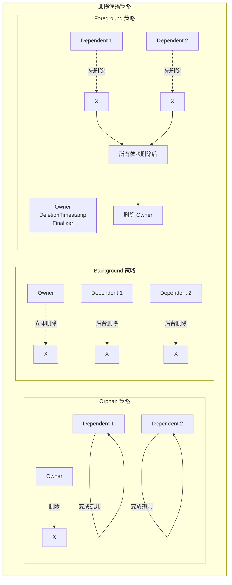
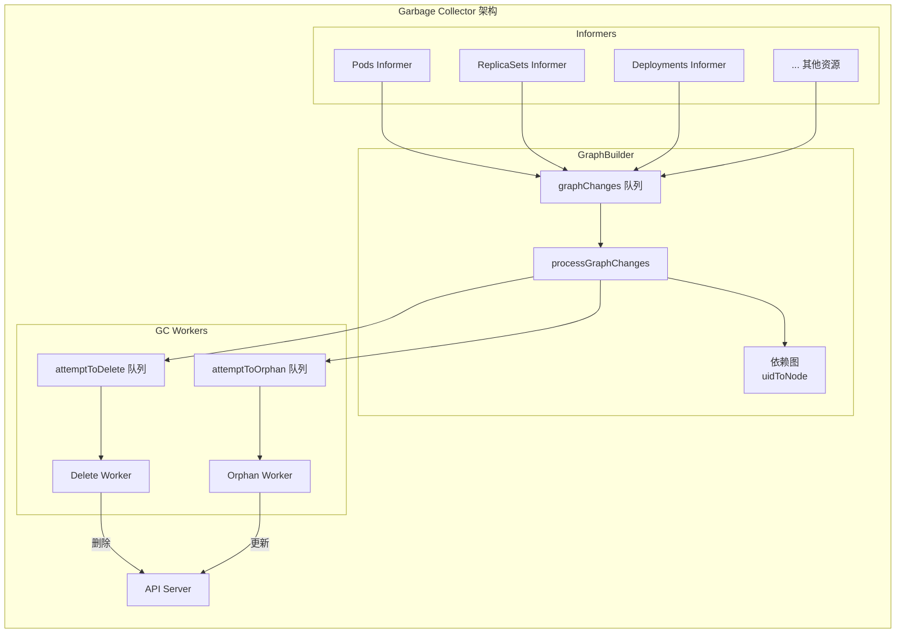
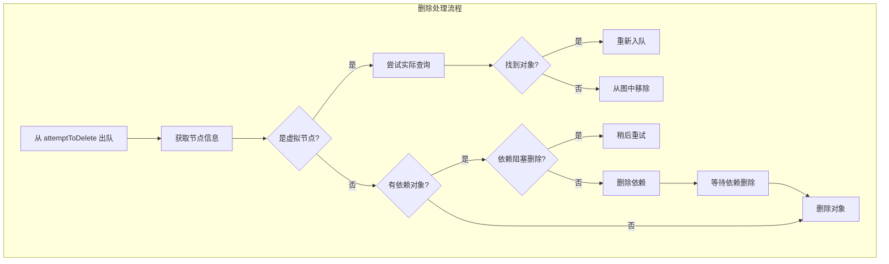
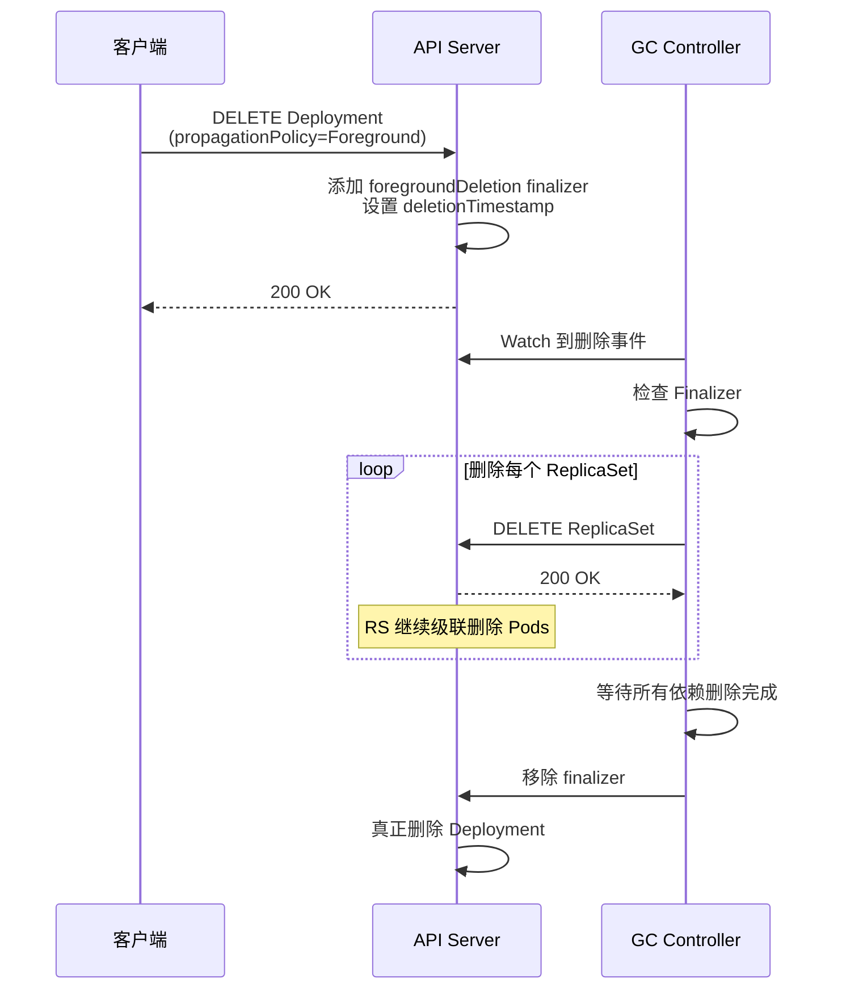
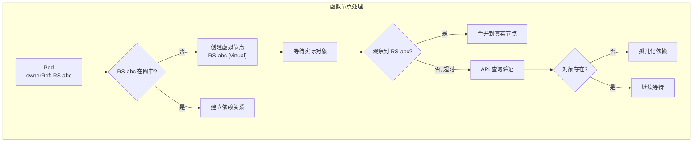

## 概述

垃圾回收控制器（Garbage Collector，简称 GC）负责自动清理 Kubernetes 集群中的孤儿对象。当一个资源被删除时，GC 确保其所有依赖资源也被正确清理。这种机制基于 OwnerReference 建立的依赖关系，实现了级联删除功能。

## 核心概念

### OwnerReference

OwnerReference 定义了资源之间的所有权关系：

```go
// OwnerReference 定义在 k8s.io/apimachinery/pkg/apis/meta/v1/types.go
type OwnerReference struct {
    // API 版本
    APIVersion string

    // 资源类型
    Kind string

    // 所有者名称
    Name string

    // 所有者 UID
    UID types.UID

    // 是否为控制器引用（每个对象最多一个）
    Controller *bool

    // 是否阻止所有者被删除
    BlockOwnerDeletion *bool
}
```

### 删除策略

Kubernetes 支持三种删除传播策略：



| 策略 | 行为 | 使用场景 |
|------|------|----------|
| Orphan | 删除 Owner，保留 Dependents | 转移资源所有权 |
| Background | 立即删除 Owner，后台删除 Dependents | 默认策略，快速响应 |
| Foreground | 先删除 Dependents，最后删除 Owner | 确保清理顺序 |

## 控制器架构

### 结构定义

垃圾回收控制器定义在 `pkg/controller/garbagecollector/garbagecollector.go`：

```go
// GarbageCollector 是垃圾回收控制器
type GarbageCollector struct {
    // REST 客户端映射
    restMapper meta.RESTMapper

    // 元数据客户端
    metadataClient metadata.Interface

    // 依赖图构建器
    dependencyGraphBuilder *GraphBuilder

    // 要忽略的资源（系统资源）
    ignoredResources map[schema.GroupResource]struct{}

    // 资源同步状态
    workerLock sync.RWMutex

    // 垃圾回收队列
    attemptToDelete workqueue.TypedRateLimitingInterface[*node]

    // 孤儿处理队列
    attemptToOrphan workqueue.TypedRateLimitingInterface[*node]

    // 依赖图
    dependencyGraphBuilder *GraphBuilder
}
```

### 依赖图构建器

GraphBuilder 负责构建和维护资源依赖关系图：

```go
// GraphBuilder 构建对象依赖图
type GraphBuilder struct {
    // REST 客户端映射
    restMapper meta.RESTMapper

    // 监控的资源
    monitors monitors

    // 运行状态
    running bool

    // 元数据客户端
    metadataClient metadata.Interface

    // 依赖图
    uidToNode *concurrentUIDToNode

    // GC 队列
    attemptToDelete workqueue.TypedRateLimitingInterface[*node]
    attemptToOrphan workqueue.TypedRateLimitingInterface[*node]

    // 孤儿事件队列
    graphChanges workqueue.TypedRateLimitingInterface[*event]

    // 忽略的资源
    ignoredResources map[schema.GroupResource]struct{}
}
```

### 节点结构

依赖图中的节点表示资源及其关系：

```go
// node 表示依赖图中的一个节点
type node struct {
    identity objectReference

    // 依赖关系锁
    dependentsLock sync.RWMutex

    // 依赖此节点的对象
    dependents map[*node]struct{}

    // 删除时是否阻塞
    deletingDependents     bool
    deletingDependentsLock sync.RWMutex

    // 拥有此节点的对象
    owners []metav1.OwnerReference

    // 是否正在删除
    beingDeleted bool
    // 是否有删除中的依赖
    deletingDependents bool

    // 虚拟标记（用于尚未观察到的对象）
    virtual     bool
    virtualLock sync.RWMutex
}

// objectReference 标识一个对象
type objectReference struct {
    OwnerReference metav1.OwnerReference
    Namespace      string
}
```

## 工作流程

### 整体架构



### 依赖图更新

```go
// processGraphChanges 处理图变更事件
func (gb *GraphBuilder) processGraphChanges() bool {
    event, quit := gb.graphChanges.Get()
    if quit {
        return false
    }
    defer gb.graphChanges.Done(event)

    // 获取对象信息
    accessor, _ := meta.Accessor(event.obj)
    uid := accessor.GetUID()

    switch event.eventType {
    case addEvent:
        // 添加新节点
        gb.addNode(event.obj)

    case updateEvent:
        // 更新节点关系
        gb.updateNode(event.oldObj, event.obj)

    case deleteEvent:
        // 标记节点删除
        gb.removeNode(event.obj)
    }

    return true
}

// addNode 添加节点到依赖图
func (gb *GraphBuilder) addNode(obj interface{}) {
    accessor, _ := meta.Accessor(obj)
    uid := accessor.GetUID()

    // 创建节点
    n := &node{
        identity: objectReference{
            OwnerReference: metav1.OwnerReference{
                APIVersion: accessor.GetAPIVersion(),
                Kind:       accessor.GetKind(),
                Name:       accessor.GetName(),
                UID:        uid,
            },
            Namespace: accessor.GetNamespace(),
        },
        owners:     accessor.GetOwnerReferences(),
        dependents: make(map[*node]struct{}),
    }

    // 添加到 UID 映射
    gb.uidToNode.Write(n)

    // 建立与 Owner 的关系
    for _, owner := range n.owners {
        ownerNode, found := gb.uidToNode.Read(owner.UID)
        if found {
            ownerNode.addDependent(n)
        } else {
            // Owner 还不存在，创建虚拟节点
            gb.insertVirtualNode(owner, n)
        }
    }

    // 检查是否需要处理
    gb.processTransitions(nil, n)
}
```

### 删除处理流程



### 孤儿处理流程

```go
// runAttemptToOrphanWorker 处理孤儿化请求
func (gc *GarbageCollector) runAttemptToOrphanWorker() {
    for gc.processAttemptToOrphanWorker() {
    }
}

func (gc *GarbageCollector) processAttemptToOrphanWorker() bool {
    item, quit := gc.attemptToOrphan.Get()
    if quit {
        return false
    }
    defer gc.attemptToOrphan.Done(item)

    n := item

    // 移除依赖对象中对此 Owner 的引用
    for dep := range n.dependents {
        // 获取依赖对象
        accessor, _ := gc.getObject(dep.identity)

        // 移除 OwnerReference
        newOwners := removeOwnerRef(accessor.GetOwnerReferences(), n.identity.UID)
        accessor.SetOwnerReferences(newOwners)

        // 更新对象
        if _, err := gc.patch(dep, accessor); err != nil {
            gc.attemptToOrphan.AddRateLimited(item)
            return true
        }
    }

    // 移除 Owner 的 orphan finalizer
    gc.removeFinalizer(n, metav1.FinalizerOrphanDependents)

    return true
}
```

## Finalizer 机制

### Finalizer 类型

Kubernetes 使用两种 Finalizer 控制删除行为：

```go
const (
    // 前台删除 Finalizer
    FinalizerDeleteDependents = "foregroundDeletion"

    // 孤儿化 Finalizer
    FinalizerOrphanDependents = "orphan"
)
```

### 前台删除流程



### Finalizer 处理代码

```go
// processItem 处理待删除的节点
func (gc *GarbageCollector) processItem(item *node) error {
    // 获取最新状态
    latest, err := gc.getObject(item.identity)
    if errors.IsNotFound(err) {
        // 对象已删除，从图中移除
        return gc.dependencyGraphBuilder.removeNode(item)
    }

    accessor, _ := meta.Accessor(latest)

    // 检查是否正在删除
    if accessor.GetDeletionTimestamp() == nil {
        return nil
    }

    // 检查 Finalizer
    finalizers := accessor.GetFinalizers()

    // 前台删除
    if containsString(finalizers, metav1.FinalizerDeleteDependents) {
        return gc.processDeletingDependentsItem(item)
    }

    // 孤儿化
    if containsString(finalizers, metav1.FinalizerOrphanDependents) {
        gc.attemptToOrphan.Add(item)
        return nil
    }

    // 后台删除（默认）
    return gc.processBackgroundItem(item)
}

// processDeletingDependentsItem 处理前台删除
func (gc *GarbageCollector) processDeletingDependentsItem(item *node) error {
    // 获取所有阻塞删除的依赖
    blockingDependents := gc.getBlockingDependents(item)

    if len(blockingDependents) == 0 {
        // 所有依赖已删除，移除 finalizer
        return gc.removeFinalizer(item, metav1.FinalizerDeleteDependents)
    }

    // 删除阻塞的依赖
    for _, dep := range blockingDependents {
        if err := gc.deleteObject(dep.identity); err != nil {
            return err
        }
    }

    // 重新入队等待
    gc.attemptToDelete.AddAfter(item, time.Second)
    return nil
}
```

## BlockOwnerDeletion

### 工作原理

`BlockOwnerDeletion` 字段控制依赖对象是否阻止 Owner 被删除：

```go
// 检查是否阻塞
func (n *node) isObserved() bool {
    return !n.virtual
}

func (n *node) getBlockingDependents() []*node {
    n.dependentsLock.RLock()
    defer n.dependentsLock.RUnlock()

    var blocking []*node
    for dep := range n.dependents {
        // 检查依赖是否设置了 blockOwnerDeletion
        for _, owner := range dep.owners {
            if owner.UID == n.identity.UID &&
                owner.BlockOwnerDeletion != nil &&
                *owner.BlockOwnerDeletion {
                blocking = append(blocking, dep)
                break
            }
        }
    }
    return blocking
}
```

### 使用示例

```yaml
apiVersion: v1
kind: Pod
metadata:
  name: example-pod
  ownerReferences:
  - apiVersion: apps/v1
    kind: ReplicaSet
    name: example-rs
    uid: abc-123
    controller: true
    blockOwnerDeletion: true  # 阻止 RS 在此 Pod 删除前被删除
```

## 虚拟节点

### 虚拟节点的作用

当观察到一个对象引用了尚未被观察到的 Owner 时，GC 会创建虚拟节点：



### 虚拟节点代码

```go
// insertVirtualNode 插入虚拟节点
func (gb *GraphBuilder) insertVirtualNode(owner metav1.OwnerReference,
    dependent *node) {

    // 创建虚拟节点
    virtualNode := &node{
        identity: objectReference{
            OwnerReference: owner,
            Namespace:      dependent.identity.Namespace,
        },
        dependents: make(map[*node]struct{}),
        virtual:    true,
    }

    // 添加依赖关系
    virtualNode.dependents[dependent] = struct{}{}

    // 加入图中
    gb.uidToNode.Write(virtualNode)

    // 入队等待处理
    gb.attemptToDelete.Add(virtualNode)
}

// attemptToDeleteItem 处理虚拟节点
func (gc *GarbageCollector) attemptToDeleteItem(item *node) error {
    if !item.isVirtual() {
        return gc.processRealNode(item)
    }

    // 尝试获取真实对象
    _, err := gc.getObject(item.identity)
    if errors.IsNotFound(err) {
        // 对象确实不存在，孤儿化依赖
        for dep := range item.dependents {
            gc.orphanDependentWithOwner(dep, item)
        }
        return gc.dependencyGraphBuilder.removeNode(item)
    }

    if err != nil {
        // 其他错误，重试
        return err
    }

    // 对象存在，等待 Informer 同步
    gc.attemptToDelete.AddAfter(item, time.Second)
    return nil
}
```

## 资源监控配置

### 监控器注册

```go
// Run 启动垃圾回收控制器
func (gc *GarbageCollector) Run(ctx context.Context, workers int) {
    defer gc.attemptToDelete.ShutDown()
    defer gc.attemptToOrphan.ShutDown()

    // 启动依赖图构建器
    go gc.dependencyGraphBuilder.Run(ctx.Done())

    // 等待所有 Informer 同步
    if !cache.WaitForNamedCacheSync("garbage collector", ctx.Done(),
        gc.dependencyGraphBuilder.IsSynced) {
        return
    }

    // 启动 Worker
    for i := 0; i < workers; i++ {
        go wait.UntilWithContext(ctx, gc.runAttemptToDeleteWorker, time.Second)
        go wait.UntilWithContext(ctx, gc.runAttemptToOrphanWorker, time.Second)
    }

    <-ctx.Done()
}

// startMonitors 启动资源监控
func (gb *GraphBuilder) startMonitors(ctx context.Context) {
    gb.monitorLock.Lock()
    defer gb.monitorLock.Unlock()

    // 为每种资源启动 Informer
    for _, monitor := range gb.monitors {
        go monitor.Run(ctx.Done())
    }
}
```

### 忽略的资源

某些系统资源不参与垃圾回收：

```go
// 默认忽略的资源
var defaultIgnoredResources = map[schema.GroupResource]struct{}{
    {Group: "", Resource: "events"}:                     {},
    {Group: "events.k8s.io", Resource: "events"}:        {},
    {Group: "authentication.k8s.io", Resource: "tokenreviews"}: {},
    {Group: "authorization.k8s.io", Resource: "subjectaccessreviews"}: {},
    // ... 更多系统资源
}
```

## 性能优化

### 批量处理

```go
// 批量处理删除请求
func (gc *GarbageCollector) deleteObject(ref objectReference) error {
    // 使用 DeleteOptions 指定传播策略
    policy := metav1.DeletePropagationBackground
    opts := metav1.DeleteOptions{
        PropagationPolicy: &policy,
        Preconditions: &metav1.Preconditions{
            UID: &ref.UID,
        },
    }

    return gc.metadataClient.Resource(ref.GroupVersionResource()).
        Namespace(ref.Namespace).
        Delete(context.TODO(), ref.Name, opts)
}
```

### 依赖图缓存

```go
// concurrentUIDToNode 提供并发安全的 UID 到节点映射
type concurrentUIDToNode struct {
    lock sync.RWMutex
    m    map[types.UID]*node
}

func (u *concurrentUIDToNode) Read(uid types.UID) (*node, bool) {
    u.lock.RLock()
    defer u.lock.RUnlock()
    n, ok := u.m[uid]
    return n, ok
}

func (u *concurrentUIDToNode) Write(n *node) {
    u.lock.Lock()
    defer u.lock.Unlock()
    u.m[n.identity.UID] = n
}
```

## 调试与监控

### 关键指标

| 指标 | 说明 |
|------|------|
| `garbagecollector_controller_resources_sync_error_total` | 资源同步错误数 |
| `garbagecollector_controller_dirty_processing_time` | 脏节点处理时间 |
| `garbagecollector_controller_orphan_processing_time` | 孤儿处理时间 |

### 日志级别

```go
// 增加日志输出以调试
// klog.V(4) - 详细流程信息
// klog.V(5) - 非常详细的调试信息

klog.V(4).Infof("processItem: node %s in graph", n.identity)
klog.V(5).Infof("node %s has %d dependents", n.identity, len(n.dependents))
```

### 常见问题排查

1. **对象无法删除**
   - 检查是否有 Finalizer
   - 检查依赖对象是否存在
   - 查看 GC 控制器日志

2. **孤儿对象残留**
   - 检查 OwnerReference 是否正确
   - 验证 Owner UID 是否匹配
   - 检查 GC 是否正常运行

3. **删除延迟**
   - 检查依赖图大小
   - 监控队列深度
   - 调整 Worker 数量

## 总结

垃圾回收控制器是 Kubernetes 资源管理的关键组件：

1. **依赖图管理**：维护所有资源间的依赖关系
2. **级联删除**：支持 Foreground、Background、Orphan 三种策略
3. **Finalizer 机制**：确保删除操作的正确顺序
4. **虚拟节点**：处理未观察到的 Owner 引用

GC 控制器与所有其他控制器协作，确保集群中的资源关系始终保持一致，孤儿对象能够被及时清理。
