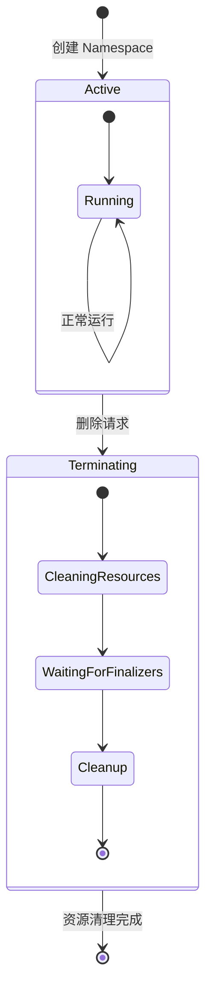
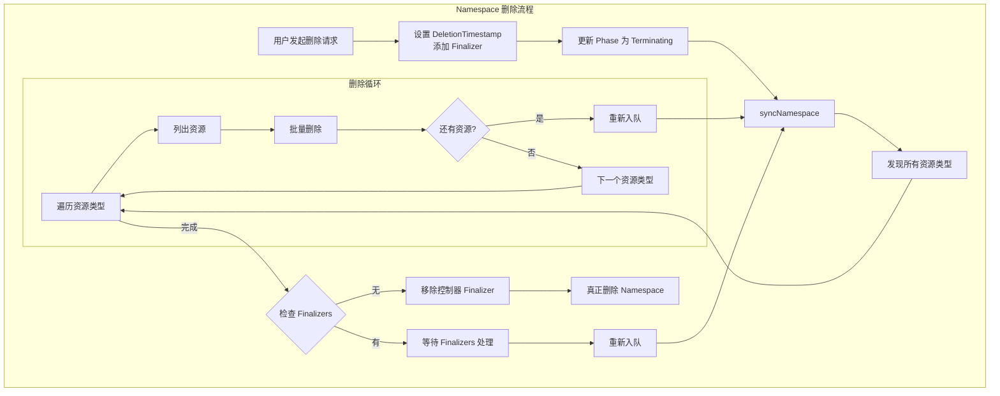
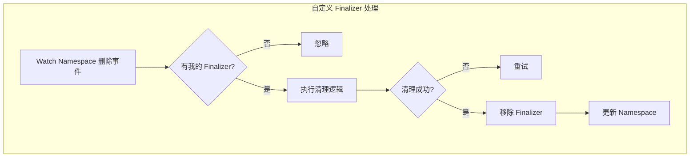
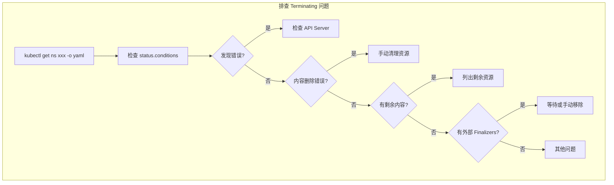

## 概述

Namespace 控制器负责管理 Kubernetes 命名空间的生命周期，特别是命名空间的删除流程。当用户删除一个命名空间时，控制器确保该命名空间下的所有资源都被正确清理，只有在所有资源清理完成后才会真正删除命名空间对象。

## Namespace 生命周期

### 状态转换



### Namespace 资源模型

```go
// Namespace 状态定义
type NamespaceStatus struct {
    // Phase 表示命名空间的当前生命周期阶段
    Phase NamespacePhase

    // Conditions 详细的状态条件
    Conditions []NamespaceCondition
}

// NamespacePhase 定义命名空间的阶段
const (
    // NamespaceActive 表示命名空间正在使用中
    NamespaceActive NamespacePhase = "Active"

    // NamespaceTerminating 表示命名空间正在删除中
    NamespaceTerminating NamespacePhase = "Terminating"
)

// NamespaceCondition 描述命名空间的详细状态
type NamespaceCondition struct {
    // 条件类型
    Type NamespaceConditionType
    // 状态值
    Status ConditionStatus
    // 上次转换时间
    LastTransitionTime metav1.Time
    // 原因
    Reason string
    // 消息
    Message string
}

// 条件类型
const (
    // NamespaceDeletionDiscoveryFailure 表示资源发现失败
    NamespaceDeletionDiscoveryFailure NamespaceConditionType = "NamespaceDeletionDiscoveryFailure"
    // NamespaceDeletionContentFailure 表示内容删除失败
    NamespaceDeletionContentFailure NamespaceConditionType = "NamespaceDeletionContentFailure"
    // NamespaceDeletionGVParsingFailure 表示 GV 解析失败
    NamespaceDeletionGVParsingFailure NamespaceConditionType = "NamespaceDeletionGVParsingFailure"
    // NamespaceContentRemaining 表示仍有内容残留
    NamespaceContentRemaining NamespaceConditionType = "NamespaceContentRemaining"
    // NamespaceFinalizersRemaining 表示还有 Finalizers 未处理
    NamespaceFinalizersRemaining NamespaceConditionType = "NamespaceFinalizersRemaining"
)
```

## 控制器架构

### 结构定义

Namespace 控制器定义在 `pkg/controller/namespace/namespace_controller.go`：

```go
// NamespaceController 管理命名空间的删除
type NamespaceController struct {
    // 客户端
    kubeClient clientset.Interface

    // 元数据客户端（用于列出所有资源）
    metadataClient metadata.Interface

    // 动态客户端
    dynamicClient dynamic.Interface

    // Lister 和同步状态
    lister corelisters.NamespaceLister
    synced cache.InformerSynced

    // 工作队列
    queue workqueue.RateLimitingInterface

    // 删除器
    namespacedResourcesDeleter deletion.NamespacedResourcesDeleterInterface

    // 重试间隔
    resyncPeriod time.Duration

    // Finalizer 标记
    finalizerToken v1.FinalizerName
}
```

### 资源删除器

```go
// namespacedResourcesDeleter 处理命名空间内容删除
type namespacedResourcesDeleter struct {
    // 元数据客户端
    metadataClient metadata.Interface

    // 动态客户端
    dynamicClient dynamic.Interface

    // Pod 客户端
    podsGetter v1client.PodsGetter

    // 操作接口
    opCache             *operationNotSupportedCache
    discoverResourcesFn func() ([]*metav1.APIResourceList, error)
}

// Delete 删除命名空间中的所有内容
func (d *namespacedResourcesDeleter) Delete(nsName string) error {
    // 1. 发现所有命名空间范围的资源类型
    resources, err := d.discoverResourcesFn()
    if err != nil {
        return err
    }

    // 2. 对每种资源类型执行删除
    var errs []error
    for _, group := range resources {
        for _, resource := range group.APIResources {
            if !resource.Namespaced {
                continue
            }
            err := d.deleteAllContent(nsName, resource)
            if err != nil {
                errs = append(errs, err)
            }
        }
    }

    return utilerrors.NewAggregate(errs)
}
```

## 删除流程

### 整体流程



### 同步逻辑

```go
// sync 同步单个命名空间
func (nm *NamespaceController) sync(key string) error {
    // 获取命名空间
    namespace, err := nm.lister.Get(key)
    if errors.IsNotFound(err) {
        return nil
    }
    if err != nil {
        return err
    }

    // 如果没有 DeletionTimestamp，说明不是删除操作
    if namespace.DeletionTimestamp == nil {
        return nil
    }

    // 确保 Phase 为 Terminating
    if namespace.Status.Phase != v1.NamespaceTerminating {
        return nm.retryOnConflictError(namespace, nm.updateStatus)
    }

    // 删除命名空间内容
    err = nm.namespacedResourcesDeleter.Delete(namespace.Name)
    if err != nil {
        // 删除失败，更新状态并重试
        nm.updateConditions(namespace, err)
        return err
    }

    // 检查是否所有内容都已清理
    estimate, err := nm.namespacedResourcesDeleter.EstimateGraceful(namespace.Name)
    if estimate > 0 || err != nil {
        // 还有内容未清理，重新入队
        return fmt.Errorf("namespace %s still has content", namespace.Name)
    }

    // 检查其他 Finalizers
    if len(namespace.Spec.Finalizers) > 1 ||
        (len(namespace.Spec.Finalizers) == 1 &&
            namespace.Spec.Finalizers[0] != nm.finalizerToken) {
        // 等待其他 Finalizers
        return nil
    }

    // 移除我们的 Finalizer
    return nm.removeFinalizer(namespace)
}
```

### 资源清理

```go
// deleteAllContent 删除指定类型的所有资源
func (d *namespacedResourcesDeleter) deleteAllContent(
    namespace string, gvr schema.GroupVersionResource) error {

    // 使用 DeleteCollection 批量删除
    deleteOptions := metav1.DeleteOptions{}

    // 设置传播策略
    propagation := metav1.DeletePropagationForeground
    deleteOptions.PropagationPolicy = &propagation

    // 批量删除
    err := d.metadataClient.Resource(gvr).Namespace(namespace).
        DeleteCollection(context.TODO(), deleteOptions, metav1.ListOptions{})

    if err != nil && !errors.IsNotFound(err) && !errors.IsMethodNotSupported(err) {
        return err
    }

    return nil
}

// deleteAllContentForGroupVersionResource 更细粒度的删除
func (d *namespacedResourcesDeleter) deleteAllContentForGroupVersionResource(
    gvr schema.GroupVersionResource, namespace string) (int64, error) {

    // 列出所有资源
    list, err := d.metadataClient.Resource(gvr).Namespace(namespace).
        List(context.TODO(), metav1.ListOptions{})
    if err != nil {
        return 0, err
    }

    // 计算等待时间
    var estimate int64

    for _, item := range list.Items {
        // 如果有 DeletionTimestamp，跳过（已在删除中）
        if item.GetDeletionTimestamp() != nil {
            // 估算剩余时间
            if item.GetDeletionGracePeriodSeconds() != nil {
                estimate = max(estimate, *item.GetDeletionGracePeriodSeconds())
            }
            continue
        }

        // 删除资源
        err := d.metadataClient.Resource(gvr).Namespace(namespace).
            Delete(context.TODO(), item.GetName(), metav1.DeleteOptions{})
        if err != nil && !errors.IsNotFound(err) {
            return estimate, err
        }
    }

    return estimate, nil
}
```

## Finalizer 处理

### 内置 Finalizer

Kubernetes 命名空间使用 `kubernetes` Finalizer 来确保内容清理：

```go
const (
    // FinalizerKubernetes 是命名空间的内置 Finalizer
    FinalizerKubernetes FinalizerName = "kubernetes"
)

// 检查 Finalizers
func hasFinalizer(namespace *v1.Namespace, finalizer v1.FinalizerName) bool {
    for _, f := range namespace.Spec.Finalizers {
        if f == finalizer {
            return true
        }
    }
    return false
}

// removeFinalizer 移除 Finalizer
func (nm *NamespaceController) removeFinalizer(namespace *v1.Namespace) error {
    // 创建副本
    namespaceCopy := namespace.DeepCopy()

    // 移除 Finalizer
    var newFinalizers []v1.FinalizerName
    for _, f := range namespaceCopy.Spec.Finalizers {
        if f != nm.finalizerToken {
            newFinalizers = append(newFinalizers, f)
        }
    }
    namespaceCopy.Spec.Finalizers = newFinalizers

    // 更新命名空间
    _, err := nm.kubeClient.CoreV1().Namespaces().Finalize(
        context.TODO(), namespaceCopy, metav1.UpdateOptions{})

    return err
}
```

### 自定义 Finalizer

外部控制器可以添加自己的 Finalizer：

```yaml
apiVersion: v1
kind: Namespace
metadata:
  name: example
  finalizers:
  - kubernetes              # 内置
  - custom.io/cleanup       # 自定义
spec:
  finalizers:
  - kubernetes
  - custom.io/cleanup
```

自定义 Finalizer 处理模式：



## 状态条件

### 条件更新

```go
// updateNamespaceStatusFunc 更新命名空间状态
func (nm *NamespaceController) updateNamespaceStatusFunc(
    namespace *v1.Namespace) (*v1.Namespace, error) {

    // 如果有错误，设置相应条件
    conditions := []v1.NamespaceCondition{}

    // 检查资源发现错误
    if discoveryErr != nil {
        conditions = append(conditions, v1.NamespaceCondition{
            Type:               v1.NamespaceDeletionDiscoveryFailure,
            Status:             v1.ConditionTrue,
            LastTransitionTime: metav1.Now(),
            Reason:             "DiscoveryFailed",
            Message:            discoveryErr.Error(),
        })
    }

    // 检查内容删除错误
    if contentErr != nil {
        conditions = append(conditions, v1.NamespaceCondition{
            Type:               v1.NamespaceDeletionContentFailure,
            Status:             v1.ConditionTrue,
            LastTransitionTime: metav1.Now(),
            Reason:             "ContentDeletionFailed",
            Message:            contentErr.Error(),
        })
    }

    // 检查剩余内容
    if remainingContent > 0 {
        conditions = append(conditions, v1.NamespaceCondition{
            Type:               v1.NamespaceContentRemaining,
            Status:             v1.ConditionTrue,
            LastTransitionTime: metav1.Now(),
            Reason:             "SomeResourcesRemain",
            Message:            fmt.Sprintf("%d resources remaining", remainingContent),
        })
    }

    // 更新状态
    namespace.Status.Conditions = conditions

    return nm.kubeClient.CoreV1().Namespaces().UpdateStatus(
        context.TODO(), namespace, metav1.UpdateOptions{})
}
```

### 条件诊断

```go
// 诊断命名空间删除问题
func diagnoseNamespaceDeletion(ns *v1.Namespace) string {
    var messages []string

    for _, cond := range ns.Status.Conditions {
        if cond.Status == v1.ConditionTrue {
            switch cond.Type {
            case v1.NamespaceDeletionDiscoveryFailure:
                messages = append(messages,
                    fmt.Sprintf("Discovery failed: %s", cond.Message))

            case v1.NamespaceDeletionContentFailure:
                messages = append(messages,
                    fmt.Sprintf("Content deletion failed: %s", cond.Message))

            case v1.NamespaceContentRemaining:
                messages = append(messages,
                    fmt.Sprintf("Content remaining: %s", cond.Message))

            case v1.NamespaceFinalizersRemaining:
                messages = append(messages,
                    fmt.Sprintf("Finalizers remaining: %s", cond.Message))
            }
        }
    }

    return strings.Join(messages, "; ")
}
```

## 资源发现

### 动态资源发现

```go
// discoverGroupVersionResources 发现所有 API 资源
func (d *namespacedResourcesDeleter) discoverGroupVersionResources() (
    map[schema.GroupVersionResource]struct{}, error) {

    // 获取所有 API 组
    resources, err := d.discoverResourcesFn()
    if err != nil {
        return nil, err
    }

    gvrs := make(map[schema.GroupVersionResource]struct{})

    for _, group := range resources {
        gv, err := schema.ParseGroupVersion(group.GroupVersion)
        if err != nil {
            continue
        }

        for _, resource := range group.APIResources {
            // 只处理命名空间范围的资源
            if !resource.Namespaced {
                continue
            }

            // 跳过子资源
            if strings.Contains(resource.Name, "/") {
                continue
            }

            // 必须支持 delete 操作
            if !containsVerb(resource.Verbs, "delete") &&
                !containsVerb(resource.Verbs, "deletecollection") {
                continue
            }

            gvrs[gv.WithResource(resource.Name)] = struct{}{}
        }
    }

    return gvrs, nil
}
```

### 处理不支持的操作

```go
// operationNotSupportedCache 缓存不支持的操作
type operationNotSupportedCache struct {
    lock sync.RWMutex
    m    map[schema.GroupVersionResource]struct{}
}

// isSupported 检查操作是否支持
func (c *operationNotSupportedCache) isSupported(gvr schema.GroupVersionResource) bool {
    c.lock.RLock()
    defer c.lock.RUnlock()
    _, ok := c.m[gvr]
    return !ok
}

// setNotSupported 标记操作不支持
func (c *operationNotSupportedCache) setNotSupported(gvr schema.GroupVersionResource) {
    c.lock.Lock()
    defer c.lock.Unlock()
    c.m[gvr] = struct{}{}
}
```

## 删除策略

### 优雅删除估算

```go
// estimateGracefulTermination 估算优雅终止时间
func (d *namespacedResourcesDeleter) estimateGracefulTermination(
    namespace string) (int64, error) {

    var estimate int64

    gvrs, err := d.discoverGroupVersionResources()
    if err != nil {
        return 0, err
    }

    for gvr := range gvrs {
        // 列出所有正在删除的资源
        list, err := d.metadataClient.Resource(gvr).Namespace(namespace).
            List(context.TODO(), metav1.ListOptions{})
        if err != nil {
            continue
        }

        for _, item := range list.Items {
            if item.GetDeletionTimestamp() == nil {
                continue
            }
            if grace := item.GetDeletionGracePeriodSeconds(); grace != nil {
                // 计算剩余优雅期
                elapsed := time.Since(item.GetDeletionTimestamp().Time)
                remaining := time.Duration(*grace)*time.Second - elapsed
                if remaining > 0 {
                    estimate = max(estimate, int64(remaining.Seconds()))
                }
            }
        }
    }

    return estimate, nil
}
```

### 重试策略

```go
// processNextWorkItem 处理下一个工作项
func (nm *NamespaceController) processNextWorkItem() bool {
    key, quit := nm.queue.Get()
    if quit {
        return false
    }
    defer nm.queue.Done(key)

    err := nm.sync(key)
    if err == nil {
        nm.queue.Forget(key)
        return true
    }

    // 使用指数退避重试
    if nm.queue.NumRequeues(key) < maxRetries {
        nm.queue.AddRateLimited(key)
    } else {
        nm.queue.Forget(key)
        runtime.HandleError(fmt.Errorf(
            "namespace %s has been retried too many times", key))
    }

    return true
}
```

## 常见问题与解决

### Namespace 卡在 Terminating



### 诊断命令

```bash
# 查看命名空间状态
kubectl get ns <namespace> -o yaml

# 列出命名空间中的所有资源
kubectl api-resources --verbs=list --namespaced -o name | \
  xargs -n 1 kubectl get --show-kind --ignore-not-found -n <namespace>

# 查看 Finalizers
kubectl get ns <namespace> -o jsonpath='{.spec.finalizers}'

# 强制移除 Finalizer（谨慎使用）
kubectl patch ns <namespace> -p '{"metadata":{"finalizers":null}}' --type=merge
```

### 清理残留资源

```go
// 手动清理脚本逻辑
func cleanupStuckNamespace(namespace string, client kubernetes.Interface) error {
    // 获取命名空间
    ns, err := client.CoreV1().Namespaces().Get(
        context.TODO(), namespace, metav1.GetOptions{})
    if err != nil {
        return err
    }

    // 检查是否在 Terminating 状态
    if ns.Status.Phase != v1.NamespaceTerminating {
        return fmt.Errorf("namespace is not terminating")
    }

    // 移除 Finalizers
    ns.Spec.Finalizers = nil

    // 使用 Finalize API
    _, err = client.CoreV1().Namespaces().Finalize(
        context.TODO(), ns, metav1.UpdateOptions{})

    return err
}
```

## 监控指标

| 指标 | 说明 |
|------|------|
| `namespace_controller_queue_depth` | 队列深度 |
| `namespace_controller_work_duration_seconds` | 处理耗时 |
| `namespace_controller_retries_total` | 重试次数 |

## 最佳实践

### 命名空间设计

1. **合理规划**：按项目/团队/环境划分命名空间
2. **资源配额**：为每个命名空间设置 ResourceQuota
3. **网络策略**：使用 NetworkPolicy 隔离命名空间

### 删除注意事项

1. **备份重要数据**：删除前备份 PVC 和 ConfigMap
2. **检查依赖**：确认没有跨命名空间引用
3. **逐步删除**：先删除工作负载，再删除命名空间

### 自定义 Finalizer

```yaml
# 自定义控制器的 Finalizer 示例
apiVersion: v1
kind: Namespace
metadata:
  name: production
  finalizers:
  - kubernetes
  - backup.company.io/pre-delete   # 删除前备份
  - audit.company.io/log-deletion  # 记录删除日志
```

## 总结

Namespace 控制器是 Kubernetes 资源隔离的关键组件：

1. **生命周期管理**：控制命名空间从 Active 到 Terminating 再到删除的完整流程
2. **资源清理**：自动发现和删除命名空间内的所有资源
3. **Finalizer 机制**：确保资源清理的顺序和完整性
4. **状态报告**：通过 Conditions 报告删除进度和问题

正确理解 Namespace 控制器的工作原理，有助于解决常见的命名空间卡在 Terminating 状态的问题。
