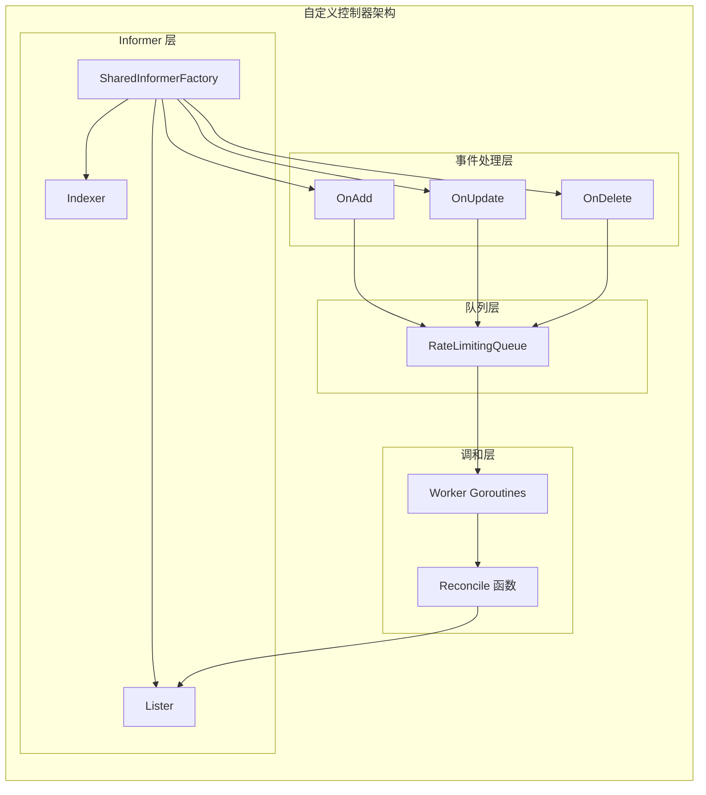
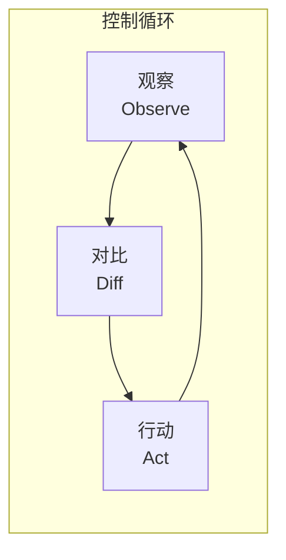

## 概述

自定义控制器是扩展 Kubernetes 功能的核心方式。通过编写控制器，开发者可以实现对自定义资源（CRD）或原生资源的自动化管理。本文介绍如何使用 client-go 库从零开始构建一个生产级别的自定义控制器。

## 控制器设计模式

### 基本架构



### 控制循环



## 控制器骨架代码

### 结构定义

```go
package controller

import (
    "context"
    "fmt"
    "time"

    corev1 "k8s.io/api/core/v1"
    "k8s.io/apimachinery/pkg/api/errors"
    metav1 "k8s.io/apimachinery/pkg/apis/meta/v1"
    utilruntime "k8s.io/apimachinery/pkg/util/runtime"
    "k8s.io/apimachinery/pkg/util/wait"
    "k8s.io/client-go/kubernetes"
    "k8s.io/client-go/kubernetes/scheme"
    typedcorev1 "k8s.io/client-go/kubernetes/typed/core/v1"
    "k8s.io/client-go/tools/cache"
    "k8s.io/client-go/tools/record"
    "k8s.io/client-go/util/workqueue"
    "k8s.io/klog/v2"

    // 假设有自定义资源
    samplev1alpha1 "example.com/sample-controller/pkg/apis/sample/v1alpha1"
    clientset "example.com/sample-controller/pkg/generated/clientset/versioned"
    samplescheme "example.com/sample-controller/pkg/generated/clientset/versioned/scheme"
    informers "example.com/sample-controller/pkg/generated/informers/externalversions/sample/v1alpha1"
    listers "example.com/sample-controller/pkg/generated/listers/sample/v1alpha1"
)

const (
    // controllerAgentName 是控制器名称
    controllerAgentName = "sample-controller"

    // SuccessSynced 表示同步成功
    SuccessSynced = "Synced"
    // ErrResourceExists 表示资源已存在
    ErrResourceExists = "ErrResourceExists"
)

// Controller 是自定义控制器
type Controller struct {
    // kubeclientset 是标准 Kubernetes 客户端
    kubeclientset kubernetes.Interface

    // sampleclientset 是自定义资源客户端
    sampleclientset clientset.Interface

    // 资源 Lister
    deploymentsLister appslisters.DeploymentLister
    deploymentsSynced cache.InformerSynced

    foosLister listers.FooLister
    foosSynced cache.InformerSynced

    // 工作队列
    workqueue workqueue.RateLimitingInterface

    // 事件记录器
    recorder record.EventRecorder
}
```

### 初始化函数

```go
// NewController 创建新的控制器实例
func NewController(
    kubeclientset kubernetes.Interface,
    sampleclientset clientset.Interface,
    deploymentInformer appsinformers.DeploymentInformer,
    fooInformer informers.FooInformer) *Controller {

    // 添加 sample-controller 类型到默认 Scheme
    utilruntime.Must(samplescheme.AddToScheme(scheme.Scheme))

    // 创建事件广播器
    klog.V(4).Info("Creating event broadcaster")
    eventBroadcaster := record.NewBroadcaster()
    eventBroadcaster.StartStructuredLogging(0)
    eventBroadcaster.StartRecordingToSink(&typedcorev1.EventSinkImpl{
        Interface: kubeclientset.CoreV1().Events(""),
    })
    recorder := eventBroadcaster.NewRecorder(
        scheme.Scheme, corev1.EventSource{Component: controllerAgentName})

    controller := &Controller{
        kubeclientset:     kubeclientset,
        sampleclientset:   sampleclientset,
        deploymentsLister: deploymentInformer.Lister(),
        deploymentsSynced: deploymentInformer.Informer().HasSynced,
        foosLister:        fooInformer.Lister(),
        foosSynced:        fooInformer.Informer().HasSynced,
        workqueue: workqueue.NewNamedRateLimitingQueue(
            workqueue.DefaultControllerRateLimiter(), "Foos"),
        recorder: recorder,
    }

    klog.Info("Setting up event handlers")

    // 设置 Foo 资源的事件处理器
    fooInformer.Informer().AddEventHandler(cache.ResourceEventHandlerFuncs{
        AddFunc: controller.enqueueFoo,
        UpdateFunc: func(old, new interface{}) {
            controller.enqueueFoo(new)
        },
    })

    // 设置 Deployment 的事件处理器（用于监控子资源）
    deploymentInformer.Informer().AddEventHandler(cache.ResourceEventHandlerFuncs{
        AddFunc: controller.handleObject,
        UpdateFunc: func(old, new interface{}) {
            newDepl := new.(*appsv1.Deployment)
            oldDepl := old.(*appsv1.Deployment)
            if newDepl.ResourceVersion == oldDepl.ResourceVersion {
                // 周期性 resync 会触发 update，忽略
                return
            }
            controller.handleObject(new)
        },
        DeleteFunc: controller.handleObject,
    })

    return controller
}
```

### 运行控制器

```go
// Run 启动控制器
func (c *Controller) Run(ctx context.Context, workers int) error {
    defer utilruntime.HandleCrash()
    defer c.workqueue.ShutDown()

    klog.Info("Starting Foo controller")

    // 等待缓存同步
    klog.Info("Waiting for informer caches to sync")
    if ok := cache.WaitForCacheSync(ctx.Done(),
        c.deploymentsSynced, c.foosSynced); !ok {
        return fmt.Errorf("failed to wait for caches to sync")
    }

    klog.Info("Starting workers")

    // 启动 Worker
    for i := 0; i < workers; i++ {
        go wait.UntilWithContext(ctx, c.runWorker, time.Second)
    }

    klog.Info("Started workers")
    <-ctx.Done()
    klog.Info("Shutting down workers")

    return nil
}

// runWorker 运行单个 Worker
func (c *Controller) runWorker(ctx context.Context) {
    for c.processNextWorkItem(ctx) {
    }
}

// processNextWorkItem 处理队列中的下一个项目
func (c *Controller) processNextWorkItem(ctx context.Context) bool {
    obj, shutdown := c.workqueue.Get()
    if shutdown {
        return false
    }

    // 包装处理逻辑以便 defer Done
    err := func(obj interface{}) error {
        defer c.workqueue.Done(obj)

        var key string
        var ok bool
        if key, ok = obj.(string); !ok {
            // 无效项，丢弃
            c.workqueue.Forget(obj)
            utilruntime.HandleError(fmt.Errorf(
                "expected string in workqueue but got %#v", obj))
            return nil
        }

        // 执行 Reconcile
        if err := c.syncHandler(ctx, key); err != nil {
            // 重新入队
            c.workqueue.AddRateLimited(key)
            return fmt.Errorf("error syncing '%s': %s, requeuing", key, err.Error())
        }

        // 成功处理，移除重试计数
        c.workqueue.Forget(obj)
        klog.Infof("Successfully synced '%s'", key)
        return nil
    }(obj)

    if err != nil {
        utilruntime.HandleError(err)
        return true
    }

    return true
}
```

### Reconcile 逻辑

```go
// syncHandler 实现 Reconcile 逻辑
func (c *Controller) syncHandler(ctx context.Context, key string) error {
    // 解析 namespace 和 name
    namespace, name, err := cache.SplitMetaNamespaceKey(key)
    if err != nil {
        utilruntime.HandleError(fmt.Errorf("invalid resource key: %s", key))
        return nil
    }

    // 从 Lister 获取 Foo 资源
    foo, err := c.foosLister.Foos(namespace).Get(name)
    if err != nil {
        if errors.IsNotFound(err) {
            // 资源已删除，可能需要清理
            utilruntime.HandleError(fmt.Errorf("foo '%s' no longer exists", key))
            return nil
        }
        return err
    }

    // 获取关联的 Deployment
    deploymentName := foo.Spec.DeploymentName
    if deploymentName == "" {
        utilruntime.HandleError(fmt.Errorf(
            "%s: deployment name must be specified", key))
        return nil
    }

    // 检查 Deployment 是否存在
    deployment, err := c.deploymentsLister.Deployments(
        foo.Namespace).Get(deploymentName)
    if errors.IsNotFound(err) {
        // 创建 Deployment
        deployment, err = c.kubeclientset.AppsV1().Deployments(foo.Namespace).Create(
            ctx, newDeployment(foo), metav1.CreateOptions{})
    }

    if err != nil {
        return err
    }

    // 检查 Deployment 是否被我们控制
    if !metav1.IsControlledBy(deployment, foo) {
        msg := fmt.Sprintf(
            "Resource %q already exists and is not managed by Foo",
            deployment.Name)
        c.recorder.Event(foo, corev1.EventTypeWarning, ErrResourceExists, msg)
        return fmt.Errorf(msg)
    }

    // 更新 Deployment（如果需要）
    if foo.Spec.Replicas != nil && *foo.Spec.Replicas != *deployment.Spec.Replicas {
        klog.V(4).Infof("Foo %s replicas: %d, deployment replicas: %d",
            name, *foo.Spec.Replicas, *deployment.Spec.Replicas)

        deployment, err = c.kubeclientset.AppsV1().Deployments(foo.Namespace).Update(
            ctx, newDeployment(foo), metav1.UpdateOptions{})
    }

    if err != nil {
        return err
    }

    // 更新 Foo 状态
    err = c.updateFooStatus(ctx, foo, deployment)
    if err != nil {
        return err
    }

    c.recorder.Event(foo, corev1.EventTypeNormal, SuccessSynced,
        "Foo synced successfully")
    return nil
}
```

### 事件入队

```go
// enqueueFoo 将 Foo 资源加入工作队列
func (c *Controller) enqueueFoo(obj interface{}) {
    var key string
    var err error
    if key, err = cache.MetaNamespaceKeyFunc(obj); err != nil {
        utilruntime.HandleError(err)
        return
    }
    c.workqueue.Add(key)
}

// handleObject 处理子资源变更
func (c *Controller) handleObject(obj interface{}) {
    var object metav1.Object
    var ok bool
    if object, ok = obj.(metav1.Object); !ok {
        tombstone, ok := obj.(cache.DeletedFinalStateUnknown)
        if !ok {
            utilruntime.HandleError(fmt.Errorf(
                "error decoding object, invalid type"))
            return
        }
        object, ok = tombstone.Obj.(metav1.Object)
        if !ok {
            utilruntime.HandleError(fmt.Errorf(
                "error decoding object tombstone, invalid type"))
            return
        }
        klog.V(4).Infof("Recovered deleted object '%s' from tombstone",
            object.GetName())
    }

    klog.V(4).Infof("Processing object: %s", object.GetName())

    // 获取 OwnerReference
    if ownerRef := metav1.GetControllerOf(object); ownerRef != nil {
        // 检查是否是 Foo 资源
        if ownerRef.Kind != "Foo" {
            return
        }

        foo, err := c.foosLister.Foos(object.GetNamespace()).Get(ownerRef.Name)
        if err != nil {
            klog.V(4).Infof(
                "ignoring orphaned object '%s' of foo '%s'",
                object.GetSelfLink(), ownerRef.Name)
            return
        }

        c.enqueueFoo(foo)
        return
    }
}
```

### 创建子资源

```go
// newDeployment 创建 Deployment 对象
func newDeployment(foo *samplev1alpha1.Foo) *appsv1.Deployment {
    labels := map[string]string{
        "app":        "nginx",
        "controller": foo.Name,
    }

    return &appsv1.Deployment{
        ObjectMeta: metav1.ObjectMeta{
            Name:      foo.Spec.DeploymentName,
            Namespace: foo.Namespace,
            // 设置 OwnerReference
            OwnerReferences: []metav1.OwnerReference{
                *metav1.NewControllerRef(foo,
                    samplev1alpha1.SchemeGroupVersion.WithKind("Foo")),
            },
        },
        Spec: appsv1.DeploymentSpec{
            Replicas: foo.Spec.Replicas,
            Selector: &metav1.LabelSelector{
                MatchLabels: labels,
            },
            Template: corev1.PodTemplateSpec{
                ObjectMeta: metav1.ObjectMeta{
                    Labels: labels,
                },
                Spec: corev1.PodSpec{
                    Containers: []corev1.Container{
                        {
                            Name:  "nginx",
                            Image: "nginx:latest",
                        },
                    },
                },
            },
        },
    }
}
```

### 状态更新

```go
// updateFooStatus 更新 Foo 的 Status
func (c *Controller) updateFooStatus(
    ctx context.Context,
    foo *samplev1alpha1.Foo,
    deployment *appsv1.Deployment) error {

    // 深拷贝以避免修改缓存
    fooCopy := foo.DeepCopy()
    fooCopy.Status.AvailableReplicas = deployment.Status.AvailableReplicas

    // 使用 UpdateStatus 子资源
    _, err := c.sampleclientset.SamplecontrollerV1alpha1().Foos(foo.Namespace).
        UpdateStatus(ctx, fooCopy, metav1.UpdateOptions{})

    return err
}
```

## 高级模式

### Finalizer 处理

```go
const finalizerName = "foos.samplecontroller.example.com/finalizer"

// handleFinalizer 处理 Finalizer
func (c *Controller) handleFinalizer(ctx context.Context,
    foo *samplev1alpha1.Foo) error {

    // 检查是否正在删除
    if foo.ObjectMeta.DeletionTimestamp.IsZero() {
        // 不在删除中，确保有 Finalizer
        if !containsString(foo.ObjectMeta.Finalizers, finalizerName) {
            foo.ObjectMeta.Finalizers = append(
                foo.ObjectMeta.Finalizers, finalizerName)
            if _, err := c.sampleclientset.SamplecontrollerV1alpha1().
                Foos(foo.Namespace).Update(ctx, foo, metav1.UpdateOptions{}); err != nil {
                return err
            }
        }
    } else {
        // 正在删除
        if containsString(foo.ObjectMeta.Finalizers, finalizerName) {
            // 执行清理逻辑
            if err := c.cleanupExternalResources(foo); err != nil {
                return err
            }

            // 移除 Finalizer
            foo.ObjectMeta.Finalizers = removeString(
                foo.ObjectMeta.Finalizers, finalizerName)
            if _, err := c.sampleclientset.SamplecontrollerV1alpha1().
                Foos(foo.Namespace).Update(ctx, foo, metav1.UpdateOptions{}); err != nil {
                return err
            }
        }
        // 已移除 Finalizer，对象将被删除
        return nil
    }

    return nil
}

// cleanupExternalResources 清理外部资源
func (c *Controller) cleanupExternalResources(foo *samplev1alpha1.Foo) error {
    // 清理外部资源的逻辑
    klog.Infof("Cleaning up external resources for Foo %s", foo.Name)
    return nil
}
```

### 条件管理

```go
// 条件类型
const (
    ConditionTypeReady      = "Ready"
    ConditionTypeProgressing = "Progressing"
    ConditionTypeDegraded   = "Degraded"
)

// setCondition 设置状态条件
func setCondition(
    status *samplev1alpha1.FooStatus,
    condType string,
    condStatus metav1.ConditionStatus,
    reason, message string) {

    now := metav1.Now()
    condition := metav1.Condition{
        Type:               condType,
        Status:             condStatus,
        LastTransitionTime: now,
        Reason:             reason,
        Message:            message,
    }

    // 查找现有条件
    for i, c := range status.Conditions {
        if c.Type == condType {
            // 只有状态变化时更新 LastTransitionTime
            if c.Status != condStatus {
                status.Conditions[i] = condition
            } else {
                // 状态未变，保留原来的 LastTransitionTime
                condition.LastTransitionTime = c.LastTransitionTime
                status.Conditions[i] = condition
            }
            return
        }
    }

    // 新条件
    status.Conditions = append(status.Conditions, condition)
}

// getCondition 获取指定条件
func getCondition(
    status *samplev1alpha1.FooStatus,
    condType string) *metav1.Condition {

    for i := range status.Conditions {
        if status.Conditions[i].Type == condType {
            return &status.Conditions[i]
        }
    }
    return nil
}
```

### 指标埋点

```go
import (
    "github.com/prometheus/client_golang/prometheus"
    "sigs.k8s.io/controller-runtime/pkg/metrics"
)

var (
    // 同步计数器
    syncCounter = prometheus.NewCounterVec(
        prometheus.CounterOpts{
            Name: "foo_controller_syncs_total",
            Help: "Total number of Foo syncs",
        },
        []string{"result"},
    )

    // 处理耗时
    syncDuration = prometheus.NewHistogramVec(
        prometheus.HistogramOpts{
            Name:    "foo_controller_sync_duration_seconds",
            Help:    "Duration of Foo sync operations",
            Buckets: prometheus.ExponentialBuckets(0.001, 2, 15),
        },
        []string{"result"},
    )

    // 队列深度
    queueDepth = prometheus.NewGauge(
        prometheus.GaugeOpts{
            Name: "foo_controller_queue_depth",
            Help: "Current depth of the Foo work queue",
        },
    )
)

func init() {
    // 注册指标
    metrics.Registry.MustRegister(syncCounter, syncDuration, queueDepth)
}

// 在 syncHandler 中使用
func (c *Controller) syncHandler(ctx context.Context, key string) error {
    startTime := time.Now()
    result := "success"

    defer func() {
        syncCounter.WithLabelValues(result).Inc()
        syncDuration.WithLabelValues(result).Observe(
            time.Since(startTime).Seconds())
        queueDepth.Set(float64(c.workqueue.Len()))
    }()

    // ... 实际同步逻辑

    if err != nil {
        result = "error"
        return err
    }

    return nil
}
```

## 测试策略

### 单元测试

```go
import (
    "context"
    "testing"
    "time"

    metav1 "k8s.io/apimachinery/pkg/apis/meta/v1"
    "k8s.io/apimachinery/pkg/runtime"
    "k8s.io/apimachinery/pkg/runtime/schema"
    "k8s.io/apimachinery/pkg/util/diff"
    kubeinformers "k8s.io/client-go/informers"
    k8sfake "k8s.io/client-go/kubernetes/fake"
    core "k8s.io/client-go/testing"
    "k8s.io/client-go/tools/cache"
    "k8s.io/client-go/tools/record"

    samplev1alpha1 "example.com/sample-controller/pkg/apis/sample/v1alpha1"
    "example.com/sample-controller/pkg/generated/clientset/versioned/fake"
    informers "example.com/sample-controller/pkg/generated/informers/externalversions"
)

type fixture struct {
    t *testing.T

    client     *fake.Clientset
    kubeclient *k8sfake.Clientset

    // 测试对象
    foosLister []*samplev1alpha1.Foo

    // 期望的 Actions
    kubeactions []core.Action
    actions     []core.Action

    // 期望的对象
    objects     []runtime.Object
    kubeobjects []runtime.Object
}

func newFixture(t *testing.T) *fixture {
    f := &fixture{}
    f.t = t
    f.objects = []runtime.Object{}
    f.kubeobjects = []runtime.Object{}
    return f
}

func (f *fixture) newController() (*Controller, informers.SharedInformerFactory,
    kubeinformers.SharedInformerFactory) {

    f.client = fake.NewSimpleClientset(f.objects...)
    f.kubeclient = k8sfake.NewSimpleClientset(f.kubeobjects...)

    i := informers.NewSharedInformerFactory(f.client, time.Minute*30)
    k8sI := kubeinformers.NewSharedInformerFactory(f.kubeclient, time.Minute*30)

    c := NewController(
        f.kubeclient,
        f.client,
        k8sI.Apps().V1().Deployments(),
        i.Samplecontroller().V1alpha1().Foos())

    c.foosSynced = alwaysReady
    c.deploymentsSynced = alwaysReady
    c.recorder = &record.FakeRecorder{}

    // 预填充 Informer 缓存
    for _, foo := range f.foosLister {
        i.Samplecontroller().V1alpha1().Foos().Informer().GetIndexer().Add(foo)
    }

    return c, i, k8sI
}

var alwaysReady = func() bool { return true }

func TestCreatesDeployment(t *testing.T) {
    f := newFixture(t)

    foo := newFoo("test", int32Ptr(1))
    f.foosLister = append(f.foosLister, foo)
    f.objects = append(f.objects, foo)

    c, i, k8sI := f.newController()

    // 启动 Informers
    ctx, cancel := context.WithCancel(context.Background())
    defer cancel()
    i.Start(ctx.Done())
    k8sI.Start(ctx.Done())

    // 执行同步
    err := c.syncHandler(ctx, getKey(foo, t))
    if err != nil {
        t.Errorf("syncHandler returned error: %v", err)
    }

    // 验证创建了 Deployment
    actions := filterInformerActions(f.kubeclient.Actions())
    if len(actions) != 1 {
        t.Errorf("expected 1 action, got %d", len(actions))
    }

    createAction := actions[0].(core.CreateAction)
    if createAction.GetVerb() != "create" {
        t.Errorf("expected create action, got %s", createAction.GetVerb())
    }
}

func newFoo(name string, replicas *int32) *samplev1alpha1.Foo {
    return &samplev1alpha1.Foo{
        TypeMeta: metav1.TypeMeta{APIVersion: samplev1alpha1.SchemeGroupVersion.String()},
        ObjectMeta: metav1.ObjectMeta{
            Name:      name,
            Namespace: metav1.NamespaceDefault,
        },
        Spec: samplev1alpha1.FooSpec{
            DeploymentName: fmt.Sprintf("%s-deployment", name),
            Replicas:       replicas,
        },
    }
}

func int32Ptr(i int32) *int32 { return &i }

func getKey(foo *samplev1alpha1.Foo, t *testing.T) string {
    key, err := cache.DeletionHandlingMetaNamespaceKeyFunc(foo)
    if err != nil {
        t.Errorf("Unexpected error getting key for foo %v: %v", foo.Name, err)
        return ""
    }
    return key
}
```

### 集成测试

```go
import (
    "context"
    "path/filepath"
    "testing"
    "time"

    . "github.com/onsi/ginkgo/v2"
    . "github.com/onsi/gomega"
    "k8s.io/client-go/kubernetes/scheme"
    "k8s.io/client-go/rest"
    ctrl "sigs.k8s.io/controller-runtime"
    "sigs.k8s.io/controller-runtime/pkg/client"
    "sigs.k8s.io/controller-runtime/pkg/envtest"
    logf "sigs.k8s.io/controller-runtime/pkg/log"
    "sigs.k8s.io/controller-runtime/pkg/log/zap"

    samplev1alpha1 "example.com/sample-controller/pkg/apis/sample/v1alpha1"
)

var cfg *rest.Config
var k8sClient client.Client
var testEnv *envtest.Environment
var ctx context.Context
var cancel context.CancelFunc

func TestAPIs(t *testing.T) {
    RegisterFailHandler(Fail)
    RunSpecs(t, "Controller Suite")
}

var _ = BeforeSuite(func() {
    logf.SetLogger(zap.New(zap.WriteTo(GinkgoWriter), zap.UseDevMode(true)))

    ctx, cancel = context.WithCancel(context.TODO())

    By("bootstrapping test environment")
    testEnv = &envtest.Environment{
        CRDDirectoryPaths: []string{filepath.Join("..", "config", "crd", "bases")},
    }

    var err error
    cfg, err = testEnv.Start()
    Expect(err).NotTo(HaveOccurred())
    Expect(cfg).NotTo(BeNil())

    err = samplev1alpha1.AddToScheme(scheme.Scheme)
    Expect(err).NotTo(HaveOccurred())

    k8sClient, err = client.New(cfg, client.Options{Scheme: scheme.Scheme})
    Expect(err).NotTo(HaveOccurred())
    Expect(k8sClient).NotTo(BeNil())

    // 启动控制器
    mgr, err := ctrl.NewManager(cfg, ctrl.Options{
        Scheme: scheme.Scheme,
    })
    Expect(err).ToNot(HaveOccurred())

    // 启动 Manager
    go func() {
        defer GinkgoRecover()
        err = mgr.Start(ctx)
        Expect(err).ToNot(HaveOccurred())
    }()
})

var _ = AfterSuite(func() {
    cancel()
    By("tearing down the test environment")
    err := testEnv.Stop()
    Expect(err).NotTo(HaveOccurred())
})

var _ = Describe("Foo Controller", func() {
    const (
        FooName      = "test-foo"
        FooNamespace = "default"
        timeout      = time.Second * 10
        interval     = time.Millisecond * 250
    )

    Context("When creating Foo", func() {
        It("Should create Deployment", func() {
            By("Creating a new Foo")
            foo := &samplev1alpha1.Foo{
                ObjectMeta: metav1.ObjectMeta{
                    Name:      FooName,
                    Namespace: FooNamespace,
                },
                Spec: samplev1alpha1.FooSpec{
                    DeploymentName: FooName + "-deployment",
                    Replicas:       int32Ptr(1),
                },
            }
            Expect(k8sClient.Create(ctx, foo)).Should(Succeed())

            By("Checking Deployment is created")
            Eventually(func() bool {
                deployment := &appsv1.Deployment{}
                err := k8sClient.Get(ctx, types.NamespacedName{
                    Name:      foo.Spec.DeploymentName,
                    Namespace: FooNamespace,
                }, deployment)
                return err == nil
            }, timeout, interval).Should(BeTrue())
        })
    })
})
```

## 最佳实践

### 幂等性保证

```go
// 确保操作幂等
func (c *Controller) ensureDeployment(ctx context.Context,
    foo *samplev1alpha1.Foo) (*appsv1.Deployment, error) {

    // 尝试获取
    deployment, err := c.deploymentsLister.Deployments(foo.Namespace).
        Get(foo.Spec.DeploymentName)

    if errors.IsNotFound(err) {
        // 不存在，创建
        return c.kubeclientset.AppsV1().Deployments(foo.Namespace).
            Create(ctx, newDeployment(foo), metav1.CreateOptions{})
    }

    if err != nil {
        return nil, err
    }

    // 已存在，检查是否需要更新
    if !deploymentNeedsUpdate(deployment, foo) {
        return deployment, nil
    }

    // 更新
    deploymentCopy := deployment.DeepCopy()
    deploymentCopy.Spec.Replicas = foo.Spec.Replicas

    return c.kubeclientset.AppsV1().Deployments(foo.Namespace).
        Update(ctx, deploymentCopy, metav1.UpdateOptions{})
}

// deploymentNeedsUpdate 检查是否需要更新
func deploymentNeedsUpdate(deployment *appsv1.Deployment,
    foo *samplev1alpha1.Foo) bool {

    if foo.Spec.Replicas == nil {
        return false
    }
    return *deployment.Spec.Replicas != *foo.Spec.Replicas
}
```

### 错误分类

```go
// 错误类型
type ReconcileError struct {
    Err       error
    Requeue   bool
    RequeueAfter time.Duration
}

func (e *ReconcileError) Error() string {
    return e.Err.Error()
}

// 永久错误（不重试）
func NewPermanentError(err error) *ReconcileError {
    return &ReconcileError{Err: err, Requeue: false}
}

// 临时错误（重试）
func NewTemporaryError(err error) *ReconcileError {
    return &ReconcileError{Err: err, Requeue: true}
}

// 延迟重试错误
func NewRequeueAfterError(err error, after time.Duration) *ReconcileError {
    return &ReconcileError{Err: err, Requeue: true, RequeueAfter: after}
}

// 在 processNextWorkItem 中处理
func (c *Controller) processNextWorkItem(ctx context.Context) bool {
    // ...

    err := c.syncHandler(ctx, key)
    if err == nil {
        c.workqueue.Forget(key)
        return true
    }

    if reconcileErr, ok := err.(*ReconcileError); ok {
        if !reconcileErr.Requeue {
            // 永久错误，不重试
            c.workqueue.Forget(key)
            utilruntime.HandleError(reconcileErr.Err)
            return true
        }

        if reconcileErr.RequeueAfter > 0 {
            // 延迟重试
            c.workqueue.AddAfter(key, reconcileErr.RequeueAfter)
        } else {
            // 立即重试（带限速）
            c.workqueue.AddRateLimited(key)
        }
    }

    return true
}
```

### Leader Election

```go
import (
    "k8s.io/client-go/tools/leaderelection"
    "k8s.io/client-go/tools/leaderelection/resourcelock"
)

func runWithLeaderElection(ctx context.Context, controller *Controller) {
    // 创建资源锁
    lock := &resourcelock.LeaseLock{
        LeaseMeta: metav1.ObjectMeta{
            Name:      "sample-controller",
            Namespace: "kube-system",
        },
        Client: controller.kubeclientset.CoordinationV1(),
        LockConfig: resourcelock.ResourceLockConfig{
            Identity: hostname,
        },
    }

    // 启动 Leader Election
    leaderelection.RunOrDie(ctx, leaderelection.LeaderElectionConfig{
        Lock:            lock,
        ReleaseOnCancel: true,
        LeaseDuration:   15 * time.Second,
        RenewDeadline:   10 * time.Second,
        RetryPeriod:     2 * time.Second,
        Callbacks: leaderelection.LeaderCallbacks{
            OnStartedLeading: func(ctx context.Context) {
                // 成为 Leader，运行控制器
                controller.Run(ctx, 2)
            },
            OnStoppedLeading: func() {
                klog.Fatal("lost leader election")
            },
            OnNewLeader: func(identity string) {
                if identity == hostname {
                    return
                }
                klog.Infof("new leader elected: %s", identity)
            },
        },
    })
}
```

## 总结

自定义控制器开发需要掌握以下核心要点：

1. **Informer 机制**：使用 SharedInformerFactory 高效监听资源变化
2. **WorkQueue**：使用限速队列实现可靠的事件处理
3. **Reconcile 模式**：实现幂等的状态同步逻辑
4. **OwnerReference**：正确设置资源所有权关系
5. **Finalizer**：处理资源删除时的清理工作
6. **状态管理**：使用 Conditions 报告详细状态
7. **测试策略**：编写全面的单元测试和集成测试

遵循这些最佳实践，可以构建出健壮、可维护的 Kubernetes 控制器。
