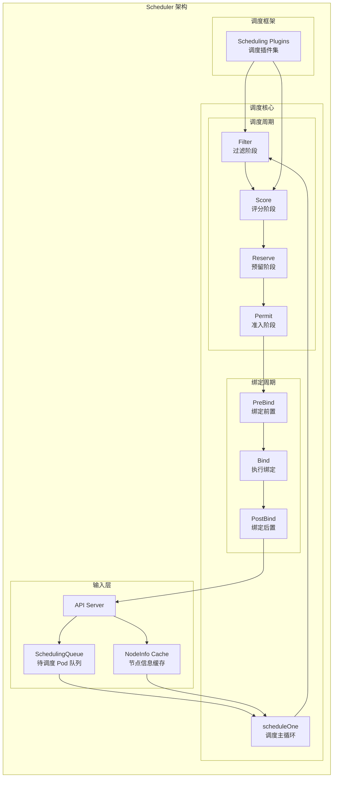
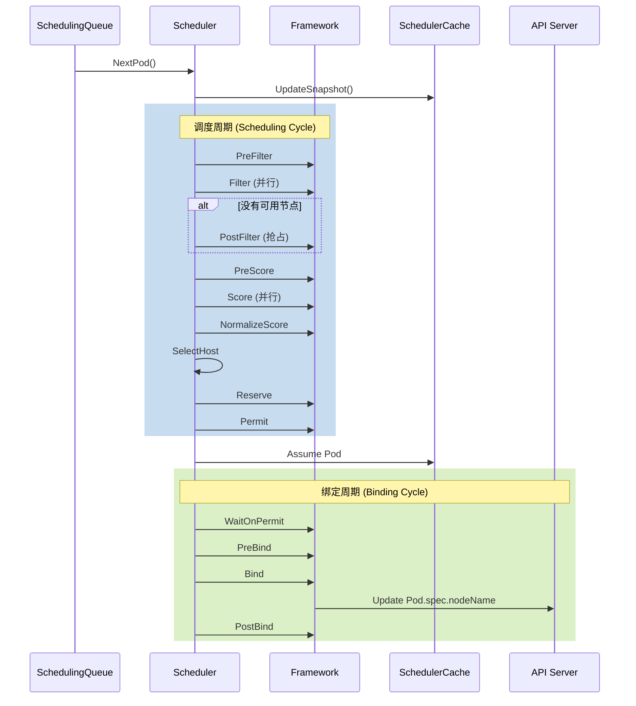

## 概述

Kubernetes Scheduler 负责将未调度的 Pod 分配到合适的节点上运行。调度器监听 API Server 中的未调度 Pod，根据一系列调度策略为每个 Pod 选择最优节点，然后更新 Pod 的 nodeName 字段完成绑定。

## 调度器职责

调度器的核心职责包括：

1. **资源匹配**：确保节点有足够的资源运行 Pod
2. **约束满足**：满足 Pod 的亲和性、反亲和性、污点容忍等约束
3. **负载均衡**：尽量在节点间平衡资源使用
4. **策略实施**：执行组织定义的调度策略

## 架构组成

### 整体架构



### 核心组件

| 组件 | 职责 |
|------|------|
| SchedulingQueue | 管理待调度 Pod 的优先级队列 |
| SchedulerCache | 缓存节点和 Pod 信息，支持快速决策 |
| Framework | 调度框架，管理插件生命周期 |
| Plugins | 实现具体调度逻辑的插件 |

## 源码结构

调度器的主要代码位于 `pkg/scheduler/` 目录：

```
pkg/scheduler/
├── scheduler.go              # 调度器主结构
├── schedule_one.go           # 单 Pod 调度逻辑
├── framework/
│   ├── interface.go          # Framework 接口定义
│   ├── runtime/
│   │   └── framework.go      # Framework 运行时实现
│   └── plugins/              # 内置插件
│       ├── noderesources/
│       ├── nodeaffinity/
│       ├── podtopologyspread/
│       └── ...
├── internal/
│   ├── queue/
│   │   └── scheduling_queue.go  # 调度队列
│   └── cache/
│       └── cache.go             # 调度缓存
└── apis/
    └── config/                  # 调度配置 API
```

## Scheduler 结构

### 主结构定义

调度器核心结构定义在 `pkg/scheduler/scheduler.go`：

```go
// Scheduler 是 kube-scheduler 的核心调度器
type Scheduler struct {
    // 调度缓存
    Cache internalcache.Cache

    // 用于删除假设的 Pod
    Extenders []framework.Extender

    // 获取下一个待调度 Pod
    NextPod func() *framework.QueuedPodInfo

    // 调度错误处理
    FailureHandler FailureHandlerFn

    // 调度队列
    SchedulingQueue internalqueue.SchedulingQueue

    // 调度 Profile（支持多配置）
    Profiles profile.Map

    // 客户端
    client clientset.Interface

    // 节点信息快照
    nodeInfoSnapshot *internalcache.Snapshot

    // 百分比节点评分
    percentageOfNodesToScore int32

    // 并行调度器数量
    parallelizer parallelize.Parallelizer
}
```

### Profile 配置

Scheduler Profile 允许配置多个调度配置：

```go
// KubeSchedulerProfile 定义一个调度配置
type KubeSchedulerProfile struct {
    // 调度器名称
    SchedulerName string

    // 百分比节点评分
    PercentageOfNodesToScore *int32

    // 插件配置
    Plugins *Plugins

    // 插件参数配置
    PluginConfig []PluginConfig
}

// Plugins 定义各扩展点启用的插件
type Plugins struct {
    // 队列排序插件
    QueueSort PluginSet

    // 预过滤插件
    PreFilter PluginSet

    // 过滤插件
    Filter PluginSet

    // 后过滤插件（抢占）
    PostFilter PluginSet

    // 预评分插件
    PreScore PluginSet

    // 评分插件
    Score PluginSet

    // 预留插件
    Reserve PluginSet

    // 准入插件
    Permit PluginSet

    // 绑定前置插件
    PreBind PluginSet

    // 绑定插件
    Bind PluginSet

    // 绑定后置插件
    PostBind PluginSet
}
```

## 启动流程

### 入口函数

调度器启动入口在 `cmd/kube-scheduler/app/server.go`：

```go
// Run 运行调度器
func Run(ctx context.Context, cc *schedulerserverconfig.CompletedConfig,
    sched *scheduler.Scheduler) error {

    // 设置健康检查
    var checks []healthz.HealthChecker
    if cc.ComponentConfig.LeaderElection.LeaderElect {
        checks = append(checks, cc.LeaderElection.WatchDog)
    }

    // 启动事件广播
    cc.EventBroadcaster.StartRecordingToSink(ctx.Done())

    // 设置 Informers
    cc.InformerFactory.Start(ctx.Done())
    cc.DynInformerFactory.Start(ctx.Done())

    // 等待缓存同步
    cc.InformerFactory.WaitForCacheSync(ctx.Done())
    cc.DynInformerFactory.WaitForCacheSync(ctx.Done())

    // 启动调度器
    sched.Run(ctx)

    return nil
}
```

### 调度器初始化

```go
// New 创建调度器实例
func New(client clientset.Interface,
    informerFactory informers.SharedInformerFactory,
    dynInformerFactory dynamicinformer.DynamicSharedInformerFactory,
    recorderFactory profile.RecorderFactory,
    opts ...Option) (*Scheduler, error) {

    options := defaultSchedulerOptions
    for _, opt := range opts {
        opt(&options)
    }

    // 创建调度缓存
    schedulerCache := internalcache.New(durationToExpireAssumedPod)

    // 创建调度队列
    podQueue := internalqueue.NewSchedulingQueue(
        lessFn,
        informerFactory,
        internalqueue.WithPodInitialBackoffDuration(
            options.podInitialBackoffSeconds),
        internalqueue.WithPodMaxBackoffDuration(
            options.podMaxBackoffSeconds),
        internalqueue.WithPodMaxInUnschedulablePodsDuration(
            options.podMaxInUnschedulablePodsDuration),
    )

    // 创建 Framework
    profiles, err := profile.NewMap(options.profiles, registry,
        recorderFactory, frameworkruntime.WithPodNominator(podQueue),
        ...)

    // 设置事件处理器
    addAllEventHandlers(sched, informerFactory, dynInformerFactory, unionedGVKs)

    return &Scheduler{
        Cache:             schedulerCache,
        client:            client,
        SchedulingQueue:   podQueue,
        Profiles:          profiles,
        nodeInfoSnapshot:  internalcache.NewEmptySnapshot(),
        percentageOfNodesToScore: options.percentageOfNodesToScore,
        parallelizer:      options.parallelizer,
    }, nil
}
```

### 事件处理器设置

```go
// addAllEventHandlers 添加所有资源的事件处理器
func addAllEventHandlers(
    sched *Scheduler,
    informerFactory informers.SharedInformerFactory,
    dynInformerFactory dynamicinformer.DynamicSharedInformerFactory,
    gvkMap map[framework.GVK]framework.ActionType,
) error {

    // Pod 事件处理
    informerFactory.Core().V1().Pods().Informer().AddEventHandler(
        cache.FilteringResourceEventHandler{
            FilterFunc: func(obj interface{}) bool {
                switch t := obj.(type) {
                case *v1.Pod:
                    return assignedPod(t)
                default:
                    return false
                }
            },
            Handler: cache.ResourceEventHandlerFuncs{
                AddFunc:    sched.addPodToCache,
                UpdateFunc: sched.updatePodInCache,
                DeleteFunc: sched.deletePodFromCache,
            },
        },
    )

    // 未调度 Pod 处理
    informerFactory.Core().V1().Pods().Informer().AddEventHandler(
        cache.FilteringResourceEventHandler{
            FilterFunc: func(obj interface{}) bool {
                switch t := obj.(type) {
                case *v1.Pod:
                    return !assignedPod(t) && responsibleForPod(t, sched.Profiles)
                default:
                    return false
                }
            },
            Handler: cache.ResourceEventHandlerFuncs{
                AddFunc:    sched.addPodToSchedulingQueue,
                UpdateFunc: sched.updatePodInSchedulingQueue,
                DeleteFunc: sched.deletePodFromSchedulingQueue,
            },
        },
    )

    // Node 事件处理
    informerFactory.Core().V1().Nodes().Informer().AddEventHandler(
        cache.ResourceEventHandlerFuncs{
            AddFunc:    sched.addNodeToCache,
            UpdateFunc: sched.updateNodeInCache,
            DeleteFunc: sched.deleteNodeFromCache,
        },
    )

    // 其他资源...
    return nil
}
```

## 调度主循环

### scheduleOne 函数

每次调度一个 Pod 的主循环：

```go
// scheduleOne 调度单个 Pod
func (sched *Scheduler) scheduleOne(ctx context.Context) {
    // 1. 获取下一个待调度 Pod
    podInfo := sched.NextPod()
    if podInfo == nil || podInfo.Pod == nil {
        return
    }
    pod := podInfo.Pod

    // 2. 获取对应的 Framework
    fwk, err := sched.frameworkForPod(pod)
    if err != nil {
        klog.ErrorS(err, "Error getting framework for pod", "pod", klog.KObj(pod))
        return
    }

    // 3. 检查 Pod 是否可以跳过调度
    if sched.skipPodSchedule(fwk, pod) {
        return
    }

    // 4. 执行调度周期
    scheduleResult, err := sched.schedulingCycle(ctx, state, fwk, podInfo, start, podsToActivate)
    if err != nil {
        // 调度失败处理
        sched.handleSchedulingFailure(ctx, fwk, podInfo, err, ...)
        return
    }

    // 5. 假设 Pod 已调度（乐观假设）
    assumedPodInfo := podInfo.DeepCopy()
    assumedPod := assumedPodInfo.Pod
    err = sched.assume(assumedPod, scheduleResult.SuggestedHost)
    if err != nil {
        sched.handleSchedulingFailure(ctx, fwk, podInfo, err, ...)
        return
    }

    // 6. 异步执行绑定周期
    go func() {
        err := sched.bindingCycle(ctx, state, fwk, scheduleResult,
            assumedPodInfo, start, podsToActivate)
        if err != nil {
            sched.handleSchedulingFailure(ctx, fwk, assumedPodInfo, err, ...)
        }
    }()
}
```

### 调度周期



## 调度缓存

### 缓存结构

```go
// cacheImpl 是调度缓存实现
type cacheImpl struct {
    // 读写锁
    mu sync.RWMutex

    // 假设的 Pod
    assumedPods sets.String

    // Pod 状态
    podStates map[string]*podState

    // 节点信息
    nodes map[string]*nodeInfoListItem

    // 节点信息链表头
    headNode *nodeInfoListItem

    // 镜像状态
    imageStates map[string]*imageState
}

// NodeInfo 包含节点调度相关信息
type NodeInfo struct {
    // 节点对象
    node *v1.Node

    // 该节点上的 Pod
    Pods []*PodInfo

    // 资源使用汇总
    Requested *Resource
    NonZeroRequested *Resource
    Allocatable *Resource

    // 端口使用
    UsedPorts HostPortInfo

    // 镜像大小
    ImageStates map[string]*ImageStateSummary

    // PVC 信息
    PVCRefCounts map[string]int

    // 污点
    Taints []v1.Taint

    // 代次（用于检测变化）
    Generation int64
}
```

### 快照更新

```go
// UpdateSnapshot 更新节点信息快照
func (cache *cacheImpl) UpdateSnapshot(nodeSnapshot *Snapshot) error {
    cache.mu.Lock()
    defer cache.mu.Unlock()

    // 检查是否需要完全重建
    if len(nodeSnapshot.nodeInfoMap) > len(cache.nodes) {
        nodeSnapshot.nodeInfoMap = make(map[string]*framework.NodeInfo,
            len(cache.nodes))
    }

    // 遍历缓存中的节点
    for node := cache.headNode; node != nil; node = node.next {
        // 检查代次，只更新变化的节点
        if existing, ok := nodeSnapshot.nodeInfoMap[node.info.Node().Name]; ok {
            if existing.Generation == node.info.Generation {
                continue
            }
        }

        // 克隆节点信息
        nodeSnapshot.nodeInfoMap[node.info.Node().Name] = node.info.Clone()
    }

    // 构建节点列表
    nodeSnapshot.nodeInfoList = make([]*framework.NodeInfo, 0, len(nodeSnapshot.nodeInfoMap))
    for _, v := range nodeSnapshot.nodeInfoMap {
        nodeSnapshot.nodeInfoList = append(nodeSnapshot.nodeInfoList, v)
    }

    return nil
}
```

## 控制器列表

Kubernetes 调度器内置了 20+ 个调度插件，按扩展点分类：

| 扩展点 | 插件 |
|--------|------|
| QueueSort | PrioritySort |
| PreFilter | NodeResourcesFit, PodTopologySpread, InterPodAffinity, VolumeBinding |
| Filter | NodeUnschedulable, NodeName, TaintToleration, NodeAffinity, NodeResourcesFit, VolumeRestrictions, NodePorts, NodeVolumeLimits, PodTopologySpread, InterPodAffinity |
| PostFilter | DefaultPreemption |
| PreScore | InterPodAffinity, PodTopologySpread, TaintToleration |
| Score | NodeResourcesBalancedAllocation, ImageLocality, InterPodAffinity, NodeResourcesFit, NodeAffinity, PodTopologySpread, TaintToleration |
| Reserve | VolumeBinding |
| Permit | - |
| PreBind | VolumeBinding |
| Bind | DefaultBinder |
| PostBind | - |

## 配置示例

### 默认配置

```yaml
apiVersion: kubescheduler.config.k8s.io/v1
kind: KubeSchedulerConfiguration
leaderElection:
  leaderElect: true
clientConnection:
  kubeconfig: /etc/kubernetes/scheduler.conf
profiles:
- schedulerName: default-scheduler
  plugins:
    score:
      enabled:
      - name: NodeResourcesBalancedAllocation
        weight: 1
      - name: NodeResourcesFit
        weight: 1
      - name: InterPodAffinity
        weight: 1
      disabled:
      - name: NodeResourcesLeastAllocated
  pluginConfig:
  - name: NodeResourcesFit
    args:
      scoringStrategy:
        type: LeastAllocated
```

### 多调度器配置

```yaml
apiVersion: kubescheduler.config.k8s.io/v1
kind: KubeSchedulerConfiguration
profiles:
- schedulerName: default-scheduler
  plugins:
    # 默认配置
- schedulerName: high-priority-scheduler
  plugins:
    queueSort:
      enabled:
      - name: PrioritySort
    score:
      enabled:
      - name: NodeResourcesFit
        weight: 2
      - name: NodeResourcesBalancedAllocation
        weight: 1
```

## 性能优化

### percentageOfNodesToScore

控制评分阶段评估的节点比例：

```go
// 计算需要评分的节点数量
func (sched *Scheduler) numFeasibleNodesToFind(numAllNodes int32) int32 {
    // 至少评估 minFeasibleNodesToFind 个节点
    if numAllNodes < minFeasibleNodesToFind ||
        sched.percentageOfNodesToScore >= 100 {
        return numAllNodes
    }

    // 计算百分比
    numNodes := numAllNodes * sched.percentageOfNodesToScore / 100
    if numNodes < minFeasibleNodesToFind {
        return minFeasibleNodesToFind
    }

    return numNodes
}
```

### 并行过滤

```go
// findNodesThatFitPod 并行执行过滤
func (sched *Scheduler) findNodesThatFitPod(ctx context.Context,
    fwk framework.Framework, state *framework.CycleState,
    pod *v1.Pod) ([]*v1.Node, framework.Diagnosis, error) {

    // 并行检查节点
    feasibleNodes, err := sched.findNodesThatPassFilters(
        ctx, fwk, state, pod, allNodes)

    // ...
}

func (sched *Scheduler) findNodesThatPassFilters(ctx context.Context,
    fwk framework.Framework, state *framework.CycleState,
    pod *v1.Pod, nodes []*framework.NodeInfo) ([]*v1.Node, error) {

    // 使用并行器
    sched.parallelizer.Until(ctx, len(nodes), func(i int) {
        nodeInfo := nodes[i]
        status := fwk.RunFilterPlugins(ctx, state, pod, nodeInfo)
        if status.IsSuccess() {
            // 收集可行节点
            feasibleNodesLen := atomic.AddInt32(&feasibleNodesLen, 1)
            // ...
        }
    })

    // ...
}
```

## 总结

Kubernetes Scheduler 的核心特点：

1. **插件化架构**：通过 Framework 支持灵活的调度策略定制
2. **多阶段调度**：Filter-Score-Reserve-Permit-Bind 流水线
3. **乐观并发**：假设调度成功，异步绑定提高吞吐
4. **高效缓存**：快照机制减少锁竞争，增量更新提高性能
5. **抢占机制**：PostFilter 阶段支持高优先级 Pod 抢占

理解调度器架构是进行调度策略定制和性能优化的基础。
