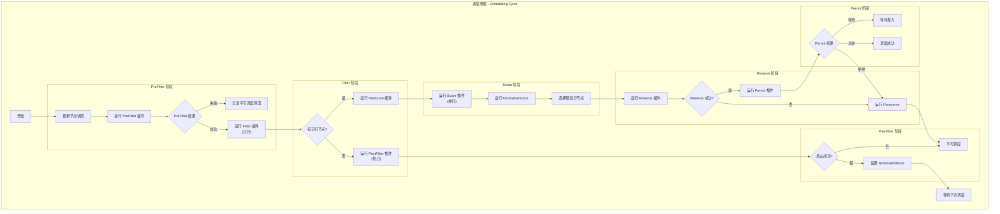
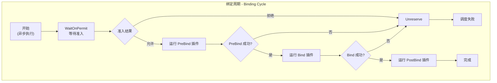

## 概述

Kubernetes 调度器的调度过程分为两个主要阶段：调度周期（Scheduling Cycle）和绑定周期（Binding Cycle）。调度周期负责为 Pod 选择合适的节点，绑定周期负责将 Pod 绑定到选定的节点。本文详细解析这两个阶段的工作流程。

## 调度主循环

### scheduleOne 函数

调度器的核心是 `scheduleOne` 函数，它负责调度单个 Pod：

```go
// pkg/scheduler/schedule_one.go

// scheduleOne 执行单个 Pod 的调度
func (sched *Scheduler) scheduleOne(ctx context.Context) {
    // 1. 从队列获取下一个 Pod
    podInfo := sched.NextPod()
    if podInfo == nil || podInfo.Pod == nil {
        return
    }
    pod := podInfo.Pod

    // 2. 获取适用的调度 Framework
    fwk, err := sched.frameworkForPod(pod)
    if err != nil {
        klog.ErrorS(err, "Error getting framework", "pod", klog.KObj(pod))
        return
    }

    // 3. 检查是否应该跳过调度
    if sched.skipPodSchedule(fwk, pod) {
        return
    }

    klog.V(3).InfoS("Attempting to schedule pod", "pod", klog.KObj(pod))

    // 4. 记录开始时间
    start := time.Now()

    // 5. 更新节点快照
    if err := sched.nodeInfoSnapshot.UpdateSnapshot(sched.Cache); err != nil {
        klog.ErrorS(err, "Error updating snapshot")
        return
    }

    // 6. 创建 CycleState
    state := framework.NewCycleState()
    state.SetRecordPluginMetrics(fwk.ProfileName() != "")

    // 7. 执行调度周期
    scheduleResult, err := sched.schedulingCycle(ctx, state, fwk, podInfo, start, podsToActivate)
    if err != nil {
        // 调度失败，处理错误
        sched.handleSchedulingFailure(ctx, fwk, podInfo, err, ...)
        return
    }

    // 8. 假设 Pod 已调度
    assumedPodInfo := podInfo.DeepCopy()
    err = sched.assume(assumedPodInfo.Pod, scheduleResult.SuggestedHost)
    if err != nil {
        sched.handleSchedulingFailure(ctx, fwk, podInfo, err, ...)
        return
    }

    // 9. 异步执行绑定周期
    go func() {
        err := sched.bindingCycle(ctx, state, fwk, scheduleResult,
            assumedPodInfo, start, podsToActivate)
        if err != nil {
            sched.handleSchedulingFailure(ctx, fwk, assumedPodInfo, err, ...)
        }
    }()
}
```

## 调度周期详解

### 调度周期流程



### schedulingCycle 函数

```go
// schedulingCycle 执行调度周期
func (sched *Scheduler) schedulingCycle(
    ctx context.Context,
    state *framework.CycleState,
    fwk framework.Framework,
    podInfo *framework.QueuedPodInfo,
    start time.Time,
    podsToActivate *framework.PodsToActivate,
) (ScheduleResult, error) {

    pod := podInfo.Pod

    // 1. 运行 PreFilter 插件
    preFilterStatus := fwk.RunPreFilterPlugins(ctx, state, pod)
    if !preFilterStatus.IsSuccess() {
        return ScheduleResult{}, preFilterStatus.AsError()
    }

    // 2. 运行 Filter 插件，找到可行节点
    feasibleNodes, diagnosis, err := sched.findNodesThatFitPod(ctx, fwk, state, pod)
    if err != nil {
        return ScheduleResult{}, err
    }

    // 3. 如果没有可行节点，尝试抢占
    if len(feasibleNodes) == 0 {
        // 运行 PostFilter（抢占）
        result, status := fwk.RunPostFilterPlugins(ctx, state, pod, diagnosis.NodeToStatusMap)
        if status.Code() == framework.Error {
            return ScheduleResult{}, status.AsError()
        }

        if result != nil && result.NominatedNodeName != "" {
            // 抢占成功，但需要等待 victim 被删除
            return ScheduleResult{NominatedNode: result.NominatedNodeName}, nil
        }

        return ScheduleResult{}, &framework.FitError{
            Pod:       pod,
            Diagnosis: diagnosis,
        }
    }

    // 4. 如果只有一个可行节点，跳过评分
    if len(feasibleNodes) == 1 {
        return ScheduleResult{
            SuggestedHost:  feasibleNodes[0].Name,
            EvaluatedNodes: 1,
            FeasibleNodes:  1,
        }, nil
    }

    // 5. 运行 Score 插件
    priorityList, err := sched.prioritizeNodes(ctx, fwk, state, pod, feasibleNodes)
    if err != nil {
        return ScheduleResult{}, err
    }

    // 6. 选择得分最高的节点
    host, err := sched.selectHost(priorityList)
    if err != nil {
        return ScheduleResult{}, err
    }

    return ScheduleResult{
        SuggestedHost:  host,
        EvaluatedNodes: len(feasibleNodes),
        FeasibleNodes:  len(feasibleNodes),
    }, nil
}
```

### PreFilter 阶段

PreFilter 在过滤之前运行，用于预处理 Pod 信息：

```go
// RunPreFilterPlugins 运行所有 PreFilter 插件
func (f *frameworkImpl) RunPreFilterPlugins(ctx context.Context,
    state *framework.CycleState, pod *v1.Pod) *framework.Status {

    for _, pl := range f.preFilterPlugins {
        status := f.runPreFilterPlugin(ctx, pl, state, pod)
        if !status.IsSuccess() {
            // 返回第一个失败状态
            if status.IsUnschedulable() {
                return status
            }
            return framework.AsStatus(fmt.Errorf(
                "running PreFilter plugin %q: %w", pl.Name(), status.AsError()))
        }
    }

    return nil
}

// PreFilter 插件示例：NodeResourcesFit
func (f *Fit) PreFilter(ctx context.Context, cycleState *framework.CycleState,
    pod *v1.Pod) (*framework.PreFilterResult, *framework.Status) {

    // 计算 Pod 请求的资源
    requests := computePodResourceRequest(pod)

    // 保存到 CycleState 供后续使用
    cycleState.Write(preFilterStateKey, &preFilterState{
        requests: requests,
    })

    return nil, nil
}
```

### Filter 阶段

Filter 阶段并行检查每个节点是否满足 Pod 的约束：

```go
// findNodesThatPassFilters 执行过滤
func (sched *Scheduler) findNodesThatPassFilters(
    ctx context.Context,
    fwk framework.Framework,
    state *framework.CycleState,
    pod *v1.Pod,
    nodes []*framework.NodeInfo,
) ([]*v1.Node, error) {

    numNodesToFind := sched.numFeasibleNodesToFind(int32(len(nodes)))

    // 并行过滤
    feasibleNodes := make([]*v1.Node, numNodesToFind)
    var feasibleNodesLen int32

    // 使用 parallelizer 并行执行
    checkNode := func(i int) {
        nodeInfo := nodes[(sched.nextStartNodeIndex + i) % len(nodes)]

        // 运行 Filter 插件
        status := fwk.RunFilterPlugins(ctx, state, pod, nodeInfo)
        if status.Code() == framework.Error {
            errCh.SendError(status.AsError())
            return
        }

        if status.IsSuccess() {
            // 节点通过过滤
            length := atomic.AddInt32(&feasibleNodesLen, 1)
            if length > numNodesToFind {
                // 已找到足够节点
                return
            }
            feasibleNodes[length-1] = nodeInfo.Node()
        }
    }

    // 并行执行过滤
    sched.parallelizer.Until(ctx, len(nodes), checkNode)

    // 更新起始索引（轮询）
    sched.nextStartNodeIndex = (sched.nextStartNodeIndex + len(nodes)) % len(nodes)

    return feasibleNodes[:feasibleNodesLen], nil
}

// RunFilterPlugins 运行所有 Filter 插件
func (f *frameworkImpl) RunFilterPlugins(ctx context.Context,
    state *framework.CycleState, pod *v1.Pod,
    nodeInfo *framework.NodeInfo) *framework.Status {

    for _, pl := range f.filterPlugins {
        status := f.runFilterPlugin(ctx, pl, state, pod, nodeInfo)
        if !status.IsSuccess() {
            // 短路返回：只要一个插件拒绝就立即返回
            return status
        }
    }

    return nil
}
```

### Score 阶段

Score 阶段为可行节点打分：

```go
// prioritizeNodes 对可行节点评分
func (sched *Scheduler) prioritizeNodes(
    ctx context.Context,
    fwk framework.Framework,
    state *framework.CycleState,
    pod *v1.Pod,
    nodes []*v1.Node,
) (framework.NodeScoreList, error) {

    // 1. 运行 PreScore 插件
    preScoreStatus := fwk.RunPreScorePlugins(ctx, state, pod, nodes)
    if !preScoreStatus.IsSuccess() {
        return nil, preScoreStatus.AsError()
    }

    // 2. 运行 Score 插件
    scoresMap, scoreStatus := fwk.RunScorePlugins(ctx, state, pod, nodes)
    if !scoreStatus.IsSuccess() {
        return nil, scoreStatus.AsError()
    }

    // 3. 合并分数
    result := make(framework.NodeScoreList, len(nodes))
    for i := range nodes {
        result[i] = framework.NodeScore{Name: nodes[i].Name, Score: 0}
        for j := range scoresMap {
            result[i].Score += scoresMap[j][i].Score
        }
    }

    return result, nil
}

// RunScorePlugins 运行所有 Score 插件
func (f *frameworkImpl) RunScorePlugins(ctx context.Context,
    state *framework.CycleState, pod *v1.Pod,
    nodes []*v1.Node) ([]framework.NodeScoreList, *framework.Status) {

    pluginToNodeScores := make([]framework.NodeScoreList, len(f.scorePlugins))

    // 并行评分
    f.parallelizer.Until(ctx, len(nodes), func(index int) {
        for i, pl := range f.scorePlugins {
            score, status := f.runScorePlugin(ctx, pl, state, pod, nodes[index].Name)
            if !status.IsSuccess() {
                errCh.SendError(status.AsError())
                return
            }
            pluginToNodeScores[i][index] = framework.NodeScore{
                Name:  nodes[index].Name,
                Score: score,
            }
        }
    })

    // 归一化并应用权重
    for i, pl := range f.scorePlugins {
        // NormalizeScore
        if pl.ScoreExtensions() != nil {
            status := f.runScoreExtension(ctx, pl, state, pod, pluginToNodeScores[i])
            if !status.IsSuccess() {
                return nil, status
            }
        }

        // 应用权重
        weight := f.scorePluginWeight[pl.Name()]
        for j := range pluginToNodeScores[i] {
            pluginToNodeScores[i][j].Score *= int64(weight)
        }
    }

    return pluginToNodeScores, nil
}
```

### 节点选择

```go
// selectHost 从得分最高的节点中选择一个
func (sched *Scheduler) selectHost(nodeScoreList framework.NodeScoreList) (string, error) {
    if len(nodeScoreList) == 0 {
        return "", fmt.Errorf("empty node score list")
    }

    // 找到最高分
    maxScore := nodeScoreList[0].Score
    selected := nodeScoreList[0].Name
    cntOfMaxScore := 1

    for _, ns := range nodeScoreList[1:] {
        if ns.Score > maxScore {
            maxScore = ns.Score
            selected = ns.Name
            cntOfMaxScore = 1
        } else if ns.Score == maxScore {
            // 相同得分，随机选择
            cntOfMaxScore++
            if rand.Intn(cntOfMaxScore) == 0 {
                selected = ns.Name
            }
        }
    }

    return selected, nil
}
```

### Reserve 阶段

Reserve 阶段预留节点资源：

```go
// RunReservePluginsReserve 运行 Reserve 插件的 Reserve 方法
func (f *frameworkImpl) RunReservePluginsReserve(ctx context.Context,
    state *framework.CycleState, pod *v1.Pod, nodeName string) *framework.Status {

    for _, pl := range f.reservePlugins {
        status := f.runReservePluginReserve(ctx, pl, state, pod, nodeName)
        if !status.IsSuccess() {
            // 预留失败，回滚已预留的
            f.RunReservePluginsUnreserve(ctx, state, pod, nodeName)
            return status
        }
    }

    return nil
}

// RunReservePluginsUnreserve 运行 Unreserve 回滚
func (f *frameworkImpl) RunReservePluginsUnreserve(ctx context.Context,
    state *framework.CycleState, pod *v1.Pod, nodeName string) {

    for _, pl := range f.reservePlugins {
        // 逆序执行 Unreserve
        f.runReservePluginUnreserve(ctx, pl, state, pod, nodeName)
    }
}
```

### Permit 阶段

Permit 阶段实现准入控制：

```go
// RunPermitPlugins 运行 Permit 插件
func (f *frameworkImpl) RunPermitPlugins(ctx context.Context,
    state *framework.CycleState, pod *v1.Pod, nodeName string) *framework.Status {

    pluginsWaitTime := make(map[string]time.Duration)

    for _, pl := range f.permitPlugins {
        status, timeout := f.runPermitPlugin(ctx, pl, state, pod, nodeName)

        if status.Code() == framework.Wait {
            // 需要等待
            pluginsWaitTime[pl.Name()] = timeout
        } else if !status.IsSuccess() {
            // 拒绝
            return status
        }
    }

    if len(pluginsWaitTime) > 0 {
        // 返回等待状态
        return framework.NewStatus(framework.Wait)
    }

    return nil
}

// WaitOnPermit 等待 Permit 完成
func (f *frameworkImpl) WaitOnPermit(ctx context.Context, pod *v1.Pod) *framework.Status {
    waitingPod := f.waitingPods.get(pod.UID)
    if waitingPod == nil {
        return nil
    }

    defer f.waitingPods.remove(pod.UID)

    // 等待所有 Permit 插件的决定
    select {
    case s := <-waitingPod.signal:
        return s
    case <-ctx.Done():
        return framework.AsStatus(ctx.Err())
    }
}
```

## 绑定周期详解

### 绑定周期流程



### bindingCycle 函数

```go
// bindingCycle 执行绑定周期
func (sched *Scheduler) bindingCycle(
    ctx context.Context,
    state *framework.CycleState,
    fwk framework.Framework,
    scheduleResult ScheduleResult,
    assumedPodInfo *framework.QueuedPodInfo,
    start time.Time,
    podsToActivate *framework.PodsToActivate) error {

    assumedPod := assumedPodInfo.Pod

    // 1. 等待 Permit 完成
    waitOnPermitStatus := fwk.WaitOnPermit(ctx, assumedPod)
    if !waitOnPermitStatus.IsSuccess() {
        // 准入被拒绝
        fwk.RunReservePluginsUnreserve(ctx, state, assumedPod,
            scheduleResult.SuggestedHost)
        return waitOnPermitStatus.AsError()
    }

    // 2. 运行 PreBind 插件
    preBindStatus := fwk.RunPreBindPlugins(ctx, state, assumedPod,
        scheduleResult.SuggestedHost)
    if !preBindStatus.IsSuccess() {
        fwk.RunReservePluginsUnreserve(ctx, state, assumedPod,
            scheduleResult.SuggestedHost)
        return preBindStatus.AsError()
    }

    // 3. 运行 Bind 插件
    bindStatus := fwk.RunBindPlugins(ctx, state, assumedPod,
        scheduleResult.SuggestedHost)
    if !bindStatus.IsSuccess() {
        fwk.RunReservePluginsUnreserve(ctx, state, assumedPod,
            scheduleResult.SuggestedHost)
        return bindStatus.AsError()
    }

    // 4. 绑定成功，从假设缓存中确认
    if err := sched.Cache.FinishBinding(assumedPod); err != nil {
        return err
    }

    // 5. 运行 PostBind 插件
    fwk.RunPostBindPlugins(ctx, state, assumedPod, scheduleResult.SuggestedHost)

    return nil
}
```

### Bind 实现

```go
// DefaultBinder 是默认的绑定插件
type DefaultBinder struct {
    client kubernetes.Interface
}

// Bind 执行绑定操作
func (b DefaultBinder) Bind(ctx context.Context, state *framework.CycleState,
    p *v1.Pod, nodeName string) *framework.Status {

    // 创建 Binding 对象
    binding := &v1.Binding{
        ObjectMeta: metav1.ObjectMeta{
            Namespace: p.Namespace,
            Name:      p.Name,
            UID:       p.UID,
        },
        Target: v1.ObjectReference{
            Kind: "Node",
            Name: nodeName,
        },
    }

    // 调用 API 执行绑定
    err := b.client.CoreV1().Pods(binding.Namespace).Bind(ctx, binding,
        metav1.CreateOptions{})
    if err != nil {
        return framework.AsStatus(err)
    }

    return nil
}
```

## 假设机制

### Assume 操作

```go
// assume 假设 Pod 已调度到节点
func (sched *Scheduler) assume(assumedPod *v1.Pod, host string) error {
    // 设置节点名称
    assumedPod.Spec.NodeName = host

    // 在缓存中假设 Pod
    if err := sched.Cache.AssumePod(assumedPod); err != nil {
        return err
    }

    return nil
}

// AssumePod 在缓存中假设 Pod
func (cache *cacheImpl) AssumePod(pod *v1.Pod) error {
    key, err := framework.GetPodKey(pod)
    if err != nil {
        return err
    }

    cache.mu.Lock()
    defer cache.mu.Unlock()

    // 添加到假设集合
    cache.assumedPods.Insert(key)

    // 添加到节点信息
    cache.addPod(pod)

    return nil
}
```

### 假设确认/清理

```go
// FinishBinding 确认绑定成功
func (cache *cacheImpl) FinishBinding(pod *v1.Pod) error {
    // 绑定成功，从假设集合移除
    return cache.finishBinding(pod, time.Now())
}

// ForgetPod 绑定失败时清理假设
func (cache *cacheImpl) ForgetPod(pod *v1.Pod) error {
    key, err := framework.GetPodKey(pod)
    if err != nil {
        return err
    }

    cache.mu.Lock()
    defer cache.mu.Unlock()

    // 从假设集合移除
    cache.assumedPods.Delete(key)

    // 从节点信息移除
    cache.removePod(pod)

    return nil
}
```

## CycleState

### 状态共享

CycleState 用于在调度周期各阶段共享数据：

```go
// CycleState 提供状态存储
type CycleState struct {
    mx      sync.RWMutex
    storage map[StateKey]StateData
    // 是否记录插件指标
    recordPluginMetrics bool
}

// Write 写入状态
func (c *CycleState) Write(key StateKey, val StateData) {
    c.mx.Lock()
    defer c.mx.Unlock()
    c.storage[key] = val
}

// Read 读取状态
func (c *CycleState) Read(key StateKey) (StateData, error) {
    c.mx.RLock()
    defer c.mx.RUnlock()
    v, ok := c.storage[key]
    if !ok {
        return nil, ErrNotFound
    }
    return v, nil
}

// 使用示例
type myState struct {
    data string
}

func (s *myState) Clone() StateData {
    return &myState{data: s.data}
}

// PreFilter 中写入
func (p *MyPlugin) PreFilter(ctx context.Context, state *CycleState,
    pod *v1.Pod) *Status {
    state.Write("myKey", &myState{data: "computed data"})
    return nil
}

// Filter 中读取
func (p *MyPlugin) Filter(ctx context.Context, state *CycleState,
    pod *v1.Pod, nodeInfo *NodeInfo) *Status {
    s, err := state.Read("myKey")
    if err != nil {
        return AsStatus(err)
    }
    myData := s.(*myState)
    // 使用 myData.data
    return nil
}
```

## 调度失败处理

```go
// handleSchedulingFailure 处理调度失败
func (sched *Scheduler) handleSchedulingFailure(
    ctx context.Context,
    fwk framework.Framework,
    podInfo *framework.QueuedPodInfo,
    err error,
    reason string,
    nominatingInfo *framework.NominatingInfo) {

    pod := podInfo.Pod

    // 记录事件
    sched.recordSchedulingFailure(fwk, podInfo, err, reason, nominatingInfo)

    // 如果有假设的 Pod，清理它
    if assumedPod := sched.Cache.GetPod(pod); assumedPod != nil {
        sched.Cache.ForgetPod(assumedPod)
    }

    // 重新加入队列
    sched.SchedulingQueue.AddUnschedulableIfNotPresent(podInfo, sched.SchedulingQueue.SchedulingCycle())
}

// AddUnschedulableIfNotPresent 加入不可调度队列
func (p *PriorityQueue) AddUnschedulableIfNotPresent(pInfo *framework.QueuedPodInfo,
    podSchedulingCycle int64) error {

    p.lock.Lock()
    defer p.lock.Unlock()

    // 放入 unschedulablePods
    p.unschedulablePods.addOrUpdate(pInfo)

    return nil
}
```

## 性能优化

### 并行过滤

```go
// 使用 parallelizer 并行执行
type parallelizer struct {
    parallelism int
}

func (p parallelizer) Until(ctx context.Context, pieces int,
    doWorkPiece func(piece int)) {

    var wg sync.WaitGroup
    for i := 0; i < pieces; i++ {
        wg.Add(1)
        go func(i int) {
            defer wg.Done()
            doWorkPiece(i)
        }(i)
    }
    wg.Wait()
}
```

### 快速失败

```go
// 过滤阶段：任一插件失败立即返回
func (f *frameworkImpl) RunFilterPlugins(...) *framework.Status {
    for _, pl := range f.filterPlugins {
        status := f.runFilterPlugin(ctx, pl, state, pod, nodeInfo)
        if !status.IsSuccess() {
            // 短路返回
            return status
        }
    }
    return nil
}
```

### 百分比评分

```go
// 不是所有节点都需要评分
func (sched *Scheduler) numFeasibleNodesToFind(numAllNodes int32) int32 {
    if numAllNodes < minFeasibleNodesToFind ||
        sched.percentageOfNodesToScore >= 100 {
        return numAllNodes
    }

    // 按百分比计算
    numNodes := numAllNodes * sched.percentageOfNodesToScore / 100
    if numNodes < minFeasibleNodesToFind {
        return minFeasibleNodesToFind
    }
    return numNodes
}
```

## 总结

调度周期和绑定周期是 Kubernetes 调度器的核心流程：

1. **调度周期（同步）**
   - PreFilter：预处理，计算 Pod 需求
   - Filter：并行过滤不满足条件的节点
   - PostFilter：抢占处理（可选）
   - Score：并行评分
   - Reserve：预留资源
   - Permit：准入控制

2. **绑定周期（异步）**
   - WaitOnPermit：等待准入完成
   - PreBind：绑定前准备
   - Bind：执行绑定
   - PostBind：绑定后清理

3. **优化策略**
   - 并行执行过滤和评分
   - 假设机制提高吞吐
   - 百分比评分减少计算
   - 快速失败减少无效计算
