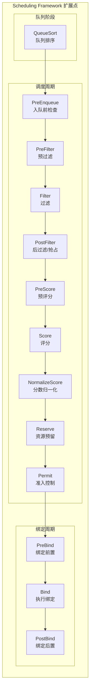

## 概述

Kubernetes 调度框架（Scheduling Framework）是一个插件化的调度架构，它定义了一系列扩展点（Extension Points），允许用户通过实现插件来定制调度行为。这种设计使调度器既保持了核心逻辑的简洁，又提供了强大的扩展能力。

## 框架架构

### 扩展点概览



### 扩展点详解

| 扩展点 | 阶段 | 执行时机 | 典型用途 |
|--------|------|----------|----------|
| QueueSort | 队列 | Pod 入队时 | 定义 Pod 优先级排序 |
| PreEnqueue | 队列 | 入队前 | 检查 Pod 是否可以入队 |
| PreFilter | 调度 | 过滤前 | 预计算，检查集群级别约束 |
| Filter | 调度 | 节点筛选 | 检查节点是否满足 Pod 需求 |
| PostFilter | 调度 | 过滤后无节点 | 抢占处理 |
| PreScore | 调度 | 评分前 | 为评分准备数据 |
| Score | 调度 | 节点评分 | 为节点打分 |
| NormalizeScore | 调度 | 评分后 | 分数归一化 |
| Reserve | 调度 | 选定节点后 | 预留节点资源 |
| Permit | 调度 | 预留后 | 审批调度决定 |
| PreBind | 绑定 | 绑定前 | 执行绑定前的准备工作 |
| Bind | 绑定 | 执行绑定 | 将 Pod 绑定到节点 |
| PostBind | 绑定 | 绑定后 | 执行绑定后的清理工作 |

## Framework 接口

### 核心接口定义

Framework 接口定义在 `pkg/scheduler/framework/interface.go`：

```go
// Framework 管理调度插件的生命周期
type Framework interface {
    Handle

    // 队列排序
    QueueSortFunc() LessFunc

    // 调度周期
    RunPreFilterPlugins(ctx context.Context, state *CycleState, pod *v1.Pod) (*PreFilterResult, *Status)
    RunFilterPlugins(ctx context.Context, state *CycleState, pod *v1.Pod, nodeInfo *NodeInfo) *Status
    RunPostFilterPlugins(ctx context.Context, state *CycleState, pod *v1.Pod, filteredNodeStatusMap NodeToStatusMap) (*PostFilterResult, *Status)
    RunPreScorePlugins(ctx context.Context, state *CycleState, pod *v1.Pod, nodes []*v1.Node) *Status
    RunScorePlugins(ctx context.Context, state *CycleState, pod *v1.Pod, nodes []*v1.Node) ([]NodeScoreList, *Status)
    RunReservePluginsReserve(ctx context.Context, state *CycleState, pod *v1.Pod, nodeName string) *Status
    RunReservePluginsUnreserve(ctx context.Context, state *CycleState, pod *v1.Pod, nodeName string)
    RunPermitPlugins(ctx context.Context, state *CycleState, pod *v1.Pod, nodeName string) *Status

    // 绑定周期
    WaitOnPermit(ctx context.Context, pod *v1.Pod) *Status
    RunPreBindPlugins(ctx context.Context, state *CycleState, pod *v1.Pod, nodeName string) *Status
    RunBindPlugins(ctx context.Context, state *CycleState, pod *v1.Pod, nodeName string) *Status
    RunPostBindPlugins(ctx context.Context, state *CycleState, pod *v1.Pod, nodeName string)

    // 是否有 Filter 插件
    HasFilterPlugins() bool
    HasPostFilterPlugins() bool
    HasScorePlugins() bool

    // 获取插件列表
    ListPlugins() *config.Plugins

    // 获取 Profile 名称
    ProfileName() string
}

// Handle 提供插件可用的功能
type Handle interface {
    // 共享 Informer
    SharedInformerFactory() informers.SharedInformerFactory

    // 快照
    SnapshotSharedLister() SharedLister

    // 等待/拒绝/允许 Pod
    IterateOverWaitingPods(callback func(WaitingPod))
    GetWaitingPod(uid types.UID) WaitingPod
    RejectWaitingPod(uid types.UID) bool
    RunPermitPlugins(ctx context.Context, state *CycleState, pod *v1.Pod, nodeName string) *Status

    // 客户端
    ClientSet() clientset.Interface

    // 事件记录
    EventRecorder() events.EventRecorder

    // 并行器
    Parallelizer() parallelize.Parallelizer
}
```

### 插件接口

```go
// Plugin 是所有插件的基础接口
type Plugin interface {
    Name() string
}

// PreFilterPlugin 接口
type PreFilterPlugin interface {
    Plugin
    PreFilter(ctx context.Context, state *CycleState, p *v1.Pod) (*PreFilterResult, *Status)
    PreFilterExtensions() PreFilterExtensions
}

// FilterPlugin 接口
type FilterPlugin interface {
    Plugin
    Filter(ctx context.Context, state *CycleState, pod *v1.Pod, nodeInfo *NodeInfo) *Status
}

// ScorePlugin 接口
type ScorePlugin interface {
    Plugin
    Score(ctx context.Context, state *CycleState, p *v1.Pod, nodeName string) (int64, *Status)
    ScoreExtensions() ScoreExtensions
}

// ScoreExtensions 用于分数归一化
type ScoreExtensions interface {
    NormalizeScore(ctx context.Context, state *CycleState, p *v1.Pod, scores NodeScoreList) *Status
}

// ReservePlugin 接口
type ReservePlugin interface {
    Plugin
    Reserve(ctx context.Context, state *CycleState, p *v1.Pod, nodeName string) *Status
    Unreserve(ctx context.Context, state *CycleState, p *v1.Pod, nodeName string)
}

// PermitPlugin 接口
type PermitPlugin interface {
    Plugin
    Permit(ctx context.Context, state *CycleState, p *v1.Pod, nodeName string) (*Status, time.Duration)
}

// BindPlugin 接口
type BindPlugin interface {
    Plugin
    Bind(ctx context.Context, state *CycleState, p *v1.Pod, nodeName string) *Status
}
```

## Framework 实现

### 运行时结构

```go
// pkg/scheduler/framework/runtime/framework.go

// frameworkImpl 是 Framework 的实现
type frameworkImpl struct {
    registry             Registry
    snapshotSharedLister SharedLister
    waitingPods          *waitingPodsMap
    scorePluginWeight    map[string]int
    queueSortPlugins     []QueueSortPlugin
    preFilterPlugins     []PreFilterPlugin
    filterPlugins        []FilterPlugin
    postFilterPlugins    []PostFilterPlugin
    preScorePlugins      []PreScorePlugin
    scorePlugins         []ScorePlugin
    reservePlugins       []ReservePlugin
    preBindPlugins       []PreBindPlugin
    bindPlugins          []BindPlugin
    postBindPlugins      []PostBindPlugin
    permitPlugins        []PermitPlugin

    clientSet       clientset.Interface
    kubeConfig      *restclient.Config
    eventRecorder   events.EventRecorder
    informerFactory informers.SharedInformerFactory

    metricsRecorder *metricsRecorder
    profileName     string

    parallelizer parallelize.Parallelizer

    // 抢占处理
    preemptHandle PreemptHandle
}
```

### 插件注册

```go
// Registry 存储插件工厂函数
type Registry map[string]PluginFactory

// PluginFactory 创建插件实例
type PluginFactory func(configuration runtime.Object, f Handle) (Plugin, error)

// NewInTreeRegistry 创建内置插件注册表
func NewInTreeRegistry() Registry {
    return Registry{
        // 队列排序
        queuesort.Name: queuesort.New,

        // 预过滤
        noderesources.Name:         noderesources.NewFit,
        nodeports.Name:             nodeports.New,
        podtopologyspread.Name:     podtopologyspread.New,
        interpodaffinity.Name:      interpodaffinity.New,
        volumebinding.Name:         volumebinding.New,
        volumerestrictions.Name:    volumerestrictions.New,
        nodeaffinity.Name:          nodeaffinity.New,
        nodevolumelimits.CSIName:   nodevolumelimits.NewCSI,

        // 过滤
        tainttoleration.Name:       tainttoleration.New,
        nodeunschedulable.Name:     nodeunschedulable.New,
        nodename.Name:              nodename.New,

        // 评分
        imagelocality.Name:         imagelocality.New,

        // 后过滤（抢占）
        defaultpreemption.Name:     defaultpreemption.New,

        // 绑定
        defaultbinder.Name:         defaultbinder.New,
    }
}
```

### 插件初始化

```go
// NewFramework 创建 Framework 实例
func NewFramework(r Registry, profile *config.KubeSchedulerProfile,
    opts ...Option) (framework.Framework, error) {

    options := defaultFrameworkOptions
    for _, opt := range opts {
        opt(&options)
    }

    f := &frameworkImpl{
        registry:             r,
        snapshotSharedLister: options.snapshotSharedLister,
        scorePluginWeight:    make(map[string]int),
        waitingPods:          newWaitingPodsMap(),
        clientSet:            options.clientSet,
        kubeConfig:           options.kubeConfig,
        eventRecorder:        options.eventRecorder,
        informerFactory:      options.informerFactory,
        metricsRecorder:      options.metricsRecorder,
        profileName:          profile.SchedulerName,
        parallelizer:         options.parallelizer,
    }

    // 初始化各扩展点的插件
    pluginsMap := make(map[string]framework.Plugin)

    for name, factory := range r {
        if pg := profile.Plugins; pg != nil {
            // 检查插件是否启用
            if !f.pluginEnabled(name, pg) {
                continue
            }
        }

        // 获取插件配置
        args := f.getPluginArg(name, profile.PluginConfig)

        // 创建插件实例
        p, err := factory(args, f)
        if err != nil {
            return nil, err
        }

        pluginsMap[name] = p
    }

    // 按扩展点分类插件
    for _, ep := range f.getExtensionPoints(profile.Plugins) {
        for _, name := range ep.enabled {
            if p, ok := pluginsMap[name]; ok {
                f.addPlugin(p, ep.slicePtr)
            }
        }
    }

    return f, nil
}
```

## 插件执行

### Filter 插件执行

```go
// RunFilterPlugins 执行所有 Filter 插件
func (f *frameworkImpl) RunFilterPlugins(ctx context.Context,
    state *framework.CycleState, pod *v1.Pod,
    nodeInfo *framework.NodeInfo) *framework.Status {

    for _, pl := range f.filterPlugins {
        status := f.runFilterPlugin(ctx, pl, state, pod, nodeInfo)
        if !status.IsSuccess() {
            // 记录失败原因
            if !status.IsUnschedulable() {
                status = framework.AsStatus(fmt.Errorf(
                    "running %q filter plugin: %w", pl.Name(), status.AsError()))
            }
            return status
        }
    }

    return nil
}

func (f *frameworkImpl) runFilterPlugin(ctx context.Context,
    pl framework.FilterPlugin, state *framework.CycleState,
    pod *v1.Pod, nodeInfo *framework.NodeInfo) *framework.Status {

    startTime := time.Now()
    status := pl.Filter(ctx, state, pod, nodeInfo)
    f.metricsRecorder.observePluginDurationAsync(Filter, pl.Name(),
        status, metrics.SinceInSeconds(startTime))

    return status
}
```

### Score 插件执行

```go
// RunScorePlugins 执行所有 Score 插件
func (f *frameworkImpl) RunScorePlugins(ctx context.Context,
    state *framework.CycleState, pod *v1.Pod,
    nodes []*v1.Node) ([]framework.NodeScoreList, *framework.Status) {

    pluginToNodeScores := make([]framework.NodeScoreList, len(f.scorePlugins))
    for i := range pluginToNodeScores {
        pluginToNodeScores[i] = make(framework.NodeScoreList, len(nodes))
    }

    // 并行对每个节点评分
    f.parallelizer.Until(ctx, len(nodes), func(index int) {
        nodeName := nodes[index].Name

        for i, pl := range f.scorePlugins {
            score, status := f.runScorePlugin(ctx, pl, state, pod, nodeName)
            if !status.IsSuccess() {
                errCh.SendErrorWithCancel(
                    fmt.Errorf("plugin %q failed with: %w", pl.Name(), status.AsError()),
                    cancel)
                return
            }

            pluginToNodeScores[i][index] = framework.NodeScore{
                Name:  nodeName,
                Score: score,
            }
        }
    })

    // 归一化分数
    for i, pl := range f.scorePlugins {
        if pl.ScoreExtensions() == nil {
            continue
        }

        status := f.runScoreExtension(ctx, pl, state, pod, pluginToNodeScores[i])
        if !status.IsSuccess() {
            return nil, status
        }
    }

    // 应用权重
    for i, pl := range f.scorePlugins {
        weight := f.scorePluginWeight[pl.Name()]
        for j := range pluginToNodeScores[i] {
            pluginToNodeScores[i][j].Score *= int64(weight)
        }
    }

    return pluginToNodeScores, nil
}
```

## Status 状态码

### 状态定义

```go
// Code 是插件返回的状态码
type Code int

const (
    // Success 表示插件成功运行
    Success Code = iota

    // Error 表示内部错误
    Error

    // Unschedulable 表示 Pod 不可调度
    Unschedulable

    // UnschedulableAndUnresolvable 表示不可调度且无法通过抢占解决
    UnschedulableAndUnresolvable

    // Wait 表示 Permit 插件需要等待
    Wait

    // Skip 表示跳过此插件
    Skip
)

// Status 封装插件返回状态
type Status struct {
    code    Code
    reasons []string
    err     error
    // 导致失败的插件名称
    failedPlugin string
}

// NewStatus 创建新状态
func NewStatus(code Code, reasons ...string) *Status {
    return &Status{
        code:    code,
        reasons: reasons,
    }
}

// IsSuccess 检查是否成功
func (s *Status) IsSuccess() bool {
    return s.code == Success
}

// IsUnschedulable 检查是否不可调度
func (s *Status) IsUnschedulable() bool {
    return s.code == Unschedulable || s.code == UnschedulableAndUnresolvable
}
```

## 插件配置

### 配置结构

```go
// Plugins 配置各扩展点启用的插件
type Plugins struct {
    QueueSort  PluginSet
    PreFilter  PluginSet
    Filter     PluginSet
    PostFilter PluginSet
    PreScore   PluginSet
    Score      PluginSet
    Reserve    PluginSet
    Permit     PluginSet
    PreBind    PluginSet
    Bind       PluginSet
    PostBind   PluginSet
}

// PluginSet 定义一组插件
type PluginSet struct {
    // 启用的插件
    Enabled []Plugin
    // 禁用的插件
    Disabled []Plugin
}

// Plugin 定义插件配置
type Plugin struct {
    Name   string
    Weight int32  // 仅用于 Score 插件
}

// PluginConfig 定义插件参数
type PluginConfig struct {
    Name string
    Args runtime.Object
}
```

### 配置示例

```yaml
apiVersion: kubescheduler.config.k8s.io/v1
kind: KubeSchedulerConfiguration
profiles:
- schedulerName: default-scheduler
  plugins:
    preFilter:
      enabled:
      - name: NodeResourcesFit
      - name: PodTopologySpread
      disabled:
      - name: "*"  # 禁用所有默认插件
    filter:
      enabled:
      - name: NodeResourcesFit
      - name: NodePorts
      - name: TaintToleration
    score:
      enabled:
      - name: NodeResourcesFit
        weight: 2
      - name: InterPodAffinity
        weight: 1
      disabled:
      - name: ImageLocality
  pluginConfig:
  - name: NodeResourcesFit
    args:
      scoringStrategy:
        type: LeastAllocated
        resources:
        - name: cpu
          weight: 1
        - name: memory
          weight: 1
  - name: PodTopologySpread
    args:
      defaultConstraints:
      - maxSkew: 1
        topologyKey: topology.kubernetes.io/zone
        whenUnsatisfiable: ScheduleAnyway
```

## 等待机制

### Permit 等待

```go
// waitingPodsMap 管理等待中的 Pod
type waitingPodsMap struct {
    mu   sync.RWMutex
    pods map[types.UID]*waitingPod
}

// waitingPod 表示等待准入的 Pod
type waitingPod struct {
    pod            *v1.Pod
    pendingPlugins map[string]*time.Timer
    signal         chan *framework.Status
    mu             sync.RWMutex
}

// RunPermitPlugins 运行 Permit 插件
func (f *frameworkImpl) RunPermitPlugins(ctx context.Context,
    state *framework.CycleState, pod *v1.Pod, nodeName string) *framework.Status {

    pluginsWaitTime := make(map[string]time.Duration)

    for _, pl := range f.permitPlugins {
        status, timeout := f.runPermitPlugin(ctx, pl, state, pod, nodeName)

        if !status.IsSuccess() {
            if status.Code() == framework.Wait {
                pluginsWaitTime[pl.Name()] = timeout
            } else {
                return status
            }
        }
    }

    if len(pluginsWaitTime) > 0 {
        // 创建等待 Pod
        wp := newWaitingPod(pod, pluginsWaitTime)
        f.waitingPods.add(wp)
        return framework.NewStatus(framework.Wait)
    }

    return nil
}

// WaitOnPermit 等待准入决定
func (f *frameworkImpl) WaitOnPermit(ctx context.Context, pod *v1.Pod) *framework.Status {
    wp := f.waitingPods.get(pod.UID)
    if wp == nil {
        return nil
    }

    defer f.waitingPods.remove(pod.UID)

    select {
    case status := <-wp.signal:
        return status
    case <-ctx.Done():
        return framework.AsStatus(ctx.Err())
    }
}

// Allow 允许等待的 Pod
func (f *frameworkImpl) Allow(podUID types.UID, pluginName string) {
    wp := f.waitingPods.get(podUID)
    if wp == nil {
        return
    }

    wp.allow(pluginName)
}

// Reject 拒绝等待的 Pod
func (f *frameworkImpl) Reject(podUID types.UID, pluginName string, msg string) bool {
    wp := f.waitingPods.get(podUID)
    if wp == nil {
        return false
    }

    wp.reject(pluginName, msg)
    return true
}
```

## 自定义插件开发

### 插件模板

```go
package myplugin

import (
    "context"

    v1 "k8s.io/api/core/v1"
    "k8s.io/apimachinery/pkg/runtime"
    "k8s.io/kubernetes/pkg/scheduler/framework"
)

const Name = "MyPlugin"

// MyPlugin 实现 FilterPlugin 和 ScorePlugin
type MyPlugin struct {
    handle framework.Handle
}

var _ framework.FilterPlugin = &MyPlugin{}
var _ framework.ScorePlugin = &MyPlugin{}

// Name 返回插件名称
func (p *MyPlugin) Name() string {
    return Name
}

// Filter 实现过滤逻辑
func (p *MyPlugin) Filter(ctx context.Context, state *framework.CycleState,
    pod *v1.Pod, nodeInfo *framework.NodeInfo) *framework.Status {

    // 实现过滤逻辑
    node := nodeInfo.Node()
    if node == nil {
        return framework.NewStatus(framework.Error, "node not found")
    }

    // 检查条件
    if !p.checkCondition(pod, node) {
        return framework.NewStatus(framework.Unschedulable,
            "node does not satisfy condition")
    }

    return nil
}

// Score 实现评分逻辑
func (p *MyPlugin) Score(ctx context.Context, state *framework.CycleState,
    pod *v1.Pod, nodeName string) (int64, *framework.Status) {

    // 实现评分逻辑
    nodeInfo, err := p.handle.SnapshotSharedLister().NodeInfos().Get(nodeName)
    if err != nil {
        return 0, framework.AsStatus(err)
    }

    score := p.calculateScore(pod, nodeInfo)

    return score, nil
}

// ScoreExtensions 返回评分扩展
func (p *MyPlugin) ScoreExtensions() framework.ScoreExtensions {
    return p
}

// NormalizeScore 归一化分数
func (p *MyPlugin) NormalizeScore(ctx context.Context, state *framework.CycleState,
    pod *v1.Pod, scores framework.NodeScoreList) *framework.Status {

    // 找到最大分数
    var maxScore int64
    for i := range scores {
        if scores[i].Score > maxScore {
            maxScore = scores[i].Score
        }
    }

    // 归一化到 [0, 100]
    for i := range scores {
        if maxScore > 0 {
            scores[i].Score = scores[i].Score * framework.MaxNodeScore / maxScore
        }
    }

    return nil
}

// New 创建插件实例
func New(obj runtime.Object, handle framework.Handle) (framework.Plugin, error) {
    return &MyPlugin{handle: handle}, nil
}
```

### 注册插件

```go
// 注册到调度器
import (
    "k8s.io/kubernetes/pkg/scheduler/framework/runtime"
)

func main() {
    // 创建自定义注册表
    registry := runtime.Registry{
        myplugin.Name: myplugin.New,
    }

    // 合并到默认注册表
    defaultRegistry := frameworkplugins.NewInTreeRegistry()
    for k, v := range registry {
        defaultRegistry[k] = v
    }

    // 使用自定义配置启动调度器
    // ...
}
```

## 总结

Scheduling Framework 是 Kubernetes 调度器的核心架构：

1. **插件化设计**：通过扩展点支持灵活的定制
2. **多阶段处理**：Pre/Post 扩展点支持复杂场景
3. **状态共享**：CycleState 在阶段间共享数据
4. **等待机制**：Permit 支持审批流程
5. **配置驱动**：通过配置文件启用/禁用插件

理解调度框架是开发自定义调度插件和优化调度策略的基础。
