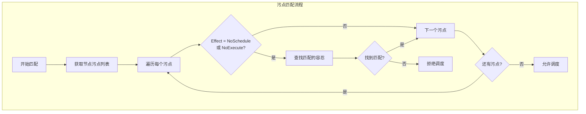
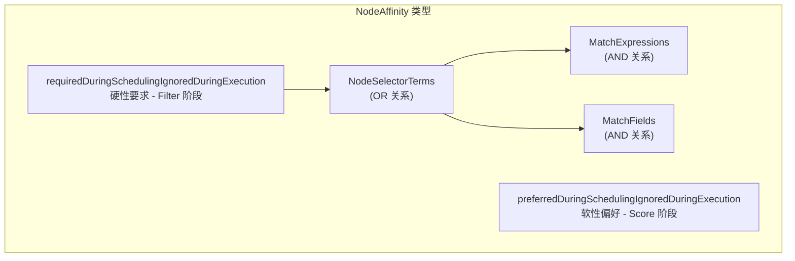
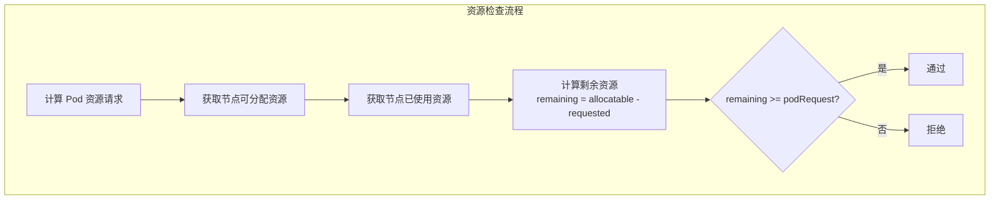
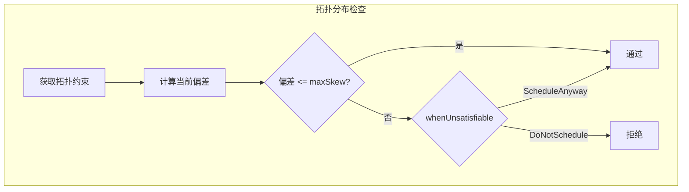

## 概述

Filter 插件是 Kubernetes 调度器的核心组件，负责过滤掉不满足 Pod 调度要求的节点。调度器会并行运行所有 Filter 插件，只有通过所有 Filter 检查的节点才会进入评分阶段。本文详细介绍各个内置 Filter 插件的实现原理。

## Filter 插件列表

| 插件名称 | 功能 | 优先级 |
|----------|------|--------|
| NodeUnschedulable | 检查节点是否可调度 | 高 |
| NodeName | 检查是否指定了节点名 | 高 |
| TaintToleration | 检查污点容忍 | 高 |
| NodeAffinity | 检查节点亲和性 | 中 |
| NodeResourcesFit | 检查资源是否充足 | 中 |
| NodePorts | 检查端口是否冲突 | 中 |
| NodeVolumeLimits | 检查卷数量限制 | 中 |
| PodTopologySpread | 检查拓扑分布约束 | 低 |
| InterPodAffinity | 检查 Pod 间亲和性 | 低 |
| VolumeBinding | 检查 PVC 绑定 | 低 |
| VolumeRestrictions | 检查卷访问模式 | 低 |

## NodeUnschedulable

### 功能说明

检查节点的 `spec.unschedulable` 字段，过滤掉被标记为不可调度的节点。

### 实现代码

```go
// pkg/scheduler/framework/plugins/nodeunschedulable/node_unschedulable.go

// Name 是插件名称
const Name = "NodeUnschedulable"

// NodeUnschedulable 插件
type NodeUnschedulable struct{}

// Filter 检查节点是否可调度
func (pl *NodeUnschedulable) Filter(ctx context.Context,
    _ *framework.CycleState, pod *v1.Pod,
    nodeInfo *framework.NodeInfo) *framework.Status {

    node := nodeInfo.Node()
    if node == nil {
        return framework.NewStatus(framework.Error, "node not found")
    }

    // 检查节点是否被标记为不可调度
    if node.Spec.Unschedulable {
        return framework.NewStatus(framework.UnschedulableAndUnresolvable,
            ErrReasonUnschedulable)
    }

    return nil
}
```

### 容忍机制

Pod 可以通过特殊容忍来忽略 Unschedulable：

```yaml
apiVersion: v1
kind: Pod
spec:
  tolerations:
  - key: node.kubernetes.io/unschedulable
    operator: Exists
    effect: NoSchedule
```

## NodeName

### 功能说明

如果 Pod 指定了 `spec.nodeName`，则只允许调度到该节点。

### 实现代码

```go
// pkg/scheduler/framework/plugins/nodename/node_name.go

const Name = "NodeName"

type NodeName struct{}

// Filter 检查是否匹配指定的节点名
func (pl *NodeName) Filter(ctx context.Context,
    _ *framework.CycleState, pod *v1.Pod,
    nodeInfo *framework.NodeInfo) *framework.Status {

    // 如果没有指定节点名，跳过检查
    if pod.Spec.NodeName == "" {
        return nil
    }

    node := nodeInfo.Node()
    if node == nil {
        return framework.NewStatus(framework.Error, "node not found")
    }

    // 检查是否匹配
    if pod.Spec.NodeName != node.Name {
        return framework.NewStatus(framework.UnschedulableAndUnresolvable,
            ErrReason)
    }

    return nil
}
```

## TaintToleration

### 功能说明

检查 Pod 是否能容忍节点上的所有污点。

### 污点匹配逻辑



### 实现代码

```go
// pkg/scheduler/framework/plugins/tainttoleration/taint_toleration.go

const Name = "TaintToleration"

type TaintToleration struct{}

// Filter 检查污点容忍
func (pl *TaintToleration) Filter(ctx context.Context,
    state *framework.CycleState, pod *v1.Pod,
    nodeInfo *framework.NodeInfo) *framework.Status {

    node := nodeInfo.Node()
    if node == nil {
        return framework.NewStatus(framework.Error, "node not found")
    }

    // 获取节点污点
    taints := node.Spec.Taints

    // 过滤调度阶段相关的污点（NoSchedule, NoExecute）
    filterPredicate := func(t *v1.Taint) bool {
        return t.Effect == v1.TaintEffectNoSchedule ||
            t.Effect == v1.TaintEffectNoExecute
    }

    // 检查是否所有污点都被容忍
    taint, isUntolerated := v1helper.FindMatchingUntoleratedTaint(
        taints, pod.Spec.Tolerations, filterPredicate)

    if isUntolerated {
        return framework.NewStatus(framework.UnschedulableAndUnresolvable,
            fmt.Sprintf("node(s) had taint {%s: %s}, that the pod didn't tolerate",
                taint.Key, taint.Value))
    }

    return nil
}

// FindMatchingUntoleratedTaint 查找未被容忍的污点
func FindMatchingUntoleratedTaint(taints []v1.Taint,
    tolerations []v1.Toleration, inclusionFilter func(*v1.Taint) bool) (*v1.Taint, bool) {

    for i := range taints {
        if inclusionFilter != nil && !inclusionFilter(&taints[i]) {
            continue
        }

        // 检查是否有匹配的容忍
        if !TolerationsTolerateTaint(tolerations, &taints[i]) {
            return &taints[i], true
        }
    }

    return nil, false
}

// TolerationsTolerateTaint 检查容忍是否匹配污点
func TolerationsTolerateTaint(tolerations []v1.Toleration, taint *v1.Taint) bool {
    for i := range tolerations {
        if tolerations[i].ToleratesTaint(taint) {
            return true
        }
    }
    return false
}
```

### 容忍配置示例

```yaml
apiVersion: v1
kind: Pod
spec:
  tolerations:
  # 精确匹配
  - key: "key1"
    operator: "Equal"
    value: "value1"
    effect: "NoSchedule"
  # 存在匹配
  - key: "key2"
    operator: "Exists"
    effect: "NoExecute"
  # 匹配所有污点
  - operator: "Exists"
```

## NodeAffinity

### 功能说明

检查 Pod 的节点亲和性规则是否满足。

### 亲和性类型



### 实现代码

```go
// pkg/scheduler/framework/plugins/nodeaffinity/node_affinity.go

const Name = "NodeAffinity"

type NodeAffinity struct {
    handle framework.Handle
    addedNodeSelector labels.Selector
    addedPrefSchedTerms []v1.PreferredSchedulingTerm
}

// Filter 检查节点亲和性
func (pl *NodeAffinity) Filter(ctx context.Context,
    state *framework.CycleState, pod *v1.Pod,
    nodeInfo *framework.NodeInfo) *framework.Status {

    node := nodeInfo.Node()
    if node == nil {
        return framework.NewStatus(framework.Error, "node not found")
    }

    // 检查 nodeSelector
    if !pl.matchesNodeSelector(pod, node) {
        return framework.NewStatus(framework.UnschedulableAndUnresolvable,
            ErrReasonPodMatchNodeSelector)
    }

    // 检查 requiredDuringScheduling 亲和性
    if affinity := pod.Spec.Affinity; affinity != nil &&
        affinity.NodeAffinity != nil {

        required := affinity.NodeAffinity.RequiredDuringSchedulingIgnoredDuringExecution
        if required != nil {
            // 检查 nodeSelectorTerms（OR 关系）
            if !nodeMatchesNodeSelectorTerms(node, required.NodeSelectorTerms) {
                return framework.NewStatus(framework.UnschedulableAndUnresolvable,
                    ErrReasonAffinityRulesNotMatch)
            }
        }
    }

    return nil
}

// nodeMatchesNodeSelectorTerms 检查节点是否匹配选择器
func nodeMatchesNodeSelectorTerms(node *v1.Node, nodeSelectorTerms []v1.NodeSelectorTerm) bool {
    // Terms 之间是 OR 关系
    for _, term := range nodeSelectorTerms {
        // Expressions 和 Fields 之间是 AND 关系
        if matchesNodeSelectorTerm(node, term) {
            return true
        }
    }
    return false
}

func matchesNodeSelectorTerm(node *v1.Node, term v1.NodeSelectorTerm) bool {
    // 检查标签表达式
    if len(term.MatchExpressions) > 0 {
        selector, err := nodeSelectorRequirementsAsSelector(term.MatchExpressions)
        if err != nil || !selector.Matches(labels.Set(node.Labels)) {
            return false
        }
    }

    // 检查字段表达式
    if len(term.MatchFields) > 0 {
        if !nodeMatchesFieldSelectors(node, term.MatchFields) {
            return false
        }
    }

    return true
}
```

### 配置示例

```yaml
apiVersion: v1
kind: Pod
spec:
  affinity:
    nodeAffinity:
      requiredDuringSchedulingIgnoredDuringExecution:
        nodeSelectorTerms:
        - matchExpressions:
          - key: topology.kubernetes.io/zone
            operator: In
            values: ["zone-a", "zone-b"]
          - key: node-type
            operator: NotIn
            values: ["spot"]
```

## NodeResourcesFit

### 功能说明

检查节点是否有足够的资源运行 Pod。

### 资源计算流程



### 实现代码

```go
// pkg/scheduler/framework/plugins/noderesources/fit.go

const Name = "NodeResourcesFit"

type Fit struct {
    ignoredResources            sets.String
    ignoredResourceGroups       sets.String
    enableInPlacePodVerticalScaling bool
    enableSidecarContainers     bool
}

// PreFilter 预计算 Pod 资源请求
func (f *Fit) PreFilter(ctx context.Context,
    cycleState *framework.CycleState, pod *v1.Pod) (*framework.PreFilterResult, *framework.Status) {

    // 计算 Pod 请求的资源
    request := computePodResourceRequest(pod)

    // 保存到 CycleState
    cycleState.Write(preFilterStateKey, &preFilterState{
        podRequests: request,
    })

    return nil, nil
}

// Filter 检查资源是否充足
func (f *Fit) Filter(ctx context.Context,
    cycleState *framework.CycleState, pod *v1.Pod,
    nodeInfo *framework.NodeInfo) *framework.Status {

    // 获取预计算的 Pod 请求
    s, err := getPreFilterState(cycleState)
    if err != nil {
        return framework.AsStatus(err)
    }

    // 检查资源
    insufficientResources := fitsRequest(s.podRequests, nodeInfo,
        f.ignoredResources, f.ignoredResourceGroups)

    if len(insufficientResources) > 0 {
        reasons := make([]string, len(insufficientResources))
        for i, res := range insufficientResources {
            reasons[i] = res.Reason
        }
        return framework.NewStatus(framework.Unschedulable, reasons...)
    }

    return nil
}

// fitsRequest 检查资源是否满足
func fitsRequest(podRequest *preFilterState, nodeInfo *framework.NodeInfo,
    ignoredExtendedResources, ignoredResourceGroups sets.String) []InsufficientResource {

    var insufficientResources []InsufficientResource

    allowedPodNumber := nodeInfo.Allocatable.AllowedPodNumber
    if len(nodeInfo.Pods)+1 > allowedPodNumber {
        insufficientResources = append(insufficientResources, InsufficientResource{
            ResourceName: v1.ResourcePods,
            Reason:       "Too many pods",
            Requested:    1,
            Used:         int64(len(nodeInfo.Pods)),
            Capacity:     int64(allowedPodNumber),
        })
    }

    // 检查 CPU
    if podRequest.MilliCPU > 0 {
        if nodeInfo.Allocatable.MilliCPU < podRequest.MilliCPU+nodeInfo.Requested.MilliCPU {
            insufficientResources = append(insufficientResources, InsufficientResource{
                ResourceName: v1.ResourceCPU,
                Reason:       "Insufficient cpu",
                Requested:    podRequest.MilliCPU,
                Used:         nodeInfo.Requested.MilliCPU,
                Capacity:     nodeInfo.Allocatable.MilliCPU,
            })
        }
    }

    // 检查内存
    if podRequest.Memory > 0 {
        if nodeInfo.Allocatable.Memory < podRequest.Memory+nodeInfo.Requested.Memory {
            insufficientResources = append(insufficientResources, InsufficientResource{
                ResourceName: v1.ResourceMemory,
                Reason:       "Insufficient memory",
                Requested:    podRequest.Memory,
                Used:         nodeInfo.Requested.Memory,
                Capacity:     nodeInfo.Allocatable.Memory,
            })
        }
    }

    // 检查扩展资源
    for rName, rQuant := range podRequest.ScalarResources {
        // 跳过忽略的资源
        if ignoredExtendedResources.Has(string(rName)) {
            continue
        }

        if nodeInfo.Allocatable.ScalarResources[rName] <
            rQuant+nodeInfo.Requested.ScalarResources[rName] {
            insufficientResources = append(insufficientResources, InsufficientResource{
                ResourceName: rName,
                Reason:       fmt.Sprintf("Insufficient %v", rName),
                Requested:    rQuant,
                Used:         nodeInfo.Requested.ScalarResources[rName],
                Capacity:     nodeInfo.Allocatable.ScalarResources[rName],
            })
        }
    }

    return insufficientResources
}
```

### 资源请求计算

```go
// computePodResourceRequest 计算 Pod 资源请求
func computePodResourceRequest(pod *v1.Pod) *preFilterState {
    result := &preFilterState{}

    // 计算 Init 容器需求（取最大值）
    for _, container := range pod.Spec.InitContainers {
        result.setMaxResource(container.Resources.Requests)
    }

    // 计算常规容器需求（累加）
    for _, container := range pod.Spec.Containers {
        result.Add(container.Resources.Requests)
    }

    // Overhead
    if pod.Spec.Overhead != nil {
        result.Add(pod.Spec.Overhead)
    }

    return result
}
```

## NodePorts

### 功能说明

检查 Pod 请求的端口是否与节点上已使用的端口冲突。

### 实现代码

```go
// pkg/scheduler/framework/plugins/nodeports/node_ports.go

const Name = "NodePorts"

type NodePorts struct{}

// PreFilter 预计算 Pod 需要的端口
func (pl *NodePorts) PreFilter(ctx context.Context,
    cycleState *framework.CycleState, pod *v1.Pod) (*framework.PreFilterResult, *framework.Status) {

    // 提取 Pod 需要的 HostPort
    s := getContainerPorts(pod)
    cycleState.Write(preFilterStateKey, s)

    return nil, nil
}

// Filter 检查端口冲突
func (pl *NodePorts) Filter(ctx context.Context,
    cycleState *framework.CycleState, pod *v1.Pod,
    nodeInfo *framework.NodeInfo) *framework.Status {

    // 获取预计算的端口
    wantPorts, err := getPreFilterState(cycleState)
    if err != nil {
        return framework.AsStatus(err)
    }

    // 检查冲突
    for _, port := range wantPorts {
        if nodeInfo.UsedPorts.CheckConflict(port.IP, port.Protocol, port.Port) {
            return framework.NewStatus(framework.Unschedulable,
                ErrReason)
        }
    }

    return nil
}

// getContainerPorts 获取容器的 HostPort
func getContainerPorts(pod *v1.Pod) []*v1.ContainerPort {
    var result []*v1.ContainerPort

    for _, container := range pod.Spec.Containers {
        for i := range container.Ports {
            port := &container.Ports[i]
            if port.HostPort > 0 {
                result = append(result, port)
            }
        }
    }

    return result
}
```

## PodTopologySpread

### 功能说明

检查 Pod 的拓扑分布约束是否满足。

### 分布计算流程



### 实现代码

```go
// pkg/scheduler/framework/plugins/podtopologyspread/filtering.go

// PreFilter 预计算拓扑信息
func (pl *PodTopologySpread) PreFilter(ctx context.Context,
    cycleState *framework.CycleState, pod *v1.Pod) (*framework.PreFilterResult, *framework.Status) {

    // 获取拓扑约束
    constraints, err := pl.getConstraints(pod)
    if err != nil {
        return nil, framework.AsStatus(err)
    }

    if len(constraints) == 0 {
        return nil, nil
    }

    // 计算当前拓扑分布
    state, err := pl.calPreFilterState(ctx, pod, constraints)
    if err != nil {
        return nil, framework.AsStatus(err)
    }

    cycleState.Write(preFilterStateKey, state)

    return nil, nil
}

// Filter 检查拓扑分布
func (pl *PodTopologySpread) Filter(ctx context.Context,
    cycleState *framework.CycleState, pod *v1.Pod,
    nodeInfo *framework.NodeInfo) *framework.Status {

    state, err := getPreFilterState(cycleState)
    if err != nil {
        return framework.AsStatus(err)
    }

    node := nodeInfo.Node()
    if node == nil {
        return framework.NewStatus(framework.Error, "node not found")
    }

    // 检查每个约束
    for _, c := range state.Constraints {
        if c.WhenUnsatisfiable == v1.ScheduleAnyway {
            continue // 软约束，不在 Filter 阶段处理
        }

        // 获取节点的拓扑值
        tpValue, ok := node.Labels[c.TopologyKey]
        if !ok {
            // 节点没有此拓扑标签，跳过
            continue
        }

        // 获取该拓扑域当前的 Pod 数量
        count := state.TpKeyToCriticalPaths[c.TopologyKey][tpValue]

        // 计算偏差
        minCount := state.TpKeyToMinPodsCount[c.TopologyKey]
        skew := count + 1 - minCount

        if skew > int(c.MaxSkew) {
            return framework.NewStatus(framework.Unschedulable,
                fmt.Sprintf("node violates topology spread constraint: %s", c.TopologyKey))
        }
    }

    return nil
}
```

### 配置示例

```yaml
apiVersion: v1
kind: Pod
spec:
  topologySpreadConstraints:
  - maxSkew: 1
    topologyKey: topology.kubernetes.io/zone
    whenUnsatisfiable: DoNotSchedule
    labelSelector:
      matchLabels:
        app: myapp
  - maxSkew: 2
    topologyKey: kubernetes.io/hostname
    whenUnsatisfiable: ScheduleAnyway
    labelSelector:
      matchLabels:
        app: myapp
```

## InterPodAffinity

### 功能说明

检查 Pod 间的亲和性和反亲和性约束。

### 实现代码

```go
// pkg/scheduler/framework/plugins/interpodaffinity/filtering.go

// Filter 检查 Pod 亲和性/反亲和性
func (pl *InterPodAffinity) Filter(ctx context.Context,
    cycleState *framework.CycleState, pod *v1.Pod,
    nodeInfo *framework.NodeInfo) *framework.Status {

    state, err := getPreFilterState(cycleState)
    if err != nil {
        return framework.AsStatus(err)
    }

    // 检查硬性反亲和性
    if !pl.satisfiesExistingPodsAntiAffinity(pod, state, nodeInfo) {
        return framework.NewStatus(framework.Unschedulable,
            ErrReasonAntiAffinityRulesNotMatch)
    }

    // 检查硬性亲和性
    if !pl.satisfiesPodsAffinityAntiAffinity(pod, state, nodeInfo,
        v1.PodAffinityRuleRequired) {
        return framework.NewStatus(framework.Unschedulable,
            ErrReasonAffinityRulesNotMatch)
    }

    return nil
}

// satisfiesExistingPodsAntiAffinity 检查已存在 Pod 的反亲和性
func (pl *InterPodAffinity) satisfiesExistingPodsAntiAffinity(pod *v1.Pod,
    state *preFilterState, nodeInfo *framework.NodeInfo) bool {

    node := nodeInfo.Node()

    // 检查是否有现有 Pod 将此 Pod 标记为反亲和
    for _, existingPod := range nodeInfo.Pods {
        if existingPod.Pod.Spec.Affinity == nil ||
            existingPod.Pod.Spec.Affinity.PodAntiAffinity == nil {
            continue
        }

        for _, term := range existingPod.Pod.Spec.Affinity.PodAntiAffinity.
            RequiredDuringSchedulingIgnoredDuringExecution {

            // 检查新 Pod 是否匹配反亲和规则
            if pl.podMatchesTerm(pod, term) &&
                pl.nodeMatchesTopology(node, existingPod.Pod, term.TopologyKey) {
                return false
            }
        }
    }

    return true
}
```

### 配置示例

```yaml
apiVersion: v1
kind: Pod
spec:
  affinity:
    podAffinity:
      requiredDuringSchedulingIgnoredDuringExecution:
      - labelSelector:
          matchLabels:
            app: cache
        topologyKey: kubernetes.io/hostname
    podAntiAffinity:
      requiredDuringSchedulingIgnoredDuringExecution:
      - labelSelector:
          matchLabels:
            app: web
        topologyKey: topology.kubernetes.io/zone
```

## VolumeBinding

### 功能说明

检查 Pod 的 PVC 是否可以绑定到节点可用的 PV。

### 实现代码

```go
// pkg/scheduler/framework/plugins/volumebinding/volume_binding.go

// Filter 检查卷绑定
func (pl *VolumeBinding) Filter(ctx context.Context,
    cs *framework.CycleState, pod *v1.Pod,
    nodeInfo *framework.NodeInfo) *framework.Status {

    node := nodeInfo.Node()
    if node == nil {
        return framework.NewStatus(framework.Error, "node not found")
    }

    state, err := getStateData(cs)
    if err != nil {
        return framework.AsStatus(err)
    }

    // 检查该节点是否满足所有 PVC 的要求
    reasons, err := pl.Binder.FindPodVolumes(pod, state.boundClaims,
        state.claimsToBind, node)

    if err != nil {
        return framework.AsStatus(err)
    }

    if len(reasons) > 0 {
        return framework.NewStatus(framework.UnschedulableAndUnresolvable,
            reasons...)
    }

    return nil
}
```

## 总结

Filter 插件是调度决策的第一道关卡：

1. **硬性约束**：NodeName、TaintToleration、NodeAffinity（required）
2. **资源约束**：NodeResourcesFit、NodePorts、NodeVolumeLimits
3. **拓扑约束**：PodTopologySpread、InterPodAffinity
4. **存储约束**：VolumeBinding、VolumeRestrictions

Filter 插件之间并行执行，任一插件拒绝即表示节点不可用。理解各插件的检查逻辑有助于正确配置 Pod 的调度约束。
