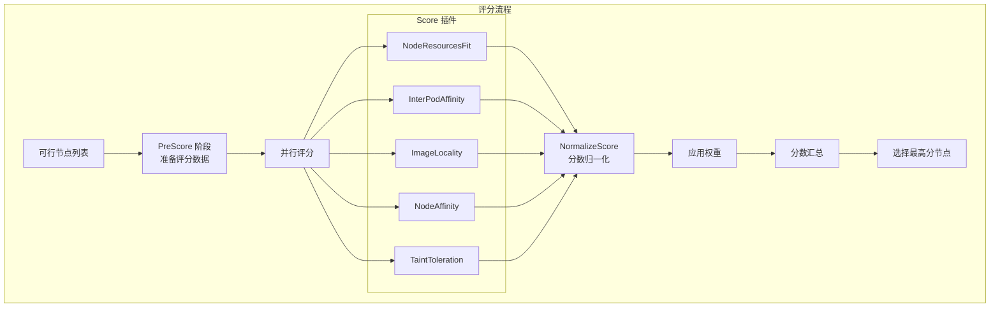
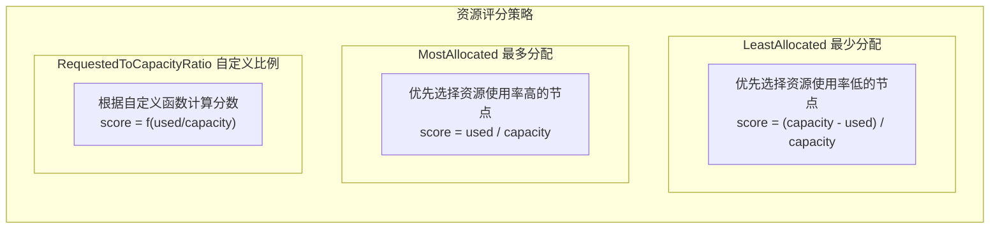
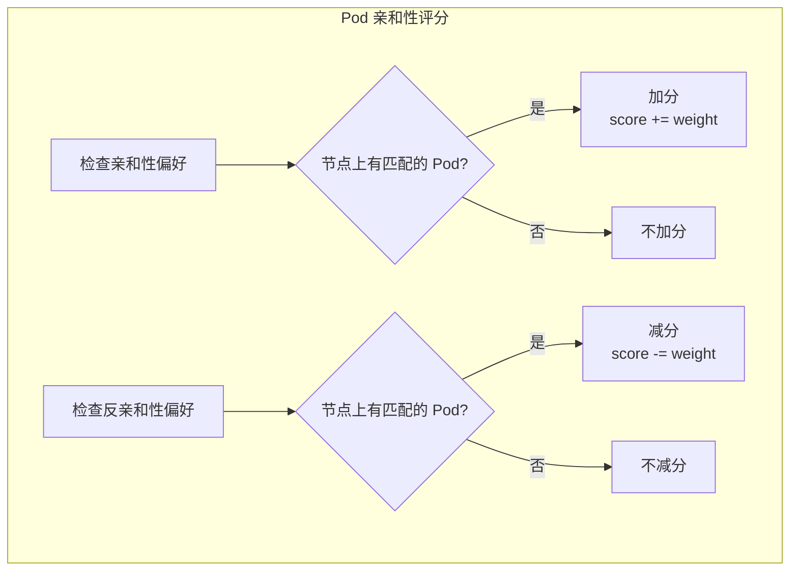
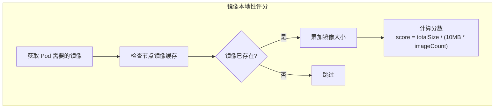

## 概述

Score 插件负责为通过 Filter 阶段的可行节点打分，帮助调度器选择最优节点。每个 Score 插件为每个节点返回一个分数，调度器会综合所有插件的加权分数来决定最终的节点选择。

## 评分机制

### 评分流程



### 分数范围

```go
const (
    // 最小分数
    MinNodeScore int64 = 0
    // 最大分数
    MaxNodeScore int64 = 100
)

// NodeScore 表示节点得分
type NodeScore struct {
    Name  string
    Score int64
}

// NodeScoreList 是节点得分列表
type NodeScoreList []NodeScore
```

## Score 插件列表

| 插件名称 | 功能 | 默认权重 |
|----------|------|----------|
| NodeResourcesFit | 资源分配策略 | 1 |
| InterPodAffinity | Pod 间亲和性偏好 | 1 |
| NodeAffinity | 节点亲和性偏好 | 1 |
| PodTopologySpread | 拓扑分布偏好 | 2 |
| TaintToleration | 污点容忍偏好 | 1 |
| ImageLocality | 镜像本地性 | 1 |

## NodeResourcesFit

### 功能说明

根据节点资源使用情况评分，支持多种评分策略。

### 评分策略



### 实现代码

```go
// pkg/scheduler/framework/plugins/noderesources/fit.go

// Score 计算资源评分
func (f *Fit) Score(ctx context.Context, state *framework.CycleState,
    pod *v1.Pod, nodeName string) (int64, *framework.Status) {

    nodeInfo, err := f.handle.SnapshotSharedLister().NodeInfos().Get(nodeName)
    if err != nil {
        return 0, framework.AsStatus(fmt.Errorf("getting node %q: %w", nodeName, err))
    }

    // 根据策略类型计算分数
    return f.score(pod, nodeInfo)
}

func (f *Fit) score(pod *v1.Pod, nodeInfo *framework.NodeInfo) (int64, *framework.Status) {
    node := nodeInfo.Node()

    // 获取请求和可分配资源
    requested := f.calculatePodResourceRequest(pod, f.resources)
    allocatable := f.calculateAllocatable(nodeInfo, f.resources)

    var score int64

    switch f.scoringStrategy.Type {
    case config.LeastAllocated:
        score = f.leastAllocatedScore(requested, allocatable, nodeInfo)
    case config.MostAllocated:
        score = f.mostAllocatedScore(requested, allocatable, nodeInfo)
    case config.RequestedToCapacityRatio:
        score = f.requestedToCapacityRatioScore(requested, allocatable, nodeInfo)
    }

    return score, nil
}

// leastAllocatedScore 计算最少分配策略分数
func (f *Fit) leastAllocatedScore(requested, allocatable resourceToValueMap,
    nodeInfo *framework.NodeInfo) int64 {

    var nodeScore, weightSum int64

    for _, resource := range f.resources {
        weight := resource.Weight
        resourceScore := leastRequestedScore(requested[resource.Name],
            allocatable[resource.Name])
        nodeScore += resourceScore * weight
        weightSum += weight
    }

    if weightSum == 0 {
        return 0
    }

    return nodeScore / weightSum
}

// leastRequestedScore 计算单一资源的最少请求分数
// 分数 = (capacity - request) * MaxNodeScore / capacity
func leastRequestedScore(requested, capacity int64) int64 {
    if capacity == 0 {
        return 0
    }
    if requested > capacity {
        return 0
    }

    return ((capacity - requested) * framework.MaxNodeScore) / capacity
}

// mostAllocatedScore 计算最多分配策略分数
func (f *Fit) mostAllocatedScore(requested, allocatable resourceToValueMap,
    nodeInfo *framework.NodeInfo) int64 {

    var nodeScore, weightSum int64

    for _, resource := range f.resources {
        weight := resource.Weight
        resourceScore := mostRequestedScore(requested[resource.Name],
            allocatable[resource.Name])
        nodeScore += resourceScore * weight
        weightSum += weight
    }

    if weightSum == 0 {
        return 0
    }

    return nodeScore / weightSum
}

// mostRequestedScore 计算单一资源的最多请求分数
// 分数 = request * MaxNodeScore / capacity
func mostRequestedScore(requested, capacity int64) int64 {
    if capacity == 0 {
        return 0
    }
    if requested > capacity {
        return framework.MaxNodeScore
    }

    return (requested * framework.MaxNodeScore) / capacity
}
```

### 配置示例

```yaml
apiVersion: kubescheduler.config.k8s.io/v1
kind: KubeSchedulerConfiguration
profiles:
- schedulerName: default-scheduler
  pluginConfig:
  - name: NodeResourcesFit
    args:
      scoringStrategy:
        type: LeastAllocated
        resources:
        - name: cpu
          weight: 1
        - name: memory
          weight: 1
        - name: nvidia.com/gpu
          weight: 2
```

## InterPodAffinity

### 功能说明

根据 Pod 间亲和性/反亲和性的软性偏好评分。

### 评分逻辑



### 实现代码

```go
// pkg/scheduler/framework/plugins/interpodaffinity/scoring.go

// Score 计算 Pod 亲和性评分
func (pl *InterPodAffinity) Score(ctx context.Context,
    cycleState *framework.CycleState, pod *v1.Pod,
    nodeName string) (int64, *framework.Status) {

    nodeInfo, err := pl.sharedLister.NodeInfos().Get(nodeName)
    if err != nil {
        return 0, framework.AsStatus(err)
    }

    state, err := getPreScoreState(cycleState)
    if err != nil {
        return 0, framework.AsStatus(err)
    }

    var score int64

    // 处理软性亲和性偏好
    for i := range state.podInfo.PreferredAffinityTerms {
        preferredTerm := &state.podInfo.PreferredAffinityTerms[i]
        if preferredTerm.Matches(pod, nodeInfo) {
            score += int64(preferredTerm.Weight)
        }
    }

    // 处理软性反亲和性偏好
    for i := range state.podInfo.PreferredAntiAffinityTerms {
        preferredTerm := &state.podInfo.PreferredAntiAffinityTerms[i]
        if preferredTerm.Matches(pod, nodeInfo) {
            score -= int64(preferredTerm.Weight)
        }
    }

    // 处理已存在 Pod 对新 Pod 的亲和性/反亲和性
    score += state.topologyScore[nodeName]

    return score, nil
}

// NormalizeScore 归一化分数到 [0, MaxNodeScore]
func (pl *InterPodAffinity) NormalizeScore(ctx context.Context,
    cycleState *framework.CycleState, pod *v1.Pod,
    scores framework.NodeScoreList) *framework.Status {

    state, err := getPreScoreState(cycleState)
    if err != nil {
        return framework.AsStatus(err)
    }

    // 找到最大和最小分数
    var minScore, maxScore int64 = math.MaxInt64, math.MinInt64
    for _, score := range scores {
        if score.Score > maxScore {
            maxScore = score.Score
        }
        if score.Score < minScore {
            minScore = score.Score
        }
    }

    // 归一化
    for i := range scores {
        if maxScore == minScore {
            scores[i].Score = framework.MaxNodeScore
        } else {
            scores[i].Score = framework.MaxNodeScore *
                (scores[i].Score - minScore) / (maxScore - minScore)
        }
    }

    return nil
}
```

## NodeAffinity

### 功能说明

根据节点亲和性的软性偏好（preferredDuringScheduling）评分。

### 实现代码

```go
// pkg/scheduler/framework/plugins/nodeaffinity/node_affinity.go

// Score 计算节点亲和性评分
func (pl *NodeAffinity) Score(ctx context.Context,
    state *framework.CycleState, pod *v1.Pod,
    nodeName string) (int64, *framework.Status) {

    nodeInfo, err := pl.handle.SnapshotSharedLister().NodeInfos().Get(nodeName)
    if err != nil {
        return 0, framework.AsStatus(err)
    }

    node := nodeInfo.Node()

    var score int64

    // 检查 Pod 的偏好亲和性
    if pod.Spec.Affinity != nil &&
        pod.Spec.Affinity.NodeAffinity != nil &&
        pod.Spec.Affinity.NodeAffinity.PreferredDuringSchedulingIgnoredDuringExecution != nil {

        for _, pst := range pod.Spec.Affinity.NodeAffinity.
            PreferredDuringSchedulingIgnoredDuringExecution {

            // 检查节点是否匹配偏好
            if nodeMatchesPreferredSchedulingTerm(node, pst) {
                score += int64(pst.Weight)
            }
        }
    }

    // 加上调度器配置的全局偏好
    for i := range pl.addedPrefSchedTerms {
        if nodeMatchesPreferredSchedulingTerm(node, pl.addedPrefSchedTerms[i]) {
            score += int64(pl.addedPrefSchedTerms[i].Weight)
        }
    }

    return score, nil
}
```

### 配置示例

```yaml
apiVersion: v1
kind: Pod
spec:
  affinity:
    nodeAffinity:
      preferredDuringSchedulingIgnoredDuringExecution:
      - weight: 100
        preference:
          matchExpressions:
          - key: node-type
            operator: In
            values: ["high-memory"]
      - weight: 50
        preference:
          matchExpressions:
          - key: topology.kubernetes.io/zone
            operator: In
            values: ["zone-a"]
```

## PodTopologySpread

### 功能说明

根据拓扑分布约束的软性策略（whenUnsatisfiable: ScheduleAnyway）评分。

### 评分逻辑

偏差越小，分数越高：

```go
// 计算偏差分数
// skew = 当前域 Pod 数 - 最小域 Pod 数
// score = MaxNodeScore - skew * MaxNodeScore / maxSkew
```

### 实现代码

```go
// pkg/scheduler/framework/plugins/podtopologyspread/scoring.go

// Score 计算拓扑分布评分
func (pl *PodTopologySpread) Score(ctx context.Context,
    cycleState *framework.CycleState, pod *v1.Pod,
    nodeName string) (int64, *framework.Status) {

    nodeInfo, err := pl.sharedLister.NodeInfos().Get(nodeName)
    if err != nil {
        return 0, framework.AsStatus(err)
    }

    state, err := getPreScoreState(cycleState)
    if err != nil {
        return 0, framework.AsStatus(err)
    }

    node := nodeInfo.Node()
    var score float64

    for _, c := range state.Constraints {
        if c.WhenUnsatisfiable != v1.ScheduleAnyway {
            continue // 只处理软约束
        }

        // 获取节点的拓扑值
        tpValue, ok := node.Labels[c.TopologyKey]
        if !ok {
            continue
        }

        // 计算该拓扑域的 Pod 数
        count := state.TpPairToMatchNum[topologyPair{
            key: c.TopologyKey, value: tpValue}]

        // 计算偏差分数
        score += scoreForCount(count, c.MaxSkew, state.TopologyNormalizingWeight[c.TopologyKey])
    }

    return int64(score), nil
}

// scoreForCount 计算单个约束的分数
func scoreForCount(count int, maxSkew int32, normalizingWeight float64) float64 {
    // 偏差越小分数越高
    return float64(framework.MaxNodeScore) - float64(count)*normalizingWeight
}
```

## TaintToleration

### 功能说明

根据节点污点和 Pod 容忍的匹配程度评分，更少的不匹配污点得分更高。

### 实现代码

```go
// pkg/scheduler/framework/plugins/tainttoleration/taint_toleration.go

// Score 计算污点容忍评分
func (pl *TaintToleration) Score(ctx context.Context,
    state *framework.CycleState, pod *v1.Pod,
    nodeName string) (int64, *framework.Status) {

    nodeInfo, err := pl.handle.SnapshotSharedLister().NodeInfos().Get(nodeName)
    if err != nil {
        return 0, framework.AsStatus(err)
    }

    // 统计 PreferNoSchedule 类型污点的不匹配数
    score := countPreferNoScheduleTaints(nodeInfo.Node().Spec.Taints,
        pod.Spec.Tolerations)

    return score, nil
}

// countPreferNoScheduleTaints 统计未容忍的 PreferNoSchedule 污点数
func countPreferNoScheduleTaints(taints []v1.Taint, tolerations []v1.Toleration) int64 {
    var count int64

    for _, taint := range taints {
        if taint.Effect != v1.TaintEffectPreferNoSchedule {
            continue
        }

        // 检查是否被容忍
        if !tolerationsTolerateTaint(tolerations, &taint) {
            count++
        }
    }

    return count
}

// NormalizeScore 归一化分数
// 未容忍的污点越少分数越高
func (pl *TaintToleration) NormalizeScore(ctx context.Context,
    state *framework.CycleState, pod *v1.Pod,
    scores framework.NodeScoreList) *framework.Status {

    // 找到最大未容忍数
    var maxCount int64
    for _, score := range scores {
        if score.Score > maxCount {
            maxCount = score.Score
        }
    }

    // 反转分数：未容忍数最少的节点分数最高
    for i := range scores {
        if maxCount == 0 {
            scores[i].Score = framework.MaxNodeScore
        } else {
            scores[i].Score = framework.MaxNodeScore *
                (maxCount - scores[i].Score) / maxCount
        }
    }

    return nil
}
```

## ImageLocality

### 功能说明

根据节点上是否已有 Pod 所需的镜像评分，镜像已存在的节点得分更高。

### 评分逻辑



### 实现代码

```go
// pkg/scheduler/framework/plugins/imagelocality/image_locality.go

// Score 计算镜像本地性评分
func (pl *ImageLocality) Score(ctx context.Context,
    state *framework.CycleState, pod *v1.Pod,
    nodeName string) (int64, *framework.Status) {

    nodeInfo, err := pl.handle.SnapshotSharedLister().NodeInfos().Get(nodeName)
    if err != nil {
        return 0, framework.AsStatus(err)
    }

    // 收集 Pod 需要的镜像
    var images []string
    for _, container := range pod.Spec.Containers {
        images = append(images, container.Image)
    }
    for _, container := range pod.Spec.InitContainers {
        images = append(images, container.Image)
    }

    // 计算节点上已有镜像的总大小
    var totalSize int64
    for _, image := range images {
        if imageState, ok := nodeInfo.ImageStates[image]; ok {
            totalSize += imageState.Size
        }
    }

    return pl.calculateScore(totalSize, len(images)), nil
}

// calculateScore 计算分数
func (pl *ImageLocality) calculateScore(totalSize int64, imageCount int) int64 {
    if imageCount == 0 {
        return 0
    }

    // 基准大小：每个镜像 10MB
    baseSize := int64(imageCount) * 10 * 1024 * 1024

    // 分数 = 已有镜像大小 / 基准大小 * MaxNodeScore
    // 但不超过 MaxNodeScore
    score := totalSize * framework.MaxNodeScore / baseSize
    if score > framework.MaxNodeScore {
        return framework.MaxNodeScore
    }

    return score
}
```

## 分数归一化

### 归一化目的

不同 Score 插件返回的分数范围可能不同，归一化确保所有插件的分数都在 [0, MaxNodeScore] 范围内。

### 归一化方法

```go
// 常见归一化方法

// 1. 线性归一化
func normalizeLinear(scores []NodeScore) {
    var min, max int64 = math.MaxInt64, math.MinInt64
    for _, s := range scores {
        if s.Score < min {
            min = s.Score
        }
        if s.Score > max {
            max = s.Score
        }
    }

    for i := range scores {
        if max == min {
            scores[i].Score = MaxNodeScore
        } else {
            scores[i].Score = MaxNodeScore * (scores[i].Score - min) / (max - min)
        }
    }
}

// 2. 反转归一化（用于越小越好的指标）
func normalizeReverse(scores []NodeScore) {
    var max int64
    for _, s := range scores {
        if s.Score > max {
            max = s.Score
        }
    }

    for i := range scores {
        if max == 0 {
            scores[i].Score = MaxNodeScore
        } else {
            scores[i].Score = MaxNodeScore * (max - scores[i].Score) / max
        }
    }
}
```

## 权重配置

### 权重应用

```go
// 应用权重并汇总分数
func sumScores(pluginToNodeScores []NodeScoreList, weights map[string]int) NodeScoreList {
    result := make(NodeScoreList, len(pluginToNodeScores[0]))

    for i := range result {
        result[i].Name = pluginToNodeScores[0][i].Name
    }

    for pluginIndex, nodeScores := range pluginToNodeScores {
        weight := weights[pluginNames[pluginIndex]]
        for nodeIndex, nodeScore := range nodeScores {
            result[nodeIndex].Score += nodeScore.Score * int64(weight)
        }
    }

    return result
}
```

### 配置示例

```yaml
apiVersion: kubescheduler.config.k8s.io/v1
kind: KubeSchedulerConfiguration
profiles:
- schedulerName: default-scheduler
  plugins:
    score:
      enabled:
      - name: NodeResourcesFit
        weight: 2              # 资源匹配权重高
      - name: InterPodAffinity
        weight: 1
      - name: NodeAffinity
        weight: 1
      - name: PodTopologySpread
        weight: 2              # 拓扑分布权重高
      - name: TaintToleration
        weight: 1
      - name: ImageLocality
        weight: 1
      disabled:
      - name: NodeResourcesBalancedAllocation  # 禁用均衡分配
```

## 最佳节点选择

```go
// selectHost 选择得分最高的节点
func selectHost(nodeScoreList NodeScoreList) (string, error) {
    if len(nodeScoreList) == 0 {
        return "", errors.New("empty node score list")
    }

    maxScore := nodeScoreList[0].Score
    selected := nodeScoreList[0].Name
    cntOfMaxScore := 1

    for _, ns := range nodeScoreList[1:] {
        if ns.Score > maxScore {
            // 找到更高分
            maxScore = ns.Score
            selected = ns.Name
            cntOfMaxScore = 1
        } else if ns.Score == maxScore {
            // 相同得分，随机选择（水塘抽样）
            cntOfMaxScore++
            if rand.Intn(cntOfMaxScore) == 0 {
                selected = ns.Name
            }
        }
    }

    return selected, nil
}
```

## 总结

Score 插件通过多维度评估帮助调度器做出最优决策：

1. **资源维度**：NodeResourcesFit 根据资源利用率评分
2. **亲和性维度**：InterPodAffinity 和 NodeAffinity 根据亲和规则评分
3. **拓扑维度**：PodTopologySpread 根据分布均衡性评分
4. **容忍维度**：TaintToleration 根据污点匹配评分
5. **缓存维度**：ImageLocality 根据镜像缓存评分

通过合理配置插件权重，可以实现符合业务需求的调度策略。
