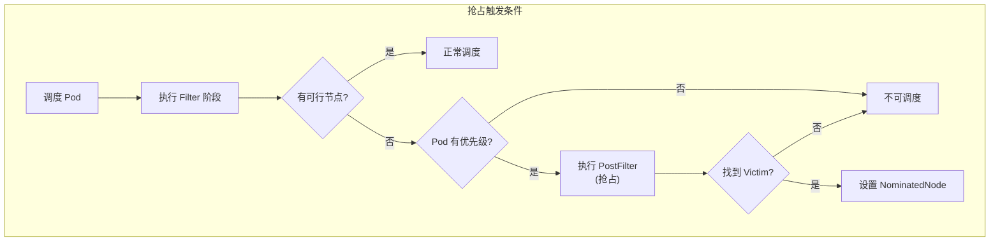
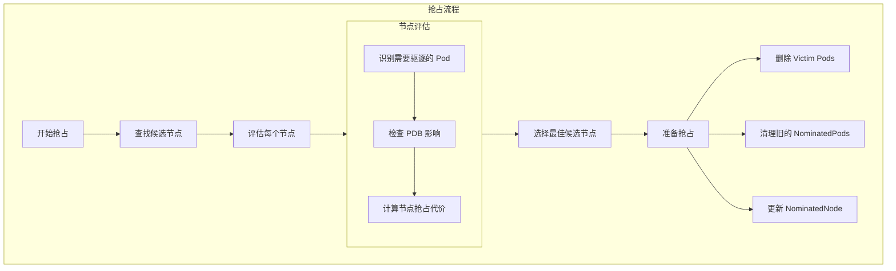
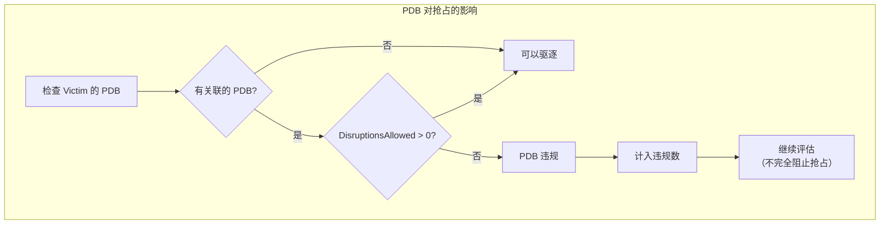
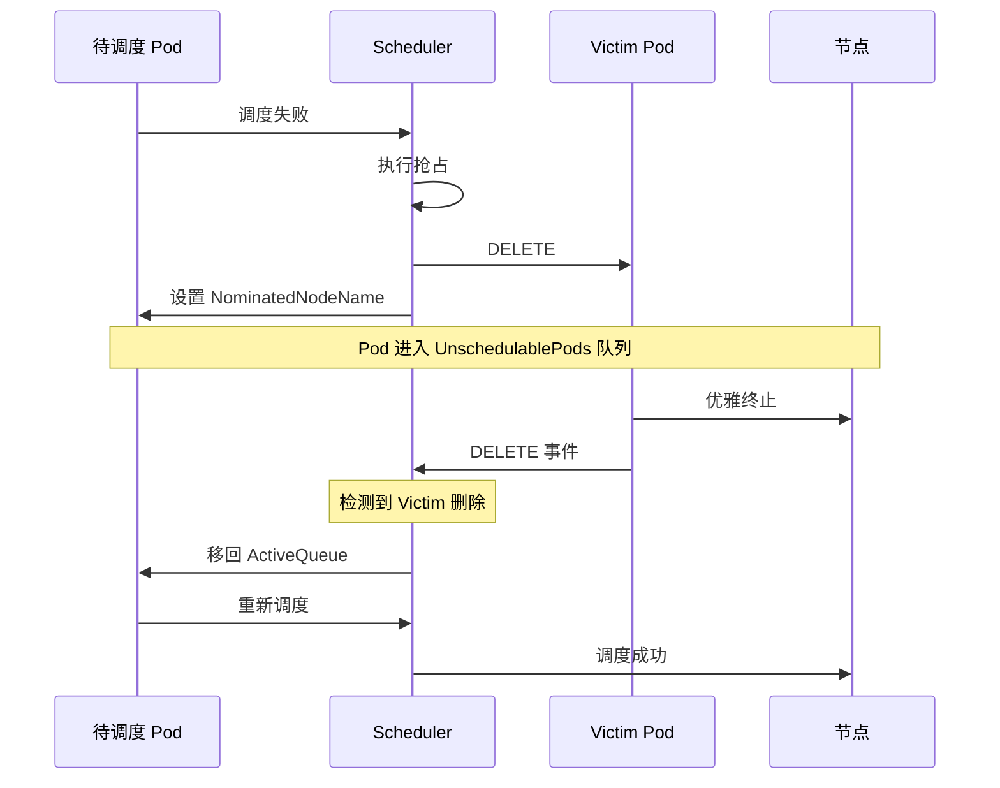

## 概述

抢占（Preemption）是 Kubernetes 调度器的一项重要功能，允许高优先级的 Pod 驱逐低优先级的 Pod 以获取调度资源。当一个 Pod 无法调度到任何节点时，调度器会尝试通过抢占来为其腾出空间。

## 抢占触发条件

### 触发时机



### PostFilter 阶段

抢占在 PostFilter 扩展点执行：

```go
// RunPostFilterPlugins 执行抢占插件
func (f *frameworkImpl) RunPostFilterPlugins(ctx context.Context,
    state *framework.CycleState, pod *v1.Pod,
    filteredNodeStatusMap framework.NodeToStatusMap) (*framework.PostFilterResult, *framework.Status) {

    for _, pl := range f.postFilterPlugins {
        result, status := f.runPostFilterPlugin(ctx, pl, state, pod, filteredNodeStatusMap)
        if status.Code() == framework.Error {
            return nil, status
        }

        // 如果找到候选节点，返回
        if result != nil && result.NominatedNodeName != "" {
            return result, framework.NewStatus(framework.Success)
        }
    }

    return nil, framework.NewStatus(framework.Unschedulable)
}
```

## 优先级与抢占策略

### PriorityClass

```yaml
apiVersion: scheduling.k8s.io/v1
kind: PriorityClass
metadata:
  name: high-priority
value: 1000000
globalDefault: false
preemptionPolicy: PreemptLowerPriority
description: "High priority for critical workloads"
```

### 抢占策略

| 策略 | 说明 |
|------|------|
| PreemptLowerPriority | 允许抢占低优先级 Pod（默认） |
| Never | 不允许抢占其他 Pod |

### Pod 优先级配置

```yaml
apiVersion: v1
kind: Pod
metadata:
  name: high-priority-pod
spec:
  priorityClassName: high-priority
  containers:
  - name: app
    image: nginx
```

## DefaultPreemption 插件

### 插件结构

```go
// pkg/scheduler/framework/plugins/defaultpreemption/default_preemption.go

type DefaultPreemption struct {
    fh        framework.Handle
    podLister corelisters.PodLister
    pdbLister policylisters.PodDisruptionBudgetLister
    args      config.DefaultPreemptionArgs
}

// PostFilter 执行抢占逻辑
func (pl *DefaultPreemption) PostFilter(ctx context.Context,
    state *framework.CycleState, pod *v1.Pod,
    m framework.NodeToStatusMap) (*framework.PostFilterResult, *framework.Status) {

    // 检查 Pod 是否允许抢占
    if !pl.PodEligibleToPreemptOthers(pod, m) {
        return nil, framework.NewStatus(framework.Unschedulable)
    }

    // 执行抢占
    result, status := pl.preempt(ctx, state, pod, m)
    if status.Code() == framework.Error {
        return nil, status
    }

    return result, framework.NewStatus(framework.Success)
}
```

### 抢占流程



### 查找候选节点

```go
// findCandidates 查找可以通过抢占变为可行的节点
func (pl *DefaultPreemption) findCandidates(ctx context.Context,
    state *framework.CycleState, pod *v1.Pod,
    m framework.NodeToStatusMap) ([]Candidate, error) {

    allNodes, err := pl.fh.SnapshotSharedLister().NodeInfos().List()
    if err != nil {
        return nil, err
    }

    // 筛选可能通过抢占变为可行的节点
    potentialNodes := nodesWherePreemptionMightHelp(allNodes, m)
    if len(potentialNodes) == 0 {
        return nil, nil
    }

    // 获取所有 PDB
    pdbs, err := getPodDisruptionBudgets(pl.pdbLister)
    if err != nil {
        return nil, err
    }

    // 并行评估节点
    candidates := make([]Candidate, 0, len(potentialNodes))
    var candidatesLock sync.Mutex

    parallelize.Until(ctx, len(potentialNodes), func(i int) {
        nodeInfo := potentialNodes[i]

        // 选择 Victim
        victims, numPDBViolations, fits := selectVictimsOnNode(
            ctx, pl.fh, state, pod, nodeInfo, pdbs)

        if fits {
            candidatesLock.Lock()
            candidates = append(candidates, &candidate{
                victims:             victims,
                name:               nodeInfo.Node().Name,
                numPDBViolations:   numPDBViolations,
            })
            candidatesLock.Unlock()
        }
    })

    return candidates, nil
}
```

### 选择 Victim

```go
// selectVictimsOnNode 在节点上选择需要驱逐的 Pod
func selectVictimsOnNode(ctx context.Context, fh framework.Handle,
    state *framework.CycleState, pod *v1.Pod,
    nodeInfo *framework.NodeInfo, pdbs []*policy.PodDisruptionBudget) (
    victims []*v1.Pod, numPDBViolations int, fits bool) {

    // 按优先级降序排列节点上的 Pod
    removablePods := make([]*v1.Pod, 0, len(nodeInfo.Pods))
    for _, pi := range nodeInfo.Pods {
        // 跳过高优先级 Pod
        if pi.Pod.Spec.Priority != nil && *pi.Pod.Spec.Priority >= *pod.Spec.Priority {
            continue
        }
        removablePods = append(removablePods, pi.Pod)
    }

    // 按优先级升序排列（先驱逐低优先级的）
    sort.Slice(removablePods, func(i, j int) bool {
        return getPodPriority(removablePods[i]) < getPodPriority(removablePods[j])
    })

    // 逐个移除 Pod 直到调度可行
    victims = []*v1.Pod{}
    nodeInfoCopy := nodeInfo.Clone()

    for _, rp := range removablePods {
        // 移除 Pod
        nodeInfoCopy.RemovePod(rp)
        victims = append(victims, rp)

        // 检查移除后是否满足调度条件
        status := fh.RunFilterPluginsWithNominatedPods(ctx, state, pod, nodeInfoCopy)
        if status.IsSuccess() {
            // 检查 PDB
            numPDBViolations = countPDBViolations(victims, pdbs)
            return victims, numPDBViolations, true
        }
    }

    return nil, 0, false
}
```

### 选择最佳候选

```go
// selectCandidate 选择最佳候选节点
func (pl *DefaultPreemption) selectCandidate(candidates []Candidate) Candidate {
    if len(candidates) == 0 {
        return nil
    }

    // 按多个维度排序候选节点
    sort.Slice(candidates, func(i, j int) bool {
        // 1. PDB 违规数越少越好
        if candidates[i].NumPDBViolations() != candidates[j].NumPDBViolations() {
            return candidates[i].NumPDBViolations() < candidates[j].NumPDBViolations()
        }

        // 2. 最高 Victim 优先级越低越好
        iMaxPriority := getMaxPriority(candidates[i].Victims())
        jMaxPriority := getMaxPriority(candidates[j].Victims())
        if iMaxPriority != jMaxPriority {
            return iMaxPriority < jMaxPriority
        }

        // 3. Victim 总数越少越好
        if len(candidates[i].Victims()) != len(candidates[j].Victims()) {
            return len(candidates[i].Victims()) < len(candidates[j].Victims())
        }

        // 4. Victim 优先级之和越低越好
        return sumPriorities(candidates[i].Victims()) < sumPriorities(candidates[j].Victims())
    })

    return candidates[0]
}
```

## PodDisruptionBudget 考虑

### PDB 检查

```go
// countPDBViolations 统计违反 PDB 的数量
func countPDBViolations(victims []*v1.Pod, pdbs []*policy.PodDisruptionBudget) int {
    var count int

    pdbsAllowed := make(map[string]int32)
    for _, pdb := range pdbs {
        pdbsAllowed[pdb.Namespace+"/"+pdb.Name] = pdb.Status.DisruptionsAllowed
    }

    for _, victim := range victims {
        for _, pdb := range pdbs {
            if victim.Namespace != pdb.Namespace {
                continue
            }

            selector, _ := metav1.LabelSelectorAsSelector(pdb.Spec.Selector)
            if selector.Matches(labels.Set(victim.Labels)) {
                key := pdb.Namespace + "/" + pdb.Name
                if pdbsAllowed[key] <= 0 {
                    count++
                }
                pdbsAllowed[key]--
            }
        }
    }

    return count
}
```

### PDB 影响



## NominatedNode 机制

### 提名节点

当抢占触发后，Pod 会被设置 NominatedNode，但不会立即调度：

```go
// prepareCandidate 准备抢占
func (pl *DefaultPreemption) prepareCandidate(ctx context.Context,
    c Candidate, pod *v1.Pod, pluginName string) *framework.Status {

    // 删除 Victim Pods
    for _, victim := range c.Victims() {
        err := pl.fh.ClientSet().CoreV1().Pods(victim.Namespace).Delete(
            ctx, victim.Name, metav1.DeleteOptions{
                GracePeriodSeconds: ptr.To[int64](0),
            })
        if err != nil && !apierrors.IsNotFound(err) {
            return framework.AsStatus(err)
        }
    }

    // 更新 Pod 的 NominatedNodeName
    pod.Status.NominatedNodeName = c.Name()

    return nil
}
```

### 等待 Victim 删除



### NominatedNode 处理

```go
// 过滤时考虑 NominatedPods
func (f *frameworkImpl) RunFilterPluginsWithNominatedPods(ctx context.Context,
    state *CycleState, pod *v1.Pod, info *NodeInfo) *Status {

    // 获取该节点上的 NominatedPods
    nominatedPods := f.nominatedPods[info.Node().Name]

    // 将 NominatedPods 临时添加到 NodeInfo
    for _, np := range nominatedPods {
        // 跳过优先级低于当前 Pod 的 NominatedPod
        if np.Priority < pod.Priority {
            continue
        }
        info.AddPod(np)
    }

    // 运行 Filter 插件
    status := f.RunFilterPlugins(ctx, state, pod, info)

    // 恢复 NodeInfo
    for _, np := range nominatedPods {
        info.RemovePod(np)
    }

    return status
}
```

## 抢占优化

### 避免无效抢占

```go
// PodEligibleToPreemptOthers 检查 Pod 是否有资格抢占
func (pl *DefaultPreemption) PodEligibleToPreemptOthers(pod *v1.Pod,
    m framework.NodeToStatusMap) bool {

    // 1. 检查抢占策略
    if pod.Spec.PreemptionPolicy != nil &&
        *pod.Spec.PreemptionPolicy == v1.PreemptNever {
        return false
    }

    // 2. 已有 NominatedNode 的 Pod 不再抢占
    // （除非 NominatedNode 上的资源发生变化）
    if len(pod.Status.NominatedNodeName) > 0 {
        if status, ok := m[pod.Status.NominatedNodeName]; ok {
            if status.Code() == framework.UnschedulableAndUnresolvable {
                return true // NominatedNode 不可用，需要重新抢占
            }
        }
        return false
    }

    return true
}
```

### 限制抢占范围

```go
// nodesWherePreemptionMightHelp 筛选可能通过抢占帮助调度的节点
func nodesWherePreemptionMightHelp(nodes []*framework.NodeInfo,
    m framework.NodeToStatusMap) []*framework.NodeInfo {

    result := make([]*framework.NodeInfo, 0, len(nodes))

    for _, node := range nodes {
        name := node.Node().Name
        status, ok := m[name]
        if !ok {
            continue
        }

        // 只考虑 Unschedulable 状态的节点
        // UnschedulableAndUnresolvable 表示即使抢占也无法调度
        if status.Code() == framework.Unschedulable {
            result = append(result, node)
        }
    }

    return result
}
```

## 监控与调试

### 关键指标

| 指标 | 说明 |
|------|------|
| `scheduler_preemption_attempts_total` | 抢占尝试总数 |
| `scheduler_preemption_victims` | 被驱逐的 Pod 数 |

### 事件记录

```go
// 抢占成功时记录事件
pl.fh.EventRecorder().Eventf(pod, nil, v1.EventTypeNormal,
    "Preempted", "Scheduling",
    "Preempting %d pods on node %s", len(victims), nodeName)

// 被抢占时记录事件
pl.fh.EventRecorder().Eventf(victim, nil, v1.EventTypeWarning,
    "Preempted", "Scheduling",
    "Preempted by %s/%s on node %s", pod.Namespace, pod.Name, nodeName)
```

### 调试步骤

1. **检查 Pod 优先级**

```bash
kubectl get pod <pod-name> -o jsonpath='{.spec.priority}'
kubectl get priorityclass
```

2. **查看调度事件**

```bash
kubectl describe pod <pod-name>
# 查看 Events 部分
```

3. **查看被抢占的 Pod**

```bash
kubectl get events --field-selector reason=Preempted
```

## 最佳实践

### 合理配置优先级

```yaml
# 系统级别 - 最高优先级
apiVersion: scheduling.k8s.io/v1
kind: PriorityClass
metadata:
  name: system-cluster-critical
value: 2000001000
globalDefault: false
preemptionPolicy: PreemptLowerPriority
---
# 生产工作负载
apiVersion: scheduling.k8s.io/v1
kind: PriorityClass
metadata:
  name: production-high
value: 1000000
---
# 开发/测试
apiVersion: scheduling.k8s.io/v1
kind: PriorityClass
metadata:
  name: development
value: 100
preemptionPolicy: Never  # 开发环境不抢占
```

### 配合 PDB 使用

```yaml
apiVersion: policy/v1
kind: PodDisruptionBudget
metadata:
  name: critical-app-pdb
spec:
  minAvailable: 2
  selector:
    matchLabels:
      app: critical-app
```

## 总结

抢占机制是 Kubernetes 调度器保障高优先级工作负载的重要功能：

1. **触发条件**：Pod 无法调度时，在 PostFilter 阶段触发
2. **Victim 选择**：按优先级、PDB 影响、Pod 数量综合选择
3. **NominatedNode**：抢占后设置提名节点，等待 Victim 删除
4. **PDB 保护**：尽量选择不违反 PDB 的抢占方案
5. **优先级策略**：通过 PriorityClass 和 PreemptionPolicy 控制

正确使用抢占机制需要合理设计优先级体系和 PDB 保护。
