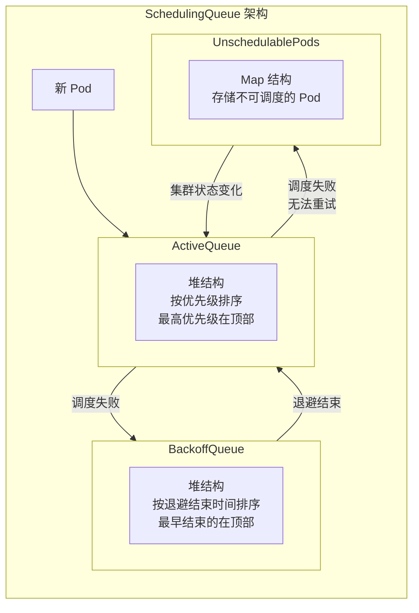
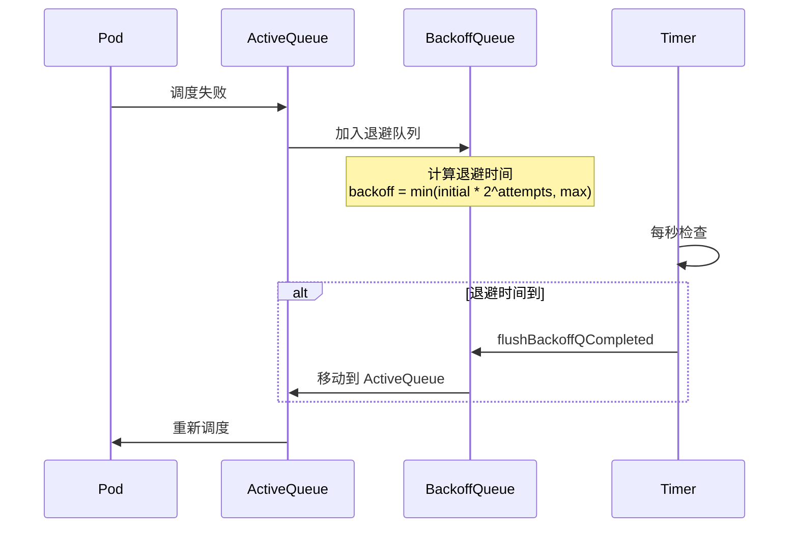

## 概述

SchedulingQueue 是 Kubernetes 调度器的核心数据结构，负责管理待调度的 Pod。它由三个子队列组成：ActiveQueue、BackoffQueue 和 UnschedulablePods，通过优先级和退避机制实现高效的 Pod 调度排序。

## 队列架构

### 三级队列结构



### 队列接口

```go
// pkg/scheduler/internal/queue/scheduling_queue.go

// SchedulingQueue 调度队列接口
type SchedulingQueue interface {
    // 添加 Pod 到队列
    Add(pod *v1.Pod) error

    // 激活多个 Pod
    Activate(pods map[string]*v1.Pod)

    // 添加不可调度的 Pod
    AddUnschedulableIfNotPresent(pInfo *framework.QueuedPodInfo,
        podSchedulingCycle int64) error

    // 获取下一个待调度的 Pod
    Pop() (*framework.QueuedPodInfo, error)

    // 更新 Pod
    Update(oldPod, newPod *v1.Pod) error

    // 删除 Pod
    Delete(pod *v1.Pod) error

    // 将 BackoffQueue 中的 Pod 移到 ActiveQueue
    MoveAllToActiveOrBackoffQueue(event framework.ClusterEvent, preCheck PreEnqueueCheck)

    // 关闭队列
    Close()

    // 队列长度
    Len() int

    // 当前调度周期
    SchedulingCycle() int64

    // 运行状态
    Run()
}
```

## 队列实现

### PriorityQueue 结构

```go
// PriorityQueue 是 SchedulingQueue 的主要实现
type PriorityQueue struct {
    // 同步锁
    lock sync.RWMutex
    cond sync.Cond

    // 活跃队列 - 待调度的 Pod
    activeQ *heap.Heap

    // 退避队列 - 调度失败需要退避的 Pod
    podBackoffQ *heap.Heap

    // 不可调度队列 - 暂时无法调度的 Pod
    unschedulablePods *UnschedulablePods

    // 调度周期
    schedulingCycle int64

    // 移动请求周期
    moveRequestCycle int64

    // 关闭信号
    closed bool

    // 停止通道
    stop chan struct{}

    // 时钟（用于测试）
    clock clock.Clock

    // 初始退避时间
    podInitialBackoffDuration time.Duration

    // 最大退避时间
    podMaxBackoffDuration time.Duration

    // 最长不可调度时间
    podMaxInUnschedulablePodsDuration time.Duration

    // Pod 比较函数
    lessFn framework.LessFunc

    // 名称索引
    podNominator framework.PodNominator

    // 插件名称到移动事件的映射
    clusterEventMap map[framework.ClusterEvent]sets.String

    // 预入队检查
    preEnqueuePluginMap map[string][]framework.PreEnqueuePlugin
}
```

### 初始化

```go
// NewPriorityQueue 创建优先级队列
func NewPriorityQueue(
    lessFn framework.LessFunc,
    informerFactory informers.SharedInformerFactory,
    opts ...Option) *PriorityQueue {

    options := defaultPriorityQueueOptions
    for _, opt := range opts {
        opt(&options)
    }

    pq := &PriorityQueue{
        clock:                            options.clock,
        stop:                             make(chan struct{}),
        podInitialBackoffDuration:        options.podInitialBackoffDuration,
        podMaxBackoffDuration:            options.podMaxBackoffDuration,
        podMaxInUnschedulablePodsDuration: options.podMaxInUnschedulablePodsDuration,
        activeQ:                          heap.NewWithRecorder(podInfoKeyFunc, lessFn, metrics.NewActivePodsRecorder()),
        unschedulablePods:                newUnschedulablePods(metrics.NewUnschedulablePodsRecorder()),
        podNominator:                     options.podNominator,
        clusterEventMap:                  options.clusterEventMap,
        preEnqueuePluginMap:              options.preEnqueuePluginMap,
    }

    pq.cond.L = &pq.lock
    pq.podBackoffQ = heap.NewWithRecorder(podInfoKeyFunc,
        pq.podsCompareBackoffCompleted, metrics.NewBackoffPodsRecorder())

    return pq
}
```

## 队列操作

### 添加 Pod

```go
// Add 添加 Pod 到 ActiveQueue
func (p *PriorityQueue) Add(pod *v1.Pod) error {
    p.lock.Lock()
    defer p.lock.Unlock()

    pInfo := p.newQueuedPodInfo(pod)

    // 运行预入队检查
    if err := p.runPreEnqueuePlugins(context.Background(), pInfo); err != nil {
        return err
    }

    // 添加到 ActiveQueue
    if err := p.activeQ.Add(pInfo); err != nil {
        return err
    }

    // 从其他队列移除（如果存在）
    if p.unschedulablePods.get(pod) != nil {
        p.unschedulablePods.delete(pod)
    }
    p.podBackoffQ.Delete(pInfo)

    // 更新提名节点
    p.podNominator.AddNominatedPod(pInfo.PodInfo, nil)

    // 通知等待的调度器
    p.cond.Broadcast()

    return nil
}
```

### 获取 Pod

```go
// Pop 从 ActiveQueue 获取下一个 Pod
func (p *PriorityQueue) Pop() (*framework.QueuedPodInfo, error) {
    p.lock.Lock()
    defer p.lock.Unlock()

    for p.activeQ.Len() == 0 {
        if p.closed {
            return nil, fmt.Errorf("pq closed")
        }
        // 等待新 Pod
        p.cond.Wait()
    }

    // 从堆顶取出
    obj, err := p.activeQ.Pop()
    if err != nil {
        return nil, err
    }

    pInfo := obj.(*framework.QueuedPodInfo)
    pInfo.Attempts++
    p.schedulingCycle++

    return pInfo, nil
}
```

### 调度失败处理

```go
// AddUnschedulableIfNotPresent 添加到不可调度队列或退避队列
func (p *PriorityQueue) AddUnschedulableIfNotPresent(pInfo *framework.QueuedPodInfo,
    podSchedulingCycle int64) error {

    p.lock.Lock()
    defer p.lock.Unlock()

    pod := pInfo.Pod

    // 检查是否在其他队列
    if p.unschedulablePods.get(pod) != nil {
        return fmt.Errorf("pod %v is already in unschedulable queue", pod.Name)
    }
    if _, exists, _ := p.activeQ.Get(pInfo); exists {
        return fmt.Errorf("pod %v is already in active queue", pod.Name)
    }
    if _, exists, _ := p.podBackoffQ.Get(pInfo); exists {
        return fmt.Errorf("pod %v is already in backoff queue", pod.Name)
    }

    // 检查是否有新的调度尝试在当前周期之后
    if p.moveRequestCycle >= podSchedulingCycle {
        // 有集群事件可能改变调度结果，加入退避队列
        if err := p.podBackoffQ.Add(pInfo); err != nil {
            return err
        }
    } else {
        // 加入不可调度队列
        p.unschedulablePods.addOrUpdate(pInfo)
    }

    p.podNominator.AddNominatedPod(pInfo.PodInfo, nil)

    return nil
}
```

## 退避机制

### 退避计算

```go
// getBackoffTime 计算退避结束时间
func (p *PriorityQueue) getBackoffTime(podInfo *framework.QueuedPodInfo) time.Time {
    // 指数退避
    duration := p.podInitialBackoffDuration
    for i := 1; i < podInfo.Attempts; i++ {
        duration = duration * 2
        if duration > p.podMaxBackoffDuration {
            duration = p.podMaxBackoffDuration
            break
        }
    }

    backoffTime := podInfo.Timestamp.Add(duration)
    return backoffTime
}

// podsCompareBackoffCompleted 比较两个 Pod 的退避结束时间
func (p *PriorityQueue) podsCompareBackoffCompleted(pInfo1, pInfo2 interface{}) bool {
    bo1 := p.getBackoffTime(pInfo1.(*framework.QueuedPodInfo))
    bo2 := p.getBackoffTime(pInfo2.(*framework.QueuedPodInfo))
    return bo1.Before(bo2)
}
```

### 退避流程



### 定时刷新

```go
// flushBackoffQCompleted 将退避完成的 Pod 移到 ActiveQueue
func (p *PriorityQueue) flushBackoffQCompleted() {
    p.lock.Lock()
    defer p.lock.Unlock()

    for {
        rawPodInfo := p.podBackoffQ.Peek()
        if rawPodInfo == nil {
            return
        }

        pInfo := rawPodInfo.(*framework.QueuedPodInfo)
        boTime := p.getBackoffTime(pInfo)

        // 检查是否退避完成
        if boTime.After(p.clock.Now()) {
            return
        }

        // 移动到 ActiveQueue
        _, err := p.podBackoffQ.Pop()
        if err != nil {
            return
        }

        if err := p.activeQ.Add(pInfo); err != nil {
            // 如果添加失败，放回退避队列
            p.podBackoffQ.Add(pInfo)
            return
        }

        p.cond.Broadcast()
    }
}
```

## 集群事件处理

### 事件类型

```go
// ClusterEvent 表示可能影响调度的集群事件
type ClusterEvent struct {
    Resource   GVK
    ActionType ActionType
    Label      string
}

// ActionType 事件动作类型
type ActionType int

const (
    Add ActionType = 1 << iota
    Delete
    Update
    UpdateNodeLabel
    UpdateNodeTaint
    UpdateNodeCondition
)

// 常见事件
var (
    NodeAdd    = ClusterEvent{Resource: Node, ActionType: Add}
    PodDelete  = ClusterEvent{Resource: Pod, ActionType: Delete}
    PvcAdd     = ClusterEvent{Resource: PersistentVolumeClaim, ActionType: Add}
    // ...
)
```

### 事件触发移动

```go
// MoveAllToActiveOrBackoffQueue 将受事件影响的 Pod 移到 Active 或 Backoff 队列
func (p *PriorityQueue) MoveAllToActiveOrBackoffQueue(event framework.ClusterEvent,
    preCheck PreEnqueueCheck) {

    p.lock.Lock()
    defer p.lock.Unlock()

    p.moveRequestCycle = p.schedulingCycle

    // 获取可能被影响的 Pod
    unschedulablePods := p.unschedulablePods.getPodsForEvents(event)

    for _, pInfo := range unschedulablePods {
        pod := pInfo.Pod

        // 运行预检查
        if preCheck != nil && !preCheck(pod) {
            continue
        }

        // 移动到合适的队列
        if p.isPodBackingoff(pInfo) {
            if err := p.podBackoffQ.Add(pInfo); err != nil {
                continue
            }
        } else {
            if err := p.activeQ.Add(pInfo); err != nil {
                continue
            }
        }

        p.unschedulablePods.delete(pod)
    }

    p.cond.Broadcast()
}
```

### 事件映射

```go
// 插件注册其关心的事件
func (pl *NodeAffinity) EventsToRegister() []framework.ClusterEvent {
    return []framework.ClusterEvent{
        {Resource: framework.Node, ActionType: framework.Add | framework.Update},
    }
}

// 队列初始化时建立映射
func buildClusterEventMap(plugins []framework.Plugin) map[framework.ClusterEvent]sets.String {
    eventMap := make(map[framework.ClusterEvent]sets.String)

    for _, pl := range plugins {
        if etr, ok := pl.(framework.EnqueueExtensions); ok {
            for _, event := range etr.EventsToRegister() {
                if eventMap[event] == nil {
                    eventMap[event] = sets.NewString()
                }
                eventMap[event].Insert(pl.Name())
            }
        }
    }

    return eventMap
}
```

## 队列排序

### 优先级排序

```go
// Less 比较两个 Pod 的优先级
func Less(pInfo1, pInfo2 *framework.QueuedPodInfo) bool {
    p1 := corev1helpers.PodPriority(pInfo1.Pod)
    p2 := corev1helpers.PodPriority(pInfo2.Pod)

    // 优先级高的排前面
    if p1 != p2 {
        return p1 > p2
    }

    // 优先级相同时，按创建时间排序
    return pInfo1.Timestamp.Before(pInfo2.Timestamp)
}

// QueueSort 插件实现
type PrioritySort struct{}

func (pl *PrioritySort) Less(pInfo1, pInfo2 *framework.QueuedPodInfo) bool {
    return Less(pInfo1, pInfo2)
}
```

### 堆实现

```go
// Heap 是优先级队列的堆实现
type Heap struct {
    data *heapData
    // 比较函数
    lessFunc LessFunc
}

type heapData struct {
    items map[string]*heapItem
    queue []string
}

type heapItem struct {
    obj   interface{}
    index int
}

// Add 添加元素
func (h *Heap) Add(obj interface{}) error {
    key, _ := h.data.keyFunc(obj)
    if _, exists := h.data.items[key]; exists {
        h.data.items[key].obj = obj
        heap.Fix(h.data, h.data.items[key].index)
    } else {
        h.data.items[key] = &heapItem{obj: obj, index: len(h.data.queue)}
        heap.Push(h.data, key)
    }
    return nil
}

// Pop 弹出最高优先级元素
func (h *Heap) Pop() (interface{}, error) {
    if len(h.data.queue) == 0 {
        return nil, fmt.Errorf("heap is empty")
    }
    key := heap.Pop(h.data).(string)
    item := h.data.items[key]
    delete(h.data.items, key)
    return item.obj, nil
}
```

## 不可调度队列

### 超时刷新

```go
// flushUnschedulablePodsLeftover 将超时的 Pod 移到 BackoffQueue
func (p *PriorityQueue) flushUnschedulablePodsLeftover() {
    p.lock.Lock()
    defer p.lock.Unlock()

    now := p.clock.Now()

    for _, pInfo := range p.unschedulablePods.pods {
        // 检查是否超过最大不可调度时间
        if now.Sub(pInfo.Timestamp) > p.podMaxInUnschedulablePodsDuration {
            // 移动到 BackoffQueue
            if err := p.podBackoffQ.Add(pInfo); err != nil {
                continue
            }
            p.unschedulablePods.delete(pInfo.Pod)
        }
    }
}
```

### 周期性清理

```go
// Run 启动队列的后台任务
func (p *PriorityQueue) Run() {
    // 每秒刷新退避队列
    go wait.Until(p.flushBackoffQCompleted, 1*time.Second, p.stop)

    // 每 30 秒刷新不可调度队列
    go wait.Until(p.flushUnschedulablePodsLeftover, 30*time.Second, p.stop)
}
```

## 监控指标

### 队列指标

| 指标 | 说明 |
|------|------|
| `scheduler_pending_pods` | 各队列中的 Pod 数量 |
| `scheduler_queue_incoming_pods_total` | 入队 Pod 总数 |
| `scheduler_pod_scheduling_attempts` | Pod 调度尝试次数 |
| `scheduler_pod_scheduling_duration_seconds` | Pod 在队列中等待的时间 |

### 指标收集

```go
// metricsRecorder 记录队列指标
type metricsRecorder struct{}

func (m *metricsRecorder) recordIncoming(pod *v1.Pod, event string) {
    metrics.SchedulerQueueIncomingPods.WithLabelValues("active", event).Inc()
}

func (m *metricsRecorder) recordPending(pod *v1.Pod, diff int64) {
    metrics.PendingPods.WithLabelValues("active").Add(float64(diff))
}
```

## 配置参数

```go
// 默认配置
const (
    // 初始退避时间
    DefaultPodInitialBackoffDuration = 1 * time.Second

    // 最大退避时间
    DefaultPodMaxBackoffDuration = 10 * time.Second

    // 最大不可调度时间
    DefaultPodMaxInUnschedulablePodsDuration = 5 * time.Minute
)
```

配置示例：

```yaml
apiVersion: kubescheduler.config.k8s.io/v1
kind: KubeSchedulerConfiguration
podInitialBackoffSeconds: 1
podMaxBackoffSeconds: 10
podMaxUnschedulableQDuration: 5m
```

## 总结

SchedulingQueue 是调度器的核心数据结构：

1. **三级队列**：ActiveQueue、BackoffQueue、UnschedulablePods 协同工作
2. **优先级排序**：高优先级 Pod 优先调度
3. **退避机制**：指数退避避免频繁重试
4. **事件驱动**：集群事件触发 Pod 移动
5. **超时清理**：长期不可调度的 Pod 自动重试

理解队列机制有助于诊断调度延迟和优化调度性能。
