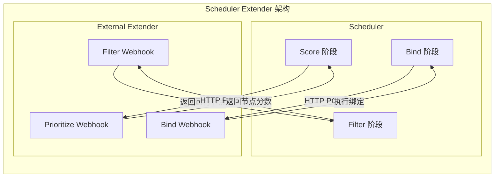

## 概述

Kubernetes 提供了多种方式扩展调度器功能。本文介绍两种主要的扩展机制：Scheduler Extender（调度扩展器）和 Scheduling Framework 插件。Extender 是一种 Webhook 机制，允许外部服务参与调度决策；Framework 插件则是在调度器内部实现的扩展方式。

## Scheduler Extender

### 工作原理



### Extender 配置

```go
// k8s.io/kube-scheduler/config/v1/types.go

// Extender 配置
type Extender struct {
    // Webhook URL 前缀
    URLPrefix string

    // Filter 端点
    FilterVerb string

    // Prioritize 端点
    PrioritizeVerb string

    // Preempt 端点
    PreemptVerb string

    // Bind 端点
    BindVerb string

    // 扩展器是否可以绑定 Pod
    EnableHTTPS bool

    // TLS 配置
    TLSConfig *ExtenderTLSConfig

    // 超时时间
    HTTPTimeout time.Duration

    // 节点缓存能力
    NodeCacheCapable bool

    // 忽略的资源
    ManagedResources []ExtenderManagedResource

    // 是否忽略不可达
    Ignorable bool

    // 权重（用于评分）
    Weight int64
}
```

### 配置示例

```yaml
apiVersion: kubescheduler.config.k8s.io/v1
kind: KubeSchedulerConfiguration
extenders:
- urlPrefix: "http://localhost:8888/"
  filterVerb: "filter"
  prioritizeVerb: "prioritize"
  bindVerb: "bind"
  enableHTTPS: false
  httpTimeout: 5s
  nodeCacheCapable: false
  weight: 1
  managedResources:
  - name: "example.com/gpu"
    ignoredByScheduler: true
  ignorable: false
```

### Extender 接口

```go
// ExtenderArgs 是 Extender 请求参数
type ExtenderArgs struct {
    // 待调度的 Pod
    Pod *v1.Pod

    // 候选节点列表
    Nodes *v1.NodeList

    // 节点名称列表（优化）
    NodeNames *[]string
}

// ExtenderFilterResult 是 Filter 响应
type ExtenderFilterResult struct {
    // 可行节点列表
    Nodes *v1.NodeList

    // 节点名称列表
    NodeNames *[]string

    // 失败节点及原因
    FailedNodes map[string]string

    // 失败且无法通过抢占解决的节点
    FailedAndUnresolvableNodes map[string]string

    // 错误信息
    Error string
}

// HostPriorityList 是 Prioritize 响应
type HostPriorityList []HostPriority

type HostPriority struct {
    Host  string
    Score int64
}

// ExtenderBindingArgs 是 Bind 请求参数
type ExtenderBindingArgs struct {
    PodName      string
    PodNamespace string
    PodUID       types.UID
    Node         string
}
```

### Extender 实现示例

```go
// 简单的 GPU 调度 Extender
package main

import (
    "encoding/json"
    "net/http"

    schedulerapi "k8s.io/kube-scheduler/extender/v1"
)

func main() {
    http.HandleFunc("/filter", filterHandler)
    http.HandleFunc("/prioritize", prioritizeHandler)
    http.ListenAndServe(":8888", nil)
}

func filterHandler(w http.ResponseWriter, r *http.Request) {
    var args schedulerapi.ExtenderArgs
    json.NewDecoder(r.Body).Decode(&args)

    // 过滤逻辑：检查节点是否有足够的 GPU
    var filteredNodes []string
    failedNodes := make(map[string]string)

    for _, node := range *args.NodeNames {
        if hasEnoughGPU(node, args.Pod) {
            filteredNodes = append(filteredNodes, node)
        } else {
            failedNodes[node] = "Insufficient GPU"
        }
    }

    result := schedulerapi.ExtenderFilterResult{
        NodeNames:   &filteredNodes,
        FailedNodes: failedNodes,
    }

    json.NewEncoder(w).Encode(result)
}

func prioritizeHandler(w http.ResponseWriter, r *http.Request) {
    var args schedulerapi.ExtenderArgs
    json.NewDecoder(r.Body).Decode(&args)

    // 评分逻辑：GPU 利用率越低分数越高
    var priorities schedulerapi.HostPriorityList

    for _, node := range *args.NodeNames {
        score := calculateGPUScore(node, args.Pod)
        priorities = append(priorities, schedulerapi.HostPriority{
            Host:  node,
            Score: score,
        })
    }

    json.NewEncoder(w).Encode(priorities)
}
```

### Extender 调用

```go
// pkg/scheduler/core/extender.go

// Filter 调用 Extender 过滤
func (h *HTTPExtender) Filter(pod *v1.Pod,
    nodes []*v1.Node) ([]*v1.Node, extenderv1.FailedNodesMap, error) {

    // 构建请求参数
    args := &extenderv1.ExtenderArgs{
        Pod:   pod,
        Nodes: &v1.NodeList{Items: nodeListToItems(nodes)},
    }

    // 发送 HTTP 请求
    result := &extenderv1.ExtenderFilterResult{}
    if err := h.send(h.filterVerb, args, result); err != nil {
        if h.ignorable {
            return nodes, nil, nil
        }
        return nil, nil, err
    }

    // 处理响应
    return filterResultToNodes(result, nodes)
}

// Prioritize 调用 Extender 评分
func (h *HTTPExtender) Prioritize(pod *v1.Pod,
    nodes []*v1.Node) (*extenderv1.HostPriorityList, int64, error) {

    args := &extenderv1.ExtenderArgs{
        Pod:   pod,
        Nodes: &v1.NodeList{Items: nodeListToItems(nodes)},
    }

    result := &extenderv1.HostPriorityList{}
    if err := h.send(h.prioritizeVerb, args, result); err != nil {
        if h.ignorable {
            return nil, 0, nil
        }
        return nil, 0, err
    }

    return result, h.weight, nil
}
```

## Framework 插件扩展

### Out-of-Tree 插件

可以在调度器外部实现插件，编译成独立的调度器二进制：

```go
package main

import (
    "os"

    "k8s.io/component-base/logs"
    "k8s.io/kubernetes/cmd/kube-scheduler/app"

    // 导入自定义插件
    "example.com/myplugins/nodeannotation"
)

func main() {
    // 创建自定义 Registry
    command := app.NewSchedulerCommand(
        app.WithPlugin(nodeannotation.Name, nodeannotation.New),
    )

    logs.InitLogs()
    defer logs.FlushLogs()

    if err := command.Execute(); err != nil {
        os.Exit(1)
    }
}
```

### 自定义插件实现

```go
// nodeannotation 插件示例
package nodeannotation

import (
    "context"

    v1 "k8s.io/api/core/v1"
    "k8s.io/apimachinery/pkg/runtime"
    "k8s.io/kubernetes/pkg/scheduler/framework"
)

const Name = "NodeAnnotation"

// NodeAnnotation 根据节点注解评分
type NodeAnnotation struct {
    handle framework.Handle
    args   *NodeAnnotationArgs
}

// NodeAnnotationArgs 插件参数
type NodeAnnotationArgs struct {
    // 要检查的注解键
    AnnotationKey string `json:"annotationKey"`
    // 权重
    Weight int64 `json:"weight"`
}

var _ framework.ScorePlugin = &NodeAnnotation{}

func New(obj runtime.Object, h framework.Handle) (framework.Plugin, error) {
    args := &NodeAnnotationArgs{}
    if err := runtime.DecodeInto(
        k8sscheme.Codecs.UniversalDecoder(), obj, args); err != nil {
        return nil, err
    }

    return &NodeAnnotation{
        handle: h,
        args:   args,
    }, nil
}

func (n *NodeAnnotation) Name() string {
    return Name
}

func (n *NodeAnnotation) Score(ctx context.Context,
    state *framework.CycleState, p *v1.Pod,
    nodeName string) (int64, *framework.Status) {

    nodeInfo, err := n.handle.SnapshotSharedLister().NodeInfos().Get(nodeName)
    if err != nil {
        return 0, framework.AsStatus(err)
    }

    node := nodeInfo.Node()

    // 检查注解
    if val, ok := node.Annotations[n.args.AnnotationKey]; ok {
        // 根据注解值计算分数
        score := calculateScore(val)
        return score, nil
    }

    return 0, nil
}

func (n *NodeAnnotation) ScoreExtensions() framework.ScoreExtensions {
    return nil
}
```

### 配置 Out-of-Tree 插件

```yaml
apiVersion: kubescheduler.config.k8s.io/v1
kind: KubeSchedulerConfiguration
profiles:
- schedulerName: my-scheduler
  plugins:
    score:
      enabled:
      - name: NodeAnnotation
        weight: 5
  pluginConfig:
  - name: NodeAnnotation
    args:
      annotationKey: "example.com/node-score"
      weight: 1
```

## Scheduler Plugins 项目

### 概述

[scheduler-plugins](https://github.com/kubernetes-sigs/scheduler-plugins) 是 Kubernetes SIG-Scheduling 维护的扩展插件集合。

### 常用插件

| 插件 | 功能 |
|------|------|
| Coscheduling | 成组调度（Gang Scheduling） |
| Capacityscheduling | 容量调度 |
| NodeResourceTopology | NUMA 感知调度 |
| Trimaran | 基于实际负载的调度 |
| NetworkAware | 网络感知调度 |

### Coscheduling 插件

```go
// 成组调度实现
type Coscheduling struct {
    frameworkHandler framework.Handle
    pgMgr            PodGroupManager
    scheduleTimeout  time.Duration
}

// PreFilter 检查 PodGroup
func (cs *Coscheduling) PreFilter(ctx context.Context,
    state *framework.CycleState, pod *v1.Pod) (*framework.PreFilterResult, *framework.Status) {

    // 获取 PodGroup
    pg, err := cs.pgMgr.GetPodGroup(pod)
    if err != nil || pg == nil {
        return nil, nil
    }

    // 检查 PodGroup 是否有足够的 Pod
    if pg.Status.Running < pg.Spec.MinMember {
        // 等待更多 Pod
        return nil, framework.NewStatus(framework.Unschedulable,
            "waiting for more pods in PodGroup")
    }

    return nil, nil
}

// Permit 实现等待机制
func (cs *Coscheduling) Permit(ctx context.Context,
    state *framework.CycleState, pod *v1.Pod,
    nodeName string) (*framework.Status, time.Duration) {

    pg, err := cs.pgMgr.GetPodGroup(pod)
    if err != nil || pg == nil {
        return nil, 0
    }

    // 检查是否所有 Pod 都已找到节点
    if cs.pgMgr.AllPodsScheduled(pg) {
        // 允许所有等待的 Pod
        cs.frameworkHandler.IterateOverWaitingPods(func(wp framework.WaitingPod) {
            if belongsToSamePodGroup(wp.GetPod(), pg) {
                wp.Allow(cs.Name())
            }
        })
        return nil, 0
    }

    // 等待其他 Pod
    return framework.NewStatus(framework.Wait), cs.scheduleTimeout
}
```

## Extender vs Framework 插件

### 对比

| 特性 | Extender | Framework 插件 |
|------|----------|---------------|
| 部署方式 | 独立服务 | 编译到调度器 |
| 性能 | 网络开销 | 内存调用 |
| 扩展点 | Filter/Prioritize/Bind | 所有扩展点 |
| 状态共享 | 无 | CycleState |
| 维护成本 | 高 | 低 |
| 版本兼容 | 需要单独维护 | 随调度器升级 |

### 选择建议

**使用 Extender 的场景**：
- 需要集成外部系统（如自定义资源管理器）
- 不希望修改调度器代码
- 需要快速原型验证

**使用 Framework 插件的场景**：
- 需要高性能
- 需要使用多个扩展点
- 需要与其他插件共享状态
- 生产环境部署

## 多调度器

### 部署多个调度器

```yaml
apiVersion: apps/v1
kind: Deployment
metadata:
  name: my-scheduler
spec:
  replicas: 1
  selector:
    matchLabels:
      component: my-scheduler
  template:
    spec:
      containers:
      - name: scheduler
        image: my-scheduler:v1.0
        command:
        - /scheduler
        - --config=/etc/kubernetes/scheduler-config.yaml
        - --leader-elect=true
        - --leader-elect-resource-name=my-scheduler
```

### Pod 指定调度器

```yaml
apiVersion: v1
kind: Pod
metadata:
  name: my-pod
spec:
  schedulerName: my-scheduler  # 指定使用的调度器
  containers:
  - name: nginx
    image: nginx
```

## 调试扩展

### Extender 调试

```bash
# 启用 Extender 详细日志
kube-scheduler --v=4

# 监控 Extender 调用
kubectl logs -n kube-system kube-scheduler | grep -i extender
```

### 插件调试

```go
// 在插件中添加日志
func (p *MyPlugin) Filter(ctx context.Context, state *framework.CycleState,
    pod *v1.Pod, nodeInfo *framework.NodeInfo) *framework.Status {

    klog.V(4).InfoS("Running Filter plugin",
        "plugin", p.Name(),
        "pod", klog.KObj(pod),
        "node", nodeInfo.Node().Name)

    // ...
}
```

## 总结

Kubernetes 调度器扩展机制提供了灵活的定制能力：

1. **Extender**：Webhook 方式，易于集成外部系统，但有网络开销
2. **Framework 插件**：编译方式，高性能，功能完整
3. **Scheduler Plugins**：社区维护的扩展插件集合
4. **多调度器**：支持运行多个调度器实例

选择合适的扩展方式取决于具体需求和运维能力。对于生产环境，推荐使用 Framework 插件方式。
