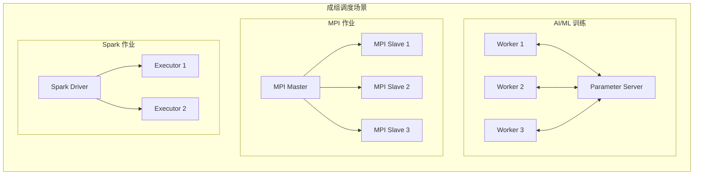
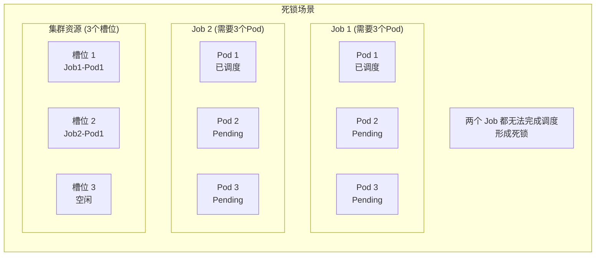
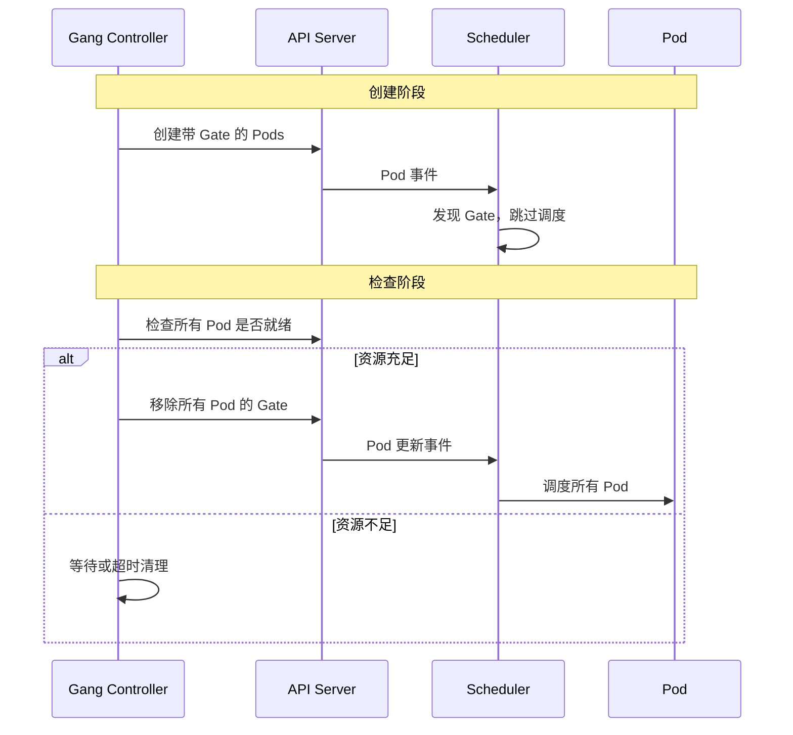
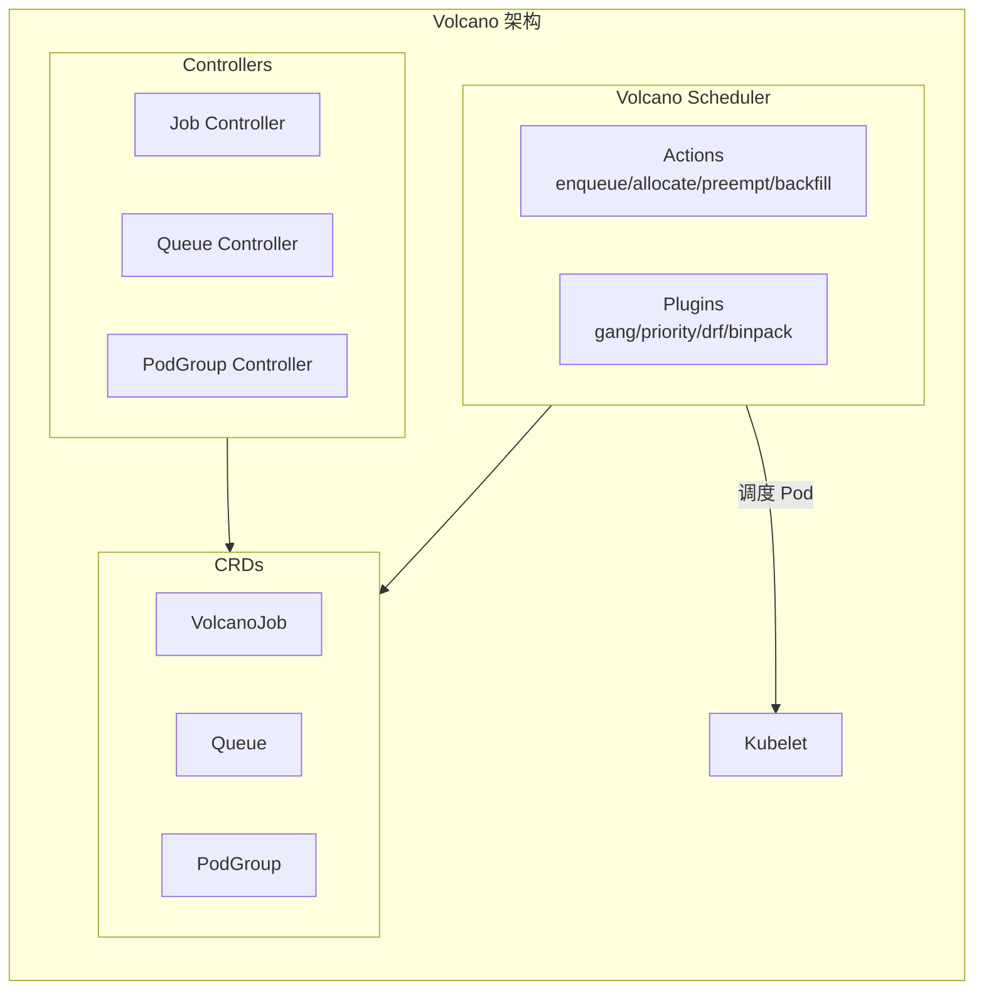
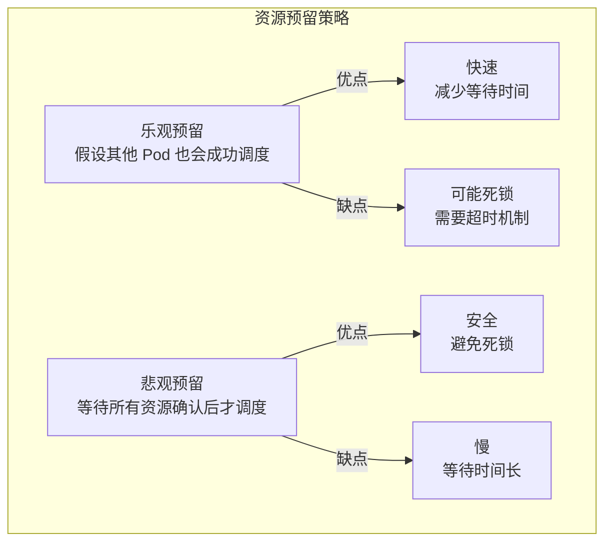

## 概述

成组调度（Gang Scheduling）是一种调度策略，要求一组相关的 Pod 同时被调度或都不被调度。这种"全或无"（All-or-Nothing）的语义对于分布式计算场景尤为重要，如 AI/ML 训练、MPI 作业等需要多个 Pod 协同工作的场景。

## 使用场景

### 典型场景



### 问题场景

不使用成组调度可能导致死锁：



## 实现方式

### 方式对比

| 方式 | 说明 | 适用场景 |
|------|------|----------|
| SchedulingGates | 原生 K8s 特性，通过 Gate 阻止调度 | 简单场景 |
| Coscheduling 插件 | Scheduler Plugins 项目 | 通用场景 |
| Volcano | 专门的批处理调度器 | 大规模批处理 |
| Koordinator | 混部调度器 | 混合云场景 |

## SchedulingGates

### 工作原理

SchedulingGates 是 Kubernetes 1.26+ 的原生特性：

```yaml
apiVersion: v1
kind: Pod
metadata:
  name: pod-with-gate
spec:
  schedulingGates:
  - name: "example.com/gang-ready"  # 阻止调度直到 Gate 被移除
  containers:
  - name: app
    image: nginx
```

### 使用流程



### Controller 实现

```go
// GangController 管理 PodGroup 的调度 Gate
type GangController struct {
    kubeClient kubernetes.Interface
    podLister  corelisters.PodLister
}

// Reconcile 检查 PodGroup 并管理 Gate
func (c *GangController) Reconcile(ctx context.Context, pg *PodGroup) error {
    // 获取属于该 PodGroup 的所有 Pods
    pods, err := c.getPodGroupPods(pg)
    if err != nil {
        return err
    }

    // 检查是否有足够的 Pod
    if len(pods) < pg.Spec.MinMember {
        return nil // 等待更多 Pod
    }

    // 检查资源是否充足（简化版）
    if !c.hasEnoughResources(pg, pods) {
        return nil // 等待资源
    }

    // 移除所有 Pod 的 SchedulingGate
    for _, pod := range pods {
        if hasSchedulingGate(pod, gangGateName) {
            if err := c.removeSchedulingGate(ctx, pod, gangGateName); err != nil {
                return err
            }
        }
    }

    return nil
}

// removeSchedulingGate 移除 Pod 的 SchedulingGate
func (c *GangController) removeSchedulingGate(ctx context.Context,
    pod *v1.Pod, gateName string) error {

    newGates := []v1.PodSchedulingGate{}
    for _, gate := range pod.Spec.SchedulingGates {
        if gate.Name != gateName {
            newGates = append(newGates, gate)
        }
    }

    patch := []byte(fmt.Sprintf(
        `{"spec":{"schedulingGates":%s}}`,
        toJSON(newGates)))

    _, err := c.kubeClient.CoreV1().Pods(pod.Namespace).Patch(
        ctx, pod.Name, types.StrategicMergePatchType, patch,
        metav1.PatchOptions{})

    return err
}
```

## Coscheduling 插件

### PodGroup CRD

```yaml
apiVersion: scheduling.sigs.k8s.io/v1alpha1
kind: PodGroup
metadata:
  name: training-job
spec:
  # 最小成员数
  minMember: 4
  # 调度超时
  scheduleTimeoutSeconds: 600
  # 最小资源
  minResources:
    cpu: "4"
    memory: "8Gi"
    nvidia.com/gpu: "2"
status:
  # 当前阶段
  phase: Running
  # 已调度数
  scheduled: 4
  # 运行中数
  running: 4
```

### Pod 关联 PodGroup

```yaml
apiVersion: v1
kind: Pod
metadata:
  name: worker-0
  labels:
    pod-group.scheduling.sigs.k8s.io/name: training-job
spec:
  containers:
  - name: worker
    image: training:v1
```

### 插件实现

```go
// pkg/coscheduling/coscheduling.go

// Coscheduling 成组调度插件
type Coscheduling struct {
    frameworkHandle framework.Handle
    pgClient        pgclientset.Interface
    pgLister        pglister.PodGroupLister
    scheduleTimeout time.Duration
    clock           clock.Clock
}

// PreFilter 检查 PodGroup 状态
func (cs *Coscheduling) PreFilter(ctx context.Context,
    cycleState *framework.CycleState, pod *v1.Pod) (*framework.PreFilterResult, *framework.Status) {

    // 获取 PodGroup
    pg, err := cs.getPodGroup(pod)
    if err != nil {
        return nil, framework.AsStatus(err)
    }
    if pg == nil {
        return nil, nil // 不属于 PodGroup
    }

    // 检查 PodGroup 是否处于调度中
    if pg.Status.Phase == v1alpha1.PodGroupScheduling {
        // 检查超时
        if cs.isTimeout(pg) {
            return nil, framework.NewStatus(framework.Unschedulable,
                "PodGroup scheduling timeout")
        }
    }

    // 保存状态
    state := &stateData{
        podGroup: pg,
    }
    cycleState.Write(StateKey, state)

    return nil, nil
}

// PostFilter 抢占处理
func (cs *Coscheduling) PostFilter(ctx context.Context,
    cycleState *framework.CycleState, pod *v1.Pod,
    filteredNodeStatusMap framework.NodeToStatusMap) (*framework.PostFilterResult, *framework.Status) {

    state, err := getStateData(cycleState)
    if err != nil || state.podGroup == nil {
        return nil, framework.NewStatus(framework.Unschedulable)
    }

    // Gang 调度不支持部分抢占
    // 要么全部成功，要么全部失败
    return nil, framework.NewStatus(framework.Unschedulable,
        "gang scheduling does not support partial preemption")
}

// Permit 等待所有 Pod 调度完成
func (cs *Coscheduling) Permit(ctx context.Context,
    cycleState *framework.CycleState, pod *v1.Pod,
    nodeName string) (*framework.Status, time.Duration) {

    state, err := getStateData(cycleState)
    if err != nil || state.podGroup == nil {
        return nil, 0
    }

    pg := state.podGroup

    // 增加等待计数
    cs.incrementWaiting(pg)

    // 检查是否所有 Pod 都已找到节点
    if cs.allPodsReady(pg) {
        // 允许所有等待的 Pod
        cs.allowAll(pg)
        return nil, 0
    }

    // 返回等待状态
    waitTime := cs.calculateWaitTime(pg)
    return framework.NewStatus(framework.Wait), waitTime
}

// Reserve 预留资源
func (cs *Coscheduling) Reserve(ctx context.Context,
    cycleState *framework.CycleState, pod *v1.Pod, nodeName string) *framework.Status {

    state, err := getStateData(cycleState)
    if err != nil || state.podGroup == nil {
        return nil
    }

    // 更新 PodGroup 状态
    cs.updatePodGroupStatus(state.podGroup, v1alpha1.PodGroupScheduling)

    return nil
}

// PostBind 更新 PodGroup 状态
func (cs *Coscheduling) PostBind(ctx context.Context,
    state *framework.CycleState, pod *v1.Pod, nodeName string) {

    stateData, err := getStateData(state)
    if err != nil || stateData.podGroup == nil {
        return
    }

    // 增加已调度计数
    cs.incrementScheduled(stateData.podGroup)

    // 检查是否全部调度完成
    if cs.allPodsScheduled(stateData.podGroup) {
        cs.updatePodGroupStatus(stateData.podGroup, v1alpha1.PodGroupScheduled)
    }
}
```

### 等待机制

```go
// allowAll 允许 PodGroup 中所有等待的 Pod
func (cs *Coscheduling) allowAll(pg *v1alpha1.PodGroup) {
    pgKey := getPodGroupKey(pg)

    // 遍历所有等待的 Pod
    cs.frameworkHandle.IterateOverWaitingPods(func(wp framework.WaitingPod) {
        // 检查是否属于同一 PodGroup
        pod := wp.GetPod()
        if belongsToPodGroup(pod, pg) {
            // 允许调度
            wp.Allow(cs.Name())
        }
    })
}

// 超时处理
func (cs *Coscheduling) handleTimeout(pg *v1alpha1.PodGroup) {
    pgKey := getPodGroupKey(pg)

    // 拒绝所有等待的 Pod
    cs.frameworkHandle.IterateOverWaitingPods(func(wp framework.WaitingPod) {
        pod := wp.GetPod()
        if belongsToPodGroup(pod, pg) {
            wp.Reject(cs.Name(), "PodGroup scheduling timeout")
        }
    })

    // 更新 PodGroup 状态为失败
    cs.updatePodGroupStatus(pg, v1alpha1.PodGroupScheduleFailed)
}
```

## Volcano

### 概述

Volcano 是 CNCF 的批处理调度系统，专为高性能计算设计。

### 架构



### VolcanoJob 示例

```yaml
apiVersion: batch.volcano.sh/v1alpha1
kind: Job
metadata:
  name: tensorflow-dist
spec:
  minAvailable: 3
  schedulerName: volcano
  queue: default
  tasks:
  - name: ps
    replicas: 1
    policies:
    - event: TaskCompleted
      action: CompleteJob
    template:
      spec:
        containers:
        - name: tensorflow
          image: tensorflow/tensorflow:2.3.0
          command: ["python", "train.py", "--role=ps"]
  - name: worker
    replicas: 2
    template:
      spec:
        containers:
        - name: tensorflow
          image: tensorflow/tensorflow:2.3.0
          resources:
            limits:
              nvidia.com/gpu: 1
          command: ["python", "train.py", "--role=worker"]
```

### Volcano 调度流程

```go
// Gang Plugin 实现
type gangPlugin struct {
    // ...
}

// OnSessionOpen 会话开始时的初始化
func (gp *gangPlugin) OnSessionOpen(ssn *Session) {
    // 注册 PredicateFn
    ssn.AddPredicateFn(gp.Name(), func(task *api.TaskInfo, node *api.NodeInfo) error {
        // 检查 Job 是否满足 minAvailable
        job := ssn.Jobs[task.Job]
        if job.PodGroup.Spec.MinMember > 0 {
            if job.ReadyTaskNum() < job.PodGroup.Spec.MinMember {
                return fmt.Errorf("job %s not enough ready tasks", job.Name)
            }
        }
        return nil
    })

    // 注册 JobOrderFn - Gang 就绪的 Job 优先
    ssn.AddJobOrderFn(gp.Name(), func(l, r interface{}) int {
        lJob := l.(*api.JobInfo)
        rJob := r.(*api.JobInfo)

        lGangReady := isGangReady(lJob)
        rGangReady := isGangReady(rJob)

        if lGangReady && !rGangReady {
            return -1
        }
        if !lGangReady && rGangReady {
            return 1
        }
        return 0
    })
}
```

## 资源预留

### 预留策略



### 实现方式

```go
// Reserve 阶段预留资源
func (cs *Coscheduling) Reserve(ctx context.Context,
    cycleState *framework.CycleState, pod *v1.Pod, nodeName string) *framework.Status {

    state, _ := getStateData(cycleState)
    pg := state.podGroup

    // 记录预留信息
    cs.reservations[pg.Name] = append(cs.reservations[pg.Name], Reservation{
        Pod:      pod,
        Node:     nodeName,
        Reserved: time.Now(),
    })

    return nil
}

// Unreserve 回滚预留
func (cs *Coscheduling) Unreserve(ctx context.Context,
    cycleState *framework.CycleState, pod *v1.Pod, nodeName string) {

    state, _ := getStateData(cycleState)
    pg := state.podGroup

    // 移除预留
    cs.removeReservation(pg.Name, pod)

    // 如果预留失败，通知所有等待的 Pod
    cs.rejectAll(pg, "resource reservation failed")
}
```

## 监控与调试

### 关键指标

| 指标 | 说明 |
|------|------|
| `podgroup_scheduling_duration_seconds` | PodGroup 调度耗时 |
| `podgroup_scheduling_timeout_total` | PodGroup 调度超时数 |
| `podgroup_waiting_pods` | 等待中的 Pod 数 |

### 调试命令

```bash
# 查看 PodGroup 状态
kubectl get podgroups -A

# 查看 PodGroup 详情
kubectl describe podgroup <name>

# 查看 Volcano Job
kubectl get vcjob -A

# 查看调度事件
kubectl get events --field-selector reason=Coscheduling
```

## 最佳实践

### 设置合理的超时

```yaml
apiVersion: scheduling.sigs.k8s.io/v1alpha1
kind: PodGroup
metadata:
  name: training-job
spec:
  minMember: 4
  scheduleTimeoutSeconds: 300  # 5 分钟超时
```

### 配合 PriorityClass

```yaml
apiVersion: scheduling.k8s.io/v1
kind: PriorityClass
metadata:
  name: training-high
value: 1000000
---
apiVersion: v1
kind: Pod
metadata:
  name: worker
  labels:
    pod-group.scheduling.sigs.k8s.io/name: training-job
spec:
  priorityClassName: training-high
```

### 资源配额

```yaml
apiVersion: scheduling.sigs.k8s.io/v1alpha1
kind: PodGroup
metadata:
  name: training-job
spec:
  minMember: 4
  minResources:
    cpu: "16"
    memory: "32Gi"
    nvidia.com/gpu: "4"
```

## 总结

成组调度是分布式计算场景的关键功能：

1. **场景**：AI/ML 训练、MPI 作业、Spark 作业等需要多 Pod 协同的场景
2. **实现**：SchedulingGates、Coscheduling 插件、Volcano 等多种方式
3. **关键机制**：PodGroup 管理、Permit 等待、资源预留、超时处理
4. **挑战**：死锁避免、资源碎片、调度延迟

根据具体场景选择合适的成组调度方案，并注意配置合理的超时和资源限制。
