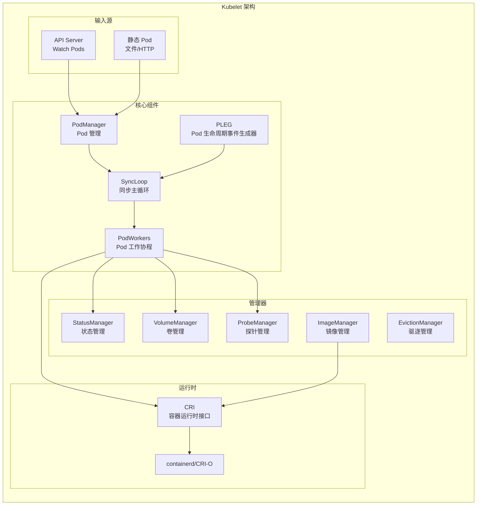
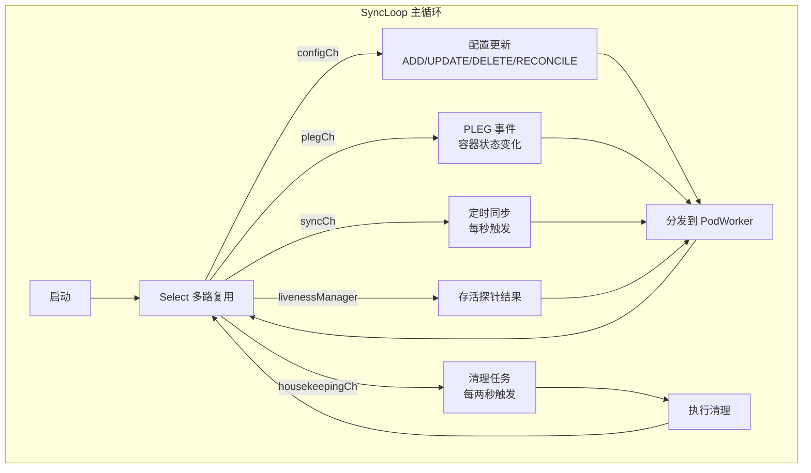
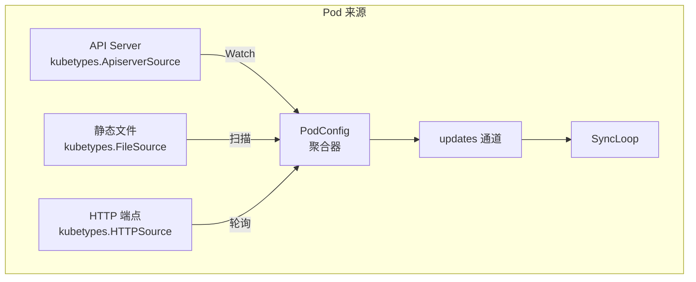

## 概述

Kubelet 是运行在每个 Kubernetes 节点上的主要代理程序，负责管理节点上的 Pod 和容器。它监听 API Server 获取分配给本节点的 Pod 规格，确保这些 Pod 中的容器按照规格运行，并向 API Server 报告节点和 Pod 的状态。

## 核心职责

Kubelet 的主要职责包括：

1. **Pod 生命周期管理**：创建、启动、停止和删除 Pod 中的容器
2. **节点状态上报**：定期向 API Server 报告节点状态和资源信息
3. **容器健康检查**：执行存活探针、就绪探针和启动探针
4. **资源管理**：管理 CPU、内存等资源的分配和限制
5. **卷管理**：挂载和卸载 Pod 所需的存储卷
6. **镜像管理**：拉取容器镜像，清理未使用的镜像

## 整体架构



## 源码结构

Kubelet 的主要代码位于以下目录：

```
cmd/kubelet/                    # 入口
├── app/
│   ├── server.go              # 启动逻辑
│   └── options/               # 命令行参数

pkg/kubelet/                    # 核心实现
├── kubelet.go                 # Kubelet 主结构
├── kubelet_pods.go            # Pod 管理
├── pod_workers.go             # Pod Worker
├── pleg/                      # PLEG
├── cm/                        # 容器管理器
├── kuberuntime/               # CRI 运行时
├── volumemanager/             # 卷管理
├── prober/                    # 探针
├── eviction/                  # 驱逐
├── images/                    # 镜像管理
├── status/                    # 状态管理
└── config/                    # Pod 配置源
```

## Kubelet 核心结构

### 主结构定义

```go
// pkg/kubelet/kubelet.go

// Kubelet 是节点代理的主结构
type Kubelet struct {
    // 配置
    kubeletConfiguration kubeletconfiginternal.KubeletConfiguration

    // 节点名称
    nodeName types.NodeName

    // 客户端
    kubeClient clientset.Interface
    heartbeatClient clientset.Interface

    // Pod 来源（API Server、静态文件等）
    podConfig *config.PodConfig

    // Pod 管理器
    podManager kubepod.Manager

    // 状态管理器
    statusManager status.Manager

    // 卷管理器
    volumeManager volumemanager.VolumeManager

    // 探针管理器
    probeManager prober.Manager

    // 容器运行时
    containerRuntime kubecontainer.Runtime

    // 镜像管理
    imageManager images.ImageGCManager

    // 容器管理器（cgroup）
    containerManager cm.ContainerManager

    // 驱逐管理器
    evictionManager eviction.Manager

    // PLEG
    pleg pleg.PodLifecycleEventGenerator

    // Pod Worker
    podWorkers PodWorkers

    // 节点信息
    nodeLister corelisters.NodeLister
    nodeInfo   *v1.Node

    // 时钟
    clock clock.WithTicker

    // 记录器
    recorder record.EventRecorder

    // 缓存
    podCache kubecontainer.Cache

    // 同步控制
    workQueue queue.WorkQueue
    podKiller podKiller
}
```

### 核心组件

| 组件 | 职责 |
|------|------|
| PodConfig | 聚合多个 Pod 来源的配置 |
| PodManager | 管理 Pod 的内存存储 |
| PodWorkers | 为每个 Pod 运行同步协程 |
| PLEG | 监控容器状态变化，生成事件 |
| StatusManager | 同步 Pod 状态到 API Server |
| VolumeManager | 管理 Pod 的卷挂载 |
| ProbeManager | 执行容器健康检查 |
| ContainerManager | 管理 cgroup 和资源 |
| EvictionManager | 资源压力时驱逐 Pod |

## 启动流程

### 入口函数

```go
// cmd/kubelet/app/server.go

// Run 启动 Kubelet
func Run(ctx context.Context, s *options.KubeletServer,
    kubeDeps *kubelet.Dependencies) error {

    // 1. 加载配置
    kubeletConfig, err := loadConfig(s)
    if err != nil {
        return err
    }

    // 2. 初始化依赖
    if kubeDeps == nil {
        kubeDeps, err = UnsecuredDependencies(s, kubeletConfig)
        if err != nil {
            return err
        }
    }

    // 3. 运行 Kubelet
    if err := run(ctx, s, kubeDeps, kubeletConfig); err != nil {
        return err
    }

    return nil
}

// run 执行 Kubelet 主逻辑
func run(ctx context.Context, s *options.KubeletServer,
    kubeDeps *kubelet.Dependencies, kubeletConfig *kubeletconfiginternal.KubeletConfiguration) error {

    // 1. 设置节点名称
    hostName, err := nodeutil.GetHostname(s.HostnameOverride)
    nodeName := types.NodeName(hostName)

    // 2. 创建客户端
    kubeClient, err := createKubeClient(kubeletConfig)
    heartbeatClient, err := createHeartbeatClient(kubeletConfig)

    // 3. 创建 Kubelet 实例
    k, err := createAndInitKubelet(kubeletConfig, kubeDeps,
        nodeName, kubeClient, heartbeatClient)

    // 4. 启动 Kubelet
    startKubelet(k, podCfg, kubeletConfig, kubeDeps, enableServer)

    return nil
}
```

### Kubelet 初始化

```go
// NewMainKubelet 创建 Kubelet 实例
func NewMainKubelet(kubeCfg *kubeletconfiginternal.KubeletConfiguration,
    kubeDeps *Dependencies, ...) (*Kubelet, error) {

    // 1. 创建基础组件
    klet := &Kubelet{
        kubeletConfiguration: *kubeCfg,
        nodeName:             nodeName,
        kubeClient:           kubeClient,
        clock:                clock.RealClock{},
    }

    // 2. 创建容器运行时
    runtime, err := kuberuntime.NewKubeGenericRuntimeManager(
        kubecontainer.FilterEventRecorder(recorder),
        klet.livenessManager,
        klet.startupManager,
        klet.runtimeClassManager,
        containerRefManager,
        machineInfo,
        klet,
        osInterface,
        klet,
        httpClient,
        imageBackOff,
        kubeCfg.SerializeImagePulls,
        kubeCfg.MaxParallelImagePulls,
        imageCredentialProviderConfigFile,
        imageCredentialProviderBinDir,
        klet.runtimeService,
        klet.imageService,
    )
    klet.containerRuntime = runtime

    // 3. 创建 PLEG
    klet.pleg = pleg.NewGenericPLEG(
        klet.containerRuntime,
        plegChannelCapacity,
        plegRelistPeriod,
        klet.podCache,
        clock.RealClock{},
    )

    // 4. 创建管理器
    klet.statusManager = status.NewManager(klet.kubeClient, klet.podManager, klet)
    klet.probeManager = prober.NewManager(...)
    klet.volumeManager = volumemanager.NewVolumeManager(...)
    klet.evictionManager = eviction.NewManager(...)

    // 5. 创建 Pod Worker
    klet.podWorkers = newPodWorkers(
        klet.syncPod,
        klet.syncTerminatingPod,
        klet.syncTerminatedPod,
        recorder,
        workQueue,
        klet.resyncInterval,
        backOffPeriod,
        klet.podCache,
    )

    return klet, nil
}
```

### 启动组件

```go
// Run 启动 Kubelet 的所有组件
func (kl *Kubelet) Run(updates <-chan kubetypes.PodUpdate) {
    // 1. 初始化模块
    if err := kl.initializeModules(); err != nil {
        klog.Fatalf("failed to initialize modules: %v", err)
    }

    // 2. 启动卷管理器
    go kl.volumeManager.Run(kl.sourcesReady, wait.NeverStop)

    // 3. 启动节点状态同步
    if kl.kubeClient != nil {
        go kl.syncNodeStatus()
    }

    // 4. 启动 Lease 续约
    go kl.nodeLeaseController.Run(wait.NeverStop)

    // 5. 启动 PLEG
    kl.pleg.Start()

    // 6. 启动状态管理器
    kl.statusManager.Start()

    // 7. 启动探针管理器
    kl.probeManager.Start()

    // 8. 启动驱逐管理器
    go kl.evictionManager.Start(kl, kl.podResourcesAreReclaimed, evictionMonitoringPeriod)

    // 9. 启动同步主循环
    kl.syncLoop(updates, kl)
}
```

## 同步主循环

### SyncLoop 结构



### SyncLoop 实现

```go
// syncLoop 是 Kubelet 的主同步循环
func (kl *Kubelet) syncLoop(updates <-chan kubetypes.PodUpdate, handler SyncHandler) {
    klog.Info("Starting kubelet main sync loop")

    // 定时器
    syncTicker := time.NewTicker(time.Second)
    defer syncTicker.Stop()
    housekeepingTicker := time.NewTicker(housekeepingPeriod)
    defer housekeepingTicker.Stop()

    // PLEG 通道
    plegCh := kl.pleg.Watch()

    for {
        if !kl.syncLoopIteration(updates, handler, syncTicker.C,
            housekeepingTicker.C, plegCh) {
            break
        }
    }
}

// syncLoopIteration 执行一次同步迭代
func (kl *Kubelet) syncLoopIteration(configCh <-chan kubetypes.PodUpdate,
    handler SyncHandler,
    syncCh <-chan time.Time,
    housekeepingCh <-chan time.Time,
    plegCh <-chan *pleg.PodLifecycleEvent) bool {

    select {
    case u, open := <-configCh:
        // Pod 配置更新
        if !open {
            return false
        }

        switch u.Op {
        case kubetypes.ADD:
            handler.HandlePodAdditions(u.Pods)
        case kubetypes.UPDATE:
            handler.HandlePodUpdates(u.Pods)
        case kubetypes.DELETE:
            handler.HandlePodRemovals(u.Pods)
        case kubetypes.RECONCILE:
            handler.HandlePodReconcile(u.Pods)
        case kubetypes.SET:
            // 完整替换 Pod 列表
        }

    case e := <-plegCh:
        // PLEG 事件：容器状态变化
        if isSyncPodWorthy(e) {
            if pod, ok := kl.podManager.GetPodByUID(e.ID); ok {
                handler.HandlePodSyncs([]*v1.Pod{pod})
            }
        }

        if e.Type == pleg.ContainerDied {
            // 容器死亡，重新同步
            if containerID, ok := e.Data.(string); ok {
                kl.cleanUpContainersInPod(e.ID, containerID)
            }
        }

    case <-syncCh:
        // 定时同步
        podsToSync := kl.getPodsToSync()
        if len(podsToSync) > 0 {
            handler.HandlePodSyncs(podsToSync)
        }

    case <-housekeepingCh:
        // 清理任务
        if !kl.sourcesReady.AllReady() {
            klog.V(4).Info("Skipping housekeeping, sources not ready")
        } else {
            if err := handler.HandlePodCleanups(); err != nil {
                klog.Error("Failed cleaning pods: ", err)
            }
        }

    case update := <-kl.livenessManager.Updates():
        // 存活探针失败
        if update.Result == proberesults.Failure {
            handleLivenessFailure(update.PodUID, update.ContainerID)
        }
    }

    return true
}
```

## Pod 来源

### 配置聚合

```go
// pkg/kubelet/config/config.go

// PodConfig 聚合多个 Pod 来源
type PodConfig struct {
    pods *podStorage
    mux  *config.Mux

    // 更新通道
    updates chan kubetypes.PodUpdate

    // 已注册的来源
    sourcesLock sync.Mutex
    sources     sets.String
}

// Channel 返回 Pod 更新通道
func (c *PodConfig) Channel(source string) chan<- interface{} {
    c.sourcesLock.Lock()
    defer c.sourcesLock.Unlock()
    c.sources.Insert(source)
    return c.mux.Channel(source)
}

// Updates 返回聚合后的更新通道
func (c *PodConfig) Updates() <-chan kubetypes.PodUpdate {
    return c.updates
}
```

### Pod 来源类型



### API Server 源

```go
// NewSourceApiserver 创建 API Server Pod 来源
func NewSourceApiserver(c clientset.Interface, nodeName types.NodeName,
    updates chan<- interface{}) {

    lw := cache.NewListWatchFromClient(
        c.CoreV1().RESTClient(),
        "pods",
        metav1.NamespaceAll,
        fields.OneTermEqualSelector("spec.nodeName", string(nodeName)),
    )

    // 使用 Reflector 监听
    newSourceApiserverFromLW(lw, updates)
}
```

## 监控指标

### 关键指标

| 指标 | 说明 |
|------|------|
| `kubelet_running_pods` | 运行中的 Pod 数 |
| `kubelet_running_containers` | 运行中的容器数 |
| `kubelet_pod_start_duration_seconds` | Pod 启动耗时 |
| `kubelet_pod_worker_duration_seconds` | Pod Worker 处理耗时 |
| `kubelet_pleg_relist_duration_seconds` | PLEG 重列耗时 |
| `kubelet_node_status_update_total` | 节点状态更新次数 |

## 配置参数

### 关键配置

```yaml
apiVersion: kubelet.config.k8s.io/v1beta1
kind: KubeletConfiguration
# 同步频率
syncFrequency: 1m
# 文件检查频率
fileCheckFrequency: 20s
# HTTP 检查频率
httpCheckFrequency: 20s
# 节点状态更新频率
nodeStatusUpdateFrequency: 10s
# 镜像 GC 高阈值
imageGCHighThresholdPercent: 85
# 镜像 GC 低阈值
imageGCLowThresholdPercent: 80
# 驱逐阈值
evictionHard:
  memory.available: "100Mi"
  nodefs.available: "10%"
  imagefs.available: "15%"
```

## 总结

Kubelet 是 Kubernetes 节点上最关键的组件：

1. **多源配置**：支持 API Server、静态文件、HTTP 等多种 Pod 来源
2. **主循环**：SyncLoop 协调所有组件，处理各类事件
3. **组件协作**：PLEG、VolumeManager、ProbeManager 等组件协同工作
4. **资源管理**：通过 ContainerManager 管理 cgroup 资源
5. **状态同步**：StatusManager 保持 Pod 状态与 API Server 一致

理解 Kubelet 架构是深入研究节点管理和 Pod 生命周期的基础。
