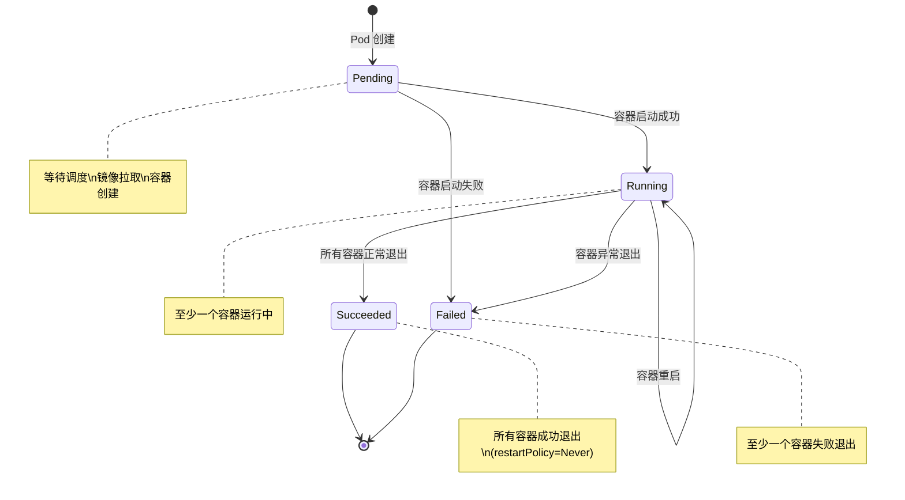
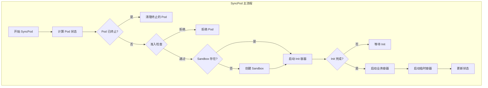
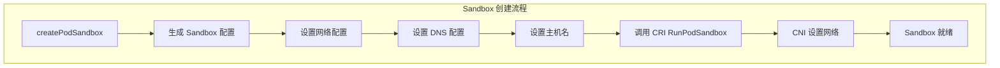
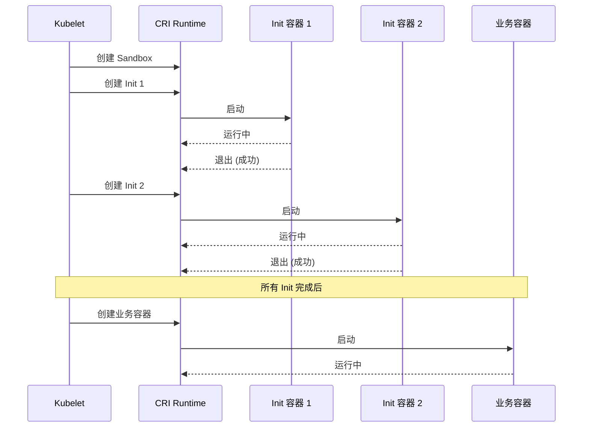
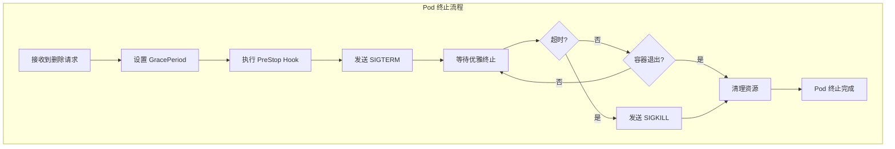

## 概述

Pod 生命周期管理是 Kubelet 的核心功能。从 Pod 被调度到节点开始，Kubelet 负责创建 Pod 中的容器、监控其运行状态、处理重启逻辑，直到最终清理 Pod。本文详细解析 Pod 在节点上的完整生命周期。

## Pod 状态机

### Phase 状态



### Pod Phase 定义

```go
// Pod 阶段
const (
    // PodPending 表示 Pod 已被接受但容器尚未创建
    PodPending PodPhase = "Pending"

    // PodRunning 表示 Pod 已绑定到节点，至少一个容器运行中
    PodRunning PodPhase = "Running"

    // PodSucceeded 表示所有容器成功终止
    PodSucceeded PodPhase = "Succeeded"

    // PodFailed 表示所有容器终止，至少一个失败
    PodFailed PodPhase = "Failed"

    // PodUnknown 表示无法获取 Pod 状态
    PodUnknown PodPhase = "Unknown"
)
```

## SyncPod 流程

### 主流程



### SyncPod 函数

```go
// pkg/kubelet/kubelet_pods.go

// SyncPod 同步单个 Pod
func (kl *Kubelet) SyncPod(ctx context.Context, updateType kubetypes.SyncPodType,
    pod *v1.Pod, mirrorPod *v1.Pod, podStatus *kubecontainer.PodStatus) (bool, error) {

    // 1. 计算 Pod 当前状态
    apiPodStatus := kl.generateAPIPodStatus(pod, podStatus)

    // 2. 检查是否应该运行
    runnable := kl.canRunPod(pod)
    if !runnable.Admit {
        // Pod 不被准入
        kl.statusManager.SetPodStatus(pod, apiPodStatus)
        return false, nil
    }

    // 3. 更新状态管理器
    kl.statusManager.SetPodStatus(pod, apiPodStatus)

    // 4. 如果 Pod 不应该运行，开始终止
    if !runnable.Admit {
        if err := kl.killPod(pod, nil, podStatus, nil); err != nil {
            return false, err
        }
        return false, nil
    }

    // 5. 创建数据目录
    if err := kl.makePodDataDirs(pod); err != nil {
        return false, err
    }

    // 6. 等待卷挂载
    if err := kl.volumeManager.WaitForAttachAndMount(pod); err != nil {
        return false, err
    }

    // 7. 获取镜像拉取 Secrets
    pullSecrets := kl.getPullSecretsForPod(pod)

    // 8. 调用容器运行时同步 Pod
    result := kl.containerRuntime.SyncPod(ctx, pod, podStatus, pullSecrets, kl.backOff)

    // 9. 处理同步结果
    return result.SyncResult, nil
}
```

### 容器运行时 SyncPod

```go
// pkg/kubelet/kuberuntime/kuberuntime_manager.go

// SyncPod 同步 Pod 的容器
func (m *kubeGenericRuntimeManager) SyncPod(ctx context.Context, pod *v1.Pod,
    podStatus *kubecontainer.PodStatus, pullSecrets []v1.Secret,
    backOff *flowcontrol.Backoff) (result kubecontainer.PodSyncResult) {

    // 1. 计算需要的操作
    podContainerChanges := m.computePodActions(pod, podStatus)

    // 2. 如果需要创建 Sandbox
    if podContainerChanges.CreateSandbox {
        // 停止所有容器
        m.killPodWithSyncResult(ctx, pod, podStatus, nil)

        // 创建 Sandbox
        podSandboxID, err := m.createPodSandbox(ctx, pod, podContainerChanges.Attempt)
        if err != nil {
            return
        }
    }

    // 3. 启动临时容器
    for _, idx := range podContainerChanges.EphemeralContainersToStart {
        m.startContainer(ctx, podSandboxID, podSandboxConfig,
            ephemeralContainerSpec, pod, podStatus, pullSecrets, "", kubecontainer.ContainerTypeEphemeral)
    }

    // 4. 启动 Init 容器
    if container := podContainerChanges.NextInitContainerToStart; container != nil {
        m.startContainer(ctx, podSandboxID, podSandboxConfig,
            container, pod, podStatus, pullSecrets, "", kubecontainer.ContainerTypeInit)
    }

    // 5. 启动业务容器
    for _, idx := range podContainerChanges.ContainersToStart {
        m.startContainer(ctx, podSandboxID, podSandboxConfig,
            &pod.Spec.Containers[idx], pod, podStatus, pullSecrets, "", kubecontainer.ContainerTypeRegular)
    }

    return
}
```

## 容器创建

### Sandbox 创建



```go
// createPodSandbox 创建 Pod Sandbox
func (m *kubeGenericRuntimeManager) createPodSandbox(ctx context.Context,
    pod *v1.Pod, attempt uint32) (string, error) {

    // 1. 生成 Sandbox 配置
    podSandboxConfig, err := m.generatePodSandboxConfig(pod, attempt)
    if err != nil {
        return "", err
    }

    // 2. 创建日志目录
    if err := m.osInterface.MkdirAll(podSandboxConfig.LogDirectory, 0755); err != nil {
        return "", err
    }

    // 3. 调用 CRI 创建 Sandbox
    podSandboxID, err := m.runtimeService.RunPodSandbox(ctx, podSandboxConfig,
        m.runtimeClassManager.getRuntimeHandler(pod))
    if err != nil {
        return "", err
    }

    return podSandboxID, nil
}
```

### 容器启动

```go
// startContainer 启动单个容器
func (m *kubeGenericRuntimeManager) startContainer(ctx context.Context,
    podSandboxID string, podSandboxConfig *runtimeapi.PodSandboxConfig,
    spec *v1.Container, pod *v1.Pod, podStatus *kubecontainer.PodStatus,
    pullSecrets []v1.Secret, podIP string,
    containerType kubecontainer.ContainerType) (string, error) {

    // 1. 拉取镜像
    imageRef, err := m.imagePuller.EnsureImageExists(ctx, pod, spec, pullSecrets)
    if err != nil {
        return "", err
    }

    // 2. 生成容器配置
    containerConfig, err := m.generateContainerConfig(ctx, spec, pod,
        podSandboxID, podIP, imageRef, containerType)
    if err != nil {
        return "", err
    }

    // 3. 调用 CRI 创建容器
    containerID, err := m.runtimeService.CreateContainer(ctx,
        podSandboxID, containerConfig, podSandboxConfig)
    if err != nil {
        return "", err
    }

    // 4. 启动容器
    if err := m.runtimeService.StartContainer(ctx, containerID); err != nil {
        return "", err
    }

    // 5. 执行 PostStart Hook
    if spec.Lifecycle != nil && spec.Lifecycle.PostStart != nil {
        if err := m.runner.Run(ctx, containerID, pod, spec, spec.Lifecycle.PostStart); err != nil {
            // PostStart 失败，终止容器
            m.killContainer(ctx, pod, containerID, spec.Name, "PostStart hook failed", reasonFailedPostStartHook)
            return "", err
        }
    }

    return containerID, nil
}
```

## Init 容器

### Init 容器执行顺序



### Init 容器逻辑

```go
// computePodActions 计算下一步操作
func (m *kubeGenericRuntimeManager) computePodActions(pod *v1.Pod,
    podStatus *kubecontainer.PodStatus) podActions {

    changes := podActions{
        KillPod:      false,
        CreateSandbox: false,
    }

    // 检查 Init 容器状态
    if initContainersToStart := m.getNextInitContainerToStart(pod, podStatus); initContainersToStart != nil {
        changes.NextInitContainerToStart = initContainersToStart
        return changes
    }

    // Init 容器全部完成，启动业务容器
    for idx, container := range pod.Spec.Containers {
        if containerStatus := m.getContainerStatus(podStatus, container.Name); containerStatus == nil {
            changes.ContainersToStart = append(changes.ContainersToStart, idx)
        }
    }

    return changes
}

// getNextInitContainerToStart 获取下一个要启动的 Init 容器
func (m *kubeGenericRuntimeManager) getNextInitContainerToStart(pod *v1.Pod,
    podStatus *kubecontainer.PodStatus) *v1.Container {

    for i := range pod.Spec.InitContainers {
        container := &pod.Spec.InitContainers[i]
        status := m.getContainerStatus(podStatus, container.Name)

        if status == nil {
            // 容器未创建，需要启动
            return container
        }

        if status.State == kubecontainer.ContainerStateExited {
            if status.ExitCode != 0 {
                // 失败，根据重启策略处理
                if pod.Spec.RestartPolicy == v1.RestartPolicyNever {
                    return nil
                }
                return container
            }
            // 成功，检查下一个
            continue
        }

        // 正在运行，等待完成
        return nil
    }

    // 所有 Init 容器完成
    return nil
}
```

## 容器重启

### 重启策略

| 策略 | 说明 |
|------|------|
| Always | 容器退出后始终重启（默认） |
| OnFailure | 仅在容器失败退出时重启 |
| Never | 从不重启 |

### 重启逻辑

```go
// computePodActions 中的重启处理
func (m *kubeGenericRuntimeManager) computePodActions(pod *v1.Pod,
    podStatus *kubecontainer.PodStatus) podActions {

    for idx, container := range pod.Spec.Containers {
        containerStatus := m.getContainerStatus(podStatus, container.Name)

        if containerStatus == nil {
            // 容器不存在，需要启动
            changes.ContainersToStart = append(changes.ContainersToStart, idx)
            continue
        }

        if containerStatus.State == kubecontainer.ContainerStateExited {
            // 容器已退出，检查是否需要重启
            if shouldRestartContainer(pod, containerStatus) {
                // 检查退避时间
                if m.backOff.IsInBackOffSinceUpdate(containerKey, time.Now()) {
                    // 还在退避期
                    continue
                }
                changes.ContainersToStart = append(changes.ContainersToStart, idx)
            }
        }
    }

    return changes
}

// shouldRestartContainer 判断是否应该重启容器
func shouldRestartContainer(pod *v1.Pod, status *kubecontainer.ContainerStatus) bool {
    // 根据重启策略判断
    switch pod.Spec.RestartPolicy {
    case v1.RestartPolicyAlways:
        return true
    case v1.RestartPolicyOnFailure:
        return status.ExitCode != 0
    case v1.RestartPolicyNever:
        return false
    }
    return false
}
```

### 退避机制

```go
// 退避计算
func (b *Backoff) Next(id string, eventTime time.Time) {
    entry, ok := b.perItem[id]
    if !ok {
        // 新条目，使用初始退避时间
        b.perItem[id] = &backoffEntry{
            backoff:   b.initialDuration,
            lastUpdate: eventTime,
        }
        return
    }

    // 指数增长
    entry.backoff = entry.backoff * 2
    if entry.backoff > b.maxDuration {
        entry.backoff = b.maxDuration
    }
    entry.lastUpdate = eventTime
}

// IsInBackOffSinceUpdate 检查是否在退避期
func (b *Backoff) IsInBackOffSinceUpdate(id string, eventTime time.Time) bool {
    entry, ok := b.perItem[id]
    if !ok {
        return false
    }

    backoffDeadline := entry.lastUpdate.Add(entry.backoff)
    return eventTime.Before(backoffDeadline)
}
```

## Pod 终止

### 终止流程



### 终止实现

```go
// killPod 终止 Pod
func (kl *Kubelet) killPod(pod *v1.Pod, runningPod *kubecontainer.Pod,
    status *kubecontainer.PodStatus, gracePeriodOverride *int64) error {

    // 计算优雅终止时间
    gracePeriod := int64(0)
    if pod != nil {
        gracePeriod = pod.Spec.TerminationGracePeriodSeconds
    }
    if gracePeriodOverride != nil {
        gracePeriod = *gracePeriodOverride
    }

    // 调用运行时终止
    return kl.containerRuntime.KillPod(context.TODO(), pod, runningPod, gracePeriod)
}

// KillPod 终止 Pod 的所有容器
func (m *kubeGenericRuntimeManager) KillPod(ctx context.Context, pod *v1.Pod,
    runningPod kubecontainer.Pod, gracePeriodOverride *int64) error {

    // 并行终止所有容器
    var wg sync.WaitGroup
    for _, container := range runningPod.Containers {
        wg.Add(1)
        go func(container *kubecontainer.Container) {
            defer wg.Done()
            m.killContainer(ctx, pod, container.ID, container.Name,
                "Pod terminating", reasonUnknown)
        }(container)
    }
    wg.Wait()

    // 停止 Sandbox
    m.runtimeService.StopPodSandbox(ctx, runningPod.ID)

    return nil
}

// killContainer 终止单个容器
func (m *kubeGenericRuntimeManager) killContainer(ctx context.Context, pod *v1.Pod,
    containerID kubecontainer.ContainerID, containerName, message, reason string) error {

    var gracePeriod int64
    if pod != nil {
        gracePeriod = *pod.Spec.TerminationGracePeriodSeconds
    }

    // 获取容器规格
    containerSpec := getContainerSpec(pod, containerName)

    // 执行 PreStop Hook
    if containerSpec != nil && containerSpec.Lifecycle != nil &&
        containerSpec.Lifecycle.PreStop != nil {

        gracePeriod = gracePeriod - int64(m.executePreStopHook(ctx, pod, containerID,
            containerSpec, gracePeriod))
    }

    // 调用 CRI 停止容器
    return m.runtimeService.StopContainer(ctx, containerID.ID, gracePeriod)
}
```

### PreStop Hook

```go
// executePreStopHook 执行 PreStop Hook
func (m *kubeGenericRuntimeManager) executePreStopHook(ctx context.Context,
    pod *v1.Pod, containerID kubecontainer.ContainerID,
    containerSpec *v1.Container, gracePeriod int64) int64 {

    start := time.Now()

    // 执行 Hook
    done := make(chan struct{})
    go func() {
        defer close(done)
        m.runner.Run(ctx, containerID, pod, containerSpec, containerSpec.Lifecycle.PreStop)
    }()

    // 等待完成或超时
    select {
    case <-done:
        return int64(time.Since(start).Seconds())
    case <-time.After(time.Duration(gracePeriod) * time.Second):
        return gracePeriod
    }
}
```

## Pod 状态计算

### 状态生成

```go
// generateAPIPodStatus 生成 API Pod 状态
func (kl *Kubelet) generateAPIPodStatus(pod *v1.Pod,
    podStatus *kubecontainer.PodStatus) v1.PodStatus {

    s := kl.convertStatusToAPIStatus(pod, podStatus)

    // 计算 Pod Phase
    s.Phase = getPhase(&pod.Spec, s.ContainerStatuses, s.Phase, pod.DeletionTimestamp != nil)

    // 设置 Conditions
    s.Conditions = kl.generatePodConditions(pod, podStatus)

    // 设置 IP
    if podStatus.IPs != nil {
        s.PodIP = podStatus.IPs[0]
        s.PodIPs = make([]v1.PodIP, len(podStatus.IPs))
        for i, ip := range podStatus.IPs {
            s.PodIPs[i] = v1.PodIP{IP: ip}
        }
    }

    return *s
}

// getPhase 计算 Pod Phase
func getPhase(spec *v1.PodSpec, containerStatuses []v1.ContainerStatus,
    podPhase v1.PodPhase, isBeingDeleted bool) v1.PodPhase {

    // 统计容器状态
    var running, waiting, terminated, succeeded, failed int
    for _, cs := range containerStatuses {
        if cs.State.Running != nil {
            running++
        } else if cs.State.Waiting != nil {
            waiting++
        } else if cs.State.Terminated != nil {
            terminated++
            if cs.State.Terminated.ExitCode == 0 {
                succeeded++
            } else {
                failed++
            }
        }
    }

    switch {
    case running > 0:
        return v1.PodRunning
    case waiting > 0:
        return v1.PodPending
    case terminated == len(containerStatuses):
        if failed > 0 && spec.RestartPolicy == v1.RestartPolicyNever {
            return v1.PodFailed
        }
        if succeeded == len(containerStatuses) {
            return v1.PodSucceeded
        }
        return v1.PodFailed
    default:
        return v1.PodPending
    }
}
```

## 总结

Pod 生命周期管理涉及多个关键阶段：

1. **创建阶段**：Sandbox 创建、网络设置、Init 容器执行、业务容器启动
2. **运行阶段**：健康检查、状态监控、容器重启
3. **终止阶段**：PreStop Hook、优雅终止、强制终止、资源清理

Kubelet 通过 SyncPod 函数协调各个组件，确保 Pod 按照规格正确运行。
