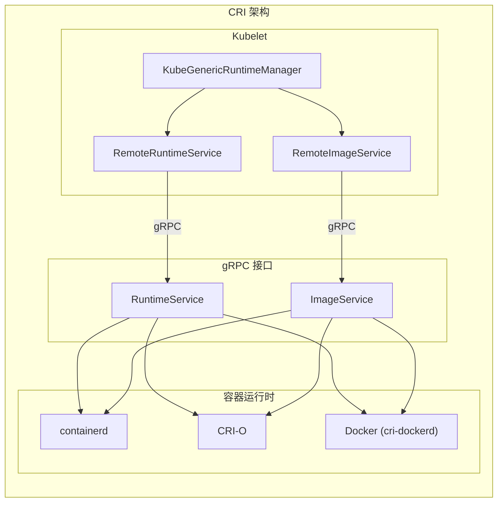
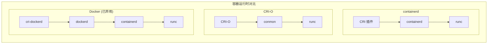

## 概述

CRI（Container Runtime Interface）是 Kubernetes 定义的容器运行时接口标准。通过 CRI，Kubelet 可以与不同的容器运行时（如 containerd、CRI-O）进行交互，而无需关心底层实现细节。本文详细解析 CRI 的架构设计和 Kubelet 的集成实现。

## CRI 架构

### 整体架构



### CRI 协议版本

| 版本 | Kubernetes 版本 | 说明 |
|------|-----------------|------|
| v1alpha2 | 1.10 - 1.23 | 旧版本 |
| v1 | 1.23+ | 稳定版本 |

## CRI 接口定义

### RuntimeService 接口

```protobuf
// staging/src/k8s.io/cri-api/pkg/apis/runtime/v1/api.proto

service RuntimeService {
    // Version 返回运行时版本信息
    rpc Version(VersionRequest) returns (VersionResponse) {}

    // ===== Pod Sandbox 操作 =====

    // RunPodSandbox 创建并启动 Pod Sandbox
    rpc RunPodSandbox(RunPodSandboxRequest) returns (RunPodSandboxResponse) {}

    // StopPodSandbox 停止 Pod Sandbox
    rpc StopPodSandbox(StopPodSandboxRequest) returns (StopPodSandboxResponse) {}

    // RemovePodSandbox 删除 Pod Sandbox
    rpc RemovePodSandbox(RemovePodSandboxRequest) returns (RemovePodSandboxResponse) {}

    // PodSandboxStatus 返回 Sandbox 状态
    rpc PodSandboxStatus(PodSandboxStatusRequest) returns (PodSandboxStatusResponse) {}

    // ListPodSandbox 列出所有 Sandbox
    rpc ListPodSandbox(ListPodSandboxRequest) returns (ListPodSandboxResponse) {}

    // ===== 容器操作 =====

    // CreateContainer 创建容器
    rpc CreateContainer(CreateContainerRequest) returns (CreateContainerResponse) {}

    // StartContainer 启动容器
    rpc StartContainer(StartContainerRequest) returns (StartContainerResponse) {}

    // StopContainer 停止容器
    rpc StopContainer(StopContainerRequest) returns (StopContainerResponse) {}

    // RemoveContainer 删除容器
    rpc RemoveContainer(RemoveContainerRequest) returns (RemoveContainerResponse) {}

    // ListContainers 列出容器
    rpc ListContainers(ListContainersRequest) returns (ListContainersResponse) {}

    // ContainerStatus 返回容器状态
    rpc ContainerStatus(ContainerStatusRequest) returns (ContainerStatusResponse) {}

    // ===== 执行操作 =====

    // ExecSync 同步执行命令
    rpc ExecSync(ExecSyncRequest) returns (ExecSyncResponse) {}

    // Exec 流式执行命令
    rpc Exec(ExecRequest) returns (ExecResponse) {}

    // Attach 附加到容器
    rpc Attach(AttachRequest) returns (AttachResponse) {}

    // PortForward 端口转发
    rpc PortForward(PortForwardRequest) returns (PortForwardResponse) {}

    // ===== 其他操作 =====

    // UpdateContainerResources 更新容器资源
    rpc UpdateContainerResources(UpdateContainerResourcesRequest) returns (UpdateContainerResourcesResponse) {}

    // ReopenContainerLog 重新打开容器日志
    rpc ReopenContainerLog(ReopenContainerLogRequest) returns (ReopenContainerLogResponse) {}

    // ContainerStats 获取容器统计信息
    rpc ContainerStats(ContainerStatsRequest) returns (ContainerStatsResponse) {}

    // ListContainerStats 列出容器统计信息
    rpc ListContainerStats(ListContainerStatsRequest) returns (ListContainerStatsResponse) {}
}
```

### ImageService 接口

```protobuf
service ImageService {
    // ListImages 列出镜像
    rpc ListImages(ListImagesRequest) returns (ListImagesResponse) {}

    // ImageStatus 获取镜像状态
    rpc ImageStatus(ImageStatusRequest) returns (ImageStatusResponse) {}

    // PullImage 拉取镜像
    rpc PullImage(PullImageRequest) returns (PullImageResponse) {}

    // RemoveImage 删除镜像
    rpc RemoveImage(RemoveImageRequest) returns (RemoveImageResponse) {}

    // ImageFsInfo 获取镜像文件系统信息
    rpc ImageFsInfo(ImageFsInfoRequest) returns (ImageFsInfoResponse) {}
}
```

## 核心数据结构

### PodSandboxConfig

```protobuf
message PodSandboxConfig {
    // Pod 元数据
    PodSandboxMetadata metadata = 1;

    // 主机名
    string hostname = 2;

    // 日志目录
    string log_directory = 3;

    // DNS 配置
    DNSConfig dns_config = 4;

    // 端口映射
    repeated PortMapping port_mappings = 5;

    // 标签
    map<string, string> labels = 6;

    // 注解
    map<string, string> annotations = 7;

    // Linux 特定配置
    LinuxPodSandboxConfig linux = 8;

    // Windows 特定配置
    WindowsPodSandboxConfig windows = 9;
}

message LinuxPodSandboxConfig {
    // cgroup 父路径
    string cgroup_parent = 1;

    // 安全上下文
    LinuxSandboxSecurityContext security_context = 2;

    // 系统调用配置
    map<string, string> sysctls = 3;

    // 资源配置
    LinuxPodSandboxResources resources = 4;
}
```

### ContainerConfig

```protobuf
message ContainerConfig {
    // 容器元数据
    ContainerMetadata metadata = 1;

    // 镜像
    ImageSpec image = 2;

    // 命令
    repeated string command = 3;

    // 参数
    repeated string args = 4;

    // 工作目录
    string working_dir = 5;

    // 环境变量
    repeated KeyValue envs = 6;

    // 挂载点
    repeated Mount mounts = 7;

    // 设备
    repeated Device devices = 8;

    // 标签
    map<string, string> labels = 9;

    // 注解
    map<string, string> annotations = 10;

    // 日志路径
    string log_path = 11;

    // stdin
    bool stdin = 12;
    bool stdin_once = 13;
    bool tty = 14;

    // Linux 特定配置
    LinuxContainerConfig linux = 15;

    // Windows 特定配置
    WindowsContainerConfig windows = 16;
}
```

## Kubelet CRI 客户端

### RemoteRuntimeService

```go
// pkg/kubelet/cri/remote/remote_runtime.go

// RemoteRuntimeService 是 CRI 运行时服务的远程实现
type RemoteRuntimeService struct {
    timeout       time.Duration
    runtimeClient runtimeapi.RuntimeServiceClient
    logReduction  *logreduction.LogReduction
}

// NewRemoteRuntimeService 创建远程运行时服务
func NewRemoteRuntimeService(endpoint string, connectionTimeout time.Duration) (RuntimeService, error) {
    conn, err := grpc.Dial(endpoint,
        grpc.WithTransportCredentials(insecure.NewCredentials()),
        grpc.WithDefaultCallOptions(grpc.MaxCallRecvMsgSize(maxMsgSize)),
    )
    if err != nil {
        return nil, err
    }

    return &RemoteRuntimeService{
        timeout:       connectionTimeout,
        runtimeClient: runtimeapi.NewRuntimeServiceClient(conn),
    }, nil
}

// RunPodSandbox 创建并启动 Sandbox
func (r *RemoteRuntimeService) RunPodSandbox(ctx context.Context,
    config *runtimeapi.PodSandboxConfig, runtimeHandler string) (string, error) {

    ctx, cancel := context.WithTimeout(ctx, r.timeout)
    defer cancel()

    resp, err := r.runtimeClient.RunPodSandbox(ctx, &runtimeapi.RunPodSandboxRequest{
        Config:         config,
        RuntimeHandler: runtimeHandler,
    })
    if err != nil {
        return "", err
    }

    return resp.PodSandboxId, nil
}

// CreateContainer 创建容器
func (r *RemoteRuntimeService) CreateContainer(ctx context.Context,
    podSandboxID string, config *runtimeapi.ContainerConfig,
    sandboxConfig *runtimeapi.PodSandboxConfig) (string, error) {

    ctx, cancel := context.WithTimeout(ctx, r.timeout)
    defer cancel()

    resp, err := r.runtimeClient.CreateContainer(ctx, &runtimeapi.CreateContainerRequest{
        PodSandboxId:  podSandboxID,
        Config:        config,
        SandboxConfig: sandboxConfig,
    })
    if err != nil {
        return "", err
    }

    return resp.ContainerId, nil
}

// StartContainer 启动容器
func (r *RemoteRuntimeService) StartContainer(ctx context.Context, containerID string) error {
    ctx, cancel := context.WithTimeout(ctx, r.timeout)
    defer cancel()

    _, err := r.runtimeClient.StartContainer(ctx, &runtimeapi.StartContainerRequest{
        ContainerId: containerID,
    })
    return err
}

// StopContainer 停止容器
func (r *RemoteRuntimeService) StopContainer(ctx context.Context,
    containerID string, timeout int64) error {

    ctx, cancel := context.WithTimeout(ctx, r.timeout+time.Duration(timeout)*time.Second)
    defer cancel()

    _, err := r.runtimeClient.StopContainer(ctx, &runtimeapi.StopContainerRequest{
        ContainerId: containerID,
        Timeout:     timeout,
    })
    return err
}
```

### RemoteImageService

```go
// pkg/kubelet/cri/remote/remote_image.go

// RemoteImageService 是 CRI 镜像服务的远程实现
type RemoteImageService struct {
    timeout     time.Duration
    imageClient runtimeapi.ImageServiceClient
}

// PullImage 拉取镜像
func (r *RemoteImageService) PullImage(ctx context.Context,
    image *runtimeapi.ImageSpec, auth *runtimeapi.AuthConfig,
    podSandboxConfig *runtimeapi.PodSandboxConfig) (string, error) {

    ctx, cancel := context.WithTimeout(ctx, r.timeout)
    defer cancel()

    resp, err := r.imageClient.PullImage(ctx, &runtimeapi.PullImageRequest{
        Image:         image,
        Auth:          auth,
        SandboxConfig: podSandboxConfig,
    })
    if err != nil {
        return "", err
    }

    return resp.ImageRef, nil
}

// ListImages 列出镜像
func (r *RemoteImageService) ListImages(ctx context.Context,
    filter *runtimeapi.ImageFilter) ([]*runtimeapi.Image, error) {

    ctx, cancel := context.WithTimeout(ctx, r.timeout)
    defer cancel()

    resp, err := r.imageClient.ListImages(ctx, &runtimeapi.ListImagesRequest{
        Filter: filter,
    })
    if err != nil {
        return nil, err
    }

    return resp.Images, nil
}
```

## KubeGenericRuntimeManager

### 结构定义

```go
// pkg/kubelet/kuberuntime/kuberuntime_manager.go

// kubeGenericRuntimeManager 是通用的容器运行时管理器
type kubeGenericRuntimeManager struct {
    // 运行时名称
    runtimeName string

    // CRI 服务
    runtimeService internalapi.RuntimeService
    imageService   internalapi.ImageService

    // 镜像拉取器
    imagePuller images.ImageManager

    // 容器 GC
    containerGC *containerGC

    // 日志管理
    logManager logs.ContainerLogManager

    // 探针管理
    livenessManager  proberesults.Manager
    readinessManager proberesults.Manager
    startupManager   proberesults.Manager

    // 运行时类管理
    runtimeClassManager *runtimeClassManager

    // CPU/内存管理
    cpuManager        cpumanager.Manager
    memoryManager     memorymanager.Manager
    topologyManager   topologymanager.Manager

    // OS 接口
    osInterface kubecontainer.OSInterface

    // 记录器
    recorder record.EventRecorder

    // 各种选项
    seccompDefault bool
}
```

### 创建 Sandbox

```go
// createPodSandbox 创建 Pod Sandbox
func (m *kubeGenericRuntimeManager) createPodSandbox(ctx context.Context,
    pod *v1.Pod, attempt uint32) (string, string, error) {

    // 1. 生成 Sandbox 配置
    podSandboxConfig, err := m.generatePodSandboxConfig(pod, attempt)
    if err != nil {
        return "", "", err
    }

    // 2. 创建日志目录
    err = m.osInterface.MkdirAll(podSandboxConfig.LogDirectory, 0755)
    if err != nil {
        return "", "", err
    }

    // 3. 获取运行时 Handler
    runtimeHandler := m.runtimeClassManager.getRuntimeHandler(pod)

    // 4. 调用 CRI 创建 Sandbox
    podSandboxID, err := m.runtimeService.RunPodSandbox(ctx, podSandboxConfig, runtimeHandler)
    if err != nil {
        return "", "", err
    }

    return podSandboxID, "", nil
}

// generatePodSandboxConfig 生成 Sandbox 配置
func (m *kubeGenericRuntimeManager) generatePodSandboxConfig(pod *v1.Pod,
    attempt uint32) (*runtimeapi.PodSandboxConfig, error) {

    // 元数据
    podSandboxConfig := &runtimeapi.PodSandboxConfig{
        Metadata: &runtimeapi.PodSandboxMetadata{
            Name:      pod.Name,
            Namespace: pod.Namespace,
            Uid:       string(pod.UID),
            Attempt:   attempt,
        },
        Labels:      newPodLabels(pod),
        Annotations: newPodAnnotations(pod),
    }

    // DNS 配置
    dnsConfig, err := m.runtimeHelper.GetClusterDNS(pod)
    if err != nil {
        return nil, err
    }
    podSandboxConfig.DnsConfig = dnsConfig

    // Linux 配置
    if !kubecontainer.IsHostNetworkPod(pod) {
        podSandboxConfig.Hostname = pod.Name
    }

    podSandboxConfig.LogDirectory = BuildPodLogsDirectory(pod.Namespace, pod.Name, pod.UID)

    // 端口映射
    for _, c := range pod.Spec.Containers {
        for _, port := range c.Ports {
            if port.HostPort <= 0 {
                continue
            }
            podSandboxConfig.PortMappings = append(podSandboxConfig.PortMappings,
                &runtimeapi.PortMapping{
                    HostPort:      port.HostPort,
                    ContainerPort: port.ContainerPort,
                    Protocol:      toRuntimeProtocol(port.Protocol),
                    HostIp:        port.HostIP,
                })
        }
    }

    // Linux 特定配置
    lc, err := m.generatePodSandboxLinuxConfig(pod)
    if err != nil {
        return nil, err
    }
    podSandboxConfig.Linux = lc

    return podSandboxConfig, nil
}
```

### 创建容器

```go
// startContainer 启动容器
func (m *kubeGenericRuntimeManager) startContainer(ctx context.Context,
    podSandboxID string, podSandboxConfig *runtimeapi.PodSandboxConfig,
    spec *v1.Container, pod *v1.Pod, podStatus *kubecontainer.PodStatus,
    pullSecrets []v1.Secret, podIP string,
    containerType kubecontainer.ContainerType) (string, error) {

    // 1. 拉取镜像
    imageRef, msg, err := m.imagePuller.EnsureImageExists(ctx, pod, spec, pullSecrets, podSandboxConfig)
    if err != nil {
        return "", err
    }

    // 2. 生成容器配置
    restartCount := 0
    containerStatus := kubecontainer.GetContainerStatus(podStatus.ContainerStatuses, spec.Name)
    if containerStatus != nil {
        restartCount = containerStatus.RestartCount + 1
    }

    containerConfig, cleanupAction, err := m.generateContainerConfig(ctx, spec, pod,
        restartCount, podIP, imageRef, containerType)
    if err != nil {
        return "", err
    }
    defer cleanupAction()

    // 3. 创建容器
    containerID, err := m.runtimeService.CreateContainer(ctx, podSandboxID,
        containerConfig, podSandboxConfig)
    if err != nil {
        return "", err
    }

    // 4. 启动容器
    err = m.runtimeService.StartContainer(ctx, containerID)
    if err != nil {
        return "", err
    }

    // 5. 记录事件
    m.recorder.Eventf(pod, v1.EventTypeNormal, events.StartedContainer,
        "Started container %s", spec.Name)

    // 6. 执行 PostStart Hook
    if spec.Lifecycle != nil && spec.Lifecycle.PostStart != nil {
        msg, handlerErr := m.runner.Run(ctx, containerID, pod, spec, spec.Lifecycle.PostStart)
        if handlerErr != nil {
            m.killContainer(ctx, pod, containerID, spec.Name, "FailedPostStartHook", nil)
            return "", fmt.Errorf("PostStart handler error: %v", handlerErr)
        }
    }

    return containerID, nil
}
```

## 容器运行时对比

### 主流运行时



### 特性对比

| 特性 | containerd | CRI-O | Docker |
|------|------------|-------|--------|
| Kubernetes 支持 | 原生 | 原生 | cri-dockerd |
| 镜像格式 | OCI | OCI | Docker/OCI |
| 资源占用 | 低 | 低 | 高 |
| 社区活跃度 | 高 | 高 | 高 |

## 配置示例

### containerd 配置

```toml
# /etc/containerd/config.toml
version = 2

[plugins."io.containerd.grpc.v1.cri"]
  sandbox_image = "registry.k8s.io/pause:3.9"

  [plugins."io.containerd.grpc.v1.cri".containerd]
    default_runtime_name = "runc"
    [plugins."io.containerd.grpc.v1.cri".containerd.runtimes.runc]
      runtime_type = "io.containerd.runc.v2"
      [plugins."io.containerd.grpc.v1.cri".containerd.runtimes.runc.options]
        SystemdCgroup = true

  [plugins."io.containerd.grpc.v1.cri".cni]
    bin_dir = "/opt/cni/bin"
    conf_dir = "/etc/cni/net.d"
```

### Kubelet 配置

```yaml
apiVersion: kubelet.config.k8s.io/v1beta1
kind: KubeletConfiguration
containerRuntimeEndpoint: unix:///run/containerd/containerd.sock
```

## 调试与排错

### 常用命令

```bash
# 查看运行时版本
crictl version

# 列出 Pod Sandbox
crictl pods

# 列出容器
crictl ps -a

# 查看容器日志
crictl logs <container-id>

# 进入容器
crictl exec -it <container-id> /bin/sh

# 拉取镜像
crictl pull <image>

# 查看镜像
crictl images
```

### 常见问题

1. **CRI 连接失败**
   - 检查 socket 路径
   - 检查运行时服务状态
   - 查看 Kubelet 日志

2. **容器创建失败**
   - 检查镜像是否存在
   - 检查资源限制
   - 查看运行时日志

3. **网络问题**
   - 检查 CNI 插件
   - 检查 Sandbox 状态
   - 验证网络配置

## 总结

CRI 是 Kubelet 与容器运行时交互的标准接口：

1. **接口抽象**：RuntimeService 和 ImageService 两大接口
2. **gRPC 通信**：高效的远程过程调用
3. **运行时无关**：支持多种容器运行时
4. **Sandbox 模型**：Pod 级别的隔离单元

理解 CRI 是深入学习 Kubernetes 容器管理的基础。
