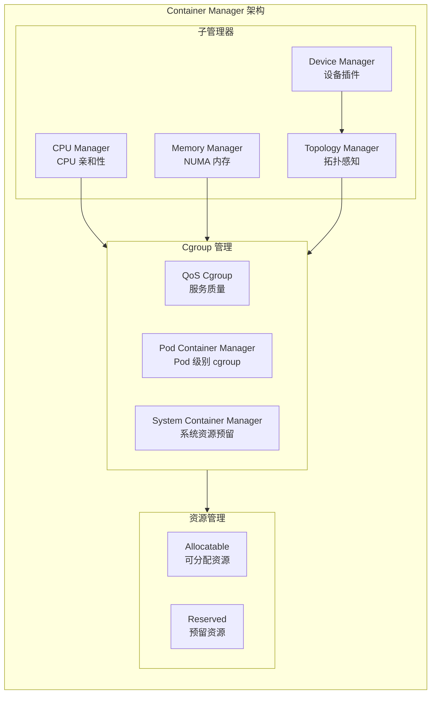
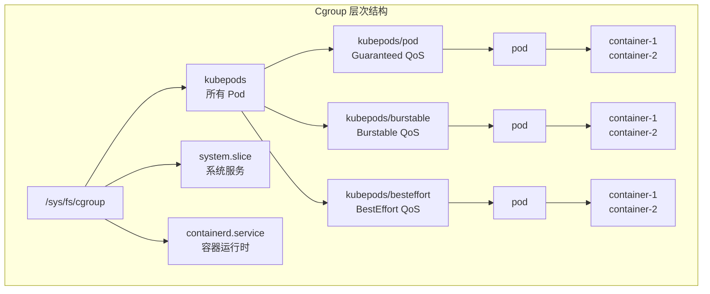
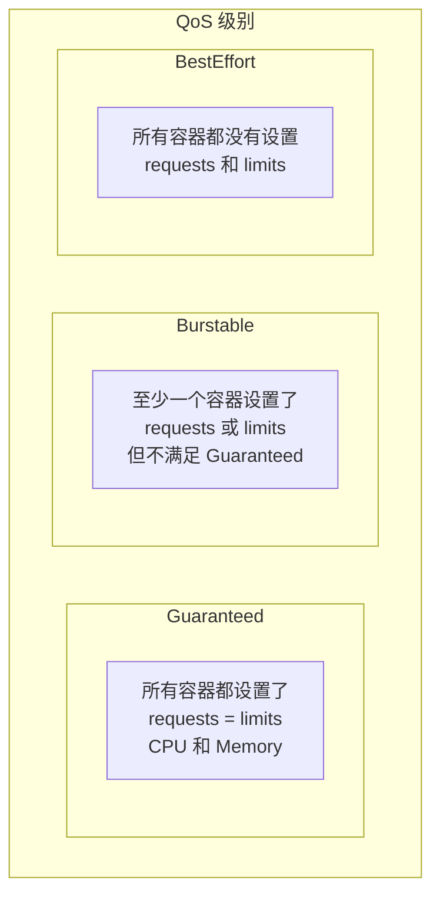
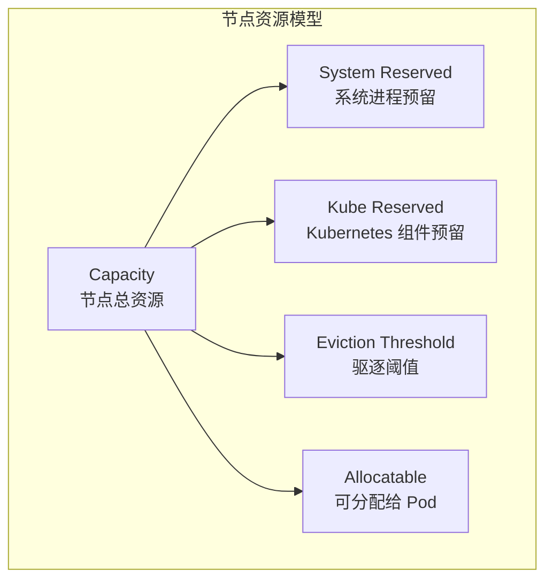

## 概述

容器管理器（Container Manager）是 Kubelet 的核心组件，负责管理节点上的资源分配和隔离。它通过 Linux cgroup 机制实现 CPU、内存等资源的限制和监控，确保 Pod 按照规格运行并防止资源争用。

## 架构设计

### 整体架构



### 核心组件

| 组件 | 职责 |
|------|------|
| ContainerManager | 顶层接口，协调各子组件 |
| QoSContainerManager | 管理 QoS 级别的 cgroup |
| PodContainerManager | 管理 Pod 级别的 cgroup |
| CPUManager | 管理 CPU 独占分配 |
| MemoryManager | 管理 NUMA 内存分配 |
| DeviceManager | 管理扩展设备分配 |
| TopologyManager | 协调资源的拓扑对齐 |

## Cgroup 层次结构

### 层级设计



### Cgroup 驱动

```go
// pkg/kubelet/cm/container_manager.go

// CgroupDriver 类型
const (
    // cgroupfs 驱动
    cgroupfs CgroupDriverType = "cgroupfs"

    // systemd 驱动
    systemd CgroupDriverType = "systemd"
)

// CgroupManager 接口
type CgroupManager interface {
    // 创建 cgroup
    Create(cgroupConfig *CgroupConfig) error

    // 删除 cgroup
    Destroy(cgroupConfig *CgroupConfig) error

    // 更新 cgroup
    Update(cgroupConfig *CgroupConfig) error

    // 检查 cgroup 是否存在
    Exists(name CgroupName) bool

    // 获取 cgroup 名称
    Name(name CgroupName) string

    // 设置 cgroup 配置
    SetCgroupConfig(name CgroupName, resourceConfig *ResourceConfig) error
}
```

## Container Manager 实现

### 结构定义

```go
// pkg/kubelet/cm/container_manager_linux.go

// containerManagerImpl 是 Linux 上的 ContainerManager 实现
type containerManagerImpl struct {
    // 互斥锁
    sync.RWMutex

    // cgroup 配置
    cgroupRoot    CgroupName
    cgroupManager CgroupManager

    // 子系统
    subsystems *CgroupSubsystems

    // 节点配置
    nodeConfig NodeConfig

    // 状态
    status Status

    // 子管理器
    cpuManager        cpumanager.Manager
    memoryManager     memorymanager.Manager
    deviceManager     devicemanager.Manager
    topologyManager   topologymanager.Manager

    // QoS 容器管理
    qosContainerManager QOSContainerManager

    // 资源分配
    nodeAllocatableManager NodeAllocatableManager
}

// NodeConfig 节点配置
type NodeConfig struct {
    // cgroup 驱动
    CgroupDriver string

    // cgroup 根路径
    CgroupRoot string

    // 系统预留资源
    SystemReserved map[string]string

    // Kube 预留资源
    KubeReserved map[string]string

    // 强制节点可分配
    EnforceNodeAllocatable []string

    // 驱逐硬阈值
    EvictionHard map[string]string
}
```

### 初始化

```go
// NewContainerManager 创建 ContainerManager
func NewContainerManager(mountUtil mount.Interface, cadvisorInterface cadvisor.Interface,
    nodeConfig NodeConfig, failSwapOn bool, devicePluginEnabled bool,
    recorder record.EventRecorder) (ContainerManager, error) {

    // 检查 cgroup 子系统
    subsystems, err := GetCgroupSubsystems()
    if err != nil {
        return nil, err
    }

    // 创建 cgroup 管理器
    cgroupManager := NewCgroupManager(subsystems, nodeConfig.CgroupDriver)

    cm := &containerManagerImpl{
        cgroupRoot:    ParseCgroupfsToCgroupName(nodeConfig.CgroupRoot),
        cgroupManager: cgroupManager,
        subsystems:    subsystems,
        nodeConfig:    nodeConfig,
    }

    // 创建 QoS 管理器
    cm.qosContainerManager, err = NewQOSContainerManager(subsystems, cgroupRoot, nodeConfig)
    if err != nil {
        return nil, err
    }

    // 创建 CPU 管理器
    cm.cpuManager, err = cpumanager.NewManager(
        nodeConfig.CPUManagerPolicy,
        nodeConfig.CPUManagerPolicyOptions,
        nodeConfig.CPUManagerReconcilePeriod,
        machineInfo,
        nodeAllocatableReservation,
        stateFileDirectory,
        topologyManager,
    )

    // 创建内存管理器
    cm.memoryManager, err = memorymanager.NewManager(
        nodeConfig.MemoryManagerPolicy,
        machineInfo,
        nodeAllocatableReservation,
        stateFileDirectory,
        topologyManager,
    )

    // 创建设备管理器
    if devicePluginEnabled {
        cm.deviceManager, err = devicemanager.NewManagerImpl(
            machineInfo,
            recorder,
        )
    }

    // 创建拓扑管理器
    cm.topologyManager, err = topologymanager.NewManager(
        machineInfo.Topology,
        nodeConfig.TopologyManagerPolicy,
        nodeConfig.TopologyManagerScope,
    )

    return cm, nil
}
```

### 启动

```go
// Start 启动容器管理器
func (cm *containerManagerImpl) Start(node *v1.Node,
    activePods ActivePodsFunc, sourceReady config.SourcesReady,
    podStatusProvider status.PodStatusProvider,
    runtimeService internalapi.RuntimeService) error {

    // 1. 设置节点
    cm.nodeInfo = node

    // 2. 创建 kubepods cgroup
    err := cm.createKubepodsCgroup()
    if err != nil {
        return err
    }

    // 3. 启动 QoS 管理器
    err = cm.qosContainerManager.Start(func() v1.ResourceList {
        return cm.getNodeAllocatableReservation()
    })
    if err != nil {
        return err
    }

    // 4. 启动 CPU 管理器
    err = cm.cpuManager.Start(cpumanager.ActivePodsFunc(activePods),
        podStatusProvider, runtimeService)
    if err != nil {
        return err
    }

    // 5. 启动内存管理器
    err = cm.memoryManager.Start(memorymanager.ActivePodsFunc(activePods),
        podStatusProvider, runtimeService)
    if err != nil {
        return err
    }

    // 6. 启动设备管理器
    if cm.deviceManager != nil {
        cm.deviceManager.Start(devicemanager.ActivePodsFunc(activePods),
            sourceReady)
    }

    // 7. 定期同步 cgroup 配置
    go wait.Until(func() {
        cm.reconcileState()
    }, cm.reconcilePeriod, wait.NeverStop)

    return nil
}
```

## QoS 管理

### QoS 级别



### QoS 计算

```go
// pkg/apis/core/helper/qos/qos.go

// GetPodQOS 获取 Pod 的 QoS 级别
func GetPodQOS(pod *v1.Pod) v1.PodQOSClass {
    requests := v1.ResourceList{}
    limits := v1.ResourceList{}

    isGuaranteed := true
    for _, container := range pod.Spec.Containers {
        // 收集 requests
        for name, quantity := range container.Resources.Requests {
            requests[name] = quantity
        }
        // 收集 limits
        for name, quantity := range container.Resources.Limits {
            limits[name] = quantity
        }

        // 检查是否是 Guaranteed
        if len(container.Resources.Limits) == 0 {
            isGuaranteed = false
        }
        for name := range container.Resources.Limits {
            if container.Resources.Limits[name] != container.Resources.Requests[name] {
                isGuaranteed = false
            }
        }
    }

    // 必须同时设置 CPU 和 Memory 才是 Guaranteed
    if isGuaranteed {
        if limits.Cpu().IsZero() || limits.Memory().IsZero() {
            isGuaranteed = false
        }
    }

    if isGuaranteed {
        return v1.PodQOSGuaranteed
    }

    // 检查是否是 BestEffort
    if len(requests) == 0 && len(limits) == 0 {
        return v1.PodQOSBestEffort
    }

    return v1.PodQOSBurstable
}
```

### QoS Cgroup 管理

```go
// pkg/kubelet/cm/qos_container_manager_linux.go

// QOSContainerManager 管理 QoS cgroup
type QOSContainerManager interface {
    Start(func() v1.ResourceList) error
    GetQOSContainersInfo() QOSContainersInfo
    UpdateCgroups() error
}

type qosContainerManagerImpl struct {
    cgroupManager   CgroupManager
    cgroupRoot      CgroupName
    qosContainersInfo QOSContainersInfo
}

// Start 启动 QoS 管理器
func (m *qosContainerManagerImpl) Start(getNodeAllocatable func() v1.ResourceList) error {
    // 创建 burstable cgroup
    burstableCgroupName := CgroupName{m.cgroupRoot, "burstable"}
    if err := m.cgroupManager.Create(&CgroupConfig{
        Name: burstableCgroupName,
    }); err != nil {
        return err
    }

    // 创建 besteffort cgroup
    besteffortCgroupName := CgroupName{m.cgroupRoot, "besteffort"}
    if err := m.cgroupManager.Create(&CgroupConfig{
        Name: besteffortCgroupName,
    }); err != nil {
        return err
    }

    m.qosContainersInfo = QOSContainersInfo{
        Guaranteed: m.cgroupRoot,
        Burstable:  burstableCgroupName,
        BestEffort: besteffortCgroupName,
    }

    return nil
}

// UpdateCgroups 更新 QoS cgroup 配置
func (m *qosContainerManagerImpl) UpdateCgroups() error {
    // 计算各 QoS 级别的资源限制
    // Guaranteed: 不限制
    // Burstable: 节点可分配 - Guaranteed Pods 使用
    // BestEffort: 最低保障

    return m.cgroupManager.Update(&CgroupConfig{
        Name:           m.qosContainersInfo.Burstable,
        ResourceConfig: m.getBurstableResourceConfig(),
    })
}
```

## CPU Manager

### 策略类型

| 策略 | 说明 |
|------|------|
| none | 默认策略，不进行 CPU 管理 |
| static | 为 Guaranteed Pod 分配独占 CPU |

### 实现

```go
// pkg/kubelet/cm/cpumanager/cpu_manager.go

// Manager 是 CPU 管理器接口
type Manager interface {
    Start(activePodsFunc ActivePodsFunc, sourceReady config.SourcesReady,
        podStatusProvider status.PodStatusProvider, runtimeService internalapi.RuntimeService) error
    Allocate(pod *v1.Pod, container *v1.Container) error
    AddContainer(pod *v1.Pod, container *v1.Container, containerID string) error
    RemoveContainer(containerID string) error
    GetTopologyHints(pod *v1.Pod, container *v1.Container) map[string][]topologymanager.TopologyHint
    GetExclusiveCPUs(podUID, containerName string) cpuset.CPUSet
    State() state.Reader
}

// staticPolicy 是静态 CPU 分配策略
type staticPolicy struct {
    topology        *topology.CPUTopology
    numReservedCPUs int
    reservedCPUs    cpuset.CPUSet
}

// Allocate 分配 CPU
func (p *staticPolicy) Allocate(s state.State, pod *v1.Pod, container *v1.Container) error {
    numCPUs := guaranteedCPUs(pod, container)
    if numCPUs == 0 {
        // 不需要独占 CPU
        return nil
    }

    // 获取可用 CPU
    availableCPUs := s.GetDefaultCPUSet().Difference(p.reservedCPUs)

    // 选择最优的 CPU 集合
    cpus, err := p.takeByTopology(availableCPUs, numCPUs)
    if err != nil {
        return err
    }

    // 分配 CPU
    s.SetCPUSet(string(pod.UID), container.Name, cpus)

    return nil
}

// takeByTopology 按拓扑选择 CPU
func (p *staticPolicy) takeByTopology(available cpuset.CPUSet, numCPUs int) (cpuset.CPUSet, error) {
    // 优先选择同一 socket、同一 core 的 CPU
    acc := cpuset.NewCPUSet()

    for _, socketID := range p.topology.CPUDetails.Sockets().ToSlice() {
        for _, coreID := range p.topology.CPUDetails.CoresInSocket(socketID).ToSlice() {
            cpus := p.topology.CPUDetails.CPUsInCore(coreID)
            for _, cpu := range cpus.ToSlice() {
                if available.Contains(cpu) {
                    acc = acc.Union(cpuset.NewCPUSet(cpu))
                    if acc.Size() == numCPUs {
                        return acc, nil
                    }
                }
            }
        }
    }

    return acc, fmt.Errorf("not enough CPUs available")
}
```

## Memory Manager

### 实现

```go
// pkg/kubelet/cm/memorymanager/memory_manager.go

// Manager 是内存管理器接口
type Manager interface {
    Start(activePodsFunc ActivePodsFunc, sourceReady config.SourcesReady,
        podStatusProvider status.PodStatusProvider, runtimeService internalapi.RuntimeService) error
    Allocate(pod *v1.Pod, container *v1.Container) error
    AddContainer(pod *v1.Pod, container *v1.Container, containerID string) error
    RemoveContainer(containerID string) error
    GetTopologyHints(pod *v1.Pod, container *v1.Container) map[string][]topologymanager.TopologyHint
    State() state.Reader
}

// staticPolicy 是静态内存分配策略
type staticPolicy struct {
    machineInfo     *cadvisorapi.MachineInfo
    systemReserved  systemReservedMemory
    affinity        topologymanager.Store
    initContainers  map[string]map[string]int64
}

// Allocate 分配内存
func (p *staticPolicy) Allocate(s state.State, pod *v1.Pod, container *v1.Container) error {
    // 获取容器内存请求
    requestedResources := container.Resources.Requests

    memory := requestedResources.Memory()
    if memory.IsZero() {
        return nil
    }

    // 获取 NUMA 节点
    numaNodes := p.machineInfo.Topology

    // 选择内存足够的 NUMA 节点
    hint := p.getOptimalNUMAHint(numaNodes, memory.Value())

    // 记录分配
    s.SetMemoryBlocks(string(pod.UID), container.Name, hint.NUMANodeAffinity)

    return nil
}
```

## 资源预留

### 节点资源模型



### 计算可分配资源

```go
// getNodeAllocatableReservation 获取节点可分配资源
func (cm *containerManagerImpl) GetNodeAllocatableReservation() v1.ResourceList {
    evictionReservation := cm.getEvictionReservation()
    result := make(v1.ResourceList)

    for k := range cm.capacity {
        value := cm.capacity[k].DeepCopy()

        // 减去系统预留
        if cm.nodeConfig.SystemReserved != nil {
            value.Sub(cm.nodeConfig.SystemReserved[k])
        }

        // 减去 Kube 预留
        if cm.nodeConfig.KubeReserved != nil {
            value.Sub(cm.nodeConfig.KubeReserved[k])
        }

        // 减去驱逐阈值
        if evictionReservation != nil {
            value.Sub(evictionReservation[k])
        }

        if value.Sign() < 0 {
            value.Set(0)
        }

        result[k] = value
    }

    return result
}
```

### 配置示例

```yaml
apiVersion: kubelet.config.k8s.io/v1beta1
kind: KubeletConfiguration
# 系统预留
systemReserved:
  cpu: "500m"
  memory: "1Gi"
# Kube 组件预留
kubeReserved:
  cpu: "500m"
  memory: "1Gi"
# 强制执行
enforceNodeAllocatable:
- pods
- kube-reserved
- system-reserved
# 系统预留 cgroup
systemReservedCgroup: /system.slice
# Kube 预留 cgroup
kubeReservedCgroup: /kubelet.slice
```

## 监控指标

### 关键指标

| 指标 | 说明 |
|------|------|
| `container_cpu_usage_seconds_total` | 容器 CPU 使用时间 |
| `container_memory_usage_bytes` | 容器内存使用量 |
| `container_memory_working_set_bytes` | 容器工作集内存 |
| `kubelet_node_allocatable` | 节点可分配资源 |

## 总结

Container Manager 是 Kubelet 资源管理的核心：

1. **Cgroup 管理**：通过 cgroup 实现资源隔离和限制
2. **QoS 级别**：Guaranteed、Burstable、BestEffort 三级服务质量
3. **CPU 管理**：static 策略支持 CPU 独占分配
4. **内存管理**：NUMA 感知的内存分配
5. **资源预留**：系统和 Kubernetes 组件的资源预留

理解 Container Manager 有助于优化节点资源利用和保障工作负载性能。
