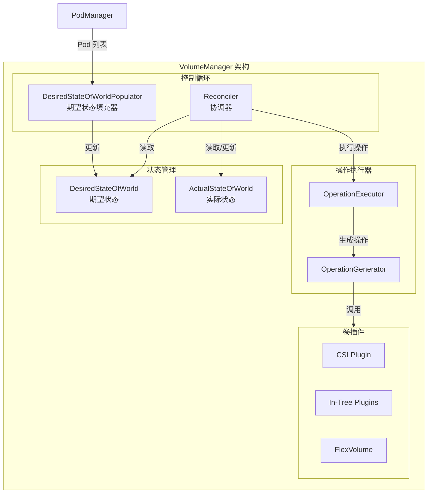
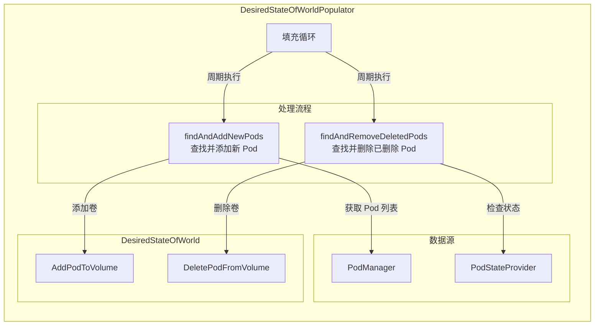
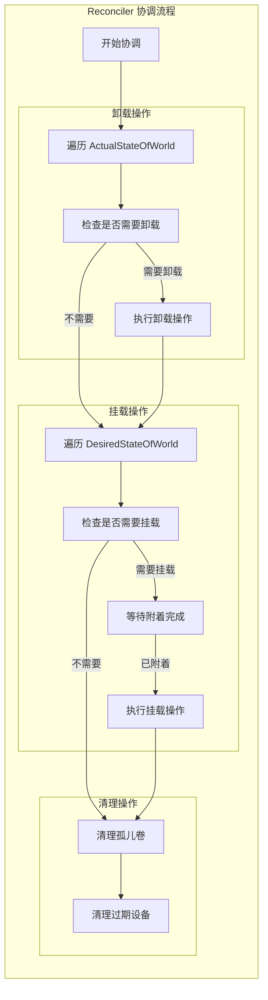
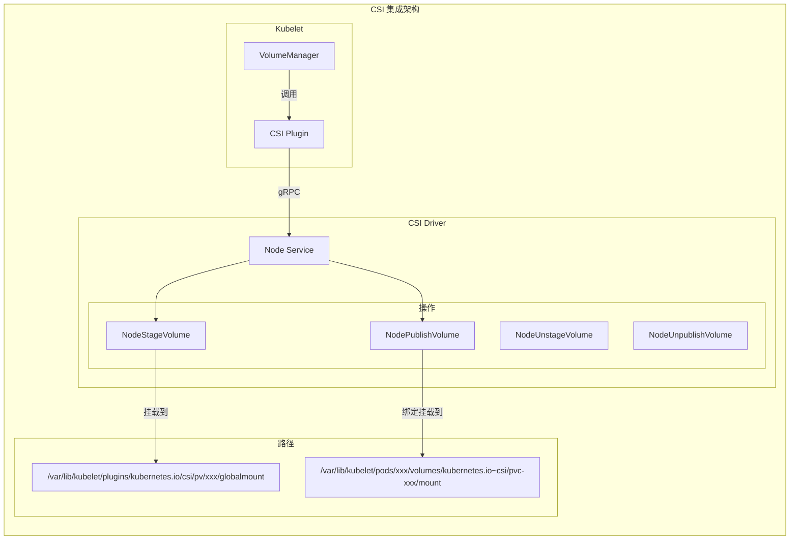
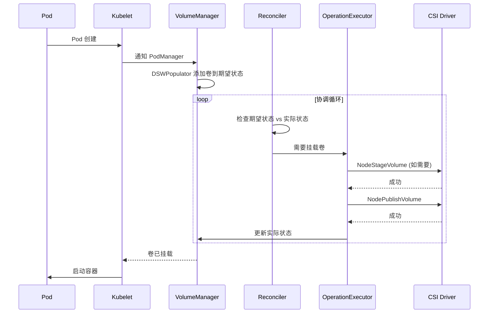

## 概述

VolumeManager 是 Kubelet 中负责卷挂载和卸载的核心组件。它维护两个状态世界（期望状态和实际状态），通过 Reconciler 循环确保实际状态向期望状态收敛。VolumeManager 与 CSI 驱动紧密集成，支持各种存储后端的动态挂载和卸载操作。

## 架构设计



## 核心数据结构

### DesiredStateOfWorld

```go
// pkg/kubelet/volumemanager/cache/desired_state_of_world.go

// DesiredStateOfWorld 表示卷的期望状态
type DesiredStateOfWorld interface {
    // AddPodToVolume 添加 Pod 对卷的引用
    AddPodToVolume(
        podName types.UniquePodName,
        pod *v1.Pod,
        volumeSpec *volume.Spec,
        outerVolumeSpecName string,
        volumeGidValue string,
        seLinuxLabel string,
    ) (v1.UniqueVolumeName, error)

    // DeletePodFromVolume 删除 Pod 对卷的引用
    DeletePodFromVolume(
        podName types.UniquePodName,
        volumeName v1.UniqueVolumeName,
    )

    // VolumeExists 检查卷是否存在
    VolumeExists(volumeName v1.UniqueVolumeName) bool

    // GetVolumesToMount 获取需要挂载的卷列表
    GetVolumesToMount() []VolumeToMount

    // GetPods 获取所有 Pod
    GetPods() map[types.UniquePodName]bool
}

// VolumeToMount 表示需要挂载的卷
type VolumeToMount struct {
    // 卷名称
    VolumeName v1.UniqueVolumeName

    // Pod 信息
    PodName types.UniquePodName
    Pod     *v1.Pod

    // 卷规格
    VolumeSpec *volume.Spec

    // 外部卷规格名称（用于投影卷）
    OuterVolumeSpecName string

    // 卷 GID
    VolumeGidValue string

    // SELinux 标签
    SELinuxLabel string

    // 是否已上报使用中
    ReportedInUse bool
}
```

### ActualStateOfWorld

```go
// pkg/kubelet/volumemanager/cache/actual_state_of_world.go

// ActualStateOfWorld 表示卷的实际状态
type ActualStateOfWorld interface {
    // MarkVolumeAsAttached 标记卷已附着
    MarkVolumeAsAttached(
        volumeName v1.UniqueVolumeName,
        volumeSpec *volume.Spec,
        nodeName types.NodeName,
        devicePath string,
    ) error

    // MarkVolumeAsMounted 标记卷已挂载
    MarkVolumeAsMounted(
        podName types.UniquePodName,
        podUID types.UID,
        volumeName v1.UniqueVolumeName,
        mounter volume.Mounter,
        blockVolumeMapper volume.BlockVolumeMapper,
        outerVolumeSpecName string,
        volumeGidValue string,
        volumeSpec *volume.Spec,
        seLinuxMountContext string,
    ) error

    // MarkVolumeAsUnmounted 标记卷已卸载
    MarkVolumeAsUnmounted(
        podName types.UniquePodName,
        volumeName v1.UniqueVolumeName,
    ) error

    // GetMountedVolumes 获取已挂载的卷
    GetMountedVolumes() []MountedVolume

    // GetUnmountedVolumes 获取已卸载的卷
    GetUnmountedVolumes() []AttachedVolume
}

// MountedVolume 表示已挂载的卷
type MountedVolume struct {
    // 卷信息
    VolumeName         v1.UniqueVolumeName
    VolumeSpec         *volume.Spec

    // Pod 信息
    PodName types.UniquePodName
    PodUID  types.UID

    // 挂载器
    Mounter volume.Mounter

    // 块卷映射器
    BlockVolumeMapper volume.BlockVolumeMapper

    // 外部卷规格名称
    OuterVolumeSpecName string

    // 卷 GID
    VolumeGidValue string

    // SELinux 挂载上下文
    SELinuxMountContext string
}
```

## VolumeManager 实现

### 初始化

```go
// pkg/kubelet/volumemanager/volume_manager.go

// VolumeManager 接口定义
type VolumeManager interface {
    // Run 启动 VolumeManager
    Run(sourcesReady config.SourcesReady, stopCh <-chan struct{})

    // WaitForAttachAndMount 等待卷附着和挂载完成
    WaitForAttachAndMount(pod *v1.Pod) error

    // WaitForUnmount 等待卷卸载完成
    WaitForUnmount(pod *v1.Pod) error

    // GetMountedVolumesForPod 获取 Pod 已挂载的卷
    GetMountedVolumesForPod(podName types.UniquePodName) container.VolumeMap

    // GetPossiblyMountedVolumesForPod 获取可能已挂载的卷
    GetPossiblyMountedVolumesForPod(podName types.UniquePodName) container.VolumeMap

    // GetExtraSupplementalGroupsForPod 获取额外的补充组
    GetExtraSupplementalGroupsForPod(pod *v1.Pod) []int64

    // GetVolumesInUse 获取正在使用的卷
    GetVolumesInUse() []v1.UniqueVolumeName

    // ReconcilerStatesHasBeenSynced 检查 Reconciler 是否已同步
    ReconcilerStatesHasBeenSynced() bool

    // VolumeIsAttached 检查卷是否已附着
    VolumeIsAttached(volumeName v1.UniqueVolumeName) bool

    // MarkVolumesAsReportedInUse 标记卷已上报使用
    MarkVolumesAsReportedInUse(volumesReportedAsInUse []v1.UniqueVolumeName)
}

// volumeManager 实现
type volumeManager struct {
    // kubeClient 用于与 API Server 通信
    kubeClient clientset.Interface

    // 卷插件管理器
    volumePluginMgr *volume.VolumePluginMgr

    // 期望状态
    desiredStateOfWorld cache.DesiredStateOfWorld

    // 实际状态
    actualStateOfWorld cache.ActualStateOfWorld

    // 期望状态填充器
    desiredStateOfWorldPopulator populator.DesiredStateOfWorldPopulator

    // 协调器
    reconciler reconciler.Reconciler

    // 操作执行器
    operationExecutor operationexecutor.OperationExecutor
}

// NewVolumeManager 创建 VolumeManager
func NewVolumeManager(
    controllerAttachDetachEnabled bool,
    nodeName types.NodeName,
    podManager pod.Manager,
    podStateProvider podStateProvider,
    kubeClient clientset.Interface,
    volumePluginMgr *volume.VolumePluginMgr,
    kubeContainerRuntime container.Runtime,
    mounter mount.Interface,
    hostutil hostutil.HostUtils,
    kubeletPodsDir string,
    recorder record.EventRecorder,
    keepTerminatedPodVolumes bool,
    blockVolumePathHandler volumepathhandler.BlockVolumePathHandler,
) VolumeManager {

    vm := &volumeManager{
        kubeClient:      kubeClient,
        volumePluginMgr: volumePluginMgr,
    }

    // 创建期望状态世界
    vm.desiredStateOfWorld = cache.NewDesiredStateOfWorld(volumePluginMgr)

    // 创建实际状态世界
    vm.actualStateOfWorld = cache.NewActualStateOfWorld(
        nodeName,
        volumePluginMgr,
    )

    // 创建操作执行器
    vm.operationExecutor = operationexecutor.NewOperationExecutor(
        operationexecutor.NewOperationGenerator(
            kubeClient,
            volumePluginMgr,
            recorder,
            blockVolumePathHandler,
        ),
    )

    // 创建期望状态填充器
    vm.desiredStateOfWorldPopulator = populator.NewDesiredStateOfWorldPopulator(
        kubeClient,
        desiredStateOfWorldPopulatorLoopSleepPeriod,
        getPodStatusRetryDuration,
        podManager,
        podStateProvider,
        vm.desiredStateOfWorld,
        vm.actualStateOfWorld,
        kubeContainerRuntime,
        keepTerminatedPodVolumes,
    )

    // 创建协调器
    vm.reconciler = reconciler.NewReconciler(
        kubeClient,
        controllerAttachDetachEnabled,
        reconcilerLoopSleepPeriod,
        waitForAttachTimeout,
        nodeName,
        vm.desiredStateOfWorld,
        vm.actualStateOfWorld,
        vm.desiredStateOfWorldPopulator,
        vm.operationExecutor,
        mounter,
        hostutil,
        volumePluginMgr,
        kubeletPodsDir,
    )

    return vm
}
```

### 运行循环

```go
// pkg/kubelet/volumemanager/volume_manager.go

// Run 启动 VolumeManager
func (vm *volumeManager) Run(
    sourcesReady config.SourcesReady,
    stopCh <-chan struct{},
) {
    // 启动期望状态填充器
    go vm.desiredStateOfWorldPopulator.Run(sourcesReady, stopCh)

    klog.InfoS("Starting Kubelet Volume Manager")

    // 启动协调器
    go vm.reconciler.Run(stopCh)

    // 等待协调器完成首次同步
    <-stopCh

    klog.InfoS("Shutting down Kubelet Volume Manager")
}
```

## 期望状态填充器



### 实现

```go
// pkg/kubelet/volumemanager/populator/desired_state_of_world_populator.go

// DesiredStateOfWorldPopulator 填充期望状态
type DesiredStateOfWorldPopulator interface {
    Run(sourcesReady config.SourcesReady, stopCh <-chan struct{})

    // ReprocessPod 重新处理 Pod
    ReprocessPod(podName types.UniquePodName)

    // HasAddedPods 检查是否已添加所有 Pod
    HasAddedPods() bool
}

type desiredStateOfWorldPopulator struct {
    kubeClient        clientset.Interface
    loopSleepDuration time.Duration
    podManager        pod.Manager
    podStateProvider  podStateProvider
    desiredStateOfWorld cache.DesiredStateOfWorld
    actualStateOfWorld  cache.ActualStateOfWorld
    pods                processedPods
    kubeContainerRuntime container.Runtime
    hasAddedPods        bool
    hasAddedPodsLock    sync.RWMutex
}

// Run 运行填充循环
func (dswp *desiredStateOfWorldPopulator) Run(
    sourcesReady config.SourcesReady,
    stopCh <-chan struct{},
) {
    // 等待数据源就绪
    wait.PollUntil(
        dswp.loopSleepDuration,
        func() (bool, error) {
            return sourcesReady.AllReady(), nil
        },
        stopCh,
    )

    // 启动填充循环
    wait.Until(
        dswp.populatorLoopFunc(),
        dswp.loopSleepDuration,
        stopCh,
    )
}

// populatorLoopFunc 填充循环函数
func (dswp *desiredStateOfWorldPopulator) populatorLoopFunc() func() {
    return func() {
        dswp.findAndAddNewPods()

        if dswp.hasAddedPods {
            dswp.findAndRemoveDeletedPods()
        }
    }
}

// findAndAddNewPods 查找并添加新 Pod 的卷
func (dswp *desiredStateOfWorldPopulator) findAndAddNewPods() {
    // 获取所有非 Terminated 的 Pod
    for _, pod := range dswp.podManager.GetPods() {
        if dswp.podStateProvider.ShouldPodRuntimeBeRemoved(pod.UID) {
            continue
        }

        dswp.processPodVolumes(pod)
    }

    dswp.markAsAddedPods()
}

// processPodVolumes 处理 Pod 的卷
func (dswp *desiredStateOfWorldPopulator) processPodVolumes(pod *v1.Pod) {
    if pod == nil {
        return
    }

    uniquePodName := util.GetUniquePodName(pod)

    // 检查是否已处理
    if dswp.pods.processedPods[uniquePodName] {
        return
    }

    // 处理每个卷
    for _, podVolume := range pod.Spec.Volumes {
        // 获取卷插件
        volumeSpec, err := dswp.createVolumeSpec(podVolume, pod)
        if err != nil {
            klog.ErrorS(err, "Error creating volume spec", "pod", klog.KObj(pod))
            continue
        }

        // 添加到期望状态
        _, err = dswp.desiredStateOfWorld.AddPodToVolume(
            uniquePodName,
            pod,
            volumeSpec,
            podVolume.Name,
            "" /* volumeGidValue */,
            "" /* seLinuxLabel */,
        )

        if err != nil {
            klog.ErrorS(err, "Error adding volume to desired state",
                "pod", klog.KObj(pod),
                "volume", podVolume.Name)
        }
    }

    dswp.pods.processedPods[uniquePodName] = true
}

// findAndRemoveDeletedPods 查找并删除已删除 Pod 的卷
func (dswp *desiredStateOfWorldPopulator) findAndRemoveDeletedPods() {
    for _, volumeToMount := range dswp.desiredStateOfWorld.GetVolumesToMount() {
        pod, podExists := dswp.podManager.GetPodByUID(volumeToMount.Pod.UID)

        if !podExists {
            // Pod 已删除，从期望状态中移除
            dswp.desiredStateOfWorld.DeletePodFromVolume(
                volumeToMount.PodName,
                volumeToMount.VolumeName,
            )
            continue
        }

        // 检查 Pod 是否应该被移除
        if dswp.podStateProvider.ShouldPodRuntimeBeRemoved(pod.UID) {
            dswp.desiredStateOfWorld.DeletePodFromVolume(
                volumeToMount.PodName,
                volumeToMount.VolumeName,
            )
        }
    }
}
```

## 协调器 (Reconciler)



### Reconciler 实现

```go
// pkg/kubelet/volumemanager/reconciler/reconciler.go

// Reconciler 协调器接口
type Reconciler interface {
    // Run 启动协调循环
    Run(stopCh <-chan struct{})

    // StatesHasBeenSynced 检查状态是否已同步
    StatesHasBeenSynced() bool
}

type reconciler struct {
    kubeClient                    clientset.Interface
    controllerAttachDetachEnabled bool
    loopSleepDuration             time.Duration
    waitForAttachTimeout          time.Duration
    nodeName                      types.NodeName
    desiredStateOfWorld           cache.DesiredStateOfWorld
    actualStateOfWorld            cache.ActualStateOfWorld
    populatorHasAddedPods         func() bool
    operationExecutor             operationexecutor.OperationExecutor
    mounter                       mount.Interface
    hostutil                      hostutil.HostUtils
    volumePluginMgr               *volume.VolumePluginMgr
    kubeletPodsDir                string
    timeOfLastSync                time.Time
    hasBeenSynced                 bool
}

// Run 启动协调循环
func (rc *reconciler) Run(stopCh <-chan struct{}) {
    wait.Until(rc.reconciliationLoopFunc(), rc.loopSleepDuration, stopCh)
}

// reconciliationLoopFunc 协调循环函数
func (rc *reconciler) reconciliationLoopFunc() func() {
    return func() {
        rc.reconcile()

        // 同步完成后设置标志
        if rc.populatorHasAddedPods() && !rc.hasBeenSynced {
            rc.hasBeenSynced = true
        }
    }
}

// reconcile 执行协调
func (rc *reconciler) reconcile() {
    // 1. 卸载不再需要的卷
    rc.unmountVolumes()

    // 2. 挂载需要的卷
    rc.mountAttachVolumes()

    // 3. 卸载不再被任何 Pod 使用的卷
    rc.unmountDetachVolumes()
}

// unmountVolumes 卸载卷
func (rc *reconciler) unmountVolumes() {
    // 遍历已挂载的卷
    for _, mountedVolume := range rc.actualStateOfWorld.GetMountedVolumes() {
        // 检查卷是否仍在期望状态中
        if !rc.desiredStateOfWorld.PodExistsInVolume(
            mountedVolume.PodName,
            mountedVolume.VolumeName,
        ) {
            // 执行卸载操作
            klog.V(5).InfoS("Attempting to unmount volume",
                "volumeName", mountedVolume.VolumeName,
                "pod", mountedVolume.PodName)

            err := rc.operationExecutor.UnmountVolume(
                mountedVolume,
                rc.actualStateOfWorld,
                rc.kubeletPodsDir,
            )

            if err != nil {
                klog.ErrorS(err, "Error unmounting volume",
                    "volumeName", mountedVolume.VolumeName,
                    "pod", mountedVolume.PodName)
            }
        }
    }
}

// mountAttachVolumes 挂载卷
func (rc *reconciler) mountAttachVolumes() {
    // 遍历期望挂载的卷
    for _, volumeToMount := range rc.desiredStateOfWorld.GetVolumesToMount() {
        // 检查卷是否已挂载
        volMounted, devicePath, err := rc.actualStateOfWorld.PodExistsInVolume(
            volumeToMount.PodName,
            volumeToMount.VolumeName,
        )

        if err != nil {
            klog.ErrorS(err, "Error checking volume mount state",
                "volumeName", volumeToMount.VolumeName)
            continue
        }

        if volMounted {
            // 已挂载，跳过
            continue
        }

        // 检查卷是否已附着
        isAttached := rc.actualStateOfWorld.VolumeExists(volumeToMount.VolumeName)

        if !isAttached {
            // 等待附着完成
            if rc.controllerAttachDetachEnabled {
                // 由 AttachDetach 控制器负责附着
                klog.V(5).InfoS("Waiting for volume to be attached by controller",
                    "volumeName", volumeToMount.VolumeName)
                continue
            }

            // Kubelet 负责附着
            rc.attachVolume(volumeToMount)
            continue
        }

        // 执行挂载操作
        klog.V(5).InfoS("Attempting to mount volume",
            "volumeName", volumeToMount.VolumeName,
            "pod", volumeToMount.PodName)

        err = rc.operationExecutor.MountVolume(
            rc.waitForAttachTimeout,
            volumeToMount,
            rc.actualStateOfWorld,
            isRemount(volMounted),
        )

        if err != nil {
            klog.ErrorS(err, "Error mounting volume",
                "volumeName", volumeToMount.VolumeName,
                "pod", volumeToMount.PodName)
        }
    }
}
```

## 操作执行器

### OperationExecutor

```go
// pkg/volume/util/operationexecutor/operation_executor.go

// OperationExecutor 执行卷操作
type OperationExecutor interface {
    // AttachVolume 附着卷
    AttachVolume(volumeToAttach VolumeToAttach, actualStateOfWorld ActualStateOfWorldAttacherUpdater) error

    // DetachVolume 分离卷
    DetachVolume(volumeToDetach AttachedVolume, verifySafeToDetach bool, actualStateOfWorld ActualStateOfWorldAttacherUpdater) error

    // MountVolume 挂载卷
    MountVolume(waitForAttachTimeout time.Duration, volumeToMount VolumeToMount, actualStateOfWorld ActualStateOfWorldMounterUpdater, isRemount bool) error

    // UnmountVolume 卸载卷
    UnmountVolume(volumeToUnmount MountedVolume, actualStateOfWorld ActualStateOfWorldMounterUpdater, podsDir string) error

    // ExpandInUseVolume 在线扩展卷
    ExpandInUseVolume(volumeToMount VolumeToMount, actualStateOfWorld ActualStateOfWorldMounterUpdater, currentSize resource.Quantity) error

    // IsOperationPending 检查操作是否正在进行
    IsOperationPending(volumeName v1.UniqueVolumeName, podName types.UniquePodName, operationName string) bool
}

type operationExecutor struct {
    // pendingOperations 跟踪正在进行的操作
    pendingOperations nestedpendingoperations.NestedPendingOperations

    // operationGenerator 生成操作函数
    operationGenerator OperationGenerator
}

// MountVolume 挂载卷
func (oe *operationExecutor) MountVolume(
    waitForAttachTimeout time.Duration,
    volumeToMount VolumeToMount,
    actualStateOfWorld ActualStateOfWorldMounterUpdater,
    isRemount bool,
) error {

    // 生成挂载操作
    fsVolumeMountFunc, err := oe.operationGenerator.GenerateMountVolumeFunc(
        waitForAttachTimeout,
        volumeToMount,
        actualStateOfWorld,
        isRemount,
    )

    if err != nil {
        return err
    }

    // 执行操作（异步）
    return oe.pendingOperations.Run(
        volumeToMount.VolumeName,
        volumeToMount.PodName,
        "" /* operationName */,
        fsVolumeMountFunc,
    )
}
```

### OperationGenerator

```go
// pkg/volume/util/operationexecutor/operation_generator.go

// OperationGenerator 生成卷操作
type OperationGenerator interface {
    // GenerateMountVolumeFunc 生成挂载操作函数
    GenerateMountVolumeFunc(
        waitForAttachTimeout time.Duration,
        volumeToMount VolumeToMount,
        actualStateOfWorld ActualStateOfWorldMounterUpdater,
        isRemount bool,
    ) (volumetypes.GeneratedOperations, error)

    // GenerateUnmountVolumeFunc 生成卸载操作函数
    GenerateUnmountVolumeFunc(
        volumeToUnmount MountedVolume,
        actualStateOfWorld ActualStateOfWorldMounterUpdater,
        podsDir string,
    ) (volumetypes.GeneratedOperations, error)

    // 其他操作生成函数...
}

// GenerateMountVolumeFunc 生成挂载操作
func (og *operationGenerator) GenerateMountVolumeFunc(
    waitForAttachTimeout time.Duration,
    volumeToMount VolumeToMount,
    actualStateOfWorld ActualStateOfWorldMounterUpdater,
    isRemount bool,
) (volumetypes.GeneratedOperations, error) {

    // 获取卷插件
    volumePlugin, err := og.volumePluginMgr.FindPluginBySpec(volumeToMount.VolumeSpec)
    if err != nil {
        return volumetypes.GeneratedOperations{}, err
    }

    // 创建 Mounter
    volumeMounter, err := volumePlugin.NewMounter(
        volumeToMount.VolumeSpec,
        volumeToMount.Pod,
        volume.VolumeOptions{},
    )
    if err != nil {
        return volumetypes.GeneratedOperations{}, err
    }

    // 生成挂载操作函数
    mountVolumeFunc := func() (error, error) {
        // 1. 等待设备附着
        devicePath, err := og.waitForVolumeAttach(
            volumeToMount,
            waitForAttachTimeout,
        )
        if err != nil {
            return nil, err
        }

        // 2. 如果是块设备，先进行 MountDevice
        if volumeAttacher, ok := volumePlugin.(volume.AttachableVolumePlugin); ok {
            volumeDeviceMounter := volumeAttacher.NewDeviceMounter()
            err = volumeDeviceMounter.MountDevice(
                volumeToMount.VolumeSpec,
                devicePath,
                volumeToMount.DeviceMountPath,
            )
            if err != nil {
                return nil, err
            }
        }

        // 3. 执行挂载
        mountPath := volumeToMount.Pod.Spec.Volumes[0].VolumeSource
        err = volumeMounter.SetUp(volume.MounterArgs{
            FsGroup:             volumeToMount.Pod.Spec.SecurityContext.FSGroup,
            DesiredSize:         nil,
            FSGroupChangePolicy: nil,
        })
        if err != nil {
            return nil, err
        }

        // 4. 更新实际状态
        actualStateOfWorld.MarkVolumeAsMounted(
            volumeToMount.PodName,
            volumeToMount.Pod.UID,
            volumeToMount.VolumeName,
            volumeMounter,
            nil, /* blockVolumeMapper */
            volumeToMount.OuterVolumeSpecName,
            volumeToMount.VolumeGidValue,
            volumeToMount.VolumeSpec,
            "" /* seLinuxMountContext */,
        )

        return nil, nil
    }

    return volumetypes.GeneratedOperations{
        OperationName:     "volume_mount",
        OperationFunc:     mountVolumeFunc,
        EventRecorderFunc: nil,
        CompleteFunc:      nil,
    }, nil
}
```

## CSI 集成



### CSI NodeService 调用

```go
// pkg/volume/csi/csi_mounter.go

// csiMountMgr 实现 volume.Mounter 接口
type csiMountMgr struct {
    plugin       *csiPlugin
    k8s          kubernetes.Interface
    spec         *volume.Spec
    pod          *v1.Pod
    podUID       types.UID
    volumeID     string
    driverName   string
    readOnly     bool
    volumeLifecycleMode storage.VolumeLifecycleMode
    fsGroupPolicy storage.FSGroupPolicy
}

// SetUp 执行卷挂载
func (c *csiMountMgr) SetUp(mounterArgs volume.MounterArgs) error {
    return c.SetUpAt(c.GetPath(), mounterArgs)
}

// SetUpAt 在指定路径挂载卷
func (c *csiMountMgr) SetUpAt(dir string, mounterArgs volume.MounterArgs) error {
    klog.V(4).InfoS("Setting up CSI volume", "volumeID", c.volumeID, "targetPath", dir)

    // 获取 CSI 客户端
    csi, err := c.plugin.csiClientGetter.Get()
    if err != nil {
        return err
    }

    // 获取卷属性
    volumeContext := c.spec.PersistentVolume.Spec.CSI.VolumeAttributes

    // 获取 Secrets
    nodePublishSecrets, err := c.getNodePublishSecrets()
    if err != nil {
        return err
    }

    // 1. 如果需要，先执行 NodeStageVolume
    if c.requiresStaging() {
        stagingPath := c.getStagingPath()

        _, err = csi.NodeStageVolume(
            context.Background(),
            c.volumeID,
            c.publishContext,
            stagingPath,
            c.getAccessMode(),
            c.getNodeStageSecrets(),
            volumeContext,
            nil, /* volumeCapability */
        )
        if err != nil {
            return err
        }
    }

    // 2. 执行 NodePublishVolume
    _, err = csi.NodePublishVolume(
        context.Background(),
        c.volumeID,
        c.readOnly,
        c.getStagingPath(),
        dir,
        c.getAccessMode(),
        c.publishContext,
        volumeContext,
        nodePublishSecrets,
        c.getFSType(),
        c.getMountOptions(),
    )

    if err != nil {
        return err
    }

    klog.V(4).InfoS("Successfully mounted CSI volume", "volumeID", c.volumeID, "targetPath", dir)
    return nil
}

// TearDown 卸载卷
func (c *csiMountMgr) TearDown() error {
    return c.TearDownAt(c.GetPath())
}

// TearDownAt 在指定路径卸载卷
func (c *csiMountMgr) TearDownAt(dir string) error {
    klog.V(4).InfoS("Tearing down CSI volume", "volumeID", c.volumeID, "targetPath", dir)

    csi, err := c.plugin.csiClientGetter.Get()
    if err != nil {
        return err
    }

    // 1. 执行 NodeUnpublishVolume
    err = csi.NodeUnpublishVolume(context.Background(), c.volumeID, dir)
    if err != nil {
        return err
    }

    // 2. 如果需要，执行 NodeUnstageVolume
    if c.requiresStaging() {
        err = csi.NodeUnstageVolume(context.Background(), c.volumeID, c.getStagingPath())
        if err != nil {
            return err
        }
    }

    klog.V(4).InfoS("Successfully unmounted CSI volume", "volumeID", c.volumeID)
    return nil
}
```

## 卷挂载流程



## 错误处理与重试

### 重试策略

```go
// pkg/volume/util/operationexecutor/operation_generator.go

const (
    // 指数退避参数
    initialBackoff = 10 * time.Millisecond
    maxBackoff     = 5 * time.Minute
)

// GeneratedOperations 包含重试逻辑
type GeneratedOperations struct {
    OperationName     string
    OperationFunc     func() (eventErr error, detailedErr error)
    EventRecorderFunc func(err *error)
    CompleteFunc      func(err *error)
}

// 重试包装器
func (oe *operationExecutor) wrapWithRetry(
    op volumetypes.GeneratedOperations,
) volumetypes.GeneratedOperations {

    return volumetypes.GeneratedOperations{
        OperationName: op.OperationName,
        OperationFunc: func() (error, error) {
            var lastErr error
            backoff := initialBackoff

            for attempt := 0; attempt < maxRetries; attempt++ {
                eventErr, detailedErr := op.OperationFunc()
                if eventErr == nil && detailedErr == nil {
                    return nil, nil
                }

                lastErr = detailedErr

                // 检查是否可重试
                if !isRetryableError(detailedErr) {
                    return eventErr, detailedErr
                }

                // 等待退避时间
                time.Sleep(backoff)
                backoff = min(backoff*2, maxBackoff)
            }

            return nil, lastErr
        },
        EventRecorderFunc: op.EventRecorderFunc,
        CompleteFunc:      op.CompleteFunc,
    }
}
```

### 常见错误处理

```go
// pkg/volume/util/operationexecutor/operation_generator.go

// isRetryableError 判断错误是否可重试
func isRetryableError(err error) bool {
    if err == nil {
        return false
    }

    // 临时错误可重试
    if IsTemporaryError(err) {
        return true
    }

    // 资源不存在可重试（可能还在创建）
    if apierrors.IsNotFound(err) {
        return true
    }

    // 资源冲突可重试
    if apierrors.IsConflict(err) {
        return true
    }

    // CSI 特定错误
    if strings.Contains(err.Error(), "device not ready") {
        return true
    }

    return false
}
```

## 监控与调试

### 关键指标

```go
// pkg/kubelet/volumemanager/metrics/metrics.go

var (
    // 卷挂载操作计数
    volumeOperationsTotal = prometheus.NewCounterVec(
        prometheus.CounterOpts{
            Name: "volume_manager_operations_total",
            Help: "Total number of volume operations",
        },
        []string{"operation", "plugin", "status"},
    )

    // 卷挂载操作延迟
    volumeOperationsDuration = prometheus.NewHistogramVec(
        prometheus.HistogramOpts{
            Name:    "volume_manager_operation_duration_seconds",
            Help:    "Duration of volume operations",
            Buckets: prometheus.ExponentialBuckets(0.001, 2, 15),
        },
        []string{"operation", "plugin"},
    )

    // 期望状态与实际状态差异
    volumeStateDiff = prometheus.NewGaugeVec(
        prometheus.GaugeOpts{
            Name: "volume_manager_state_diff",
            Help: "Number of volumes in desired state but not actual state",
        },
        []string{"direction"}, // "mount" or "unmount"
    )
)
```

### 调试命令

```bash
# 查看节点上的卷状态
kubectl get volumeattachment

# 查看 CSI 节点信息
kubectl get csinode <node-name> -o yaml

# 查看 Kubelet 卷管理器日志
journalctl -u kubelet | grep -i "volume manager"

# 检查卷挂载点
ls -la /var/lib/kubelet/pods/<pod-uid>/volumes/

# 检查 CSI 插件目录
ls -la /var/lib/kubelet/plugins/kubernetes.io/csi/

# 使用 kubectl describe 查看 Pod 卷状态
kubectl describe pod <pod-name> | grep -A 20 "Volumes:"
```

## 最佳实践

### 1. 卷配置优化

```yaml
# 推荐的 PVC 配置
apiVersion: v1
kind: PersistentVolumeClaim
metadata:
  name: my-pvc
spec:
  accessModes:
    - ReadWriteOnce
  storageClassName: fast-ssd
  resources:
    requests:
      storage: 10Gi
  # 使用 WaitForFirstConsumer 延迟绑定
  volumeMode: Filesystem
```

### 2. 超时配置

```yaml
# Kubelet 卷管理器超时配置
apiVersion: kubelet.config.k8s.io/v1beta1
kind: KubeletConfiguration
volumeStatsAggPeriod: 1m
# CSI 操作超时
volumePluginDir: /var/lib/kubelet/volumeplugins
```

### 3. 故障排查

| 问题 | 可能原因 | 排查步骤 |
|------|----------|----------|
| 卷挂载超时 | CSI 驱动问题 | 检查 CSI Pod 日志 |
| 卷无法卸载 | 进程占用 | 检查 lsof, fuser |
| 权限错误 | SELinux/FSGroup | 检查安全上下文 |
| 设备不存在 | 附着失败 | 检查 VolumeAttachment |

## 总结

VolumeManager 是 Kubelet 中管理卷生命周期的核心组件：

1. **双状态模型**：维护期望状态和实际状态，通过协调器收敛
2. **异步操作**：卷操作通过 OperationExecutor 异步执行
3. **CSI 集成**：通过 CSI 插件支持各种存储后端
4. **错误恢复**：完善的重试和错误处理机制
5. **可观测性**：丰富的指标和日志支持

理解 VolumeManager 的工作原理对于排查存储相关问题和优化卷挂载性能至关重要。
