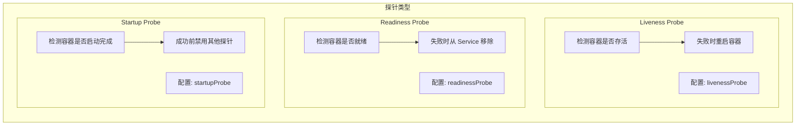
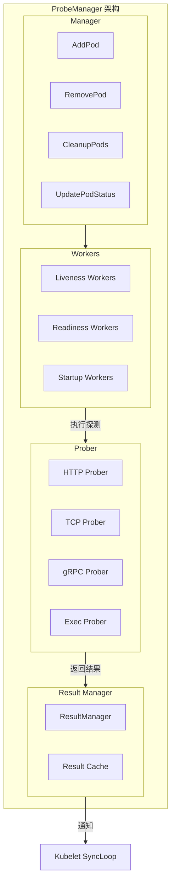
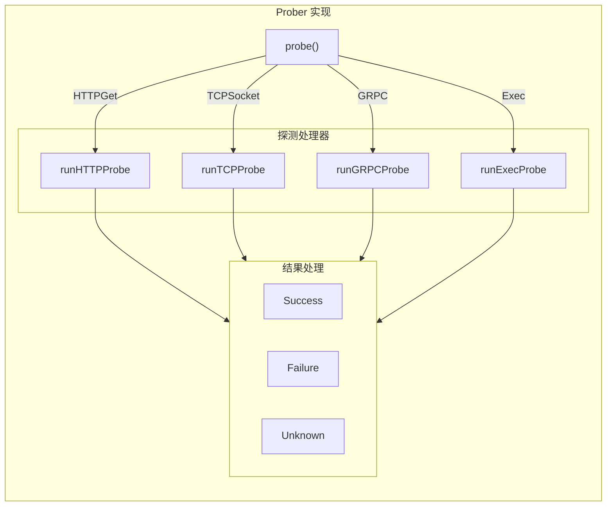
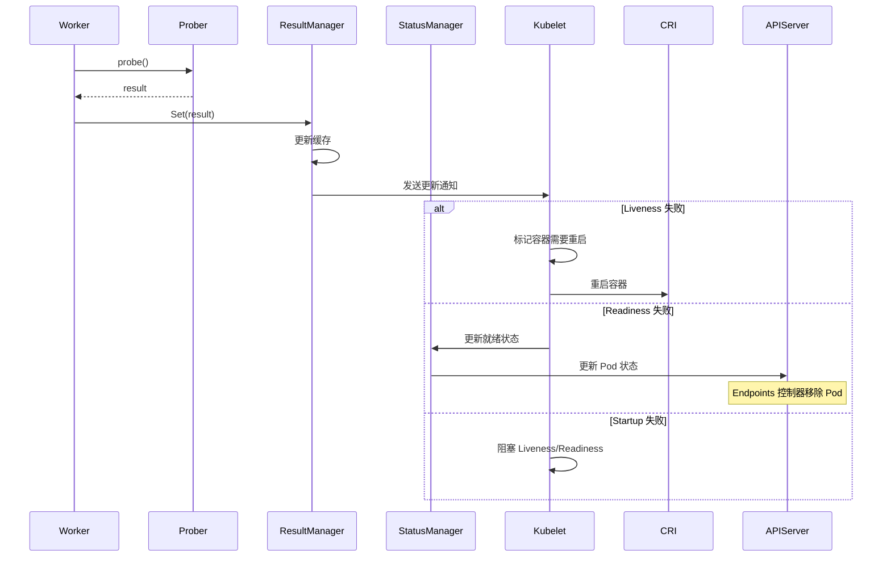

## 概述

ProbeManager 是 Kubelet 中负责执行容器健康检查的组件。它管理三种类型的探针：Liveness（存活探针）、Readiness（就绪探针）和 Startup（启动探针）。每个探针都有独立的 Worker 负责周期性执行检查，并将结果反馈给 Kubelet 以触发相应的操作（如重启容器或更新 Pod 就绪状态）。

## 探针类型



### 探针对比

| 特性 | Liveness | Readiness | Startup |
|------|----------|-----------|---------|
| 目的 | 检测存活 | 检测就绪 | 检测启动 |
| 失败操作 | 重启容器 | 移除流量 | 阻塞其他探针 |
| 适用场景 | 死锁检测 | 流量控制 | 慢启动应用 |
| 执行时机 | 启动后持续 | 启动后持续 | 仅启动阶段 |

## 探针执行方式

### HTTP 探针

```yaml
livenessProbe:
  httpGet:
    path: /healthz
    port: 8080
    httpHeaders:
    - name: Custom-Header
      value: Awesome
  initialDelaySeconds: 5
  periodSeconds: 10
  timeoutSeconds: 3
  successThreshold: 1
  failureThreshold: 3
```

### TCP 探针

```yaml
readinessProbe:
  tcpSocket:
    port: 3306
  initialDelaySeconds: 5
  periodSeconds: 10
```

### gRPC 探针

```yaml
livenessProbe:
  grpc:
    port: 50051
    service: health
  initialDelaySeconds: 10
  periodSeconds: 10
```

### Exec 探针

```yaml
livenessProbe:
  exec:
    command:
    - cat
    - /tmp/healthy
  initialDelaySeconds: 5
  periodSeconds: 5
```

## 架构设计



## 核心数据结构

### ProbeManager 接口

```go
// pkg/kubelet/prober/prober_manager.go

// Manager 探针管理器接口
type Manager interface {
    // AddPod 为 Pod 添加探针
    AddPod(pod *v1.Pod)

    // RemovePod 移除 Pod 的探针
    RemovePod(pod *v1.Pod)

    // CleanupPods 清理已删除 Pod 的探针
    CleanupPods(desiredPods map[types.UID]sets.Empty)

    // UpdatePodStatus 更新 Pod 状态中的探针结果
    UpdatePodStatus(types.UID, *v1.PodStatus)
}

// manager 探针管理器实现
type manager struct {
    // statusManager 用于更新 Pod 状态
    statusManager status.Manager

    // readinessManager 管理 Readiness 探针结果
    readinessManager results.Manager

    // livenessManager 管理 Liveness 探针结果
    livenessManager results.Manager

    // startupManager 管理 Startup 探针结果
    startupManager results.Manager

    // workers 存储所有探针 Worker
    workers map[probeKey]*worker

    // workerLock 保护 workers map
    workerLock sync.RWMutex

    // prober 执行探测
    prober *prober

    // start 标记 Manager 是否已启动
    start bool
}
```

### Worker 结构

```go
// pkg/kubelet/prober/worker.go

// worker 执行单个探针的检查
type worker struct {
    // stopCh 停止信号
    stopCh chan struct{}

    // pod 和容器信息
    pod       *v1.Pod
    container v1.Container

    // 探针规格
    spec *v1.Probe

    // 探针类型
    probeType probeType

    // 初始延迟
    initialDelaySeconds int32

    // 探测周期
    periodSeconds int32

    // 超时时间
    timeoutSeconds int32

    // 成功阈值
    successThreshold int32

    // 失败阈值
    failureThreshold int32

    // 连续成功/失败计数
    resultRun int

    // 上次探测结果
    lastResult results.Result

    // 结果管理器
    resultsManager results.Manager

    // 探针执行器
    probeManager *manager
}

// probeKey 唯一标识一个探针
type probeKey struct {
    podUID        types.UID
    containerName string
    probeType     probeType
}

type probeType int

const (
    liveness probeType = iota
    readiness
    startup
)
```

## ProbeManager 实现

### 初始化

```go
// pkg/kubelet/prober/prober_manager.go

// NewManager 创建探针管理器
func NewManager(
    statusManager status.Manager,
    livenessManager results.Manager,
    readinessManager results.Manager,
    startupManager results.Manager,
    runner kubecontainer.CommandRunner,
    recorder record.EventRecorder,
) Manager {

    prober := newProber(runner, recorder)

    return &manager{
        statusManager:    statusManager,
        readinessManager: readinessManager,
        livenessManager:  livenessManager,
        startupManager:   startupManager,
        workers:          make(map[probeKey]*worker),
        prober:           prober,
    }
}

// AddPod 为 Pod 添加探针 Worker
func (m *manager) AddPod(pod *v1.Pod) {
    m.workerLock.Lock()
    defer m.workerLock.Unlock()

    key := probeKey{podUID: pod.UID}

    for _, c := range pod.Spec.Containers {
        key.containerName = c.Name

        // 添加 Startup 探针
        if c.StartupProbe != nil {
            key.probeType = startup
            if _, ok := m.workers[key]; !ok {
                w := newWorker(m, startup, pod, c)
                m.workers[key] = w
                go w.run()
            }
        }

        // 添加 Liveness 探针
        if c.LivenessProbe != nil {
            key.probeType = liveness
            if _, ok := m.workers[key]; !ok {
                w := newWorker(m, liveness, pod, c)
                m.workers[key] = w
                go w.run()
            }
        }

        // 添加 Readiness 探针
        if c.ReadinessProbe != nil {
            key.probeType = readiness
            if _, ok := m.workers[key]; !ok {
                w := newWorker(m, readiness, pod, c)
                m.workers[key] = w
                go w.run()
            }
        }
    }
}

// RemovePod 移除 Pod 的探针
func (m *manager) RemovePod(pod *v1.Pod) {
    m.workerLock.Lock()
    defer m.workerLock.Unlock()

    key := probeKey{podUID: pod.UID}

    for _, c := range pod.Spec.Containers {
        key.containerName = c.Name

        for _, probeType := range []probeType{liveness, readiness, startup} {
            key.probeType = probeType
            if worker, ok := m.workers[key]; ok {
                worker.stop()
                delete(m.workers, key)
            }
        }
    }
}
```

### Worker 运行

```go
// pkg/kubelet/prober/worker.go

// newWorker 创建探针 Worker
func newWorker(
    m *manager,
    probeType probeType,
    pod *v1.Pod,
    container v1.Container,
) *worker {

    w := &worker{
        stopCh:        make(chan struct{}, 1),
        pod:           pod,
        container:     container,
        probeType:     probeType,
        probeManager:  m,
    }

    switch probeType {
    case liveness:
        w.spec = container.LivenessProbe
        w.resultsManager = m.livenessManager
    case readiness:
        w.spec = container.ReadinessProbe
        w.resultsManager = m.readinessManager
    case startup:
        w.spec = container.StartupProbe
        w.resultsManager = m.startupManager
    }

    // 设置探针参数
    w.initialDelaySeconds = w.spec.InitialDelaySeconds
    w.periodSeconds = w.spec.PeriodSeconds
    if w.periodSeconds == 0 {
        w.periodSeconds = 10 // 默认 10 秒
    }
    w.timeoutSeconds = w.spec.TimeoutSeconds
    if w.timeoutSeconds == 0 {
        w.timeoutSeconds = 1 // 默认 1 秒
    }
    w.successThreshold = w.spec.SuccessThreshold
    if w.successThreshold == 0 {
        w.successThreshold = 1
    }
    w.failureThreshold = w.spec.FailureThreshold
    if w.failureThreshold == 0 {
        w.failureThreshold = 3
    }

    return w
}

// run 运行探针检查循环
func (w *worker) run() {
    probeTickerPeriod := time.Duration(w.periodSeconds) * time.Second

    // 处理 Pod 删除时的清理
    defer func() {
        // 清理结果缓存
        w.resultsManager.Remove(w.containerID())
    }()

    // 初始延迟
    if w.initialDelaySeconds > 0 {
        select {
        case <-time.After(time.Duration(w.initialDelaySeconds) * time.Second):
        case <-w.stopCh:
            return
        }
    }

    // 创建定时器
    probeTicker := time.NewTicker(probeTickerPeriod)
    defer probeTicker.Stop()

    // 首次探测
    if !w.doProbe() {
        return
    }

    // 周期性探测
    for {
        select {
        case <-probeTicker.C:
            if !w.doProbe() {
                return
            }
        case <-w.stopCh:
            return
        }
    }
}

// doProbe 执行一次探测
func (w *worker) doProbe() (keepGoing bool) {
    defer func() { recover() }()

    // 获取容器状态
    status, ok := w.probeManager.statusManager.GetPodStatus(w.pod.UID)
    if !ok {
        // Pod 已删除
        return false
    }

    // 查找容器状态
    c := w.container
    var containerStatus *v1.ContainerStatus
    for i, cs := range status.ContainerStatuses {
        if cs.Name == c.Name {
            containerStatus = &status.ContainerStatuses[i]
            break
        }
    }

    if containerStatus == nil {
        klog.V(3).InfoS("Container not found in status", "container", c.Name)
        return true
    }

    // 容器未运行时跳过探测
    if containerStatus.State.Running == nil {
        klog.V(3).InfoS("Container is not running", "container", c.Name)
        w.resultsManager.Set(w.containerID(), results.Failure, w.pod)
        return true
    }

    // 检查 Startup 探针是否已成功
    if w.probeType != startup && !w.startupProbeSucceeded() {
        // Startup 探针未成功，跳过其他探针
        return true
    }

    // 执行探测
    result, err := w.probeManager.prober.probe(w.probeType, w.pod, status, c, w.containerID())
    if err != nil {
        klog.V(1).InfoS("Probe errored", "probe", w.probeType, "container", c.Name, "err", err)
        w.resultsManager.Set(w.containerID(), results.Failure, w.pod)
        return true
    }

    // 更新结果
    w.handleProbeResult(result)

    return true
}

// handleProbeResult 处理探测结果
func (w *worker) handleProbeResult(result results.Result) {
    if result == w.lastResult {
        w.resultRun++
    } else {
        w.resultRun = 1
        w.lastResult = result
    }

    // 检查是否达到阈值
    switch result {
    case results.Success:
        if w.resultRun >= int(w.successThreshold) {
            w.resultsManager.Set(w.containerID(), results.Success, w.pod)
        }
    case results.Failure:
        if w.resultRun >= int(w.failureThreshold) {
            w.resultsManager.Set(w.containerID(), results.Failure, w.pod)
        }
    }
}

// startupProbeSucceeded 检查 Startup 探针是否已成功
func (w *worker) startupProbeSucceeded() bool {
    return w.probeManager.startupManager.Get(w.containerID()) == results.Success
}
```

## Prober 实现



### Prober 结构

```go
// pkg/kubelet/prober/prober.go

// prober 执行探测
type prober struct {
    // 命令执行器
    exec execprobe.Prober

    // HTTP 探测器
    http httpprobe.Prober

    // TCP 探测器
    tcp tcpprobe.Prober

    // gRPC 探测器
    grpc grpcprobe.Prober

    // 事件记录器
    recorder record.EventRecorder
}

// newProber 创建 Prober
func newProber(
    runner kubecontainer.CommandRunner,
    recorder record.EventRecorder,
) *prober {
    return &prober{
        exec:     execprobe.New(),
        http:     httpprobe.New(true /* followNonLocalRedirects */),
        tcp:      tcpprobe.New(),
        grpc:     grpcprobe.New(),
        recorder: recorder,
    }
}

// probe 执行探测
func (pb *prober) probe(
    probeType probeType,
    pod *v1.Pod,
    status v1.PodStatus,
    container v1.Container,
    containerID kubecontainer.ContainerID,
) (results.Result, error) {

    var probeSpec *v1.Probe
    switch probeType {
    case liveness:
        probeSpec = container.LivenessProbe
    case readiness:
        probeSpec = container.ReadinessProbe
    case startup:
        probeSpec = container.StartupProbe
    default:
        return results.Failure, fmt.Errorf("unknown probe type: %v", probeType)
    }

    if probeSpec == nil {
        return results.Success, nil
    }

    // 执行探测
    result, output, err := pb.runProbe(probeType, probeSpec, pod, status, container, containerID)

    // 记录事件
    if err != nil || result == probe.Failure {
        pb.recorder.Eventf(
            pod,
            v1.EventTypeWarning,
            events.ContainerUnhealthy,
            "%s probe failed: %s",
            probeType.String(),
            output,
        )
    }

    return results.Result(result), err
}

// runProbe 执行具体探测
func (pb *prober) runProbe(
    probeType probeType,
    p *v1.Probe,
    pod *v1.Pod,
    status v1.PodStatus,
    container v1.Container,
    containerID kubecontainer.ContainerID,
) (probe.Result, string, error) {

    timeout := time.Duration(p.TimeoutSeconds) * time.Second

    // HTTP 探测
    if p.HTTPGet != nil {
        return pb.runHTTPProbe(p.HTTPGet, pod, container, timeout)
    }

    // TCP 探测
    if p.TCPSocket != nil {
        return pb.runTCPProbe(p.TCPSocket, pod, container, timeout)
    }

    // gRPC 探测
    if p.GRPC != nil {
        return pb.runGRPCProbe(p.GRPC, pod, container, timeout)
    }

    // Exec 探测
    if p.Exec != nil {
        return pb.runExecProbe(p.Exec, pod, container, containerID, timeout)
    }

    return probe.Unknown, "", fmt.Errorf("no probe action specified")
}
```

### HTTP 探测

```go
// pkg/kubelet/prober/prober.go

func (pb *prober) runHTTPProbe(
    p *v1.HTTPGetAction,
    pod *v1.Pod,
    container v1.Container,
    timeout time.Duration,
) (probe.Result, string, error) {

    // 构建 URL
    scheme := strings.ToLower(string(p.Scheme))
    if scheme == "" {
        scheme = "http"
    }

    port, err := extractPort(p.Port, container)
    if err != nil {
        return probe.Unknown, "", err
    }

    host := p.Host
    if host == "" {
        host = pod.Status.PodIP
    }

    path := p.Path
    url := fmt.Sprintf("%s://%s:%d%s", scheme, host, port, path)

    // 构建请求头
    headers := make(http.Header)
    for _, header := range p.HTTPHeaders {
        headers.Add(header.Name, header.Value)
    }

    // 添加默认 Host 头
    if headers.Get("Host") == "" {
        headers.Set("Host", net.JoinHostPort(host, strconv.Itoa(port)))
    }

    // 执行 HTTP 请求
    return pb.http.Probe(url, headers, timeout)
}

// httpprobe.Prober.Probe 实现
func (pr httpProber) Probe(url string, headers http.Header, timeout time.Duration) (probe.Result, string, error) {
    client := &http.Client{
        Timeout: timeout,
        CheckRedirect: func(req *http.Request, via []*http.Request) error {
            if pr.followNonLocalRedirects {
                return nil
            }
            // 检查是否是非本地重定向
            if !isLocalHost(req.URL.Host) {
                return http.ErrUseLastResponse
            }
            return nil
        },
    }

    req, err := http.NewRequest("GET", url, nil)
    if err != nil {
        return probe.Failure, "", err
    }
    req.Header = headers

    resp, err := client.Do(req)
    if err != nil {
        return probe.Failure, err.Error(), nil
    }
    defer resp.Body.Close()

    // 读取响应体（限制大小）
    body, err := io.ReadAll(io.LimitReader(resp.Body, maxRespBodyLength))
    if err != nil {
        return probe.Failure, "", err
    }

    // 判断结果
    if resp.StatusCode >= 200 && resp.StatusCode < 400 {
        return probe.Success, string(body), nil
    }

    return probe.Failure, string(body), nil
}
```

### TCP 探测

```go
// pkg/kubelet/prober/prober.go

func (pb *prober) runTCPProbe(
    p *v1.TCPSocketAction,
    pod *v1.Pod,
    container v1.Container,
    timeout time.Duration,
) (probe.Result, string, error) {

    port, err := extractPort(p.Port, container)
    if err != nil {
        return probe.Unknown, "", err
    }

    host := p.Host
    if host == "" {
        host = pod.Status.PodIP
    }

    return pb.tcp.Probe(host, port, timeout)
}

// tcpprobe.Prober.Probe 实现
func (pr tcpProber) Probe(host string, port int, timeout time.Duration) (probe.Result, string, error) {
    address := net.JoinHostPort(host, strconv.Itoa(port))

    conn, err := net.DialTimeout("tcp", address, timeout)
    if err != nil {
        return probe.Failure, err.Error(), nil
    }
    defer conn.Close()

    return probe.Success, "", nil
}
```

### gRPC 探测

```go
// pkg/kubelet/prober/prober.go

func (pb *prober) runGRPCProbe(
    p *v1.GRPCAction,
    pod *v1.Pod,
    container v1.Container,
    timeout time.Duration,
) (probe.Result, string, error) {

    host := pod.Status.PodIP
    port := int(p.Port)

    service := ""
    if p.Service != nil {
        service = *p.Service
    }

    return pb.grpc.Probe(host, port, service, timeout)
}

// grpcprobe.Prober.Probe 实现
func (pr grpcProber) Probe(host string, port int, service string, timeout time.Duration) (probe.Result, string, error) {
    address := net.JoinHostPort(host, strconv.Itoa(port))

    ctx, cancel := context.WithTimeout(context.Background(), timeout)
    defer cancel()

    // 建立连接
    conn, err := grpc.DialContext(ctx, address,
        grpc.WithInsecure(),
        grpc.WithBlock(),
    )
    if err != nil {
        return probe.Failure, err.Error(), nil
    }
    defer conn.Close()

    // 创建健康检查客户端
    client := grpc_health_v1.NewHealthClient(conn)

    // 执行健康检查
    resp, err := client.Check(ctx, &grpc_health_v1.HealthCheckRequest{
        Service: service,
    })
    if err != nil {
        return probe.Failure, err.Error(), nil
    }

    if resp.Status == grpc_health_v1.HealthCheckResponse_SERVING {
        return probe.Success, "", nil
    }

    return probe.Failure, fmt.Sprintf("service %s: %v", service, resp.Status), nil
}
```

### Exec 探测

```go
// pkg/kubelet/prober/prober.go

func (pb *prober) runExecProbe(
    p *v1.ExecAction,
    pod *v1.Pod,
    container v1.Container,
    containerID kubecontainer.ContainerID,
    timeout time.Duration,
) (probe.Result, string, error) {

    command := p.Command
    return pb.exec.Probe(pb.runner, containerID, command, timeout)
}

// execprobe.Prober.Probe 实现
func (pr execProber) Probe(
    runner kubecontainer.CommandRunner,
    containerID kubecontainer.ContainerID,
    command []string,
    timeout time.Duration,
) (probe.Result, string, error) {

    ctx, cancel := context.WithTimeout(context.Background(), timeout)
    defer cancel()

    // 在容器中执行命令
    output, err := runner.RunInContainer(ctx, containerID, command, timeout)

    if err != nil {
        // 检查是否是退出码错误
        if exitErr, ok := err.(utilexec.ExitError); ok {
            if exitErr.ExitStatus() != 0 {
                return probe.Failure, string(output), nil
            }
        }
        return probe.Unknown, "", err
    }

    return probe.Success, string(output), nil
}
```

## 结果管理器

```go
// pkg/kubelet/prober/results/results_manager.go

// Manager 管理探测结果
type Manager interface {
    // Get 获取容器的探测结果
    Get(kubecontainer.ContainerID) Result

    // Set 设置容器的探测结果
    Set(kubecontainer.ContainerID, Result, *v1.Pod)

    // Remove 移除容器的探测结果
    Remove(kubecontainer.ContainerID)

    // Updates 返回结果更新通道
    Updates() <-chan Update
}

// manager 实现
type manager struct {
    // 保护 cache
    sync.RWMutex

    // 结果缓存
    cache map[kubecontainer.ContainerID]Result

    // 更新通道
    updates chan Update
}

// Result 探测结果
type Result int

const (
    // Unknown 未知状态
    Unknown Result = iota
    // Success 成功
    Success
    // Failure 失败
    Failure
)

// Update 结果更新
type Update struct {
    ContainerID kubecontainer.ContainerID
    Result      Result
    PodUID      types.UID
}

// NewManager 创建结果管理器
func NewManager() Manager {
    return &manager{
        cache:   make(map[kubecontainer.ContainerID]Result),
        updates: make(chan Update, 20),
    }
}

// Get 获取结果
func (m *manager) Get(id kubecontainer.ContainerID) Result {
    m.RLock()
    defer m.RUnlock()
    result, found := m.cache[id]
    if !found {
        return Unknown
    }
    return result
}

// Set 设置结果
func (m *manager) Set(id kubecontainer.ContainerID, result Result, pod *v1.Pod) {
    m.Lock()
    defer m.Unlock()

    prev, found := m.cache[id]
    if !found || prev != result {
        m.cache[id] = result
        // 发送更新通知
        m.updates <- Update{ContainerID: id, Result: result, PodUID: pod.UID}
    }
}

// Remove 移除结果
func (m *manager) Remove(id kubecontainer.ContainerID) {
    m.Lock()
    defer m.Unlock()
    delete(m.cache, id)
}
```

## 探针结果处理



### Kubelet 处理探测结果

```go
// pkg/kubelet/kubelet.go

// syncLoopIteration 处理探测结果
func (kl *Kubelet) syncLoopIteration(...) bool {
    // ...

    // 处理 Liveness 探针结果
    select {
    case update := <-kl.livenessManager.Updates():
        if update.Result == results.Failure {
            // Liveness 失败，需要重启容器
            pod, ok := kl.podManager.GetPodByUID(update.PodUID)
            if !ok {
                break
            }

            klog.V(1).InfoS("Liveness probe failed, restarting container",
                "pod", klog.KObj(pod),
                "containerID", update.ContainerID)

            // 触发 Pod 同步，会重启失败的容器
            kl.podWorkers.EnqueueSync(pod, syncPod, "liveness")
        }
    default:
    }

    // 处理 Readiness 探针结果
    select {
    case update := <-kl.readinessManager.Updates():
        // 更新 Pod 状态中的就绪条件
        kl.statusManager.SetContainerReadiness(
            update.PodUID,
            update.ContainerID,
            update.Result == results.Success,
        )
    default:
    }

    // 处理 Startup 探针结果
    select {
    case update := <-kl.startupManager.Updates():
        // Startup 探针成功后允许其他探针运行
        if update.Result == results.Success {
            klog.V(3).InfoS("Startup probe succeeded",
                "containerID", update.ContainerID)
        }
    default:
    }

    // ...
}
```

## 调试与排错

### 查看探针状态

```bash
# 查看 Pod 事件，包含探针失败信息
kubectl describe pod <pod-name>

# 查看特定容器的探针配置
kubectl get pod <pod-name> -o jsonpath='{.spec.containers[*].livenessProbe}'

# 查看容器状态
kubectl get pod <pod-name> -o jsonpath='{.status.containerStatuses[*]}'
```

### 常见问题排查

| 问题 | 可能原因 | 解决方案 |
|------|----------|----------|
| 探针超时 | 服务响应慢 | 增加 timeoutSeconds |
| 频繁重启 | 阈值太低 | 增加 failureThreshold |
| 启动失败 | 初始延迟不够 | 增加 initialDelaySeconds 或使用 startupProbe |
| 就绪状态抖动 | 服务不稳定 | 增加 periodSeconds |

### 探针配置建议

```yaml
# 适合慢启动应用的配置
spec:
  containers:
  - name: app
    # Startup 探针处理慢启动
    startupProbe:
      httpGet:
        path: /healthz
        port: 8080
      failureThreshold: 30    # 最多允许 5 分钟启动
      periodSeconds: 10
    # Liveness 探针检测死锁
    livenessProbe:
      httpGet:
        path: /healthz
        port: 8080
      initialDelaySeconds: 0  # Startup 成功后立即开始
      periodSeconds: 10
      timeoutSeconds: 5
      failureThreshold: 3
    # Readiness 探针控制流量
    readinessProbe:
      httpGet:
        path: /ready
        port: 8080
      periodSeconds: 5
      timeoutSeconds: 3
      successThreshold: 1
      failureThreshold: 1     # 快速移除不健康实例
```

## 总结

ProbeManager 是 Kubelet 健康检查的核心组件：

1. **三种探针**：Liveness、Readiness、Startup 各司其职
2. **多种方式**：支持 HTTP、TCP、gRPC、Exec 四种探测方式
3. **Worker 模型**：每个探针独立 Worker 周期性执行
4. **结果驱动**：探测结果触发容器重启或状态更新
5. **阈值控制**：通过 successThreshold/failureThreshold 避免抖动

合理配置探针对于保证应用高可用至关重要。
