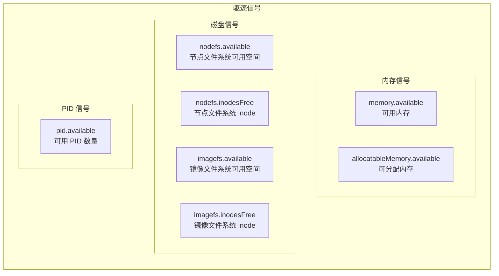
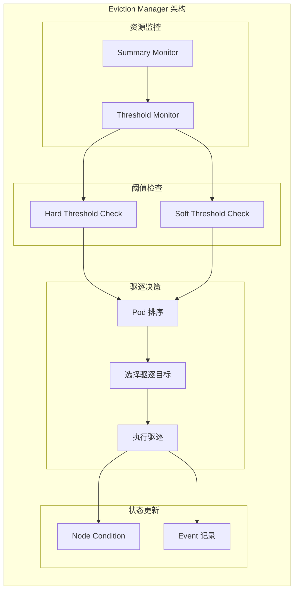
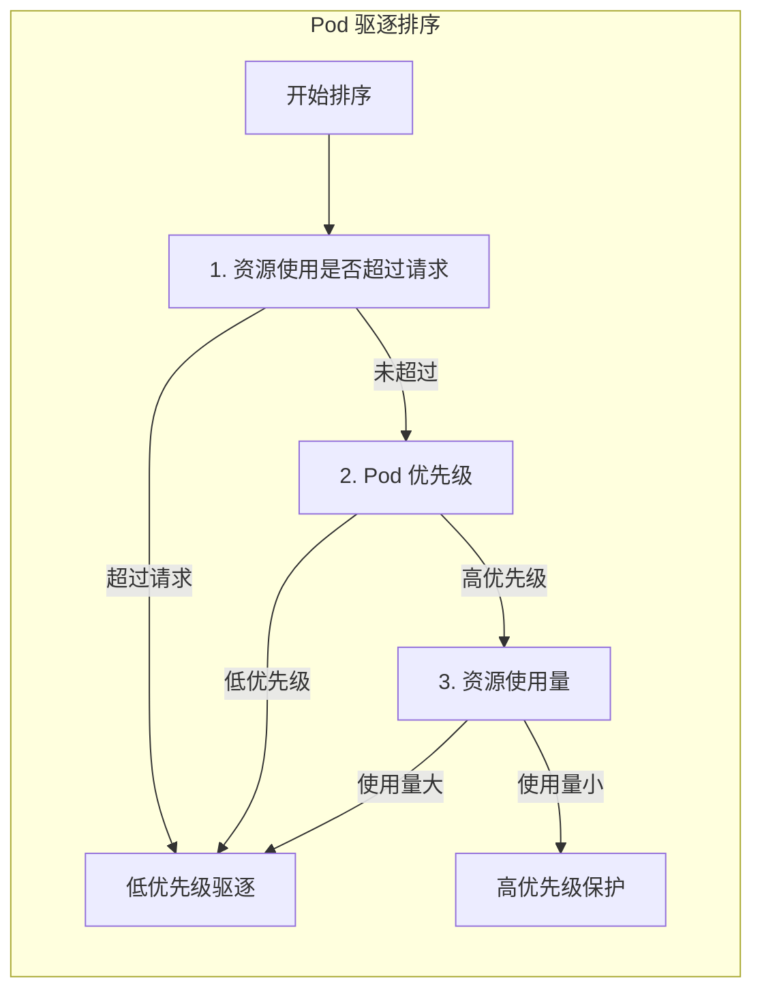
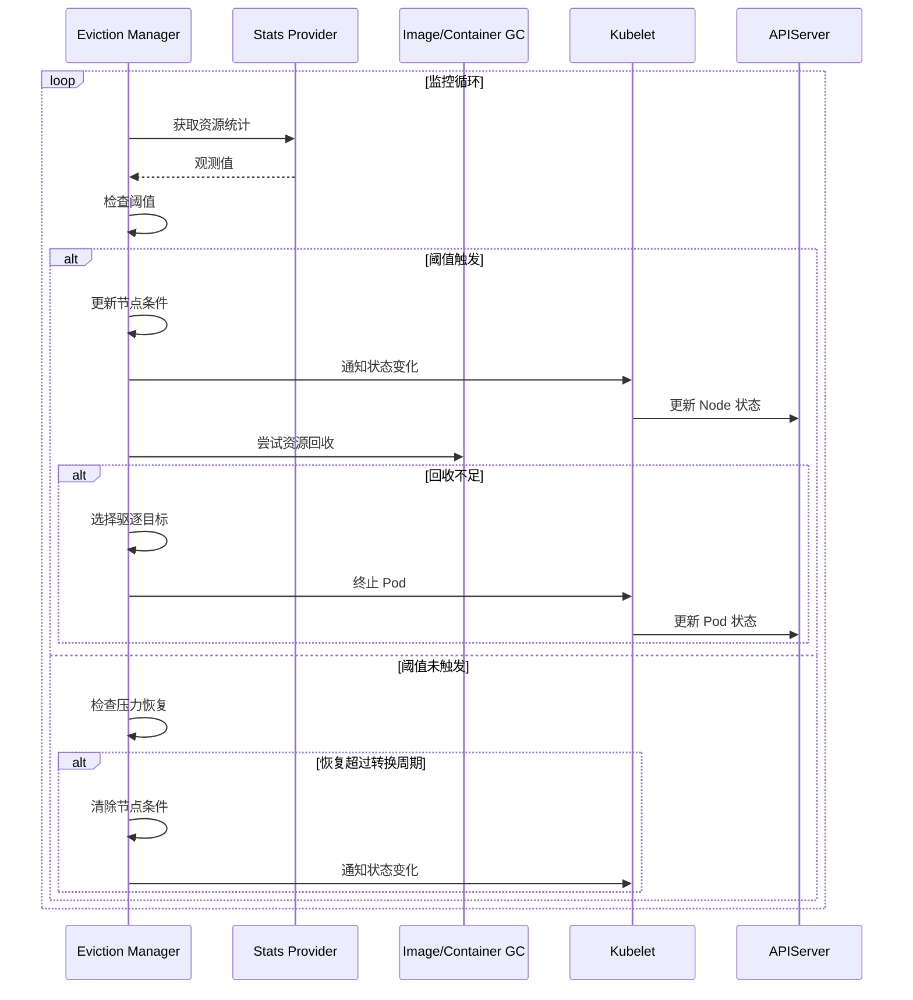

## 概述

Eviction Manager（驱逐管理器）是 Kubelet 中负责节点资源压力驱逐的核心组件。当节点资源（内存、磁盘、PID 等）达到临界阈值时，Eviction Manager 会根据优先级选择性地驱逐 Pod，以保护节点稳定性和高优先级工作负载。

## 驱逐信号



### 驱逐信号说明

| 信号 | 描述 | 计算方式 |
|------|------|----------|
| memory.available | 节点可用内存 | capacity - workingSet |
| allocatableMemory.available | 可分配内存 | allocatable - workingSet |
| nodefs.available | 节点文件系统可用空间 | nodefs.available |
| nodefs.inodesFree | 节点文件系统可用 inode | nodefs.inodesFree |
| imagefs.available | 镜像文件系统可用空间 | imagefs.available |
| imagefs.inodesFree | 镜像文件系统可用 inode | imagefs.inodesFree |
| pid.available | 可用 PID 数量 | allocatable PID - 已使用 PID |

## 驱逐阈值

### Hard 阈值

达到阈值时立即触发驱逐：

```yaml
# Kubelet 配置
apiVersion: kubelet.config.k8s.io/v1beta1
kind: KubeletConfiguration
evictionHard:
  memory.available: "100Mi"
  nodefs.available: "10%"
  nodefs.inodesFree: "5%"
  imagefs.available: "15%"
```

### Soft 阈值

达到阈值后等待宽限期再驱逐：

```yaml
evictionSoft:
  memory.available: "300Mi"
  nodefs.available: "15%"
evictionSoftGracePeriod:
  memory.available: "1m30s"
  nodefs.available: "2m"
```

### 最小回收量

驱逐时确保回收的最小资源量：

```yaml
evictionMinimumReclaim:
  memory.available: "100Mi"
  nodefs.available: "1Gi"
  imagefs.available: "2Gi"
```

## 架构设计



## 核心数据结构

### Manager 接口

```go
// pkg/kubelet/eviction/eviction_manager.go

// Manager 驱逐管理器接口
type Manager interface {
    // Start 启动驱逐管理器
    Start(
        diskInfoProvider DiskInfoProvider,
        podFunc ActivePodsFunc,
        podCleanedUpFunc PodCleanedUpFunc,
        monitoringInterval time.Duration,
    )

    // IsUnderMemoryPressure 是否处于内存压力
    IsUnderMemoryPressure() bool

    // IsUnderDiskPressure 是否处于磁盘压力
    IsUnderDiskPressure() bool

    // IsUnderPIDPressure 是否处于 PID 压力
    IsUnderPIDPressure() bool
}

// Config 驱逐配置
type Config struct {
    // PressureTransitionPeriod 压力状态转换周期
    PressureTransitionPeriod time.Duration

    // MaxPodGracePeriodSeconds 最大 Pod 优雅终止时间
    MaxPodGracePeriodSeconds int64

    // Thresholds 驱逐阈值
    Thresholds []evictionapi.Threshold

    // KernelMemcgNotification 使用内核 memcg 通知
    KernelMemcgNotification bool

    // PodCgroupRoot Pod cgroup 根路径
    PodCgroupRoot string
}

// ThresholdValue 阈值
type ThresholdValue struct {
    // Quantity 绝对值
    Quantity *resource.Quantity
    // Percentage 百分比
    Percentage float32
}

// Threshold 驱逐阈值
type Threshold struct {
    // Signal 驱逐信号
    Signal Signal
    // Operator 比较操作符
    Operator ThresholdOperator
    // Value 阈值
    Value ThresholdValue
    // GracePeriod 宽限期（仅 soft 阈值）
    GracePeriod time.Duration
    // MinReclaim 最小回收量
    MinReclaim *ThresholdValue
}
```

### managerImpl 实现

```go
// pkg/kubelet/eviction/eviction_manager.go

type managerImpl struct {
    // 配置
    config Config

    // 用于终止 Pod
    killPodFunc KillPodFunc

    // 用于获取 Pod 资源使用
    podGetter ActivePodsFunc

    // 镜像 GC
    imageGC ImageGC

    // 容器 GC
    containerGC ContainerGC

    // 上次观测到的状态
    lastObservations signalObservations

    // 当前资源压力状态
    nodeConditions []v1.NodeConditionType

    // 节点条件上次转换时间
    nodeConditionsLastObservedAt nodeConditionsObservedAt

    // 阈值首次观测时间
    thresholdsFirstObservedAt thresholdsObservedAt

    // 正在删除的 Pod UID 集合
    podsBeingEvicted sets.String

    // 记录事件
    recorder record.EventRecorder

    // 节点引用
    nodeRef *v1.ObjectReference

    // 时钟
    clock clock.Clock

    // 锁
    sync.RWMutex
}
```

## Eviction Manager 实现

### 初始化与启动

```go
// pkg/kubelet/eviction/eviction_manager.go

// NewManager 创建驱逐管理器
func NewManager(
    summaryProvider stats.SummaryProvider,
    config Config,
    killPodFunc KillPodFunc,
    imageGC ImageGC,
    containerGC ContainerGC,
    recorder record.EventRecorder,
    nodeRef *v1.ObjectReference,
    clock clock.Clock,
) (Manager, lifecycle.PodAdmitHandler) {

    manager := &managerImpl{
        config:                       config,
        killPodFunc:                  killPodFunc,
        imageGC:                      imageGC,
        containerGC:                  containerGC,
        recorder:                     recorder,
        nodeRef:                      nodeRef,
        clock:                        clock,
        nodeConditions:               []v1.NodeConditionType{},
        nodeConditionsLastObservedAt: nodeConditionsObservedAt{},
        thresholdsFirstObservedAt:    thresholdsObservedAt{},
        podsBeingEvicted:             sets.NewString(),
    }

    return manager, manager
}

// Start 启动驱逐管理器
func (m *managerImpl) Start(
    diskInfoProvider DiskInfoProvider,
    podFunc ActivePodsFunc,
    podCleanedUpFunc PodCleanedUpFunc,
    monitoringInterval time.Duration,
) {
    // 创建阈值通知器
    thresholdHandler := func(message string) {
        klog.InfoS(message)
        m.synchronize(diskInfoProvider, podFunc)
    }

    // 如果启用内核 memcg 通知
    if m.config.KernelMemcgNotification {
        for _, threshold := range m.config.Thresholds {
            if threshold.Signal == evictionapi.SignalMemoryAvailable {
                notifier, err := NewMemCGThresholdNotifier(
                    m.config.PodCgroupRoot,
                    threshold,
                    m.clock,
                    thresholdHandler,
                )
                if err != nil {
                    klog.ErrorS(err, "Failed to create memcg threshold notifier")
                    continue
                }
                go notifier.Start()
            }
        }
    }

    // 启动同步循环
    go wait.Until(func() {
        m.synchronize(diskInfoProvider, podFunc)
    }, monitoringInterval, wait.NeverStop)
}
```

### 同步循环

```go
// pkg/kubelet/eviction/eviction_manager.go

// synchronize 同步驱逐状态
func (m *managerImpl) synchronize(
    diskInfoProvider DiskInfoProvider,
    podFunc ActivePodsFunc,
) {
    // 获取活跃 Pod 列表
    activePods := podFunc()

    // 获取节点资源观测值
    observations, err := m.observe(diskInfoProvider)
    if err != nil {
        klog.ErrorS(err, "Failed to observe node resources")
        return
    }

    // 记录观测值
    klog.V(3).InfoS("Observed resource", "observations", observations)

    // 获取已触发的阈值
    thresholds := thresholdsMet(m.config.Thresholds, observations, false)

    // 过滤已满足 soft 宽限期的阈值
    thresholds = thresholdsMetGracePeriod(
        m.thresholdsFirstObservedAt,
        thresholds,
        m.clock.Now(),
    )

    // 更新阈值首次观测时间
    m.thresholdsFirstObservedAt = thresholdsUpdatedStats(
        m.thresholdsFirstObservedAt,
        thresholds,
        m.clock.Now(),
    )

    // 更新节点条件
    m.updateNodeConditions(observations, thresholds)

    // 如果没有触发阈值，返回
    if len(thresholds) == 0 {
        klog.V(3).InfoS("No eviction thresholds met")
        return
    }

    // 按信号对阈值排序
    sort.Sort(byEvictionPriority(thresholds))

    klog.InfoS("Eviction thresholds met", "thresholds", thresholds)

    // 尝试回收资源
    if m.reclaimResources(thresholds, observations, activePods) {
        klog.V(3).InfoS("Resources reclaimed, skipping pod eviction")
        return
    }

    // 选择并驱逐 Pod
    m.evictPods(thresholds, observations, activePods)
}
```

### 资源观测

```go
// pkg/kubelet/eviction/eviction_manager.go

// signalObservations 资源观测值
type signalObservations map[evictionapi.Signal]signalObservation

type signalObservation struct {
    // 可用资源
    available resource.Quantity
    // 容量
    capacity resource.Quantity
    // 观测时间
    time metav1.Time
}

// observe 观测节点资源
func (m *managerImpl) observe(diskInfoProvider DiskInfoProvider) (signalObservations, error) {
    observations := make(signalObservations)

    // 获取内存统计
    memoryStats, err := m.summaryProvider.GetNodeStats()
    if err != nil {
        return nil, err
    }

    // 内存可用量
    if memoryStats.Memory != nil && memoryStats.Memory.AvailableBytes != nil {
        observations[evictionapi.SignalMemoryAvailable] = signalObservation{
            available: *resource.NewQuantity(int64(*memoryStats.Memory.AvailableBytes), resource.BinarySI),
            capacity:  *resource.NewQuantity(int64(*memoryStats.Memory.TotalBytes), resource.BinarySI),
            time:      memoryStats.Memory.Time,
        }
    }

    // 磁盘统计
    diskStats := diskInfoProvider.GetDiskStats()
    if diskStats.NodeFs != nil {
        // 节点文件系统可用空间
        observations[evictionapi.SignalNodeFsAvailable] = signalObservation{
            available: *resource.NewQuantity(int64(*diskStats.NodeFs.AvailableBytes), resource.BinarySI),
            capacity:  *resource.NewQuantity(int64(*diskStats.NodeFs.CapacityBytes), resource.BinarySI),
            time:      diskStats.NodeFs.Time,
        }

        // 节点文件系统可用 inode
        observations[evictionapi.SignalNodeFsInodesFree] = signalObservation{
            available: *resource.NewQuantity(int64(*diskStats.NodeFs.InodesFree), resource.DecimalSI),
            capacity:  *resource.NewQuantity(int64(*diskStats.NodeFs.Inodes), resource.DecimalSI),
            time:      diskStats.NodeFs.Time,
        }
    }

    // 镜像文件系统
    if diskStats.ImageFs != nil {
        observations[evictionapi.SignalImageFsAvailable] = signalObservation{
            available: *resource.NewQuantity(int64(*diskStats.ImageFs.AvailableBytes), resource.BinarySI),
            capacity:  *resource.NewQuantity(int64(*diskStats.ImageFs.CapacityBytes), resource.BinarySI),
            time:      diskStats.ImageFs.Time,
        }
    }

    // PID 统计
    if memoryStats.Rlimit != nil && memoryStats.Rlimit.MaxPID != nil {
        available := int64(*memoryStats.Rlimit.MaxPID) - int64(*memoryStats.Rlimit.NumOfRunningProcesses)
        observations[evictionapi.SignalPIDAvailable] = signalObservation{
            available: *resource.NewQuantity(available, resource.DecimalSI),
            capacity:  *resource.NewQuantity(int64(*memoryStats.Rlimit.MaxPID), resource.DecimalSI),
            time:      memoryStats.StartTime,
        }
    }

    return observations, nil
}
```

### 资源回收

```go
// pkg/kubelet/eviction/eviction_manager.go

// reclaimResources 尝试回收资源
func (m *managerImpl) reclaimResources(
    thresholds []evictionapi.Threshold,
    observations signalObservations,
    activePods []*v1.Pod,
) bool {

    resourceReclaimed := false

    for _, threshold := range thresholds {
        switch threshold.Signal {
        case evictionapi.SignalMemoryAvailable:
            // 内存压力无法通过 GC 回收
            continue

        case evictionapi.SignalNodeFsAvailable,
            evictionapi.SignalNodeFsInodesFree:
            // 尝试容器 GC
            if m.containerGC != nil {
                klog.V(3).InfoS("Attempting to reclaim resources via container GC")
                err := m.containerGC.DeleteAllUnusedContainers()
                if err != nil {
                    klog.ErrorS(err, "Failed to perform container GC")
                }
                resourceReclaimed = true
            }

        case evictionapi.SignalImageFsAvailable,
            evictionapi.SignalImageFsInodesFree:
            // 尝试镜像 GC
            if m.imageGC != nil {
                klog.V(3).InfoS("Attempting to reclaim resources via image GC")
                err := m.imageGC.DeleteUnusedImages()
                if err != nil {
                    klog.ErrorS(err, "Failed to perform image GC")
                }
                resourceReclaimed = true
            }
        }
    }

    return resourceReclaimed
}
```

## Pod 驱逐

### 驱逐排序



### 驱逐实现

```go
// pkg/kubelet/eviction/eviction_manager.go

// evictPods 驱逐 Pod
func (m *managerImpl) evictPods(
    thresholds []evictionapi.Threshold,
    observations signalObservations,
    activePods []*v1.Pod,
) {
    // 按信号对 Pod 排序
    for _, threshold := range thresholds {
        // 获取该信号的排序函数
        rankFunc := rankFuncFor(threshold.Signal)

        // 对 Pod 排序
        sort.Sort(rankFunc(activePods, observations))

        klog.V(3).InfoS("Pods ranked for eviction",
            "signal", threshold.Signal,
            "pods", podNames(activePods))

        // 选择要驱逐的 Pod
        for _, pod := range activePods {
            // 检查是否正在驱逐
            if m.podsBeingEvicted.Has(string(pod.UID)) {
                continue
            }

            // 检查是否是关键 Pod
            if kubetypes.IsCriticalPod(pod) {
                klog.V(1).InfoS("Skipping eviction of critical pod",
                    "pod", klog.KObj(pod))
                continue
            }

            // 计算优雅终止时间
            gracePeriodOverride := m.calculateGracePeriod(threshold, pod)

            // 执行驱逐
            klog.InfoS("Evicting pod",
                "pod", klog.KObj(pod),
                "signal", threshold.Signal,
                "gracePeriod", gracePeriodOverride)

            m.podsBeingEvicted.Insert(string(pod.UID))

            // 记录事件
            m.recorder.Eventf(
                pod,
                v1.EventTypeWarning,
                "Evicted",
                "The node had condition: %s",
                []v1.NodeConditionType{nodeConditionFor(threshold.Signal)},
            )

            // 调用 killPodFunc
            err := m.killPodFunc(pod, true, &gracePeriodOverride, func(status *v1.PodStatus) {
                status.Phase = v1.PodFailed
                status.Reason = "Evicted"
                status.Message = fmt.Sprintf("The node was low on resource: %s",
                    threshold.Signal)
            })

            if err != nil {
                klog.ErrorS(err, "Failed to evict pod", "pod", klog.KObj(pod))
                m.podsBeingEvicted.Delete(string(pod.UID))
                continue
            }

            // 检查是否满足最小回收量
            if m.checkMinReclaim(threshold, observations) {
                klog.V(3).InfoS("Minimum reclaim satisfied, stopping eviction")
                return
            }
        }
    }
}

// rankFuncFor 返回信号对应的排序函数
func rankFuncFor(signal evictionapi.Signal) rankFunc {
    switch signal {
    case evictionapi.SignalMemoryAvailable,
        evictionapi.SignalAllocatableMemoryAvailable:
        return rankMemoryPressure

    case evictionapi.SignalNodeFsAvailable,
        evictionapi.SignalNodeFsInodesFree,
        evictionapi.SignalImageFsAvailable,
        evictionapi.SignalImageFsInodesFree:
        return rankDiskPressure

    case evictionapi.SignalPIDAvailable:
        return rankPIDPressure

    default:
        return rankMemoryPressure
    }
}
```

### 内存压力排序

```go
// pkg/kubelet/eviction/helpers.go

// rankMemoryPressure 内存压力 Pod 排序
func rankMemoryPressure(pods []*v1.Pod, stats signalObservations) sort.Interface {
    orderedBy(
        // 1. BestEffort Pod 优先驱逐
        qosComparator,
        // 2. 内存使用超过请求的 Pod
        memoryUsageExceedsRequest,
        // 3. 优先级低的 Pod
        priorityComparator,
        // 4. 内存使用量大的 Pod
        memoryUsage,
    ).Sort(pods)

    return sortableList{pods}
}

// qosComparator 按 QoS 排序
func qosComparator(p1, p2 *v1.Pod) int {
    qos1 := v1qos.GetPodQOS(p1)
    qos2 := v1qos.GetPodQOS(p2)

    // BestEffort < Burstable < Guaranteed
    switch {
    case qos1 == v1.PodQOSBestEffort && qos2 != v1.PodQOSBestEffort:
        return -1
    case qos1 != v1.PodQOSBestEffort && qos2 == v1.PodQOSBestEffort:
        return 1
    case qos1 == v1.PodQOSBurstable && qos2 == v1.PodQOSGuaranteed:
        return -1
    case qos1 == v1.PodQOSGuaranteed && qos2 == v1.PodQOSBurstable:
        return 1
    default:
        return 0
    }
}

// memoryUsageExceedsRequest 检查内存使用是否超过请求
func memoryUsageExceedsRequest(p1, p2 *v1.Pod) int {
    // 获取 Pod 内存使用和请求
    usage1 := getPodMemoryUsage(p1)
    request1 := getPodMemoryRequest(p1)
    exceeds1 := usage1.Cmp(request1) > 0

    usage2 := getPodMemoryUsage(p2)
    request2 := getPodMemoryRequest(p2)
    exceeds2 := usage2.Cmp(request2) > 0

    if exceeds1 && !exceeds2 {
        return -1
    }
    if !exceeds1 && exceeds2 {
        return 1
    }
    return 0
}

// priorityComparator 按优先级排序
func priorityComparator(p1, p2 *v1.Pod) int {
    priority1 := getPodPriority(p1)
    priority2 := getPodPriority(p2)

    // 低优先级先驱逐
    if priority1 < priority2 {
        return -1
    }
    if priority1 > priority2 {
        return 1
    }
    return 0
}

// memoryUsage 按内存使用量排序
func memoryUsage(p1, p2 *v1.Pod) int {
    usage1 := getPodMemoryUsage(p1)
    usage2 := getPodMemoryUsage(p2)

    // 使用量大的先驱逐
    return usage2.Cmp(usage1)
}
```

## 节点状态更新

```go
// pkg/kubelet/eviction/eviction_manager.go

// nodeConditionFor 返回信号对应的节点条件
func nodeConditionFor(signal evictionapi.Signal) v1.NodeConditionType {
    switch signal {
    case evictionapi.SignalMemoryAvailable,
        evictionapi.SignalAllocatableMemoryAvailable:
        return v1.NodeMemoryPressure

    case evictionapi.SignalNodeFsAvailable,
        evictionapi.SignalNodeFsInodesFree,
        evictionapi.SignalImageFsAvailable,
        evictionapi.SignalImageFsInodesFree:
        return v1.NodeDiskPressure

    case evictionapi.SignalPIDAvailable:
        return v1.NodePIDPressure

    default:
        return ""
    }
}

// updateNodeConditions 更新节点条件
func (m *managerImpl) updateNodeConditions(
    observations signalObservations,
    thresholds []evictionapi.Threshold,
) {
    m.Lock()
    defer m.Unlock()

    now := m.clock.Now()
    newConditions := []v1.NodeConditionType{}

    // 确定当前触发的条件
    for _, threshold := range thresholds {
        condition := nodeConditionFor(threshold.Signal)
        if condition != "" {
            newConditions = append(newConditions, condition)
        }
    }

    // 更新条件转换时间
    for _, condition := range newConditions {
        if !containsCondition(m.nodeConditions, condition) {
            // 新条件，记录首次观测时间
            m.nodeConditionsLastObservedAt[condition] = now
        }
    }

    // 检查条件恢复
    for condition, observedAt := range m.nodeConditionsLastObservedAt {
        if !containsCondition(newConditions, condition) {
            // 条件已恢复，检查是否超过转换周期
            if now.Sub(observedAt) > m.config.PressureTransitionPeriod {
                delete(m.nodeConditionsLastObservedAt, condition)
            } else {
                // 仍在转换周期内，保持条件
                newConditions = append(newConditions, condition)
            }
        }
    }

    m.nodeConditions = newConditions
}

// IsUnderMemoryPressure 是否处于内存压力
func (m *managerImpl) IsUnderMemoryPressure() bool {
    m.RLock()
    defer m.RUnlock()
    return containsCondition(m.nodeConditions, v1.NodeMemoryPressure)
}

// IsUnderDiskPressure 是否处于磁盘压力
func (m *managerImpl) IsUnderDiskPressure() bool {
    m.RLock()
    defer m.RUnlock()
    return containsCondition(m.nodeConditions, v1.NodeDiskPressure)
}

// IsUnderPIDPressure 是否处于 PID 压力
func (m *managerImpl) IsUnderPIDPressure() bool {
    m.RLock()
    defer m.RUnlock()
    return containsCondition(m.nodeConditions, v1.NodePIDPressure)
}
```

## Pod 准入控制

```go
// pkg/kubelet/eviction/eviction_manager.go

// Admit 检查 Pod 是否可以准入
func (m *managerImpl) Admit(attrs *lifecycle.PodAdmitAttributes) lifecycle.PodAdmitResult {
    m.RLock()
    defer m.RUnlock()

    // 如果节点处于压力状态
    if len(m.nodeConditions) == 0 {
        return lifecycle.PodAdmitResult{Admit: true}
    }

    pod := attrs.Pod

    // 关键 Pod 始终准入
    if kubetypes.IsCriticalPod(pod) {
        return lifecycle.PodAdmitResult{Admit: true}
    }

    // 检查 Pod 是否可以容忍当前压力
    for _, condition := range m.nodeConditions {
        // 检查是否有对应的容忍
        if !m.podToleratesCondition(pod, condition) {
            message := fmt.Sprintf(
                "node has condition: %s, cannot admit pod",
                condition,
            )
            return lifecycle.PodAdmitResult{
                Admit:   false,
                Reason:  "NodeUnderPressure",
                Message: message,
            }
        }
    }

    return lifecycle.PodAdmitResult{Admit: true}
}

// podToleratesCondition 检查 Pod 是否容忍条件
func (m *managerImpl) podToleratesCondition(
    pod *v1.Pod,
    condition v1.NodeConditionType,
) bool {
    // BestEffort Pod 在资源压力下不准入
    if v1qos.GetPodQOS(pod) == v1.PodQOSBestEffort {
        return false
    }

    // 检查是否有对应的容忍
    for _, toleration := range pod.Spec.Tolerations {
        if string(toleration.Key) == string(condition) {
            return true
        }
    }

    return false
}
```

## 驱逐流程



## 配置示例

### 生产环境推荐配置

```yaml
apiVersion: kubelet.config.k8s.io/v1beta1
kind: KubeletConfiguration
# Hard 阈值 - 立即驱逐
evictionHard:
  memory.available: "100Mi"
  nodefs.available: "10%"
  nodefs.inodesFree: "5%"
  imagefs.available: "15%"
  pid.available: "5%"

# Soft 阈值 - 有宽限期
evictionSoft:
  memory.available: "300Mi"
  nodefs.available: "15%"
  imagefs.available: "20%"

# Soft 阈值宽限期
evictionSoftGracePeriod:
  memory.available: "1m30s"
  nodefs.available: "2m"
  imagefs.available: "2m"

# 最小回收量
evictionMinimumReclaim:
  memory.available: "100Mi"
  nodefs.available: "1Gi"
  imagefs.available: "2Gi"

# 压力状态转换周期
evictionPressureTransitionPeriod: "5m"

# 最大 Pod 优雅终止时间
evictionMaxPodGracePeriod: 60
```

## 监控与调试

### 关键指标

```go
// pkg/kubelet/eviction/eviction_manager.go

var (
    // 驱逐计数
    evictionsTotal = prometheus.NewCounterVec(
        prometheus.CounterOpts{
            Name: "kubelet_evictions_total",
            Help: "Total number of pod evictions",
        },
        []string{"eviction_signal"},
    )

    // 节点压力状态
    nodeConditionGauge = prometheus.NewGaugeVec(
        prometheus.GaugeOpts{
            Name: "kubelet_node_condition",
            Help: "Node condition status (1 for true, 0 for false)",
        },
        []string{"condition"},
    )
)
```

### 调试命令

```bash
# 查看节点状态
kubectl describe node <node-name> | grep -A 10 "Conditions"

# 查看驱逐事件
kubectl get events --field-selector reason=Evicted

# 查看 Kubelet 日志中的驱逐信息
journalctl -u kubelet | grep -i evict

# 检查节点资源使用
kubectl top node <node-name>

# 查看 Pod 资源使用
kubectl top pods --all-namespaces
```

## 最佳实践

1. **设置合理阈值**：根据节点资源和工作负载特点设置阈值
2. **使用 Soft 阈值**：为非关键工作负载提供缓冲时间
3. **配置 Pod 优先级**：确保关键服务不被驱逐
4. **资源请求与限制**：为 Pod 设置合理的资源请求
5. **监控告警**：在阈值触发前发出告警
6. **定期清理**：配置合理的镜像和容器 GC 策略

## 总结

Eviction Manager 是 Kubelet 保护节点稳定性的关键组件：

1. **多维度监控**：内存、磁盘、PID 等资源信号
2. **分级阈值**：Hard 和 Soft 阈值配合使用
3. **智能排序**：基于 QoS、优先级、资源使用量排序
4. **准入控制**：压力状态下拒绝新 Pod
5. **优雅处理**：支持宽限期和最小回收量

合理配置驱逐策略对于保证集群稳定性至关重要。
