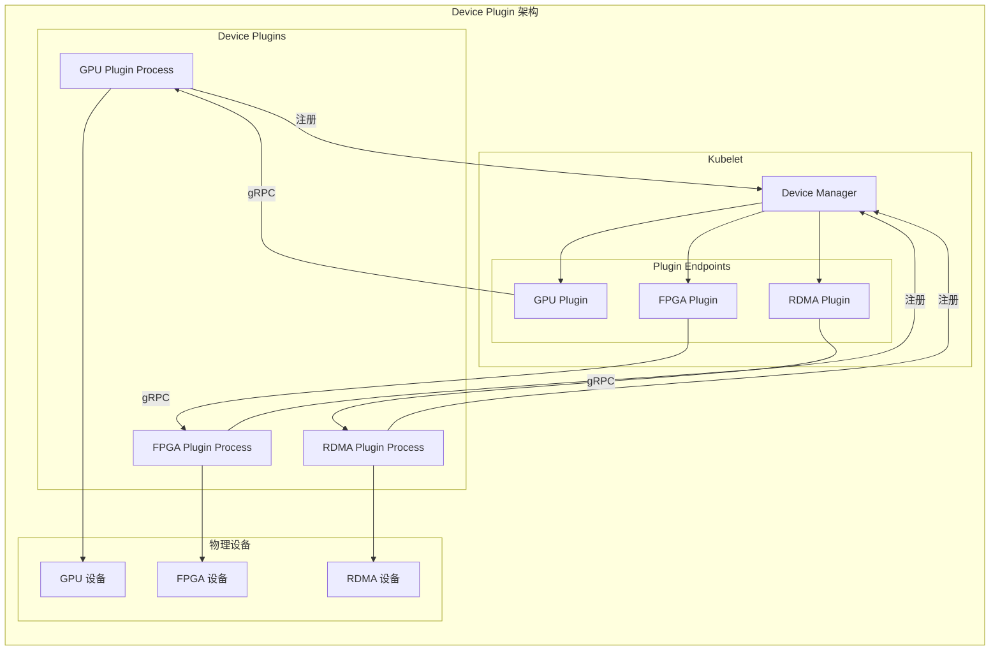
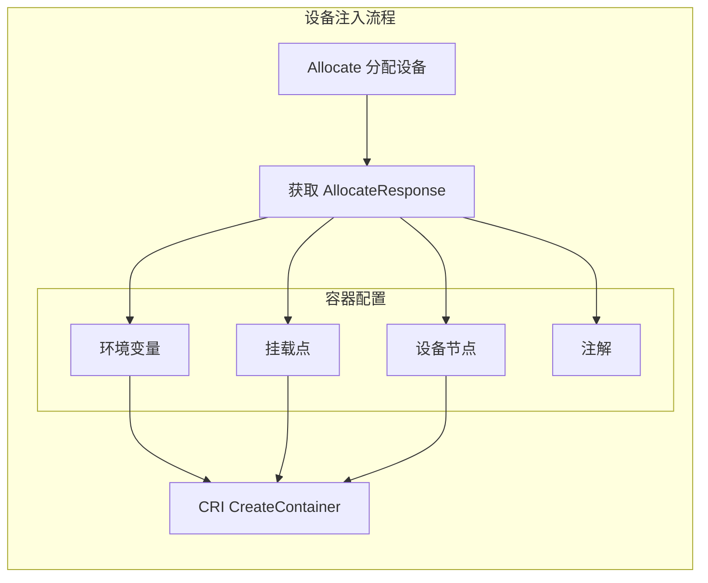

## 概述

Device Plugin（设备插件）是 Kubernetes 扩展设备资源的标准机制。通过 Device Plugin API，厂商可以将 GPU、FPGA、InfiniBand 等硬件设备暴露给 Kubernetes，而无需修改 Kubernetes 核心代码。Kubelet 通过 gRPC 与设备插件通信，实现设备的发现、分配和健康检查。

## 架构设计



## Device Plugin API

### 接口定义

```protobuf
// pkg/kubelet/apis/deviceplugin/v1beta1/api.proto

// Registration 服务用于插件注册
service Registration {
    rpc Register(RegisterRequest) returns (Empty) {}
}

// DevicePlugin 服务用于设备管理
service DevicePlugin {
    // GetDevicePluginOptions 获取插件选项
    rpc GetDevicePluginOptions(Empty) returns (DevicePluginOptions) {}

    // ListAndWatch 列出设备并监控变化
    rpc ListAndWatch(Empty) returns (stream ListAndWatchResponse) {}

    // GetPreferredAllocation 获取首选分配方案
    rpc GetPreferredAllocation(PreferredAllocationRequest) returns (PreferredAllocationResponse) {}

    // Allocate 分配设备给容器
    rpc Allocate(AllocateRequest) returns (AllocateResponse) {}

    // PreStartContainer 容器启动前回调
    rpc PreStartContainer(PreStartContainerRequest) returns (PreStartContainerResponse) {}
}
```

### 数据结构

```go
// pkg/kubelet/apis/deviceplugin/v1beta1/api.pb.go

// RegisterRequest 注册请求
type RegisterRequest struct {
    // 插件 API 版本
    Version string
    // 插件监听的 Unix socket 路径
    Endpoint string
    // 资源名称（如 nvidia.com/gpu）
    ResourceName string
    // 插件选项
    Options *DevicePluginOptions
}

// DevicePluginOptions 插件选项
type DevicePluginOptions struct {
    // 是否需要 PreStartContainer 调用
    PreStartRequired bool
    // 是否使用 GetPreferredAllocation
    GetPreferredAllocationAvailable bool
}

// Device 设备信息
type Device struct {
    // 设备 ID
    ID string
    // 健康状态
    Health string
    // 拓扑信息
    Topology *TopologyInfo
}

// TopologyInfo 拓扑信息
type TopologyInfo struct {
    // NUMA 节点
    Nodes []*NUMANode
}

// AllocateRequest 分配请求
type AllocateRequest struct {
    // 容器分配请求
    ContainerRequests []*ContainerAllocateRequest
}

// ContainerAllocateRequest 单容器分配请求
type ContainerAllocateRequest struct {
    // 要分配的设备 ID
    DevicesIDs []string
}

// AllocateResponse 分配响应
type AllocateResponse struct {
    // 容器分配响应
    ContainerResponses []*ContainerAllocateResponse
}

// ContainerAllocateResponse 单容器分配响应
type ContainerAllocateResponse struct {
    // 环境变量
    Envs map[string]string
    // 挂载点
    Mounts []*Mount
    // 设备
    Devices []*DeviceSpec
    // 注解
    Annotations map[string]string
}

// DeviceSpec 设备规格
type DeviceSpec struct {
    // 容器内路径
    ContainerPath string
    // 宿主机路径
    HostPath string
    // 权限
    Permissions string
}
```

## Device Manager

### 结构定义

```go
// pkg/kubelet/cm/devicemanager/manager.go

// Manager 管理设备插件
type Manager interface {
    // Start 启动设备管理器
    Start(activePods ActivePodsFunc, sourcesReady config.SourcesReady) error

    // Allocate 为容器分配设备
    Allocate(pod *v1.Pod, container *v1.Container) error

    // UpdatePluginResources 更新插件资源
    UpdatePluginResources(node *schedulerframework.NodeInfo, attrs *lifecycle.PodAdmitAttributes) error

    // GetDeviceRunContainerOptions 获取容器运行选项
    GetDeviceRunContainerOptions(pod *v1.Pod, container *v1.Container) (*DeviceRunContainerOptions, error)

    // GetCapacity 获取设备容量
    GetCapacity() (v1.ResourceList, v1.ResourceList, []string)

    // GetWatcherHandler 获取插件监视器
    GetWatcherHandler() cache.PluginHandler

    // GetHealthyDevices 获取健康设备
    GetHealthyDevices() map[string]sets.String

    // GetAllocatableDevices 获取可分配设备
    GetAllocatableDevices() ResourceDeviceInstances

    // GetDevices 获取 Pod 分配的设备
    GetDevices(podUID, containerName string) ResourceDeviceInstances

    // ShouldResetExtendedResourceCapacity 是否重置扩展资源容量
    ShouldResetExtendedResourceCapacity() bool

    // TopologyManager 支持
    GetTopologyHints(pod *v1.Pod, container *v1.Container) map[string][]topologymanager.TopologyHint
    GetPodTopologyHints(pod *v1.Pod) map[string][]topologymanager.TopologyHint
}

// ManagerImpl 实现
type ManagerImpl struct {
    // 插件目录
    socketdir string
    socketname string

    // 已注册的端点
    endpoints map[string]endpointInfo

    // 健康设备
    healthyDevices map[string]sets.String

    // 不健康设备
    unhealthyDevices map[string]sets.String

    // 已分配设备
    allocatedDevices map[string]sets.String

    // Pod 设备分配
    podDevices        *podDevices
    checkpointManager checkpointmanager.CheckpointManager

    // 回调函数
    sourcesReady config.SourcesReady
    activePods   ActivePodsFunc

    // 锁
    mutex sync.Mutex

    // 拓扑管理器
    topologyAffinityStore topologymanager.Store
}
```

### 初始化与启动

```go
// pkg/kubelet/cm/devicemanager/manager.go

// NewManager 创建设备管理器
func NewManager(
    topology []cadvisorapi.Node,
    topologyAffinityStore topologymanager.Store,
    socketPath string,
) (*ManagerImpl, error) {

    klog.V(2).InfoS("Creating Device Plugin manager", "path", socketPath)

    m := &ManagerImpl{
        endpoints:             make(map[string]endpointInfo),
        healthyDevices:        make(map[string]sets.String),
        unhealthyDevices:      make(map[string]sets.String),
        allocatedDevices:      make(map[string]sets.String),
        podDevices:            newPodDevices(),
        topologyAffinityStore: topologyAffinityStore,
    }

    m.socketdir = filepath.Dir(socketPath)
    m.socketname = filepath.Base(socketPath)

    // 创建 checkpoint 管理器
    checkpointManager, err := checkpointmanager.NewCheckpointManager(m.socketdir)
    if err != nil {
        return nil, err
    }
    m.checkpointManager = checkpointManager

    return m, nil
}

// Start 启动设备管理器
func (m *ManagerImpl) Start(
    activePods ActivePodsFunc,
    sourcesReady config.SourcesReady,
) error {
    klog.V(2).InfoS("Starting Device Plugin manager")

    m.activePods = activePods
    m.sourcesReady = sourcesReady

    // 从 checkpoint 恢复状态
    if err := m.readCheckpoint(); err != nil {
        klog.InfoS("Failed to read device plugin checkpoint, starting fresh")
    }

    // 创建注册服务
    socketPath := filepath.Join(m.socketdir, m.socketname)
    if err := os.MkdirAll(m.socketdir, 0750); err != nil {
        return err
    }

    // 删除旧的 socket
    if err := os.Remove(socketPath); err != nil && !os.IsNotExist(err) {
        return err
    }

    // 创建 gRPC 服务器
    s, err := net.Listen("unix", socketPath)
    if err != nil {
        return err
    }

    m.server = grpc.NewServer()
    pluginapi.RegisterRegistrationServer(m.server, m)

    go func() {
        m.server.Serve(s)
    }()

    klog.V(2).InfoS("Device Plugin manager started", "socket", socketPath)
    return nil
}
```

### 插件注册

```go
// pkg/kubelet/cm/devicemanager/manager.go

// Register 处理插件注册请求
func (m *ManagerImpl) Register(
    ctx context.Context,
    r *pluginapi.RegisterRequest,
) (*pluginapi.Empty, error) {

    klog.InfoS("Received registration request from device plugin",
        "resourceName", r.ResourceName,
        "endpoint", r.Endpoint)

    // 验证资源名称
    if !v1helper.IsExtendedResourceName(v1.ResourceName(r.ResourceName)) {
        return nil, fmt.Errorf("invalid resource name %s", r.ResourceName)
    }

    // 创建端点
    e, err := newEndpointImpl(
        filepath.Join(m.socketdir, r.Endpoint),
        r.ResourceName,
    )
    if err != nil {
        return nil, err
    }

    m.mutex.Lock()
    defer m.mutex.Unlock()

    // 替换已有端点
    if old, ok := m.endpoints[r.ResourceName]; ok {
        old.client.Disconnect()
    }

    m.endpoints[r.ResourceName] = endpointInfo{
        e:        e,
        resource: r.ResourceName,
    }

    // 启动 ListAndWatch
    go m.runEndpoint(r.ResourceName, e)

    return &pluginapi.Empty{}, nil
}

// runEndpoint 运行端点监控
func (m *ManagerImpl) runEndpoint(resourceName string, e endpoint) {
    e.run()
    e.stop()

    m.mutex.Lock()
    defer m.mutex.Unlock()

    // 端点停止，清理资源
    if _, ok := m.endpoints[resourceName]; ok {
        delete(m.endpoints, resourceName)
    }

    klog.V(2).InfoS("Endpoint stopped", "resourceName", resourceName)
}
```

## Endpoint 实现

### ListAndWatch

```go
// pkg/kubelet/cm/devicemanager/endpoint.go

// endpoint 封装与设备插件的通信
type endpointImpl struct {
    client pluginapi.DevicePluginClient
    conn   *grpc.ClientConn

    socketPath   string
    resourceName string

    stopCh chan struct{}
    mutex  sync.Mutex
}

// run 运行 ListAndWatch
func (e *endpointImpl) run() {
    stream, err := e.client.ListAndWatch(context.Background(), &pluginapi.Empty{})
    if err != nil {
        klog.ErrorS(err, "ListAndWatch failed", "resource", e.resourceName)
        return
    }

    for {
        response, err := stream.Recv()
        if err != nil {
            klog.ErrorS(err, "ListAndWatch stream closed", "resource", e.resourceName)
            return
        }

        // 更新设备列表
        e.callback(response.Devices)
    }
}

// callback 处理设备更新
func (e *endpointImpl) callback(devices []*pluginapi.Device) {
    e.mutex.Lock()
    defer e.mutex.Unlock()

    healthy := sets.NewString()
    unhealthy := sets.NewString()

    for _, d := range devices {
        if d.Health == pluginapi.Healthy {
            healthy.Insert(d.ID)
        } else {
            unhealthy.Insert(d.ID)
        }
    }

    // 通知设备管理器
    e.manager.deviceCallback(e.resourceName, healthy, unhealthy)
}
```

### 设备分配

```go
// pkg/kubelet/cm/devicemanager/manager.go

// Allocate 为容器分配设备
func (m *ManagerImpl) Allocate(pod *v1.Pod, container *v1.Container) error {
    m.mutex.Lock()
    defer m.mutex.Unlock()

    // 检查是否需要分配设备
    for resourceName, quantity := range container.Resources.Limits {
        if !v1helper.IsExtendedResourceName(resourceName) {
            continue
        }

        needed := int(quantity.Value())
        if needed == 0 {
            continue
        }

        // 获取端点
        e, ok := m.endpoints[string(resourceName)]
        if !ok {
            return fmt.Errorf("no device plugin for resource %s", resourceName)
        }

        // 选择设备
        devices, err := m.devicesToAllocate(
            string(pod.UID),
            container.Name,
            string(resourceName),
            needed,
        )
        if err != nil {
            return err
        }

        // 调用插件分配
        resp, err := e.allocate(devices)
        if err != nil {
            return err
        }

        // 记录分配
        m.podDevices.insert(
            string(pod.UID),
            container.Name,
            string(resourceName),
            devices,
            resp,
        )
    }

    // 保存 checkpoint
    return m.writeCheckpoint()
}

// devicesToAllocate 选择要分配的设备
func (m *ManagerImpl) devicesToAllocate(
    podUID, containerName, resource string,
    needed int,
) ([]string, error) {

    // 检查是否已分配
    if allocated := m.podDevices.containerDevices(podUID, containerName, resource); len(allocated) > 0 {
        if len(allocated) != needed {
            return nil, fmt.Errorf("device allocation mismatch")
        }
        return allocated.UnsortedList(), nil
    }

    // 获取可用设备
    healthy := m.healthyDevices[resource]
    allocated := m.allocatedDevices[resource]
    available := healthy.Difference(allocated)

    if available.Len() < needed {
        return nil, fmt.Errorf(
            "requested %d devices but only %d available for resource %s",
            needed, available.Len(), resource,
        )
    }

    // 选择设备（考虑拓扑亲和性）
    devices := m.selectDevices(resource, available.UnsortedList(), needed)

    return devices, nil
}

// selectDevices 选择设备
func (m *ManagerImpl) selectDevices(
    resource string,
    available []string,
    needed int,
) []string {

    // 如果有拓扑管理器，使用首选分配
    if m.topologyAffinityStore != nil {
        e := m.endpoints[resource]
        if e.options != nil && e.options.GetPreferredAllocationAvailable {
            preferred, err := e.getPreferredAllocation(available, needed)
            if err == nil {
                return preferred
            }
            klog.ErrorS(err, "GetPreferredAllocation failed, using default selection")
        }
    }

    // 默认选择前 N 个
    return available[:needed]
}
```

## 容器配置注入



### GetDeviceRunContainerOptions

```go
// pkg/kubelet/cm/devicemanager/manager.go

// DeviceRunContainerOptions 设备容器运行选项
type DeviceRunContainerOptions struct {
    // 设备
    Devices []kubecontainer.DeviceInfo
    // 挂载点
    Mounts []kubecontainer.Mount
    // 环境变量
    Envs []kubecontainer.EnvVar
    // 注解
    Annotations []kubecontainer.Annotation
}

// GetDeviceRunContainerOptions 获取容器运行选项
func (m *ManagerImpl) GetDeviceRunContainerOptions(
    pod *v1.Pod,
    container *v1.Container,
) (*DeviceRunContainerOptions, error) {

    m.mutex.Lock()
    defer m.mutex.Unlock()

    podUID := string(pod.UID)
    containerName := container.Name

    // 获取该容器的所有设备分配响应
    resources := m.podDevices.containerDevices(podUID, containerName, "")
    if len(resources) == 0 {
        return nil, nil
    }

    opts := &DeviceRunContainerOptions{}

    for resourceName, deviceIDs := range resources {
        // 获取分配响应
        resp := m.podDevices.deviceRunContainerOptions(podUID, containerName, resourceName)
        if resp == nil {
            continue
        }

        // 合并环境变量
        for k, v := range resp.Envs {
            opts.Envs = append(opts.Envs, kubecontainer.EnvVar{
                Name:  k,
                Value: v,
            })
        }

        // 合并挂载点
        for _, mount := range resp.Mounts {
            opts.Mounts = append(opts.Mounts, kubecontainer.Mount{
                ContainerPath: mount.ContainerPath,
                HostPath:      mount.HostPath,
                ReadOnly:      mount.ReadOnly,
            })
        }

        // 合并设备
        for _, device := range resp.Devices {
            opts.Devices = append(opts.Devices, kubecontainer.DeviceInfo{
                PathOnHost:      device.HostPath,
                PathInContainer: device.ContainerPath,
                Permissions:     device.Permissions,
            })
        }

        // 合并注解
        for k, v := range resp.Annotations {
            opts.Annotations = append(opts.Annotations, kubecontainer.Annotation{
                Name:  k,
                Value: v,
            })
        }
    }

    return opts, nil
}
```

## GPU 设备插件示例

### NVIDIA GPU Plugin

```go
// 简化的 NVIDIA GPU 设备插件实现

package main

import (
    "context"
    "net"
    "os"
    "time"

    "google.golang.org/grpc"
    pluginapi "k8s.io/kubelet/pkg/apis/deviceplugin/v1beta1"
)

const (
    resourceName = "nvidia.com/gpu"
    socketName   = "nvidia.sock"
    socketPath   = pluginapi.DevicePluginPath + socketName
)

type NvidiaDevicePlugin struct {
    devices []*pluginapi.Device
    server  *grpc.Server
    stop    chan struct{}
}

func NewNvidiaDevicePlugin() *NvidiaDevicePlugin {
    return &NvidiaDevicePlugin{
        devices: getDevices(),
        stop:    make(chan struct{}),
    }
}

// getDevices 发现 GPU 设备
func getDevices() []*pluginapi.Device {
    // 调用 NVML 库发现 GPU
    devices := []*pluginapi.Device{}

    // 示例：假设有 4 个 GPU
    for i := 0; i < 4; i++ {
        devices = append(devices, &pluginapi.Device{
            ID:     fmt.Sprintf("GPU-%d", i),
            Health: pluginapi.Healthy,
        })
    }

    return devices
}

// Start 启动插件
func (p *NvidiaDevicePlugin) Start() error {
    // 删除旧 socket
    os.Remove(socketPath)

    // 创建 gRPC 服务器
    sock, err := net.Listen("unix", socketPath)
    if err != nil {
        return err
    }

    p.server = grpc.NewServer()
    pluginapi.RegisterDevicePluginServer(p.server, p)

    go p.server.Serve(sock)

    // 等待 socket 就绪
    time.Sleep(time.Second)

    // 向 Kubelet 注册
    return p.register()
}

// register 向 Kubelet 注册
func (p *NvidiaDevicePlugin) register() error {
    conn, err := grpc.Dial(
        pluginapi.KubeletSocket,
        grpc.WithInsecure(),
        grpc.WithDialer(func(addr string, timeout time.Duration) (net.Conn, error) {
            return net.DialTimeout("unix", addr, timeout)
        }),
    )
    if err != nil {
        return err
    }
    defer conn.Close()

    client := pluginapi.NewRegistrationClient(conn)

    _, err = client.Register(context.Background(), &pluginapi.RegisterRequest{
        Version:      pluginapi.Version,
        Endpoint:     socketName,
        ResourceName: resourceName,
    })

    return err
}

// GetDevicePluginOptions 返回插件选项
func (p *NvidiaDevicePlugin) GetDevicePluginOptions(
    ctx context.Context,
    e *pluginapi.Empty,
) (*pluginapi.DevicePluginOptions, error) {
    return &pluginapi.DevicePluginOptions{
        PreStartRequired: true,
    }, nil
}

// ListAndWatch 监控设备变化
func (p *NvidiaDevicePlugin) ListAndWatch(
    e *pluginapi.Empty,
    s pluginapi.DevicePlugin_ListAndWatchServer,
) error {
    // 发送初始设备列表
    s.Send(&pluginapi.ListAndWatchResponse{Devices: p.devices})

    // 持续监控
    for {
        select {
        case <-p.stop:
            return nil
        case <-time.After(time.Second * 10):
            // 检查设备健康状态
            p.updateDeviceHealth()
            s.Send(&pluginapi.ListAndWatchResponse{Devices: p.devices})
        }
    }
}

// Allocate 分配设备
func (p *NvidiaDevicePlugin) Allocate(
    ctx context.Context,
    req *pluginapi.AllocateRequest,
) (*pluginapi.AllocateResponse, error) {
    responses := &pluginapi.AllocateResponse{}

    for _, containerReq := range req.ContainerRequests {
        resp := &pluginapi.ContainerAllocateResponse{
            Envs: map[string]string{
                "NVIDIA_VISIBLE_DEVICES": strings.Join(containerReq.DevicesIDs, ","),
            },
            Mounts: []*pluginapi.Mount{
                {
                    ContainerPath: "/usr/local/nvidia/lib64",
                    HostPath:      "/usr/local/nvidia/lib64",
                    ReadOnly:      true,
                },
            },
            Devices: []*pluginapi.DeviceSpec{},
        }

        // 添加设备节点
        for _, id := range containerReq.DevicesIDs {
            resp.Devices = append(resp.Devices, &pluginapi.DeviceSpec{
                ContainerPath: fmt.Sprintf("/dev/nvidia%s", id),
                HostPath:      fmt.Sprintf("/dev/nvidia%s", id),
                Permissions:   "rw",
            })
        }

        responses.ContainerResponses = append(responses.ContainerResponses, resp)
    }

    return responses, nil
}

// PreStartContainer 容器启动前回调
func (p *NvidiaDevicePlugin) PreStartContainer(
    ctx context.Context,
    req *pluginapi.PreStartContainerRequest,
) (*pluginapi.PreStartContainerResponse, error) {
    // 在容器启动前执行初始化
    return &pluginapi.PreStartContainerResponse{}, nil
}

func main() {
    plugin := NewNvidiaDevicePlugin()

    if err := plugin.Start(); err != nil {
        log.Fatalf("Failed to start plugin: %v", err)
    }

    // 等待退出信号
    select {}
}
```

## 拓扑管理器集成

### GetTopologyHints

```go
// pkg/kubelet/cm/devicemanager/manager.go

// GetTopologyHints 获取拓扑提示
func (m *ManagerImpl) GetTopologyHints(
    pod *v1.Pod,
    container *v1.Container,
) map[string][]topologymanager.TopologyHint {

    m.mutex.Lock()
    defer m.mutex.Unlock()

    hints := make(map[string][]topologymanager.TopologyHint)

    for resourceName, quantity := range container.Resources.Limits {
        if !v1helper.IsExtendedResourceName(resourceName) {
            continue
        }

        needed := int(quantity.Value())
        if needed == 0 {
            continue
        }

        // 获取资源拓扑提示
        resourceHints := m.getTopologyHintsForResource(string(resourceName), needed)
        hints[string(resourceName)] = resourceHints
    }

    return hints
}

// getTopologyHintsForResource 获取资源的拓扑提示
func (m *ManagerImpl) getTopologyHintsForResource(
    resource string,
    needed int,
) []topologymanager.TopologyHint {

    e, ok := m.endpoints[resource]
    if !ok {
        return nil
    }

    // 获取设备拓扑信息
    devices := m.healthyDevices[resource]
    allocated := m.allocatedDevices[resource]
    available := devices.Difference(allocated)

    if available.Len() < needed {
        return nil
    }

    // 按 NUMA 节点分组设备
    devicesByNode := make(map[int][]string)
    for deviceID := range available {
        node := e.getDeviceNUMANode(deviceID)
        devicesByNode[node] = append(devicesByNode[node], deviceID)
    }

    // 生成拓扑提示
    hints := []topologymanager.TopologyHint{}

    for node, nodeDevices := range devicesByNode {
        if len(nodeDevices) >= needed {
            hints = append(hints, topologymanager.TopologyHint{
                NUMANodeAffinity: bitmask.NewBitMask(node),
                Preferred:        true,
            })
        }
    }

    return hints
}
```

## Checkpoint 机制

```go
// pkg/kubelet/cm/devicemanager/checkpoint/checkpoint.go

// DeviceManagerCheckpoint 设备管理器检查点
type DeviceManagerCheckpoint interface {
    // GetData 获取检查点数据
    GetData() ([]PodDevicesEntry, map[string][]string)
    // MarshalCheckpoint 序列化检查点
    MarshalCheckpoint() ([]byte, error)
    // UnmarshalCheckpoint 反序列化检查点
    UnmarshalCheckpoint(blob []byte) error
}

// PodDevicesEntry Pod 设备分配条目
type PodDevicesEntry struct {
    PodUID        string
    ContainerName string
    ResourceName  string
    DeviceIDs     []string
    AllocResp     []byte
}

// writeCheckpoint 写入检查点
func (m *ManagerImpl) writeCheckpoint() error {
    data := m.podDevices.toCheckpointData()
    registeredDevices := m.getRegisteredDevices()

    cp := NewDeviceManagerCheckpoint()
    cp.SetData(data, registeredDevices)

    return m.checkpointManager.WriteCheckpoint(
        deviceManagerCheckpointFile,
        cp,
    )
}

// readCheckpoint 读取检查点
func (m *ManagerImpl) readCheckpoint() error {
    cp := NewDeviceManagerCheckpoint()

    if err := m.checkpointManager.ReadCheckpoint(
        deviceManagerCheckpointFile,
        cp,
    ); err != nil {
        return err
    }

    podDevices, registeredDevices := cp.GetData()

    // 恢复 Pod 设备分配
    for _, entry := range podDevices {
        m.podDevices.insert(
            entry.PodUID,
            entry.ContainerName,
            entry.ResourceName,
            sets.NewString(entry.DeviceIDs...),
            decodeAllocResp(entry.AllocResp),
        )
    }

    // 恢复已注册设备
    for resource, devices := range registeredDevices {
        m.healthyDevices[resource] = sets.NewString(devices...)
    }

    return nil
}
```

## 监控与调试

### 关键指标

```go
var (
    // 设备分配延迟
    devicePluginAllocationLatency = prometheus.NewHistogramVec(
        prometheus.HistogramOpts{
            Name:    "device_plugin_allocation_duration_seconds",
            Help:    "Duration of device plugin allocation",
            Buckets: prometheus.DefBuckets,
        },
        []string{"resource_name"},
    )

    // 注册的设备数量
    devicePluginRegisteredDevices = prometheus.NewGaugeVec(
        prometheus.GaugeOpts{
            Name: "device_plugin_registered_devices",
            Help: "Number of devices registered by device plugin",
        },
        []string{"resource_name", "health"},
    )
)
```

### 调试命令

```bash
# 查看节点扩展资源
kubectl describe node <node-name> | grep -A 5 "Allocatable"

# 查看设备插件 socket
ls -la /var/lib/kubelet/device-plugins/

# 查看 Kubelet 设备管理器日志
journalctl -u kubelet | grep -i "device"

# 检查 Pod 的设备分配
kubectl describe pod <pod-name> | grep -A 10 "Limits:"
```

## 与 DRA 对比

| 特性 | Device Plugin | DRA |
|------|---------------|-----|
| API 版本 | v1beta1 (稳定) | v1alpha3 (开发中) |
| 资源粒度 | 整数计数 | 结构化参数 |
| 调度集成 | 有限 | 深度集成 |
| 分配时机 | Pod 绑定后 | 调度时 |
| 复杂设备 | 困难 | 原生支持 |
| 适用场景 | GPU, FPGA | 复杂资源 |

## 最佳实践

1. **健康检查**：实现完善的设备健康检查逻辑
2. **优雅重启**：处理 Kubelet 重启时的状态恢复
3. **拓扑感知**：提供 NUMA 拓扑信息以优化性能
4. **资源命名**：使用标准的扩展资源命名格式
5. **错误处理**：在 Allocate 中返回有意义的错误信息

## 总结

Device Plugin 是 Kubernetes 扩展硬件设备支持的标准机制：

1. **标准 API**：统一的 gRPC 接口，厂商无需修改 K8s 代码
2. **生命周期管理**：注册、发现、分配、健康检查
3. **资源注入**：通过环境变量、挂载点、设备节点注入容器
4. **拓扑感知**：与 Topology Manager 集成优化 NUMA 性能
5. **状态持久化**：Checkpoint 机制保证重启恢复

Device Plugin 使 Kubernetes 能够管理各种异构硬件资源，是构建高性能计算平台的基础设施。
