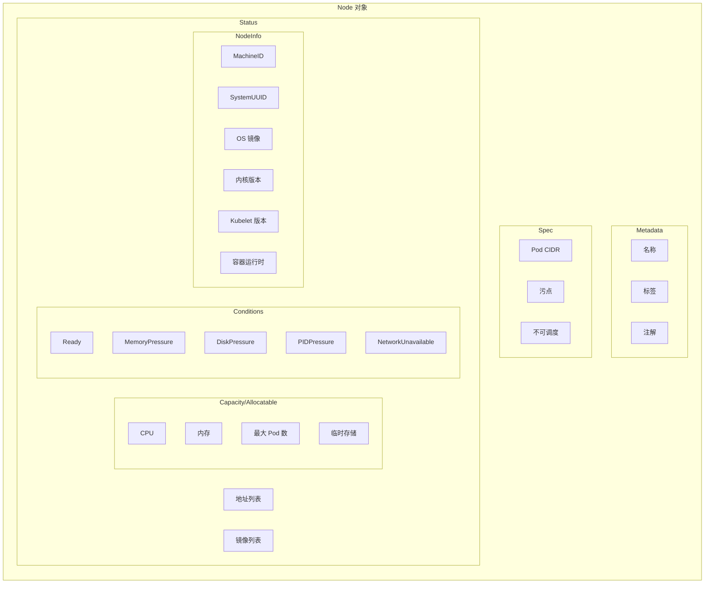
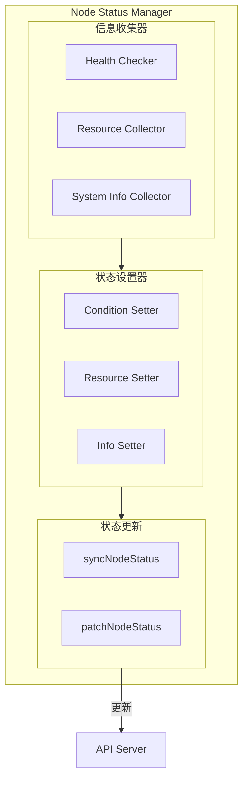
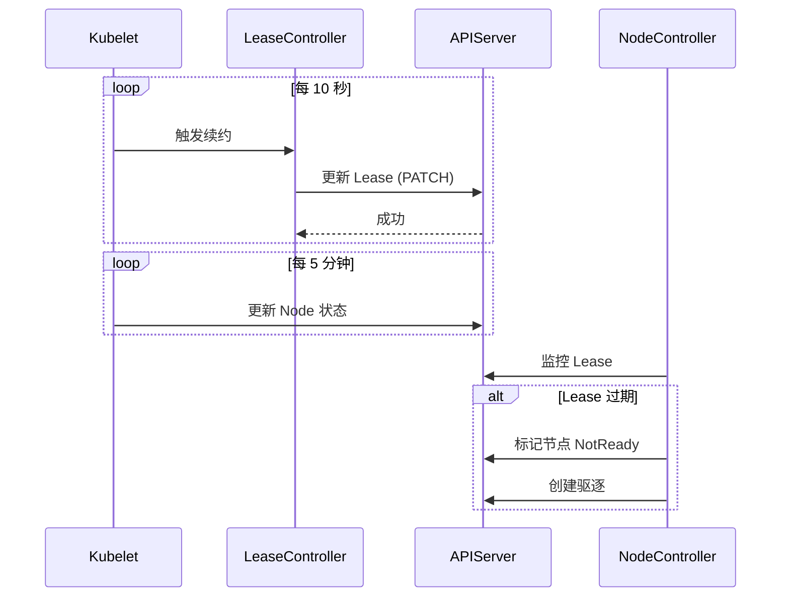
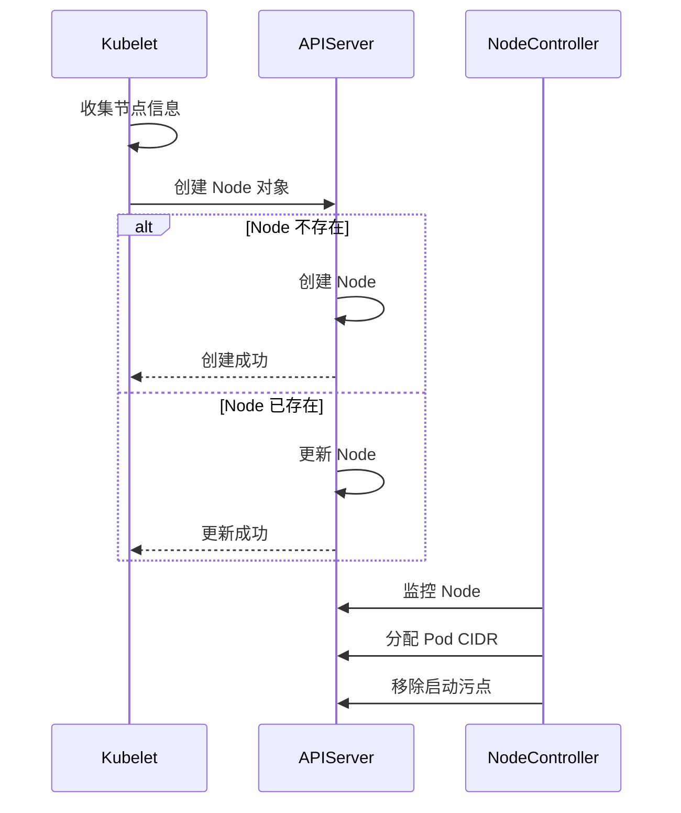

## 概述

节点状态管理是 Kubelet 的核心职责之一。Kubelet 持续收集节点信息并上报给 API Server，包括节点资源容量、可分配资源、运行条件、系统信息等。此外，Kubelet 通过 Lease 对象实现轻量级心跳机制，使控制平面能够快速检测节点故障。

## 节点状态组成



## 核心数据结构

### Node 状态

```go
// staging/src/k8s.io/api/core/v1/types.go

// NodeStatus 节点状态
type NodeStatus struct {
    // 节点容量
    Capacity ResourceList

    // 可分配资源
    Allocatable ResourceList

    // 节点生命周期阶段
    Phase NodePhase

    // 节点状态条件
    Conditions []NodeCondition

    // 节点地址
    Addresses []NodeAddress

    // Daemon 端点
    DaemonEndpoints NodeDaemonEndpoints

    // 节点系统信息
    NodeInfo NodeSystemInfo

    // 节点上的镜像列表
    Images []ContainerImage

    // 卷信息
    VolumesInUse []UniqueVolumeName
    VolumesAttached []AttachedVolume

    // 配置
    Config *NodeConfigStatus
}

// NodeCondition 节点条件
type NodeCondition struct {
    // 条件类型
    Type NodeConditionType
    // 状态
    Status ConditionStatus
    // 上次心跳时间
    LastHeartbeatTime metav1.Time
    // 上次转换时间
    LastTransitionTime metav1.Time
    // 原因
    Reason string
    // 消息
    Message string
}

// NodeConditionType 节点条件类型
type NodeConditionType string

const (
    NodeReady              NodeConditionType = "Ready"
    NodeMemoryPressure     NodeConditionType = "MemoryPressure"
    NodeDiskPressure       NodeConditionType = "DiskPressure"
    NodePIDPressure        NodeConditionType = "PIDPressure"
    NodeNetworkUnavailable NodeConditionType = "NetworkUnavailable"
)

// NodeSystemInfo 节点系统信息
type NodeSystemInfo struct {
    MachineID               string
    SystemUUID              string
    BootID                  string
    KernelVersion           string
    OSImage                 string
    ContainerRuntimeVersion string
    KubeletVersion          string
    KubeProxyVersion        string
    OperatingSystem         string
    Architecture            string
}
```

### Lease 对象

```go
// staging/src/k8s.io/api/coordination/v1/types.go

// Lease 租约对象
type Lease struct {
    metav1.TypeMeta
    metav1.ObjectMeta

    // Spec 租约规格
    Spec LeaseSpec
}

// LeaseSpec 租约规格
type LeaseSpec struct {
    // 持有者标识
    HolderIdentity *string

    // 租约期限（秒）
    LeaseDurationSeconds *int32

    // 获取时间
    AcquireTime *metav1.MicroTime

    // 续约时间
    RenewTime *metav1.MicroTime

    // 租约转换次数
    LeaseTransitions *int32
}
```

## Node Status Manager

### 架构



### 实现

```go
// pkg/kubelet/kubelet_node_status.go

// syncNodeStatus 同步节点状态
func (kl *Kubelet) syncNodeStatus() {
    kl.syncNodeStatusMux.Lock()
    defer kl.syncNodeStatusMux.Unlock()

    // 获取当前节点
    node, err := kl.getNodeAnyWay()
    if err != nil {
        klog.ErrorS(err, "Error getting node")
        return
    }

    // 复制节点用于更新
    originalNode := node.DeepCopy()

    // 设置节点状态
    kl.setNodeStatus(node)

    // 比较并更新
    if !apiequality.Semantic.DeepEqual(originalNode.Status, node.Status) {
        if _, _, err := nodeutil.PatchNodeStatus(
            kl.kubeClient.CoreV1(),
            types.NodeName(kl.nodeName),
            originalNode,
            node,
        ); err != nil {
            klog.ErrorS(err, "Unable to patch node status")
        }
    }
}

// setNodeStatus 设置节点状态
func (kl *Kubelet) setNodeStatus(node *v1.Node) {
    for i, f := range kl.setNodeStatusFuncs {
        klog.V(5).InfoS("Setting node status", "setter", i)
        if err := f(node); err != nil {
            klog.ErrorS(err, "Failed to set node status", "setter", i)
        }
    }
}
```

### 状态设置器

```go
// pkg/kubelet/kubelet_node_status.go

// defaultNodeStatusFuncs 默认状态设置函数
func (kl *Kubelet) defaultNodeStatusFuncs() []func(*v1.Node) error {
    // 始终需要的设置器
    setters := []func(*v1.Node) error{
        // 节点地址
        kl.setNodeAddress,
        // 机器信息
        kl.setNodeMachineInfo,
        // 版本信息
        kl.setNodeVersionInfo,
        // 守护进程端点
        kl.setNodeDaemonEndpoints,
        // 镜像列表
        kl.setNodeImages,
        // 节点条件
        kl.setNodeConditions,
        // 节点可调度状态
        kl.setNodeSchedulable,
        // 容量和可分配
        kl.setNodeCapacityAndAllocatable,
        // 卷信息
        kl.setNodeVolumesInUse,
    }

    return setters
}

// setNodeAddress 设置节点地址
func (kl *Kubelet) setNodeAddress(node *v1.Node) error {
    addresses := kl.cloudResourceSyncManager.NodeAddresses()

    if len(addresses) == 0 {
        // 没有云提供商地址，使用本地地址
        hostName, err := os.Hostname()
        if err != nil {
            return err
        }

        addresses = []v1.NodeAddress{
            {Type: v1.NodeHostName, Address: hostName},
        }

        // 获取内部 IP
        if ip := kl.nodeIP; ip != nil {
            addresses = append(addresses, v1.NodeAddress{
                Type:    v1.NodeInternalIP,
                Address: ip.String(),
            })
        }
    }

    node.Status.Addresses = addresses
    return nil
}

// setNodeMachineInfo 设置机器信息
func (kl *Kubelet) setNodeMachineInfo(node *v1.Node) error {
    info, err := kl.cadvisor.MachineInfo()
    if err != nil {
        return err
    }

    node.Status.NodeInfo.MachineID = info.MachineID
    node.Status.NodeInfo.SystemUUID = info.SystemUUID
    node.Status.NodeInfo.BootID = info.BootID
    node.Status.NodeInfo.KernelVersion = info.KernelVersion
    node.Status.NodeInfo.OSImage = info.OSImage
    node.Status.NodeInfo.OperatingSystem = goruntime.GOOS
    node.Status.NodeInfo.Architecture = goruntime.GOARCH

    return nil
}

// setNodeConditions 设置节点条件
func (kl *Kubelet) setNodeConditions(node *v1.Node) error {
    // 获取当前条件
    currentConditions := make(map[v1.NodeConditionType]*v1.NodeCondition)
    for i := range node.Status.Conditions {
        cond := &node.Status.Conditions[i]
        currentConditions[cond.Type] = cond
    }

    // 设置各个条件
    now := metav1.NewTime(kl.clock.Now())

    // Ready 条件
    readyCondition := kl.getNodeReadyCondition(now)
    kl.setNodeCondition(node, readyCondition)

    // MemoryPressure 条件
    memoryPressure := kl.getMemoryPressureCondition(now)
    kl.setNodeCondition(node, memoryPressure)

    // DiskPressure 条件
    diskPressure := kl.getDiskPressureCondition(now)
    kl.setNodeCondition(node, diskPressure)

    // PIDPressure 条件
    pidPressure := kl.getPIDPressureCondition(now)
    kl.setNodeCondition(node, pidPressure)

    return nil
}

// setNodeCondition 设置单个条件
func (kl *Kubelet) setNodeCondition(node *v1.Node, condition v1.NodeCondition) {
    for i := range node.Status.Conditions {
        if node.Status.Conditions[i].Type == condition.Type {
            // 更新现有条件
            if node.Status.Conditions[i].Status != condition.Status {
                node.Status.Conditions[i].LastTransitionTime = condition.LastTransitionTime
            }
            node.Status.Conditions[i].Status = condition.Status
            node.Status.Conditions[i].Reason = condition.Reason
            node.Status.Conditions[i].Message = condition.Message
            node.Status.Conditions[i].LastHeartbeatTime = condition.LastHeartbeatTime
            return
        }
    }

    // 添加新条件
    node.Status.Conditions = append(node.Status.Conditions, condition)
}
```

### 容量和可分配资源

```go
// pkg/kubelet/kubelet_node_status.go

// setNodeCapacityAndAllocatable 设置容量和可分配资源
func (kl *Kubelet) setNodeCapacityAndAllocatable(node *v1.Node) error {
    // 获取机器信息
    info, err := kl.cadvisor.MachineInfo()
    if err != nil {
        return err
    }

    // 设置容量
    node.Status.Capacity = v1.ResourceList{
        v1.ResourceCPU:              *resource.NewMilliQuantity(int64(info.NumCores*1000), resource.DecimalSI),
        v1.ResourceMemory:           *resource.NewQuantity(int64(info.MemoryCapacity), resource.BinarySI),
        v1.ResourcePods:             *resource.NewQuantity(int64(kl.maxPods), resource.DecimalSI),
        v1.ResourceEphemeralStorage: *resource.NewQuantity(int64(info.DiskCapacity), resource.BinarySI),
    }

    // 添加扩展资源
    for resourceName, quantity := range kl.containerManager.GetCapacity() {
        node.Status.Capacity[resourceName] = quantity
    }

    // 计算可分配资源
    node.Status.Allocatable = kl.calculateAllocatable(node.Status.Capacity)

    return nil
}

// calculateAllocatable 计算可分配资源
func (kl *Kubelet) calculateAllocatable(capacity v1.ResourceList) v1.ResourceList {
    allocatable := capacity.DeepCopy()

    // 减去系统预留
    for resource, reserved := range kl.reservation.System {
        if val, ok := allocatable[resource]; ok {
            val.Sub(reserved)
            allocatable[resource] = val
        }
    }

    // 减去 Kubernetes 预留
    for resource, reserved := range kl.reservation.Kube {
        if val, ok := allocatable[resource]; ok {
            val.Sub(reserved)
            allocatable[resource] = val
        }
    }

    // 减去驱逐阈值
    for resource, threshold := range kl.evictionThresholds {
        if val, ok := allocatable[resource]; ok {
            val.Sub(threshold)
            allocatable[resource] = val
        }
    }

    return allocatable
}
```

## Lease 心跳机制



### Lease Controller

```go
// pkg/kubelet/nodelease/controller.go

// Controller 管理节点 Lease
type Controller struct {
    // Lease 客户端
    client coordinationv1client.LeaseInterface

    // 节点名称
    holderIdentity string

    // 租约期限
    leaseDurationSeconds int32

    // 续约间隔
    renewInterval time.Duration

    // 时钟
    clock clock.Clock

    // 上次 Lease
    latestLease *coordinationv1.Lease
}

// NewController 创建 Lease 控制器
func NewController(
    clock clock.Clock,
    client clientset.Interface,
    holderIdentity string,
    leaseDurationSeconds int32,
    onRepeatedHeartbeatFailure func(),
) *Controller {

    return &Controller{
        client:               client.CoordinationV1().Leases(corev1.NamespaceNodeLease),
        holderIdentity:       holderIdentity,
        leaseDurationSeconds: leaseDurationSeconds,
        renewInterval:        time.Duration(leaseDurationSeconds/4) * time.Second,
        clock:                clock,
    }
}

// Run 运行 Lease 控制器
func (c *Controller) Run(stopCh <-chan struct{}) {
    klog.InfoS("Starting node lease controller", "node", c.holderIdentity)

    // 立即尝试获取 Lease
    if err := c.sync(); err != nil {
        klog.ErrorS(err, "Failed to sync lease")
    }

    // 启动续约循环
    go wait.Until(c.sync, c.renewInterval, stopCh)
}

// sync 同步 Lease
func (c *Controller) sync() error {
    // 获取或创建 Lease
    lease, err := c.ensureLease()
    if err != nil {
        return err
    }

    // 更新续约时间
    now := metav1.NewMicroTime(c.clock.Now())
    lease.Spec.RenewTime = &now

    // 更新 Lease
    updatedLease, err := c.client.Update(context.Background(), lease, metav1.UpdateOptions{})
    if err != nil {
        // 处理冲突
        if apierrors.IsConflict(err) {
            // 重新获取并重试
            klog.V(4).InfoS("Lease update conflict, retrying")
            return c.sync()
        }
        return err
    }

    c.latestLease = updatedLease
    return nil
}

// ensureLease 确保 Lease 存在
func (c *Controller) ensureLease() (*coordinationv1.Lease, error) {
    // 尝试获取现有 Lease
    lease, err := c.client.Get(context.Background(), c.holderIdentity, metav1.GetOptions{})
    if err == nil {
        return lease, nil
    }

    if !apierrors.IsNotFound(err) {
        return nil, err
    }

    // 创建新 Lease
    now := metav1.NewMicroTime(c.clock.Now())
    lease = &coordinationv1.Lease{
        ObjectMeta: metav1.ObjectMeta{
            Name:      c.holderIdentity,
            Namespace: corev1.NamespaceNodeLease,
        },
        Spec: coordinationv1.LeaseSpec{
            HolderIdentity:       &c.holderIdentity,
            LeaseDurationSeconds: &c.leaseDurationSeconds,
            RenewTime:            &now,
            AcquireTime:          &now,
        },
    }

    return c.client.Create(context.Background(), lease, metav1.CreateOptions{})
}
```

## 节点条件详解

### Ready 条件

```go
// pkg/kubelet/kubelet_node_status.go

// getNodeReadyCondition 获取 Ready 条件
func (kl *Kubelet) getNodeReadyCondition(now metav1.Time) v1.NodeCondition {
    condition := v1.NodeCondition{
        Type:              v1.NodeReady,
        LastHeartbeatTime: now,
    }

    // 检查运行时是否就绪
    runtimeReady := kl.runtimeState.runtimeErrors() == nil

    // 检查网络是否就绪
    networkReady := kl.runtimeState.networkErrors() == nil

    // 检查存储是否就绪
    storageReady := kl.runtimeState.storageErrors() == nil

    if runtimeReady && networkReady && storageReady {
        condition.Status = v1.ConditionTrue
        condition.Reason = "KubeletReady"
        condition.Message = "kubelet is posting ready status"
    } else {
        condition.Status = v1.ConditionFalse
        condition.Reason = "KubeletNotReady"

        var messages []string
        if !runtimeReady {
            messages = append(messages, "container runtime not ready")
        }
        if !networkReady {
            messages = append(messages, "network not ready")
        }
        if !storageReady {
            messages = append(messages, "storage not ready")
        }
        condition.Message = strings.Join(messages, "; ")
    }

    return condition
}
```

### 压力条件

```go
// pkg/kubelet/kubelet_node_status.go

// getMemoryPressureCondition 获取内存压力条件
func (kl *Kubelet) getMemoryPressureCondition(now metav1.Time) v1.NodeCondition {
    condition := v1.NodeCondition{
        Type:              v1.NodeMemoryPressure,
        LastHeartbeatTime: now,
    }

    if kl.evictionManager.IsUnderMemoryPressure() {
        condition.Status = v1.ConditionTrue
        condition.Reason = "KubeletHasInsufficientMemory"
        condition.Message = "kubelet has insufficient memory available"
    } else {
        condition.Status = v1.ConditionFalse
        condition.Reason = "KubeletHasSufficientMemory"
        condition.Message = "kubelet has sufficient memory available"
    }

    return condition
}

// getDiskPressureCondition 获取磁盘压力条件
func (kl *Kubelet) getDiskPressureCondition(now metav1.Time) v1.NodeCondition {
    condition := v1.NodeCondition{
        Type:              v1.NodeDiskPressure,
        LastHeartbeatTime: now,
    }

    if kl.evictionManager.IsUnderDiskPressure() {
        condition.Status = v1.ConditionTrue
        condition.Reason = "KubeletHasDiskPressure"
        condition.Message = "kubelet has disk pressure"
    } else {
        condition.Status = v1.ConditionFalse
        condition.Reason = "KubeletHasNoDiskPressure"
        condition.Message = "kubelet has no disk pressure"
    }

    return condition
}

// getPIDPressureCondition 获取 PID 压力条件
func (kl *Kubelet) getPIDPressureCondition(now metav1.Time) v1.NodeCondition {
    condition := v1.NodeCondition{
        Type:              v1.NodePIDPressure,
        LastHeartbeatTime: now,
    }

    if kl.evictionManager.IsUnderPIDPressure() {
        condition.Status = v1.ConditionTrue
        condition.Reason = "KubeletHasInsufficientPID"
        condition.Message = "kubelet has insufficient PID available"
    } else {
        condition.Status = v1.ConditionFalse
        condition.Reason = "KubeletHasSufficientPID"
        condition.Message = "kubelet has sufficient PID available"
    }

    return condition
}
```

## 节点注册

### 注册流程



### 注册实现

```go
// pkg/kubelet/kubelet_node_status.go

// registerWithAPIServer 向 API Server 注册节点
func (kl *Kubelet) registerWithAPIServer() {
    // 构建初始节点对象
    node := &v1.Node{
        ObjectMeta: metav1.ObjectMeta{
            Name:        string(kl.nodeName),
            Labels:      kl.nodeLabels,
            Annotations: kl.nodeAnnotations,
        },
    }

    // 设置节点状态
    kl.setNodeStatus(node)

    // 尝试创建节点
    for {
        _, err := kl.kubeClient.CoreV1().Nodes().Create(
            context.Background(),
            node,
            metav1.CreateOptions{},
        )

        if err == nil {
            klog.InfoS("Successfully registered node", "node", kl.nodeName)
            return
        }

        if !apierrors.IsAlreadyExists(err) {
            klog.ErrorS(err, "Unable to register node, retrying")
            time.Sleep(time.Second)
            continue
        }

        // 节点已存在，尝试更新
        existing, err := kl.kubeClient.CoreV1().Nodes().Get(
            context.Background(),
            string(kl.nodeName),
            metav1.GetOptions{},
        )
        if err != nil {
            klog.ErrorS(err, "Unable to get existing node")
            time.Sleep(time.Second)
            continue
        }

        // 合并标签和注解
        kl.reconcileNode(existing)

        _, err = kl.kubeClient.CoreV1().Nodes().Update(
            context.Background(),
            existing,
            metav1.UpdateOptions{},
        )
        if err == nil {
            klog.InfoS("Successfully updated existing node", "node", kl.nodeName)
            return
        }

        klog.ErrorS(err, "Unable to update node, retrying")
        time.Sleep(time.Second)
    }
}

// reconcileNode 协调节点配置
func (kl *Kubelet) reconcileNode(node *v1.Node) {
    // 合并标签
    if node.Labels == nil {
        node.Labels = make(map[string]string)
    }
    for k, v := range kl.nodeLabels {
        node.Labels[k] = v
    }

    // 合并注解
    if node.Annotations == nil {
        node.Annotations = make(map[string]string)
    }
    for k, v := range kl.nodeAnnotations {
        node.Annotations[k] = v
    }

    // 更新污点
    if kl.registerWithTaints != nil {
        node.Spec.Taints = kl.registerWithTaints
    }
}
```

## 配置参数

### 关键配置

```yaml
apiVersion: kubelet.config.k8s.io/v1beta1
kind: KubeletConfiguration

# 节点状态更新频率
nodeStatusUpdateFrequency: "10s"

# 节点状态上报周期
nodeStatusReportFrequency: "5m"

# 节点 Lease 更新间隔
nodeLeaseDurationSeconds: 40

# 系统预留资源
systemReserved:
  cpu: "500m"
  memory: "1Gi"
  ephemeral-storage: "1Gi"

# Kubernetes 预留资源
kubeReserved:
  cpu: "500m"
  memory: "1Gi"

# 驱逐阈值
evictionHard:
  memory.available: "100Mi"
  nodefs.available: "10%"
  imagefs.available: "15%"

# 节点标签
nodeLabels:
  node-role.kubernetes.io/worker: ""

# 注册污点
registerWithTaints:
- key: "node.kubernetes.io/not-ready"
  effect: "NoSchedule"
```

## 监控与调试

### 关键指标

```go
var (
    // 节点状态更新延迟
    nodeStatusUpdateLatency = prometheus.NewHistogram(
        prometheus.HistogramOpts{
            Name:    "kubelet_node_status_update_duration_seconds",
            Help:    "Duration of node status update",
            Buckets: prometheus.DefBuckets,
        },
    )

    // Lease 续约成功次数
    leaseRenewSuccess = prometheus.NewCounter(
        prometheus.CounterOpts{
            Name: "kubelet_node_lease_renew_success_total",
            Help: "Number of successful lease renewals",
        },
    )

    // Lease 续约失败次数
    leaseRenewFailure = prometheus.NewCounter(
        prometheus.CounterOpts{
            Name: "kubelet_node_lease_renew_failure_total",
            Help: "Number of failed lease renewals",
        },
    )
)
```

### 调试命令

```bash
# 查看节点详细状态
kubectl describe node <node-name>

# 查看节点条件
kubectl get node <node-name> -o jsonpath='{.status.conditions}'

# 查看节点容量和可分配
kubectl get node <node-name> -o jsonpath='{.status.capacity}'
kubectl get node <node-name> -o jsonpath='{.status.allocatable}'

# 查看节点 Lease
kubectl get lease -n kube-node-lease <node-name> -o yaml

# 查看 Kubelet 日志中的节点状态更新
journalctl -u kubelet | grep -i "node status"
```

### 常见问题

| 问题 | 可能原因 | 解决方案 |
|------|----------|----------|
| Node NotReady | 容器运行时故障 | 检查 containerd/docker |
| Lease 更新失败 | API Server 不可达 | 检查网络连接 |
| 资源显示为 0 | cAdvisor 故障 | 检查 cAdvisor 日志 |
| 条件状态抖动 | 阈值设置不当 | 调整驱逐阈值 |

## 总结

节点状态管理是 Kubelet 的核心功能：

1. **状态收集**：收集节点资源、条件、系统信息
2. **定期上报**：周期性更新 Node 对象状态
3. **Lease 心跳**：轻量级心跳机制加速故障检测
4. **资源计算**：准确计算容量和可分配资源
5. **注册管理**：处理节点注册和标签、污点配置

准确及时的节点状态对于集群调度和健康监控至关重要。
