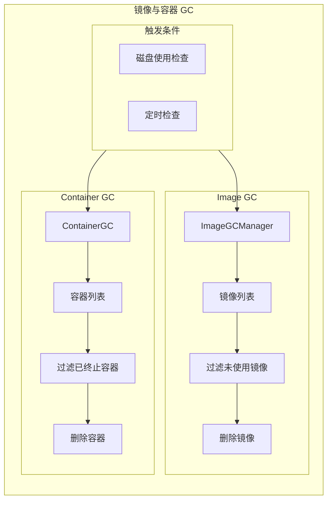
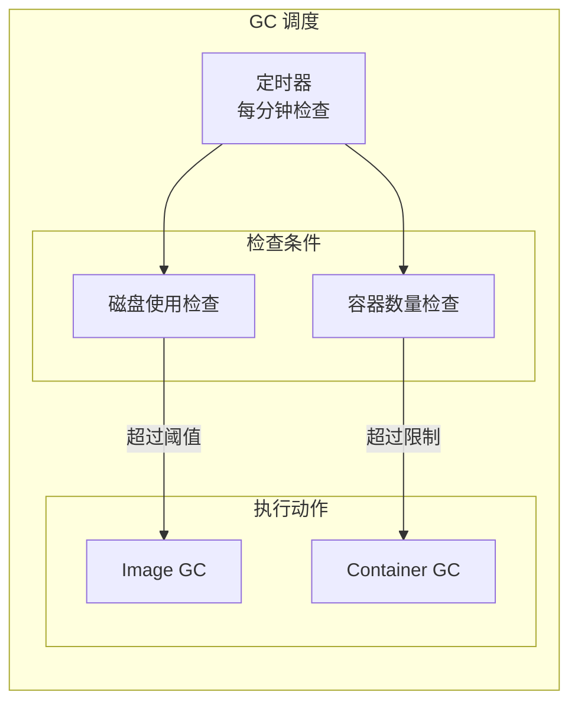

## 概述

Image GC（镜像垃圾回收）是 Kubelet 管理节点磁盘空间的重要机制。当镜像文件系统使用率超过阈值时，Kubelet 会自动清理不再使用的镜像以释放空间。此外，Container GC 负责清理已终止的容器，两者共同确保节点磁盘资源得到有效管理。

## 架构设计



## 配置参数

### 镜像 GC 配置

```yaml
apiVersion: kubelet.config.k8s.io/v1beta1
kind: KubeletConfiguration

# 高阈值：触发 GC 的磁盘使用百分比
imageGCHighThresholdPercent: 85

# 低阈值：GC 清理到的目标百分比
imageGCLowThresholdPercent: 80

# 镜像最小存活时间（删除前需存活的最短时间）
imageMinimumGCAge: "2m"

# 镜像文件系统
imageFs: "/var/lib/containerd"
```

### 容器 GC 配置

```yaml
# 每个容器保留的最小容器数
minimumContainerTTLDuration: "0s"

# Pod 中每个容器保留的最大死亡容器数
maxPerPodContainerCount: 1

# 节点上保留的最大死亡容器数（已弃用）
maxContainerCount: -1
```

## Image GC Manager

### 核心接口

```go
// pkg/kubelet/images/image_gc_manager.go

// ImageGCManager 镜像 GC 管理器接口
type ImageGCManager interface {
    // GarbageCollect 执行镜像垃圾回收
    GarbageCollect() error

    // Start 启动 GC 管理器
    Start()

    // GetImageList 获取镜像列表
    GetImageList() ([]kubecontainer.Image, error)

    // DeleteUnusedImages 删除未使用的镜像
    DeleteUnusedImages() error
}

// realImageGCManager 实现
type realImageGCManager struct {
    // 容器运行时
    runtime container.Runtime

    // GC 策略
    policy ImageGCPolicy

    // 镜像记录器
    imageRecords imageRecords

    // 统计提供器
    statsProvider StatsProvider

    // 同步锁
    sync.Mutex
}

// ImageGCPolicy GC 策略
type ImageGCPolicy struct {
    // 高阈值（百分比）
    HighThresholdPercent int

    // 低阈值（百分比）
    LowThresholdPercent int

    // 最小存活时间
    MinAge time.Duration
}
```

### 初始化

```go
// pkg/kubelet/images/image_gc_manager.go

// NewImageGCManager 创建镜像 GC 管理器
func NewImageGCManager(
    runtime container.Runtime,
    statsProvider StatsProvider,
    recorder record.EventRecorder,
    nodeRef *v1.ObjectReference,
    policy ImageGCPolicy,
    sandboxImage string,
) (ImageGCManager, error) {

    // 验证策略
    if policy.HighThresholdPercent < policy.LowThresholdPercent {
        return nil, fmt.Errorf(
            "high threshold (%d) must be >= low threshold (%d)",
            policy.HighThresholdPercent,
            policy.LowThresholdPercent,
        )
    }

    return &realImageGCManager{
        runtime:       runtime,
        policy:        policy,
        imageRecords:  make(imageRecords),
        statsProvider: statsProvider,
        recorder:      recorder,
        nodeRef:       nodeRef,
        sandboxImage:  sandboxImage,
    }, nil
}
```

### GC 执行

```go
// pkg/kubelet/images/image_gc_manager.go

// GarbageCollect 执行垃圾回收
func (im *realImageGCManager) GarbageCollect() error {
    // 获取磁盘使用情况
    fsStats, err := im.statsProvider.ImageFsStats()
    if err != nil {
        return err
    }

    capacity := int64(fsStats.CapacityBytes)
    available := int64(fsStats.AvailableBytes)
    used := capacity - available
    usagePercent := int(float64(used) / float64(capacity) * 100)

    klog.V(4).InfoS("Image filesystem stats",
        "capacity", capacity,
        "available", available,
        "usagePercent", usagePercent)

    // 检查是否需要 GC
    if usagePercent < im.policy.HighThresholdPercent {
        klog.V(4).InfoS("ImageGC not needed",
            "usagePercent", usagePercent,
            "threshold", im.policy.HighThresholdPercent)
        return nil
    }

    // 计算需要释放的空间
    amountToFree := used - int64(float64(capacity)*float64(im.policy.LowThresholdPercent)/100)

    klog.InfoS("ImageGC triggered",
        "usagePercent", usagePercent,
        "threshold", im.policy.HighThresholdPercent,
        "amountToFree", amountToFree)

    // 执行清理
    freed, err := im.freeSpace(amountToFree, time.Now())
    if err != nil {
        return err
    }

    klog.InfoS("ImageGC completed", "freedSpace", freed)
    return nil
}

// freeSpace 释放空间
func (im *realImageGCManager) freeSpace(
    bytesToFree int64,
    freeTime time.Time,
) (int64, error) {

    im.Lock()
    defer im.Unlock()

    // 检测镜像使用情况
    imagesInUse, err := im.detectImages(freeTime)
    if err != nil {
        return 0, err
    }

    // 获取所有镜像
    images, err := im.runtime.ListImages()
    if err != nil {
        return 0, err
    }

    // 收集可删除的镜像
    deletableImages := []evictionInfo{}

    for _, image := range images {
        // 跳过正在使用的镜像
        if _, ok := imagesInUse[image.ID]; ok {
            klog.V(5).InfoS("Image in use, skipping", "imageID", image.ID)
            continue
        }

        // 跳过 sandbox 镜像
        if image.ID == im.sandboxImage {
            continue
        }

        // 检查镜像记录
        record, ok := im.imageRecords[image.ID]
        if !ok {
            // 新镜像，记录首次发现时间
            im.imageRecords[image.ID] = &imageRecord{
                firstDetected: freeTime,
                lastUsed:      freeTime,
            }
            continue
        }

        // 检查最小存活时间
        if freeTime.Sub(record.firstDetected) < im.policy.MinAge {
            klog.V(5).InfoS("Image too new, skipping",
                "imageID", image.ID,
                "age", freeTime.Sub(record.firstDetected))
            continue
        }

        deletableImages = append(deletableImages, evictionInfo{
            id:       image.ID,
            imageRef: image,
            lastUsed: record.lastUsed,
            size:     image.Size,
        })
    }

    // 按 lastUsed 排序（最久未使用的先删除）
    sort.Sort(byLastUsed(deletableImages))

    // 删除镜像直到释放足够空间
    var freed int64
    for _, image := range deletableImages {
        if freed >= bytesToFree {
            break
        }

        klog.InfoS("Removing image", "imageID", image.id, "size", image.size)

        err := im.runtime.RemoveImage(image.imageRef)
        if err != nil {
            klog.ErrorS(err, "Failed to remove image", "imageID", image.id)
            continue
        }

        freed += image.size
        delete(im.imageRecords, image.id)
    }

    return freed, nil
}
```

### 镜像使用检测

```go
// pkg/kubelet/images/image_gc_manager.go

// detectImages 检测正在使用的镜像
func (im *realImageGCManager) detectImages(detectTime time.Time) (sets.String, error) {
    imagesInUse := sets.NewString()

    // 获取所有容器
    containers, err := im.runtime.GetAllContainers()
    if err != nil {
        return nil, err
    }

    // 收集使用中的镜像
    for _, container := range containers {
        imagesInUse.Insert(container.ImageID)

        // 更新镜像记录
        if record, ok := im.imageRecords[container.ImageID]; ok {
            record.lastUsed = detectTime
        }
    }

    // 获取所有 Pod
    pods, err := im.runtime.GetPods(true)
    if err != nil {
        return nil, err
    }

    // 收集 sandbox 镜像
    for _, pod := range pods {
        if pod.Sandbox != nil && pod.Sandbox.ImageRef != "" {
            imagesInUse.Insert(pod.Sandbox.ImageRef)
        }
    }

    return imagesInUse, nil
}

// imageRecord 镜像记录
type imageRecord struct {
    // 首次检测时间
    firstDetected time.Time
    // 上次使用时间
    lastUsed time.Time
}

// evictionInfo 镜像驱逐信息
type evictionInfo struct {
    id       string
    imageRef kubecontainer.Image
    lastUsed time.Time
    size     int64
}

// byLastUsed 按上次使用时间排序
type byLastUsed []evictionInfo

func (b byLastUsed) Len() int           { return len(b) }
func (b byLastUsed) Swap(i, j int)      { b[i], b[j] = b[j], b[i] }
func (b byLastUsed) Less(i, j int) bool { return b[i].lastUsed.Before(b[j].lastUsed) }
```

## Container GC

### 核心接口

```go
// pkg/kubelet/container/container_gc.go

// GC 容器 GC 接口
type GC interface {
    // GarbageCollect 执行容器垃圾回收
    GarbageCollect(gcPolicy GCPolicy, allSourcesReady bool, evictNonDeletedPods bool) error

    // DeleteAllUnusedContainers 删除所有未使用的容器
    DeleteAllUnusedContainers() error
}

// GCPolicy GC 策略
type GCPolicy struct {
    // 容器最小存活时间
    MinAge time.Duration

    // 每个 Pod 保留的最大死亡容器数（-1 表示不限制）
    MaxPerPodContainer int

    // 节点保留的最大死亡容器数（-1 表示不限制）
    MaxContainers int
}

// realContainerGC 实现
type realContainerGC struct {
    // 容器运行时
    runtime kubecontainer.Runtime

    // GC 策略
    policy GCPolicy

    // Pod 状态提供器
    podStateProvider PodStateProvider
}
```

### GC 执行

```go
// pkg/kubelet/container/container_gc.go

// GarbageCollect 执行垃圾回收
func (gc *realContainerGC) GarbageCollect(
    gcPolicy GCPolicy,
    allSourcesReady bool,
    evictNonDeletedPods bool,
) error {
    return gc.runtime.GarbageCollect(gcPolicy, allSourcesReady, evictNonDeletedPods)
}

// kuberuntime 实现
// pkg/kubelet/kuberuntime/kuberuntime_gc.go

// GarbageCollect 执行容器 GC
func (m *kubeGenericRuntimeManager) GarbageCollect(
    gcPolicy kubecontainer.GCPolicy,
    allSourcesReady bool,
    evictNonDeletedPods bool,
) error {

    // 收集需要删除的容器
    evictUnits, err := m.evictableContainers(gcPolicy.MinAge)
    if err != nil {
        return err
    }

    // 按 Pod 分组
    for podUID, containerUnits := range evictUnits {
        // 检查 Pod 是否已删除
        if !evictNonDeletedPods {
            pod, found := m.podStateProvider.GetPod(podUID)
            if found && pod.DeletionTimestamp == nil {
                continue
            }
        }

        // 按容器名称分组
        containersByName := make(map[string][]containerGCInfo)
        for _, unit := range containerUnits {
            containersByName[unit.name] = append(containersByName[unit.name], unit)
        }

        // 对每个容器名称，保留最新的 N 个
        for name, containers := range containersByName {
            // 按创建时间排序
            sort.Sort(byCreated(containers))

            // 保留最新的 maxPerPodContainer 个
            numToKeep := gcPolicy.MaxPerPodContainer
            if numToKeep < 0 || numToKeep > len(containers) {
                numToKeep = len(containers)
            }

            // 删除多余的容器
            for i := numToKeep; i < len(containers); i++ {
                m.removeContainer(containers[i].id)
            }
        }
    }

    // 删除孤儿 Pod sandbox
    return m.removeSandboxes()
}

// evictableContainers 获取可驱逐的容器
func (m *kubeGenericRuntimeManager) evictableContainers(
    minAge time.Duration,
) (map[types.UID][]containerGCInfo, error) {

    // 获取所有容器
    containers, err := m.runtimeService.ListContainers(nil)
    if err != nil {
        return nil, err
    }

    evictUnits := make(map[types.UID][]containerGCInfo)
    now := time.Now()

    for _, container := range containers {
        // 只收集已终止的容器
        if container.State != runtimeapi.ContainerState_CONTAINER_EXITED {
            continue
        }

        // 检查最小存活时间
        finishedAt := time.Unix(0, container.FinishedAt)
        if now.Sub(finishedAt) < minAge {
            continue
        }

        // 解析 Pod UID
        podUID := types.UID(container.Labels[types.KubernetesPodUIDLabel])

        evictUnits[podUID] = append(evictUnits[podUID], containerGCInfo{
            id:        container.Id,
            name:      container.Labels[types.KubernetesContainerNameLabel],
            createdAt: container.CreatedAt,
        })
    }

    return evictUnits, nil
}

// removeContainer 删除容器
func (m *kubeGenericRuntimeManager) removeContainer(containerID string) error {
    klog.V(4).InfoS("Removing container", "containerID", containerID)

    // 删除容器日志
    if err := m.removeContainerLog(containerID); err != nil {
        klog.ErrorS(err, "Failed to remove container log", "containerID", containerID)
    }

    // 删除容器
    return m.runtimeService.RemoveContainer(containerID)
}
```

## GC 调度



### 调度实现

```go
// pkg/kubelet/kubelet.go

// StartGarbageCollection 启动垃圾回收
func (kl *Kubelet) StartGarbageCollection() {
    // 容器 GC
    go wait.Until(func() {
        if err := kl.containerGC.GarbageCollect(
            kl.containerGCPolicy,
            kl.sourcesReady.AllReady(),
            false,
        ); err != nil {
            klog.ErrorS(err, "Container GC failed")
        }
    }, ContainerGCPeriod, wait.NeverStop)

    // 镜像 GC
    prevImageGCFailed := false
    go wait.Until(func() {
        if err := kl.imageManager.GarbageCollect(); err != nil {
            if prevImageGCFailed {
                klog.ErrorS(err, "Image GC failed multiple times")
                kl.recorder.Eventf(kl.nodeRef, v1.EventTypeWarning, "ImageGCFailed", "Image GC failed: %v", err)
            } else {
                klog.ErrorS(err, "Image GC failed")
            }
            prevImageGCFailed = true
        } else {
            prevImageGCFailed = false
            klog.V(4).InfoS("Image GC completed successfully")
        }
    }, ImageGCPeriod, wait.NeverStop)
}

const (
    // ContainerGCPeriod 容器 GC 周期
    ContainerGCPeriod = time.Minute

    // ImageGCPeriod 镜像 GC 周期
    ImageGCPeriod = 5 * time.Minute
)
```

## 与驱逐管理器集成

```go
// pkg/kubelet/eviction/eviction_manager.go

// reclaimResources 资源回收
func (m *managerImpl) reclaimResources(
    thresholds []evictionapi.Threshold,
    observations signalObservations,
    activePods []*v1.Pod,
) bool {

    resourceReclaimed := false

    for _, threshold := range thresholds {
        switch threshold.Signal {
        case evictionapi.SignalImageFsAvailable,
            evictionapi.SignalImageFsInodesFree:
            // 触发镜像 GC
            if m.imageGC != nil {
                klog.V(3).InfoS("Attempting image GC for eviction")
                if err := m.imageGC.DeleteUnusedImages(); err != nil {
                    klog.ErrorS(err, "Failed to delete unused images")
                } else {
                    resourceReclaimed = true
                }
            }

        case evictionapi.SignalNodeFsAvailable,
            evictionapi.SignalNodeFsInodesFree:
            // 触发容器 GC
            if m.containerGC != nil {
                klog.V(3).InfoS("Attempting container GC for eviction")
                if err := m.containerGC.DeleteAllUnusedContainers(); err != nil {
                    klog.ErrorS(err, "Failed to delete unused containers")
                } else {
                    resourceReclaimed = true
                }
            }
        }
    }

    return resourceReclaimed
}
```

## 日志清理

### 容器日志 GC

```go
// pkg/kubelet/kuberuntime/logs/logs.go

// removeContainerLog 删除容器日志
func (m *kubeGenericRuntimeManager) removeContainerLog(containerID string) error {
    // 获取日志路径
    path := m.containerLogPath(containerID)

    // 删除日志文件
    if err := os.Remove(path); err != nil && !os.IsNotExist(err) {
        return err
    }

    // 删除符号链接
    symlinkPath := m.containerLogSymlink(containerID)
    if err := os.Remove(symlinkPath); err != nil && !os.IsNotExist(err) {
        return err
    }

    return nil
}

// 日志目录清理
func (m *kubeGenericRuntimeManager) cleanupOrphanedPodLogs() error {
    logDir := m.getLogsDir()

    // 获取所有 Pod 目录
    entries, err := os.ReadDir(logDir)
    if err != nil {
        return err
    }

    // 获取活跃 Pod UID
    activePods := m.getActivePodUIDs()

    for _, entry := range entries {
        if !entry.IsDir() {
            continue
        }

        podUID := types.UID(entry.Name())

        // 检查 Pod 是否活跃
        if _, ok := activePods[podUID]; ok {
            continue
        }

        // 删除孤儿日志目录
        podLogDir := filepath.Join(logDir, string(podUID))
        klog.V(4).InfoS("Removing orphaned pod log directory", "path", podLogDir)
        if err := os.RemoveAll(podLogDir); err != nil {
            klog.ErrorS(err, "Failed to remove pod log directory", "path", podLogDir)
        }
    }

    return nil
}
```

## 监控指标

```go
var (
    // 镜像 GC 时长
    imageGCDuration = prometheus.NewHistogram(
        prometheus.HistogramOpts{
            Name:    "kubelet_image_gc_duration_seconds",
            Help:    "Duration of image garbage collection",
            Buckets: prometheus.DefBuckets,
        },
    )

    // 容器 GC 时长
    containerGCDuration = prometheus.NewHistogram(
        prometheus.HistogramOpts{
            Name:    "kubelet_container_gc_duration_seconds",
            Help:    "Duration of container garbage collection",
            Buckets: prometheus.DefBuckets,
        },
    )

    // 删除的镜像数
    imageGCImagesDeleted = prometheus.NewCounter(
        prometheus.CounterOpts{
            Name: "kubelet_image_gc_images_deleted_total",
            Help: "Number of images deleted by image GC",
        },
    )

    // 删除的容器数
    containerGCContainersDeleted = prometheus.NewCounter(
        prometheus.CounterOpts{
            Name: "kubelet_container_gc_containers_deleted_total",
            Help: "Number of containers deleted by container GC",
        },
    )

    // 释放的空间
    imageGCSpaceFreed = prometheus.NewCounter(
        prometheus.CounterOpts{
            Name: "kubelet_image_gc_bytes_freed_total",
            Help: "Total bytes freed by image GC",
        },
    )
)
```

## 调试与排错

### 查看镜像使用

```bash
# 查看节点镜像列表
crictl images

# 查看镜像详情
crictl inspecti <image-id>

# 查看镜像文件系统使用
df -h /var/lib/containerd

# 查看 Kubelet 镜像 GC 日志
journalctl -u kubelet | grep -i "image gc"
```

### 查看容器状态

```bash
# 查看所有容器（包括已停止）
crictl ps -a

# 查看容器日志
crictl logs <container-id>

# 查看死亡容器
crictl ps -a --state exited

# 手动删除容器
crictl rm <container-id>
```

### 手动触发 GC

```bash
# 删除未使用的镜像
crictl rmi --prune

# 删除所有未使用容器
crictl rm $(crictl ps -a -q --state exited)
```

## 最佳实践

### 1. 阈值配置

```yaml
# 推荐的 GC 配置
imageGCHighThresholdPercent: 85
imageGCLowThresholdPercent: 80
imageMinimumGCAge: "2m"
```

### 2. 磁盘规划

| 场景 | 建议磁盘大小 | 说明 |
|------|--------------|------|
| 小型节点 | 50GB+ | 基础系统 + 少量镜像 |
| 中型节点 | 100GB+ | 运行 20-50 个 Pod |
| 大型节点 | 200GB+ | 运行 100+ 个 Pod |

### 3. 监控告警

```yaml
# Prometheus 告警规则
groups:
- name: kubelet-gc
  rules:
  - alert: ImageFsHighUsage
    expr: kubelet_volume_stats_available_bytes{volume="imagefs"} / kubelet_volume_stats_capacity_bytes{volume="imagefs"} < 0.2
    for: 10m
    labels:
      severity: warning
    annotations:
      summary: "Image filesystem usage is high"
```

## 总结

镜像和容器 GC 是 Kubelet 磁盘管理的核心机制：

1. **镜像 GC**：基于磁盘使用率阈值自动清理未使用镜像
2. **容器 GC**：限制每个 Pod 保留的死亡容器数
3. **驱逐集成**：在资源压力时触发主动 GC
4. **定时执行**：周期性检查和清理
5. **日志清理**：同步清理容器日志文件

合理配置 GC 策略对于保持节点磁盘健康和避免驱逐至关重要。
