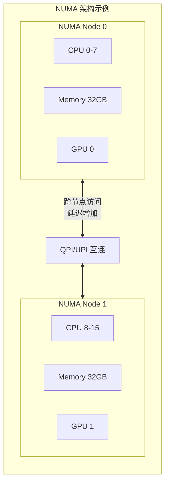
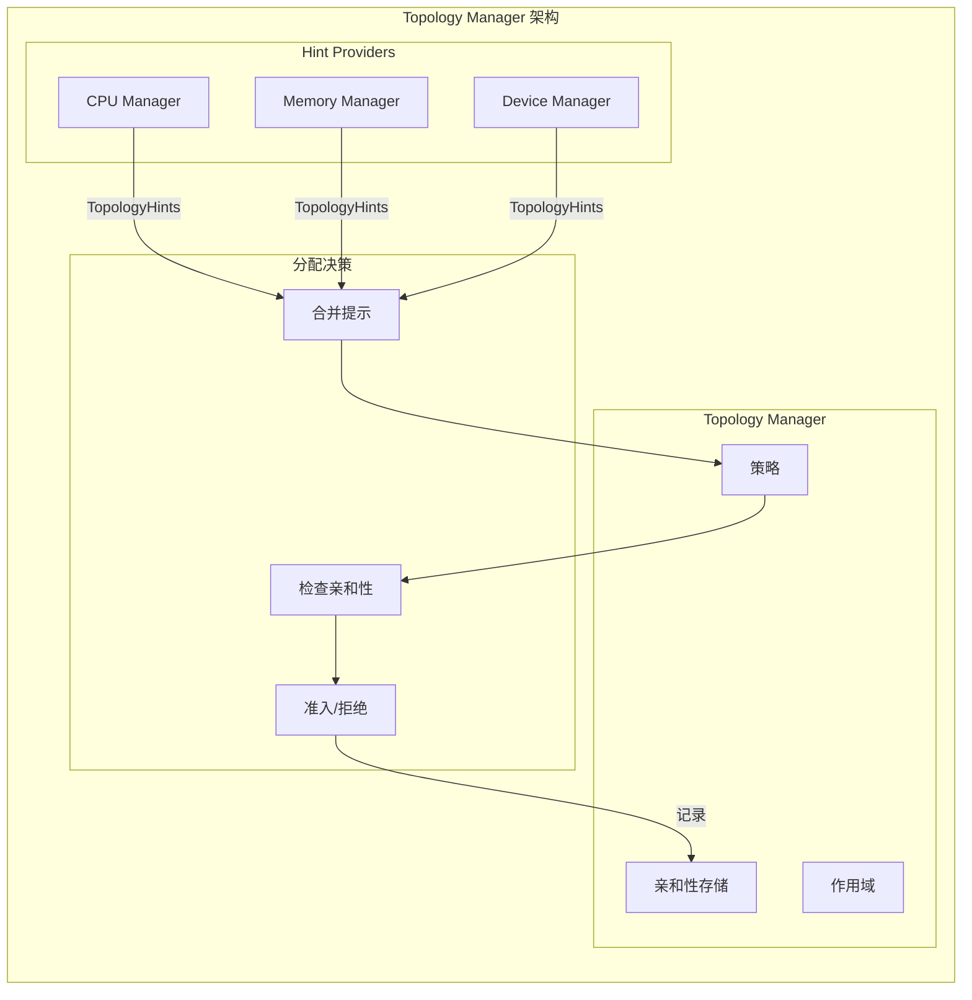
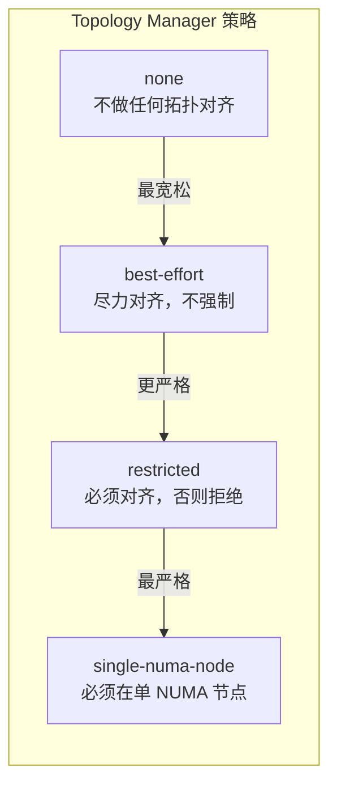
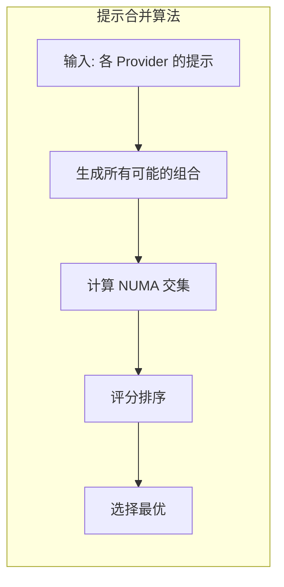

## 概述

Topology Manager（拓扑管理器）是 Kubelet 中负责协调 NUMA 感知资源分配的组件。在多核服务器上，CPU、内存和设备（如 GPU）可能分布在不同的 NUMA 节点上。Topology Manager 收集来自各个 Hint Provider（如 CPU Manager、Memory Manager、Device Manager）的拓扑提示，并做出最优的分配决策，确保容器能够获得低延迟的本地资源访问。

## NUMA 架构



### NUMA 访问延迟

| 访问类型 | 延迟 | 带宽 |
|----------|------|------|
| 本地 NUMA | ~80ns | 最高 |
| 远程 NUMA | ~150ns | 降低 30-50% |

## 架构设计



## 核心数据结构

### TopologyHint

```go
// pkg/kubelet/cm/topologymanager/topology_manager.go

// TopologyHint 拓扑提示
type TopologyHint struct {
    // NUMANodeAffinity NUMA 节点亲和性掩码
    NUMANodeAffinity bitmask.BitMask
    // Preferred 是否为首选
    Preferred bool
}

// HintProvider 提示提供者接口
type HintProvider interface {
    // GetTopologyHints 获取拓扑提示
    GetTopologyHints(pod *v1.Pod, container *v1.Container) map[string][]TopologyHint

    // GetPodTopologyHints 获取 Pod 级别拓扑提示
    GetPodTopologyHints(pod *v1.Pod) map[string][]TopologyHint

    // Allocate 分配资源
    Allocate(pod *v1.Pod, container *v1.Container) error
}

// Store 亲和性存储接口
type Store interface {
    // GetAffinity 获取容器亲和性
    GetAffinity(podUID string, containerName string) TopologyHint
}
```

### Manager 接口

```go
// pkg/kubelet/cm/topologymanager/topology_manager.go

// Manager 拓扑管理器接口
type Manager interface {
    // AddHintProvider 添加提示提供者
    AddHintProvider(HintProvider)

    // GetAffinity 获取容器亲和性
    GetAffinity(podUID string, containerName string) TopologyHint

    // Admit 检查 Pod 是否可以准入
    Admit(attrs *lifecycle.PodAdmitAttributes) lifecycle.PodAdmitResult

    // GetPolicy 获取当前策略
    GetPolicy() Policy

    // GetScope 获取当前作用域
    GetScope() Scope
}
```

## 策略类型



### 策略说明

| 策略 | 行为 | 适用场景 |
|------|------|----------|
| none | 不进行拓扑对齐 | 默认策略 |
| best-effort | 尽力对齐，无法对齐也允许 | 一般工作负载 |
| restricted | 必须能对齐，否则拒绝 Pod | 性能敏感应用 |
| single-numa-node | 所有资源必须在单个 NUMA 节点 | 极端性能需求 |

### 策略实现

```go
// pkg/kubelet/cm/topologymanager/policy.go

// Policy 策略接口
type Policy interface {
    // Name 策略名称
    Name() string
    // Merge 合并拓扑提示
    Merge(providersHints []map[string][]TopologyHint) (TopologyHint, bool)
}

// nonePolicy 无策略
type nonePolicy struct{}

func (p *nonePolicy) Name() string {
    return PolicyNone
}

func (p *nonePolicy) Merge(providersHints []map[string][]TopologyHint) (TopologyHint, bool) {
    // 返回空亲和性，表示不限制
    return TopologyHint{}, true
}

// bestEffortPolicy 尽力策略
type bestEffortPolicy struct {
    numaNodes []int
}

func (p *bestEffortPolicy) Merge(providersHints []map[string][]TopologyHint) (TopologyHint, bool) {
    // 尝试找到最优对齐
    hint := p.mergeHints(providersHints)
    // best-effort 总是返回成功
    return hint, true
}

// restrictedPolicy 限制策略
type restrictedPolicy struct {
    numaNodes []int
}

func (p *restrictedPolicy) Merge(providersHints []map[string][]TopologyHint) (TopologyHint, bool) {
    hint := p.mergeHints(providersHints)

    // 检查是否为首选对齐
    if hint.Preferred {
        return hint, true
    }

    // 如果没有首选对齐，检查是否有任何可用对齐
    if hint.NUMANodeAffinity != nil && hint.NUMANodeAffinity.Count() > 0 {
        return hint, true
    }

    // 无法对齐，拒绝
    return hint, false
}

// singleNumaNodePolicy 单 NUMA 节点策略
type singleNumaNodePolicy struct {
    numaNodes []int
}

func (p *singleNumaNodePolicy) Merge(providersHints []map[string][]TopologyHint) (TopologyHint, bool) {
    hint := p.mergeHints(providersHints)

    // 检查是否只使用单个 NUMA 节点
    if hint.NUMANodeAffinity != nil && hint.NUMANodeAffinity.Count() == 1 && hint.Preferred {
        return hint, true
    }

    // 必须是单节点
    return hint, false
}
```

## 作用域

### Container Scope

```go
// pkg/kubelet/cm/topologymanager/scope_container.go

// containerScope 容器级作用域
type containerScope struct {
    policy      Policy
    hintProviders []HintProvider
    store       Store
}

// Admit 容器级准入检查
func (s *containerScope) Admit(pod *v1.Pod) lifecycle.PodAdmitResult {
    for _, container := range append(pod.Spec.InitContainers, pod.Spec.Containers...) {
        // 收集所有提供者的提示
        providersHints := s.accumulateHints(pod, &container)

        // 合并提示
        bestHint, admit := s.policy.Merge(providersHints)

        if !admit {
            return lifecycle.PodAdmitResult{
                Admit:   false,
                Reason:  "TopologyAffinityError",
                Message: fmt.Sprintf("cannot align container %s resources", container.Name),
            }
        }

        // 存储亲和性
        s.store.SetAffinity(string(pod.UID), container.Name, bestHint)
    }

    return lifecycle.PodAdmitResult{Admit: true}
}

// accumulateHints 收集提示
func (s *containerScope) accumulateHints(pod *v1.Pod, container *v1.Container) []map[string][]TopologyHint {
    var providersHints []map[string][]TopologyHint

    for _, provider := range s.hintProviders {
        hints := provider.GetTopologyHints(pod, container)
        providersHints = append(providersHints, hints)
    }

    return providersHints
}
```

### Pod Scope

```go
// pkg/kubelet/cm/topologymanager/scope_pod.go

// podScope Pod 级作用域
type podScope struct {
    policy        Policy
    hintProviders []HintProvider
    store         Store
}

// Admit Pod 级准入检查
func (s *podScope) Admit(pod *v1.Pod) lifecycle.PodAdmitResult {
    // 收集 Pod 级别的提示
    providersHints := s.accumulatePodHints(pod)

    // 合并提示
    bestHint, admit := s.policy.Merge(providersHints)

    if !admit {
        return lifecycle.PodAdmitResult{
            Admit:   false,
            Reason:  "TopologyAffinityError",
            Message: "cannot align pod resources on same NUMA node(s)",
        }
    }

    // 为所有容器存储相同的亲和性
    for _, container := range append(pod.Spec.InitContainers, pod.Spec.Containers...) {
        s.store.SetAffinity(string(pod.UID), container.Name, bestHint)
    }

    return lifecycle.PodAdmitResult{Admit: true}
}

// accumulatePodHints 收集 Pod 级提示
func (s *podScope) accumulatePodHints(pod *v1.Pod) []map[string][]TopologyHint {
    var providersHints []map[string][]TopologyHint

    for _, provider := range s.hintProviders {
        hints := provider.GetPodTopologyHints(pod)
        providersHints = append(providersHints, hints)
    }

    return providersHints
}
```

## Hint Provider 实现

### CPU Manager 提示

```go
// pkg/kubelet/cm/cpumanager/cpu_manager.go

// GetTopologyHints 获取 CPU 拓扑提示
func (m *manager) GetTopologyHints(pod *v1.Pod, container *v1.Container) map[string][]topologymanager.TopologyHint {
    // 获取 CPU 请求
    requested := container.Resources.Requests.Cpu()
    if requested.IsZero() {
        return nil
    }

    // 只对 Guaranteed Pod 提供提示
    if v1qos.GetPodQOS(pod) != v1.PodQOSGuaranteed {
        return nil
    }

    // 只对整数 CPU 请求提供提示
    numCPUs := int(requested.Value())
    if numCPUs == 0 {
        return nil
    }

    // 生成拓扑提示
    hints := m.generateCPUHints(numCPUs)

    return map[string][]topologymanager.TopologyHint{
        string(v1.ResourceCPU): hints,
    }
}

// generateCPUHints 生成 CPU 提示
func (m *manager) generateCPUHints(numCPUs int) []topologymanager.TopologyHint {
    hints := []topologymanager.TopologyHint{}

    // 获取 NUMA 节点 CPU 分布
    numaNodes := m.topology.CPUDetails.NUMANodes().ToSlice()

    // 为每个 NUMA 节点组合生成提示
    for _, nodes := range generateNUMACombinations(numaNodes) {
        // 计算该组合的可用 CPU
        availableCPUs := m.getAvailableCPUsForNUMA(nodes)

        if availableCPUs.Size() >= numCPUs {
            mask, _ := bitmask.NewBitMask(nodes...)
            hints = append(hints, topologymanager.TopologyHint{
                NUMANodeAffinity: mask,
                // 单 NUMA 节点为首选
                Preferred: len(nodes) == 1,
            })
        }
    }

    return hints
}
```

### Memory Manager 提示

```go
// pkg/kubelet/cm/memorymanager/memory_manager.go

// GetTopologyHints 获取内存拓扑提示
func (m *manager) GetTopologyHints(pod *v1.Pod, container *v1.Container) map[string][]topologymanager.TopologyHint {
    // 获取内存请求
    requestedMemory := container.Resources.Requests.Memory()
    if requestedMemory.IsZero() {
        return nil
    }

    // 生成内存拓扑提示
    hints := m.generateMemoryHints(requestedMemory.Value())

    return map[string][]topologymanager.TopologyHint{
        string(v1.ResourceMemory): hints,
    }
}

// generateMemoryHints 生成内存提示
func (m *manager) generateMemoryHints(requestedBytes int64) []topologymanager.TopologyHint {
    hints := []topologymanager.TopologyHint{}

    // 获取各 NUMA 节点的可用内存
    numaNodes := m.state.GetMachineState()

    for nodeID, nodeState := range numaNodes {
        if nodeState.MemoryMap[v1.ResourceMemory].Free >= uint64(requestedBytes) {
            mask, _ := bitmask.NewBitMask(nodeID)
            hints = append(hints, topologymanager.TopologyHint{
                NUMANodeAffinity: mask,
                Preferred:        true,
            })
        }
    }

    // 添加多 NUMA 节点组合
    // ...

    return hints
}
```

### Device Manager 提示

```go
// pkg/kubelet/cm/devicemanager/manager.go

// GetTopologyHints 获取设备拓扑提示
func (m *ManagerImpl) GetTopologyHints(pod *v1.Pod, container *v1.Container) map[string][]topologymanager.TopologyHint {
    hints := make(map[string][]topologymanager.TopologyHint)

    for resourceName, quantity := range container.Resources.Limits {
        if !v1helper.IsExtendedResourceName(resourceName) {
            continue
        }

        // 获取资源的设备提示
        resourceHints := m.getDeviceTopologyHints(string(resourceName), int(quantity.Value()))
        if len(resourceHints) > 0 {
            hints[string(resourceName)] = resourceHints
        }
    }

    return hints
}

// getDeviceTopologyHints 获取设备拓扑提示
func (m *ManagerImpl) getDeviceTopologyHints(resource string, needed int) []topologymanager.TopologyHint {
    hints := []topologymanager.TopologyHint{}

    // 获取健康设备
    devices := m.healthyDevices[resource]
    allocated := m.allocatedDevices[resource]
    available := devices.Difference(allocated)

    // 按 NUMA 节点分组
    devicesByNUMA := m.groupDevicesByNUMA(resource, available.UnsortedList())

    for numaNode, nodeDevices := range devicesByNUMA {
        if len(nodeDevices) >= needed {
            mask, _ := bitmask.NewBitMask(numaNode)
            hints = append(hints, topologymanager.TopologyHint{
                NUMANodeAffinity: mask,
                Preferred:        true,
            })
        }
    }

    return hints
}
```

## 提示合并算法



### 合并实现

```go
// pkg/kubelet/cm/topologymanager/policy.go

// mergeHints 合并多个提供者的提示
func (p *bestEffortPolicy) mergeHints(providersHints []map[string][]TopologyHint) TopologyHint {
    // 过滤空提示
    filteredHints := filterProvidersHints(providersHints)

    if len(filteredHints) == 0 {
        return TopologyHint{}
    }

    // 生成所有可能的提示组合
    allCombinations := generateCombinations(filteredHints)

    // 评估每个组合
    var bestHint TopologyHint
    bestScore := -1

    for _, combination := range allCombinations {
        // 计算 NUMA 节点交集
        mergedAffinity := combination[0].NUMANodeAffinity
        allPreferred := combination[0].Preferred

        for i := 1; i < len(combination); i++ {
            mergedAffinity = mergedAffinity.And(combination[i].NUMANodeAffinity)
            allPreferred = allPreferred && combination[i].Preferred
        }

        // 跳过无效交集
        if mergedAffinity.IsEmpty() {
            continue
        }

        // 计算分数
        score := scoreHint(mergedAffinity, allPreferred, p.numaNodes)

        if score > bestScore {
            bestScore = score
            bestHint = TopologyHint{
                NUMANodeAffinity: mergedAffinity,
                Preferred:        allPreferred,
            }
        }
    }

    return bestHint
}

// scoreHint 评分函数
func scoreHint(affinity bitmask.BitMask, preferred bool, numaNodes []int) int {
    score := 0

    // 首选提示加分
    if preferred {
        score += 1000
    }

    // NUMA 节点越少越好
    score += (len(numaNodes) - affinity.Count()) * 10

    return score
}

// generateCombinations 生成提示组合
func generateCombinations(hints []map[string][]TopologyHint) [][]TopologyHint {
    // 使用笛卡尔积生成所有组合
    result := [][]TopologyHint{{}}

    for _, resourceHints := range hints {
        var newResult [][]TopologyHint

        for _, combination := range result {
            for _, hint := range resourceHints {
                newComb := append([]TopologyHint{}, combination...)
                newComb = append(newComb, hint)
                newResult = append(newResult, newComb)
            }
        }

        result = newResult
    }

    return result
}
```

## 配置示例

```yaml
apiVersion: kubelet.config.k8s.io/v1beta1
kind: KubeletConfiguration

# 拓扑管理器策略
topologyManagerPolicy: "best-effort"  # none, best-effort, restricted, single-numa-node

# 拓扑管理器作用域
topologyManagerScope: "container"  # container, pod

# CPU 管理器策略（需要与 Topology Manager 配合）
cpuManagerPolicy: "static"

# 内存管理器策略
memoryManagerPolicy: "Static"

# 预留的 CPU
reservedSystemCPUs: "0-1"
```

## 调试与排错

### 查看 NUMA 拓扑

```bash
# 查看 NUMA 节点信息
numactl --hardware

# 查看 CPU 拓扑
lscpu | grep -E "NUMA|Socket|Core"

# 查看节点拓扑 (需要 hwloc)
lstopo --of txt

# 查看 Kubelet 拓扑信息
cat /var/lib/kubelet/cpu_manager_state
cat /var/lib/kubelet/memory_manager_state
```

### 检查 Pod 亲和性

```bash
# 查看 Pod 的 NUMA 亲和性
kubectl describe pod <pod-name> | grep -A 5 "topology"

# 查看 Kubelet 日志中的拓扑决策
journalctl -u kubelet | grep -i "topology"

# 检查容器实际的 CPU 绑定
cat /proc/<container-pid>/status | grep Cpus_allowed
```

### 常见问题

| 问题 | 可能原因 | 解决方案 |
|------|----------|----------|
| Pod 被拒绝 | NUMA 资源不足 | 检查 NUMA 节点资源分布 |
| 性能不如预期 | 跨 NUMA 访问 | 调整策略为 single-numa-node |
| CPU 未绑定 | QoS 不是 Guaranteed | 使用整数 CPU 请求 |

## 最佳实践

### 1. 策略选择

```yaml
# 高性能计算：使用最严格策略
topologyManagerPolicy: "single-numa-node"
cpuManagerPolicy: "static"

# 通用工作负载：使用 best-effort
topologyManagerPolicy: "best-effort"
```

### 2. Pod 配置

```yaml
apiVersion: v1
kind: Pod
metadata:
  name: numa-aware-pod
spec:
  containers:
  - name: app
    image: myapp
    resources:
      # 使用整数 CPU 请求以启用 CPU 绑定
      requests:
        cpu: "4"
        memory: "8Gi"
      limits:
        cpu: "4"
        memory: "8Gi"
        # 设备也会参与拓扑对齐
        nvidia.com/gpu: "1"
```

### 3. 监控

```bash
# 监控 NUMA 访问统计
numastat -p <pid>

# 查看 NUMA 命中率
cat /sys/devices/system/node/node*/numastat
```

## 总结

Topology Manager 是 Kubernetes 实现 NUMA 感知资源分配的核心组件：

1. **多策略支持**：从无限制到严格单 NUMA 节点
2. **多作用域**：容器级或 Pod 级资源对齐
3. **协调多资源**：CPU、内存、设备统一考虑
4. **准入控制**：在调度阶段拒绝无法对齐的 Pod
5. **可扩展**：支持自定义 Hint Provider

对于延迟敏感的高性能应用，合理配置 Topology Manager 可以显著提升性能。
