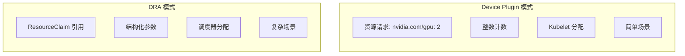
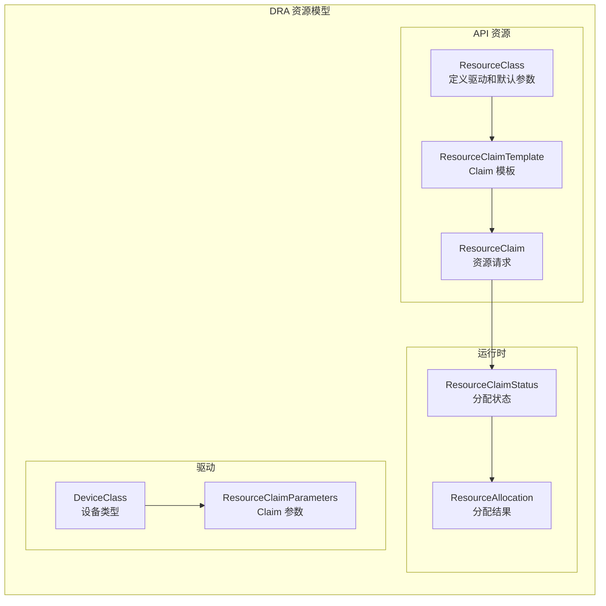
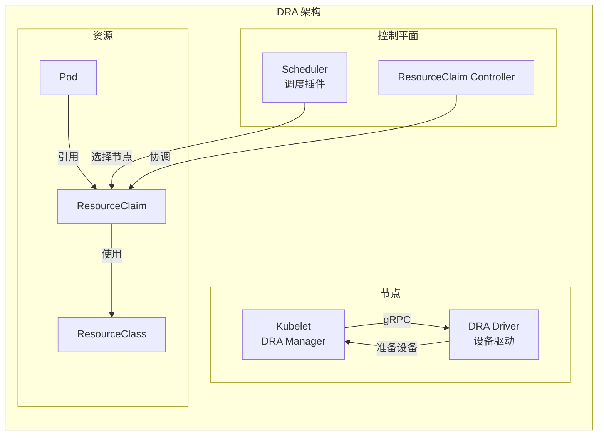

## 概述

Dynamic Resource Allocation（动态资源分配，DRA）是 Kubernetes 1.26 引入的新特性（Alpha），旨在解决 Device Plugin 在处理复杂设备分配场景时的局限性。DRA 允许更灵活的资源请求描述、调度时的资源分配，以及结构化的设备参数配置。

## 与 Device Plugin 对比



### 功能对比

| 特性 | Device Plugin | DRA |
|------|---------------|-----|
| 资源表达 | 整数计数 | 结构化参数 |
| 分配时机 | Pod 绑定后 | 调度时 |
| 资源选择 | 不可控 | 详细规格 |
| 跨节点资源 | 不支持 | 支持 |
| 资源共享 | 受限 | 灵活 |
| API 稳定性 | Stable | Alpha/Beta |

## 核心概念



## 资源定义

### ResourceClass

```yaml
apiVersion: resource.k8s.io/v1alpha3
kind: ResourceClass
metadata:
  name: gpu.nvidia.com
spec:
  # 驱动名称
  driverName: gpu.nvidia.com
  # 默认参数
  parametersRef:
    apiGroup: gpu.nvidia.com
    kind: GpuClassParameters
    name: default-params
  # 结构化参数
  structuredParameters: true
```

### ResourceClaim

```yaml
apiVersion: resource.k8s.io/v1alpha3
kind: ResourceClaim
metadata:
  name: gpu-claim
  namespace: default
spec:
  # 引用 ResourceClass
  resourceClassName: gpu.nvidia.com
  # 分配模式
  allocationMode: WaitForFirstConsumer  # Immediate 或 WaitForFirstConsumer
  # 参数引用
  parametersRef:
    apiGroup: gpu.nvidia.com
    kind: GpuClaimParameters
    name: my-gpu-params
```

### ResourceClaimTemplate

```yaml
apiVersion: resource.k8s.io/v1alpha3
kind: ResourceClaimTemplate
metadata:
  name: gpu-template
  namespace: default
spec:
  spec:
    resourceClassName: gpu.nvidia.com
    allocationMode: WaitForFirstConsumer
```

### Pod 使用 ResourceClaim

```yaml
apiVersion: v1
kind: Pod
metadata:
  name: gpu-pod
spec:
  containers:
  - name: cuda-app
    image: nvidia/cuda:11.0-base
    resources:
      claims:
      - name: gpu
  # 引用 ResourceClaim
  resourceClaims:
  - name: gpu
    source:
      # 直接引用现有 Claim
      resourceClaimName: gpu-claim
      # 或使用模板创建
      # resourceClaimTemplateName: gpu-template
```

## 架构设计



## DRA Manager (Kubelet)

### 核心接口

```go
// pkg/kubelet/cm/dra/manager.go

// Manager DRA 管理器接口
type Manager interface {
    // PrepareResources 为 Pod 准备资源
    PrepareResources(pod *v1.Pod) error

    // UnprepareResources 清理 Pod 资源
    UnprepareResources(pod *v1.Pod) error

    // PodMightNeedToUnprepareResources 检查 Pod 是否需要清理
    PodMightNeedToUnprepareResources(UID types.UID) bool

    // GetResources 获取容器资源配置
    GetResources(pod *v1.Pod, container *v1.Container) (*ContainerInfo, error)

    // GetContainerClaimInfos 获取容器 Claim 信息
    GetContainerClaimInfos(pod *v1.Pod, container *v1.Container) []*ClaimInfo
}

// ManagerImpl 实现
type ManagerImpl struct {
    // kubeClient API 客户端
    kubeClient kubernetes.Interface

    // 已准备的 Claim
    cache *claimInfoCache

    // 驱动注册
    registeredDrivers *sync.Map
}

// ClaimInfo Claim 信息
type ClaimInfo struct {
    // Claim 引用
    ClaimUID  types.UID
    ClaimName string
    Namespace string

    // 分配信息
    DriverName       string
    ClassName        string
    CDIDevices       []string
    NodePrepareArgs  runtime.RawExtension
}
```

### 资源准备

```go
// pkg/kubelet/cm/dra/manager.go

// PrepareResources 为 Pod 准备资源
func (m *ManagerImpl) PrepareResources(pod *v1.Pod) error {
    // 获取 Pod 的 ResourceClaims
    claims, err := m.getPodClaims(pod)
    if err != nil {
        return err
    }

    for _, claim := range claims {
        // 检查是否已准备
        if m.cache.contains(claim.UID) {
            continue
        }

        // 检查 Claim 是否已分配
        if claim.Status.Allocation == nil {
            return fmt.Errorf("claim %s not allocated", claim.Name)
        }

        // 获取驱动
        driver, err := m.getDriver(claim.Status.DriverName)
        if err != nil {
            return err
        }

        // 调用驱动准备资源
        nodeResourceData, err := driver.NodePrepareResources(
            context.Background(),
            &drapb.NodePrepareResourcesRequest{
                Claims: []*drapb.Claim{{
                    Uid:                string(claim.UID),
                    Namespace:          claim.Namespace,
                    Name:               claim.Name,
                    ResourceHandle:     claim.Status.Allocation.ResourceHandle,
                    StructuredResourceHandle: claim.Status.Allocation.Devices,
                }},
            },
        )
        if err != nil {
            return err
        }

        // 缓存 Claim 信息
        claimInfo := &ClaimInfo{
            ClaimUID:   claim.UID,
            ClaimName:  claim.Name,
            Namespace:  claim.Namespace,
            DriverName: claim.Status.DriverName,
            CDIDevices: nodeResourceData.CDIDevices,
        }
        m.cache.add(claimInfo)
    }

    return nil
}

// UnprepareResources 清理资源
func (m *ManagerImpl) UnprepareResources(pod *v1.Pod) error {
    claims, err := m.getPodClaims(pod)
    if err != nil {
        return err
    }

    for _, claim := range claims {
        claimInfo := m.cache.get(claim.UID)
        if claimInfo == nil {
            continue
        }

        // 检查是否还有其他 Pod 使用
        if m.cache.podCount(claim.UID) > 1 {
            m.cache.removePod(pod.UID, claim.UID)
            continue
        }

        // 调用驱动清理
        driver, err := m.getDriver(claimInfo.DriverName)
        if err != nil {
            return err
        }

        _, err = driver.NodeUnprepareResources(
            context.Background(),
            &drapb.NodeUnprepareResourcesRequest{
                Claims: []*drapb.Claim{{
                    Uid:       string(claim.UID),
                    Namespace: claim.Namespace,
                    Name:      claim.Name,
                }},
            },
        )
        if err != nil {
            return err
        }

        m.cache.delete(claim.UID)
    }

    return nil
}
```

## DRA 驱动接口

### gRPC 接口定义

```protobuf
// staging/src/k8s.io/dynamic-resource-allocation/proto/api.proto

service Node {
    // NodePrepareResources 准备资源
    rpc NodePrepareResources(NodePrepareResourcesRequest)
        returns (NodePrepareResourcesResponse) {}

    // NodeUnprepareResources 清理资源
    rpc NodeUnprepareResources(NodeUnprepareResourcesRequest)
        returns (NodeUnprepareResourcesResponse) {}
}

message Claim {
    string uid = 1;
    string namespace = 2;
    string name = 3;
    string resource_handle = 4;
    StructuredResourceHandle structured_resource_handle = 5;
}

message NodePrepareResourcesRequest {
    repeated Claim claims = 1;
}

message NodePrepareResourcesResponse {
    // 按 Claim UID 索引的结果
    map<string, NodePrepareResourceResponse> claims = 1;
}

message NodePrepareResourceResponse {
    // CDI 设备列表
    repeated string cdi_devices = 1;
    // 错误信息
    string error = 2;
}
```

### 驱动实现示例

```go
// 简化的 DRA 驱动实现

package main

import (
    "context"
    "net"

    "google.golang.org/grpc"
    drapb "k8s.io/dynamic-resource-allocation/kubeletplugin"
)

type gpuDriver struct {
    drapb.UnimplementedNodeServer
    // 设备管理
    devices map[string]*GPUDevice
}

// NodePrepareResources 准备 GPU 资源
func (d *gpuDriver) NodePrepareResources(
    ctx context.Context,
    req *drapb.NodePrepareResourcesRequest,
) (*drapb.NodePrepareResourcesResponse, error) {

    resp := &drapb.NodePrepareResourcesResponse{
        Claims: make(map[string]*drapb.NodePrepareResourceResponse),
    }

    for _, claim := range req.Claims {
        // 解析资源请求
        devices, err := d.allocateDevices(claim)
        if err != nil {
            resp.Claims[claim.Uid] = &drapb.NodePrepareResourceResponse{
                Error: err.Error(),
            }
            continue
        }

        // 生成 CDI 设备规格
        cdiDevices := make([]string, len(devices))
        for i, dev := range devices {
            cdiDevices[i] = fmt.Sprintf("nvidia.com/gpu=%s", dev.UUID)
        }

        resp.Claims[claim.Uid] = &drapb.NodePrepareResourceResponse{
            CDIDevices: cdiDevices,
        }
    }

    return resp, nil
}

// NodeUnprepareResources 清理资源
func (d *gpuDriver) NodeUnprepareResources(
    ctx context.Context,
    req *drapb.NodeUnprepareResourcesRequest,
) (*drapb.NodeUnprepareResourcesResponse, error) {

    resp := &drapb.NodeUnprepareResourcesResponse{
        Claims: make(map[string]*drapb.NodeUnprepareResourceResponse),
    }

    for _, claim := range req.Claims {
        // 释放设备
        d.releaseDevices(claim.Uid)
        resp.Claims[claim.Uid] = &drapb.NodeUnprepareResourceResponse{}
    }

    return resp, nil
}

func main() {
    driver := &gpuDriver{
        devices: discoverGPUs(),
    }

    // 创建 gRPC 服务器
    socketPath := "/var/lib/kubelet/plugins/gpu.nvidia.com/plugin.sock"
    listener, _ := net.Listen("unix", socketPath)

    server := grpc.NewServer()
    drapb.RegisterNodeServer(server, driver)

    // 向 Kubelet 注册
    registerWithKubelet(socketPath)

    server.Serve(listener)
}
```

## 调度器集成

### DRA 调度插件

```go
// pkg/scheduler/framework/plugins/dynamicresources/dynamicresources.go

// DynamicResources 调度插件
type DynamicResources struct {
    // 客户端
    clientset       kubernetes.Interface
    claimLister     resourcelisters.ResourceClaimLister
    classLister     resourcelisters.ResourceClassLister
    templateLister  resourcelisters.ResourceClaimTemplateLister

    // 状态
    podSchedulingContexts *sync.Map
}

// PreFilter 预过滤
func (pl *DynamicResources) PreFilter(
    ctx context.Context,
    state *framework.CycleState,
    pod *v1.Pod,
) (*framework.PreFilterResult, *framework.Status) {

    // 检查 Pod 是否使用 ResourceClaims
    if !podUsesClaims(pod) {
        return nil, nil
    }

    // 收集所有 Claims
    claims, err := pl.collectPodClaims(pod)
    if err != nil {
        return nil, framework.AsStatus(err)
    }

    // 保存状态
    state.Write(stateKey, &stateData{claims: claims})

    return nil, nil
}

// Filter 过滤
func (pl *DynamicResources) Filter(
    ctx context.Context,
    state *framework.CycleState,
    pod *v1.Pod,
    nodeInfo *framework.NodeInfo,
) *framework.Status {

    data, _ := state.Read(stateKey)
    if data == nil {
        return nil
    }

    stateData := data.(*stateData)

    for _, claim := range stateData.claims {
        // 检查 Claim 是否已分配
        if claim.Status.Allocation != nil {
            // 已分配，检查节点是否匹配
            if !claimAvailableOnNode(claim, nodeInfo.Node().Name) {
                return framework.NewStatus(
                    framework.UnschedulableAndUnresolvable,
                    "claim not available on this node",
                )
            }
            continue
        }

        // 检查节点是否可以满足未分配的 Claim
        if !nodeCanSatisfyClaim(nodeInfo, claim) {
            return framework.NewStatus(
                framework.Unschedulable,
                "node cannot satisfy claim",
            )
        }
    }

    return nil
}

// Reserve 预留
func (pl *DynamicResources) Reserve(
    ctx context.Context,
    state *framework.CycleState,
    pod *v1.Pod,
    nodeName string,
) *framework.Status {

    data, _ := state.Read(stateKey)
    stateData := data.(*stateData)

    for _, claim := range stateData.claims {
        if claim.Status.Allocation != nil {
            continue
        }

        // 分配资源
        allocation, err := pl.allocateClaim(claim, nodeName)
        if err != nil {
            return framework.AsStatus(err)
        }

        // 更新 Claim 状态
        claim.Status.Allocation = allocation
        _, err = pl.clientset.ResourceV1alpha3().ResourceClaims(claim.Namespace).
            UpdateStatus(ctx, claim, metav1.UpdateOptions{})
        if err != nil {
            return framework.AsStatus(err)
        }
    }

    return nil
}
```

## CDI (Container Device Interface) 集成

### CDI 规格

```json
{
    "cdiVersion": "0.5.0",
    "kind": "nvidia.com/gpu",
    "devices": [
        {
            "name": "GPU-abc123",
            "containerEdits": {
                "deviceNodes": [
                    {
                        "path": "/dev/nvidia0",
                        "type": "c",
                        "major": 195,
                        "minor": 0
                    }
                ],
                "mounts": [
                    {
                        "hostPath": "/usr/local/nvidia/lib64",
                        "containerPath": "/usr/local/nvidia/lib64",
                        "options": ["ro", "nosuid", "nodev"]
                    }
                ],
                "env": [
                    "NVIDIA_VISIBLE_DEVICES=GPU-abc123"
                ]
            }
        }
    ]
}
```

### Kubelet 应用 CDI

```go
// pkg/kubelet/cm/dra/cdi.go

// AnnotationToDeviceIDs 从注解解析 CDI 设备 ID
func AnnotationToDeviceIDs(annotations map[string]string) []string {
    annotation := annotations[draAnnotationKey]
    if annotation == "" {
        return nil
    }

    // 解析 JSON 格式的设备列表
    var devices []string
    json.Unmarshal([]byte(annotation), &devices)
    return devices
}

// GenerateContainerOpts 生成容器 OCI 规格修改
func GenerateContainerOpts(cdiDevices []string) (*runtimeapi.ContainerConfig, error) {
    if len(cdiDevices) == 0 {
        return nil, nil
    }

    config := &runtimeapi.ContainerConfig{}

    // 加载 CDI 规格
    registry := cdi.GetDefaultCache()

    for _, cdiDevice := range cdiDevices {
        spec, err := registry.GetDevice(cdiDevice)
        if err != nil {
            return nil, err
        }

        // 应用设备节点
        for _, dev := range spec.ContainerEdits.DeviceNodes {
            config.Devices = append(config.Devices, &runtimeapi.Device{
                ContainerPath: dev.Path,
                HostPath:      dev.Path,
                Permissions:   "rw",
            })
        }

        // 应用挂载
        for _, mount := range spec.ContainerEdits.Mounts {
            config.Mounts = append(config.Mounts, &runtimeapi.Mount{
                ContainerPath: mount.ContainerPath,
                HostPath:      mount.HostPath,
                Readonly:      containsOption(mount.Options, "ro"),
            })
        }

        // 应用环境变量
        for _, env := range spec.ContainerEdits.Env {
            parts := strings.SplitN(env, "=", 2)
            config.Envs = append(config.Envs, &runtimeapi.KeyValue{
                Key:   parts[0],
                Value: parts[1],
            })
        }
    }

    return config, nil
}
```

## 使用示例

### 复杂 GPU 请求

```yaml
# ResourceClass 定义
apiVersion: resource.k8s.io/v1alpha3
kind: ResourceClass
metadata:
  name: gpu.nvidia.com
spec:
  driverName: gpu.nvidia.com
  structuredParameters: true
---
# DeviceClass 定义详细设备参数
apiVersion: gpu.nvidia.com/v1
kind: DeviceClass
metadata:
  name: high-memory-gpu
spec:
  selector:
    matchExpressions:
    - key: memory
      operator: Gt
      values: ["16Gi"]
    - key: architecture
      operator: In
      values: ["ampere", "hopper"]
---
# ResourceClaim 请求特定 GPU
apiVersion: resource.k8s.io/v1alpha3
kind: ResourceClaim
metadata:
  name: ml-training-gpu
spec:
  resourceClassName: gpu.nvidia.com
  allocationMode: WaitForFirstConsumer
  parametersRef:
    apiGroup: gpu.nvidia.com
    kind: GpuClaimParameters
    name: ml-training-params
---
# 参数定义
apiVersion: gpu.nvidia.com/v1
kind: GpuClaimParameters
metadata:
  name: ml-training-params
spec:
  count: 4
  deviceClassName: high-memory-gpu
  # MIG 配置
  mig:
    profile: "3g.40gb"
---
# Pod 使用
apiVersion: v1
kind: Pod
metadata:
  name: ml-training
spec:
  containers:
  - name: training
    image: ml-framework:latest
    resources:
      claims:
      - name: gpu
  resourceClaims:
  - name: gpu
    source:
      resourceClaimName: ml-training-gpu
```

## 监控与调试

### 查看 ResourceClaim 状态

```bash
# 列出 ResourceClaims
kubectl get resourceclaims

# 查看 Claim 详情
kubectl describe resourceclaim gpu-claim

# 查看分配状态
kubectl get resourceclaim gpu-claim -o jsonpath='{.status.allocation}'
```

### 调试驱动

```bash
# 查看驱动 Socket
ls -la /var/lib/kubelet/plugins/

# 查看 Kubelet DRA 日志
journalctl -u kubelet | grep -i "dra\|resource"

# 检查 CDI 规格
ls /etc/cdi/
cat /etc/cdi/nvidia.yaml
```

## 总结

DRA 是 Kubernetes 资源管理的重大演进：

1. **结构化参数**：支持复杂的资源规格描述
2. **调度时分配**：资源分配在调度阶段完成
3. **标准接口**：CDI 提供统一的设备注入方式
4. **灵活共享**：支持资源在多个 Pod 间共享
5. **可扩展**：驱动可以定义任意参数

DRA 特别适合需要精细控制设备分配的场景，如 GPU、FPGA、网络设备等。随着功能逐渐稳定，DRA 将成为管理复杂硬件资源的首选方案。
