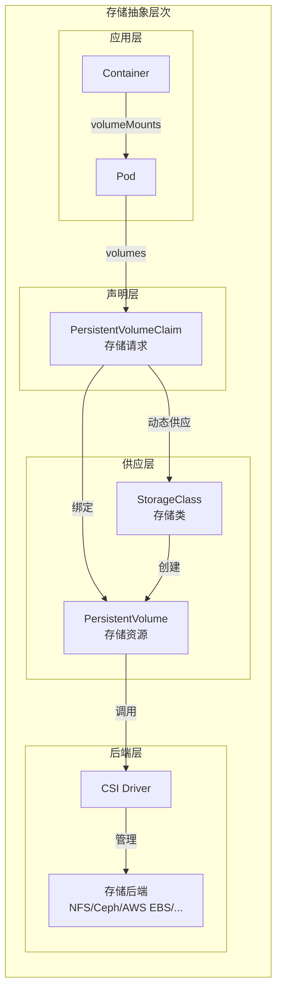
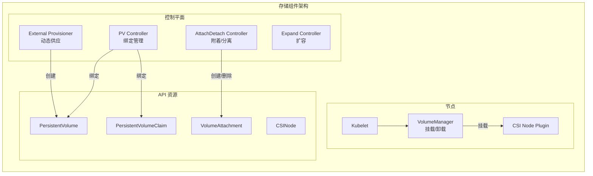
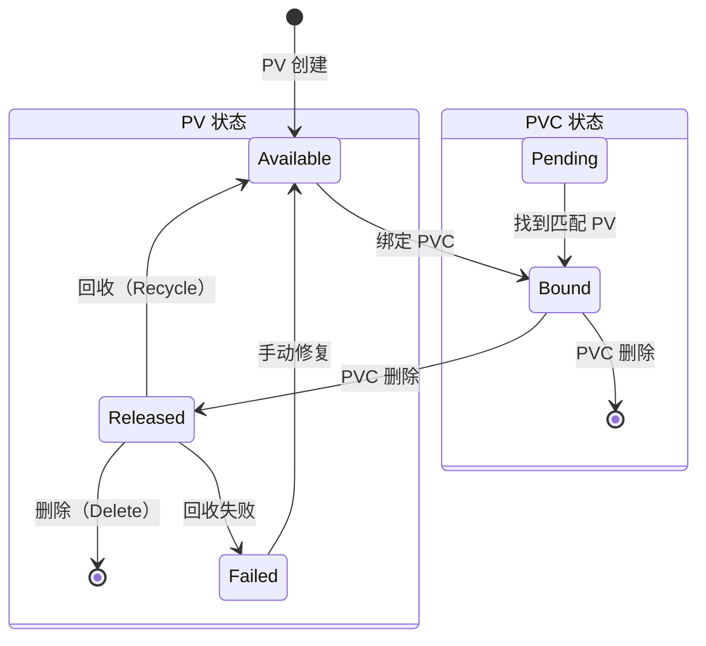
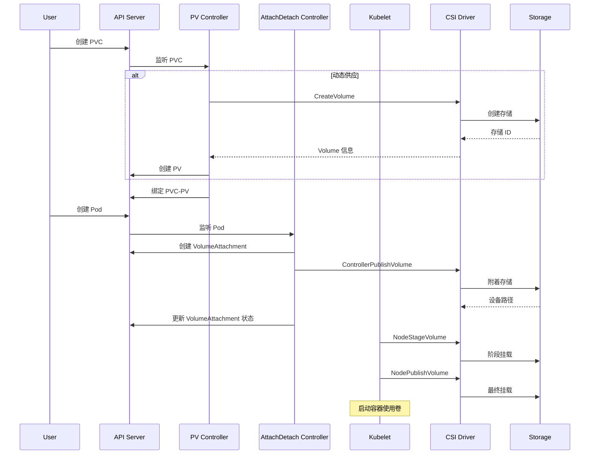
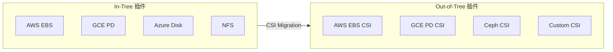

## 概述

Kubernetes 存储系统提供了一套完整的抽象层次，将底层存储实现与上层应用解耦。从最简单的 EmptyDir 到复杂的分布式存储，Kubernetes 通过 Volume、PersistentVolume（PV）、PersistentVolumeClaim（PVC）和 StorageClass 等抽象，实现了存储资源的统一管理和动态供应。

## 存储抽象层次



## 卷类型分类

### 临时卷

| 类型 | 描述 | 生命周期 |
|------|------|----------|
| EmptyDir | 空目录 | 随 Pod 删除 |
| ConfigMap | 配置数据 | 跟随 ConfigMap |
| Secret | 敏感数据 | 跟随 Secret |
| DownwardAPI | Pod 元数据 | 随 Pod 删除 |
| Projected | 投影卷（组合多种源） | 随 Pod 删除 |

### 持久卷

| 类型 | 描述 | 供应方式 |
|------|------|----------|
| HostPath | 宿主机路径 | 静态 |
| Local | 本地存储 | 静态 |
| NFS | 网络文件系统 | 静态/动态 |
| CSI | 容器存储接口 | 动态 |
| Cloud（AWS EBS, GCE PD, Azure Disk） | 云存储 | 动态 |

## 核心组件



## 卷生命周期



### 阶段说明

| 阶段 | PV 状态 | 描述 |
|------|---------|------|
| Provisioning | - | 创建存储（静态或动态） |
| Binding | Available → Bound | PVC 与 PV 绑定 |
| Using | Bound | Pod 使用卷 |
| Reclaiming | Released | PVC 删除后的 PV 回收 |
| Deleting | - | 删除存储资源 |

## 存储操作流程



## 访问模式

```go
// staging/src/k8s.io/api/core/v1/types.go

// PersistentVolumeAccessMode 访问模式
type PersistentVolumeAccessMode string

const (
    // ReadWriteOnce 单节点读写
    ReadWriteOnce PersistentVolumeAccessMode = "ReadWriteOnce"

    // ReadOnlyMany 多节点只读
    ReadOnlyMany PersistentVolumeAccessMode = "ReadOnlyMany"

    // ReadWriteMany 多节点读写
    ReadWriteMany PersistentVolumeAccessMode = "ReadWriteMany"

    // ReadWriteOncePod 单 Pod 读写（1.22+）
    ReadWriteOncePod PersistentVolumeAccessMode = "ReadWriteOncePod"
)
```

### 访问模式对比

| 模式 | 缩写 | 描述 | 适用场景 |
|------|------|------|----------|
| ReadWriteOnce | RWO | 单节点读写 | 数据库、有状态应用 |
| ReadOnlyMany | ROX | 多节点只读 | 配置文件、静态资源 |
| ReadWriteMany | RWX | 多节点读写 | 共享存储、NFS |
| ReadWriteOncePod | RWOP | 单 Pod 读写 | 严格独占 |

## 回收策略

```go
// staging/src/k8s.io/api/core/v1/types.go

// PersistentVolumeReclaimPolicy 回收策略
type PersistentVolumeReclaimPolicy string

const (
    // Retain 保留
    PersistentVolumeReclaimRetain PersistentVolumeReclaimPolicy = "Retain"

    // Delete 删除
    PersistentVolumeReclaimDelete PersistentVolumeReclaimPolicy = "Delete"

    // Recycle 回收（已弃用）
    PersistentVolumeReclaimRecycle PersistentVolumeReclaimPolicy = "Recycle"
)
```

### 策略对比

| 策略 | 行为 | 适用场景 |
|------|------|----------|
| Retain | 保留数据，手动处理 | 重要数据 |
| Delete | 删除后端存储 | 动态供应的临时数据 |
| Recycle | 清空数据重用（已弃用） | - |

## Volume 模式

```yaml
# 文件系统模式（默认）
apiVersion: v1
kind: PersistentVolumeClaim
metadata:
  name: fs-pvc
spec:
  accessModes:
    - ReadWriteOnce
  volumeMode: Filesystem
  resources:
    requests:
      storage: 10Gi
---
# 块设备模式
apiVersion: v1
kind: PersistentVolumeClaim
metadata:
  name: block-pvc
spec:
  accessModes:
    - ReadWriteOnce
  volumeMode: Block
  resources:
    requests:
      storage: 10Gi
```

### 模式对比

| 模式 | 描述 | 容器挂载方式 |
|------|------|--------------|
| Filesystem | 格式化为文件系统 | 目录挂载 |
| Block | 原始块设备 | 设备文件 |

## 存储容量追踪

### CSIStorageCapacity

```yaml
apiVersion: storage.k8s.io/v1
kind: CSIStorageCapacity
metadata:
  name: csi-capacity-xxx
  namespace: kube-system
storageClassName: fast-storage
nodeTopology:
  matchLabels:
    topology.kubernetes.io/zone: us-east-1a
capacity: 100Gi
maximumVolumeSize: 10Gi
```

### 调度器集成

```go
// pkg/scheduler/framework/plugins/volumebinding/binder.go

// 检查存储容量
func (b *volumeBinder) checkVolumeCapacity(
    claim *v1.PersistentVolumeClaim,
    storageClass *storagev1.StorageClass,
    node *v1.Node,
) error {
    // 获取节点的存储容量
    capacities, err := b.capacityLister.List(labels.Everything())
    if err != nil {
        return err
    }

    requestedSize := claim.Spec.Resources.Requests[v1.ResourceStorage]

    for _, capacity := range capacities {
        if capacity.StorageClassName != storageClass.Name {
            continue
        }

        // 检查节点拓扑匹配
        if !matchesTopology(capacity.NodeTopology, node) {
            continue
        }

        // 检查容量
        if capacity.Capacity != nil && capacity.Capacity.Cmp(requestedSize) >= 0 {
            return nil
        }
    }

    return fmt.Errorf("insufficient storage capacity")
}
```

## In-Tree 与 Out-of-Tree



### CSI Migration

```yaml
# Kubelet 配置启用 CSI Migration
apiVersion: kubelet.config.k8s.io/v1beta1
kind: KubeletConfiguration
featureGates:
  CSIMigration: true
  CSIMigrationAWS: true
  CSIMigrationGCE: true
```

## 监控指标

```go
var (
    // PV 绑定操作延迟
    pvBindingLatency = prometheus.NewHistogramVec(
        prometheus.HistogramOpts{
            Name:    "pv_collector_bound_pv_latency_seconds",
            Help:    "Latency of binding PVCs to PVs",
            Buckets: prometheus.ExponentialBuckets(0.001, 2, 15),
        },
        []string{"storage_class"},
    )

    // 卷操作计数
    volumeOperations = prometheus.NewCounterVec(
        prometheus.CounterOpts{
            Name: "storage_operation_total",
            Help: "Total number of storage operations",
        },
        []string{"operation", "plugin", "status"},
    )

    // 卷操作延迟
    volumeOperationLatency = prometheus.NewHistogramVec(
        prometheus.HistogramOpts{
            Name:    "storage_operation_duration_seconds",
            Help:    "Duration of storage operations",
            Buckets: prometheus.ExponentialBuckets(0.001, 2, 15),
        },
        []string{"operation", "plugin"},
    )
)
```

## 调试命令

```bash
# 查看 PV
kubectl get pv
kubectl describe pv <pv-name>

# 查看 PVC
kubectl get pvc -A
kubectl describe pvc <pvc-name>

# 查看 StorageClass
kubectl get sc
kubectl describe sc <sc-name>

# 查看 VolumeAttachment
kubectl get volumeattachment
kubectl describe volumeattachment <va-name>

# 查看 CSI 节点信息
kubectl get csinode
kubectl describe csinode <node-name>

# 查看 CSI 驱动
kubectl get csidrivers
```

## 最佳实践

### 1. 选择合适的存储类型

| 场景 | 推荐存储 | 原因 |
|------|----------|------|
| 数据库 | 本地 SSD / 高性能云盘 | 低延迟 |
| 日志收集 | 网络存储 | 高吞吐 |
| 配置文件 | ConfigMap/Secret | 简单易用 |
| 共享数据 | NFS / CephFS | 多节点访问 |

### 2. 容量规划

```yaml
# 使用资源配额限制存储使用
apiVersion: v1
kind: ResourceQuota
metadata:
  name: storage-quota
spec:
  hard:
    requests.storage: "100Gi"
    persistentvolumeclaims: "10"
    fast-storage.storageclass.storage.k8s.io/requests.storage: "50Gi"
```

### 3. 数据保护

```yaml
# 使用 Retain 策略保护重要数据
apiVersion: storage.k8s.io/v1
kind: StorageClass
metadata:
  name: important-data
provisioner: csi.example.com
reclaimPolicy: Retain
allowVolumeExpansion: true
```

## 总结

Kubernetes 存储系统通过多层抽象实现了灵活的存储管理：

1. **抽象层次**：Volume → PVC → PV → StorageClass → CSI
2. **组件协作**：PV Controller、AttachDetach Controller、VolumeManager
3. **生命周期**：Provisioning → Binding → Using → Reclaiming
4. **扩展机制**：CSI 接口支持任意存储后端
5. **容量管理**：CSIStorageCapacity 实现容量感知调度

理解存储架构是使用和运维 Kubernetes 存储的基础。
