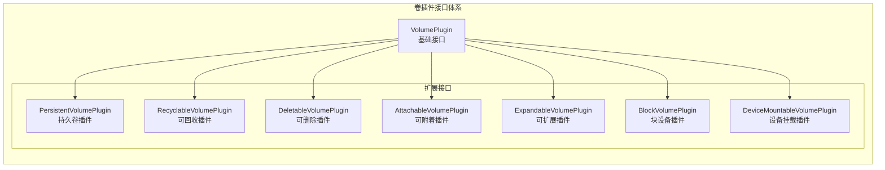

## 概述

Kubernetes 卷插件体系定义了一套标准接口，用于管理各种类型的存储卷。插件系统分为 In-Tree 插件（内置在 Kubernetes 代码中）和 Out-of-Tree 插件（通过 CSI 或 FlexVolume 扩展）。随着 CSI 的成熟，In-Tree 插件正在逐步迁移到 CSI。

## 插件接口体系



## 核心接口定义

### VolumePlugin

```go
// pkg/volume/plugins.go

// VolumePlugin 基础卷插件接口
type VolumePlugin interface {
    // Init 初始化插件
    Init(host VolumeHost) error

    // GetPluginName 获取插件名称
    GetPluginName() string

    // GetVolumeName 获取卷名称
    GetVolumeName(spec *Spec) (string, error)

    // CanSupport 检查是否支持该卷规格
    CanSupport(spec *Spec) bool

    // RequiresRemount 是否需要重新挂载
    RequiresRemount(spec *Spec) bool

    // NewMounter 创建 Mounter
    NewMounter(spec *Spec, podRef *v1.Pod, opts VolumeOptions) (Mounter, error)

    // NewUnmounter 创建 Unmounter
    NewUnmounter(name string, podUID types.UID) (Unmounter, error)

    // ConstructVolumeSpec 从挂载路径构造卷规格
    ConstructVolumeSpec(volumeName, mountPath string) (*Spec, error)

    // SupportsMountOption 是否支持挂载选项
    SupportsMountOption() bool

    // SupportsBulkVolumeVerification 是否支持批量验证
    SupportsBulkVolumeVerification() bool

    // SupportsSELinuxContextMount 是否支持 SELinux 上下文挂载
    SupportsSELinuxContextMount(spec *Spec) (bool, error)
}

// VolumeHost 卷主机接口（由 Kubelet 实现）
type VolumeHost interface {
    // GetPluginDir 获取插件目录
    GetPluginDir(pluginName string) string

    // GetVolumeDevicePluginDir 获取块设备插件目录
    GetVolumeDevicePluginDir(pluginName string) string

    // GetPodsDir 获取 Pod 目录
    GetPodsDir() string

    // GetPodVolumeDir 获取 Pod 卷目录
    GetPodVolumeDir(podUID types.UID, pluginName string, volumeName string) string

    // GetKubeClient 获取 Kubernetes 客户端
    GetKubeClient() clientset.Interface

    // NewWrapperMounter 创建包装 Mounter
    NewWrapperMounter(volName string, spec Spec, pod *v1.Pod, opts VolumeOptions) (Mounter, error)

    // NewWrapperUnmounter 创建包装 Unmounter
    NewWrapperUnmounter(volName string, spec Spec, podUID types.UID) (Unmounter, error)

    // GetMounter 获取挂载器
    GetMounter(pluginName string) mount.Interface

    // GetHostName 获取主机名
    GetHostName() string

    // GetNodeName 获取节点名
    GetNodeName() types.NodeName
}
```

### AttachableVolumePlugin

```go
// pkg/volume/plugins.go

// AttachableVolumePlugin 可附着卷插件接口
type AttachableVolumePlugin interface {
    VolumePlugin

    // NewAttacher 创建 Attacher
    NewAttacher() (Attacher, error)

    // NewDetacher 创建 Detacher
    NewDetacher() (Detacher, error)

    // GetDeviceMountRefs 获取设备挂载引用
    GetDeviceMountRefs(deviceMountPath string) ([]string, error)

    // CanAttach 检查是否可以附着
    CanAttach(spec *Spec) (bool, error)
}

// Attacher 附着器接口
type Attacher interface {
    // Attach 附着卷到节点
    Attach(spec *Spec, nodeName types.NodeName) (string, error)

    // VolumesAreAttached 批量检查卷是否已附着
    VolumesAreAttached(specs []*Spec, nodeName types.NodeName) (map[*Spec]bool, error)

    // WaitForAttach 等待附着完成
    WaitForAttach(spec *Spec, devicePath string, pod *v1.Pod, timeout time.Duration) (string, error)

    // GetDeviceMountPath 获取设备挂载路径
    GetDeviceMountPath(spec *Spec) (string, error)

    // MountDevice 挂载设备
    MountDevice(spec *Spec, devicePath string, deviceMountPath string, deviceMounterArgs DeviceMounterArgs) error
}

// Detacher 分离器接口
type Detacher interface {
    // Detach 从节点分离卷
    Detach(volumeName string, nodeName types.NodeName) error

    // UnmountDevice 卸载设备
    UnmountDevice(deviceMountPath string) error
}
```

### ExpandableVolumePlugin

```go
// pkg/volume/plugins.go

// ExpandableVolumePlugin 可扩展卷插件接口
type ExpandableVolumePlugin interface {
    VolumePlugin

    // ExpandVolumeDevice 扩展卷设备
    ExpandVolumeDevice(spec *Spec, newSize resource.Quantity, oldSize resource.Quantity) (resource.Quantity, error)

    // RequiresFSResize 是否需要文件系统扩展
    RequiresFSResize() bool
}

// NodeExpandableVolumePlugin 节点端可扩展插件
type NodeExpandableVolumePlugin interface {
    VolumePlugin

    // RequiresFSResize 是否需要文件系统扩展
    RequiresFSResize() bool

    // NodeExpand 节点端扩展
    NodeExpand(resizeOptions NodeResizeOptions) (bool, error)
}

// NodeResizeOptions 节点扩展选项
type NodeResizeOptions struct {
    VolumeSpec *Spec
    NewSize    resource.Quantity
    OldSize    resource.Quantity
    DevicePath string
    DeviceMountPath string
    DeviceStagePath string
    CSIVolumePhase CSIVolumePhase
}
```

## Mounter/Unmounter 接口

```go
// pkg/volume/volume.go

// Mounter 挂载器接口
type Mounter interface {
    Volume

    // CanMount 检查是否可以挂载
    CanMount() error

    // SetUp 执行挂载
    SetUp(mounterArgs MounterArgs) error

    // SetUpAt 在指定路径挂载
    SetUpAt(dir string, mounterArgs MounterArgs) error

    // GetAttributes 获取卷属性
    GetAttributes() Attributes
}

// Unmounter 卸载器接口
type Unmounter interface {
    Volume

    // TearDown 执行卸载
    TearDown() error

    // TearDownAt 在指定路径卸载
    TearDownAt(dir string) error
}

// MounterArgs 挂载参数
type MounterArgs struct {
    // FsUser 文件系统用户
    FsUser *int64
    // FsGroup 文件系统组
    FsGroup *int64
    // FSGroupChangePolicy 组更改策略
    FSGroupChangePolicy *v1.PodFSGroupChangePolicy
    // DesiredSize 期望大小
    DesiredSize *resource.Quantity
    // SELinuxLabel SELinux 标签
    SELinuxLabel string
}

// Attributes 卷属性
type Attributes struct {
    ReadOnly       bool
    Managed        bool
    SELinuxRelabel bool
    SupportsSELinux bool
}
```

## 插件管理器

```go
// pkg/volume/plugins.go

// VolumePluginMgr 插件管理器
type VolumePluginMgr struct {
    mutex   sync.RWMutex
    plugins map[string]VolumePlugin
    prober  DynamicPluginProber
    Host    VolumeHost
}

// InitPlugins 初始化插件
func (pm *VolumePluginMgr) InitPlugins(plugins []VolumePlugin, prober DynamicPluginProber, host VolumeHost) error {
    pm.mutex.Lock()
    defer pm.mutex.Unlock()

    pm.Host = host
    pm.plugins = make(map[string]VolumePlugin)

    // 注册所有插件
    for _, plugin := range plugins {
        name := plugin.GetPluginName()

        if err := plugin.Init(host); err != nil {
            klog.ErrorS(err, "Failed to init plugin", "plugin", name)
            continue
        }

        pm.plugins[name] = plugin
        klog.V(1).InfoS("Registered volume plugin", "plugin", name)
    }

    // 设置动态探测器
    pm.prober = prober

    return nil
}

// FindPluginBySpec 根据规格查找插件
func (pm *VolumePluginMgr) FindPluginBySpec(spec *Spec) (VolumePlugin, error) {
    pm.mutex.RLock()
    defer pm.mutex.RUnlock()

    // 遍历所有插件查找匹配
    for _, plugin := range pm.plugins {
        if plugin.CanSupport(spec) {
            return plugin, nil
        }
    }

    return nil, fmt.Errorf("no volume plugin matched spec %+v", spec)
}

// FindPluginByName 根据名称查找插件
func (pm *VolumePluginMgr) FindPluginByName(name string) (VolumePlugin, error) {
    pm.mutex.RLock()
    defer pm.mutex.RUnlock()

    plugin, found := pm.plugins[name]
    if !found {
        return nil, fmt.Errorf("plugin %q not found", name)
    }

    return plugin, nil
}

// FindAttachablePluginBySpec 查找可附着插件
func (pm *VolumePluginMgr) FindAttachablePluginBySpec(spec *Spec) (AttachableVolumePlugin, error) {
    plugin, err := pm.FindPluginBySpec(spec)
    if err != nil {
        return nil, err
    }

    attachablePlugin, ok := plugin.(AttachableVolumePlugin)
    if !ok {
        return nil, fmt.Errorf("plugin %q does not implement AttachableVolumePlugin", plugin.GetPluginName())
    }

    return attachablePlugin, nil
}
```

## 内置插件实现

### EmptyDir 插件

```go
// pkg/volume/emptydir/empty_dir.go

const emptyDirPluginName = "kubernetes.io/empty-dir"

type emptyDirPlugin struct {
    host volume.VolumeHost
}

func (plugin *emptyDirPlugin) GetPluginName() string {
    return emptyDirPluginName
}

func (plugin *emptyDirPlugin) CanSupport(spec *volume.Spec) bool {
    return spec.Volume != nil && spec.Volume.EmptyDir != nil
}

func (plugin *emptyDirPlugin) NewMounter(spec *volume.Spec, pod *v1.Pod, opts volume.VolumeOptions) (volume.Mounter, error) {
    return &emptyDirMounter{
        emptyDir: &emptyDir{
            pod:        pod,
            volName:    spec.Name(),
            medium:     spec.Volume.EmptyDir.Medium,
            sizeLimit:  spec.Volume.EmptyDir.SizeLimit,
            plugin:     plugin,
            mounter:    plugin.host.GetMounter(plugin.GetPluginName()),
        },
    }, nil
}

// emptyDirMounter 实现
type emptyDirMounter struct {
    *emptyDir
}

func (e *emptyDirMounter) SetUpAt(dir string, mounterArgs volume.MounterArgs) error {
    // 检查目录是否已存在
    notMnt, err := e.mounter.IsLikelyNotMountPoint(dir)
    if err != nil && !os.IsNotExist(err) {
        return err
    }

    // 根据介质类型创建目录或 tmpfs
    switch e.medium {
    case v1.StorageMediumMemory:
        // 使用 tmpfs
        return e.setupTmpfs(dir)
    case v1.StorageMediumHugePages, v1.StorageMediumHugePagesPrefix:
        // 使用 hugetlbfs
        return e.setupHugepages(dir)
    default:
        // 使用普通目录
        return e.setupDir(dir)
    }
}

func (e *emptyDirMounter) setupTmpfs(dir string) error {
    // 创建目录
    if err := os.MkdirAll(dir, 0750); err != nil {
        return err
    }

    // 挂载 tmpfs
    options := []string{"size=" + e.sizeLimit.String()}
    return e.mounter.Mount("tmpfs", dir, "tmpfs", options)
}

func (e *emptyDirMounter) setupDir(dir string) error {
    return os.MkdirAll(dir, 0750)
}
```

### ConfigMap 插件

```go
// pkg/volume/configmap/configmap.go

const configMapPluginName = "kubernetes.io/configmap"

type configMapPlugin struct {
    host        volume.VolumeHost
    getConfigMap func(namespace, name string) (*v1.ConfigMap, error)
}

func (plugin *configMapPlugin) NewMounter(spec *volume.Spec, pod *v1.Pod, opts volume.VolumeOptions) (volume.Mounter, error) {
    return &configMapVolumeMounter{
        configMapVolume: &configMapVolume{
            volName:  spec.Name(),
            podUID:   pod.UID,
            plugin:   plugin,
            pod:      pod,
        },
        source:       *spec.Volume.ConfigMap,
        configMap:    nil, // 延迟加载
        defaultMode:  spec.Volume.ConfigMap.DefaultMode,
    }, nil
}

// configMapVolumeMounter 实现
type configMapVolumeMounter struct {
    *configMapVolume
    source      v1.ConfigMapVolumeSource
    configMap   *v1.ConfigMap
    defaultMode *int32
}

func (c *configMapVolumeMounter) SetUpAt(dir string, mounterArgs volume.MounterArgs) error {
    // 获取 ConfigMap
    configMap, err := c.plugin.getConfigMap(c.pod.Namespace, c.source.Name)
    if err != nil {
        if c.source.Optional != nil && *c.source.Optional {
            return nil
        }
        return err
    }

    // 创建目录
    if err := os.MkdirAll(dir, 0750); err != nil {
        return err
    }

    // 写入数据
    payload := make(map[string]volumeutil.FileProjection)

    for key, value := range configMap.Data {
        payload[key] = volumeutil.FileProjection{
            Data: []byte(value),
            Mode: *c.defaultMode,
        }
    }

    for key, value := range configMap.BinaryData {
        payload[key] = volumeutil.FileProjection{
            Data: value,
            Mode: *c.defaultMode,
        }
    }

    // 使用原子写入
    writer, err := volumeutil.NewAtomicWriter(dir, c.volName)
    if err != nil {
        return err
    }

    return writer.Write(payload)
}
```

### Secret 插件

```go
// pkg/volume/secret/secret.go

const secretPluginName = "kubernetes.io/secret"

type secretPlugin struct {
    host      volume.VolumeHost
    getSecret func(namespace, name string) (*v1.Secret, error)
}

func (plugin *secretPlugin) NewMounter(spec *volume.Spec, pod *v1.Pod, opts volume.VolumeOptions) (volume.Mounter, error) {
    return &secretVolumeMounter{
        secretVolume: &secretVolume{
            volName: spec.Name(),
            podUID:  pod.UID,
            plugin:  plugin,
            pod:     pod,
        },
        source:      *spec.Volume.Secret,
        defaultMode: spec.Volume.Secret.DefaultMode,
    }, nil
}

// secretVolumeMounter 实现
type secretVolumeMounter struct {
    *secretVolume
    source      v1.SecretVolumeSource
    defaultMode *int32
}

func (s *secretVolumeMounter) SetUpAt(dir string, mounterArgs volume.MounterArgs) error {
    // 获取 Secret
    secret, err := s.plugin.getSecret(s.pod.Namespace, s.source.SecretName)
    if err != nil {
        if s.source.Optional != nil && *s.source.Optional {
            return nil
        }
        return err
    }

    // 创建目录
    if err := os.MkdirAll(dir, 0750); err != nil {
        return err
    }

    // 写入数据
    payload := make(map[string]volumeutil.FileProjection)

    for key, value := range secret.Data {
        payload[key] = volumeutil.FileProjection{
            Data: value,
            Mode: *s.defaultMode,
        }
    }

    // 使用原子写入
    writer, err := volumeutil.NewAtomicWriter(dir, s.volName)
    if err != nil {
        return err
    }

    return writer.Write(payload)
}
```

## Projected 卷

```go
// pkg/volume/projected/projected.go

const projectedPluginName = "kubernetes.io/projected"

type projectedPlugin struct {
    host        volume.VolumeHost
    getSecret   func(namespace, name string) (*v1.Secret, error)
    getConfigMap func(namespace, name string) (*v1.ConfigMap, error)
}

type projectedVolumeMounter struct {
    *projectedVolume
    source v1.ProjectedVolumeSource
}

func (p *projectedVolumeMounter) SetUpAt(dir string, mounterArgs volume.MounterArgs) error {
    payload := make(map[string]volumeutil.FileProjection)

    // 处理每个投影源
    for _, source := range p.source.Sources {
        if source.Secret != nil {
            if err := p.collectSecretData(source.Secret, payload); err != nil {
                return err
            }
        }

        if source.ConfigMap != nil {
            if err := p.collectConfigMapData(source.ConfigMap, payload); err != nil {
                return err
            }
        }

        if source.DownwardAPI != nil {
            if err := p.collectDownwardAPIData(source.DownwardAPI, payload); err != nil {
                return err
            }
        }

        if source.ServiceAccountToken != nil {
            if err := p.collectServiceAccountTokenData(source.ServiceAccountToken, payload); err != nil {
                return err
            }
        }
    }

    // 写入文件
    writer, err := volumeutil.NewAtomicWriter(dir, p.volName)
    if err != nil {
        return err
    }

    return writer.Write(payload)
}
```

## 插件注册

```go
// pkg/volume/plugins.go

// ProbeVolumePlugins 探测所有卷插件
func ProbeVolumePlugins() []VolumePlugin {
    plugins := []VolumePlugin{}

    // 添加内置插件
    plugins = append(plugins, emptydir.ProbeVolumePlugins()...)
    plugins = append(plugins, hostpath.ProbeVolumePlugins()...)
    plugins = append(plugins, secret.ProbeVolumePlugins()...)
    plugins = append(plugins, configmap.ProbeVolumePlugins()...)
    plugins = append(plugins, projected.ProbeVolumePlugins()...)
    plugins = append(plugins, downwardapi.ProbeVolumePlugins()...)
    plugins = append(plugins, nfs.ProbeVolumePlugins()...)
    plugins = append(plugins, local.ProbeVolumePlugins()...)

    // CSI 插件
    plugins = append(plugins, csi.ProbeVolumePlugins()...)

    return plugins
}

// cmd/kubelet/app/plugins.go

// 在 Kubelet 启动时注册插件
func (kl *Kubelet) setupVolumePlugins() error {
    plugins := ProbeVolumePlugins()

    return kl.volumePluginMgr.InitPlugins(
        plugins,
        kl.dynamicPluginProber,
        kl,
    )
}
```

## 插件类型对比

| 插件 | 持久化 | 可附着 | 可扩展 | 动态供应 |
|------|--------|--------|--------|----------|
| EmptyDir | 否 | 否 | 否 | 否 |
| ConfigMap | 否 | 否 | 否 | 否 |
| Secret | 否 | 否 | 否 | 否 |
| HostPath | 是 | 否 | 否 | 否 |
| Local | 是 | 否 | 否 | 否 |
| NFS | 是 | 否 | 否 | 是 |
| CSI | 是 | 是* | 是* | 是 |

## 总结

Kubernetes 卷插件体系提供了灵活的存储扩展机制：

1. **接口分层**：基础接口 + 扩展接口满足不同需求
2. **插件管理**：VolumePluginMgr 统一管理所有插件
3. **内置插件**：EmptyDir、ConfigMap、Secret 等覆盖常见场景
4. **CSI 集成**：Out-of-Tree 扩展支持任意存储后端
5. **生命周期**：Mounter/Unmounter/Attacher/Detacher 覆盖完整流程

随着 CSI Migration 的推进，In-Tree 插件将逐步迁移到 CSI，实现更好的可维护性和扩展性。
