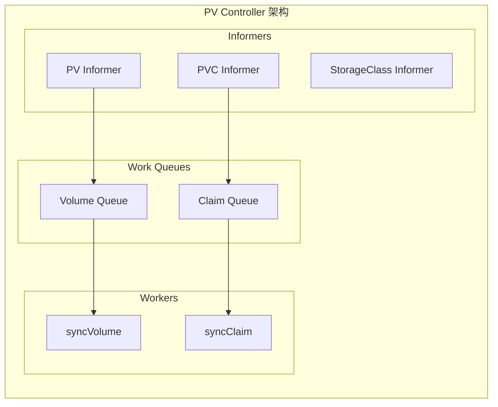
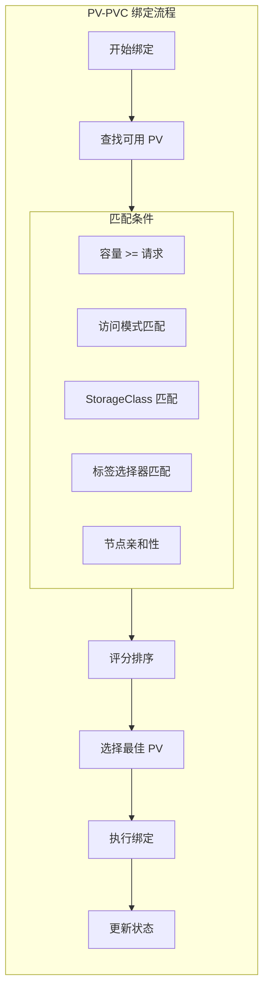
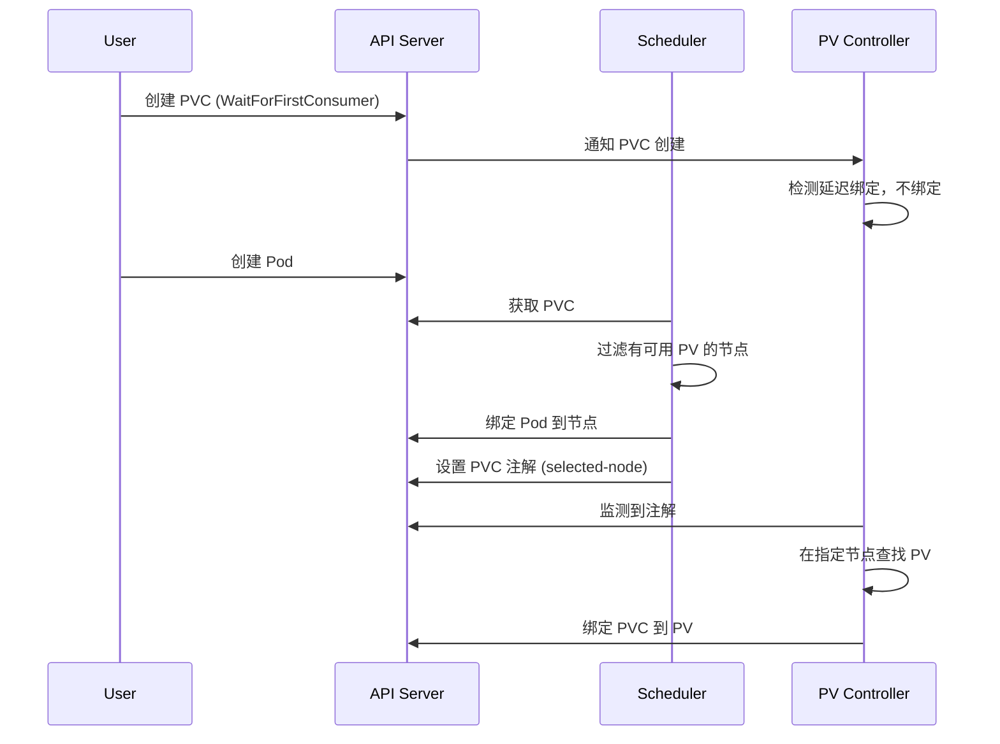

## 概述

PersistentVolume（PV）和 PersistentVolumeClaim（PVC）是 Kubernetes 持久化存储的核心抽象。PV 代表集群中的存储资源，PVC 代表用户对存储的请求。这种分离设计将存储的供应和消费解耦，使应用开发者无需关心底层存储细节。

## 资源定义

### PersistentVolume

```yaml
apiVersion: v1
kind: PersistentVolume
metadata:
  name: pv-example
  labels:
    type: local
spec:
  # 存储容量
  capacity:
    storage: 10Gi

  # 访问模式
  accessModes:
    - ReadWriteOnce

  # 卷模式
  volumeMode: Filesystem

  # 回收策略
  persistentVolumeReclaimPolicy: Retain

  # StorageClass 名称（空字符串表示静态供应）
  storageClassName: standard

  # 挂载选项
  mountOptions:
    - hard
    - nfsvers=4.1

  # 节点亲和性
  nodeAffinity:
    required:
      nodeSelectorTerms:
      - matchExpressions:
        - key: kubernetes.io/hostname
          operator: In
          values:
          - node-1

  # 存储后端配置（多选一）
  nfs:
    server: nfs-server.example.com
    path: /exports/data
```

### PersistentVolumeClaim

```yaml
apiVersion: v1
kind: PersistentVolumeClaim
metadata:
  name: pvc-example
  namespace: default
spec:
  # 访问模式
  accessModes:
    - ReadWriteOnce

  # 卷模式
  volumeMode: Filesystem

  # 存储请求
  resources:
    requests:
      storage: 5Gi

  # StorageClass 名称
  storageClassName: standard

  # 选择器（可选）
  selector:
    matchLabels:
      type: local
    matchExpressions:
      - key: environment
        operator: In
        values:
          - production

  # 数据源（用于克隆或恢复）
  dataSource:
    name: existing-pvc
    kind: PersistentVolumeClaim
```

## 数据结构

```go
// staging/src/k8s.io/api/core/v1/types.go

// PersistentVolumeSpec PV 规格
type PersistentVolumeSpec struct {
    // 容量
    Capacity ResourceList

    // 存储源（多选一）
    PersistentVolumeSource

    // 访问模式
    AccessModes []PersistentVolumeAccessMode

    // 绑定的 PVC 引用
    ClaimRef *ObjectReference

    // 回收策略
    PersistentVolumeReclaimPolicy PersistentVolumeReclaimPolicy

    // StorageClass 名称
    StorageClassName string

    // 挂载选项
    MountOptions []string

    // 卷模式
    VolumeMode *PersistentVolumeMode

    // 节点亲和性
    NodeAffinity *VolumeNodeAffinity
}

// PersistentVolumeStatus PV 状态
type PersistentVolumeStatus struct {
    // 阶段
    Phase PersistentVolumePhase
    // 消息
    Message string
    // 原因
    Reason string
    // 上次阶段转换时间
    LastPhaseTransitionTime *metav1.Time
}

// PersistentVolumePhase PV 阶段
type PersistentVolumePhase string

const (
    VolumePending   PersistentVolumePhase = "Pending"
    VolumeAvailable PersistentVolumePhase = "Available"
    VolumeBound     PersistentVolumePhase = "Bound"
    VolumeReleased  PersistentVolumePhase = "Released"
    VolumeFailed    PersistentVolumePhase = "Failed"
)

// PersistentVolumeClaimSpec PVC 规格
type PersistentVolumeClaimSpec struct {
    // 访问模式
    AccessModes []PersistentVolumeAccessMode

    // 选择器
    Selector *metav1.LabelSelector

    // 资源请求
    Resources ResourceRequirements

    // 绑定的 PV 名称
    VolumeName string

    // StorageClass 名称
    StorageClassName *string

    // 卷模式
    VolumeMode *PersistentVolumeMode

    // 数据源
    DataSource *TypedLocalObjectReference

    // 数据源引用
    DataSourceRef *TypedObjectReference
}

// PersistentVolumeClaimStatus PVC 状态
type PersistentVolumeClaimStatus struct {
    // 阶段
    Phase PersistentVolumeClaimPhase
    // 访问模式
    AccessModes []PersistentVolumeAccessMode
    // 实际容量
    Capacity ResourceList
    // 条件
    Conditions []PersistentVolumeClaimCondition
    // 已分配资源
    AllocatedResources ResourceList
    // 扩容状态
    ResizeStatus *PersistentVolumeClaimResizeStatus
}
```

## PV Controller



### 控制器结构

```go
// pkg/controller/volume/persistentvolume/pv_controller.go

// PersistentVolumeController 控制器
type PersistentVolumeController struct {
    // 客户端
    kubeClient clientset.Interface

    // Informers
    volumeLister       corelisters.PersistentVolumeLister
    volumeListerSynced cache.InformerSynced
    claimLister        corelisters.PersistentVolumeClaimLister
    claimListerSynced  cache.InformerSynced
    classLister        storagelisters.StorageClassLister
    classListerSynced  cache.InformerSynced

    // 工作队列
    volumeQueue workqueue.RateLimitingInterface
    claimQueue  workqueue.RateLimitingInterface

    // 卷插件管理器
    volumePluginMgr *volume.VolumePluginMgr

    // 云提供商
    cloud cloudprovider.Interface

    // 事件记录器
    eventRecorder record.EventRecorder

    // 运行参数
    claimToClaimKey          func(claim *v1.PersistentVolumeClaim) string
    volumeToClaimKey         func(volume *v1.PersistentVolume) string
    createProvisionedPVRetryCount int
    createProvisionedPVInterval   time.Duration
}

// Run 启动控制器
func (ctrl *PersistentVolumeController) Run(ctx context.Context) {
    defer ctrl.volumeQueue.ShutDown()
    defer ctrl.claimQueue.ShutDown()

    klog.InfoS("Starting PersistentVolume controller")

    // 等待缓存同步
    if !cache.WaitForNamedCacheSync("PersistentVolume", ctx.Done(),
        ctrl.volumeListerSynced, ctrl.claimListerSynced, ctrl.classListerSynced) {
        return
    }

    // 启动 workers
    for i := 0; i < workers; i++ {
        go wait.UntilWithContext(ctx, ctrl.volumeWorker, time.Second)
        go wait.UntilWithContext(ctx, ctrl.claimWorker, time.Second)
    }

    <-ctx.Done()
}
```

### 卷同步逻辑

```go
// pkg/controller/volume/persistentvolume/pv_controller.go

// syncVolume 同步 PV
func (ctrl *PersistentVolumeController) syncVolume(ctx context.Context, volume *v1.PersistentVolume) error {
    klog.V(4).InfoS("Synchronizing PersistentVolume", "volume", volume.Name)

    // 检查是否绑定到 PVC
    if volume.Spec.ClaimRef == nil {
        // 未绑定，设置为 Available
        return ctrl.updateVolumePhase(volume, v1.VolumeAvailable, "")
    }

    // 获取绑定的 PVC
    claim, err := ctrl.claimLister.PersistentVolumeClaims(volume.Spec.ClaimRef.Namespace).
        Get(volume.Spec.ClaimRef.Name)

    if err != nil {
        if apierrors.IsNotFound(err) {
            // PVC 已删除
            if volume.Status.Phase != v1.VolumeReleased {
                return ctrl.updateVolumePhase(volume, v1.VolumeReleased, "")
            }
            return nil
        }
        return err
    }

    // 验证 PVC UID 匹配
    if claim.UID != volume.Spec.ClaimRef.UID {
        return ctrl.updateVolumePhase(volume, v1.VolumeReleased, "")
    }

    // PVC 存在且匹配，设置为 Bound
    if volume.Status.Phase != v1.VolumeBound {
        return ctrl.updateVolumePhase(volume, v1.VolumeBound, "")
    }

    return nil
}

// syncClaim 同步 PVC
func (ctrl *PersistentVolumeController) syncClaim(ctx context.Context, claim *v1.PersistentVolumeClaim) error {
    klog.V(4).InfoS("Synchronizing PersistentVolumeClaim",
        "claim", klog.KObj(claim))

    // 检查是否已绑定
    if claim.Spec.VolumeName != "" {
        return ctrl.syncBoundClaim(claim)
    }

    // 未绑定，尝试绑定
    return ctrl.syncUnboundClaim(claim)
}

// syncUnboundClaim 同步未绑定的 PVC
func (ctrl *PersistentVolumeController) syncUnboundClaim(claim *v1.PersistentVolumeClaim) error {
    // 查找匹配的 PV
    volume, err := ctrl.findBestMatchForClaim(claim)
    if err != nil {
        return err
    }

    if volume == nil {
        // 没有匹配的 PV
        if ctrl.shouldProvision(claim) {
            // 触发动态供应
            return ctrl.provisionClaim(claim)
        }
        // 等待 PV
        return nil
    }

    // 找到匹配的 PV，执行绑定
    return ctrl.bind(volume, claim)
}

// syncBoundClaim 同步已绑定的 PVC
func (ctrl *PersistentVolumeController) syncBoundClaim(claim *v1.PersistentVolumeClaim) error {
    // 获取绑定的 PV
    volume, err := ctrl.volumeLister.Get(claim.Spec.VolumeName)
    if err != nil {
        if apierrors.IsNotFound(err) {
            // PV 不存在，等待或标记失败
            return ctrl.updateClaimStatus(claim, v1.ClaimLost, "")
        }
        return err
    }

    // 验证 PV 仍然绑定到此 PVC
    if volume.Spec.ClaimRef == nil ||
        volume.Spec.ClaimRef.UID != claim.UID {
        return ctrl.updateClaimStatus(claim, v1.ClaimLost, "")
    }

    // 绑定有效
    return ctrl.updateClaimStatus(claim, v1.ClaimBound, "")
}
```

## 绑定算法



### 绑定实现

```go
// pkg/controller/volume/persistentvolume/pv_controller.go

// findBestMatchForClaim 为 PVC 查找最佳匹配的 PV
func (ctrl *PersistentVolumeController) findBestMatchForClaim(
    claim *v1.PersistentVolumeClaim,
) (*v1.PersistentVolume, error) {

    // 获取所有可用 PV
    allVolumes, err := ctrl.volumeLister.List(labels.Everything())
    if err != nil {
        return nil, err
    }

    var bestMatch *v1.PersistentVolume
    bestScore := int64(-1)

    for _, volume := range allVolumes {
        // 检查 PV 是否可用
        if volume.Status.Phase != v1.VolumeAvailable {
            continue
        }

        // 检查是否已绑定
        if volume.Spec.ClaimRef != nil {
            continue
        }

        // 检查匹配条件
        if !ctrl.checkVolumeMatchesClaim(volume, claim) {
            continue
        }

        // 计算匹配分数
        score := ctrl.calculateMatchScore(volume, claim)

        if score > bestScore {
            bestScore = score
            bestMatch = volume
        }
    }

    return bestMatch, nil
}

// checkVolumeMatchesClaim 检查 PV 是否匹配 PVC
func (ctrl *PersistentVolumeController) checkVolumeMatchesClaim(
    volume *v1.PersistentVolume,
    claim *v1.PersistentVolumeClaim,
) bool {

    // 1. 检查容量
    requestedSize := claim.Spec.Resources.Requests[v1.ResourceStorage]
    volumeCapacity := volume.Spec.Capacity[v1.ResourceStorage]
    if volumeCapacity.Cmp(requestedSize) < 0 {
        return false
    }

    // 2. 检查访问模式
    if !containsAllAccessModes(volume.Spec.AccessModes, claim.Spec.AccessModes) {
        return false
    }

    // 3. 检查 StorageClass
    if !storageClassMatches(volume, claim) {
        return false
    }

    // 4. 检查卷模式
    if !volumeModeMatches(volume, claim) {
        return false
    }

    // 5. 检查标签选择器
    if claim.Spec.Selector != nil {
        selector, err := metav1.LabelSelectorAsSelector(claim.Spec.Selector)
        if err != nil || !selector.Matches(labels.Set(volume.Labels)) {
            return false
        }
    }

    return true
}

// calculateMatchScore 计算匹配分数
func (ctrl *PersistentVolumeController) calculateMatchScore(
    volume *v1.PersistentVolume,
    claim *v1.PersistentVolumeClaim,
) int64 {

    requestedSize := claim.Spec.Resources.Requests[v1.ResourceStorage]
    volumeCapacity := volume.Spec.Capacity[v1.ResourceStorage]

    // 分数 = 容量差值的负数（越接近请求大小分数越高）
    diff := volumeCapacity.Value() - requestedSize.Value()

    // 返回负差值使较小容量的 PV 得分更高
    return -diff
}

// bind 执行绑定
func (ctrl *PersistentVolumeController) bind(
    volume *v1.PersistentVolume,
    claim *v1.PersistentVolumeClaim,
) error {

    klog.V(4).InfoS("Binding PV to PVC",
        "volume", volume.Name,
        "claim", klog.KObj(claim))

    // 更新 PV 的 ClaimRef
    volumeClone := volume.DeepCopy()
    volumeClone.Spec.ClaimRef = &v1.ObjectReference{
        Kind:       "PersistentVolumeClaim",
        Namespace:  claim.Namespace,
        Name:       claim.Name,
        UID:        claim.UID,
        APIVersion: "v1",
    }

    // 保存 PV
    if _, err := ctrl.kubeClient.CoreV1().PersistentVolumes().
        Update(context.TODO(), volumeClone, metav1.UpdateOptions{}); err != nil {
        return err
    }

    // 更新 PVC 的 VolumeName
    claimClone := claim.DeepCopy()
    claimClone.Spec.VolumeName = volume.Name

    // 保存 PVC
    if _, err := ctrl.kubeClient.CoreV1().PersistentVolumeClaims(claim.Namespace).
        Update(context.TODO(), claimClone, metav1.UpdateOptions{}); err != nil {
        return err
    }

    // 更新状态
    ctrl.updateVolumePhase(volumeClone, v1.VolumeBound, "")
    ctrl.updateClaimStatus(claimClone, v1.ClaimBound, "")

    ctrl.eventRecorder.Event(claim, v1.EventTypeNormal, "Bound",
        fmt.Sprintf("Bound to PV %s", volume.Name))

    return nil
}
```

## 回收处理

```go
// pkg/controller/volume/persistentvolume/pv_controller.go

// reclaimVolume 回收 PV
func (ctrl *PersistentVolumeController) reclaimVolume(volume *v1.PersistentVolume) error {
    switch volume.Spec.PersistentVolumeReclaimPolicy {
    case v1.PersistentVolumeReclaimRetain:
        // 保留，什么都不做
        klog.V(4).InfoS("Volume reclaim policy is Retain, keeping volume",
            "volume", volume.Name)
        return nil

    case v1.PersistentVolumeReclaimDelete:
        // 删除 PV 和后端存储
        return ctrl.deleteVolume(volume)

    case v1.PersistentVolumeReclaimRecycle:
        // 已弃用
        return ctrl.recycleVolume(volume)

    default:
        return fmt.Errorf("unknown reclaim policy %q", volume.Spec.PersistentVolumeReclaimPolicy)
    }
}

// deleteVolume 删除 PV
func (ctrl *PersistentVolumeController) deleteVolume(volume *v1.PersistentVolume) error {
    klog.V(4).InfoS("Deleting volume", "volume", volume.Name)

    // 调用插件删除后端存储
    plugin, err := ctrl.volumePluginMgr.FindDeletablePluginBySpec(volume)
    if err != nil {
        return err
    }

    deleter, err := plugin.NewDeleter(volume)
    if err != nil {
        return err
    }

    if err := deleter.Delete(); err != nil {
        ctrl.updateVolumePhase(volume, v1.VolumeFailed, err.Error())
        return err
    }

    // 删除 PV 对象
    return ctrl.kubeClient.CoreV1().PersistentVolumes().
        Delete(context.TODO(), volume.Name, metav1.DeleteOptions{})
}
```

## 延迟绑定



### 延迟绑定实现

```go
// pkg/controller/volume/persistentvolume/pv_controller.go

// isDelayBindingMode 检查是否为延迟绑定模式
func (ctrl *PersistentVolumeController) isDelayBindingMode(claim *v1.PersistentVolumeClaim) bool {
    if claim.Spec.StorageClassName == nil {
        return false
    }

    class, err := ctrl.classLister.Get(*claim.Spec.StorageClassName)
    if err != nil {
        return false
    }

    return class.VolumeBindingMode != nil &&
        *class.VolumeBindingMode == storagev1.VolumeBindingWaitForFirstConsumer
}

// getSelectedNode 获取选中的节点
func (ctrl *PersistentVolumeController) getSelectedNode(claim *v1.PersistentVolumeClaim) string {
    if claim.Annotations == nil {
        return ""
    }
    return claim.Annotations[annSelectedNode]
}

// syncDelayBindingClaim 同步延迟绑定的 PVC
func (ctrl *PersistentVolumeController) syncDelayBindingClaim(claim *v1.PersistentVolumeClaim) error {
    // 检查是否有选中的节点
    selectedNode := ctrl.getSelectedNode(claim)
    if selectedNode == "" {
        // 等待调度器选择节点
        return nil
    }

    // 查找匹配节点亲和性的 PV
    volume, err := ctrl.findMatchingVolumeForNode(claim, selectedNode)
    if err != nil {
        return err
    }

    if volume == nil {
        // 触发动态供应（如果支持）
        if ctrl.shouldProvision(claim) {
            return ctrl.provisionClaimForNode(claim, selectedNode)
        }
        return nil
    }

    // 绑定
    return ctrl.bind(volume, claim)
}
```

## 监控与调试

### 关键事件

```go
// PV Controller 事件
const (
    EventVolumeProvision       = "ProvisioningSucceeded"
    EventVolumeProvisionFailed = "ProvisioningFailed"
    EventVolumeBind            = "Bound"
    EventVolumeDelete          = "VolumeDeleted"
    EventVolumeReclaim         = "VolumeReclaimed"
)

// PVC Controller 事件
const (
    EventClaimBound       = "Bound"
    EventClaimLost        = "ClaimLost"
    EventClaimPending     = "ClaimPending"
    EventClaimProvisioning = "Provisioning"
)
```

### 调试命令

```bash
# 查看 PV 状态
kubectl get pv -o wide

# 查看 PVC 状态
kubectl get pvc -A -o wide

# 查看绑定关系
kubectl get pv,pvc -o custom-columns='NAME:.metadata.name,STATUS:.status.phase,CLAIM:.spec.claimRef.name,VOLUME:.spec.volumeName'

# 查看 PV Controller 日志
kubectl logs -n kube-system kube-controller-manager | grep -i "persistentvolume"

# 查看事件
kubectl get events --field-selector involvedObject.kind=PersistentVolumeClaim
```

## 总结

PV/PVC 机制是 Kubernetes 持久化存储的核心：

1. **解耦设计**：PV 代表存储资源，PVC 代表使用请求
2. **绑定算法**：基于容量、访问模式、StorageClass 等条件匹配
3. **回收策略**：Retain、Delete 支持不同数据生命周期需求
4. **延迟绑定**：WaitForFirstConsumer 支持拓扑感知调度
5. **状态管理**：PV Controller 维护绑定关系和生命周期

理解 PV/PVC 机制对于设计和运维有状态应用至关重要。
