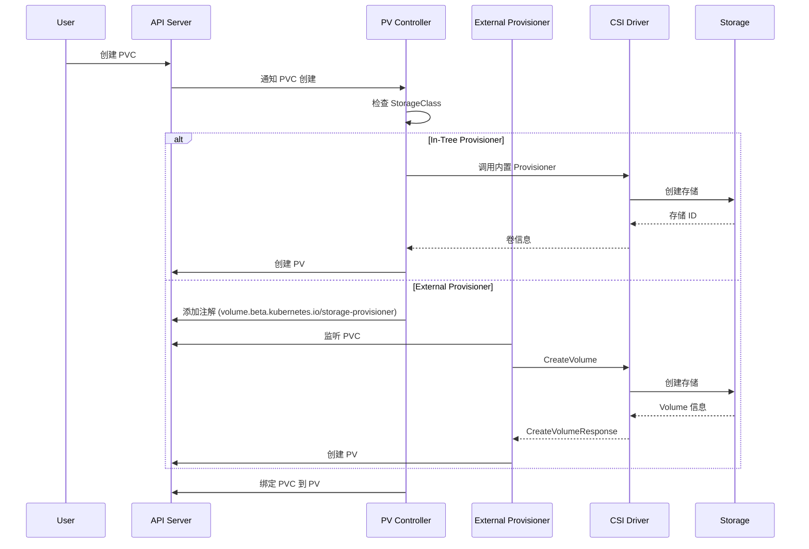
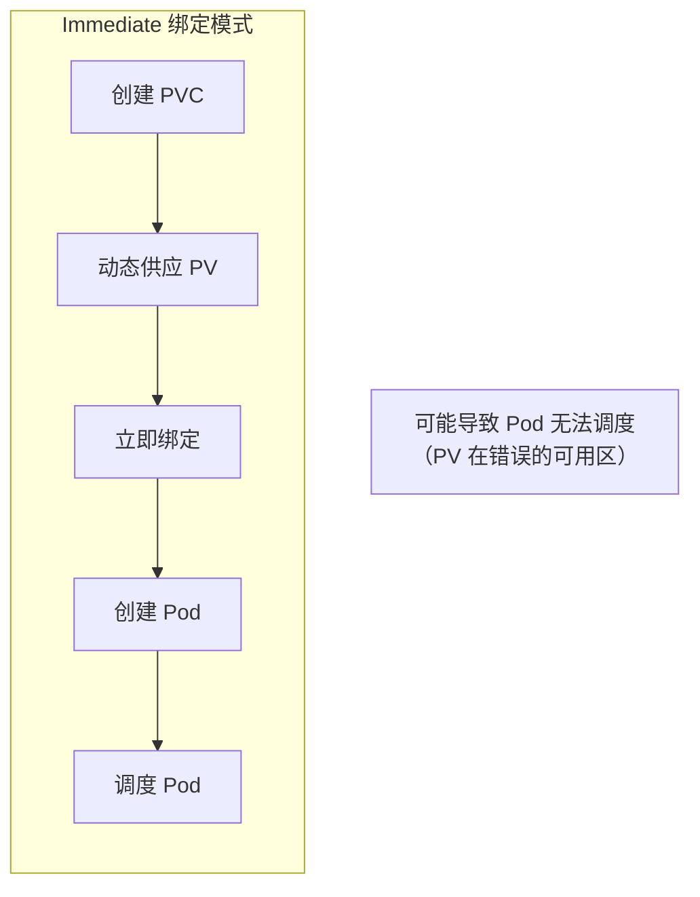
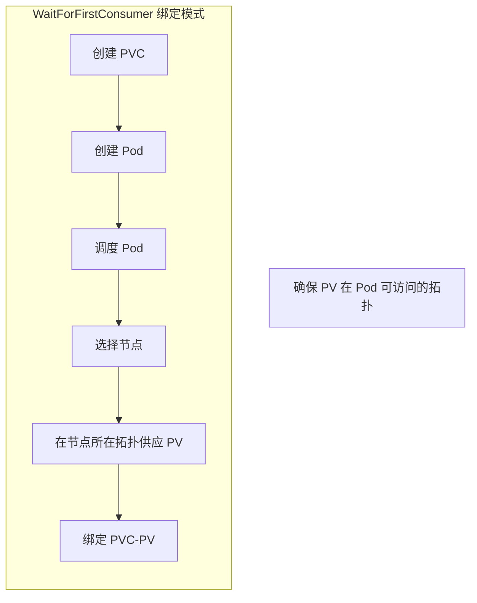

## 概述

StorageClass 是 Kubernetes 实现存储动态供应的核心资源。它定义了存储的类型、供应者（Provisioner）和配置参数，允许用户通过 PVC 自动创建匹配的 PV，无需管理员预先创建存储资源。

## StorageClass 定义

```yaml
apiVersion: storage.k8s.io/v1
kind: StorageClass
metadata:
  name: fast-ssd
  annotations:
    # 设置为默认 StorageClass
    storageclass.kubernetes.io/is-default-class: "true"

# Provisioner 名称
provisioner: ebs.csi.aws.com

# 参数传递给 Provisioner
parameters:
  type: gp3
  iops: "3000"
  throughput: "125"
  encrypted: "true"

# 回收策略
reclaimPolicy: Delete

# 允许卷扩展
allowVolumeExpansion: true

# 挂载选项
mountOptions:
  - debug

# 卷绑定模式
volumeBindingMode: WaitForFirstConsumer

# 允许的拓扑
allowedTopologies:
- matchLabelExpressions:
  - key: topology.kubernetes.io/zone
    values:
    - us-east-1a
    - us-east-1b
```

## 数据结构

```go
// staging/src/k8s.io/api/storage/v1/types.go

// StorageClass 存储类
type StorageClass struct {
    metav1.TypeMeta
    metav1.ObjectMeta

    // Provisioner 供应者名称
    Provisioner string

    // Parameters 供应参数
    Parameters map[string]string

    // ReclaimPolicy 回收策略
    ReclaimPolicy *v1.PersistentVolumeReclaimPolicy

    // MountOptions 挂载选项
    MountOptions []string

    // AllowVolumeExpansion 是否允许扩展
    AllowVolumeExpansion *bool

    // VolumeBindingMode 绑定模式
    VolumeBindingMode *VolumeBindingMode

    // AllowedTopologies 允许的拓扑
    AllowedTopologies []v1.TopologySelectorTerm
}

// VolumeBindingMode 卷绑定模式
type VolumeBindingMode string

const (
    // VolumeBindingImmediate 立即绑定
    VolumeBindingImmediate VolumeBindingMode = "Immediate"

    // VolumeBindingWaitForFirstConsumer 等待首次消费者
    VolumeBindingWaitForFirstConsumer VolumeBindingMode = "WaitForFirstConsumer"
)
```

## 动态供应流程



## 默认 StorageClass

### 设置默认 StorageClass

```yaml
apiVersion: storage.k8s.io/v1
kind: StorageClass
metadata:
  name: standard
  annotations:
    # 设置为默认
    storageclass.kubernetes.io/is-default-class: "true"
provisioner: kubernetes.io/gce-pd
parameters:
  type: pd-standard
```

### 默认 StorageClass 处理

```go
// pkg/controller/volume/persistentvolume/pv_controller.go

// getDefaultStorageClass 获取默认 StorageClass
func (ctrl *PersistentVolumeController) getDefaultStorageClass() (*storagev1.StorageClass, error) {
    classes, err := ctrl.classLister.List(labels.Everything())
    if err != nil {
        return nil, err
    }

    var defaultClass *storagev1.StorageClass
    for _, class := range classes {
        if isDefaultStorageClass(class) {
            if defaultClass != nil {
                // 多个默认 StorageClass，返回错误
                return nil, fmt.Errorf("multiple default StorageClasses found")
            }
            defaultClass = class
        }
    }

    return defaultClass, nil
}

// isDefaultStorageClass 检查是否为默认 StorageClass
func isDefaultStorageClass(class *storagev1.StorageClass) bool {
    if class.Annotations == nil {
        return false
    }

    // 检查注解
    if val, ok := class.Annotations[IsDefaultStorageClassAnnotation]; ok {
        return val == "true"
    }

    // 检查 beta 注解（兼容性）
    if val, ok := class.Annotations[BetaIsDefaultStorageClassAnnotation]; ok {
        return val == "true"
    }

    return false
}

// assignDefaultStorageClass 为没有 StorageClass 的 PVC 分配默认值
func (ctrl *PersistentVolumeController) assignDefaultStorageClass(claim *v1.PersistentVolumeClaim) error {
    if claim.Spec.StorageClassName != nil {
        // 已指定 StorageClass
        return nil
    }

    // 获取默认 StorageClass
    defaultClass, err := ctrl.getDefaultStorageClass()
    if err != nil || defaultClass == nil {
        return err
    }

    // 更新 PVC
    claimClone := claim.DeepCopy()
    claimClone.Spec.StorageClassName = &defaultClass.Name

    _, err = ctrl.kubeClient.CoreV1().PersistentVolumeClaims(claim.Namespace).
        Update(context.TODO(), claimClone, metav1.UpdateOptions{})

    return err
}
```

## External Provisioner

### Provisioner 接口

```go
// sigs.k8s.io/sig-storage-lib-external-provisioner/v7/controller/controller.go

// Provisioner 供应者接口
type Provisioner interface {
    // Provision 创建 PV
    Provision(ctx context.Context, options ProvisionOptions) (*v1.PersistentVolume, ProvisioningState, error)

    // Delete 删除 PV
    Delete(ctx context.Context, volume *v1.PersistentVolume) error
}

// ProvisionOptions 供应选项
type ProvisionOptions struct {
    // StorageClass
    StorageClass *storagev1.StorageClass

    // PVC
    PVC *v1.PersistentVolumeClaim

    // PV 名称
    PVName string

    // 选中的节点（延迟绑定）
    SelectedNode *v1.Node
}
```

### CSI External Provisioner

```go
// kubernetes-csi/external-provisioner/pkg/controller/controller.go

// csiProvisioner CSI Provisioner 实现
type csiProvisioner struct {
    // CSI 客户端
    client csi.Client

    // 驱动名称
    driverName string

    // Kubernetes 客户端
    kubeClient kubernetes.Interface

    // 拓扑支持
    topologyEnabled bool
}

// Provision 创建卷
func (p *csiProvisioner) Provision(ctx context.Context, options controller.ProvisionOptions) (*v1.PersistentVolume, controller.ProvisioningState, error) {
    // 获取容量
    capacity := options.PVC.Spec.Resources.Requests[v1.ResourceStorage]

    // 获取参数
    parameters := options.StorageClass.Parameters

    // 获取访问模式
    accessMode := options.PVC.Spec.AccessModes[0]
    volumeCapabilities := p.getVolumeCapabilities(accessMode, options.PVC.Spec.VolumeMode)

    // 处理拓扑
    var accessibility *csi.TopologyRequirement
    if p.topologyEnabled && options.SelectedNode != nil {
        accessibility = p.buildTopologyRequirement(options.SelectedNode)
    }

    // 调用 CSI CreateVolume
    req := &csi.CreateVolumeRequest{
        Name:               options.PVName,
        CapacityRange:      &csi.CapacityRange{RequiredBytes: capacity.Value()},
        VolumeCapabilities: volumeCapabilities,
        Parameters:         parameters,
        AccessibilityRequirements: accessibility,
    }

    resp, err := p.client.CreateVolume(ctx, req)
    if err != nil {
        return nil, controller.ProvisioningFinished, err
    }

    // 构建 PV
    pv := &v1.PersistentVolume{
        ObjectMeta: metav1.ObjectMeta{
            Name: options.PVName,
        },
        Spec: v1.PersistentVolumeSpec{
            Capacity: v1.ResourceList{
                v1.ResourceStorage: *resource.NewQuantity(resp.Volume.CapacityBytes, resource.BinarySI),
            },
            AccessModes:                   options.PVC.Spec.AccessModes,
            PersistentVolumeReclaimPolicy: *options.StorageClass.ReclaimPolicy,
            StorageClassName:              options.StorageClass.Name,
            VolumeMode:                    options.PVC.Spec.VolumeMode,
            PersistentVolumeSource: v1.PersistentVolumeSource{
                CSI: &v1.CSIPersistentVolumeSource{
                    Driver:       p.driverName,
                    VolumeHandle: resp.Volume.VolumeId,
                    VolumeAttributes: resp.Volume.VolumeContext,
                },
            },
        },
    }

    // 设置节点亲和性
    if resp.Volume.AccessibleTopology != nil {
        pv.Spec.NodeAffinity = p.buildNodeAffinity(resp.Volume.AccessibleTopology)
    }

    return pv, controller.ProvisioningFinished, nil
}

// Delete 删除卷
func (p *csiProvisioner) Delete(ctx context.Context, volume *v1.PersistentVolume) error {
    volumeId := volume.Spec.CSI.VolumeHandle

    req := &csi.DeleteVolumeRequest{
        VolumeId: volumeId,
    }

    _, err := p.client.DeleteVolume(ctx, req)
    return err
}
```

## 卷绑定模式

### Immediate 模式



### WaitForFirstConsumer 模式



### 实现

```go
// pkg/scheduler/framework/plugins/volumebinding/binder.go

// VolumeBinder 卷绑定器
type VolumeBinder struct {
    kubeClient  clientset.Interface
    pvcLister   corelisters.PersistentVolumeClaimLister
    pvLister    corelisters.PersistentVolumeLister
    classLister storagelisters.StorageClassLister
}

// FindPodVolumes 为 Pod 查找卷
func (b *VolumeBinder) FindPodVolumes(
    pod *v1.Pod,
    node *v1.Node,
) (*PodVolumes, []string, error) {

    podVolumes := &PodVolumes{
        StaticBindings:   []*BindingInfo{},
        DynamicProvisions: []*v1.PersistentVolumeClaim{},
    }

    for _, pvc := range getPVCsForPod(pod) {
        // 检查 PVC 是否已绑定
        if pvc.Spec.VolumeName != "" {
            continue
        }

        // 获取 StorageClass
        class, err := b.classLister.Get(*pvc.Spec.StorageClassName)
        if err != nil {
            return nil, nil, err
        }

        // 检查绑定模式
        if class.VolumeBindingMode != nil &&
            *class.VolumeBindingMode == storagev1.VolumeBindingWaitForFirstConsumer {

            // 延迟绑定：检查节点拓扑
            if !b.nodeMatchesTopology(node, class.AllowedTopologies) {
                return nil, []string{"node doesn't match topology"}, nil
            }

            // 标记为需要动态供应
            podVolumes.DynamicProvisions = append(podVolumes.DynamicProvisions, pvc)
        }
    }

    return podVolumes, nil, nil
}

// AssumePodVolumes 假设 Pod 卷绑定
func (b *VolumeBinder) AssumePodVolumes(
    pod *v1.Pod,
    nodeName string,
    podVolumes *PodVolumes,
) error {

    // 为延迟绑定的 PVC 添加节点注解
    for _, pvc := range podVolumes.DynamicProvisions {
        claimClone := pvc.DeepCopy()
        if claimClone.Annotations == nil {
            claimClone.Annotations = make(map[string]string)
        }
        claimClone.Annotations[annSelectedNode] = nodeName

        _, err := b.kubeClient.CoreV1().PersistentVolumeClaims(pvc.Namespace).
            Update(context.TODO(), claimClone, metav1.UpdateOptions{})
        if err != nil {
            return err
        }
    }

    return nil
}
```

## 拓扑感知供应

### AllowedTopologies

```yaml
apiVersion: storage.k8s.io/v1
kind: StorageClass
metadata:
  name: regional-ssd
provisioner: pd.csi.storage.gke.io
parameters:
  type: pd-ssd
  replication-type: regional-pd
volumeBindingMode: WaitForFirstConsumer
allowedTopologies:
- matchLabelExpressions:
  - key: topology.gke.io/zone
    values:
    - us-central1-a
    - us-central1-b
```

### 拓扑处理

```go
// pkg/controller/volume/persistentvolume/pv_controller.go

// buildTopologyFromNode 从节点构建拓扑
func (ctrl *PersistentVolumeController) buildTopologyFromNode(
    node *v1.Node,
    class *storagev1.StorageClass,
) *v1.VolumeNodeAffinity {

    // 获取节点拓扑标签
    topologyLabels := map[string]string{}
    for key, value := range node.Labels {
        if isTopologyLabel(key) {
            topologyLabels[key] = value
        }
    }

    // 过滤允许的拓扑
    if class.AllowedTopologies != nil {
        topologyLabels = filterTopologyLabels(topologyLabels, class.AllowedTopologies)
    }

    // 构建节点亲和性
    return &v1.VolumeNodeAffinity{
        Required: &v1.NodeSelector{
            NodeSelectorTerms: []v1.NodeSelectorTerm{{
                MatchExpressions: buildMatchExpressions(topologyLabels),
            }},
        },
    }
}

// isTopologyLabel 检查是否为拓扑标签
func isTopologyLabel(key string) bool {
    return key == v1.LabelTopologyZone ||
        key == v1.LabelTopologyRegion ||
        strings.HasPrefix(key, "topology.")
}
```

## 常见 StorageClass 示例

### AWS EBS

```yaml
apiVersion: storage.k8s.io/v1
kind: StorageClass
metadata:
  name: aws-ebs-gp3
provisioner: ebs.csi.aws.com
parameters:
  type: gp3
  iops: "3000"
  throughput: "125"
  encrypted: "true"
  kmsKeyId: "arn:aws:kms:us-east-1:xxx:key/xxx"
reclaimPolicy: Delete
allowVolumeExpansion: true
volumeBindingMode: WaitForFirstConsumer
```

### GCE PD

```yaml
apiVersion: storage.k8s.io/v1
kind: StorageClass
metadata:
  name: gce-pd-ssd
provisioner: pd.csi.storage.gke.io
parameters:
  type: pd-ssd
  disk-encryption-kms-key: "projects/xxx/locations/xxx/keyRings/xxx/cryptoKeys/xxx"
reclaimPolicy: Delete
allowVolumeExpansion: true
volumeBindingMode: WaitForFirstConsumer
```

### Ceph RBD

```yaml
apiVersion: storage.k8s.io/v1
kind: StorageClass
metadata:
  name: ceph-rbd
provisioner: rbd.csi.ceph.com
parameters:
  clusterID: xxx
  pool: kubernetes
  imageFeatures: "layering"
  csi.storage.k8s.io/provisioner-secret-name: csi-rbd-secret
  csi.storage.k8s.io/provisioner-secret-namespace: ceph-system
  csi.storage.k8s.io/controller-expand-secret-name: csi-rbd-secret
  csi.storage.k8s.io/controller-expand-secret-namespace: ceph-system
  csi.storage.k8s.io/node-stage-secret-name: csi-rbd-secret
  csi.storage.k8s.io/node-stage-secret-namespace: ceph-system
reclaimPolicy: Delete
allowVolumeExpansion: true
volumeBindingMode: Immediate
```

## 监控与调试

### 查看 StorageClass

```bash
# 列出所有 StorageClass
kubectl get sc

# 查看详情
kubectl describe sc <name>

# 查看默认 StorageClass
kubectl get sc -o jsonpath='{.items[?(@.metadata.annotations.storageclass\.kubernetes\.io/is-default-class=="true")].metadata.name}'
```

### 常见问题

| 问题 | 原因 | 解决方案 |
|------|------|----------|
| PVC Pending | Provisioner 未运行 | 检查 CSI 驱动 Pod |
| 拓扑不匹配 | 节点不在允许的拓扑 | 检查 allowedTopologies |
| 参数错误 | StorageClass 参数无效 | 检查 CSI 驱动文档 |
| 容量不足 | 存储后端空间不足 | 扩展后端存储 |

## 总结

StorageClass 是动态存储供应的核心：

1. **动态供应**：自动创建匹配请求的存储
2. **参数化配置**：通过 parameters 传递后端特定配置
3. **绑定模式**：支持 Immediate 和 WaitForFirstConsumer
4. **拓扑感知**：确保存储在正确的可用区创建
5. **回收策略**：控制 PV 的生命周期

合理配置 StorageClass 可以大幅简化存储管理并提高资源利用率。
