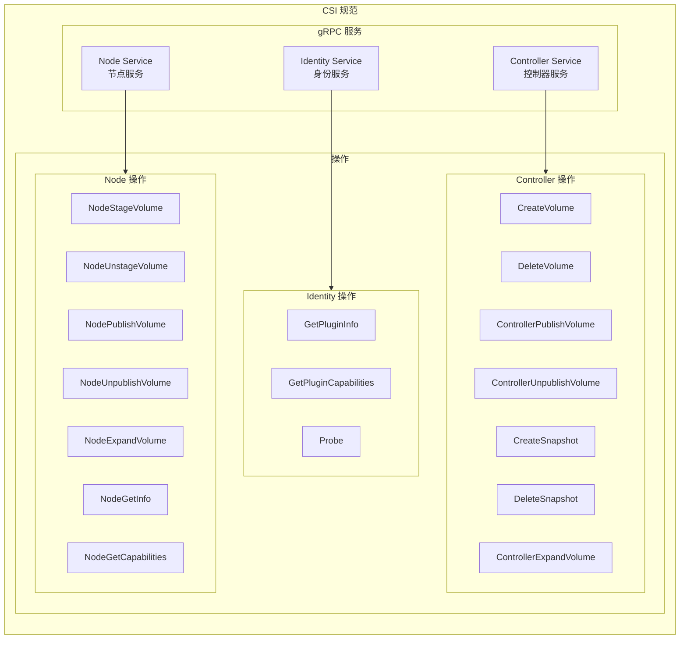
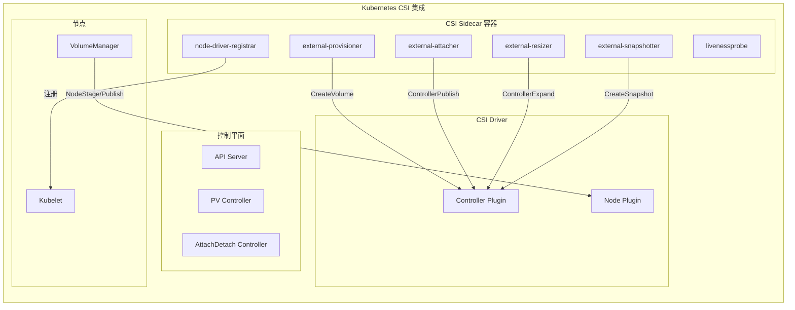
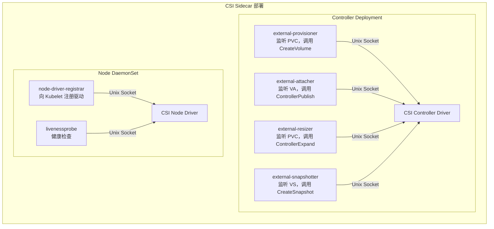

## 概述

Container Storage Interface（CSI）是 Kubernetes 与存储系统之间的标准化接口。CSI 将存储插件从 Kubernetes 核心代码中解耦，允许存储厂商独立开发、部署和更新其驱动程序，无需修改 Kubernetes 本身。

## CSI 规范



## Kubernetes CSI 集成



## CSI 资源对象

### CSIDriver

```yaml
apiVersion: storage.k8s.io/v1
kind: CSIDriver
metadata:
  name: ebs.csi.aws.com
spec:
  # 是否需要 Attach 操作
  attachRequired: true

  # 是否支持 Pod 信息
  podInfoOnMount: true

  # 支持的 FS Group 策略
  fsGroupPolicy: File

  # 是否支持卷生命周期
  volumeLifecycleModes:
  - Persistent
  - Ephemeral

  # 存储容量追踪
  storageCapacity: true

  # SELinux 挂载支持
  seLinuxMount: false

  # Token 请求
  tokenRequests:
  - audience: "sts.amazonaws.com"
    expirationSeconds: 3600
```

### CSINode

```yaml
apiVersion: storage.k8s.io/v1
kind: CSINode
metadata:
  name: node-1
spec:
  drivers:
  - name: ebs.csi.aws.com
    nodeID: i-0123456789abcdef0
    topologyKeys:
    - topology.ebs.csi.aws.com/zone
    allocatable:
      count: 25  # 最大卷数量
```

### VolumeAttachment

```yaml
apiVersion: storage.k8s.io/v1
kind: VolumeAttachment
metadata:
  name: csi-xxx
spec:
  attacher: ebs.csi.aws.com
  nodeName: node-1
  source:
    persistentVolumeName: pv-xxx
status:
  attached: true
  attachmentMetadata:
    devicePath: /dev/xvdf
```

## Identity Service

```go
// CSI Identity Service 接口

// GetPluginInfo 获取插件信息
message GetPluginInfoRequest {}

message GetPluginInfoResponse {
    string name = 1;      // 插件名称
    string vendor_version = 2;  // 版本
    map<string, string> manifest = 3;  // 元数据
}

// GetPluginCapabilities 获取插件能力
message GetPluginCapabilitiesRequest {}

message GetPluginCapabilitiesResponse {
    repeated PluginCapability capabilities = 1;
}

message PluginCapability {
    oneof type {
        Service service = 1;
        VolumeExpansion volume_expansion = 2;
    }

    message Service {
        enum Type {
            UNKNOWN = 0;
            CONTROLLER_SERVICE = 1;
            VOLUME_ACCESSIBILITY_CONSTRAINTS = 2;
            GROUP_CONTROLLER_SERVICE = 3;
        }
        Type type = 1;
    }
}

// Probe 健康检查
message ProbeRequest {}

message ProbeResponse {
    google.protobuf.BoolValue ready = 1;
}
```

### 实现示例

```go
// Identity Service 实现
type IdentityServer struct {
    name    string
    version string
}

func (s *IdentityServer) GetPluginInfo(
    ctx context.Context,
    req *csi.GetPluginInfoRequest,
) (*csi.GetPluginInfoResponse, error) {
    return &csi.GetPluginInfoResponse{
        Name:          s.name,
        VendorVersion: s.version,
    }, nil
}

func (s *IdentityServer) GetPluginCapabilities(
    ctx context.Context,
    req *csi.GetPluginCapabilitiesRequest,
) (*csi.GetPluginCapabilitiesResponse, error) {
    return &csi.GetPluginCapabilitiesResponse{
        Capabilities: []*csi.PluginCapability{
            {
                Type: &csi.PluginCapability_Service_{
                    Service: &csi.PluginCapability_Service{
                        Type: csi.PluginCapability_Service_CONTROLLER_SERVICE,
                    },
                },
            },
            {
                Type: &csi.PluginCapability_VolumeExpansion_{
                    VolumeExpansion: &csi.PluginCapability_VolumeExpansion{
                        Type: csi.PluginCapability_VolumeExpansion_ONLINE,
                    },
                },
            },
        },
    }, nil
}

func (s *IdentityServer) Probe(
    ctx context.Context,
    req *csi.ProbeRequest,
) (*csi.ProbeResponse, error) {
    return &csi.ProbeResponse{Ready: &wrapperspb.BoolValue{Value: true}}, nil
}
```

## Controller Service

```go
// CSI Controller Service 接口

// CreateVolume 创建卷
message CreateVolumeRequest {
    string name = 1;
    CapacityRange capacity_range = 2;
    repeated VolumeCapability volume_capabilities = 3;
    map<string, string> parameters = 4;
    map<string, string> secrets = 5;
    VolumeContentSource volume_content_source = 6;
    TopologyRequirement accessibility_requirements = 7;
}

message CreateVolumeResponse {
    Volume volume = 1;
}

message Volume {
    int64 capacity_bytes = 1;
    string volume_id = 2;
    map<string, string> volume_context = 3;
    VolumeContentSource content_source = 4;
    repeated Topology accessible_topology = 5;
}

// ControllerPublishVolume 附着卷
message ControllerPublishVolumeRequest {
    string volume_id = 1;
    string node_id = 2;
    VolumeCapability volume_capability = 3;
    bool readonly = 4;
    map<string, string> secrets = 5;
    map<string, string> volume_context = 6;
}

message ControllerPublishVolumeResponse {
    map<string, string> publish_context = 1;
}

// ControllerExpandVolume 扩展卷
message ControllerExpandVolumeRequest {
    string volume_id = 1;
    CapacityRange capacity_range = 2;
    map<string, string> secrets = 3;
    VolumeCapability volume_capability = 4;
}

message ControllerExpandVolumeResponse {
    int64 capacity_bytes = 1;
    bool node_expansion_required = 2;
}
```

### 实现示例

```go
// Controller Service 实现
type ControllerServer struct {
    cloud CloudProvider
}

func (s *ControllerServer) CreateVolume(
    ctx context.Context,
    req *csi.CreateVolumeRequest,
) (*csi.CreateVolumeResponse, error) {

    // 验证请求
    if req.Name == "" {
        return nil, status.Error(codes.InvalidArgument, "name required")
    }

    // 获取容量
    requiredBytes := req.CapacityRange.GetRequiredBytes()
    if requiredBytes == 0 {
        requiredBytes = DefaultVolumeSize
    }

    // 解析参数
    volumeType := req.Parameters["type"]
    iops := req.Parameters["iops"]

    // 处理拓扑
    var zone string
    if req.AccessibilityRequirements != nil {
        for _, topology := range req.AccessibilityRequirements.Preferred {
            if z, ok := topology.Segments["topology.kubernetes.io/zone"]; ok {
                zone = z
                break
            }
        }
    }

    // 创建后端存储
    volume, err := s.cloud.CreateVolume(ctx, &CreateVolumeOptions{
        Name:     req.Name,
        Size:     requiredBytes,
        Type:     volumeType,
        IOPS:     iops,
        Zone:     zone,
    })
    if err != nil {
        return nil, status.Errorf(codes.Internal, "failed to create volume: %v", err)
    }

    return &csi.CreateVolumeResponse{
        Volume: &csi.Volume{
            VolumeId:      volume.ID,
            CapacityBytes: volume.Size,
            VolumeContext: map[string]string{
                "volumeType": volume.Type,
            },
            AccessibleTopology: []*csi.Topology{{
                Segments: map[string]string{
                    "topology.kubernetes.io/zone": volume.Zone,
                },
            }},
        },
    }, nil
}

func (s *ControllerServer) ControllerPublishVolume(
    ctx context.Context,
    req *csi.ControllerPublishVolumeRequest,
) (*csi.ControllerPublishVolumeResponse, error) {

    volumeID := req.VolumeId
    nodeID := req.NodeId

    // 附着卷到节点
    devicePath, err := s.cloud.AttachVolume(ctx, volumeID, nodeID)
    if err != nil {
        return nil, status.Errorf(codes.Internal, "failed to attach: %v", err)
    }

    return &csi.ControllerPublishVolumeResponse{
        PublishContext: map[string]string{
            "devicePath": devicePath,
        },
    }, nil
}

func (s *ControllerServer) DeleteVolume(
    ctx context.Context,
    req *csi.DeleteVolumeRequest,
) (*csi.DeleteVolumeResponse, error) {

    if err := s.cloud.DeleteVolume(ctx, req.VolumeId); err != nil {
        return nil, status.Errorf(codes.Internal, "failed to delete: %v", err)
    }

    return &csi.DeleteVolumeResponse{}, nil
}
```

## Node Service

```go
// CSI Node Service 接口

// NodeStageVolume 阶段挂载（挂载到全局目录）
message NodeStageVolumeRequest {
    string volume_id = 1;
    map<string, string> publish_context = 2;
    string staging_target_path = 3;
    VolumeCapability volume_capability = 4;
    map<string, string> secrets = 5;
    map<string, string> volume_context = 6;
}

// NodePublishVolume 最终挂载（挂载到 Pod 目录）
message NodePublishVolumeRequest {
    string volume_id = 1;
    map<string, string> publish_context = 2;
    string staging_target_path = 3;
    string target_path = 4;
    VolumeCapability volume_capability = 5;
    bool readonly = 6;
    map<string, string> secrets = 7;
    map<string, string> volume_context = 8;
}

// NodeGetInfo 获取节点信息
message NodeGetInfoRequest {}

message NodeGetInfoResponse {
    string node_id = 1;
    int64 max_volumes_per_node = 2;
    Topology accessible_topology = 3;
}
```

### 实现示例

```go
// Node Service 实现
type NodeServer struct {
    nodeID  string
    mounter mount.Interface
}

func (s *NodeServer) NodeStageVolume(
    ctx context.Context,
    req *csi.NodeStageVolumeRequest,
) (*csi.NodeStageVolumeResponse, error) {

    volumeID := req.VolumeId
    stagingPath := req.StagingTargetPath
    devicePath := req.PublishContext["devicePath"]

    // 检查设备是否存在
    exists, err := s.mounter.ExistsPath(devicePath)
    if err != nil || !exists {
        return nil, status.Errorf(codes.NotFound, "device not found: %s", devicePath)
    }

    // 检查是否已挂载
    notMnt, err := s.mounter.IsLikelyNotMountPoint(stagingPath)
    if err != nil {
        return nil, status.Errorf(codes.Internal, "check mount failed: %v", err)
    }

    if !notMnt {
        // 已挂载
        return &csi.NodeStageVolumeResponse{}, nil
    }

    // 创建挂载点
    if err := os.MkdirAll(stagingPath, 0750); err != nil {
        return nil, status.Errorf(codes.Internal, "mkdir failed: %v", err)
    }

    // 获取文件系统类型
    fsType := req.VolumeCapability.GetMount().GetFsType()
    if fsType == "" {
        fsType = "ext4"
    }

    // 格式化并挂载
    if err := s.mounter.FormatAndMount(devicePath, stagingPath, fsType, nil); err != nil {
        return nil, status.Errorf(codes.Internal, "mount failed: %v", err)
    }

    return &csi.NodeStageVolumeResponse{}, nil
}

func (s *NodeServer) NodePublishVolume(
    ctx context.Context,
    req *csi.NodePublishVolumeRequest,
) (*csi.NodePublishVolumeResponse, error) {

    stagingPath := req.StagingTargetPath
    targetPath := req.TargetPath

    // 创建目标目录
    if err := os.MkdirAll(targetPath, 0750); err != nil {
        return nil, status.Errorf(codes.Internal, "mkdir failed: %v", err)
    }

    // 绑定挂载
    options := []string{"bind"}
    if req.Readonly {
        options = append(options, "ro")
    }

    if err := s.mounter.Mount(stagingPath, targetPath, "", options); err != nil {
        return nil, status.Errorf(codes.Internal, "bind mount failed: %v", err)
    }

    return &csi.NodePublishVolumeResponse{}, nil
}

func (s *NodeServer) NodeUnpublishVolume(
    ctx context.Context,
    req *csi.NodeUnpublishVolumeRequest,
) (*csi.NodeUnpublishVolumeResponse, error) {

    targetPath := req.TargetPath

    // 卸载
    if err := s.mounter.Unmount(targetPath); err != nil {
        return nil, status.Errorf(codes.Internal, "unmount failed: %v", err)
    }

    // 删除目录
    if err := os.RemoveAll(targetPath); err != nil {
        return nil, status.Errorf(codes.Internal, "rmdir failed: %v", err)
    }

    return &csi.NodeUnpublishVolumeResponse{}, nil
}

func (s *NodeServer) NodeGetInfo(
    ctx context.Context,
    req *csi.NodeGetInfoRequest,
) (*csi.NodeGetInfoResponse, error) {
    return &csi.NodeGetInfoResponse{
        NodeId:            s.nodeID,
        MaxVolumesPerNode: 25,
        AccessibleTopology: &csi.Topology{
            Segments: map[string]string{
                "topology.kubernetes.io/zone": os.Getenv("NODE_ZONE"),
            },
        },
    }, nil
}
```

## CSI Sidecar 容器



### 部署示例

```yaml
# Controller Deployment
apiVersion: apps/v1
kind: Deployment
metadata:
  name: ebs-csi-controller
spec:
  replicas: 2
  selector:
    matchLabels:
      app: ebs-csi-controller
  template:
    spec:
      serviceAccountName: ebs-csi-controller-sa
      containers:
      # CSI Driver
      - name: ebs-plugin
        image: amazon/aws-ebs-csi-driver:v1.x
        args:
        - controller
        - --endpoint=$(CSI_ENDPOINT)
        volumeMounts:
        - name: socket-dir
          mountPath: /var/lib/csi/sockets/pluginproxy/

      # external-provisioner
      - name: csi-provisioner
        image: k8s.gcr.io/sig-storage/csi-provisioner:v3.x
        args:
        - --csi-address=$(ADDRESS)
        - --leader-election=true
        volumeMounts:
        - name: socket-dir
          mountPath: /var/lib/csi/sockets/pluginproxy/

      # external-attacher
      - name: csi-attacher
        image: k8s.gcr.io/sig-storage/csi-attacher:v4.x
        args:
        - --csi-address=$(ADDRESS)
        - --leader-election=true
        volumeMounts:
        - name: socket-dir
          mountPath: /var/lib/csi/sockets/pluginproxy/

      # external-resizer
      - name: csi-resizer
        image: k8s.gcr.io/sig-storage/csi-resizer:v1.x
        args:
        - --csi-address=$(ADDRESS)
        - --leader-election=true
        volumeMounts:
        - name: socket-dir
          mountPath: /var/lib/csi/sockets/pluginproxy/

      volumes:
      - name: socket-dir
        emptyDir: {}
---
# Node DaemonSet
apiVersion: apps/v1
kind: DaemonSet
metadata:
  name: ebs-csi-node
spec:
  selector:
    matchLabels:
      app: ebs-csi-node
  template:
    spec:
      containers:
      # CSI Driver
      - name: ebs-plugin
        image: amazon/aws-ebs-csi-driver:v1.x
        args:
        - node
        - --endpoint=$(CSI_ENDPOINT)
        securityContext:
          privileged: true
        volumeMounts:
        - name: kubelet-dir
          mountPath: /var/lib/kubelet
          mountPropagation: Bidirectional
        - name: plugin-dir
          mountPath: /csi
        - name: device-dir
          mountPath: /dev

      # node-driver-registrar
      - name: node-driver-registrar
        image: k8s.gcr.io/sig-storage/csi-node-driver-registrar:v2.x
        args:
        - --csi-address=$(ADDRESS)
        - --kubelet-registration-path=$(DRIVER_REG_SOCK_PATH)
        volumeMounts:
        - name: plugin-dir
          mountPath: /csi
        - name: registration-dir
          mountPath: /registration

      volumes:
      - name: kubelet-dir
        hostPath:
          path: /var/lib/kubelet
      - name: plugin-dir
        hostPath:
          path: /var/lib/kubelet/plugins/ebs.csi.aws.com/
      - name: registration-dir
        hostPath:
          path: /var/lib/kubelet/plugins_registry/
      - name: device-dir
        hostPath:
          path: /dev
```

## 总结

CSI 架构为 Kubernetes 存储提供了标准化扩展机制：

1. **标准接口**：Identity、Controller、Node 三层服务
2. **解耦设计**：存储驱动独立于 Kubernetes 核心
3. **Sidecar 模式**：通过 Sidecar 容器与 Kubernetes 集成
4. **丰富能力**：支持快照、扩展、拓扑等高级功能
5. **生态丰富**：各大存储厂商都提供 CSI 驱动

CSI 已成为 Kubernetes 存储扩展的事实标准。
