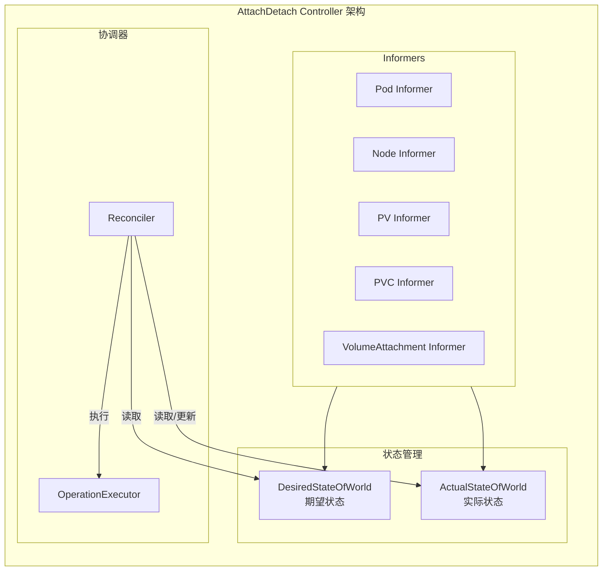
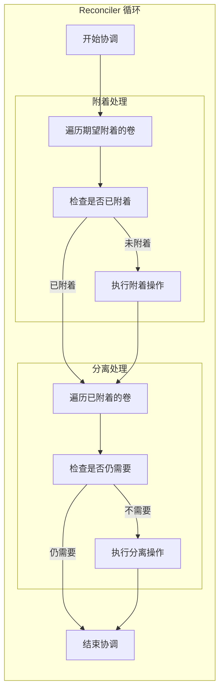

## 概述

AttachDetach 控制器负责管理卷的附着（Attach）和分离（Detach）操作。它监控 Pod 和节点状态，确保 Pod 需要的卷被附着到正确的节点，并在 Pod 删除或节点故障时分离卷。控制器通过 VolumeAttachment 资源与 CSI 驱动协调。

## 架构设计



## 数据结构

### DesiredStateOfWorld

```go
// pkg/controller/volume/attachdetach/cache/desired_state_of_world.go

// DesiredStateOfWorld 期望状态
type DesiredStateOfWorld interface {
    // AddNode 添加节点
    AddNode(nodeName k8stypes.NodeName)

    // DeleteNode 删除节点
    DeleteNode(nodeName k8stypes.NodeName)

    // AddPod 添加 Pod（及其卷）
    AddPod(podName k8stypes.UniquePodName, pod *v1.Pod, volumeSpec *volume.Spec, nodeName k8stypes.NodeName) (v1.UniqueVolumeName, error)

    // DeletePod 删除 Pod
    DeletePod(podName k8stypes.UniquePodName, volumeName v1.UniqueVolumeName, nodeName k8stypes.NodeName)

    // GetVolumesToAttach 获取需要附着的卷
    GetVolumesToAttach() []VolumeToAttach

    // GetPodToAdd 获取需要添加的 Pod
    GetPodToAdd() map[k8stypes.UniquePodName]PodToAdd
}

// VolumeToAttach 需要附着的卷
type VolumeToAttach struct {
    VolumeName    v1.UniqueVolumeName
    VolumeSpec    *volume.Spec
    NodeName      k8stypes.NodeName
    ScheduledPods []PodUniqueInfo
}

// desiredStateOfWorld 实现
type desiredStateOfWorld struct {
    // nodesManaged 管理的节点
    nodesManaged map[k8stypes.NodeName]nodeManaged

    // volumePluginMgr 卷插件管理器
    volumePluginMgr *volume.VolumePluginMgr

    sync.RWMutex
}

type nodeManaged struct {
    // 节点名称
    nodeName k8stypes.NodeName

    // 节点上的卷
    volumesToAttach map[v1.UniqueVolumeName]volumeToAttach
}

type volumeToAttach struct {
    // 卷名称
    volumeName v1.UniqueVolumeName

    // 卷规格
    spec *volume.Spec

    // 使用该卷的 Pod
    scheduledPods map[k8stypes.UniquePodName]pod
}
```

### ActualStateOfWorld

```go
// pkg/controller/volume/attachdetach/cache/actual_state_of_world.go

// ActualStateOfWorld 实际状态
type ActualStateOfWorld interface {
    // AddVolumeNode 添加卷到节点
    AddVolumeNode(uniqueName v1.UniqueVolumeName, volumeSpec *volume.Spec, nodeName k8stypes.NodeName, devicePath string) (v1.UniqueVolumeName, error)

    // SetVolumeMountedByNode 设置卷已被节点挂载
    SetVolumeMountedByNode(volumeName v1.UniqueVolumeName, nodeName k8stypes.NodeName, mounted bool)

    // DeleteVolumeNode 删除节点上的卷
    DeleteVolumeNode(volumeName v1.UniqueVolumeName, nodeName k8stypes.NodeName)

    // GetAttachedVolumes 获取已附着的卷
    GetAttachedVolumes() []AttachedVolume

    // GetAttachedVolumesForNode 获取节点上已附着的卷
    GetAttachedVolumesForNode(nodeName k8stypes.NodeName) []AttachedVolume

    // IsVolumeAttachedToNode 检查卷是否已附着到节点
    IsVolumeAttachedToNode(volumeName v1.UniqueVolumeName, nodeName k8stypes.NodeName) bool
}

// AttachedVolume 已附着的卷
type AttachedVolume struct {
    VolumeName       v1.UniqueVolumeName
    VolumeSpec       *volume.Spec
    NodeName         k8stypes.NodeName
    DevicePath       string
    MountedByNode    bool
    AttachRequestTime time.Time
}
```

## 控制器实现

### 初始化与启动

```go
// pkg/controller/volume/attachdetach/attach_detach_controller.go

// AttachDetachController 控制器
type AttachDetachController interface {
    Run(ctx context.Context)
    GetDesiredStateOfWorld() cache.DesiredStateOfWorld
}

// attachDetachController 实现
type attachDetachController struct {
    // 客户端
    kubeClient clientset.Interface

    // Informers
    podLister   corelisters.PodLister
    nodeLister  corelisters.NodeLister
    pvLister    corelisters.PersistentVolumeLister
    pvcLister   corelisters.PersistentVolumeClaimLister

    // 状态
    desiredStateOfWorld cache.DesiredStateOfWorld
    actualStateOfWorld  cache.ActualStateOfWorld

    // 协调器
    reconciler reconciler.Reconciler

    // 节点状态
    nodeStatusUpdater statusupdater.NodeStatusUpdater

    // 卷插件
    volumePluginMgr *volume.VolumePluginMgr
}

// NewAttachDetachController 创建控制器
func NewAttachDetachController(
    kubeClient clientset.Interface,
    podInformer coreinformers.PodInformer,
    nodeInformer coreinformers.NodeInformer,
    pvcInformer coreinformers.PersistentVolumeClaimInformer,
    pvInformer coreinformers.PersistentVolumeInformer,
    cloud cloudprovider.Interface,
    plugins []volume.VolumePlugin,
    prober volume.DynamicPluginProber,
    disableReconciliationSync bool,
    reconcilerSyncDuration time.Duration,
    timerConfig TimerConfig,
) (AttachDetachController, error) {

    adc := &attachDetachController{
        kubeClient: kubeClient,
        podLister:  podInformer.Lister(),
        nodeLister: nodeInformer.Lister(),
        pvcLister:  pvcInformer.Lister(),
        pvLister:   pvInformer.Lister(),
    }

    // 初始化卷插件
    adc.volumePluginMgr = volume.NewVolumePluginMgr()
    adc.volumePluginMgr.InitPlugins(plugins, prober, adc)

    // 创建状态管理
    adc.desiredStateOfWorld = cache.NewDesiredStateOfWorld(adc.volumePluginMgr)
    adc.actualStateOfWorld = cache.NewActualStateOfWorld(adc.volumePluginMgr)

    // 创建协调器
    adc.reconciler = reconciler.NewReconciler(
        reconcilerSyncDuration,
        timerConfig.LongRetryTimerPeriod,
        timerConfig.ShortRetryTimerPeriod,
        timerConfig.MaxRetryDuration,
        adc.desiredStateOfWorld,
        adc.actualStateOfWorld,
        adc.volumePluginMgr,
        operationexecutor.NewOperationExecutor(operationexecutor.NewOperationGenerator(
            kubeClient,
            adc.volumePluginMgr,
            recorder,
            false, /* checkNodeCapabilitiesBeforeMount */
        )),
        adc.nodeStatusUpdater,
        recorder,
    )

    // 设置 Informer 事件处理
    podInformer.Informer().AddEventHandler(cache.ResourceEventHandlerFuncs{
        AddFunc:    adc.podAdd,
        UpdateFunc: adc.podUpdate,
        DeleteFunc: adc.podDelete,
    })

    nodeInformer.Informer().AddEventHandler(cache.ResourceEventHandlerFuncs{
        AddFunc:    adc.nodeAdd,
        UpdateFunc: adc.nodeUpdate,
        DeleteFunc: adc.nodeDelete,
    })

    return adc, nil
}

// Run 运行控制器
func (adc *attachDetachController) Run(ctx context.Context) {
    klog.InfoS("Starting attach detach controller")

    // 同步初始状态
    adc.populateActualStateOfWorld()
    adc.populateDesiredStateOfWorld()

    // 启动协调循环
    go adc.reconciler.Run(ctx.Done())

    // 启动期望状态填充循环
    go wait.Until(adc.syncDesiredStateOfWorld, time.Minute, ctx.Done())

    <-ctx.Done()
}
```

### 事件处理

```go
// pkg/controller/volume/attachdetach/attach_detach_controller.go

// podAdd 处理 Pod 添加事件
func (adc *attachDetachController) podAdd(obj interface{}) {
    pod, ok := obj.(*v1.Pod)
    if !ok {
        return
    }

    adc.processPod(pod)
}

// processPod 处理 Pod
func (adc *attachDetachController) processPod(pod *v1.Pod) {
    if pod.Spec.NodeName == "" {
        // Pod 未调度
        return
    }

    // 检查 Pod 是否需要附着卷
    for _, podVolume := range pod.Spec.Volumes {
        // 获取卷规格
        volumeSpec, err := adc.getVolumeSpec(pod, podVolume)
        if err != nil {
            continue
        }

        // 检查是否需要附着
        attachablePlugin, err := adc.volumePluginMgr.FindAttachablePluginBySpec(volumeSpec)
        if err != nil || attachablePlugin == nil {
            continue
        }

        // 添加到期望状态
        adc.desiredStateOfWorld.AddPod(
            types.UniquePodName(pod.UID),
            pod,
            volumeSpec,
            types.NodeName(pod.Spec.NodeName),
        )
    }
}

// podDelete 处理 Pod 删除事件
func (adc *attachDetachController) podDelete(obj interface{}) {
    pod, ok := obj.(*v1.Pod)
    if !ok {
        tombstone, ok := obj.(cache.DeletedFinalStateUnknown)
        if !ok {
            return
        }
        pod, ok = tombstone.Obj.(*v1.Pod)
        if !ok {
            return
        }
    }

    // 从期望状态中移除
    for _, podVolume := range pod.Spec.Volumes {
        volumeSpec, err := adc.getVolumeSpec(pod, podVolume)
        if err != nil {
            continue
        }

        volumeName, _ := adc.volumePluginMgr.GetUniqueVolumeNameFromSpec(
            attachablePlugin, volumeSpec)

        adc.desiredStateOfWorld.DeletePod(
            types.UniquePodName(pod.UID),
            volumeName,
            types.NodeName(pod.Spec.NodeName),
        )
    }
}

// nodeAdd 处理节点添加事件
func (adc *attachDetachController) nodeAdd(obj interface{}) {
    node, ok := obj.(*v1.Node)
    if !ok {
        return
    }

    adc.desiredStateOfWorld.AddNode(types.NodeName(node.Name))
}

// nodeDelete 处理节点删除事件
func (adc *attachDetachController) nodeDelete(obj interface{}) {
    node, ok := obj.(*v1.Node)
    if !ok {
        return
    }

    adc.desiredStateOfWorld.DeleteNode(types.NodeName(node.Name))
}
```

## Reconciler



### Reconciler 实现

```go
// pkg/controller/volume/attachdetach/reconciler/reconciler.go

// Reconciler 协调器
type Reconciler interface {
    Run(stopCh <-chan struct{})
}

type reconciler struct {
    loopPeriod           time.Duration
    desiredStateOfWorld  cache.DesiredStateOfWorld
    actualStateOfWorld   cache.ActualStateOfWorld
    operationExecutor    operationexecutor.OperationExecutor
    nodeStatusUpdater    statusupdater.NodeStatusUpdater
    volumePluginMgr      *volume.VolumePluginMgr
    recorder             record.EventRecorder
}

// Run 运行协调循环
func (rc *reconciler) Run(stopCh <-chan struct{}) {
    wait.Until(rc.reconciliationLoopFunc(), rc.loopPeriod, stopCh)
}

// reconciliationLoopFunc 协调循环函数
func (rc *reconciler) reconciliationLoopFunc() func() {
    return func() {
        rc.reconcile()
    }
}

// reconcile 执行协调
func (rc *reconciler) reconcile() {
    // 1. 分离不再需要的卷
    for _, attachedVolume := range rc.actualStateOfWorld.GetAttachedVolumes() {
        if !rc.desiredStateOfWorld.VolumeExists(
            attachedVolume.VolumeName,
            attachedVolume.NodeName) {

            // 检查卷是否仍被节点使用
            if rc.isVolumeStillMountedOnNode(attachedVolume) {
                klog.V(4).InfoS("Volume still mounted, skipping detach",
                    "volume", attachedVolume.VolumeName,
                    "node", attachedVolume.NodeName)
                continue
            }

            // 执行分离
            klog.V(4).InfoS("Starting detach",
                "volume", attachedVolume.VolumeName,
                "node", attachedVolume.NodeName)

            rc.operationExecutor.DetachVolume(
                attachedVolume,
                true, /* verifySafeToDetach */
                rc.actualStateOfWorld,
            )
        }
    }

    // 2. 附着需要的卷
    for _, volumeToAttach := range rc.desiredStateOfWorld.GetVolumesToAttach() {
        // 检查是否已附着
        if rc.actualStateOfWorld.IsVolumeAttachedToNode(
            volumeToAttach.VolumeName,
            volumeToAttach.NodeName) {
            continue
        }

        // 检查节点是否就绪
        if !rc.isNodeHealthy(volumeToAttach.NodeName) {
            klog.V(4).InfoS("Node not healthy, skipping attach",
                "volume", volumeToAttach.VolumeName,
                "node", volumeToAttach.NodeName)
            continue
        }

        // 执行附着
        klog.V(4).InfoS("Starting attach",
            "volume", volumeToAttach.VolumeName,
            "node", volumeToAttach.NodeName)

        rc.operationExecutor.AttachVolume(
            volumeToAttach,
            rc.actualStateOfWorld,
        )
    }
}

// isVolumeStillMountedOnNode 检查卷是否仍在节点上挂载
func (rc *reconciler) isVolumeStillMountedOnNode(attachedVolume cache.AttachedVolume) bool {
    // 检查 Node 对象的 VolumesInUse 字段
    node, err := rc.nodeLister.Get(string(attachedVolume.NodeName))
    if err != nil {
        return false
    }

    for _, volumeInUse := range node.Status.VolumesInUse {
        if volumeInUse == attachedVolume.VolumeName {
            return true
        }
    }

    return false
}
```

## VolumeAttachment 处理

```go
// pkg/controller/volume/attachdetach/attach_detach_controller.go

// 使用 CSI 时的附着流程
func (adc *attachDetachController) attachCSIVolume(
    volumeToAttach VolumeToAttach,
) error {

    // 创建 VolumeAttachment 对象
    va := &storagev1.VolumeAttachment{
        ObjectMeta: metav1.ObjectMeta{
            Name: generateVolumeAttachmentName(volumeToAttach),
        },
        Spec: storagev1.VolumeAttachmentSpec{
            Attacher: volumeToAttach.VolumeSpec.PersistentVolume.Spec.CSI.Driver,
            NodeName: string(volumeToAttach.NodeName),
            Source: storagev1.VolumeAttachmentSource{
                PersistentVolumeName: &volumeToAttach.VolumeSpec.PersistentVolume.Name,
            },
        },
    }

    // 创建 VolumeAttachment
    _, err := adc.kubeClient.StorageV1().VolumeAttachments().
        Create(context.TODO(), va, metav1.CreateOptions{})
    if err != nil && !apierrors.IsAlreadyExists(err) {
        return err
    }

    // 等待附着完成
    return adc.waitForVolumeAttachment(va.Name, volumeToAttach.NodeName)
}

// waitForVolumeAttachment 等待附着完成
func (adc *attachDetachController) waitForVolumeAttachment(
    vaName string,
    nodeName k8stypes.NodeName,
) error {

    return wait.PollImmediate(time.Second, 2*time.Minute, func() (bool, error) {
        va, err := adc.kubeClient.StorageV1().VolumeAttachments().
            Get(context.TODO(), vaName, metav1.GetOptions{})
        if err != nil {
            return false, err
        }

        if va.Status.Attached {
            return true, nil
        }

        if va.Status.AttachError != nil {
            return false, fmt.Errorf("attach failed: %s", va.Status.AttachError.Message)
        }

        return false, nil
    })
}
```

## 强制分离

```go
// pkg/controller/volume/attachdetach/reconciler/reconciler.go

// 节点故障时的强制分离
func (rc *reconciler) forceDetachOnNodeFailure(nodeName k8stypes.NodeName) {
    // 获取节点状态
    node, err := rc.nodeLister.Get(string(nodeName))
    if err != nil {
        return
    }

    // 检查节点是否不可达
    nodeReady := false
    for _, condition := range node.Status.Conditions {
        if condition.Type == v1.NodeReady {
            nodeReady = condition.Status == v1.ConditionTrue
            break
        }
    }

    if nodeReady {
        return
    }

    // 检查不可达时间是否超过阈值
    nodeNotReadyDuration := time.Since(node.Status.Conditions[0].LastTransitionTime.Time)
    if nodeNotReadyDuration < rc.maxForceDetachDelay {
        return
    }

    // 强制分离节点上的所有卷
    for _, attachedVolume := range rc.actualStateOfWorld.GetAttachedVolumesForNode(nodeName) {
        klog.InfoS("Force detaching volume from unresponsive node",
            "volume", attachedVolume.VolumeName,
            "node", nodeName)

        rc.operationExecutor.DetachVolume(
            attachedVolume,
            false, /* verifySafeToDetach = false 表示强制分离 */
            rc.actualStateOfWorld,
        )
    }
}
```

## 监控与调试

### 关键指标

```go
var (
    // 附着操作延迟
    attachOperationLatency = prometheus.NewHistogramVec(
        prometheus.HistogramOpts{
            Name:    "storage_operation_duration_seconds",
            Help:    "Duration of storage operations",
            Buckets: prometheus.ExponentialBuckets(0.001, 2, 15),
        },
        []string{"operation_name", "volume_plugin"},
    )

    // 附着操作错误计数
    attachOperationErrors = prometheus.NewCounterVec(
        prometheus.CounterOpts{
            Name: "storage_operation_errors_total",
            Help: "Total number of storage operation errors",
        },
        []string{"operation_name", "volume_plugin"},
    )

    // 强制分离计数
    forcedDetaches = prometheus.NewCounter(
        prometheus.CounterOpts{
            Name: "attachdetach_controller_forced_detaches_total",
            Help: "Number of forced detaches",
        },
    )
)
```

### 调试命令

```bash
# 查看 VolumeAttachment
kubectl get volumeattachment

# 查看详情
kubectl describe volumeattachment <name>

# 查看节点上的卷
kubectl get node <node> -o jsonpath='{.status.volumesAttached}'

# 查看节点上使用中的卷
kubectl get node <node> -o jsonpath='{.status.volumesInUse}'

# 查看控制器日志
kubectl logs -n kube-system kube-controller-manager | grep -i "attach\|detach"
```

## 总结

AttachDetach 控制器是卷生命周期管理的关键组件：

1. **双状态管理**：DesiredStateOfWorld 和 ActualStateOfWorld
2. **事件驱动**：响应 Pod 和 Node 事件
3. **协调循环**：持续同步期望状态和实际状态
4. **VolumeAttachment**：与 CSI 驱动协调
5. **强制分离**：处理节点故障场景

理解 AttachDetach 控制器对于排查存储挂载问题至关重要。
