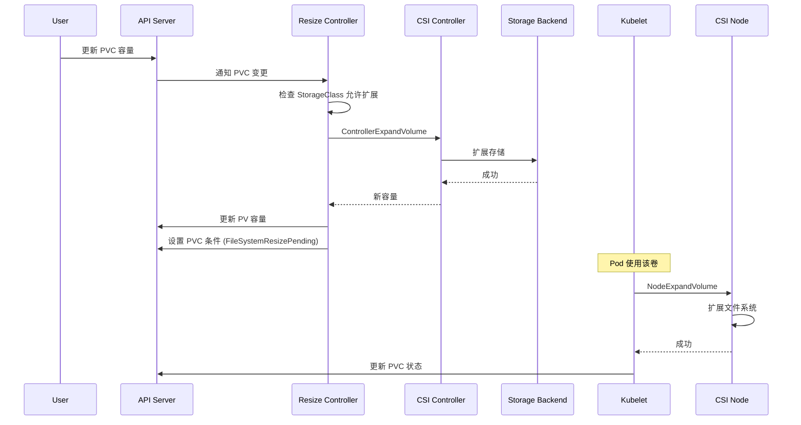
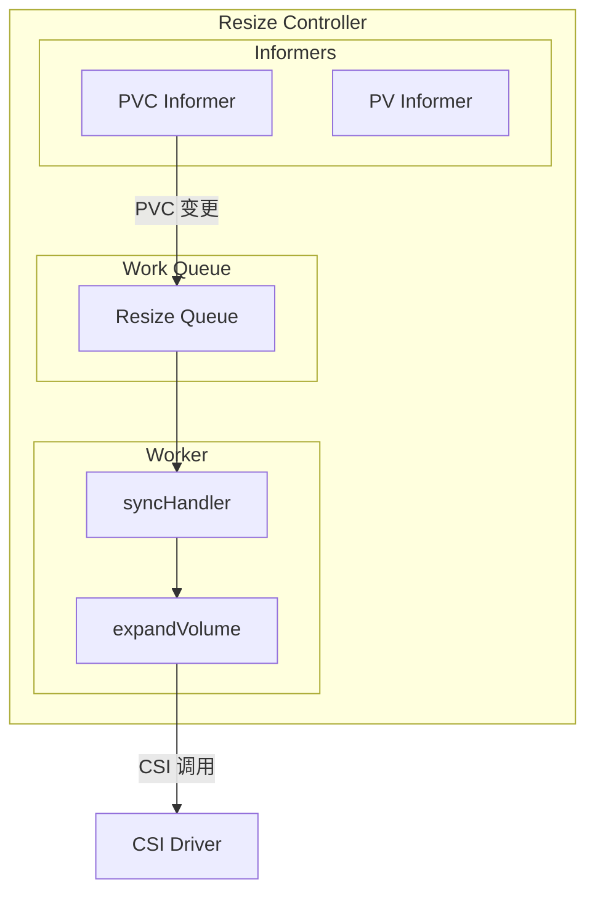
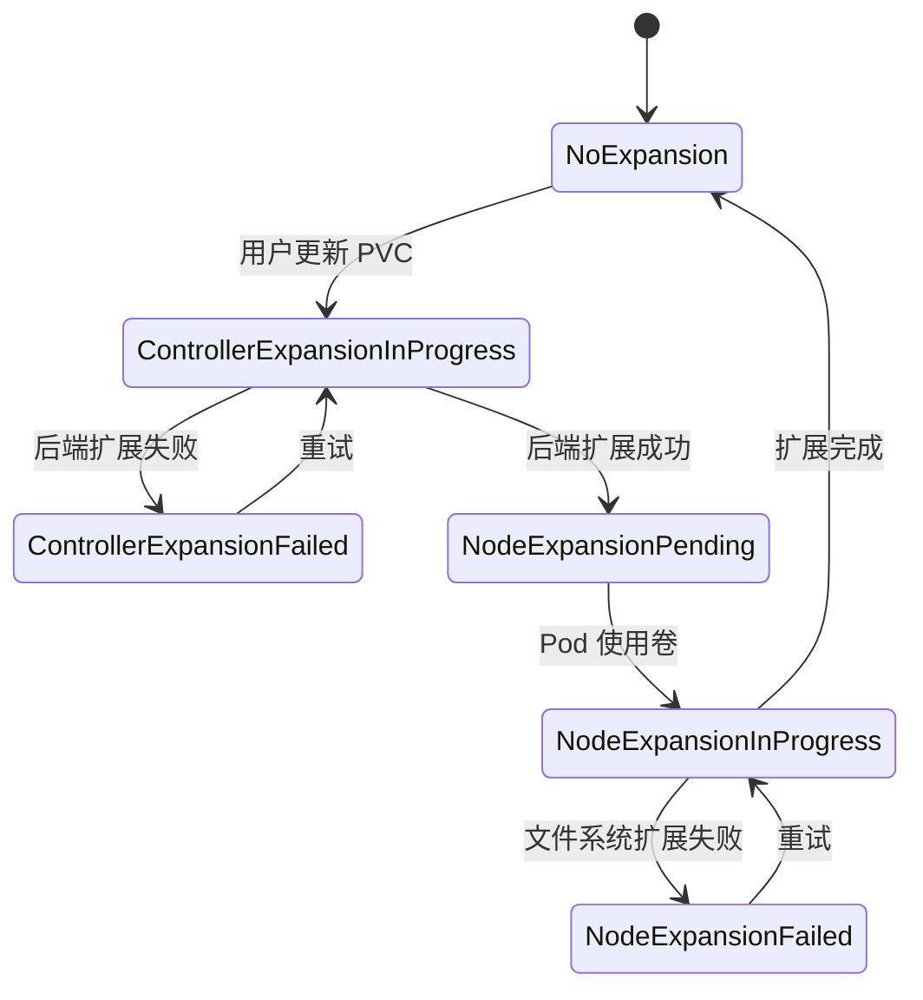

## 概述

卷扩展（Volume Expansion）允许用户在不中断服务的情况下增加 PersistentVolumeClaim 的存储容量。扩展过程分为两个阶段：控制器端扩展（扩展后端存储）和节点端扩展（扩展文件系统）。CSI 驱动需要实现相应的能力来支持卷扩展。

## 扩展流程



## 配置启用

### StorageClass 配置

```yaml
apiVersion: storage.k8s.io/v1
kind: StorageClass
metadata:
  name: expandable-storage
provisioner: ebs.csi.aws.com
parameters:
  type: gp3
# 允许卷扩展
allowVolumeExpansion: true
reclaimPolicy: Delete
volumeBindingMode: WaitForFirstConsumer
```

### CSI Driver 能力

```yaml
apiVersion: storage.k8s.io/v1
kind: CSIDriver
metadata:
  name: ebs.csi.aws.com
spec:
  attachRequired: true
  podInfoOnMount: false
  # 声明支持卷扩展
  # 实际能力由 ControllerGetCapabilities 返回
```

## Resize Controller

### 架构



### 控制器实现

```go
// pkg/controller/volume/expand/expand_controller.go

// ExpandController 扩展控制器
type ExpandController interface {
    Run(ctx context.Context)
}

type expandController struct {
    // 客户端
    kubeClient clientset.Interface

    // Listers
    pvcLister  corelisters.PersistentVolumeClaimLister
    pvLister   corelisters.PersistentVolumeLister
    scLister   storagelisters.StorageClassLister

    // 工作队列
    queue workqueue.RateLimitingInterface

    // 卷插件管理器
    volumePluginMgr *volume.VolumePluginMgr

    // CSI 迁移
    csiMigration bool

    // 操作执行器
    operationGenerator operationexecutor.OperationGenerator
}

// Run 运行控制器
func (expc *expandController) Run(ctx context.Context) {
    defer expc.queue.ShutDown()

    klog.InfoS("Starting expand controller")

    // 启动 worker
    for i := 0; i < workers; i++ {
        go wait.UntilWithContext(ctx, expc.runWorker, time.Second)
    }

    <-ctx.Done()
}

// runWorker 运行 worker
func (expc *expandController) runWorker(ctx context.Context) {
    for expc.processNextWorkItem(ctx) {
    }
}

// processNextWorkItem 处理工作项
func (expc *expandController) processNextWorkItem(ctx context.Context) bool {
    key, quit := expc.queue.Get()
    if quit {
        return false
    }
    defer expc.queue.Done(key)

    err := expc.syncHandler(ctx, key.(string))
    if err != nil {
        expc.queue.AddRateLimited(key)
        klog.ErrorS(err, "Error syncing pvc", "key", key)
        return true
    }

    expc.queue.Forget(key)
    return true
}

// syncHandler 同步处理
func (expc *expandController) syncHandler(ctx context.Context, key string) error {
    namespace, name, err := cache.SplitMetaNamespaceKey(key)
    if err != nil {
        return err
    }

    // 获取 PVC
    pvc, err := expc.pvcLister.PersistentVolumeClaims(namespace).Get(name)
    if err != nil {
        if apierrors.IsNotFound(err) {
            return nil
        }
        return err
    }

    // 检查是否需要扩展
    if !expc.pvcNeedsResize(pvc) {
        return nil
    }

    // 执行扩展
    return expc.expandVolume(ctx, pvc)
}

// pvcNeedsResize 检查 PVC 是否需要扩展
func (expc *expandController) pvcNeedsResize(pvc *v1.PersistentVolumeClaim) bool {
    // 获取请求的容量
    requestedSize := pvc.Spec.Resources.Requests[v1.ResourceStorage]

    // 获取当前容量
    currentSize := pvc.Status.Capacity[v1.ResourceStorage]

    // 比较
    return requestedSize.Cmp(currentSize) > 0
}
```

### 扩展执行

```go
// pkg/controller/volume/expand/expand_controller.go

// expandVolume 扩展卷
func (expc *expandController) expandVolume(ctx context.Context, pvc *v1.PersistentVolumeClaim) error {
    // 获取 PV
    pv, err := expc.pvLister.Get(pvc.Spec.VolumeName)
    if err != nil {
        return err
    }

    // 检查 StorageClass 是否允许扩展
    sc, err := expc.scLister.Get(*pvc.Spec.StorageClassName)
    if err != nil {
        return err
    }

    if sc.AllowVolumeExpansion == nil || !*sc.AllowVolumeExpansion {
        return fmt.Errorf("storageClass %s does not allow volume expansion", sc.Name)
    }

    // 获取扩展插件
    plugin, err := expc.volumePluginMgr.FindExpandablePluginBySpec(pv)
    if err != nil {
        return err
    }

    // 获取新旧容量
    oldSize := pv.Spec.Capacity[v1.ResourceStorage]
    newSize := pvc.Spec.Resources.Requests[v1.ResourceStorage]

    klog.V(4).InfoS("Expanding volume",
        "pvc", klog.KObj(pvc),
        "pv", pv.Name,
        "oldSize", oldSize.String(),
        "newSize", newSize.String())

    // 执行控制器端扩展
    updatedSize, err := plugin.ExpandVolumeDevice(
        volume.NewSpecFromPersistentVolume(pv, false),
        newSize,
        oldSize,
    )
    if err != nil {
        return expc.updatePVCCondition(pvc, v1.PersistentVolumeClaimResizing, err.Error())
    }

    // 更新 PV 容量
    pvClone := pv.DeepCopy()
    pvClone.Spec.Capacity[v1.ResourceStorage] = updatedSize
    if _, err := expc.kubeClient.CoreV1().PersistentVolumes().
        Update(ctx, pvClone, metav1.UpdateOptions{}); err != nil {
        return err
    }

    // 检查是否需要文件系统扩展
    if plugin.RequiresFSResize() {
        // 设置条件等待节点端扩展
        return expc.updatePVCCondition(pvc, v1.PersistentVolumeClaimFileSystemResizePending, "")
    }

    // 直接更新 PVC 状态
    return expc.updatePVCStatus(pvc, updatedSize)
}

// updatePVCCondition 更新 PVC 条件
func (expc *expandController) updatePVCCondition(
    pvc *v1.PersistentVolumeClaim,
    conditionType v1.PersistentVolumeClaimConditionType,
    message string,
) error {

    pvcClone := pvc.DeepCopy()

    // 添加或更新条件
    newCondition := v1.PersistentVolumeClaimCondition{
        Type:               conditionType,
        Status:             v1.ConditionTrue,
        LastTransitionTime: metav1.Now(),
        Message:            message,
    }

    found := false
    for i, cond := range pvcClone.Status.Conditions {
        if cond.Type == conditionType {
            pvcClone.Status.Conditions[i] = newCondition
            found = true
            break
        }
    }
    if !found {
        pvcClone.Status.Conditions = append(pvcClone.Status.Conditions, newCondition)
    }

    _, err := expc.kubeClient.CoreV1().PersistentVolumeClaims(pvc.Namespace).
        UpdateStatus(context.TODO(), pvcClone, metav1.UpdateOptions{})

    return err
}
```

## CSI Controller 扩展

```go
// CSI ControllerExpandVolume 请求
message ControllerExpandVolumeRequest {
    string volume_id = 1;
    CapacityRange capacity_range = 2;
    map<string, string> secrets = 3;
    VolumeCapability volume_capability = 4;
}

message ControllerExpandVolumeResponse {
    int64 capacity_bytes = 1;
    // 是否需要节点端扩展
    bool node_expansion_required = 2;
}
```

### CSI 实现

```go
// CSI Controller 扩展实现
func (s *ControllerServer) ControllerExpandVolume(
    ctx context.Context,
    req *csi.ControllerExpandVolumeRequest,
) (*csi.ControllerExpandVolumeResponse, error) {

    volumeID := req.VolumeId
    requiredBytes := req.CapacityRange.RequiredBytes

    // 获取当前卷信息
    volume, err := s.cloud.GetVolume(ctx, volumeID)
    if err != nil {
        return nil, status.Errorf(codes.NotFound, "volume not found: %v", err)
    }

    // 检查是否需要扩展
    if volume.Size >= requiredBytes {
        return &csi.ControllerExpandVolumeResponse{
            CapacityBytes:         volume.Size,
            NodeExpansionRequired: false,
        }, nil
    }

    // 执行后端扩展
    newSize, err := s.cloud.ExpandVolume(ctx, volumeID, requiredBytes)
    if err != nil {
        return nil, status.Errorf(codes.Internal, "expand failed: %v", err)
    }

    klog.InfoS("Volume expanded",
        "volumeID", volumeID,
        "newSize", newSize)

    return &csi.ControllerExpandVolumeResponse{
        CapacityBytes:         newSize,
        NodeExpansionRequired: true, // 需要节点端扩展文件系统
    }, nil
}
```

## 节点端扩展

### Kubelet 处理

```go
// pkg/kubelet/volumemanager/reconciler/reconciler.go

// expandVolumes 扩展卷
func (rc *reconciler) expandVolumes() {
    for _, volumeToMount := range rc.desiredStateOfWorld.GetVolumesToMount() {
        pvc, err := rc.getPVC(volumeToMount)
        if err != nil {
            continue
        }

        // 检查是否需要文件系统扩展
        if !rc.needsFileSystemResize(pvc) {
            continue
        }

        // 执行节点端扩展
        if err := rc.operationExecutor.ExpandInUseVolume(
            volumeToMount,
            rc.actualStateOfWorld,
            pvc.Status.Capacity[v1.ResourceStorage],
        ); err != nil {
            klog.ErrorS(err, "Failed to expand volume",
                "volume", volumeToMount.VolumeName)
        }
    }
}

// needsFileSystemResize 检查是否需要文件系统扩展
func (rc *reconciler) needsFileSystemResize(pvc *v1.PersistentVolumeClaim) bool {
    for _, condition := range pvc.Status.Conditions {
        if condition.Type == v1.PersistentVolumeClaimFileSystemResizePending &&
            condition.Status == v1.ConditionTrue {
            return true
        }
    }
    return false
}
```

### CSI Node 扩展

```go
// CSI NodeExpandVolume 请求
message NodeExpandVolumeRequest {
    string volume_id = 1;
    string volume_path = 2;
    CapacityRange capacity_range = 3;
    string staging_target_path = 4;
    VolumeCapability volume_capability = 5;
}

message NodeExpandVolumeResponse {
    int64 capacity_bytes = 1;
}
```

### 实现

```go
// CSI Node 扩展实现
func (s *NodeServer) NodeExpandVolume(
    ctx context.Context,
    req *csi.NodeExpandVolumeRequest,
) (*csi.NodeExpandVolumeResponse, error) {

    volumeID := req.VolumeId
    volumePath := req.VolumePath
    requiredBytes := req.CapacityRange.RequiredBytes

    // 获取设备路径
    devicePath, err := s.getDevicePath(volumeID)
    if err != nil {
        return nil, status.Errorf(codes.Internal, "get device path failed: %v", err)
    }

    // 判断卷类型
    volumeCapability := req.VolumeCapability
    if volumeCapability.GetBlock() != nil {
        // 块设备不需要扩展
        return &csi.NodeExpandVolumeResponse{
            CapacityBytes: requiredBytes,
        }, nil
    }

    // 文件系统卷：扩展文件系统
    resizer := mount.NewResizeFs(s.mounter.Exec)

    // 检查文件系统类型
    _, err = resizer.Resize(devicePath, volumePath)
    if err != nil {
        return nil, status.Errorf(codes.Internal, "resize fs failed: %v", err)
    }

    klog.InfoS("Filesystem expanded",
        "volumeID", volumeID,
        "volumePath", volumePath)

    return &csi.NodeExpandVolumeResponse{
        CapacityBytes: requiredBytes,
    }, nil
}

// Resize 扩展文件系统
func (resizer *ResizeFs) Resize(devicePath, deviceMountPath string) (bool, error) {
    // 获取文件系统类型
    format, err := resizer.mounter.GetDiskFormat(devicePath)
    if err != nil {
        return false, err
    }

    switch format {
    case "ext3", "ext4":
        return resizer.extResize(devicePath)
    case "xfs":
        return resizer.xfsResize(deviceMountPath)
    default:
        return false, fmt.Errorf("unsupported filesystem type: %s", format)
    }
}

// extResize 扩展 ext 文件系统
func (resizer *ResizeFs) extResize(devicePath string) (bool, error) {
    output, err := resizer.exec.Command("resize2fs", devicePath).CombinedOutput()
    if err != nil {
        return false, fmt.Errorf("resize2fs failed: %s, %v", output, err)
    }
    return true, nil
}

// xfsResize 扩展 xfs 文件系统
func (resizer *ResizeFs) xfsResize(deviceMountPath string) (bool, error) {
    output, err := resizer.exec.Command("xfs_growfs", deviceMountPath).CombinedOutput()
    if err != nil {
        return false, fmt.Errorf("xfs_growfs failed: %s, %v", output, err)
    }
    return true, nil
}
```

## 扩展状态

### PVC Conditions

```go
// PVC 扩展相关条件
const (
    // PersistentVolumeClaimResizing 正在扩展
    PersistentVolumeClaimResizing PersistentVolumeClaimConditionType = "Resizing"

    // PersistentVolumeClaimFileSystemResizePending 等待文件系统扩展
    PersistentVolumeClaimFileSystemResizePending PersistentVolumeClaimConditionType = "FileSystemResizePending"
)

// ResizeStatus 扩展状态
type PersistentVolumeClaimResizeStatus string

const (
    // 未处于扩展状态
    PersistentVolumeClaimNoExpansionInProgress PersistentVolumeClaimResizeStatus = ""

    // 控制器端扩展进行中
    PersistentVolumeClaimControllerExpansionInProgress PersistentVolumeClaimResizeStatus = "ControllerExpansionInProgress"

    // 控制器端扩展失败
    PersistentVolumeClaimControllerExpansionFailed PersistentVolumeClaimResizeStatus = "ControllerExpansionFailed"

    // 节点端扩展待定
    PersistentVolumeClaimNodeExpansionPending PersistentVolumeClaimResizeStatus = "NodeExpansionPending"

    // 节点端扩展进行中
    PersistentVolumeClaimNodeExpansionInProgress PersistentVolumeClaimResizeStatus = "NodeExpansionInProgress"

    // 节点端扩展失败
    PersistentVolumeClaimNodeExpansionFailed PersistentVolumeClaimResizeStatus = "NodeExpansionFailed"
)
```

### 状态流转



## 在线扩展与离线扩展

### 在线扩展（Online Expansion）

```yaml
# 卷正在被 Pod 使用时扩展
apiVersion: v1
kind: PersistentVolumeClaim
metadata:
  name: online-pvc
spec:
  accessModes:
    - ReadWriteOnce
  resources:
    requests:
      storage: 20Gi  # 从 10Gi 扩展到 20Gi
  storageClassName: expandable-storage
```

### 离线扩展（Offline Expansion）

某些存储类型只支持离线扩展，需要先删除使用该卷的 Pod：

```bash
# 1. 缩容 Deployment
kubectl scale deployment myapp --replicas=0

# 2. 更新 PVC 容量
kubectl patch pvc my-pvc -p '{"spec":{"resources":{"requests":{"storage":"20Gi"}}}}'

# 3. 等待扩展完成
kubectl wait --for=condition=FileSystemResizePending=false pvc/my-pvc

# 4. 扩容 Deployment
kubectl scale deployment myapp --replicas=1
```

## 监控与调试

### 查看扩展状态

```bash
# 查看 PVC 状态
kubectl get pvc -o wide

# 查看 PVC 详情
kubectl describe pvc <pvc-name>

# 查看 PVC 条件
kubectl get pvc <pvc-name> -o jsonpath='{.status.conditions}'

# 查看扩展状态
kubectl get pvc <pvc-name> -o jsonpath='{.status.resizeStatus}'
```

### 常见问题

| 问题 | 原因 | 解决方案 |
|------|------|----------|
| 扩展不生效 | StorageClass 未启用扩展 | 检查 allowVolumeExpansion |
| 控制器扩展失败 | 后端存储问题 | 检查 CSI 驱动日志 |
| 文件系统扩展失败 | 权限或工具问题 | 检查节点上的 resize 工具 |
| 卡在 Pending | 卷未被使用 | 等待 Pod 使用该卷 |

## 总结

卷扩展是 Kubernetes 存储弹性的重要特性：

1. **两阶段扩展**：控制器端扩展后端存储，节点端扩展文件系统
2. **在线支持**：大多数 CSI 驱动支持在线扩展
3. **状态追踪**：通过 PVC Conditions 追踪扩展进度
4. **StorageClass 控制**：通过 allowVolumeExpansion 控制是否允许扩展
5. **CSI 集成**：通过 ControllerExpandVolume 和 NodeExpandVolume 实现

合理使用卷扩展可以避免存储容量规划的困扰。
