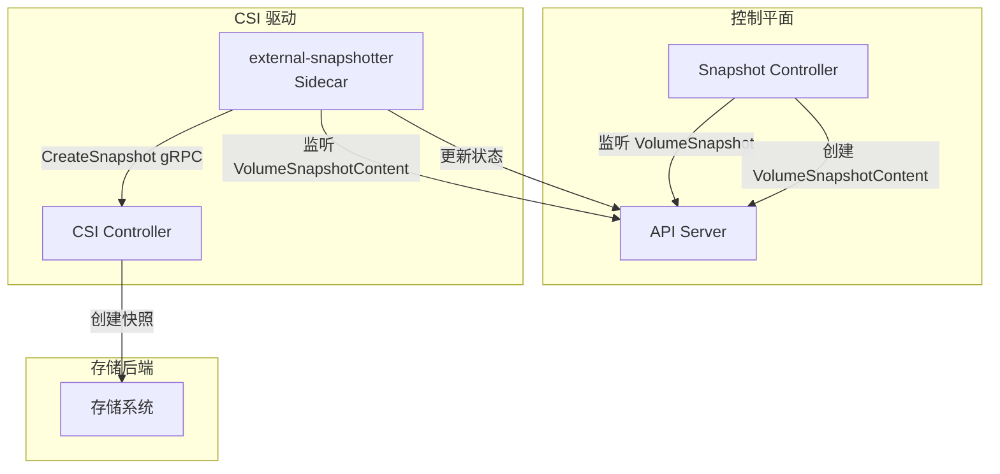
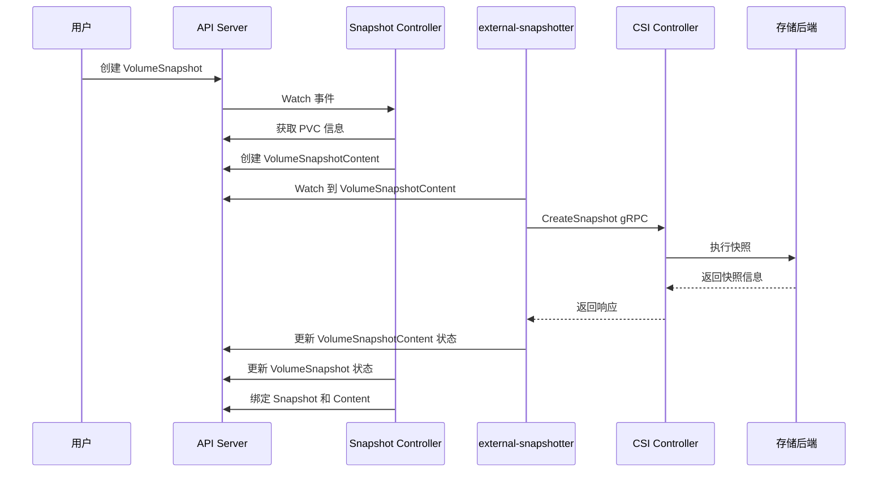
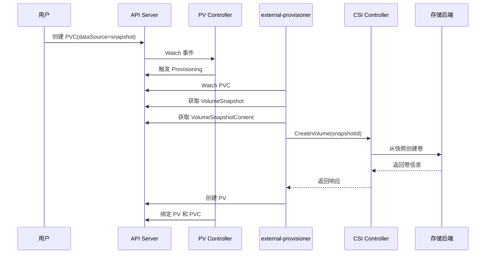
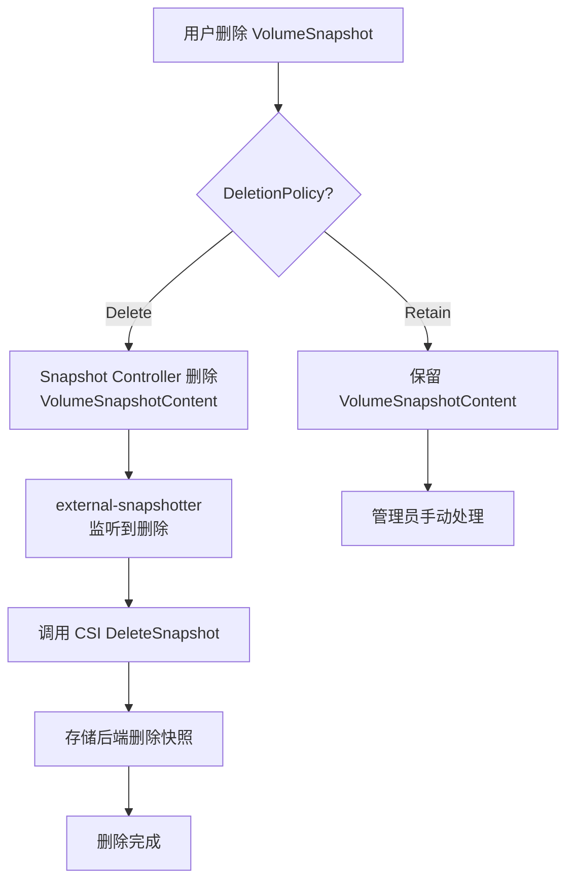

## 概述

卷快照（Volume Snapshot）是 Kubernetes 存储系统中用于数据保护和备份的重要功能。它允许用户创建持久卷的时间点副本，用于数据备份、恢复或克隆新卷。卷快照遵循与 PV/PVC 类似的 API 设计模式，提供了一套完整的快照生命周期管理机制。

## 快照资源模型

### 资源关系

卷快照系统包含三个核心资源：

```
┌─────────────────────────────────────────────────────────────────┐
│                    VolumeSnapshotClass                          │
│                    (集群级别,定义快照策略)                         │
└────────────────────────────┬────────────────────────────────────┘
                             │ 引用
                             ▼
┌─────────────────────────────────────────────────────────────────┐
│                      VolumeSnapshot                             │
│                    (用户创建的快照请求)                           │
│  ┌─────────────────────┐    ┌─────────────────────────────┐    │
│  │ spec:               │    │ status:                     │    │
│  │   source:           │    │   boundVolumeSnapshotContent│    │
│  │     pvcName         │    │   creationTime              │    │
│  │   volumeSnapshotClass│   │   readyToUse                │    │
│  └─────────────────────┘    └─────────────────────────────┘    │
└────────────────────────────┬────────────────────────────────────┘
                             │ 绑定
                             ▼
┌─────────────────────────────────────────────────────────────────┐
│                  VolumeSnapshotContent                          │
│                  (实际的快照存储对象)                             │
│  ┌─────────────────────┐    ┌─────────────────────────────┐    │
│  │ spec:               │    │ status:                     │    │
│  │   driver            │    │   snapshotHandle            │    │
│  │   source:           │    │   creationTime              │    │
│  │     volumeHandle    │    │   readyToUse                │    │
│  │   deletionPolicy    │    │   restoreSize               │    │
│  └─────────────────────┘    └─────────────────────────────┘    │
└─────────────────────────────────────────────────────────────────┘
```

### VolumeSnapshotClass

VolumeSnapshotClass 定义了创建快照的策略：

```yaml
apiVersion: snapshot.storage.k8s.io/v1
kind: VolumeSnapshotClass
metadata:
  name: csi-hostpath-snapclass
  annotations:
    # 设置为默认快照类
    snapshot.storage.kubernetes.io/is-default-class: "true"
# CSI 驱动名称
driver: hostpath.csi.k8s.io
# 删除策略：Delete 或 Retain
deletionPolicy: Delete
# 传递给 CSI 驱动的参数
parameters:
  # 驱动特定参数
  snapshot-type: full
```

### VolumeSnapshot

用户创建的快照请求：

```yaml
apiVersion: snapshot.storage.k8s.io/v1
kind: VolumeSnapshot
metadata:
  name: my-snapshot
  namespace: default
spec:
  # 引用 VolumeSnapshotClass
  volumeSnapshotClassName: csi-hostpath-snapclass
  source:
    # 从 PVC 创建快照
    persistentVolumeClaimName: my-pvc
```

### VolumeSnapshotContent

实际的快照存储对象，类似于 PV：

```yaml
apiVersion: snapshot.storage.k8s.io/v1
kind: VolumeSnapshotContent
metadata:
  name: snapcontent-72d9a349
spec:
  # 删除策略
  deletionPolicy: Delete
  # CSI 驱动
  driver: hostpath.csi.k8s.io
  source:
    # 源卷句柄
    volumeHandle: pvc-123456
  # 绑定的 VolumeSnapshot
  volumeSnapshotRef:
    name: my-snapshot
    namespace: default
status:
  # 存储系统中的快照句柄
  snapshotHandle: snap-123456
  creationTime: 1234567890
  readyToUse: true
  restoreSize: 10737418240  # 10Gi
```

## 快照控制器架构



### 组件职责

| 组件 | 职责 |
|------|------|
| Snapshot Controller | 监听 VolumeSnapshot，创建/删除 VolumeSnapshotContent，管理绑定关系 |
| external-snapshotter | CSI Sidecar，调用 CSI 驱动执行实际快照操作 |
| CSI Controller | 实现 CreateSnapshot/DeleteSnapshot 等快照相关 gRPC 方法 |

## 快照创建流程



### Snapshot Controller 实现

```go
// pkg/controller/snapshot/snapshot_controller.go (external-snapshotter 仓库)

// syncSnapshot 处理 VolumeSnapshot 同步
func (ctrl *csiSnapshotController) syncSnapshot(snapshot *crdv1.VolumeSnapshot) error {
    // 1. 检查快照是否已绑定
    if snapshot.Status != nil && snapshot.Status.BoundVolumeSnapshotContentName != nil {
        // 已绑定，同步状态
        return ctrl.syncBoundSnapshot(snapshot)
    }

    // 2. 检查是否有预创建的 Content
    content, err := ctrl.getContentForSnapshot(snapshot)
    if err != nil {
        return err
    }

    if content != nil {
        // 绑定到现有 Content
        return ctrl.bindSnapshotContent(snapshot, content)
    }

    // 3. 创建新的 VolumeSnapshotContent
    return ctrl.createSnapshotContent(snapshot)
}

// createSnapshotContent 创建 VolumeSnapshotContent
func (ctrl *csiSnapshotController) createSnapshotContent(snapshot *crdv1.VolumeSnapshot) error {
    // 获取源 PVC
    pvc, err := ctrl.pvcLister.PersistentVolumeClaims(snapshot.Namespace).Get(
        *snapshot.Spec.Source.PersistentVolumeClaimName)
    if err != nil {
        return err
    }

    // 获取绑定的 PV
    pv, err := ctrl.pvLister.Get(pvc.Spec.VolumeName)
    if err != nil {
        return err
    }

    // 获取 VolumeSnapshotClass
    snapshotClass, err := ctrl.getSnapshotClass(snapshot)
    if err != nil {
        return err
    }

    // 构建 VolumeSnapshotContent
    content := &crdv1.VolumeSnapshotContent{
        ObjectMeta: metav1.ObjectMeta{
            Name: ctrl.getContentName(snapshot),
        },
        Spec: crdv1.VolumeSnapshotContentSpec{
            VolumeSnapshotRef: core.ObjectReference{
                Kind:       "VolumeSnapshot",
                Namespace:  snapshot.Namespace,
                Name:       snapshot.Name,
                UID:        snapshot.UID,
            },
            DeletionPolicy: snapshotClass.DeletionPolicy,
            Driver:         snapshotClass.Driver,
            Source: crdv1.VolumeSnapshotContentSource{
                VolumeHandle: &pv.Spec.CSI.VolumeHandle,
            },
            VolumeSnapshotClassName: &snapshotClass.Name,
        },
    }

    // 创建 VolumeSnapshotContent
    _, err = ctrl.clientset.SnapshotV1().VolumeSnapshotContents().Create(
        context.TODO(), content, metav1.CreateOptions{})
    return err
}
```

### external-snapshotter Sidecar

```go
// pkg/sidecar-controller/snapshot_controller.go

// syncContent 同步 VolumeSnapshotContent
func (ctrl *csiSnapshotSideCarController) syncContent(content *crdv1.VolumeSnapshotContent) error {
    // 检查快照是否已创建
    if content.Status != nil && content.Status.SnapshotHandle != nil {
        // 快照已存在，检查状态
        return ctrl.checkAndUpdateContentStatus(content)
    }

    // 创建快照
    return ctrl.createSnapshot(content)
}

// createSnapshot 调用 CSI CreateSnapshot
func (ctrl *csiSnapshotSideCarController) createSnapshot(content *crdv1.VolumeSnapshotContent) error {
    // 获取参数
    class, err := ctrl.getSnapshotClass(content)
    if err != nil {
        return err
    }

    // 获取 Secrets
    snapshotterSecretRef := class.Parameters["csi.storage.k8s.io/snapshotter-secret-name"]
    secrets, err := ctrl.getCredentials(snapshotterSecretRef)
    if err != nil {
        return err
    }

    // 调用 CSI CreateSnapshot
    driverName := content.Spec.Driver
    snapshotName := content.Name
    volumeHandle := *content.Spec.Source.VolumeHandle

    csiSnapshotResponse, err := ctrl.handler.CreateSnapshot(
        context.Background(),
        snapshotName,
        volumeHandle,
        class.Parameters,
        secrets,
    )
    if err != nil {
        return err
    }

    // 更新 Content 状态
    content.Status = &crdv1.VolumeSnapshotContentStatus{
        SnapshotHandle: &csiSnapshotResponse.SnapshotId,
        CreationTime:   &csiSnapshotResponse.CreationTime,
        RestoreSize:    &csiSnapshotResponse.SizeBytes,
        ReadyToUse:     &csiSnapshotResponse.ReadyToUse,
    }

    _, err = ctrl.clientset.SnapshotV1().VolumeSnapshotContents().UpdateStatus(
        context.TODO(), content, metav1.UpdateOptions{})
    return err
}
```

## CSI 快照接口

### CreateSnapshot

```go
// CSI Controller 服务实现

func (cs *controllerServer) CreateSnapshot(
    ctx context.Context,
    req *csi.CreateSnapshotRequest) (*csi.CreateSnapshotResponse, error) {

    // 1. 参数验证
    sourceVolumeId := req.GetSourceVolumeId()
    if sourceVolumeId == "" {
        return nil, status.Error(codes.InvalidArgument, "Source volume ID required")
    }

    snapshotName := req.GetName()
    if snapshotName == "" {
        return nil, status.Error(codes.InvalidArgument, "Snapshot name required")
    }

    // 2. 检查快照是否已存在（幂等性）
    existingSnapshot, err := cs.findSnapshotByName(snapshotName)
    if err == nil && existingSnapshot != nil {
        // 验证源卷一致
        if existingSnapshot.SourceVolumeId != sourceVolumeId {
            return nil, status.Error(codes.AlreadyExists, "Snapshot exists with different source")
        }
        // 返回已有快照
        return &csi.CreateSnapshotResponse{
            Snapshot: existingSnapshot,
        }, nil
    }

    // 3. 获取源卷信息
    volume, err := cs.getVolume(sourceVolumeId)
    if err != nil {
        return nil, status.Error(codes.NotFound, "Source volume not found")
    }

    // 4. 在存储后端创建快照
    snapshot, err := cs.backend.CreateSnapshot(ctx, &backend.CreateSnapshotRequest{
        Name:           snapshotName,
        SourceVolumeId: sourceVolumeId,
        Parameters:     req.GetParameters(),
    })
    if err != nil {
        return nil, status.Error(codes.Internal, err.Error())
    }

    // 5. 返回快照信息
    return &csi.CreateSnapshotResponse{
        Snapshot: &csi.Snapshot{
            SnapshotId:     snapshot.Id,
            SourceVolumeId: sourceVolumeId,
            CreationTime:   timestamppb.New(snapshot.CreationTime),
            SizeBytes:      volume.SizeBytes,
            ReadyToUse:     snapshot.ReadyToUse,
        },
    }, nil
}
```

### DeleteSnapshot

```go
func (cs *controllerServer) DeleteSnapshot(
    ctx context.Context,
    req *csi.DeleteSnapshotRequest) (*csi.DeleteSnapshotResponse, error) {

    snapshotId := req.GetSnapshotId()
    if snapshotId == "" {
        return nil, status.Error(codes.InvalidArgument, "Snapshot ID required")
    }

    // 删除快照（幂等操作）
    err := cs.backend.DeleteSnapshot(ctx, snapshotId)
    if err != nil {
        // 快照不存在视为成功
        if isNotFoundError(err) {
            return &csi.DeleteSnapshotResponse{}, nil
        }
        return nil, status.Error(codes.Internal, err.Error())
    }

    return &csi.DeleteSnapshotResponse{}, nil
}
```

## 从快照恢复

### 创建 PVC 引用快照

```yaml
apiVersion: v1
kind: PersistentVolumeClaim
metadata:
  name: pvc-from-snapshot
spec:
  accessModes:
    - ReadWriteOnce
  storageClassName: csi-hostpath-sc
  resources:
    requests:
      storage: 10Gi
  # 指定快照作为数据源
  dataSource:
    name: my-snapshot
    kind: VolumeSnapshot
    apiGroup: snapshot.storage.k8s.io
```

### 恢复流程



### CSI CreateVolume 支持快照源

```go
func (cs *controllerServer) CreateVolume(
    ctx context.Context,
    req *csi.CreateVolumeRequest) (*csi.CreateVolumeResponse, error) {

    // 检查数据源
    volumeSource := req.GetVolumeContentSource()
    if volumeSource != nil {
        // 从快照创建
        if snapshot := volumeSource.GetSnapshot(); snapshot != nil {
            return cs.createVolumeFromSnapshot(ctx, req, snapshot.SnapshotId)
        }
        // 从卷克隆
        if srcVolume := volumeSource.GetVolume(); srcVolume != nil {
            return cs.createVolumeFromVolume(ctx, req, srcVolume.VolumeId)
        }
    }

    // 创建空卷
    return cs.createEmptyVolume(ctx, req)
}

func (cs *controllerServer) createVolumeFromSnapshot(
    ctx context.Context,
    req *csi.CreateVolumeRequest,
    snapshotId string) (*csi.CreateVolumeResponse, error) {

    // 获取快照信息
    snapshot, err := cs.backend.GetSnapshot(ctx, snapshotId)
    if err != nil {
        return nil, status.Error(codes.NotFound, "Snapshot not found")
    }

    // 验证容量
    requestedCapacity := req.GetCapacityRange().GetRequiredBytes()
    if requestedCapacity < snapshot.SizeBytes {
        return nil, status.Error(codes.OutOfRange,
            "Requested capacity smaller than snapshot size")
    }

    // 从快照创建卷
    volume, err := cs.backend.CreateVolumeFromSnapshot(ctx, &backend.CreateVolumeRequest{
        Name:       req.GetName(),
        Capacity:   requestedCapacity,
        SnapshotId: snapshotId,
        Parameters: req.GetParameters(),
    })
    if err != nil {
        return nil, status.Error(codes.Internal, err.Error())
    }

    return &csi.CreateVolumeResponse{
        Volume: &csi.Volume{
            VolumeId:      volume.Id,
            CapacityBytes: volume.SizeBytes,
            ContentSource: &csi.VolumeContentSource{
                Type: &csi.VolumeContentSource_Snapshot{
                    Snapshot: &csi.VolumeContentSource_SnapshotSource{
                        SnapshotId: snapshotId,
                    },
                },
            },
        },
    }, nil
}
```

## 快照删除

### 删除策略

| 策略 | 行为 |
|------|------|
| Delete | 删除 VolumeSnapshot 时自动删除 VolumeSnapshotContent 和后端快照 |
| Retain | 删除 VolumeSnapshot 后保留 VolumeSnapshotContent 和后端快照 |

### 删除流程



### Finalizer 保护

```go
// 快照删除保护

const (
    VolumeSnapshotFinalizer        = "snapshot.storage.kubernetes.io/volumesnapshot-protection"
    VolumeSnapshotContentFinalizer = "snapshot.storage.kubernetes.io/volumesnapshotcontent-protection"
)

// 处理 VolumeSnapshot 删除
func (ctrl *csiSnapshotController) processSnapshotDeletion(snapshot *crdv1.VolumeSnapshot) error {
    // 检查是否有 Finalizer
    if !hasVolumeSnapshotFinalizer(snapshot) {
        return nil
    }

    // 检查是否绑定了 Content
    if snapshot.Status != nil && snapshot.Status.BoundVolumeSnapshotContentName != nil {
        contentName := *snapshot.Status.BoundVolumeSnapshotContentName

        content, err := ctrl.contentLister.Get(contentName)
        if err != nil && !apierrors.IsNotFound(err) {
            return err
        }

        if content != nil {
            // 根据删除策略处理 Content
            if content.Spec.DeletionPolicy == crdv1.VolumeSnapshotContentDelete {
                // 删除 Content
                err := ctrl.clientset.SnapshotV1().VolumeSnapshotContents().Delete(
                    context.TODO(), contentName, metav1.DeleteOptions{})
                if err != nil && !apierrors.IsNotFound(err) {
                    return err
                }
            } else {
                // Retain 策略，清除绑定引用
                ctrl.clearContentBoundRef(content)
            }
        }
    }

    // 移除 Finalizer
    return ctrl.removeFinalizer(snapshot)
}
```

## 快照状态管理

### VolumeSnapshot 状态字段

```go
type VolumeSnapshotStatus struct {
    // 绑定的 VolumeSnapshotContent 名称
    BoundVolumeSnapshotContentName *string

    // 快照创建时间（存储后端）
    CreationTime *metav1.Time

    // 快照是否可用
    ReadyToUse *bool

    // 恢复大小（创建 PVC 时的最小容量）
    RestoreSize *resource.Quantity

    // 错误信息
    Error *VolumeSnapshotError
}

type VolumeSnapshotError struct {
    // 错误时间
    Time *metav1.Time
    // 错误消息
    Message *string
}
```

### 状态同步

```go
// 同步快照状态
func (ctrl *csiSnapshotController) syncSnapshotStatus(
    snapshot *crdv1.VolumeSnapshot,
    content *crdv1.VolumeSnapshotContent) error {

    newStatus := snapshot.Status.DeepCopy()
    if newStatus == nil {
        newStatus = &crdv1.VolumeSnapshotStatus{}
    }

    // 更新绑定状态
    contentName := content.Name
    newStatus.BoundVolumeSnapshotContentName = &contentName

    // 从 Content 同步状态
    if content.Status != nil {
        if content.Status.CreationTime != nil {
            t := metav1.NewTime(time.Unix(0, *content.Status.CreationTime))
            newStatus.CreationTime = &t
        }

        newStatus.ReadyToUse = content.Status.ReadyToUse

        if content.Status.RestoreSize != nil {
            size := resource.NewQuantity(*content.Status.RestoreSize, resource.BinarySI)
            newStatus.RestoreSize = size
        }
    }

    // 更新状态
    if !reflect.DeepEqual(snapshot.Status, newStatus) {
        snapshot.Status = newStatus
        _, err := ctrl.clientset.SnapshotV1().VolumeSnapshots(snapshot.Namespace).UpdateStatus(
            context.TODO(), snapshot, metav1.UpdateOptions{})
        return err
    }

    return nil
}
```

## 跨命名空间快照引用

### VolumeSnapshotContent 预配置

管理员可以预先创建 VolumeSnapshotContent，然后在不同命名空间创建 VolumeSnapshot 引用它：

```yaml
# 管理员预创建 VolumeSnapshotContent
apiVersion: snapshot.storage.k8s.io/v1
kind: VolumeSnapshotContent
metadata:
  name: pre-provisioned-content
spec:
  deletionPolicy: Retain
  driver: hostpath.csi.k8s.io
  source:
    # 已存在的快照句柄
    snapshotHandle: existing-snap-123
  # 指向将要创建的 VolumeSnapshot
  volumeSnapshotRef:
    name: my-snapshot
    namespace: production
---
# 用户在 production 命名空间创建 VolumeSnapshot
apiVersion: snapshot.storage.k8s.io/v1
kind: VolumeSnapshot
metadata:
  name: my-snapshot
  namespace: production
spec:
  source:
    # 引用预创建的 Content
    volumeSnapshotContentName: pre-provisioned-content
```

## 最佳实践

### 1. 应用一致性快照

```yaml
# 在创建快照前冻结应用
apiVersion: batch/v1
kind: Job
metadata:
  name: pre-snapshot-freeze
spec:
  template:
    spec:
      containers:
      - name: freeze
        image: mysql:8.0
        command:
        - mysql
        - -e
        - "FLUSH TABLES WITH READ LOCK;"
      restartPolicy: Never
---
# 创建快照
apiVersion: snapshot.storage.k8s.io/v1
kind: VolumeSnapshot
metadata:
  name: mysql-snapshot
spec:
  volumeSnapshotClassName: csi-snapclass
  source:
    persistentVolumeClaimName: mysql-data
---
# 快照后解锁
apiVersion: batch/v1
kind: Job
metadata:
  name: post-snapshot-unfreeze
spec:
  template:
    spec:
      containers:
      - name: unfreeze
        image: mysql:8.0
        command:
        - mysql
        - -e
        - "UNLOCK TABLES;"
      restartPolicy: Never
```

### 2. 定期快照

```yaml
apiVersion: batch/v1
kind: CronJob
metadata:
  name: scheduled-snapshot
spec:
  schedule: "0 2 * * *"  # 每天凌晨 2 点
  jobTemplate:
    spec:
      template:
        spec:
          serviceAccountName: snapshot-creator
          containers:
          - name: create-snapshot
            image: bitnami/kubectl:latest
            command:
            - /bin/sh
            - -c
            - |
              TIMESTAMP=$(date +%Y%m%d-%H%M%S)
              cat <<EOF | kubectl apply -f -
              apiVersion: snapshot.storage.k8s.io/v1
              kind: VolumeSnapshot
              metadata:
                name: scheduled-${TIMESTAMP}
              spec:
                volumeSnapshotClassName: csi-snapclass
                source:
                  persistentVolumeClaimName: data-pvc
              EOF
          restartPolicy: OnFailure
```

### 3. 快照保留策略

```yaml
# 使用标签管理快照生命周期
apiVersion: snapshot.storage.k8s.io/v1
kind: VolumeSnapshot
metadata:
  name: daily-snapshot-20240115
  labels:
    retention: daily
    created-by: scheduled-job
spec:
  volumeSnapshotClassName: csi-snapclass
  source:
    persistentVolumeClaimName: data-pvc
---
# 清理脚本
# kubectl get volumesnapshots -l retention=daily \
#   --sort-by=.metadata.creationTimestamp \
#   -o name | head -n -7 | xargs kubectl delete
```

### 4. 监控与告警

```yaml
# Prometheus 告警规则
groups:
- name: snapshot-alerts
  rules:
  - alert: VolumeSnapshotFailed
    expr: |
      kube_volumesnapshot_status_ready_to_use{ready_to_use="false"} == 1
      and
      (time() - kube_volumesnapshot_status_creation_timestamp) > 3600
    for: 5m
    labels:
      severity: warning
    annotations:
      summary: "Volume snapshot not ready"
      description: "VolumeSnapshot {{ $labels.name }} has not become ready within 1 hour"

  - alert: SnapshotContentOrphaned
    expr: |
      kube_volumesnapshotcontent_info
      unless on(volumesnapshotcontent)
      kube_volumesnapshot_status_bound_volume_snapshot_content_name
    for: 24h
    labels:
      severity: warning
    annotations:
      summary: "Orphaned VolumeSnapshotContent detected"
```

## 总结

卷快照机制提供了：
- **统一的 API 模型**：VolumeSnapshot/VolumeSnapshotContent/VolumeSnapshotClass 三层抽象
- **灵活的删除策略**：Delete 和 Retain 两种策略
- **完整的生命周期管理**：创建、绑定、使用、删除
- **与 CSI 的深度集成**：通过 external-snapshotter 调用 CSI 驱动

合理使用卷快照可以实现数据备份、灾难恢复、快速克隆等多种场景。
