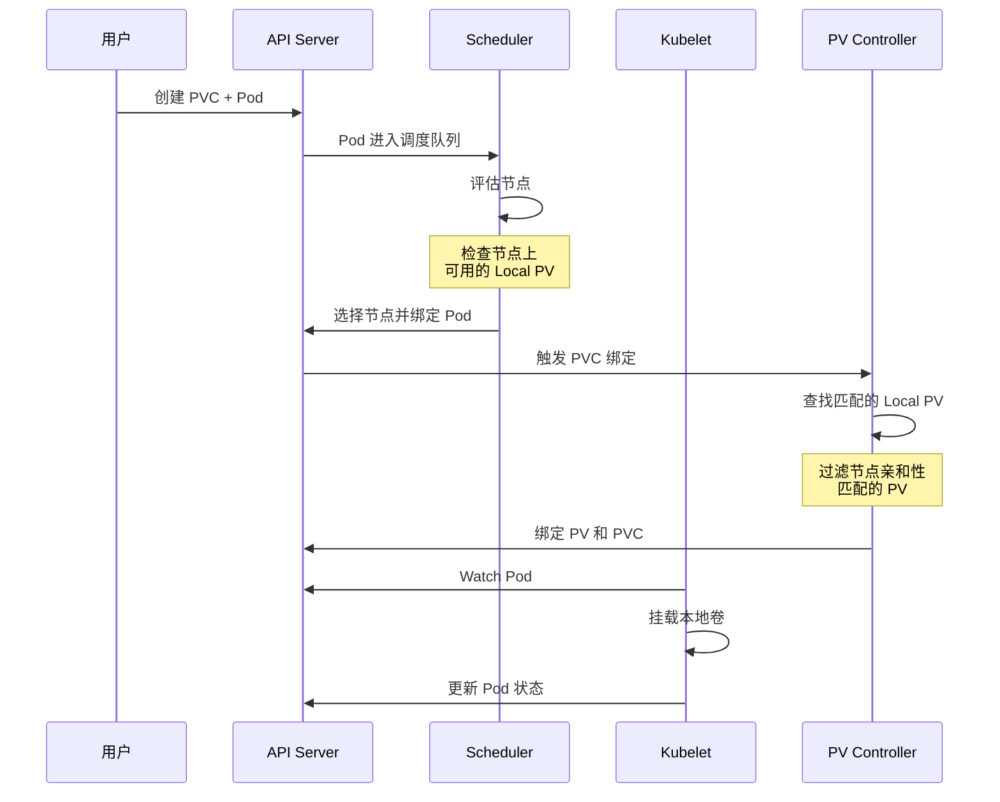
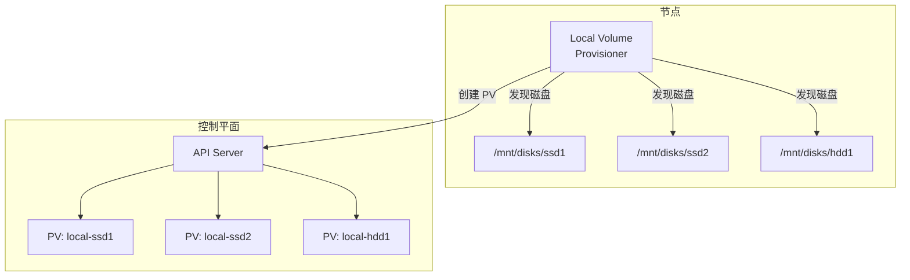

## 概述

本地持久卷（Local Persistent Volume）是 Kubernetes 中用于使用节点本地存储的一种 PV 类型。与网络存储不同，本地卷直接使用节点上的磁盘、分区或目录，提供更高的 I/O 性能和更低的延迟。本地卷特别适合对性能敏感的工作负载，如数据库、分布式存储系统等。

## 本地卷特性

### 与 HostPath 的区别

| 特性 | Local PV | HostPath |
|------|----------|----------|
| PVC 绑定 | 支持 | 不支持 |
| 节点亲和性 | 自动设置 | 需要手动配置 |
| 数据持久性 | Pod 删除后保留 | 取决于配置 |
| 调度感知 | 调度器感知节点位置 | 无调度感知 |
| 生产可用 | 是 | 仅用于测试 |
| 动态供应 | 通过外部 Provisioner | 不支持 |

### 核心特性

```
┌─────────────────────────────────────────────────────────────────┐
│                      Local PV 特性                              │
├─────────────────────────────────────────────────────────────────┤
│  1. 节点亲和性约束                                               │
│     - PV 绑定到特定节点                                          │
│     - Pod 必须调度到该节点                                       │
│                                                                  │
│  2. 延迟绑定                                                    │
│     - WaitForFirstConsumer                                      │
│     - 等待 Pod 调度后再绑定                                      │
│                                                                  │
│  3. 块设备支持                                                  │
│     - 支持原始块设备                                             │
│     - 支持文件系统模式                                           │
│                                                                  │
│  4. 容量感知调度                                                 │
│     - 调度器感知节点可用容量                                     │
│     - 避免容量不足                                               │
└─────────────────────────────────────────────────────────────────┘
```

## Local PV 定义

### 基本结构

```yaml
apiVersion: v1
kind: PersistentVolume
metadata:
  name: local-pv-node1
spec:
  capacity:
    storage: 100Gi
  volumeMode: Filesystem  # 或 Block
  accessModes:
    - ReadWriteOnce
  persistentVolumeReclaimPolicy: Retain
  storageClassName: local-storage
  # Local 卷配置
  local:
    path: /mnt/disks/ssd1
    # 可选：指定文件系统类型
    fsType: ext4
  # 节点亲和性（必需）
  nodeAffinity:
    required:
      nodeSelectorTerms:
        - matchExpressions:
            - key: kubernetes.io/hostname
              operator: In
              values:
                - node1
```

### 块设备模式

```yaml
apiVersion: v1
kind: PersistentVolume
metadata:
  name: local-block-pv
spec:
  capacity:
    storage: 200Gi
  volumeMode: Block  # 块设备模式
  accessModes:
    - ReadWriteOnce
  persistentVolumeReclaimPolicy: Retain
  storageClassName: local-block
  local:
    path: /dev/sdb  # 块设备路径
  nodeAffinity:
    required:
      nodeSelectorTerms:
        - matchExpressions:
            - key: kubernetes.io/hostname
              operator: In
              values:
                - node1
```

### StorageClass 配置

```yaml
apiVersion: storage.k8s.io/v1
kind: StorageClass
metadata:
  name: local-storage
# 不需要 provisioner（手动创建 PV）
# 或使用外部 provisioner
provisioner: kubernetes.io/no-provisioner
# 延迟绑定：等待 Pod 调度后再绑定
volumeBindingMode: WaitForFirstConsumer
# 不允许卷扩展（本地卷不支持扩展）
allowVolumeExpansion: false
```

## 调度与绑定

### 调度流程



### VolumeBindingMode 解析

```go
// pkg/scheduler/framework/plugins/volumebinding/binder.go

// FindPodVolumes 查找 Pod 需要的卷
func (b *volumeBinder) FindPodVolumes(
    pod *v1.Pod,
    node *v1.Node) (*PodVolumes, []string, error) {

    podVolumes := &PodVolumes{
        StaticBindings:  []*BindingInfo{},
        DynamicBindings: []*BindingInfo{},
    }

    // 遍历 Pod 的 PVC
    for _, vol := range pod.Spec.Volumes {
        if vol.PersistentVolumeClaim == nil {
            continue
        }

        pvcName := vol.PersistentVolumeClaim.ClaimName
        pvc, err := b.pvcLister.PersistentVolumeClaims(pod.Namespace).Get(pvcName)
        if err != nil {
            return nil, nil, err
        }

        // 已绑定的 PVC
        if pvc.Spec.VolumeName != "" {
            pv, err := b.pvLister.Get(pvc.Spec.VolumeName)
            if err != nil {
                return nil, nil, err
            }
            // 检查节点亲和性
            if !b.checkVolumeNodeAffinity(pv, node) {
                return nil, []string{"node doesn't match PV node affinity"}, nil
            }
            continue
        }

        // 未绑定的 PVC - 检查是否有匹配的 PV
        storageClass := b.getStorageClass(pvc)
        if storageClass.VolumeBindingMode == nil ||
            *storageClass.VolumeBindingMode == storage.VolumeBindingImmediate {
            // Immediate 模式：PVC 应该已经绑定
            return nil, []string{"PVC not bound"}, nil
        }

        // WaitForFirstConsumer 模式：查找匹配的 PV
        pv, err := b.findMatchingPV(pvc, node)
        if err != nil {
            return nil, nil, err
        }
        if pv == nil {
            return nil, []string{"no matching PV found on node"}, nil
        }

        podVolumes.StaticBindings = append(podVolumes.StaticBindings, &BindingInfo{
            pvc: pvc,
            pv:  pv,
        })
    }

    return podVolumes, nil, nil
}

// checkVolumeNodeAffinity 检查 PV 节点亲和性
func (b *volumeBinder) checkVolumeNodeAffinity(pv *v1.PersistentVolume, node *v1.Node) bool {
    if pv.Spec.NodeAffinity == nil || pv.Spec.NodeAffinity.Required == nil {
        return true
    }

    for _, term := range pv.Spec.NodeAffinity.Required.NodeSelectorTerms {
        if matches, _ := nodeSelectorMatchesLabels(term, node.Labels); matches {
            return true
        }
    }
    return false
}
```

### 容量感知调度

```go
// pkg/scheduler/framework/plugins/volumebinding/volume_binding.go

// PreFilter 预过滤阶段检查卷
func (pl *VolumeBinding) PreFilter(
    ctx context.Context,
    state *framework.CycleState,
    pod *v1.Pod) (*framework.PreFilterResult, *framework.Status) {

    // 获取 Pod 的卷声明
    podVolumeClaims, err := pl.getPodVolumeClaims(pod)
    if err != nil {
        return nil, framework.AsStatus(err)
    }

    // 保存到状态中
    state.Write(stateKey, &stateData{
        podVolumeClaims: podVolumeClaims,
        boundClaims:     make(map[string]string),
    })

    return nil, nil
}

// Filter 过滤阶段检查节点
func (pl *VolumeBinding) Filter(
    ctx context.Context,
    state *framework.CycleState,
    pod *v1.Pod,
    nodeInfo *framework.NodeInfo) *framework.Status {

    node := nodeInfo.Node()

    // 获取预过滤状态
    s, err := getStateData(state)
    if err != nil {
        return framework.AsStatus(err)
    }

    // 查找 Pod 卷
    podVolumes, reasons, err := pl.Binder.FindPodVolumes(pod, node)
    if err != nil {
        return framework.AsStatus(err)
    }

    if len(reasons) > 0 {
        return framework.NewStatus(framework.UnschedulableAndUnresolvable, reasons...)
    }

    // 检查节点存储容量
    if pl.capacityCheck {
        sufficient, failReasons := pl.hasEnoughCapacity(nodeInfo, podVolumes)
        if !sufficient {
            return framework.NewStatus(framework.Unschedulable, failReasons...)
        }
    }

    s.podVolumes = podVolumes
    return nil
}
```

## Local Volume Provisioner

### 架构概述

Local Volume Provisioner 是一个外部组件，用于自动发现和管理本地卷：



### 部署配置

```yaml
# ConfigMap 定义发现配置
apiVersion: v1
kind: ConfigMap
metadata:
  name: local-provisioner-config
  namespace: kube-system
data:
  storageClassMap: |
    local-ssd:
      hostDir: /mnt/disks/ssd
      mountDir: /mnt/disks/ssd
      blockCleanerCommand:
        - "/scripts/shred.sh"
        - "2"
      volumeMode: Filesystem
      fsType: ext4
      namePattern: "ssd-*"
    local-hdd:
      hostDir: /mnt/disks/hdd
      mountDir: /mnt/disks/hdd
      volumeMode: Filesystem
---
# DaemonSet 部署 Provisioner
apiVersion: apps/v1
kind: DaemonSet
metadata:
  name: local-volume-provisioner
  namespace: kube-system
spec:
  selector:
    matchLabels:
      app: local-volume-provisioner
  template:
    metadata:
      labels:
        app: local-volume-provisioner
    spec:
      serviceAccountName: local-volume-provisioner
      containers:
        - name: provisioner
          image: registry.k8s.io/sig-storage/local-volume-provisioner:v2.5.0
          securityContext:
            privileged: true
          env:
            - name: MY_NODE_NAME
              valueFrom:
                fieldRef:
                  fieldPath: spec.nodeName
          volumeMounts:
            - name: provisioner-config
              mountPath: /etc/provisioner/config
              readOnly: true
            - name: local-ssd
              mountPath: /mnt/disks/ssd
              mountPropagation: HostToContainer
            - name: local-hdd
              mountPath: /mnt/disks/hdd
              mountPropagation: HostToContainer
      volumes:
        - name: provisioner-config
          configMap:
            name: local-provisioner-config
        - name: local-ssd
          hostPath:
            path: /mnt/disks/ssd
        - name: local-hdd
          hostPath:
            path: /mnt/disks/hdd
```

### Provisioner 核心逻辑

```go
// 发现本地卷
func (p *Provisioner) discoverVolumes() error {
    for className, config := range p.config.StorageClasses {
        // 列出目录下的设备/目录
        entries, err := os.ReadDir(config.HostDir)
        if err != nil {
            return err
        }

        for _, entry := range entries {
            // 检查命名模式
            if !matchesPattern(entry.Name(), config.NamePattern) {
                continue
            }

            path := filepath.Join(config.HostDir, entry.Name())

            // 检查是否已创建 PV
            pvName := p.generatePVName(path)
            if p.pvExists(pvName) {
                continue
            }

            // 获取容量
            capacity, err := p.getCapacity(path, config.VolumeMode)
            if err != nil {
                continue
            }

            // 创建 PV
            pv := &v1.PersistentVolume{
                ObjectMeta: metav1.ObjectMeta{
                    Name: pvName,
                    Labels: map[string]string{
                        "storage.kubernetes.io/local-volume-owner-node": p.nodeName,
                    },
                },
                Spec: v1.PersistentVolumeSpec{
                    Capacity: v1.ResourceList{
                        v1.ResourceStorage: *resource.NewQuantity(capacity, resource.BinarySI),
                    },
                    VolumeMode:                    &config.VolumeMode,
                    AccessModes:                   []v1.PersistentVolumeAccessMode{v1.ReadWriteOnce},
                    PersistentVolumeReclaimPolicy: v1.PersistentVolumeReclaimRetain,
                    StorageClassName:              className,
                    PersistentVolumeSource: v1.PersistentVolumeSource{
                        Local: &v1.LocalVolumeSource{
                            Path:   path,
                            FSType: &config.FSType,
                        },
                    },
                    NodeAffinity: &v1.VolumeNodeAffinity{
                        Required: &v1.NodeSelector{
                            NodeSelectorTerms: []v1.NodeSelectorTerm{{
                                MatchExpressions: []v1.NodeSelectorRequirement{{
                                    Key:      "kubernetes.io/hostname",
                                    Operator: v1.NodeSelectorOpIn,
                                    Values:   []string{p.nodeName},
                                }},
                            }},
                        },
                    },
                },
            }

            _, err = p.kubeClient.CoreV1().PersistentVolumes().Create(
                context.TODO(), pv, metav1.CreateOptions{})
            if err != nil {
                return err
            }
        }
    }
    return nil
}

// 清理已释放的卷
func (p *Provisioner) cleanupReleasedVolumes() error {
    pvs, err := p.pvLister.List(labels.Everything())
    if err != nil {
        return err
    }

    for _, pv := range pvs {
        // 检查是否是本节点的 Local PV
        if !p.isOwnedByNode(pv) {
            continue
        }

        // 检查是否已释放
        if pv.Status.Phase != v1.VolumeReleased {
            continue
        }

        // 执行清理
        config := p.config.StorageClasses[pv.Spec.StorageClassName]
        if err := p.cleanupVolume(pv.Spec.Local.Path, config); err != nil {
            continue
        }

        // 删除 PV（允许重新发现）
        err := p.kubeClient.CoreV1().PersistentVolumes().Delete(
            context.TODO(), pv.Name, metav1.DeleteOptions{})
        if err != nil {
            return err
        }
    }
    return nil
}
```

## 使用场景

### 1. 分布式数据库

```yaml
# StatefulSet 使用本地卷
apiVersion: apps/v1
kind: StatefulSet
metadata:
  name: mysql-cluster
spec:
  serviceName: mysql
  replicas: 3
  selector:
    matchLabels:
      app: mysql
  template:
    metadata:
      labels:
        app: mysql
    spec:
      # 反亲和性确保分布在不同节点
      affinity:
        podAntiAffinity:
          requiredDuringSchedulingIgnoredDuringExecution:
            - labelSelector:
                matchExpressions:
                  - key: app
                    operator: In
                    values:
                      - mysql
              topologyKey: kubernetes.io/hostname
      containers:
        - name: mysql
          image: mysql:8.0
          ports:
            - containerPort: 3306
          volumeMounts:
            - name: data
              mountPath: /var/lib/mysql
  volumeClaimTemplates:
    - metadata:
        name: data
      spec:
        accessModes: ["ReadWriteOnce"]
        storageClassName: local-ssd
        resources:
          requests:
            storage: 100Gi
```

### 2. 分布式存储系统

```yaml
# Ceph OSD 使用本地块设备
apiVersion: apps/v1
kind: DaemonSet
metadata:
  name: ceph-osd
spec:
  selector:
    matchLabels:
      app: ceph-osd
  template:
    metadata:
      labels:
        app: ceph-osd
    spec:
      containers:
        - name: osd
          image: ceph/daemon:latest
          securityContext:
            privileged: true
          env:
            - name: OSD_DEVICE
              value: /dev/osd-block
          volumeMounts:
            - name: osd-block
              mountPath: /dev/osd-block
      volumes:
        - name: osd-block
          persistentVolumeClaim:
            claimName: osd-block-pvc
---
apiVersion: v1
kind: PersistentVolumeClaim
metadata:
  name: osd-block-pvc
spec:
  accessModes: ["ReadWriteOnce"]
  volumeMode: Block
  storageClassName: local-block
  resources:
    requests:
      storage: 500Gi
```

### 3. 高性能缓存

```yaml
# Redis 使用本地 NVMe
apiVersion: apps/v1
kind: Deployment
metadata:
  name: redis-cache
spec:
  replicas: 1
  selector:
    matchLabels:
      app: redis
  template:
    metadata:
      labels:
        app: redis
    spec:
      containers:
        - name: redis
          image: redis:7.0
          args:
            - --appendonly
            - "yes"
          ports:
            - containerPort: 6379
          volumeMounts:
            - name: data
              mountPath: /data
          resources:
            requests:
              cpu: "2"
              memory: "8Gi"
            limits:
              cpu: "4"
              memory: "16Gi"
      volumes:
        - name: data
          persistentVolumeClaim:
            claimName: redis-data
---
apiVersion: v1
kind: PersistentVolumeClaim
metadata:
  name: redis-data
spec:
  accessModes: ["ReadWriteOnce"]
  storageClassName: local-nvme
  resources:
    requests:
      storage: 50Gi
```

## 数据安全与恢复

### 数据持久性考虑

```
┌─────────────────────────────────────────────────────────────────┐
│                    本地卷数据安全                                │
├─────────────────────────────────────────────────────────────────┤
│                                                                  │
│  风险因素:                                                       │
│  ├── 节点故障 → 数据不可访问                                     │
│  ├── 磁盘故障 → 数据丢失                                         │
│  └── 节点下线 → Pod 无法调度                                     │
│                                                                  │
│  缓解措施:                                                       │
│  ├── 应用层复制 (如 MySQL 主从、Redis Cluster)                   │
│  ├── 定期备份到远程存储                                          │
│  ├── 使用 RAID 保护本地磁盘                                      │
│  └── 监控磁盘健康状态                                            │
│                                                                  │
└─────────────────────────────────────────────────────────────────┘
```

### 节点故障处理

```yaml
# 配置 Pod 驱逐超时
apiVersion: apps/v1
kind: StatefulSet
metadata:
  name: mysql
spec:
  template:
    spec:
      # 节点不可用时的容忍时间
      tolerations:
        - key: "node.kubernetes.io/unreachable"
          operator: "Exists"
          effect: "NoExecute"
          tolerationSeconds: 300  # 5 分钟后驱逐
        - key: "node.kubernetes.io/not-ready"
          operator: "Exists"
          effect: "NoExecute"
          tolerationSeconds: 300
```

### 备份策略

```yaml
# 定期备份 CronJob
apiVersion: batch/v1
kind: CronJob
metadata:
  name: mysql-backup
spec:
  schedule: "0 1 * * *"  # 每天凌晨 1 点
  jobTemplate:
    spec:
      template:
        spec:
          containers:
            - name: backup
              image: mysql:8.0
              command:
                - /bin/sh
                - -c
                - |
                  mysqldump -h mysql-0.mysql \
                    --all-databases | \
                    gzip > /backup/mysql-$(date +%Y%m%d).sql.gz
                  # 上传到对象存储
                  aws s3 cp /backup/mysql-$(date +%Y%m%d).sql.gz \
                    s3://backup-bucket/mysql/
              volumeMounts:
                - name: backup
                  mountPath: /backup
          volumes:
            - name: backup
              emptyDir: {}
          restartPolicy: OnFailure
```

## 监控与告警

### 关键指标

```yaml
# Prometheus 告警规则
groups:
  - name: local-volume-alerts
    rules:
      # 本地卷容量告警
      - alert: LocalVolumeAlmostFull
        expr: |
          (
            kubelet_volume_stats_used_bytes{persistentvolumeclaim=~".*local.*"}
            /
            kubelet_volume_stats_capacity_bytes{persistentvolumeclaim=~".*local.*"}
          ) > 0.85
        for: 5m
        labels:
          severity: warning
        annotations:
          summary: "Local volume almost full"
          description: "PVC {{ $labels.persistentvolumeclaim }} is {{ $value | humanizePercentage }} full"

      # PV 未绑定告警
      - alert: LocalPVNotBound
        expr: |
          kube_persistentvolume_status_phase{phase="Available", storageclass=~"local.*"} == 1
        for: 24h
        labels:
          severity: info
        annotations:
          summary: "Local PV available but not bound"

      # 节点存储不健康
      - alert: NodeLocalStorageUnhealthy
        expr: |
          node_filesystem_readonly{mountpoint=~"/mnt/disks/.*"} == 1
        for: 1m
        labels:
          severity: critical
        annotations:
          summary: "Local storage filesystem is read-only"
```

### Grafana 仪表盘

```json
{
  "dashboard": {
    "title": "Local Volume Monitoring",
    "panels": [
      {
        "title": "Local PV Usage",
        "type": "gauge",
        "targets": [
          {
            "expr": "kubelet_volume_stats_used_bytes{storageclass=~\"local.*\"} / kubelet_volume_stats_capacity_bytes{storageclass=~\"local.*\"}"
          }
        ]
      },
      {
        "title": "Local PV Status",
        "type": "stat",
        "targets": [
          {
            "expr": "count(kube_persistentvolume_status_phase{storageclass=~\"local.*\"}) by (phase)"
          }
        ]
      },
      {
        "title": "Disk I/O by Node",
        "type": "graph",
        "targets": [
          {
            "expr": "rate(node_disk_read_bytes_total{device=~\"sd[a-z]+|nvme.*\"}[5m])"
          },
          {
            "expr": "rate(node_disk_written_bytes_total{device=~\"sd[a-z]+|nvme.*\"}[5m])"
          }
        ]
      }
    ]
  }
}
```

## 最佳实践

### 1. 磁盘准备

```bash
#!/bin/bash
# 准备本地磁盘脚本

DISK=/dev/sdb
MOUNT_POINT=/mnt/disks/ssd1

# 创建分区
parted -s $DISK mklabel gpt
parted -s $DISK mkpart primary ext4 0% 100%

# 格式化
mkfs.ext4 ${DISK}1

# 创建挂载点
mkdir -p $MOUNT_POINT

# 获取 UUID
UUID=$(blkid -s UUID -o value ${DISK}1)

# 添加到 fstab
echo "UUID=$UUID $MOUNT_POINT ext4 defaults,noatime 0 2" >> /etc/fstab

# 挂载
mount $MOUNT_POINT

# 设置权限
chmod 777 $MOUNT_POINT
```

### 2. 容量规划

```yaml
# 为不同性能需求创建不同的 StorageClass
---
apiVersion: storage.k8s.io/v1
kind: StorageClass
metadata:
  name: local-nvme
  labels:
    performance: high
provisioner: kubernetes.io/no-provisioner
volumeBindingMode: WaitForFirstConsumer
---
apiVersion: storage.k8s.io/v1
kind: StorageClass
metadata:
  name: local-ssd
  labels:
    performance: medium
provisioner: kubernetes.io/no-provisioner
volumeBindingMode: WaitForFirstConsumer
---
apiVersion: storage.k8s.io/v1
kind: StorageClass
metadata:
  name: local-hdd
  labels:
    performance: low
provisioner: kubernetes.io/no-provisioner
volumeBindingMode: WaitForFirstConsumer
```

### 3. 故障域分布

```yaml
# 确保 StatefulSet 副本分布在不同节点和故障域
apiVersion: apps/v1
kind: StatefulSet
metadata:
  name: cassandra
spec:
  replicas: 3
  template:
    spec:
      affinity:
        podAntiAffinity:
          requiredDuringSchedulingIgnoredDuringExecution:
            - labelSelector:
                matchLabels:
                  app: cassandra
              topologyKey: kubernetes.io/hostname
        nodeAffinity:
          requiredDuringSchedulingIgnoredDuringExecution:
            nodeSelectorTerms:
              - matchExpressions:
                  - key: node-role.kubernetes.io/storage
                    operator: Exists
      topologySpreadConstraints:
        - maxSkew: 1
          topologyKey: topology.kubernetes.io/zone
          whenUnsatisfiable: DoNotSchedule
          labelSelector:
            matchLabels:
              app: cassandra
```

## 总结

本地持久卷提供了：
- **高性能存储**：直接使用本地磁盘，无网络延迟
- **调度感知**：调度器自动考虑节点亲和性
- **延迟绑定**：WaitForFirstConsumer 确保正确的节点选择
- **灵活配置**：支持文件系统和块设备两种模式

使用本地卷需要注意：
- 数据持久性依赖于节点和磁盘的可用性
- 需要应用层复制或定期备份来保护数据
- 适合对性能敏感且能容忍单点故障的场景
