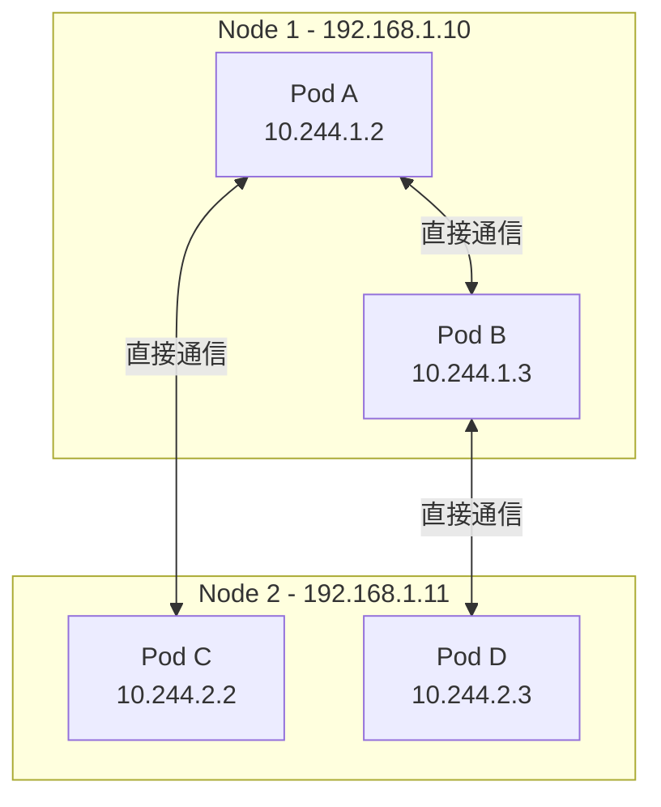
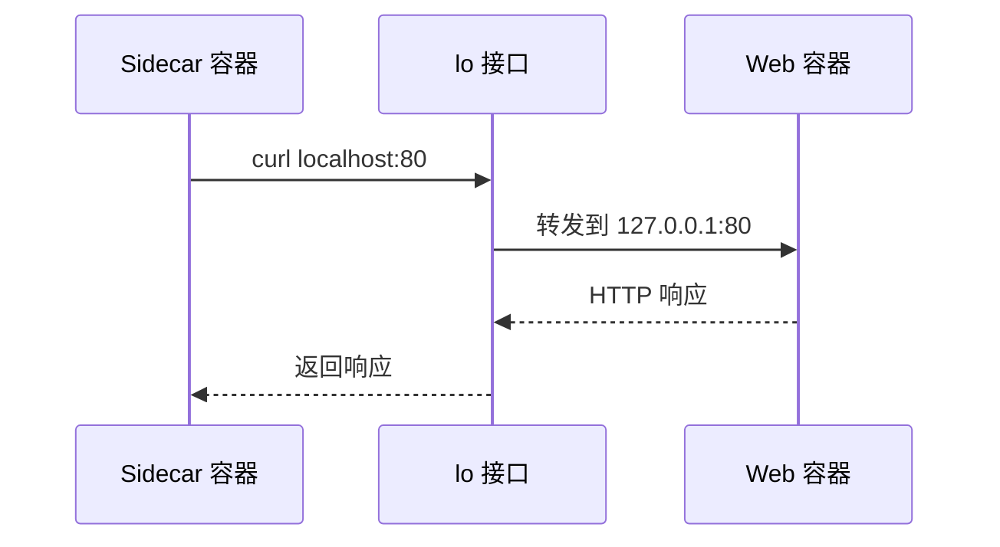
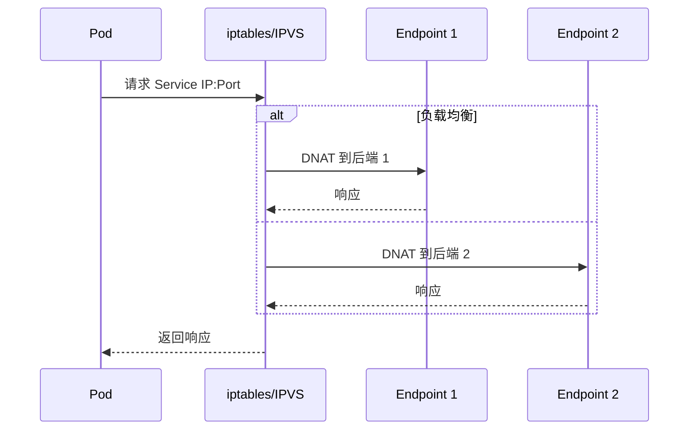
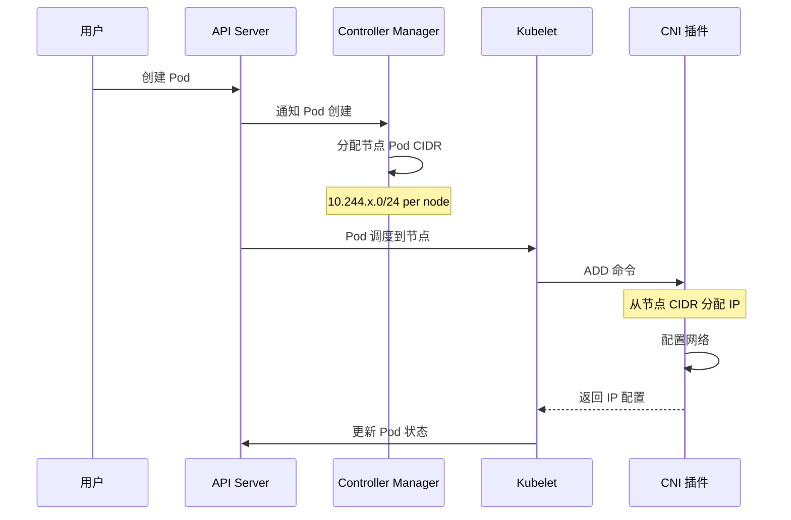

## 概述

Kubernetes 采用了一个扁平的网络模型，要求集群中的所有 Pod 能够直接相互通信，无需 NAT。这个模型简化了应用的网络配置，但对底层网络实现提出了明确的要求。本章详细介绍 Kubernetes 网络模型的设计原则、核心概念和通信场景。

## 网络模型设计原则

### 基本假设

Kubernetes 网络模型基于以下三个核心假设：

```
┌─────────────────────────────────────────────────────────────────┐
│                    Kubernetes 网络基本假设                       │
├─────────────────────────────────────────────────────────────────┤
│                                                                  │
│  1. Pod 之间可以直接通信                                         │
│     - 所有 Pod 可以在不使用 NAT 的情况下与其他 Pod 通信           │
│     - 无论 Pod 是否在同一节点                                    │
│                                                                  │
│  2. 节点与 Pod 可以直接通信                                      │
│     - 所有节点可以在不使用 NAT 的情况下与所有 Pod 通信            │
│     - 反之亦然                                                   │
│                                                                  │
│  3. Pod 看到的自身 IP 与其他 Pod 看到的相同                       │
│     - Pod 认为自己的 IP 地址就是其他 Pod 看到的 IP                │
│     - 没有地址伪装                                               │
│                                                                  │
└─────────────────────────────────────────────────────────────────┘
```

### IP-per-Pod 模型

每个 Pod 获得一个独立的 IP 地址：



### 与 Docker 网络的区别

| 特性 | Docker 默认网络 | Kubernetes 网络 |
|------|----------------|-----------------|
| IP 分配 | 每个容器一个 IP（bridge 内） | 每个 Pod 一个 IP（集群范围） |
| 跨主机通信 | 需要端口映射 | 直接通信 |
| NAT | 频繁使用 | 避免使用 |
| 服务发现 | 链接或自定义网络 | DNS + Service |
| 网络隔离 | 桥接隔离 | NetworkPolicy |

## 网络命名空间

### Pod 网络命名空间

```
┌─────────────────────────────────────────────────────────────────┐
│                         Pod                                      │
│  ┌───────────────────────────────────────────────────────────┐  │
│  │                  Network Namespace                         │  │
│  │                                                            │  │
│  │  ┌─────────────┐  ┌─────────────┐  ┌─────────────┐        │  │
│  │  │ Container A │  │ Container B │  │ Container C │        │  │
│  │  │   App       │  │   Sidecar   │  │   Logger    │        │  │
│  │  └─────────────┘  └─────────────┘  └─────────────┘        │  │
│  │                                                            │  │
│  │  ┌────────────────────────────────────────────────────┐   │  │
│  │  │                    eth0                             │   │  │
│  │  │                 10.244.1.5                          │   │  │
│  │  └────────────────────────────────────────────────────┘   │  │
│  │                         │                                  │  │
│  └─────────────────────────│──────────────────────────────────┘  │
│                            │                                     │
└────────────────────────────│─────────────────────────────────────┘
                             │
                        veth pair
                             │
                    ┌────────▼────────┐
                    │  Node Network   │
                    └─────────────────┘
```

### Pause 容器

Pause 容器（基础设施容器）负责持有 Pod 的网络命名空间：

```go
// pkg/kubelet/kuberuntime/kuberuntime_sandbox.go

// createPodSandbox 创建 Pod 沙箱
func (m *kubeGenericRuntimeManager) createPodSandbox(
    ctx context.Context,
    pod *v1.Pod,
    attempt uint32) (string, string, error) {

    // 构建沙箱配置
    podSandboxConfig, err := m.generatePodSandboxConfig(pod, attempt)
    if err != nil {
        return "", "", err
    }

    // 调用 CRI 创建沙箱
    // 这会创建 pause 容器并建立网络命名空间
    podSandBoxID, err := m.runtimeService.RunPodSandbox(ctx, podSandboxConfig, runtimeClassName)
    if err != nil {
        return "", "", err
    }

    return podSandBoxID, "", nil
}

// generatePodSandboxConfig 生成沙箱配置
func (m *kubeGenericRuntimeManager) generatePodSandboxConfig(
    pod *v1.Pod,
    attempt uint32) (*runtimeapi.PodSandboxConfig, error) {

    // 网络配置
    dnsConfig := &runtimeapi.DNSConfig{}
    if pod.Spec.DNSPolicy != v1.DNSDefault {
        dnsConfig = m.generatePodDNSConfig(pod)
    }

    // 端口映射
    portMappings := []*runtimeapi.PortMapping{}
    for _, c := range pod.Spec.Containers {
        for _, p := range c.Ports {
            portMappings = append(portMappings, &runtimeapi.PortMapping{
                HostIp:        p.HostIP,
                HostPort:      p.HostPort,
                ContainerPort: p.ContainerPort,
                Protocol:      toRuntimeProtocol(p.Protocol),
            })
        }
    }

    return &runtimeapi.PodSandboxConfig{
        Metadata: &runtimeapi.PodSandboxMetadata{
            Name:      pod.Name,
            Namespace: pod.Namespace,
            Uid:       string(pod.UID),
            Attempt:   attempt,
        },
        Hostname:     pod.Spec.Hostname,
        DnsConfig:    dnsConfig,
        PortMappings: portMappings,
        Linux: &runtimeapi.LinuxPodSandboxConfig{
            SecurityContext: &runtimeapi.LinuxSandboxSecurityContext{
                NamespaceOptions: &runtimeapi.NamespaceOption{
                    Network: podNetworkMode(pod),
                },
            },
        },
    }, nil
}
```

## 通信场景

### 1. 容器间通信（同一 Pod）

同一 Pod 内的容器共享网络命名空间，可以通过 localhost 通信：

```yaml
apiVersion: v1
kind: Pod
metadata:
  name: multi-container-pod
spec:
  containers:
    - name: web
      image: nginx
      ports:
        - containerPort: 80
    - name: sidecar
      image: curl
      command: ["sh", "-c", "while true; do curl localhost:80; sleep 5; done"]
```



### 2. Pod 间通信（同一节点）

同一节点上的 Pod 通过 Linux 桥接或直接路由通信：

```
┌─────────────────────────────────────────────────────────────────┐
│                          Node                                   │
│                                                                  │
│  ┌────────────────┐              ┌────────────────┐             │
│  │     Pod A      │              │     Pod B      │             │
│  │   10.244.1.2   │              │   10.244.1.3   │             │
│  └───────┬────────┘              └───────┬────────┘             │
│          │ veth                          │ veth                 │
│          │                               │                      │
│  ┌───────▼───────────────────────────────▼───────┐              │
│  │                    cbr0                        │              │
│  │              Linux Bridge                      │              │
│  │              10.244.1.1/24                     │              │
│  └────────────────────┬──────────────────────────┘              │
│                       │                                         │
│  ┌────────────────────▼──────────────────────────┐              │
│  │                   eth0                         │              │
│  │              192.168.1.10                      │              │
│  └────────────────────────────────────────────────┘              │
│                                                                  │
└─────────────────────────────────────────────────────────────────┘
```

### 3. Pod 间通信（跨节点）

跨节点通信需要网络插件（CNI）实现，常见方式包括：

**Overlay 网络（如 VXLAN）**：

```
┌─────────────────────┐                    ┌─────────────────────┐
│       Node 1        │                    │       Node 2        │
│                     │                    │                     │
│  ┌──────────────┐   │                    │   ┌──────────────┐  │
│  │    Pod A     │   │                    │   │    Pod B     │  │
│  │  10.244.1.2  │   │                    │   │  10.244.2.2  │  │
│  └──────┬───────┘   │                    │   └──────┬───────┘  │
│         │           │                    │          │          │
│  ┌──────▼───────┐   │                    │   ┌──────▼───────┐  │
│  │    vxlan0    │   │    Underlay Net    │   │    vxlan0    │  │
│  │   VTEP       │◄──┼────────────────────┼───│   VTEP       │  │
│  └──────┬───────┘   │                    │   └──────┬───────┘  │
│         │           │                    │          │          │
│  ┌──────▼───────┐   │                    │   ┌──────▼───────┐  │
│  │    eth0      │   │                    │   │    eth0      │  │
│  │ 192.168.1.10 │◄──┼────────────────────┼───│ 192.168.1.11 │  │
│  └──────────────┘   │                    │   └──────────────┘  │
│                     │                    │                     │
└─────────────────────┘                    └─────────────────────┘
```

**直接路由（如 BGP）**：

```
┌─────────────────────┐                    ┌─────────────────────┐
│       Node 1        │                    │       Node 2        │
│                     │                    │                     │
│  ┌──────────────┐   │                    │   ┌──────────────┐  │
│  │    Pod A     │   │                    │   │    Pod B     │  │
│  │  10.244.1.2  │   │                    │   │  10.244.2.2  │  │
│  └──────┬───────┘   │                    │   └──────┬───────┘  │
│         │           │                    │          │          │
│  路由表:             │                    │  路由表:             │
│  10.244.2.0/24      │                    │  10.244.1.0/24      │
│    via 192.168.1.11 │                    │    via 192.168.1.10 │
│         │           │                    │          │          │
│  ┌──────▼───────┐   │    Direct Route   │   ┌──────▼───────┐  │
│  │    eth0      │◄──┼────────────────────┼───│    eth0      │  │
│  │ 192.168.1.10 │   │                    │   │ 192.168.1.11 │  │
│  └──────────────┘   │                    │   └──────────────┘  │
│                     │                    │                     │
└─────────────────────┘                    └─────────────────────┘
```

### 4. Pod 到 Service 通信



### 5. 外部到 Service 通信

```
                                Internet
                                    │
                            ┌───────▼───────┐
                            │ Load Balancer │
                            │ (Cloud LB)    │
                            └───────┬───────┘
                                    │
                    ┌───────────────┼───────────────┐
                    │               │               │
            ┌───────▼───────┐ ┌─────▼─────┐ ┌──────▼──────┐
            │    Node 1     │ │  Node 2   │ │   Node 3    │
            │  NodePort:30080│ │NodePort   │ │  NodePort   │
            └───────┬───────┘ └─────┬─────┘ └──────┬──────┘
                    │               │               │
            ┌───────▼───────┐ ┌─────▼─────┐ ┌──────▼──────┐
            │ kube-proxy    │ │kube-proxy │ │ kube-proxy  │
            │ (iptables)    │ │(iptables) │ │ (iptables)  │
            └───────┬───────┘ └─────┬─────┘ └──────┬──────┘
                    │               │               │
                    └───────────────┼───────────────┘
                                    │
                            ┌───────▼───────┐
                            │  Service VIP  │
                            │  10.96.0.100  │
                            └───────┬───────┘
                                    │
                    ┌───────────────┼───────────────┐
                    │               │               │
            ┌───────▼───────┐ ┌─────▼─────┐ ┌──────▼──────┐
            │    Pod 1      │ │   Pod 2   │ │    Pod 3    │
            │  10.244.1.5   │ │10.244.2.3 │ │  10.244.3.7 │
            └───────────────┘ └───────────┘ └─────────────┘
```

## IP 地址管理

### 地址空间规划

```yaml
# 典型的 CIDR 分配
apiVersion: kubeadm.k8s.io/v1beta3
kind: ClusterConfiguration
networking:
  # Service CIDR - 虚拟 IP 范围
  serviceSubnet: "10.96.0.0/12"
  # Pod CIDR - Pod IP 范围
  podSubnet: "10.244.0.0/16"
```

### 地址分配流程



### IPAM 实现

```go
// CNI host-local IPAM 实现示例
type IPAMConfig struct {
    Type   string   `json:"type"`
    Subnet string   `json:"subnet"`
    Routes []Route  `json:"routes"`
}

func allocateIP(subnet *net.IPNet, reserved map[string]bool) (net.IP, error) {
    // 遍历子网中的 IP
    ip := subnet.IP.Mask(subnet.Mask)

    for {
        ip = nextIP(ip)

        // 检查是否超出范围
        if !subnet.Contains(ip) {
            return nil, errors.New("no available IPs")
        }

        // 跳过网络地址和广播地址
        if isReserved(ip, subnet) {
            continue
        }

        // 检查是否已分配
        if !reserved[ip.String()] {
            reserved[ip.String()] = true
            return ip, nil
        }
    }
}
```

## 网络策略

### 默认行为

默认情况下，Kubernetes 中所有 Pod 都可以相互通信：

```
┌─────────────────────────────────────────────────────────────────┐
│                    默认网络行为                                  │
├─────────────────────────────────────────────────────────────────┤
│                                                                  │
│  - 所有 Pod 可以接收来自任何来源的流量                            │
│  - 所有 Pod 可以向任何目标发送流量                                │
│  - 没有网络隔离                                                  │
│                                                                  │
│  NetworkPolicy 可以改变这种行为:                                  │
│  - 选择特定 Pod 应用策略                                         │
│  - 定义允许的入站流量规则                                        │
│  - 定义允许的出站流量规则                                        │
│                                                                  │
└─────────────────────────────────────────────────────────────────┘
```

### NetworkPolicy 示例

```yaml
apiVersion: networking.k8s.io/v1
kind: NetworkPolicy
metadata:
  name: db-network-policy
  namespace: production
spec:
  # 选择应用策略的 Pod
  podSelector:
    matchLabels:
      app: database
  # 策略类型
  policyTypes:
    - Ingress
    - Egress
  # 入站规则
  ingress:
    - from:
        # 允许来自 app=backend 的 Pod
        - podSelector:
            matchLabels:
              app: backend
        # 允许来自 monitoring 命名空间
        - namespaceSelector:
            matchLabels:
              name: monitoring
      ports:
        - protocol: TCP
          port: 5432
  # 出站规则
  egress:
    - to:
        # 允许访问 DNS
        - namespaceSelector: {}
          podSelector:
            matchLabels:
              k8s-app: kube-dns
      ports:
        - protocol: UDP
          port: 53
```

## 网络插件接口

### CNI 规范概述

CNI（Container Network Interface）定义了容器网络配置的标准接口：

```go
// CNI 插件接口
type CNI interface {
    // AddNetworkList 添加网络配置列表
    AddNetworkList(ctx context.Context, net *NetworkConfigList, rt *RuntimeConf) (types.Result, error)

    // DelNetworkList 删除网络配置列表
    DelNetworkList(ctx context.Context, net *NetworkConfigList, rt *RuntimeConf) error

    // CheckNetworkList 检查网络配置
    CheckNetworkList(ctx context.Context, net *NetworkConfigList, rt *RuntimeConf) error

    // GetNetworkListCachedResult 获取缓存结果
    GetNetworkListCachedResult(net *NetworkConfigList, rt *RuntimeConf) (types.Result, error)
}
```

### Kubelet CNI 集成

```go
// pkg/kubelet/network/cni/cni.go

type cniNetworkPlugin struct {
    network.NoopNetworkPlugin

    loNetwork       *cniNetwork
    defaultNetwork  *cniNetwork
    host            network.Host
    execer          utilexec.Interface
    cniConfig       *libcni.CNIConfig
    confDir         string
    binDirs         []string
}

// SetUpPod 设置 Pod 网络
func (plugin *cniNetworkPlugin) SetUpPod(
    namespace string,
    name string,
    id kubecontainer.ContainerID,
    annotations, options map[string]string) error {

    if err := plugin.checkInitialized(); err != nil {
        return err
    }

    netnsPath, err := plugin.host.GetNetNS(id.ID)
    if err != nil {
        return fmt.Errorf("CNI failed to retrieve network namespace path: %v", err)
    }

    // 准备 CNI 运行时配置
    rt, err := plugin.buildCNIRuntimeConf(namespace, name, id, netnsPath, options)
    if err != nil {
        return err
    }

    // 调用 CNI 添加网络
    _, err = plugin.addToNetwork(cniTimeoutCtx, plugin.defaultNetwork, name, namespace, id, netnsPath, rt)
    return err
}

// TearDownPod 清理 Pod 网络
func (plugin *cniNetworkPlugin) TearDownPod(
    namespace string,
    name string,
    id kubecontainer.ContainerID) error {

    if err := plugin.checkInitialized(); err != nil {
        return err
    }

    netnsPath, err := plugin.host.GetNetNS(id.ID)
    if err != nil && !os.IsNotExist(err) {
        return fmt.Errorf("CNI failed to retrieve network namespace path: %v", err)
    }

    // 准备运行时配置
    rt, _ := plugin.buildCNIRuntimeConf(namespace, name, id, netnsPath, nil)

    // 调用 CNI 删除网络
    return plugin.deleteFromNetwork(cniTimeoutCtx, plugin.defaultNetwork, name, namespace, id, netnsPath, rt)
}
```

## 网络性能优化

### 关键性能指标

| 指标 | 描述 | 优化方向 |
|------|------|----------|
| Pod 启动延迟 | CNI 配置网络的时间 | 减少 CNI 插件复杂度 |
| 吞吐量 | 网络传输带宽 | 避免不必要的封装 |
| 延迟 | 端到端网络延迟 | 使用直接路由代替 Overlay |
| 连接数 | 并发连接数量 | 优化 conntrack 表大小 |

### 优化建议

```yaml
# 1. 选择合适的 CNI 插件
# - Calico BGP: 适合大规模集群，直接路由
# - Cilium: 适合需要高级网络策略的场景
# - Flannel VXLAN: 简单部署，有封装开销

# 2. 内核参数优化
# sysctl.conf
net.core.somaxconn = 65535
net.core.netdev_max_backlog = 65535
net.ipv4.tcp_max_syn_backlog = 65535
net.netfilter.nf_conntrack_max = 1048576

# 3. 禁用不需要的功能
# 如果不需要 NetworkPolicy，使用不带策略的 CNI
```

## 总结

Kubernetes 网络模型的核心特点：
- **扁平网络**：所有 Pod 可以直接通信
- **IP-per-Pod**：每个 Pod 有独立 IP
- **无 NAT**：Pod 看到的 IP 与外部一致
- **CNI 标准**：统一的网络插件接口

选择网络方案时需要考虑：
- 集群规模和性能需求
- 网络策略复杂度
- 运维和调试便利性
- 与现有基础设施的集成
