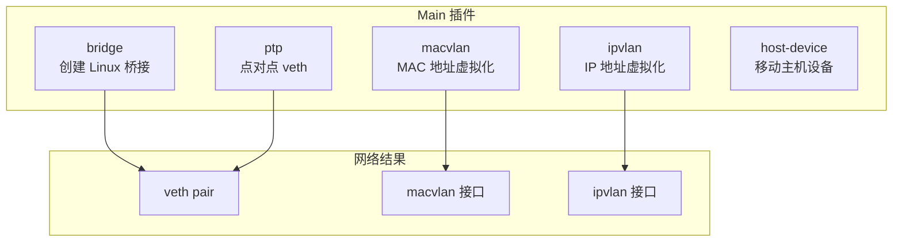
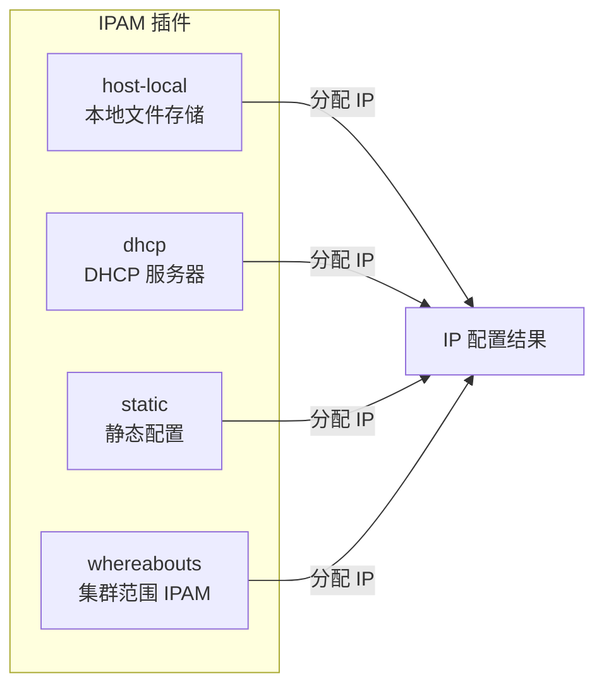
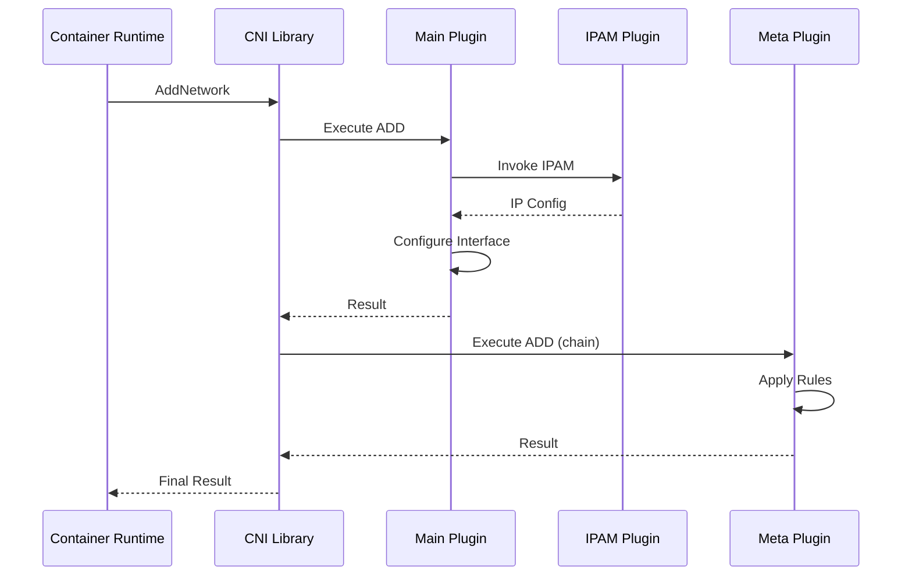
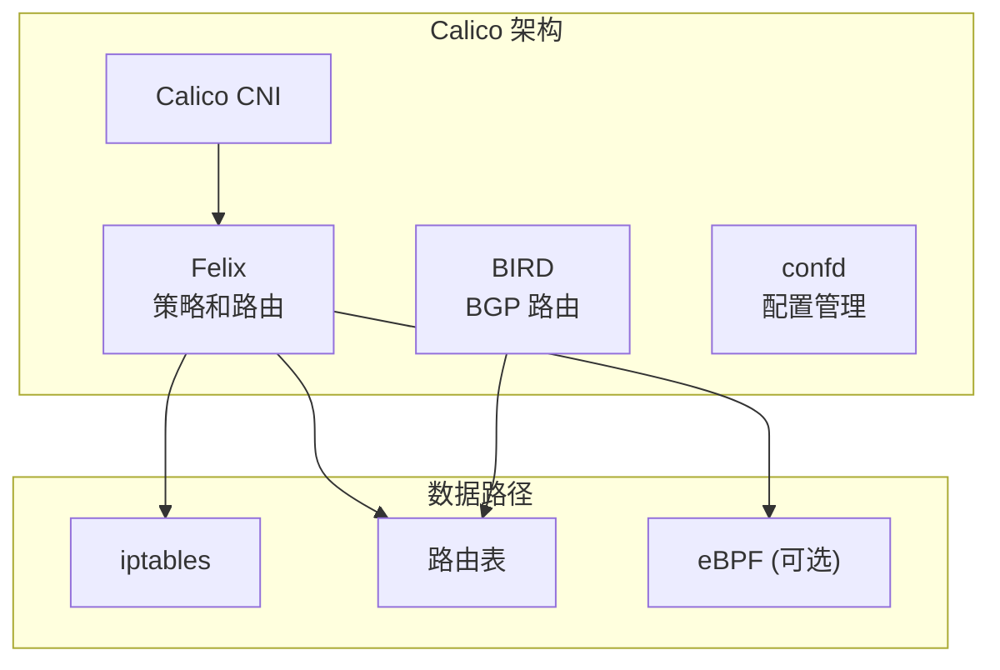
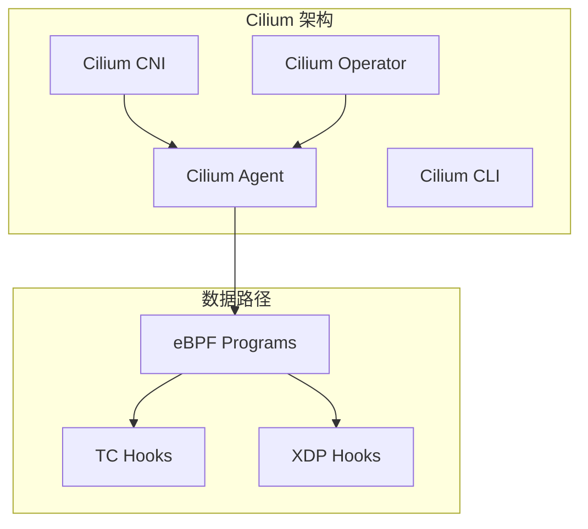

## 概述

CNI（Container Network Interface）是 CNCF 项目，定义了容器网络配置的标准接口规范。Kubernetes 通过 CNI 插件实现 Pod 网络的配置和管理。本章深入解析 CNI 规范、插件类型、调用流程以及与 Kubelet 的集成机制。

## CNI 规范

### 设计目标

```
┌─────────────────────────────────────────────────────────────────┐
│                       CNI 设计目标                               │
├─────────────────────────────────────────────────────────────────┤
│                                                                  │
│  1. 简单性                                                       │
│     - 最小化接口定义                                             │
│     - 使用环境变量和 stdin 传递参数                              │
│                                                                  │
│  2. 可组合性                                                     │
│     - 插件可以链式调用                                           │
│     - 不同插件负责不同功能                                       │
│                                                                  │
│  3. 容器运行时无关                                               │
│     - 适用于 Docker, containerd, CRI-O 等                       │
│     - 不依赖特定实现                                             │
│                                                                  │
└─────────────────────────────────────────────────────────────────┘
```

### 接口定义

CNI 定义了 4 个核心操作：

```
┌──────────────────────────────────────────────────────────────────┐
│                        CNI 操作                                  │
├──────────────┬───────────────────────────────────────────────────┤
│    操作      │                    描述                           │
├──────────────┼───────────────────────────────────────────────────┤
│    ADD       │  将容器添加到网络，配置网络接口                    │
│    DEL       │  从网络中移除容器，清理网络配置                    │
│    CHECK     │  检查容器网络配置是否符合预期                      │
│    VERSION   │  报告插件支持的 CNI 版本                          │
└──────────────┴───────────────────────────────────────────────────┘
```

### 配置格式

CNI 配置文件示例（/etc/cni/net.d/10-bridge.conflist）：

```json
{
  "cniVersion": "1.0.0",
  "name": "my-network",
  "plugins": [
    {
      "type": "bridge",
      "bridge": "cni0",
      "isGateway": true,
      "ipMasq": true,
      "ipam": {
        "type": "host-local",
        "subnet": "10.244.0.0/16",
        "routes": [
          { "dst": "0.0.0.0/0" }
        ]
      }
    },
    {
      "type": "portmap",
      "capabilities": {
        "portMappings": true
      }
    },
    {
      "type": "bandwidth",
      "ingressRate": 1000000,
      "ingressBurst": 1000000,
      "egressRate": 1000000,
      "egressBurst": 1000000
    }
  ]
}
```

### 运行时参数

CNI 插件通过环境变量接收运行时参数：

| 环境变量 | 描述 |
|----------|------|
| CNI_COMMAND | 操作类型（ADD/DEL/CHECK/VERSION） |
| CNI_CONTAINERID | 容器 ID |
| CNI_NETNS | 网络命名空间路径（如 /proc/1234/ns/net） |
| CNI_IFNAME | 容器内网络接口名（如 eth0） |
| CNI_ARGS | 额外参数（key=value 格式） |
| CNI_PATH | CNI 插件搜索路径 |

## 插件类型

### Main 插件

负责创建网络接口的核心插件：



**Bridge 插件**：

```go
// 创建 bridge 和 veth pair
func setupBridge(n *NetConf) (*netlink.Bridge, error) {
    // 创建或获取桥接
    br, err := ensureBridge(n.BrName, n.MTU, n.PromiscMode)
    if err != nil {
        return nil, err
    }

    return br, nil
}

func setupVeth(netns ns.NetNS, br *netlink.Bridge, ifName string, mtu int) (*current.Interface, *current.Interface, error) {
    // 在 host 和容器之间创建 veth pair
    hostInterface := &current.Interface{}
    containerInterface := &current.Interface{}

    err := netns.Do(func(hostNS ns.NetNS) error {
        // 创建 veth pair
        hostVeth, containerVeth, err := ip.SetupVeth(ifName, mtu, hostNS)
        if err != nil {
            return err
        }

        hostInterface.Name = hostVeth.Name
        hostInterface.Mac = hostVeth.HardwareAddr.String()
        containerInterface.Name = containerVeth.Name
        containerInterface.Mac = containerVeth.HardwareAddr.String()
        containerInterface.Sandbox = netns.Path()

        return nil
    })

    // 将 host 端 veth 连接到桥接
    hostVeth, _ := netlink.LinkByName(hostInterface.Name)
    if err := netlink.LinkSetMaster(hostVeth, br); err != nil {
        return nil, nil, err
    }

    return hostInterface, containerInterface, nil
}
```

### IPAM 插件

负责 IP 地址管理的插件：



**host-local 实现**：

```go
// host-local IPAM 插件
func cmdAdd(args *skel.CmdArgs) error {
    ipamConf, confVersion, err := allocator.LoadIPAMConfig(args.StdinData, args.Args)
    if err != nil {
        return err
    }

    result := &current.Result{}

    // 为每个配置的范围分配 IP
    for idx, rangeset := range ipamConf.Ranges {
        allocator := allocator.NewIPAllocator(&rangeset, store, idx)

        ipConf, err := allocator.Get(args.ContainerID, args.IfName)
        if err != nil {
            return err
        }

        result.IPs = append(result.IPs, ipConf)
    }

    // 添加路由
    result.Routes = ipamConf.Routes

    return types.PrintResult(result, confVersion)
}

// IPAllocator IP 分配器
type IPAllocator struct {
    rangeset *RangeSet
    store    Store
    rangeID  string
}

func (a *IPAllocator) Get(id string, ifname string) (*current.IPConfig, error) {
    a.store.Lock()
    defer a.store.Unlock()

    // 遍历范围查找可用 IP
    for _, r := range *a.rangeset {
        ip, gw, err := a.allocateFromRange(r, id, ifname)
        if err == nil {
            return &current.IPConfig{
                Address: net.IPNet{IP: ip, Mask: r.Subnet.Mask},
                Gateway: gw,
            }, nil
        }
    }

    return nil, errors.New("no available IPs")
}
```

### Meta 插件

处理额外功能的插件：

| 插件 | 功能 |
|------|------|
| portmap | 端口映射（DNAT） |
| bandwidth | 带宽限制（tc） |
| tuning | 系统参数调整 |
| firewall | 防火墙规则 |
| sbr | 源路由 |

**bandwidth 插件**：

```go
// bandwidth 插件使用 tc 实现流量控制
func cmdAdd(args *skel.CmdArgs) error {
    conf, err := parseConfig(args.StdinData)
    if err != nil {
        return err
    }

    // 获取容器接口
    link, err := netlink.LinkByName(args.IfName)
    if err != nil {
        return err
    }

    // 配置入站限制（使用 ingress qdisc + police）
    if conf.IngressRate > 0 {
        if err := createIngressQdisc(link, conf.IngressRate, conf.IngressBurst); err != nil {
            return err
        }
    }

    // 配置出站限制（使用 htb qdisc）
    if conf.EgressRate > 0 {
        if err := createEgressQdisc(link, conf.EgressRate, conf.EgressBurst); err != nil {
            return err
        }
    }

    return types.PrintResult(conf.PrevResult, conf.CNIVersion)
}

func createIngressQdisc(link netlink.Link, rate, burst uint64) error {
    // 创建 ingress qdisc
    ingress := &netlink.Ingress{
        QdiscAttrs: netlink.QdiscAttrs{
            LinkIndex: link.Attrs().Index,
            Parent:    netlink.HANDLE_INGRESS,
        },
    }
    if err := netlink.QdiscAdd(ingress); err != nil {
        return err
    }

    // 添加 police filter
    filter := &netlink.U32{
        FilterAttrs: netlink.FilterAttrs{
            LinkIndex: link.Attrs().Index,
            Parent:    netlink.MakeHandle(0xffff, 0),
            Priority:  1,
        },
        Actions: []netlink.Action{
            &netlink.PoliceAction{
                Rate:  uint32(rate),
                Burst: uint32(burst),
            },
        },
    }
    return netlink.FilterAdd(filter)
}
```

## 插件链调用

### 调用流程



### 结果传递

每个插件的结果传递给下一个插件：

```go
// CNI 库执行插件链
func (c *CNIConfig) addNetwork(
    ctx context.Context,
    net *NetworkConfigList,
    rt *RuntimeConf) (types.Result, error) {

    var prevResult types.Result

    for _, netConf := range net.Plugins {
        // 将前一个插件的结果作为当前插件的输入
        if prevResult != nil {
            netConf.PrevResult = prevResult
        }

        // 执行插件
        result, err := c.addNetworkPlugin(ctx, netConf, rt)
        if err != nil {
            return nil, err
        }

        prevResult = result
    }

    return prevResult, nil
}
```

### 结果格式

```go
// CNI 0.4.0+ 结果格式
type Result struct {
    CNIVersion string         `json:"cniVersion,omitempty"`
    Interfaces []*Interface   `json:"interfaces,omitempty"`
    IPs        []*IPConfig    `json:"ips,omitempty"`
    Routes     []*types.Route `json:"routes,omitempty"`
    DNS        types.DNS      `json:"dns,omitempty"`
}

type Interface struct {
    Name    string `json:"name"`
    Mac     string `json:"mac,omitempty"`
    Sandbox string `json:"sandbox,omitempty"` // netns path
}

type IPConfig struct {
    Interface *int         `json:"interface,omitempty"`
    Address   net.IPNet    `json:"address"`
    Gateway   net.IP       `json:"gateway,omitempty"`
}
```

## Kubelet CNI 集成

### 初始化流程

```go
// pkg/kubelet/network/cni/cni.go

// ProbeNetworkPlugins 探测可用的 CNI 插件
func ProbeNetworkPlugins(confDir, binDirs string) []network.NetworkPlugin {
    // 扫描配置目录
    confFiles, err := filepath.Glob(filepath.Join(confDir, "*.conf*"))
    if err != nil {
        return nil
    }

    var plugins []network.NetworkPlugin

    // 解析每个配置文件
    for _, f := range confFiles {
        if strings.HasSuffix(f, ".conflist") {
            conf, err := libcni.ConfListFromFile(f)
            if err != nil {
                continue
            }
            plugins = append(plugins, &cniNetworkPlugin{
                defaultNetwork: &cniNetwork{
                    name:          conf.Name,
                    NetworkConfig: conf,
                },
                confDir: confDir,
                binDirs: strings.Split(binDirs, string(os.PathListSeparator)),
            })
        }
    }

    return plugins
}

// Init 初始化 CNI 插件
func (plugin *cniNetworkPlugin) Init(host network.Host, hairpinMode kubeletconfig.HairpinMode) error {
    plugin.host = host

    // 创建 CNI 配置
    plugin.cniConfig = &libcni.CNIConfig{
        Path: plugin.binDirs,
        Exec: &rawExec{},
    }

    // 监听配置变化
    go wait.Forever(func() {
        plugin.syncNetworkConfig()
    }, network.DefaultSyncPeriod)

    return nil
}
```

### SetUpPod 实现

```go
// SetUpPod 配置 Pod 网络
func (plugin *cniNetworkPlugin) SetUpPod(
    namespace string,
    name string,
    id kubecontainer.ContainerID,
    annotations, options map[string]string) error {

    // 1. 检查插件是否初始化
    if err := plugin.checkInitialized(); err != nil {
        return err
    }

    // 2. 获取网络命名空间路径
    netnsPath, err := plugin.host.GetNetNS(id.ID)
    if err != nil {
        return fmt.Errorf("CNI failed to retrieve network namespace path: %v", err)
    }

    // 3. 构建 CNI 运行时配置
    rt, err := plugin.buildCNIRuntimeConf(namespace, name, id, netnsPath, options)
    if err != nil {
        return err
    }

    // 4. 调用 CNI ADD
    _, err = plugin.addToNetwork(cniTimeoutCtx, plugin.defaultNetwork, name, namespace, id, netnsPath, rt)
    if err != nil {
        return err
    }

    return nil
}

// buildCNIRuntimeConf 构建 CNI 运行时配置
func (plugin *cniNetworkPlugin) buildCNIRuntimeConf(
    namespace, name string,
    id kubecontainer.ContainerID,
    netnsPath string,
    options map[string]string) (*libcni.RuntimeConf, error) {

    rt := &libcni.RuntimeConf{
        ContainerID: id.ID,
        NetNS:       netnsPath,
        IfName:      network.DefaultInterfaceName, // eth0
        CacheDir:    plugin.cacheDir,
        Args: [][2]string{
            {"IgnoreUnknown", "1"},
            {"K8S_POD_NAMESPACE", namespace},
            {"K8S_POD_NAME", name},
            {"K8S_POD_INFRA_CONTAINER_ID", id.ID},
        },
    }

    // 添加端口映射
    if portMappings, ok := options["portMappings"]; ok {
        rt.CapabilityArgs = map[string]interface{}{
            "portMappings": portMappings,
        }
    }

    // 添加带宽限制
    if bandwidth, ok := options["bandwidth"]; ok {
        rt.CapabilityArgs["bandwidth"] = bandwidth
    }

    return rt, nil
}

// addToNetwork 添加到网络
func (plugin *cniNetworkPlugin) addToNetwork(
    ctx context.Context,
    network *cniNetwork,
    podName, podNamespace string,
    id kubecontainer.ContainerID,
    netns string,
    rt *libcni.RuntimeConf) (cnitypes.Result, error) {

    // 调用 CNI 库
    result, err := plugin.cniConfig.AddNetworkList(ctx, network.NetworkConfig, rt)
    if err != nil {
        return nil, err
    }

    klog.V(4).InfoS("CNI result", "result", result)
    return result, nil
}
```

### TearDownPod 实现

```go
// TearDownPod 清理 Pod 网络
func (plugin *cniNetworkPlugin) TearDownPod(
    namespace string,
    name string,
    id kubecontainer.ContainerID) error {

    if err := plugin.checkInitialized(); err != nil {
        return err
    }

    // 获取网络命名空间
    netnsPath, err := plugin.host.GetNetNS(id.ID)
    if err != nil && !os.IsNotExist(err) {
        return fmt.Errorf("CNI failed to retrieve network namespace path: %v", err)
    }

    // 构建运行时配置
    rt, _ := plugin.buildCNIRuntimeConf(namespace, name, id, netnsPath, nil)

    // 调用 CNI DEL
    return plugin.deleteFromNetwork(cniTimeoutCtx, plugin.defaultNetwork, name, namespace, id, netnsPath, rt)
}

func (plugin *cniNetworkPlugin) deleteFromNetwork(
    ctx context.Context,
    network *cniNetwork,
    podName, podNamespace string,
    id kubecontainer.ContainerID,
    netns string,
    rt *libcni.RuntimeConf) error {

    // DEL 操作应该是幂等的
    err := plugin.cniConfig.DelNetworkList(ctx, network.NetworkConfig, rt)
    if err != nil {
        klog.ErrorS(err, "CNI failed to delete network", "network", network.name)
        // 不返回错误，允许 Pod 清理继续
    }

    return nil
}
```

## 常见 CNI 实现

### Calico



### Cilium



### Flannel

```yaml
# Flannel 配置示例
apiVersion: v1
kind: ConfigMap
metadata:
  name: kube-flannel-cfg
data:
  cni-conf.json: |
    {
      "name": "cbr0",
      "cniVersion": "0.3.1",
      "plugins": [
        {
          "type": "flannel",
          "delegate": {
            "hairpinMode": true,
            "isDefaultGateway": true
          }
        },
        {
          "type": "portmap",
          "capabilities": {
            "portMappings": true
          }
        }
      ]
    }
  net-conf.json: |
    {
      "Network": "10.244.0.0/16",
      "Backend": {
        "Type": "vxlan"
      }
    }
```

### CNI 实现对比

| 特性 | Calico | Cilium | Flannel | Weave |
|------|--------|--------|---------|-------|
| 数据平面 | iptables/eBPF | eBPF | VXLAN/host-gw | VXLAN/sleeve |
| 网络策略 | 是 | 是（L7） | 否 | 是 |
| 路由模式 | BGP/IPIP | 直接/隧道 | Overlay | Overlay |
| 性能 | 高 | 高 | 中 | 中 |
| 复杂度 | 中 | 高 | 低 | 低 |

## 开发自定义 CNI 插件

### 插件骨架

```go
package main

import (
    "github.com/containernetworking/cni/pkg/skel"
    "github.com/containernetworking/cni/pkg/types"
    current "github.com/containernetworking/cni/pkg/types/100"
    "github.com/containernetworking/cni/pkg/version"
    bv "github.com/containernetworking/plugins/pkg/utils/buildversion"
)

func main() {
    skel.PluginMain(cmdAdd, cmdCheck, cmdDel, version.All, bv.BuildString("my-cni"))
}

func cmdAdd(args *skel.CmdArgs) error {
    // 1. 解析配置
    conf, err := parseConfig(args.StdinData)
    if err != nil {
        return err
    }

    // 2. 进入容器网络命名空间
    netns, err := ns.GetNS(args.Netns)
    if err != nil {
        return err
    }
    defer netns.Close()

    // 3. 创建网络接口
    hostInterface, containerInterface, err := setupVeth(netns, args.IfName, conf.MTU)
    if err != nil {
        return err
    }

    // 4. 调用 IPAM 分配 IP
    result, err := ipam.ExecAdd(conf.IPAM.Type, args.StdinData)
    if err != nil {
        return err
    }
    ipamResult, err := current.NewResultFromResult(result)
    if err != nil {
        return err
    }

    // 5. 配置容器接口
    if err := configureInterface(netns, args.IfName, ipamResult); err != nil {
        return err
    }

    // 6. 构建结果
    finalResult := &current.Result{
        CNIVersion: conf.CNIVersion,
        Interfaces: []*current.Interface{hostInterface, containerInterface},
        IPs:        ipamResult.IPs,
        Routes:     ipamResult.Routes,
        DNS:        ipamResult.DNS,
    }

    return types.PrintResult(finalResult, conf.CNIVersion)
}

func cmdDel(args *skel.CmdArgs) error {
    conf, err := parseConfig(args.StdinData)
    if err != nil {
        return err
    }

    // 释放 IPAM
    if err := ipam.ExecDel(conf.IPAM.Type, args.StdinData); err != nil {
        return err
    }

    // 清理接口
    if args.Netns != "" {
        err := ns.WithNetNSPath(args.Netns, func(_ ns.NetNS) error {
            link, err := netlink.LinkByName(args.IfName)
            if err != nil {
                if _, ok := err.(netlink.LinkNotFoundError); ok {
                    return nil
                }
                return err
            }
            return netlink.LinkDel(link)
        })
        if err != nil {
            return err
        }
    }

    return nil
}

func cmdCheck(args *skel.CmdArgs) error {
    // 检查网络配置是否符合预期
    return nil
}
```

### 测试插件

```bash
# 使用 cnitool 测试
export CNI_PATH=/opt/cni/bin
export NETCONFPATH=/etc/cni/net.d

# 创建网络命名空间
ip netns add test

# ADD 操作
cnitool add my-network /var/run/netns/test

# 查看结果
ip netns exec test ip addr

# DEL 操作
cnitool del my-network /var/run/netns/test

# 清理
ip netns del test
```

## 总结

CNI 架构的核心要点：
- **简单接口**：ADD/DEL/CHECK/VERSION 四个操作
- **插件可组合**：Main + IPAM + Meta 插件链
- **运行时无关**：适用于各种容器运行时
- **Kubelet 集成**：通过配置文件自动加载

选择 CNI 插件时需要考虑：
- 网络模式（Overlay vs 直接路由）
- 网络策略支持
- 性能需求
- 运维复杂度
