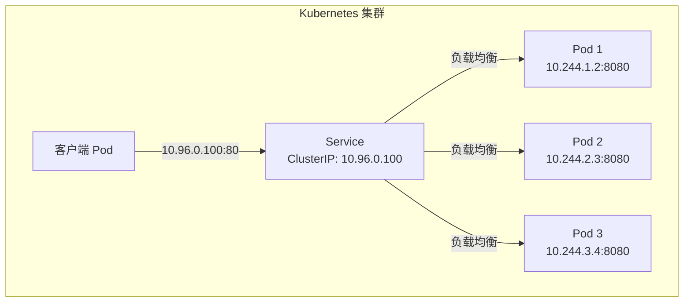
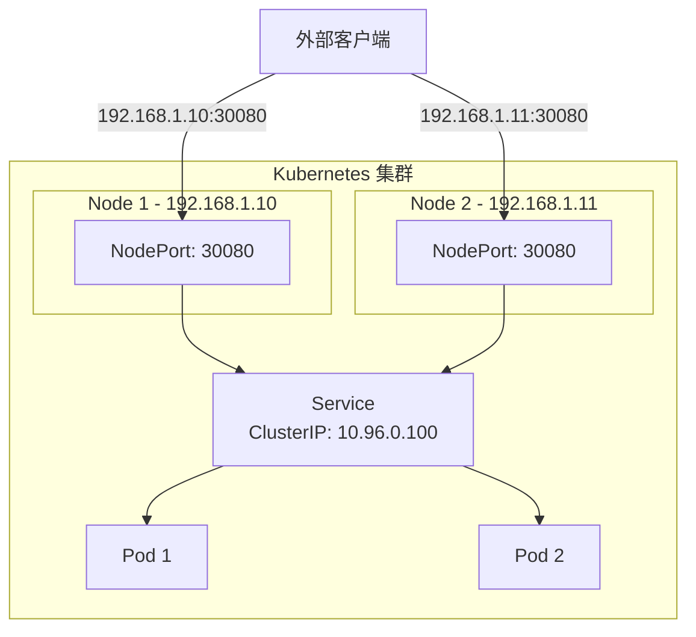
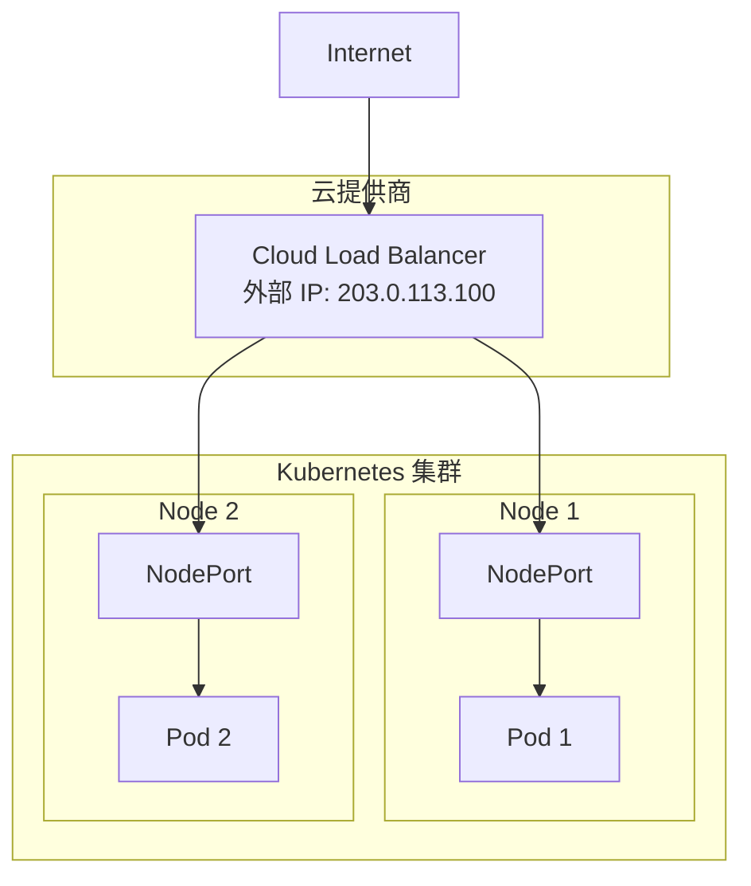
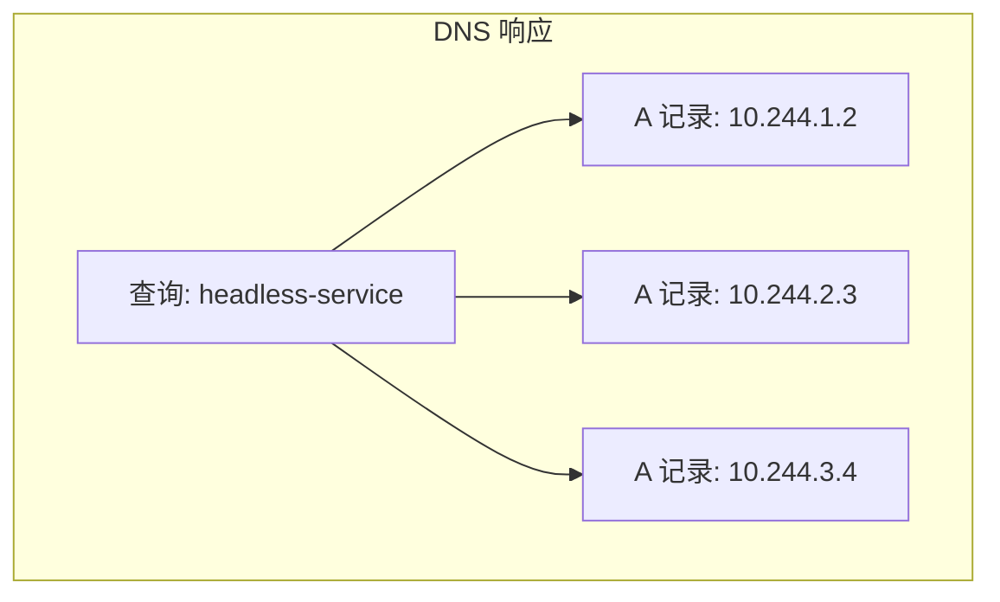
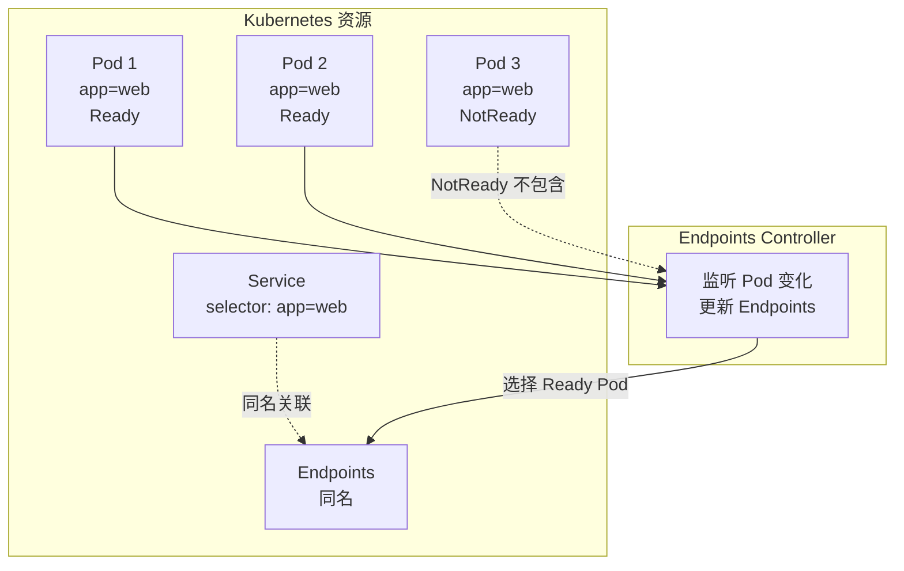
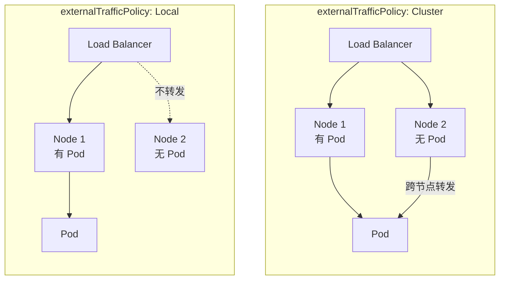
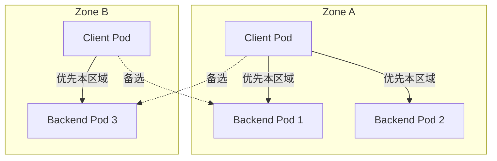

## 概述

Service 是 Kubernetes 中实现服务发现和负载均衡的核心抽象。它为一组 Pod 提供稳定的访问入口，解决了 Pod IP 地址动态变化的问题。本章深入解析 Service 的概念、类型、实现机制以及 Endpoints 的工作原理。

## Service 核心概念

### 为什么需要 Service

```
┌─────────────────────────────────────────────────────────────────┐
│                    Service 解决的问题                            │
├─────────────────────────────────────────────────────────────────┤
│                                                                  │
│  问题 1: Pod IP 地址不稳定                                       │
│  ├── Pod 重启后 IP 会变化                                        │
│  ├── Pod 扩缩容时 IP 会增减                                      │
│  └── 客户端无法硬编码 Pod IP                                     │
│                                                                  │
│  问题 2: 负载均衡                                                │
│  ├── 多副本 Pod 需要流量分发                                     │
│  ├── 需要健康检查和故障转移                                      │
│  └── 客户端不应关心后端细节                                      │
│                                                                  │
│  Service 解决方案:                                               │
│  ├── 提供稳定的虚拟 IP（ClusterIP）                              │
│  ├── 通过标签选择器关联 Pod                                      │
│  ├── 自动更新后端 Endpoints                                      │
│  └── 透明的负载均衡                                              │
│                                                                  │
└─────────────────────────────────────────────────────────────────┘
```

### Service 资源定义

```yaml
apiVersion: v1
kind: Service
metadata:
  name: my-service
  namespace: default
spec:
  # Service 类型
  type: ClusterIP

  # 选择器：匹配 Pod 标签
  selector:
    app: my-app
    version: v1

  # 端口定义
  ports:
    - name: http
      protocol: TCP
      port: 80        # Service 端口
      targetPort: 8080 # Pod 端口

  # 会话亲和性
  sessionAffinity: None
  # sessionAffinityConfig:
  #   clientIP:
  #     timeoutSeconds: 10800

  # ClusterIP（可选，自动分配）
  # clusterIP: 10.96.0.100

  # 内部流量策略
  internalTrafficPolicy: Cluster
```

## Service 类型

### ClusterIP

集群内部访问的默认类型：



```yaml
apiVersion: v1
kind: Service
metadata:
  name: internal-service
spec:
  type: ClusterIP  # 默认类型
  selector:
    app: backend
  ports:
    - port: 80
      targetPort: 8080
```

### NodePort

通过节点端口暴露服务：



```yaml
apiVersion: v1
kind: Service
metadata:
  name: nodeport-service
spec:
  type: NodePort
  selector:
    app: web
  ports:
    - port: 80
      targetPort: 8080
      nodePort: 30080  # 范围：30000-32767
```

### LoadBalancer

使用云提供商的负载均衡器：



```yaml
apiVersion: v1
kind: Service
metadata:
  name: loadbalancer-service
spec:
  type: LoadBalancer
  selector:
    app: web
  ports:
    - port: 80
      targetPort: 8080
  # 云提供商特定注解
  # annotations:
  #   service.beta.kubernetes.io/aws-load-balancer-type: nlb
```

### ExternalName

将 Service 映射到外部 DNS 名称：

```yaml
apiVersion: v1
kind: Service
metadata:
  name: external-db
spec:
  type: ExternalName
  externalName: db.example.com  # 外部服务 DNS
```


### Headless Service

无 ClusterIP 的 Service，用于服务发现：

```yaml
apiVersion: v1
kind: Service
metadata:
  name: headless-service
spec:
  clusterIP: None  # 关键配置
  selector:
    app: stateful-app
  ports:
    - port: 80
      targetPort: 8080
```



## Endpoints 机制

### Endpoints 与 Service 关系



### Endpoints 资源

```yaml
apiVersion: v1
kind: Endpoints
metadata:
  name: my-service  # 与 Service 同名
  namespace: default
subsets:
  - addresses:
      # Ready Pod 的 IP
      - ip: 10.244.1.2
        nodeName: node1
        targetRef:
          kind: Pod
          name: my-pod-1
          namespace: default
      - ip: 10.244.2.3
        nodeName: node2
        targetRef:
          kind: Pod
          name: my-pod-2
          namespace: default
    # NotReady Pod 的 IP
    notReadyAddresses:
      - ip: 10.244.3.4
        nodeName: node3
        targetRef:
          kind: Pod
          name: my-pod-3
          namespace: default
    ports:
      - name: http
        port: 8080
        protocol: TCP
```

### Endpoints Controller

```go
// pkg/controller/endpoint/endpoints_controller.go

// syncService 同步 Service 的 Endpoints
func (e *Controller) syncService(key string) error {
    namespace, name, err := cache.SplitMetaNamespaceKey(key)
    if err != nil {
        return err
    }

    // 获取 Service
    service, err := e.serviceLister.Services(namespace).Get(name)
    if errors.IsNotFound(err) {
        // Service 不存在，删除对应的 Endpoints
        return e.client.CoreV1().Endpoints(namespace).Delete(
            context.TODO(), name, metav1.DeleteOptions{})
    }
    if err != nil {
        return err
    }

    // 无选择器的 Service 不管理 Endpoints
    if service.Spec.Selector == nil {
        return nil
    }

    // 获取匹配的 Pod
    pods, err := e.podLister.Pods(namespace).List(
        labels.SelectorFromSet(service.Spec.Selector))
    if err != nil {
        return err
    }

    // 构建 Endpoints subsets
    subsets := []v1.EndpointSubset{}
    for _, pod := range pods {
        if !IsPodReady(pod) {
            // NotReady Pod 放入 notReadyAddresses
            continue
        }

        // 获取 Pod IP
        if pod.Status.PodIP == "" {
            continue
        }

        // 构建 EndpointAddress
        epa := v1.EndpointAddress{
            IP:       pod.Status.PodIP,
            NodeName: &pod.Spec.NodeName,
            TargetRef: &v1.ObjectReference{
                Kind:      "Pod",
                Namespace: pod.Namespace,
                Name:      pod.Name,
                UID:       pod.UID,
            },
        }

        // 添加到对应的 subset
        subsets = addToSubsets(subsets, epa, service.Spec.Ports)
    }

    // 创建或更新 Endpoints
    currentEndpoints, err := e.endpointsLister.Endpoints(namespace).Get(name)
    if errors.IsNotFound(err) {
        // 创建新的 Endpoints
        newEndpoints := &v1.Endpoints{
            ObjectMeta: metav1.ObjectMeta{
                Name:      name,
                Namespace: namespace,
                Labels:    service.Labels,
            },
            Subsets: subsets,
        }
        _, err = e.client.CoreV1().Endpoints(namespace).Create(
            context.TODO(), newEndpoints, metav1.CreateOptions{})
        return err
    }

    // 更新现有 Endpoints
    if !endpointsEqual(currentEndpoints.Subsets, subsets) {
        newEndpoints := currentEndpoints.DeepCopy()
        newEndpoints.Subsets = subsets
        _, err = e.client.CoreV1().Endpoints(namespace).Update(
            context.TODO(), newEndpoints, metav1.UpdateOptions{})
        return err
    }

    return nil
}
```

## 会话亲和性

### ClientIP 会话亲和

```yaml
apiVersion: v1
kind: Service
metadata:
  name: sticky-service
spec:
  selector:
    app: web
  ports:
    - port: 80
      targetPort: 8080
  sessionAffinity: ClientIP
  sessionAffinityConfig:
    clientIP:
      timeoutSeconds: 10800  # 3 小时
```

### 实现机制

```go
// kube-proxy iptables 模式实现会话亲和

// 对于 ClientIP 亲和性，使用 recent 模块
// -A KUBE-SEP-XXX -m recent --name KUBE-SEP-XXX --rcheck --seconds 10800 --reap
//    -j KUBE-MARK-MASQ
// -A KUBE-SEP-XXX -m recent --name KUBE-SEP-XXX --set -j DNAT --to-destination 10.244.1.2:8080

// IPVS 模式使用连接表实现亲和性
// ipvsadm -A -t 10.96.0.100:80 -s rr -p 10800
```

## 流量策略

### 内部流量策略

```yaml
apiVersion: v1
kind: Service
metadata:
  name: local-traffic-service
spec:
  selector:
    app: web
  ports:
    - port: 80
  # 内部流量策略
  internalTrafficPolicy: Local  # 或 Cluster
```

| 策略 | 行为 |
|------|------|
| Cluster | 流量可以转发到任意节点的 Pod（默认） |
| Local | 流量只转发到本节点的 Pod |

### 外部流量策略

```yaml
apiVersion: v1
kind: Service
metadata:
  name: external-traffic-service
spec:
  type: LoadBalancer
  selector:
    app: web
  ports:
    - port: 80
  # 外部流量策略
  externalTrafficPolicy: Local  # 或 Cluster
```



## 拓扑感知路由

### 启用拓扑感知

```yaml
apiVersion: v1
kind: Service
metadata:
  name: topology-aware-service
  annotations:
    # 启用拓扑感知提示
    service.kubernetes.io/topology-mode: Auto
spec:
  selector:
    app: web
  ports:
    - port: 80
```

### 工作原理



### EndpointSlice 拓扑提示

```yaml
apiVersion: discovery.k8s.io/v1
kind: EndpointSlice
metadata:
  name: my-service-abc
  labels:
    kubernetes.io/service-name: my-service
addressType: IPv4
endpoints:
  - addresses:
      - "10.244.1.2"
    conditions:
      ready: true
    zone: "us-west-2a"  # 区域信息
    hints:
      forZones:
        - name: "us-west-2a"  # 提示优先使用此端点的区域
  - addresses:
      - "10.244.2.3"
    conditions:
      ready: true
    zone: "us-west-2b"
    hints:
      forZones:
        - name: "us-west-2b"
ports:
  - port: 8080
    protocol: TCP
```

## 无选择器 Service

### 手动管理 Endpoints

```yaml
# Service 无选择器
apiVersion: v1
kind: Service
metadata:
  name: external-database
spec:
  ports:
    - port: 5432
      targetPort: 5432
---
# 手动创建 Endpoints
apiVersion: v1
kind: Endpoints
metadata:
  name: external-database  # 与 Service 同名
subsets:
  - addresses:
      - ip: 192.168.1.100  # 外部数据库 IP
      - ip: 192.168.1.101
    ports:
      - port: 5432
```

### 使用场景

```
┌─────────────────────────────────────────────────────────────────┐
│                 无选择器 Service 使用场景                        │
├─────────────────────────────────────────────────────────────────┤
│                                                                  │
│  1. 访问外部服务                                                 │
│     - 外部数据库                                                 │
│     - 遗留系统                                                   │
│     - 第三方 API                                                 │
│                                                                  │
│  2. 跨集群服务                                                   │
│     - 访问其他 Kubernetes 集群的服务                             │
│     - 混合云场景                                                 │
│                                                                  │
│  3. 灰度发布                                                     │
│     - 逐步将流量从旧服务迁移到新服务                             │
│     - 手动控制后端                                               │
│                                                                  │
└─────────────────────────────────────────────────────────────────┘
```

## Service 与 DNS

### DNS 记录格式

```
┌─────────────────────────────────────────────────────────────────┐
│                     Service DNS 记录                             │
├─────────────────────────────────────────────────────────────────┤
│                                                                  │
│  A 记录 (ClusterIP Service):                                    │
│  <service>.<namespace>.svc.cluster.local → ClusterIP            │
│  例: my-service.default.svc.cluster.local → 10.96.0.100         │
│                                                                  │
│  A 记录 (Headless Service):                                     │
│  <service>.<namespace>.svc.cluster.local → Pod IPs              │
│  例: my-service.default.svc.cluster.local → 10.244.1.2,         │
│                                              10.244.2.3          │
│                                                                  │
│  SRV 记录:                                                       │
│  _<port>._<protocol>.<service>.<namespace>.svc.cluster.local    │
│  例: _http._tcp.my-service.default.svc.cluster.local            │
│                                                                  │
│  Pod DNS (Headless StatefulSet):                                │
│  <pod>.<service>.<namespace>.svc.cluster.local                  │
│  例: mysql-0.mysql.default.svc.cluster.local                    │
│                                                                  │
└─────────────────────────────────────────────────────────────────┘
```

### DNS 查询示例

```bash
# 查询 Service A 记录
$ nslookup my-service.default.svc.cluster.local
Server:    10.96.0.10
Address:   10.96.0.10#53

Name:   my-service.default.svc.cluster.local
Address: 10.96.0.100

# 查询 Headless Service
$ nslookup headless-svc.default.svc.cluster.local
Server:    10.96.0.10
Address:   10.96.0.10#53

Name:   headless-svc.default.svc.cluster.local
Address: 10.244.1.2
Name:   headless-svc.default.svc.cluster.local
Address: 10.244.2.3

# 查询 SRV 记录
$ nslookup -type=SRV _http._tcp.my-service.default.svc.cluster.local
_http._tcp.my-service.default.svc.cluster.local service = 0 100 80 my-service.default.svc.cluster.local.
```

## 总结

Service 是 Kubernetes 服务发现的核心：
- **稳定的访问入口**：ClusterIP 提供稳定的虚拟 IP
- **自动负载均衡**：通过 kube-proxy 实现
- **多种暴露方式**：ClusterIP/NodePort/LoadBalancer/ExternalName
- **灵活的流量策略**：内部/外部流量策略、会话亲和性
- **DNS 集成**：自动创建 DNS 记录

选择 Service 类型时需要考虑：
- 访问范围（集群内/集群外）
- 负载均衡需求
- 成本和复杂度
- 流量来源保持需求
