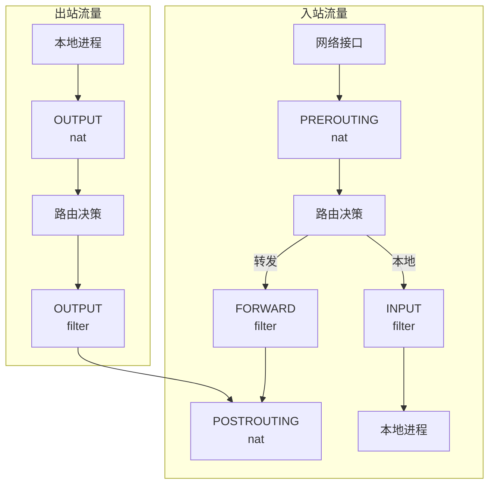
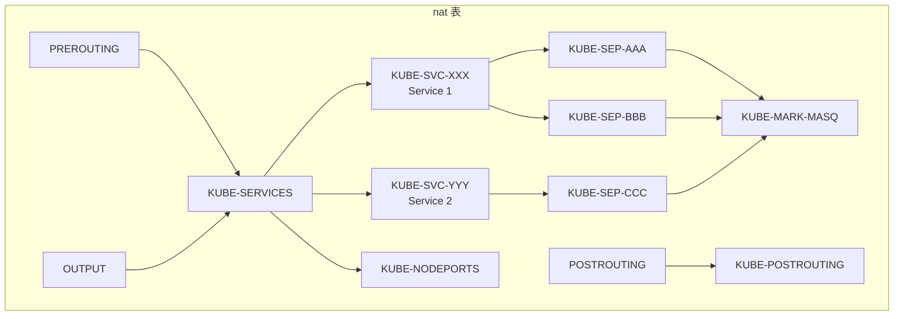
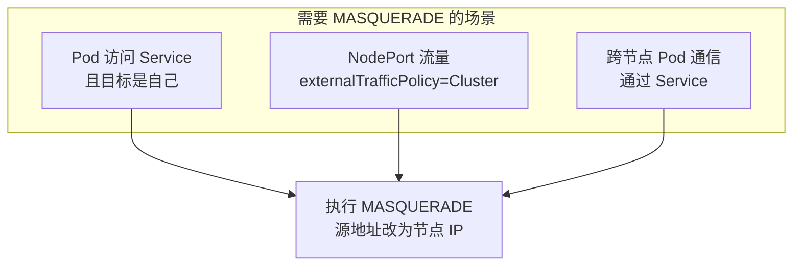

## 概述

kube-proxy 是 Kubernetes 中实现 Service 负载均衡的核心组件。iptables 模式是最常用的实现方式，它通过配置 Linux 内核的 iptables 规则来实现流量转发和负载均衡。本章深入解析 iptables 模式的工作原理、规则结构和同步机制。

## iptables 基础

### 表与链

```
┌─────────────────────────────────────────────────────────────────┐
│                     iptables 表结构                              │
├─────────────────────────────────────────────────────────────────┤
│                                                                  │
│  表 (Tables):                                                    │
│  ├── raw       - 连接追踪前处理                                  │
│  ├── mangle    - 包修改                                          │
│  ├── nat       - 地址转换 ← kube-proxy 主要使用                  │
│  └── filter    - 包过滤 ← kube-proxy 部分使用                    │
│                                                                  │
│  nat 表的链:                                                     │
│  ├── PREROUTING  - 入站包目标地址转换                            │
│  ├── OUTPUT      - 本地产生的包目标地址转换                       │
│  └── POSTROUTING - 出站包源地址转换                              │
│                                                                  │
│  filter 表的链:                                                  │
│  ├── INPUT   - 进入本机的包                                      │
│  ├── FORWARD - 转发的包                                          │
│  └── OUTPUT  - 本机产生的包                                      │
│                                                                  │
└─────────────────────────────────────────────────────────────────┘
```

### 数据包流向



## kube-proxy 规则链结构

### 自定义链

kube-proxy 创建的自定义链：

```
┌─────────────────────────────────────────────────────────────────┐
│                   kube-proxy 自定义链                            │
├─────────────────────────────────────────────────────────────────┤
│                                                                  │
│  KUBE-SERVICES           - 所有 Service 的入口链                 │
│  KUBE-NODEPORTS          - NodePort 服务入口                     │
│  KUBE-EXTERNAL-SERVICES  - 外部 IP 服务入口                      │
│  KUBE-FIREWALL           - 防火墙规则                            │
│                                                                  │
│  KUBE-SVC-XXXXX          - 单个 Service 的规则                   │
│  KUBE-SEP-XXXXX          - 单个 Endpoint 的规则                  │
│  KUBE-FW-XXXXX           - 防火墙规则                            │
│  KUBE-XLB-XXXXX          - 外部负载均衡规则                       │
│                                                                  │
│  KUBE-MARK-MASQ          - 标记需要 MASQUERADE 的包              │
│  KUBE-MARK-DROP          - 标记需要丢弃的包                       │
│  KUBE-POSTROUTING        - 执行 MASQUERADE                       │
│                                                                  │
└─────────────────────────────────────────────────────────────────┘
```

### 规则链关系



## ClusterIP 实现

### 规则示例

假设有以下 Service：
- ClusterIP: 10.96.0.100
- Port: 80
- Endpoints: 10.244.1.2:8080, 10.244.2.3:8080

```bash
# PREROUTING 和 OUTPUT 链入口
-A PREROUTING -m comment --comment "kubernetes service portals" -j KUBE-SERVICES
-A OUTPUT -m comment --comment "kubernetes service portals" -j KUBE-SERVICES

# KUBE-SERVICES 链：匹配 ClusterIP
-A KUBE-SERVICES -d 10.96.0.100/32 -p tcp -m tcp --dport 80 \
   -m comment --comment "default/my-service cluster IP" -j KUBE-SVC-XXXXX

# KUBE-SVC-XXXXX 链：负载均衡到 Endpoints
# 第一个 endpoint 有 50% 概率 (1/2)
-A KUBE-SVC-XXXXX -m statistic --mode random --probability 0.5 \
   -m comment --comment "default/my-service -> 10.244.1.2:8080" -j KUBE-SEP-AAA
# 第二个 endpoint 处理剩余流量 (1/1 = 100%)
-A KUBE-SVC-XXXXX \
   -m comment --comment "default/my-service -> 10.244.2.3:8080" -j KUBE-SEP-BBB

# KUBE-SEP-AAA 链：DNAT 到第一个 Pod
-A KUBE-SEP-AAA -s 10.244.1.2/32 -m comment --comment "default/my-service" \
   -j KUBE-MARK-MASQ
-A KUBE-SEP-AAA -p tcp -m comment --comment "default/my-service" \
   -m tcp -j DNAT --to-destination 10.244.1.2:8080

# KUBE-SEP-BBB 链：DNAT 到第二个 Pod
-A KUBE-SEP-BBB -s 10.244.2.3/32 -m comment --comment "default/my-service" \
   -j KUBE-MARK-MASQ
-A KUBE-SEP-BBB -p tcp -m comment --comment "default/my-service" \
   -m tcp -j DNAT --to-destination 10.244.2.3:8080
```

### 负载均衡概率

对于 N 个 Endpoints，概率分配：

| Endpoint | 概率公式 | N=2 | N=3 | N=4 |
|----------|----------|-----|-----|-----|
| 1 | 1/N | 0.5 | 0.333 | 0.25 |
| 2 | 1/(N-1) | 1.0 | 0.5 | 0.333 |
| 3 | 1/(N-2) | - | 1.0 | 0.5 |
| 4 | 1/(N-3) | - | - | 1.0 |

```go
// pkg/proxy/iptables/proxier.go

// 计算每个 endpoint 的概率
func probability(n int) string {
    if n <= 1 {
        return ""
    }
    // 第 i 个 endpoint 的概率是 1/(n-i+1)
    return fmt.Sprintf("--probability %0.10f", 1.0/float64(n))
}
```

## NodePort 实现

### 规则示例

```bash
# KUBE-SERVICES 链末尾跳转到 KUBE-NODEPORTS
-A KUBE-SERVICES -m comment --comment "kubernetes service nodeports" \
   -m addrtype --dst-type LOCAL -j KUBE-NODEPORTS

# KUBE-NODEPORTS 链：匹配 NodePort
-A KUBE-NODEPORTS -p tcp -m tcp --dport 30080 \
   -m comment --comment "default/my-service" -j KUBE-SVC-XXXXX

# 后续规则与 ClusterIP 相同
```

### externalTrafficPolicy: Local

```bash
# 当 externalTrafficPolicy=Local 时
# 只转发到本节点的 Pod

# 如果本节点没有 endpoint，丢弃流量
-A KUBE-XLB-XXXXX -m comment --comment "default/my-service has no local endpoints" \
   -j KUBE-MARK-DROP

# 如果有本地 endpoint，转发
-A KUBE-XLB-XXXXX -m comment --comment "default/my-service -> 10.244.1.2:8080" \
   -j KUBE-SEP-AAA
```

## LoadBalancer 实现

### 规则示例

```bash
# 外部负载均衡 IP
-A KUBE-SERVICES -d 203.0.113.100/32 -p tcp -m tcp --dport 80 \
   -m comment --comment "default/my-service loadbalancer IP" -j KUBE-FW-XXXXX

# 防火墙链
-A KUBE-FW-XXXXX -m comment --comment "default/my-service loadbalancer IP" \
   -j KUBE-MARK-MASQ
-A KUBE-FW-XXXXX -m comment --comment "default/my-service loadbalancer IP" \
   -j KUBE-SVC-XXXXX
# 拒绝其他流量
-A KUBE-FW-XXXXX -m comment --comment "default/my-service loadbalancer IP" \
   -j KUBE-MARK-DROP
```

## 源地址转换 (MASQUERADE)

### KUBE-MARK-MASQ

标记需要进行源地址转换的包：

```bash
# 标记规则
-A KUBE-MARK-MASQ -j MARK --set-xmark 0x4000/0x4000

# POSTROUTING 执行 MASQUERADE
-A KUBE-POSTROUTING -m mark --mark 0x4000/0x4000 \
   -m comment --comment "kubernetes service traffic requiring SNAT" \
   -j MASQUERADE
```

### 何时需要 MASQUERADE



## 会话亲和性

### ClientIP 亲和实现

```bash
# 使用 recent 模块实现会话亲和
# 检查是否有最近的会话
-A KUBE-SVC-XXXXX -m recent --name KUBE-SEP-AAA --rcheck --seconds 10800 --reap \
   -j KUBE-SEP-AAA

# 设置会话记录
-A KUBE-SEP-AAA -p tcp -m recent --name KUBE-SEP-AAA --set \
   -m tcp -j DNAT --to-destination 10.244.1.2:8080
```

## Proxier 实现

### 数据结构

```go
// pkg/proxy/iptables/proxier.go

type Proxier struct {
    // iptables 接口
    iptables       utiliptables.Interface
    ipset          utilipset.Interface

    // 服务和端点信息
    svcPortMap     proxy.ServicePortMap
    endpointsMap   proxy.EndpointsMap

    // 同步状态
    syncPeriod     time.Duration
    minSyncPeriod  time.Duration
    lastSync       time.Time

    // 节点信息
    nodeIP         net.IP
    hostname       string
    nodePortAddresses []string

    // 规则缓冲
    filterChains  utilproxy.LineBuffer
    filterRules   utilproxy.LineBuffer
    natChains     utilproxy.LineBuffer
    natRules      utilproxy.LineBuffer
}
```

### syncProxyRules

```go
// syncProxyRules 同步 iptables 规则
func (proxier *Proxier) syncProxyRules() {
    proxier.mu.Lock()
    defer proxier.mu.Unlock()

    // 1. 获取当前需要的服务和端点
    serviceUpdateResult := proxier.svcPortMap.Update(proxier.serviceChanges)
    endpointUpdateResult := proxier.endpointsMap.Update(proxier.endpointsChanges)

    // 2. 初始化规则缓冲
    proxier.filterChains.Reset()
    proxier.filterRules.Reset()
    proxier.natChains.Reset()
    proxier.natRules.Reset()

    // 3. 写入固定链
    proxier.writeIptablesBaseChains()

    // 4. 为每个服务写入规则
    for svcName, svc := range proxier.svcPortMap {
        svcInfo := svc.(*servicePortInfo)

        // 写入 KUBE-SERVICES 规则
        proxier.writeServiceToEndpointRules(svcName, svcInfo)

        // 写入 NodePort 规则
        if svcInfo.NodePort() != 0 {
            proxier.writeNodePortRules(svcName, svcInfo)
        }

        // 写入 LoadBalancer 规则
        for _, ingress := range svcInfo.LoadBalancerIPStrings() {
            proxier.writeLoadBalancerRules(svcName, svcInfo, ingress)
        }
    }

    // 5. 写入 KUBE-MARK-MASQ 和 KUBE-POSTROUTING
    proxier.writeMasqueradeRules()

    // 6. 原子替换规则
    proxier.iptablesData.Reset()
    proxier.writeIptablesData()

    // 使用 iptables-restore 原子更新
    err := proxier.iptables.RestoreAll(
        proxier.iptablesData.Bytes(),
        utiliptables.NoFlushTables,
        utiliptables.RestoreCounters,
    )
    if err != nil {
        klog.ErrorS(err, "Failed to restore iptables rules")
    }

    proxier.lastSync = time.Now()
}

// writeServiceToEndpointRules 写入服务到端点的规则
func (proxier *Proxier) writeServiceToEndpointRules(
    svcName proxy.ServicePortName,
    svcInfo *servicePortInfo) {

    endpoints := proxier.endpointsMap[svcName]
    nEndpoints := len(endpoints)

    if nEndpoints == 0 {
        // 无端点，写入拒绝规则
        proxier.writeServiceNoEndpointRules(svcName, svcInfo)
        return
    }

    // 写入 KUBE-SERVICES 到 KUBE-SVC-XXX 的跳转
    svcChain := svcInfo.ServiceChainName()
    proxier.natRules.Write(
        "-A", string(kubeServicesChain),
        "-m", "comment", "--comment", fmt.Sprintf(`"%s cluster IP"`, svcName.String()),
        "-m", protocol, "-p", protocol,
        "-d", svcInfo.ClusterIP().String(),
        "--dport", strconv.Itoa(svcInfo.Port()),
        "-j", string(svcChain),
    )

    // 写入 KUBE-SVC-XXX 链
    proxier.natChains.Write(utiliptables.MakeChainLine(svcChain))

    // 会话亲和性处理
    if svcInfo.SessionAffinityType() == v1.ServiceAffinityClientIP {
        proxier.writeSessionAffinityRules(svcChain, endpoints, svcInfo)
    }

    // 写入负载均衡规则
    for i, ep := range endpoints {
        epInfo := ep.(*endpointInfo)
        sepChain := epInfo.ChainName()

        // 概率计算
        n := nEndpoints - i
        args := []string{
            "-A", string(svcChain),
            "-m", "comment", "--comment", fmt.Sprintf(`"%s -> %s"`, svcName.String(), epInfo.Endpoint),
        }
        if n > 1 {
            args = append(args, "-m", "statistic", "--mode", "random",
                "--probability", probability(n))
        }
        args = append(args, "-j", string(sepChain))
        proxier.natRules.Write(args...)

        // 写入 KUBE-SEP-XXX 链
        proxier.writeEndpointRules(sepChain, epInfo, svcInfo)
    }
}

// writeEndpointRules 写入端点规则
func (proxier *Proxier) writeEndpointRules(
    sepChain utiliptables.Chain,
    epInfo *endpointInfo,
    svcInfo *servicePortInfo) {

    proxier.natChains.Write(utiliptables.MakeChainLine(sepChain))

    // 如果源是本端点，标记 MASQUERADE（处理 hairpin）
    proxier.natRules.Write(
        "-A", string(sepChain),
        "-s", epInfo.IP(),
        "-m", "comment", "--comment", svcInfo.serviceNameString,
        "-j", string(kubeMarkMasqChain),
    )

    // DNAT 规则
    proxier.natRules.Write(
        "-A", string(sepChain),
        "-m", "comment", "--comment", svcInfo.serviceNameString,
        "-m", protocol, "-p", protocol,
        "-j", "DNAT",
        "--to-destination", epInfo.Endpoint,
    )
}
```

## 规则同步触发

### 触发条件

```go
// pkg/proxy/iptables/proxier.go

// OnServiceAdd Service 添加时触发
func (proxier *Proxier) OnServiceAdd(service *v1.Service) {
    proxier.OnServiceUpdate(nil, service)
}

// OnServiceUpdate Service 更新时触发
func (proxier *Proxier) OnServiceUpdate(oldService, service *v1.Service) {
    if proxier.serviceChanges.Update(oldService, service) {
        proxier.Sync()
    }
}

// OnServiceDelete Service 删除时触发
func (proxier *Proxier) OnServiceDelete(service *v1.Service) {
    proxier.OnServiceUpdate(service, nil)
}

// OnEndpointSliceAdd EndpointSlice 添加时触发
func (proxier *Proxier) OnEndpointSliceAdd(endpointSlice *discovery.EndpointSlice) {
    if proxier.endpointsChanges.EndpointSliceUpdate(endpointSlice, false) {
        proxier.Sync()
    }
}

// Sync 触发同步
func (proxier *Proxier) Sync() {
    if proxier.isInitialized() {
        proxier.syncRunner.Run()
    }
}
```

### 防抖动

```go
// 使用 BoundedFrequencyRunner 控制同步频率
proxier.syncRunner = async.NewBoundedFrequencyRunner(
    "sync-runner",
    proxier.syncProxyRules,
    minSyncPeriod,  // 最小间隔
    syncPeriod,     // 最大间隔
    burstSyncs,     // 突发次数
)
```

## 性能优化

### 大规模集群挑战

| 问题 | 影响 | 解决方案 |
|------|------|----------|
| 规则数量 | O(N*M) N=服务数，M=端点数 | 使用 IPVS 模式 |
| 同步时间 | 规则越多同步越慢 | 增量更新 |
| CPU 消耗 | 规则匹配消耗 CPU | 调整同步间隔 |
| 内存使用 | conntrack 表 | 调大 nf_conntrack_max |

### 参数调优

```yaml
# kube-proxy 配置
apiVersion: kubeproxy.config.k8s.io/v1alpha1
kind: KubeProxyConfiguration
mode: iptables
iptables:
  # 最小同步间隔
  minSyncPeriod: 1s
  # 同步周期
  syncPeriod: 30s
  # 掩码位数（用于 SNAT）
  masqueradeBit: 14
conntrack:
  # 连接追踪最大数
  maxPerCore: 32768
  min: 131072
  # TCP 超时
  tcpEstablishedTimeout: 24h
  tcpCloseWaitTimeout: 1h
```

### 监控指标

```yaml
# Prometheus 指标
- kubeproxy_sync_proxy_rules_duration_seconds  # 同步耗时
- kubeproxy_sync_proxy_rules_last_timestamp    # 最后同步时间
- kubeproxy_network_programming_duration_seconds # 编程耗时
- kubeproxy_sync_proxy_rules_iptables_total    # iptables 规则数
```

## 调试命令

```bash
# 查看 nat 表规则
iptables -t nat -L -n -v

# 查看特定 Service 的规则
iptables-save -t nat | grep "my-service"

# 查看 KUBE-SERVICES 链
iptables -t nat -L KUBE-SERVICES -n -v

# 查看连接追踪
conntrack -L

# 查看规则计数器
iptables -t nat -L -n -v --line-numbers

# 实时监控规则变化
watch -n 1 'iptables-save -t nat | wc -l'
```

## 总结

kube-proxy iptables 模式的特点：
- **成熟稳定**：长期使用，经过充分验证
- **简单直接**：直接使用内核 iptables
- **无额外组件**：不需要用户态守护进程

局限性：
- **规则数量限制**：大规模集群规则过多
- **同步延迟**：规则越多同步越慢
- **难以调试**：复杂的规则链难以排查问题

适用场景：
- 中小规模集群（< 1000 节点，< 10000 服务）
- 简单的网络需求
- 对兼容性要求高的环境
