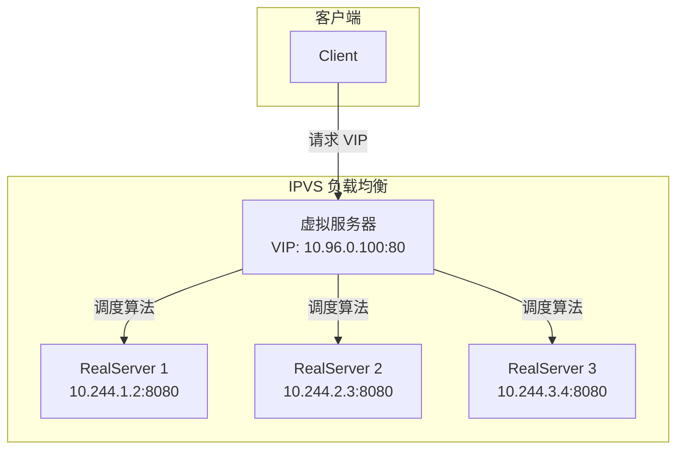
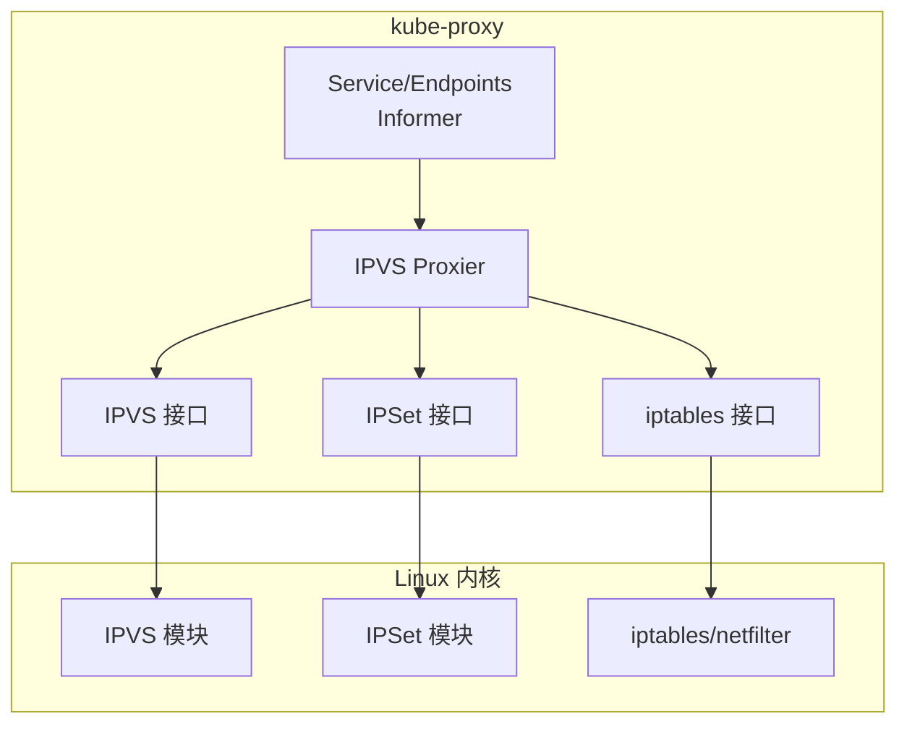

## 概述

IPVS（IP Virtual Server）是 Linux 内核中的传输层负载均衡器，相比 iptables 提供更好的性能和更丰富的负载均衡算法。kube-proxy IPVS 模式利用 IPVS 实现 Service 的负载均衡，特别适合大规模集群场景。

## IPVS 基础

### 工作原理



### IPVS vs iptables

| 特性 | iptables | IPVS |
|------|----------|------|
| 查找复杂度 | O(N) 线性 | O(1) 哈希 |
| 规则数量 | N*M | N+M |
| 调度算法 | 随机 | 10+ 算法 |
| 连接状态 | conntrack | 内置连接表 |
| 性能 | 中等 | 高 |
| 大规模支持 | 较差 | 良好 |

### 调度算法

IPVS 支持多种负载均衡算法：

```
┌─────────────────────────────────────────────────────────────────┐
│                     IPVS 调度算法                                │
├─────────────────────────────────────────────────────────────────┤
│                                                                  │
│  轮询类:                                                         │
│  ├── rr (Round Robin)         - 轮询                            │
│  ├── wrr (Weighted RR)        - 加权轮询                        │
│  └── sh (Source Hashing)      - 源地址哈希                      │
│                                                                  │
│  连接数类:                                                       │
│  ├── lc (Least Connection)    - 最少连接                        │
│  ├── wlc (Weighted LC)        - 加权最少连接                    │
│  ├── lblc (Locality-Based LC) - 基于局部性的最少连接            │
│  └── lblcr (LBLC with Replication) - 带复制的 LBLC             │
│                                                                  │
│  其他:                                                           │
│  ├── dh (Destination Hashing) - 目标地址哈希                    │
│  ├── sed (Shortest Expected Delay) - 最短预期延迟              │
│  └── nq (Never Queue)         - 永不排队                        │
│                                                                  │
└─────────────────────────────────────────────────────────────────┘
```

## kube-proxy IPVS 实现

### 架构概览



### 启用 IPVS 模式

```yaml
# kube-proxy 配置
apiVersion: kubeproxy.config.k8s.io/v1alpha1
kind: KubeProxyConfiguration
mode: ipvs
ipvs:
  # 调度算法
  scheduler: rr
  # 同步周期
  syncPeriod: 30s
  # 最小同步间隔
  minSyncPeriod: 2s
  # 会话亲和超时（秒）
  tcpTimeout: 0s
  tcpFinTimeout: 0s
  udpTimeout: 0s
```

### 内核模块依赖

```bash
# 加载必需的内核模块
modprobe ip_vs
modprobe ip_vs_rr
modprobe ip_vs_wrr
modprobe ip_vs_sh
modprobe nf_conntrack

# 验证模块已加载
lsmod | grep ip_vs
```

## 虚拟服务器管理

### 创建虚拟服务器

```go
// pkg/proxy/ipvs/proxier.go

// syncService 同步 Service 到 IPVS
func (proxier *Proxier) syncService(
    svcName string,
    vs *utilipvs.VirtualServer,
    bindAddr bool,
    bindedAddresses sets.String) error {

    // 检查虚拟服务器是否存在
    appliedVirtualServer, err := proxier.ipvs.GetVirtualServer(vs)
    if err != nil {
        return err
    }

    if appliedVirtualServer == nil {
        // 创建新的虚拟服务器
        klog.V(3).InfoS("Adding new service", "service", svcName,
            "address", vs.Address, "protocol", vs.Protocol, "port", vs.Port)

        if err := proxier.ipvs.AddVirtualServer(vs); err != nil {
            return err
        }
    } else if !appliedVirtualServer.Equal(vs) {
        // 更新现有虚拟服务器
        klog.V(3).InfoS("Updating service", "service", svcName,
            "address", vs.Address, "protocol", vs.Protocol, "port", vs.Port)

        if err := proxier.ipvs.UpdateVirtualServer(vs); err != nil {
            return err
        }
    }

    // 绑定 IP 到 kube-ipvs0 接口
    if bindAddr {
        if !bindedAddresses.Has(vs.Address.String()) {
            if err := proxier.netlinkHandle.EnsureAddressBind(vs.Address.String(), DefaultDummyDevice); err != nil {
                return err
            }
        }
    }

    return nil
}
```

### VirtualServer 结构

```go
// pkg/util/ipvs/ipvs.go

// VirtualServer IPVS 虚拟服务器
type VirtualServer struct {
    Address   net.IP
    Protocol  string
    Port      uint16
    Scheduler string
    Flags     ServiceFlags
    Timeout   uint32
}

// RealServer IPVS 真实服务器
type RealServer struct {
    Address      net.IP
    Port         uint16
    Weight       int
    ActiveConn   int
    InactiveConn int
}
```

### ipvsadm 命令示例

```bash
# 添加虚拟服务器
ipvsadm -A -t 10.96.0.100:80 -s rr

# 添加真实服务器
ipvsadm -a -t 10.96.0.100:80 -r 10.244.1.2:8080 -m -w 1
ipvsadm -a -t 10.96.0.100:80 -r 10.244.2.3:8080 -m -w 1

# 查看配置
ipvsadm -Ln

# 输出示例:
# IP Virtual Server version 1.2.1 (size=4096)
# Prot LocalAddress:Port Scheduler Flags
#   -> RemoteAddress:Port           Forward Weight ActiveConn InActConn
# TCP  10.96.0.100:80 rr
#   -> 10.244.1.2:8080              Masq    1      0          0
#   -> 10.244.2.3:8080              Masq    1      0          0
```

## kube-ipvs0 接口

### 作用

kube-ipvs0 是 kube-proxy 创建的虚拟网络接口，用于绑定 Service ClusterIP：

```bash
# 查看 kube-ipvs0 接口
ip addr show kube-ipvs0

# 输出示例:
# 4: kube-ipvs0: <BROADCAST,NOARP> mtu 1500 state DOWN
#     link/ether 6a:63:5c:9a:1d:72 brd ff:ff:ff:ff:ff:ff
#     inet 10.96.0.100/32 scope global kube-ipvs0
#     inet 10.96.0.1/32 scope global kube-ipvs0
#     inet 10.96.0.10/32 scope global kube-ipvs0
```

### 创建流程

```go
// pkg/proxy/ipvs/proxier.go

// createKubeIPVS0 创建 kube-ipvs0 接口
func createKubeIPVS0() error {
    // 使用 dummy 类型接口
    kl := &netlink.Dummy{
        LinkAttrs: netlink.LinkAttrs{
            Name: DefaultDummyDevice, // kube-ipvs0
        },
    }

    if err := netlink.LinkAdd(kl); err != nil {
        return err
    }

    return netlink.LinkSetUp(kl)
}

// bindServiceAddress 绑定 Service IP 到接口
func (proxier *Proxier) bindServiceAddress(ip net.IP) error {
    addr := &netlink.Addr{
        IPNet: &net.IPNet{
            IP:   ip,
            Mask: net.CIDRMask(32, 32), // /32 地址
        },
    }

    link, err := netlink.LinkByName(DefaultDummyDevice)
    if err != nil {
        return err
    }

    return netlink.AddrAdd(link, addr)
}
```

## IPSet 使用

### IPSet 集合类型

kube-proxy IPVS 模式使用 IPSet 来提高 iptables 规则效率：

```
┌─────────────────────────────────────────────────────────────────┐
│                   kube-proxy IPSet 集合                          │
├─────────────────────────────────────────────────────────────────┤
│                                                                  │
│  KUBE-CLUSTER-IP                                                │
│    类型: hash:ip,port                                           │
│    内容: 所有 ClusterIP:Port                                    │
│                                                                  │
│  KUBE-LOOP-BACK                                                 │
│    类型: hash:ip,port,ip                                        │
│    内容: 需要 MASQUERADE 的本地回环地址                          │
│                                                                  │
│  KUBE-NODE-PORT-TCP / KUBE-NODE-PORT-UDP                        │
│    类型: bitmap:port                                            │
│    内容: NodePort 端口                                          │
│                                                                  │
│  KUBE-EXTERNAL-IP                                               │
│    类型: hash:ip,port                                           │
│    内容: 外部 IP:Port                                           │
│                                                                  │
│  KUBE-LOAD-BALANCER / KUBE-LOAD-BALANCER-LOCAL                  │
│    类型: hash:ip,port                                           │
│    内容: LoadBalancer IP:Port                                   │
│                                                                  │
└─────────────────────────────────────────────────────────────────┘
```

### IPSet 管理

```go
// pkg/proxy/ipvs/proxier.go

// createIPSet 创建 IPSet 集合
func (proxier *Proxier) createIPSet() {
    // ClusterIP 集合
    proxier.ipsetList[kubeClusterIPSet] = NewIPSet(proxier.ipset,
        kubeClusterIPSet, utilipset.HashIPPort, false, utilipset.ProtocolFamilyIPV4)

    // Loopback 集合
    proxier.ipsetList[kubeLoopBackIPSet] = NewIPSet(proxier.ipset,
        kubeLoopBackIPSet, utilipset.HashIPPortIP, false, utilipset.ProtocolFamilyIPV4)

    // NodePort 集合
    proxier.ipsetList[kubeNodePortSetTCP] = NewIPSet(proxier.ipset,
        kubeNodePortSetTCP, utilipset.BitmapPort, false, utilipset.ProtocolFamilyIPV4)
}

// syncIPSetEntries 同步 IPSet 条目
func (proxier *Proxier) syncIPSetEntries() {
    // 添加 ClusterIP
    for svcName, svc := range proxier.svcPortMap {
        entry := &utilipset.Entry{
            IP:       svc.ClusterIP().String(),
            Port:     svc.Port(),
            Protocol: string(svc.Protocol()),
            SetType:  utilipset.HashIPPort,
        }
        proxier.ipsetList[kubeClusterIPSet].activeEntries.Insert(entry.String())
    }

    // 同步到内核
    for _, set := range proxier.ipsetList {
        set.syncIPSetEntries()
    }
}
```

### ipset 命令示例

```bash
# 查看所有 ipset
ipset list

# 查看特定集合
ipset list KUBE-CLUSTER-IP

# 输出示例:
# Name: KUBE-CLUSTER-IP
# Type: hash:ip,port
# Revision: 5
# Header: family inet hashsize 1024 maxelem 65536
# Size in memory: 312
# References: 2
# Members:
# 10.96.0.100,tcp:80
# 10.96.0.1,tcp:443
# 10.96.0.10,udp:53
```

## iptables 规则简化

### 与 iptables 模式对比

```bash
# iptables 模式：每个 Service 一条规则
-A KUBE-SERVICES -d 10.96.0.100/32 -p tcp --dport 80 -j KUBE-SVC-XXX
-A KUBE-SERVICES -d 10.96.0.101/32 -p tcp --dport 8080 -j KUBE-SVC-YYY
# ... 每个 Service 一条

# IPVS 模式：使用 IPSet 匹配
-A KUBE-SERVICES -m set --match-set KUBE-CLUSTER-IP dst,dst -j KUBE-MARK-MASQ
# 只需一条规则匹配所有 ClusterIP
```

### IPVS 模式的 iptables 规则

```bash
# nat 表 PREROUTING
-A PREROUTING -m comment --comment "kubernetes service portals" -j KUBE-SERVICES

# nat 表 OUTPUT
-A OUTPUT -m comment --comment "kubernetes service portals" -j KUBE-SERVICES

# KUBE-SERVICES 链
-A KUBE-SERVICES -m set --match-set KUBE-CLUSTER-IP dst,dst \
   -j KUBE-MARK-MASQ
-A KUBE-SERVICES -m set --match-set KUBE-NODE-PORT-TCP dst \
   -j KUBE-NODE-PORT
-A KUBE-SERVICES -m addrtype --dst-type LOCAL \
   -j KUBE-NODE-PORT

# KUBE-MARK-MASQ
-A KUBE-MARK-MASQ -j MARK --set-xmark 0x4000/0x4000

# KUBE-POSTROUTING
-A KUBE-POSTROUTING -m mark --mark 0x4000/0x4000 \
   -m comment --comment "kubernetes service traffic requiring SNAT" \
   -j MASQUERADE

# filter 表 FORWARD
-A KUBE-FORWARD -m set --match-set KUBE-CLUSTER-IP src,dst -j ACCEPT
-A KUBE-FORWARD -m set --match-set KUBE-CLUSTER-IP dst,src -j ACCEPT
```

## RealServer 同步

### 端点同步

```go
// pkg/proxy/ipvs/proxier.go

// syncEndpoint 同步端点到 IPVS RealServer
func (proxier *Proxier) syncEndpoint(
    svcName string,
    onlyNodeLocalEndpoints bool,
    vs *utilipvs.VirtualServer) error {

    // 获取当前 RealServer 列表
    curRealServers, err := proxier.ipvs.GetRealServers(vs)
    if err != nil {
        return err
    }
    curRSMap := make(map[string]*utilipvs.RealServer)
    for _, rs := range curRealServers {
        curRSMap[rs.String()] = rs
    }

    // 获取期望的端点列表
    endpoints := proxier.endpointsMap[svcName]
    newRSMap := make(map[string]*utilipvs.RealServer)

    for _, ep := range endpoints {
        epInfo := ep.(*endpointInfo)

        // 检查是否只使用本地端点
        if onlyNodeLocalEndpoints && !epInfo.IsLocal() {
            continue
        }

        rs := &utilipvs.RealServer{
            Address: net.ParseIP(epInfo.ip),
            Port:    uint16(epInfo.port),
            Weight:  1,
        }
        newRSMap[rs.String()] = rs
    }

    // 添加新的 RealServer
    for key, rs := range newRSMap {
        if _, exists := curRSMap[key]; !exists {
            klog.V(3).InfoS("Adding new real server", "server", rs.String())
            if err := proxier.ipvs.AddRealServer(vs, rs); err != nil {
                return err
            }
        }
    }

    // 删除不需要的 RealServer
    for key, rs := range curRSMap {
        if _, exists := newRSMap[key]; !exists {
            klog.V(3).InfoS("Deleting real server", "server", rs.String())
            if err := proxier.ipvs.DeleteRealServer(vs, rs); err != nil {
                return err
            }
        }
    }

    return nil
}
```

## 会话亲和性

### IPVS 持久连接

```go
// 会话亲和性使用 IPVS 持久连接实现
// 配置示例: ipvsadm -A -t 10.96.0.100:80 -s rr -p 10800

func (proxier *Proxier) createVirtualServer(svc *servicePortInfo) *utilipvs.VirtualServer {
    vs := &utilipvs.VirtualServer{
        Address:   svc.ClusterIP(),
        Port:      uint16(svc.Port()),
        Protocol:  string(svc.Protocol()),
        Scheduler: proxier.ipvsScheduler,
    }

    // 会话亲和性
    if svc.SessionAffinityType() == v1.ServiceAffinityClientIP {
        vs.Flags |= utilipvs.FlagPersistent
        vs.Timeout = uint32(svc.StickyMaxAgeSeconds())
    }

    return vs
}
```

```bash
# 查看带会话亲和的服务
ipvsadm -Ln

# 输出示例:
# TCP  10.96.0.100:80 rr persistent 10800
#   -> 10.244.1.2:8080              Masq    1      0          0
#   -> 10.244.2.3:8080              Masq    1      0          0
```

## 连接状态

### IPVS 连接表

```bash
# 查看 IPVS 连接
ipvsadm -Lnc

# 输出示例:
# IPVS connection entries
# pro expire state       source             virtual            destination
# TCP 14:58  ESTABLISHED 10.244.3.5:45678   10.96.0.100:80     10.244.1.2:8080
# TCP 00:57  TIME_WAIT   10.244.3.6:45679   10.96.0.100:80     10.244.2.3:8080
```

### 连接状态管理

```go
// IPVS 连接状态由内核管理
// kube-proxy 只负责配置虚拟服务器和真实服务器

// 连接超时配置
type IPVSTimeout struct {
    TCPTimeout     time.Duration
    TCPFinTimeout  time.Duration
    UDPTimeout     time.Duration
}

func (proxier *Proxier) syncIPVSTimeout() error {
    timeout := &utilipvs.IPVSTimeout{
        TCPTimeout:     proxier.ipvsConfig.TCPTimeout,
        TCPFinTimeout:  proxier.ipvsConfig.TCPFinTimeout,
        UDPTimeout:     proxier.ipvsConfig.UDPTimeout,
    }
    return proxier.ipvs.SetTimeout(timeout)
}
```

## 性能监控

### 关键指标

```bash
# IPVS 统计信息
ipvsadm -Ln --stats

# 输出示例:
# IP Virtual Server version 1.2.1 (size=4096)
# Prot LocalAddress:Port               Conns   InPkts  OutPkts  InBytes OutBytes
#   -> RemoteAddress:Port
# TCP  10.96.0.100:80                   1234     5678     5678   123456   654321
#   -> 10.244.1.2:8080                   617     2839     2839    61728   327160
#   -> 10.244.2.3:8080                   617     2839     2839    61728   327161

# 速率统计
ipvsadm -Ln --rate

# 输出示例:
# IP Virtual Server version 1.2.1 (size=4096)
# Prot LocalAddress:Port                 CPS    InPPS   OutPPS    InBPS   OutBPS
#   -> RemoteAddress:Port
# TCP  10.96.0.100:80                     10      100      100    10000    10000
#   -> 10.244.1.2:8080                     5       50       50     5000     5000
#   -> 10.244.2.3:8080                     5       50       50     5000     5000
```

### Prometheus 指标

```yaml
# kube-proxy IPVS 指标
- kubeproxy_sync_proxy_rules_ipvs_services_total  # IPVS 服务数
- kubeproxy_sync_proxy_rules_ipvs_endpoints_total # IPVS 端点数
- kubeproxy_ipvs_conn_total                       # IPVS 连接数
```

## 故障排查

### 常见问题

```bash
# 1. 检查 IPVS 模块是否加载
lsmod | grep ip_vs

# 2. 检查 kube-ipvs0 接口
ip addr show kube-ipvs0

# 3. 检查 IPVS 规则
ipvsadm -Ln

# 4. 检查 IPSet
ipset list

# 5. 检查 iptables 规则
iptables-save | grep -i kube

# 6. 检查连接追踪
conntrack -L | grep 10.96.0.100

# 7. 抓包分析
tcpdump -i any host 10.96.0.100 -nn
```

### 回退到 iptables 模式

```yaml
# 如果 IPVS 有问题，可以回退
apiVersion: kubeproxy.config.k8s.io/v1alpha1
kind: KubeProxyConfiguration
mode: iptables  # 改回 iptables
```

## 最佳实践

### 配置建议

```yaml
apiVersion: kubeproxy.config.k8s.io/v1alpha1
kind: KubeProxyConfiguration
mode: ipvs
ipvs:
  # 大多数场景使用轮询
  scheduler: rr
  # 或使用最少连接
  # scheduler: lc
  syncPeriod: 30s
  minSyncPeriod: 2s
  # 会话亲和超时
  tcpTimeout: 0s
  tcpFinTimeout: 0s
  udpTimeout: 0s
  # 排除特定接口
  excludeCIDRs:
    - 10.0.0.0/8
conntrack:
  maxPerCore: 32768
  min: 131072
```

### 选择调度算法

| 场景 | 推荐算法 |
|------|----------|
| 通用负载均衡 | rr (轮询) |
| 后端处理能力不均 | wrr (加权轮询) |
| 长连接服务 | lc (最少连接) |
| 需要会话粘滞 | sh (源哈希) |
| 延迟敏感 | sed (最短预期延迟) |

## 总结

kube-proxy IPVS 模式的优势：
- **高性能**：O(1) 复杂度的哈希查找
- **可扩展**：适合大规模集群
- **丰富算法**：10+ 种负载均衡算法
- **原生支持**：内核级别实现

适用场景：
- 大规模集群（> 1000 节点，> 10000 服务）
- 对性能要求高的环境
- 需要高级负载均衡算法

注意事项：
- 需要加载额外的内核模块
- 仍需要少量 iptables 规则
- 调试相对复杂
