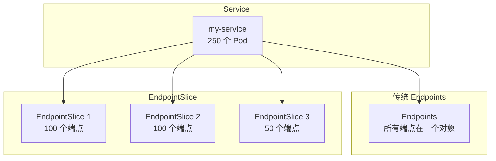
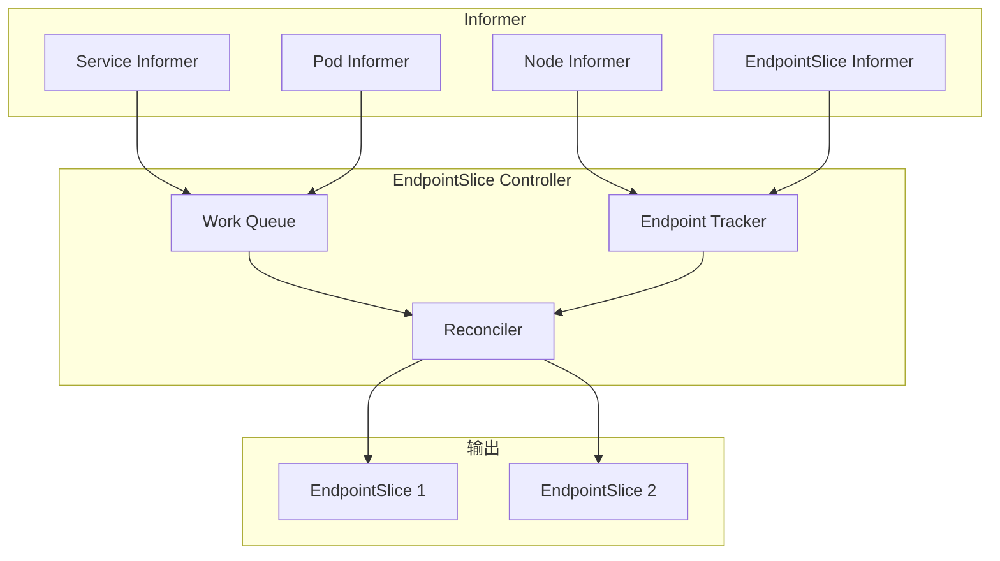
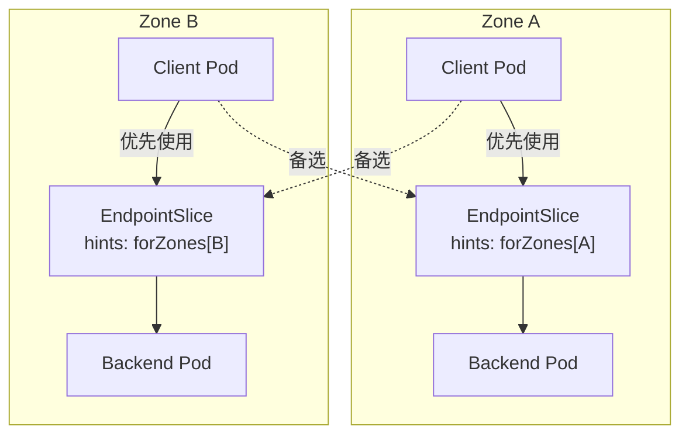
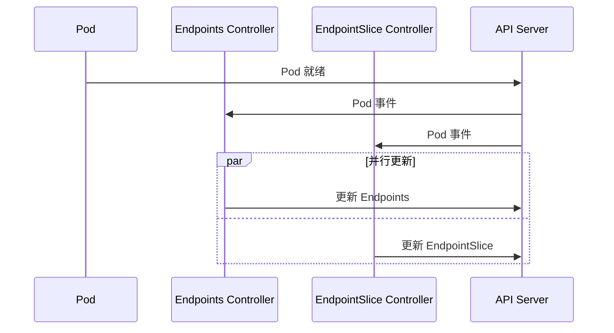

## 概述

EndpointSlice 是 Kubernetes 1.17 引入的 API 资源，用于替代传统的 Endpoints 资源。它通过分片机制解决了大规模 Service 场景下 Endpoints 资源过大的问题，同时提供了更丰富的端点元数据，包括拓扑信息和服务状态。

## 设计动机

### Endpoints 的局限性

```
┌─────────────────────────────────────────────────────────────────┐
│                   Endpoints 资源的问题                           │
├─────────────────────────────────────────────────────────────────┤
│                                                                  │
│  问题 1: 单个资源过大                                            │
│  ├── 所有端点在一个 Endpoints 对象中                             │
│  ├── 大型 Service 可能有数千个端点                               │
│  └── 超过 etcd 1.5MB 限制                                       │
│                                                                  │
│  问题 2: 更新放大效应                                            │
│  ├── 任何端点变化都更新整个对象                                  │
│  ├── kube-proxy 需要处理全量更新                                 │
│  └── 造成大量 API Server 和 etcd 负载                           │
│                                                                  │
│  问题 3: 缺少元数据                                              │
│  ├── 无拓扑信息（zone、region）                                  │
│  ├── 无服务端口名称                                              │
│  └── 无法支持拓扑感知路由                                        │
│                                                                  │
└─────────────────────────────────────────────────────────────────┘
```

### EndpointSlice 解决方案



## EndpointSlice 资源

### 资源结构

```yaml
apiVersion: discovery.k8s.io/v1
kind: EndpointSlice
metadata:
  name: my-service-abc12
  namespace: default
  labels:
    # 关联的 Service
    kubernetes.io/service-name: my-service
    # 端点类型
    endpointslice.kubernetes.io/managed-by: endpointslice-controller.k8s.io
  ownerReferences:
    - apiVersion: v1
      kind: Service
      name: my-service
      uid: 123e4567-e89b-12d3-a456-426614174000

# 地址类型
addressType: IPv4  # IPv4, IPv6, FQDN

# 端点列表（最多 100 个）
endpoints:
  - addresses:
      - "10.244.1.2"
    conditions:
      ready: true
      serving: true
      terminating: false
    hostname: pod-1
    nodeName: node-1
    zone: us-west-2a
    # 拓扑感知提示
    hints:
      forZones:
        - name: us-west-2a
    targetRef:
      kind: Pod
      name: my-pod-1
      namespace: default
      uid: pod-uid-1

  - addresses:
      - "10.244.2.3"
    conditions:
      ready: true
      serving: true
      terminating: false
    hostname: pod-2
    nodeName: node-2
    zone: us-west-2b
    hints:
      forZones:
        - name: us-west-2b
    targetRef:
      kind: Pod
      name: my-pod-2
      namespace: default
      uid: pod-uid-2

# 端口定义
ports:
  - name: http
    protocol: TCP
    port: 8080
  - name: https
    protocol: TCP
    port: 8443
```

### 关键字段说明

| 字段 | 说明 |
|------|------|
| addressType | 地址类型：IPv4、IPv6 或 FQDN |
| endpoints[].addresses | 端点 IP 地址列表 |
| endpoints[].conditions.ready | 是否通过 Readiness 检查 |
| endpoints[].conditions.serving | 是否正在提供服务 |
| endpoints[].conditions.terminating | 是否正在终止 |
| endpoints[].zone | 端点所在的可用区 |
| endpoints[].hints | 拓扑感知路由提示 |
| ports | 服务端口列表 |

## EndpointSlice Controller

### 控制器架构



### 核心实现

```go
// pkg/controller/endpointslice/endpointslice_controller.go

// Controller EndpointSlice 控制器
type Controller struct {
    client           clientset.Interface
    eventBroadcaster record.EventBroadcaster
    eventRecorder    record.EventRecorder

    // Informer
    serviceLister       corelisters.ServiceLister
    servicesSynced      cache.InformerSynced
    podLister           corelisters.PodLister
    podsSynced          cache.InformerSynced
    nodeLister          corelisters.NodeLister
    nodesSynced         cache.InformerSynced
    endpointSliceLister discoverylisters.EndpointSliceLister
    endpointSlicesSynced cache.InformerSynced

    // 工作队列
    queue workqueue.RateLimitingInterface

    // 端点追踪器
    endpointSliceTracker *endpointSliceTracker

    // 配置
    maxEndpointsPerSlice int32
}

// syncService 同步 Service 的 EndpointSlice
func (c *Controller) syncService(key string) error {
    namespace, name, err := cache.SplitMetaNamespaceKey(key)
    if err != nil {
        return err
    }

    // 获取 Service
    service, err := c.serviceLister.Services(namespace).Get(name)
    if errors.IsNotFound(err) {
        // Service 已删除，清理 EndpointSlice
        return c.reconciler.deleteService(namespace, name)
    }
    if err != nil {
        return err
    }

    // 无选择器的 Service 不处理
    if service.Spec.Selector == nil {
        return nil
    }

    // 获取匹配的 Pod
    pods, err := c.podLister.Pods(namespace).List(
        labels.SelectorFromSet(service.Spec.Selector))
    if err != nil {
        return err
    }

    // 协调 EndpointSlice
    return c.reconciler.reconcile(service, pods)
}
```

### Reconciler 实现

```go
// pkg/controller/endpointslice/reconciler.go

// reconcile 协调 EndpointSlice
func (r *reconciler) reconcile(service *v1.Service, pods []*v1.Pod) error {
    // 1. 获取现有的 EndpointSlice
    existingSlices, err := r.endpointSliceLister.EndpointSlices(service.Namespace).List(
        labels.SelectorFromSet(map[string]string{
            discovery.LabelServiceName: service.Name,
        }))
    if err != nil {
        return err
    }

    // 2. 构建期望的端点列表
    desiredEndpoints := r.buildDesiredEndpoints(service, pods)

    // 3. 计算变更
    slicesToCreate, slicesToUpdate, slicesToDelete := r.calculateChanges(
        existingSlices, desiredEndpoints)

    // 4. 应用变更
    for _, slice := range slicesToCreate {
        _, err := r.client.DiscoveryV1().EndpointSlices(service.Namespace).Create(
            context.TODO(), slice, metav1.CreateOptions{})
        if err != nil {
            return err
        }
    }

    for _, slice := range slicesToUpdate {
        _, err := r.client.DiscoveryV1().EndpointSlices(service.Namespace).Update(
            context.TODO(), slice, metav1.UpdateOptions{})
        if err != nil {
            return err
        }
    }

    for _, slice := range slicesToDelete {
        err := r.client.DiscoveryV1().EndpointSlices(service.Namespace).Delete(
            context.TODO(), slice.Name, metav1.DeleteOptions{})
        if err != nil {
            return err
        }
    }

    return nil
}

// buildDesiredEndpoints 构建期望的端点列表
func (r *reconciler) buildDesiredEndpoints(service *v1.Service, pods []*v1.Pod) []*discovery.Endpoint {
    var endpoints []*discovery.Endpoint

    for _, pod := range pods {
        // 检查 Pod 状态
        if !podutil.IsPodReady(pod) && !service.Spec.PublishNotReadyAddresses {
            continue
        }

        // 获取 Pod IP
        podIP := pod.Status.PodIP
        if podIP == "" {
            continue
        }

        // 构建端点
        ep := &discovery.Endpoint{
            Addresses: []string{podIP},
            Conditions: discovery.EndpointConditions{
                Ready:       ptr.To(podutil.IsPodReady(pod)),
                Serving:     ptr.To(podutil.IsPodReady(pod)),
                Terminating: ptr.To(pod.DeletionTimestamp != nil),
            },
            TargetRef: &v1.ObjectReference{
                Kind:      "Pod",
                Namespace: pod.Namespace,
                Name:      pod.Name,
                UID:       pod.UID,
            },
            NodeName: ptr.To(pod.Spec.NodeName),
        }

        // 添加拓扑信息
        if node, err := r.nodeLister.Get(pod.Spec.NodeName); err == nil {
            if zone, ok := node.Labels[v1.LabelTopologyZone]; ok {
                ep.Zone = ptr.To(zone)
            }
        }

        endpoints = append(endpoints, ep)
    }

    return endpoints
}
```

## 分片策略

### 端点分配

```go
// pkg/controller/endpointslice/utils.go

const (
    // 每个 EndpointSlice 最大端点数
    maxEndpointsPerSlice = 100
)

// distributeEndpointsToSlices 将端点分配到多个 slice
func distributeEndpointsToSlices(
    endpoints []*discovery.Endpoint,
    existingSlices []*discovery.EndpointSlice,
    maxPerSlice int) []*discovery.EndpointSlice {

    var slices []*discovery.EndpointSlice
    endpointIndex := 0

    // 尽量复用现有 slice
    for _, existing := range existingSlices {
        slice := existing.DeepCopy()
        slice.Endpoints = nil

        // 填充端点
        for endpointIndex < len(endpoints) && len(slice.Endpoints) < maxPerSlice {
            slice.Endpoints = append(slice.Endpoints, *endpoints[endpointIndex])
            endpointIndex++
        }

        if len(slice.Endpoints) > 0 {
            slices = append(slices, slice)
        }
    }

    // 如果还有剩余端点，创建新 slice
    for endpointIndex < len(endpoints) {
        slice := &discovery.EndpointSlice{
            ObjectMeta: metav1.ObjectMeta{
                GenerateName: "my-service-",
            },
            AddressType: discovery.AddressTypeIPv4,
        }

        for endpointIndex < len(endpoints) && len(slice.Endpoints) < maxPerSlice {
            slice.Endpoints = append(slice.Endpoints, *endpoints[endpointIndex])
            endpointIndex++
        }

        slices = append(slices, slice)
    }

    return slices
}
```

### 分片命名

```
EndpointSlice 命名格式: <service-name>-<random-suffix>

示例:
my-service-abc12
my-service-def34
my-service-ghi56
```

## 拓扑感知路由

### 工作原理



### 启用拓扑感知

```yaml
# Service 配置
apiVersion: v1
kind: Service
metadata:
  name: my-service
  annotations:
    service.kubernetes.io/topology-mode: Auto
spec:
  selector:
    app: my-app
  ports:
    - port: 80
```

### 提示计算

```go
// pkg/controller/endpointslice/topologycache/topologycache.go

// AddHints 为端点添加拓扑提示
func (t *TopologyCache) AddHints(
    si *ServiceInfo,
    endpoints []*discovery.Endpoint) []*discovery.Endpoint {

    // 按区域分组端点
    endpointsByZone := make(map[string][]*discovery.Endpoint)
    for _, ep := range endpoints {
        if ep.Zone != nil {
            zone := *ep.Zone
            endpointsByZone[zone] = append(endpointsByZone[zone], ep)
        }
    }

    // 计算每个区域的期望端点数
    // 基于区域内的 CPU 核心数比例
    zoneRatios := t.calculateZoneRatios(si)

    // 分配提示
    for zone, eps := range endpointsByZone {
        targetCount := int(float64(len(endpoints)) * zoneRatios[zone])

        for i, ep := range eps {
            if i < targetCount {
                // 分配给本区域
                ep.Hints = &discovery.EndpointHints{
                    ForZones: []discovery.ForZone{{Name: zone}},
                }
            } else {
                // 分配给其他区域（溢出）
                ep.Hints = t.allocateOverflow(ep, zone, zoneRatios)
            }
        }
    }

    return endpoints
}
```

## kube-proxy 消费

### EndpointSlice 信息来源

```go
// pkg/proxy/endpointslicecache/endpointslicecache.go

// EndpointSliceCache 缓存 EndpointSlice 信息
type EndpointSliceCache struct {
    lock sync.Mutex
    // service name -> endpoint slice name -> endpoint slice
    slicesByServiceMap map[types.NamespacedName]map[string]*discovery.EndpointSlice
}

// Update 更新缓存
func (cache *EndpointSliceCache) Update(
    endpointSlice *discovery.EndpointSlice) bool {

    cache.lock.Lock()
    defer cache.lock.Unlock()

    // 获取 Service 名称
    serviceName, ok := endpointSlice.Labels[discovery.LabelServiceName]
    if !ok {
        return false
    }

    namespacedName := types.NamespacedName{
        Namespace: endpointSlice.Namespace,
        Name:      serviceName,
    }

    // 更新缓存
    if cache.slicesByServiceMap[namespacedName] == nil {
        cache.slicesByServiceMap[namespacedName] = make(map[string]*discovery.EndpointSlice)
    }
    cache.slicesByServiceMap[namespacedName][endpointSlice.Name] = endpointSlice

    return true
}

// EndpointsForService 获取 Service 的所有端点
func (cache *EndpointSliceCache) EndpointsForService(
    namespacedName types.NamespacedName) []Endpoint {

    cache.lock.Lock()
    defer cache.lock.Unlock()

    var endpoints []Endpoint
    slices := cache.slicesByServiceMap[namespacedName]

    for _, slice := range slices {
        for _, ep := range slice.Endpoints {
            // 检查端点是否 ready
            if ep.Conditions.Ready == nil || !*ep.Conditions.Ready {
                continue
            }

            for _, addr := range ep.Addresses {
                for _, port := range slice.Ports {
                    endpoints = append(endpoints, Endpoint{
                        IP:       addr,
                        Port:     int(*port.Port),
                        NodeName: ep.NodeName,
                        Zone:     ep.Zone,
                    })
                }
            }
        }
    }

    return endpoints
}
```

## 与 Endpoints 的兼容性

### 双写机制

在过渡期间，系统同时维护 Endpoints 和 EndpointSlice：



### EndpointSlice Mirroring Controller

将手动管理的 Endpoints 镜像到 EndpointSlice：

```go
// pkg/controller/endpointslicemirroring/endpointslicemirroring_controller.go

// 对于无选择器的 Service，镜像 Endpoints 到 EndpointSlice
func (c *Controller) syncEndpoints(key string) error {
    namespace, name, _ := cache.SplitMetaNamespaceKey(key)

    endpoints, err := c.endpointsLister.Endpoints(namespace).Get(name)
    if errors.IsNotFound(err) {
        // 删除对应的 EndpointSlice
        return c.deleteEndpointSlices(namespace, name)
    }

    // 获取对应的 Service
    service, err := c.serviceLister.Services(namespace).Get(name)
    if err != nil {
        return err
    }

    // 只镜像无选择器的 Service
    if service.Spec.Selector != nil {
        return nil
    }

    // 从 Endpoints 创建 EndpointSlice
    return c.mirrorEndpoints(endpoints)
}
```

## 监控与调试

### 关键指标

```yaml
# EndpointSlice 相关指标
- endpoint_slice_controller_endpoints_added_total    # 添加的端点数
- endpoint_slice_controller_endpoints_removed_total  # 删除的端点数
- endpoint_slice_controller_syncs_total             # 同步次数
- endpoint_slice_controller_sync_duration_seconds   # 同步耗时
- endpoint_slice_controller_num_endpoint_slices     # EndpointSlice 数量
```

### 调试命令

```bash
# 查看 Service 的所有 EndpointSlice
kubectl get endpointslices -l kubernetes.io/service-name=my-service

# 查看详细信息
kubectl describe endpointslice my-service-abc12

# 查看端点状态
kubectl get endpointslices my-service-abc12 -o yaml

# 检查拓扑提示
kubectl get endpointslices -l kubernetes.io/service-name=my-service \
  -o jsonpath='{.items[*].endpoints[*].hints}'
```

## 最佳实践

### 迁移建议

```yaml
# 1. 确保 kube-proxy 支持 EndpointSlice
# Kubernetes 1.21+ 默认启用

# 2. 验证功能
kubectl get endpointslices -A

# 3. 监控迁移
# 检查 Endpoints 和 EndpointSlice 一致性
```

### 性能优化

```yaml
# 调整 EndpointSlice 大小
# kube-controller-manager 参数
--max-endpoints-per-slice=100  # 默认值

# 对于大型 Service，考虑使用拓扑感知路由
# 减少跨区域流量
apiVersion: v1
kind: Service
metadata:
  annotations:
    service.kubernetes.io/topology-mode: Auto
```

## 总结

EndpointSlice 的优势：
- **可扩展性**：分片机制支持大规模 Service
- **增量更新**：只更新变化的分片
- **丰富元数据**：拓扑信息、服务状态
- **拓扑感知**：支持区域感知路由

关键特性：
- 每个 slice 最多 100 个端点
- 支持 IPv4、IPv6 和 FQDN
- 与 Endpoints 向后兼容
- kube-proxy 1.21+ 默认使用
