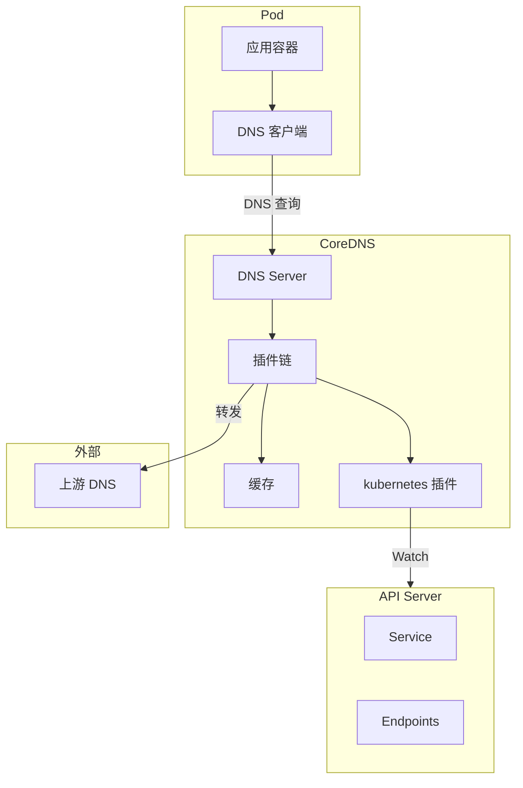
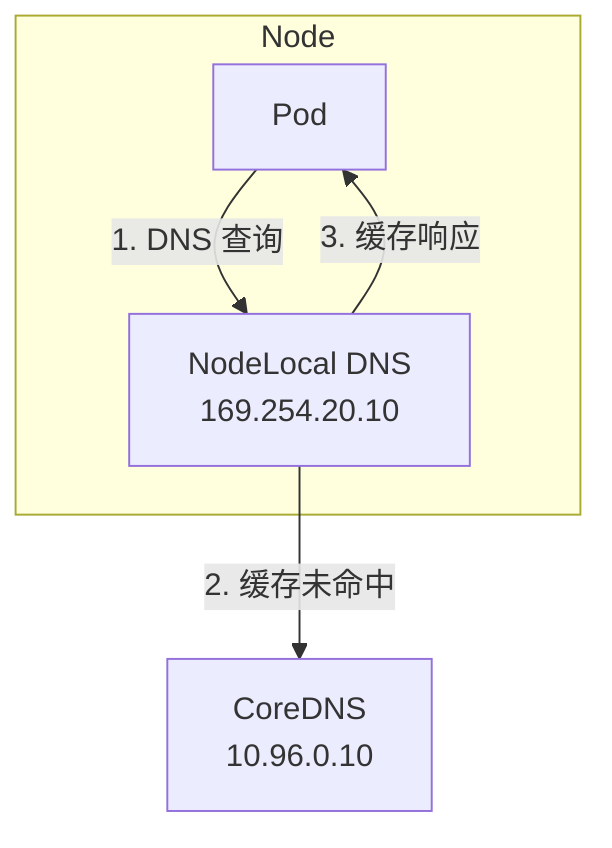

## 概述

CoreDNS 是 Kubernetes 集群的默认 DNS 服务器，负责为集群内的 Service 和 Pod 提供 DNS 解析服务。它通过插件化架构实现了高度可配置和可扩展的 DNS 功能，是 Kubernetes 服务发现机制的核心组成部分。

## CoreDNS 架构

### 整体架构



### 部署架构

```yaml
# CoreDNS Deployment
apiVersion: apps/v1
kind: Deployment
metadata:
  name: coredns
  namespace: kube-system
spec:
  replicas: 2
  strategy:
    type: RollingUpdate
    rollingUpdate:
      maxUnavailable: 1
  selector:
    matchLabels:
      k8s-app: kube-dns
  template:
    metadata:
      labels:
        k8s-app: kube-dns
    spec:
      priorityClassName: system-cluster-critical
      serviceAccountName: coredns
      tolerations:
        - key: "CriticalAddonsOnly"
          operator: "Exists"
      containers:
        - name: coredns
          image: registry.k8s.io/coredns/coredns:v1.11.1
          imagePullPolicy: IfNotPresent
          resources:
            limits:
              memory: 170Mi
            requests:
              cpu: 100m
              memory: 70Mi
          args: ["-conf", "/etc/coredns/Corefile"]
          volumeMounts:
            - name: config-volume
              mountPath: /etc/coredns
              readOnly: true
          ports:
            - containerPort: 53
              name: dns
              protocol: UDP
            - containerPort: 53
              name: dns-tcp
              protocol: TCP
            - containerPort: 9153
              name: metrics
              protocol: TCP
          securityContext:
            allowPrivilegeEscalation: false
            capabilities:
              add:
                - NET_BIND_SERVICE
              drop:
                - all
            readOnlyRootFilesystem: true
          livenessProbe:
            httpGet:
              path: /health
              port: 8080
              scheme: HTTP
            initialDelaySeconds: 60
            timeoutSeconds: 5
          readinessProbe:
            httpGet:
              path: /ready
              port: 8181
              scheme: HTTP
      volumes:
        - name: config-volume
          configMap:
            name: coredns
            items:
              - key: Corefile
                path: Corefile
---
# CoreDNS Service
apiVersion: v1
kind: Service
metadata:
  name: kube-dns
  namespace: kube-system
  labels:
    k8s-app: kube-dns
spec:
  selector:
    k8s-app: kube-dns
  clusterIP: 10.96.0.10  # 固定 ClusterIP
  ports:
    - name: dns
      port: 53
      protocol: UDP
    - name: dns-tcp
      port: 53
      protocol: TCP
    - name: metrics
      port: 9153
      protocol: TCP
```

## Corefile 配置

### 默认配置

```
# Corefile
.:53 {
    # 错误日志
    errors

    # 健康检查端点
    health {
       lameduck 5s
    }

    # 就绪检查端点
    ready

    # Kubernetes 服务发现
    kubernetes cluster.local in-addr.arpa ip6.arpa {
       pods insecure
       fallthrough in-addr.arpa ip6.arpa
       ttl 30
    }

    # Prometheus 指标
    prometheus :9153

    # 上游 DNS 转发
    forward . /etc/resolv.conf {
       max_concurrent 1000
    }

    # DNS 缓存
    cache 30

    # 循环检测
    loop

    # 重新加载配置
    reload

    # 负载均衡
    loadbalance
}
```

### 配置详解

```
┌─────────────────────────────────────────────────────────────────┐
│                    Corefile 插件说明                             │
├─────────────────────────────────────────────────────────────────┤
│                                                                  │
│  errors                                                          │
│    记录错误日志                                                   │
│                                                                  │
│  health                                                          │
│    HTTP 健康检查端点 (:8080/health)                              │
│    lameduck: 关闭前的等待时间                                    │
│                                                                  │
│  ready                                                           │
│    就绪检查端点 (:8181/ready)                                    │
│                                                                  │
│  kubernetes                                                      │
│    Kubernetes 服务发现插件                                       │
│    pods insecure: 允许 Pod DNS 反向解析                          │
│    fallthrough: 未匹配时传递给下一个插件                          │
│                                                                  │
│  prometheus                                                      │
│    Prometheus 指标端点 (:9153/metrics)                           │
│                                                                  │
│  forward                                                         │
│    转发未匹配的查询到上游 DNS                                    │
│                                                                  │
│  cache                                                           │
│    DNS 响应缓存（秒）                                            │
│                                                                  │
│  loop                                                            │
│    检测并阻止 DNS 转发循环                                       │
│                                                                  │
│  reload                                                          │
│    支持配置热重载                                                │
│                                                                  │
│  loadbalance                                                     │
│    轮询方式返回多个 A 记录                                       │
│                                                                  │
└─────────────────────────────────────────────────────────────────┘
```

## Kubernetes 插件

### DNS 记录类型

```
┌─────────────────────────────────────────────────────────────────┐
│                   Kubernetes DNS 记录                            │
├─────────────────────────────────────────────────────────────────┤
│                                                                  │
│  Service A 记录:                                                 │
│  <service>.<namespace>.svc.cluster.local → ClusterIP            │
│  例: nginx.default.svc.cluster.local → 10.96.0.100              │
│                                                                  │
│  Headless Service A 记录:                                        │
│  <service>.<namespace>.svc.cluster.local → Pod IPs              │
│  例: mysql.default.svc.cluster.local → 10.244.1.2, 10.244.2.3   │
│                                                                  │
│  StatefulSet Pod A 记录:                                         │
│  <pod>.<service>.<namespace>.svc.cluster.local → Pod IP         │
│  例: mysql-0.mysql.default.svc.cluster.local → 10.244.1.2       │
│                                                                  │
│  Service SRV 记录:                                               │
│  _<port>._<protocol>.<service>.<namespace>.svc.cluster.local    │
│  例: _http._tcp.nginx.default.svc.cluster.local                 │
│                                                                  │
│  Pod A 记录 (需要启用):                                          │
│  <pod-ip>.<namespace>.pod.cluster.local                         │
│  例: 10-244-1-2.default.pod.cluster.local → 10.244.1.2          │
│                                                                  │
│  ExternalName CNAME 记录:                                        │
│  <service>.<namespace>.svc.cluster.local → external FQDN        │
│  例: db.default.svc.cluster.local → db.example.com              │
│                                                                  │
└─────────────────────────────────────────────────────────────────┘
```

### kubernetes 插件实现

```go
// plugin/kubernetes/kubernetes.go

// Kubernetes 插件
type Kubernetes struct {
    Next          plugin.Handler
    Zones         []string
    Upstream      *upstream.Upstream
    APIServer     string
    APICertAuth   string
    APIClientCert string
    APIClientKey  string
    APIConn       dnsController
    Namespaces    map[string]struct{}
    podMode       string
    TTL           uint32
}

// ServeDNS 处理 DNS 请求
func (k Kubernetes) ServeDNS(ctx context.Context, w dns.ResponseWriter, r *dns.Msg) (int, error) {
    state := request.Request{W: w, Req: r}

    // 检查是否属于管理的区域
    zone := plugin.Zones(k.Zones).Matches(state.Name())
    if zone == "" {
        return plugin.NextOrFailure(k.Name(), k.Next, ctx, w, r)
    }

    // 解析查询名称
    qname := state.Name()
    qtype := state.QType()

    // 处理不同类型的查询
    switch qtype {
    case dns.TypeA, dns.TypeAAAA:
        return k.resolveA(ctx, state, zone)
    case dns.TypeSRV:
        return k.resolveSRV(ctx, state, zone)
    case dns.TypePTR:
        return k.resolvePTR(ctx, state, zone)
    }

    return dns.RcodeNameError, nil
}

// resolveA 解析 A 记录
func (k Kubernetes) resolveA(ctx context.Context, state request.Request, zone string) (int, error) {
    // 解析查询名称
    // 格式: <service>.<namespace>.svc.<zone>
    // 或: <pod>.<service>.<namespace>.svc.<zone>

    segments := dns.SplitDomainName(state.Name())
    if len(segments) < 4 {
        return dns.RcodeNameError, nil
    }

    // 提取 service 和 namespace
    service := segments[0]
    namespace := segments[1]

    // 查询 Service
    svc, err := k.APIConn.SvcIndex(object.ServiceKey(service, namespace))
    if err != nil {
        return dns.RcodeServerFailure, err
    }
    if svc == nil {
        return dns.RcodeNameError, nil
    }

    // 构建响应
    m := new(dns.Msg)
    m.SetReply(state.Req)

    if svc.ClusterIP == v1.ClusterIPNone {
        // Headless Service：返回所有 Pod IP
        endpoints := k.APIConn.EpIndex(object.EndpointsKey(service, namespace))
        for _, ep := range endpoints {
            for _, addr := range ep.Addresses {
                m.Answer = append(m.Answer, &dns.A{
                    Hdr: dns.RR_Header{
                        Name:   state.QName(),
                        Rrtype: dns.TypeA,
                        Class:  dns.ClassINET,
                        Ttl:    k.TTL,
                    },
                    A: net.ParseIP(addr),
                })
            }
        }
    } else {
        // 普通 Service：返回 ClusterIP
        m.Answer = append(m.Answer, &dns.A{
            Hdr: dns.RR_Header{
                Name:   state.QName(),
                Rrtype: dns.TypeA,
                Class:  dns.ClassINET,
                Ttl:    k.TTL,
            },
            A: net.ParseIP(svc.ClusterIP),
        })
    }

    w.WriteMsg(m)
    return dns.RcodeSuccess, nil
}
```

## Pod DNS 配置

### dnsPolicy 选项

```yaml
apiVersion: v1
kind: Pod
metadata:
  name: dns-example
spec:
  containers:
    - name: test
      image: nginx
  # DNS 策略
  dnsPolicy: ClusterFirst  # 默认
```

| 策略 | 行为 |
|------|------|
| ClusterFirst | 优先使用集群 DNS，不匹配则转发到上游 |
| ClusterFirstWithHostNet | 使用 hostNetwork 时同 ClusterFirst |
| Default | 继承节点的 DNS 配置 |
| None | 忽略 Kubernetes DNS，需要自定义 dnsConfig |

### 自定义 DNS 配置

```yaml
apiVersion: v1
kind: Pod
metadata:
  name: custom-dns
spec:
  containers:
    - name: test
      image: nginx
  dnsPolicy: None
  dnsConfig:
    # 自定义 DNS 服务器
    nameservers:
      - 10.96.0.10    # CoreDNS
      - 8.8.8.8       # Google DNS
    # 搜索域
    searches:
      - default.svc.cluster.local
      - svc.cluster.local
      - cluster.local
    # DNS 选项
    options:
      - name: ndots
        value: "5"
      - name: timeout
        value: "2"
      - name: attempts
        value: "3"
```

### resolv.conf 生成

Kubelet 为每个 Pod 生成 /etc/resolv.conf：

```bash
# Pod 内 /etc/resolv.conf
nameserver 10.96.0.10
search default.svc.cluster.local svc.cluster.local cluster.local
options ndots:5
```

```go
// pkg/kubelet/network/dns/dns.go

// GetPodDNS 获取 Pod DNS 配置
func (c *Configurer) GetPodDNS(pod *v1.Pod) (*runtimeapi.DNSConfig, error) {
    dnsConfig := &runtimeapi.DNSConfig{}

    switch pod.Spec.DNSPolicy {
    case v1.DNSClusterFirstWithHostNet:
        fallthrough
    case v1.DNSClusterFirst:
        // 使用集群 DNS
        dnsConfig.Servers = []string{c.clusterDNS.String()}
        dnsConfig.Searches = c.generateSearches(pod.Namespace)
        dnsConfig.Options = c.defaultDNSOptions()

    case v1.DNSDefault:
        // 使用节点 DNS
        dnsConfig = c.getHostDNSConfig()

    case v1.DNSNone:
        // 只使用 dnsConfig
    }

    // 合并用户自定义配置
    if pod.Spec.DNSConfig != nil {
        dnsConfig = mergeDNSConfig(dnsConfig, pod.Spec.DNSConfig)
    }

    return dnsConfig, nil
}

// generateSearches 生成搜索域
func (c *Configurer) generateSearches(namespace string) []string {
    // 搜索域顺序：
    // 1. <namespace>.svc.<cluster-domain>
    // 2. svc.<cluster-domain>
    // 3. <cluster-domain>
    // 4. 节点搜索域（可选）

    searches := []string{
        fmt.Sprintf("%s.svc.%s", namespace, c.clusterDomain),
        fmt.Sprintf("svc.%s", c.clusterDomain),
        c.clusterDomain,
    }

    return searches
}
```

## 高级配置

### 自定义域配置

```
# Corefile - 添加自定义域
example.com:53 {
    forward . 10.0.0.53
}

.:53 {
    kubernetes cluster.local
    forward . /etc/resolv.conf
    cache 30
}
```

### Stub Domain 配置

```yaml
apiVersion: v1
kind: ConfigMap
metadata:
  name: coredns
  namespace: kube-system
data:
  Corefile: |
    .:53 {
        kubernetes cluster.local
        forward . /etc/resolv.conf
        cache 30
    }
    # Stub domain for internal services
    corp.example.com:53 {
        forward . 10.10.0.53
    }
```

### 上游 DNS 配置

```
# Corefile - 多上游 DNS
.:53 {
    kubernetes cluster.local
    forward . 8.8.8.8 8.8.4.4 {
        policy round_robin
        health_check 5s
    }
    cache 30
}
```

## 性能优化

### 缓存配置

```
# 增加缓存时间
.:53 {
    cache 300 {
        success 9984 300  # 成功响应缓存 300 秒
        denial 9984 5     # 否定响应缓存 5 秒
        prefetch 10 1h    # 预取热门域名
    }
}
```

### 本地 DNS 缓存

使用 NodeLocal DNSCache 减少跨节点 DNS 查询：

```yaml
# NodeLocal DNSCache DaemonSet
apiVersion: apps/v1
kind: DaemonSet
metadata:
  name: node-local-dns
  namespace: kube-system
spec:
  selector:
    matchLabels:
      k8s-app: node-local-dns
  template:
    metadata:
      labels:
        k8s-app: node-local-dns
    spec:
      hostNetwork: true
      dnsPolicy: Default
      containers:
        - name: node-cache
          image: registry.k8s.io/dns/k8s-dns-node-cache:1.22.20
          args:
            - "-localip"
            - "169.254.20.10"  # 本地 DNS 缓存 IP
            - "-conf"
            - "/etc/Corefile"
            - "-upstreamsvc"
            - "kube-dns"
```



### ndots 优化

```yaml
# 减少 ndots 值以减少不必要的搜索
apiVersion: v1
kind: Pod
spec:
  dnsConfig:
    options:
      - name: ndots
        value: "2"  # 默认是 5
```

```
ndots 影响：
- 查询 "google.com"，ndots=5 时会先尝试:
  google.com.default.svc.cluster.local
  google.com.svc.cluster.local
  google.com.cluster.local
  然后才查询 google.com

- ndots=2 时，google.com 直接查询外部 DNS
```

## 监控与调试

### Prometheus 指标

```yaml
# 关键指标
- coredns_dns_requests_total           # DNS 请求总数
- coredns_dns_responses_total          # DNS 响应总数（按 rcode）
- coredns_dns_request_duration_seconds # 请求延迟
- coredns_cache_hits_total             # 缓存命中
- coredns_cache_misses_total           # 缓存未命中
- coredns_forward_requests_total       # 转发请求数
- coredns_forward_responses_total      # 转发响应数
```

### 日志配置

```
# 启用查询日志
.:53 {
    log
    kubernetes cluster.local
}

# 或只记录错误
.:53 {
    errors
    kubernetes cluster.local
}
```

### 调试命令

```bash
# 测试 DNS 解析
kubectl run -it --rm debug --image=busybox --restart=Never -- nslookup kubernetes.default

# 查看 CoreDNS 日志
kubectl logs -n kube-system -l k8s-app=kube-dns

# 检查 CoreDNS 配置
kubectl get cm coredns -n kube-system -o yaml

# 使用 dig 测试
kubectl run -it --rm debug --image=tutum/dnsutils --restart=Never -- \
  dig @10.96.0.10 kubernetes.default.svc.cluster.local

# 检查 Pod DNS 配置
kubectl exec <pod> -- cat /etc/resolv.conf
```

### 常见问题排查

```
┌─────────────────────────────────────────────────────────────────┐
│                   DNS 常见问题                                   │
├─────────────────────────────────────────────────────────────────┤
│                                                                  │
│  问题 1: DNS 解析失败                                            │
│  ├── 检查 CoreDNS Pod 是否运行                                   │
│  ├── 检查 kube-dns Service 是否存在                              │
│  └── 验证网络策略是否阻止 DNS 流量                               │
│                                                                  │
│  问题 2: DNS 解析慢                                              │
│  ├── 检查 ndots 配置                                             │
│  ├── 启用 NodeLocal DNS Cache                                   │
│  └── 增加 CoreDNS 副本数                                         │
│                                                                  │
│  问题 3: 外部域名解析失败                                        │
│  ├── 检查 forward 插件配置                                       │
│  ├── 验证上游 DNS 可达                                           │
│  └── 检查节点 /etc/resolv.conf                                   │
│                                                                  │
└─────────────────────────────────────────────────────────────────┘
```

## 总结

CoreDNS 是 Kubernetes DNS 的核心：
- **插件化架构**：高度可配置和可扩展
- **服务发现**：为 Service 和 Pod 提供 DNS 记录
- **灵活配置**：支持多种 DNS 策略和自定义域
- **性能优化**：缓存、预取、本地 DNS 缓存

最佳实践：
- 使用 NodeLocal DNSCache 减少延迟
- 优化 ndots 配置减少无效查询
- 监控 DNS 指标及时发现问题
- 合理配置缓存提高性能
